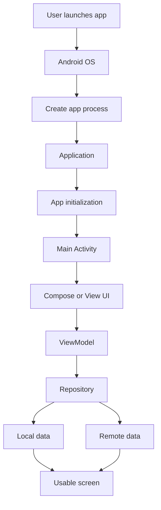
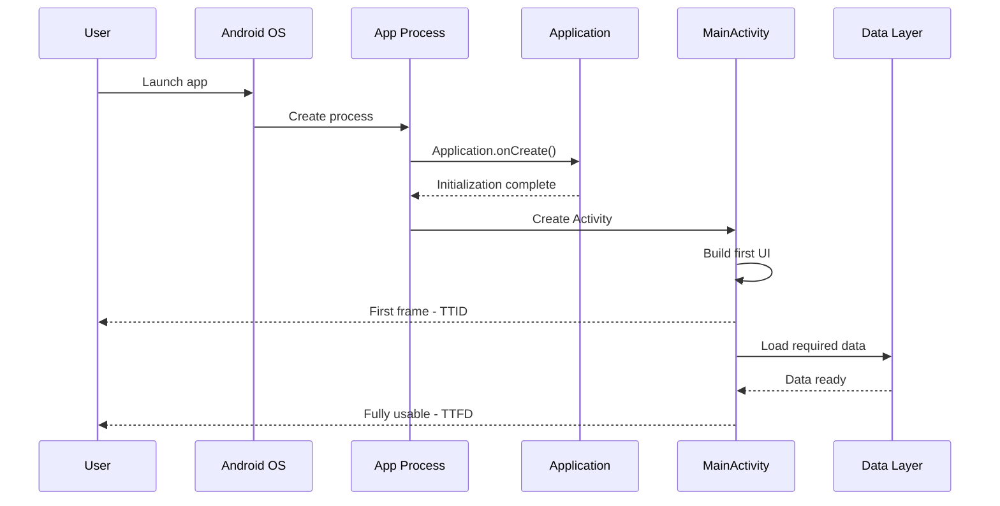
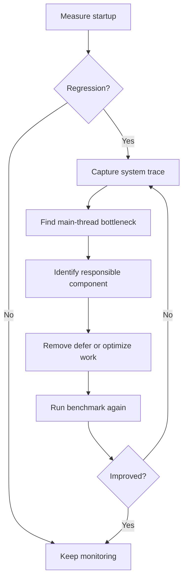

# 017 - Startup Time

**Học phần:** 05 - Quality, Release and Portfolio
**Module:** Module 10 - Linting, Debugging and Benchmark
**Nhóm nội dung:** Performance
**Nguồn roadmap:** Linting, Debugging and Benchmark / Performance
**Loại bài:** quality
**Thứ tự trong module:** 017
**Thời lượng gợi ý:** 30 phút

---

## 1. Tóm tắt

**Startup Time** là khoảng thời gian từ khi người dùng hoặc hệ thống yêu cầu mở ứng dụng cho đến khi giao diện đầu tiên xuất hiện và ứng dụng đạt trạng thái đủ sẵn sàng để người dùng tương tác.

Đây là một chỉ số performance quan trọng vì startup diễn ra ngay tại điểm tiếp xúc đầu tiên giữa người dùng và ứng dụng. Nếu app mở chậm, đứng ở splash screen quá lâu hoặc giao diện xuất hiện nhưng chưa thể thao tác, người dùng có thể cảm nhận ứng dụng là nặng hoặc thiếu ổn định.

Trong Android, startup không chỉ liên quan đến `Activity`. Nó có thể bao gồm quá trình tạo process, khởi tạo `Application`, Content Provider, Dependency Injection, SDK bên thứ ba, tạo `Activity`, dựng Compose/View hierarchy, đọc dữ liệu local và tải dữ liệu cần thiết cho màn hình đầu tiên.

Android hiện phân biệt hai mốc quan trọng là **TTID — Time to Initial Display** và **TTFD — Time to Full Display**. TTID phản ánh thời điểm frame đầu tiên xuất hiện, còn TTFD phản ánh thời điểm ứng dụng thực sự sẵn sàng để sử dụng.

Một Android Developer cần không chỉ biết app mở trong bao lâu mà còn phải xác định được:

* thời gian đang bị tiêu tốn ở đâu;
* công việc nào đang chặn main thread;
* thành phần nào thực sự cần thiết trong startup path;
* có thể trì hoãn initialization nào;
* thay đổi tối ưu có thực sự cải thiện performance hay không.

---

## 2. Mục tiêu học tập

Sau bài học, người học có thể:

* giải thích được khái niệm **Startup Time** trong Android;
* phân biệt `cold start`, `warm start` và `hot start`;
* phân biệt `TTID` và `TTFD`;
* mô tả các bước chính trong quá trình Android khởi động ứng dụng;
* xác định các nguyên nhân phổ biến làm startup chậm;
* sử dụng `Macrobenchmark` và `StartupTimingMetric` để đo startup;
* sử dụng `ReportDrawnWhen` khi cần xác định trạng thái fully drawn trong Jetpack Compose;
* phân tích startup bằng Android Studio, Logcat hoặc system trace;
* xây dựng chiến lược tối ưu startup mà không làm sai lifecycle hoặc data flow;
* tạo báo cáo benchmark trước và sau tối ưu để đưa vào portfolio.

---

## 3. Khái niệm cốt lõi

### 3.1. Cold start, warm start và hot start

Android có ba trạng thái startup chính.

| Startup    | Trạng thái trước khi mở app                      | Công việc hệ thống cần thực hiện                        | Chi phí tương đối |
| ---------- | ------------------------------------------------ | ------------------------------------------------------- | ----------------- |
| Cold start | Process chưa tồn tại                             | Tạo process, tạo `Application`, tạo `Activity`, dựng UI | Cao nhất          |
| Warm start | Process còn tồn tại nhưng `Activity` cần tạo lại | Tạo hoặc khôi phục `Activity`, dựng UI                  | Trung bình        |
| Hot start  | Process và `Activity` vẫn còn                    | Đưa app trở lại foreground                              | Thấp nhất         |

**Cold start** thường là trường hợp quan trọng nhất khi tối ưu vì đây là startup path có nhiều công việc nhất. Android cũng khuyến nghị xem cold start như trường hợp cơ sở khi phân tích performance.

Ví dụ cold start có thể xảy ra khi:

* người dùng mở app lần đầu sau khi khởi động thiết bị;
* app đã bị Android kill để thu hồi memory;
* developer force-stop app trước khi benchmark.

Warm và hot start thường nhanh hơn vì hệ thống có thể tái sử dụng một phần state hoặc process đã tồn tại.

### 3.2. TTID và TTFD

Hai metric quan trọng khi đánh giá Startup Time là:

| Metric | Ý nghĩa                                                                          |
| ------ | -------------------------------------------------------------------------------- |
| `TTID` | Thời gian từ launch request đến frame UI đầu tiên                                |
| `TTFD` | Thời gian từ launch request đến khi app thực sự sẵn sàng để người dùng tương tác |

`TTID` thấp giúp người dùng nhanh chóng thấy rằng ứng dụng đã phản hồi.

`TTFD` thấp giúp tránh tình trạng:

> Giao diện đã hiện nhưng nút chưa hoạt động, dữ liệu quan trọng chưa tải xong hoặc màn hình vẫn chưa thực sự usable.

`StartupTimingMetric` của Macrobenchmark có thể báo cáo `timeToInitialDisplayMs` và `timeToFullDisplayMs`. Khi phân tích nhiều lần chạy benchmark, Android khuyến nghị tập trung vào **median** thay vì chỉ nhìn một lần đo đơn lẻ.

---

## 4. Startup Time nằm ở đâu trong kiến trúc Android

Startup là một đường đi xuyên qua nhiều tầng của ứng dụng.



Trong cold start, Android có thể phải tạo process mới trước khi code ứng dụng được thực thi.

Sau đó:

1. `Application` được tạo.
2. Các thành phần initialization cần thiết được chạy.
3. Launcher `Activity` được tạo.
4. Compose hoặc View hierarchy được dựng.
5. Frame đầu tiên được render.
6. Dữ liệu quan trọng tiếp tục được tải.
7. UI đạt trạng thái usable.

Một startup chậm không nhất thiết có nghĩa `MainActivity` chậm. Bottleneck có thể xuất hiện trước cả `Activity`, chẳng hạn:

* SDK initialization;
* database initialization;
* Dependency Injection graph;
* Content Provider;
* synchronous disk I/O;
* class loading;
* code compilation;
* object creation quá lớn.

---

## 5. Quá trình cold startup

Một cold start điển hình có thể được hình dung như sau:



Điểm quan trọng là:

```text
Launch
  ↓
Process creation
  ↓
Application initialization
  ↓
Activity creation
  ↓
First frame
  ↓
TTID
  ↓
Primary data / UI preparation
  ↓
TTFD
```

TTID và TTFD không nên bị đánh đồng.

Một app có thể có TTID rất tốt nhưng TTFD kém nếu developer chỉ nhanh chóng hiển thị một màn hình loading rồi thực hiện quá nhiều công việc phía sau.

---

## 6. Nguyên nhân phổ biến làm startup chậm

### 6.1. Quá nhiều công việc trong `Application`

`Application.onCreate()` nằm rất sớm trong startup path.

Nếu developer đặt quá nhiều initialization ở đây:

```kotlin
class MyApplication : Application() {

    override fun onCreate() {
        super.onCreate()

        initializeAnalytics()
        initializeAds()
        initializeDatabase()
        loadLargeConfiguration()
        readFilesFromDisk()
        preloadEverything()
    }
}
```

thì launcher `Activity` phải chờ một lượng công việc đáng kể trước khi giao diện có thể xuất hiện.

Không phải SDK nào cũng cần initialize ngay khi app mở.

Nên phân loại initialization thành:

* bắt buộc trước first frame;
* cần sớm nhưng có thể chạy sau;
* chỉ cần khi người dùng mở một feature cụ thể.

### 6.2. Chặn main thread

Các tác vụ sau đặc biệt nguy hiểm khi chạy đồng bộ trên main thread:

* đọc file lớn;
* query database phức tạp;
* parse JSON lớn;
* giải mã dữ liệu;
* network request;
* tạo nhiều object;
* load bitmap lớn;
* tính toán CPU-intensive.

Ví dụ không nên:

```kotlin
override fun onCreate(savedInstanceState: Bundle?) {
    super.onCreate(savedInstanceState)

    val largeData = repository.loadLargeFileSynchronously()

    setContent {
        MainScreen(data = largeData)
    }
}
```

Thay vào đó, UI nên được dựng trước và dữ liệu được đưa qua một state phù hợp.

```kotlin
class MainViewModel(
    private val repository: MainRepository
) : ViewModel() {

    private val _uiState = MutableStateFlow<MainUiState>(
        MainUiState.Loading
    )

    val uiState: StateFlow<MainUiState> = _uiState

    init {
        viewModelScope.launch {
            _uiState.value = repository.loadHomeData()
        }
    }
}
```

UI có thể phản hồi ngay với trạng thái loading thay vì block toàn bộ quá trình render.

### 6.3. Initialization không cần thiết

Một lỗi kiến trúc phổ biến là:

```text
App startup
    ↓
Initialize everything
    ↓
User may never use most features
```

Ví dụ một app có các tính năng:

* payment;
* map;
* analytics;
* video;
* chat;
* recommendation;

không nhất thiết phải initialize toàn bộ SDK cho các feature này trước khi màn hình Home xuất hiện.

Cách tiếp cận tốt hơn:

```text
Startup
   ↓
Initialize critical components
   ↓
Show first screen
   ↓
Initialize deferred components
   ↓
Initialize feature-specific SDK when needed
```

---

## 7. Đo Startup Time

### 7.1. Android vitals và Logcat

Android vitals trong Play Console có thể cảnh báo khi startup của ứng dụng trở nên quá chậm.

Theo tài liệu Android hiện tại, startup được Android vitals xem là **excessive** khi TTID đạt khoảng:

* cold startup: `5 giây` trở lên;
* warm startup: `2 giây` trở lên;
* hot startup: `1,5 giây` trở lên.

> **Lưu ý:** Đây là ngưỡng để phát hiện startup quá chậm, không phải mục tiêu performance mà ứng dụng nên cố gắng đạt sát ngưỡng.

Trong quá trình development, TTID cũng có thể xuất hiện trong Logcat dưới dạng `Displayed`.

Ví dụ:

```text
ActivityManager: Displayed com.example.app/.MainActivity: +1s234ms
```

Giá trị này hữu ích để kiểm tra nhanh, nhưng không nên dùng một lần đo duy nhất làm kết luận performance.

### 7.2. Macrobenchmark

Để đo startup có tính lặp lại, nên sử dụng **Jetpack Macrobenchmark**.

`StartupTimingMetric` có thể đo:

* `timeToInitialDisplayMs`;
* `timeToFullDisplayMs`.

Macrobenchmark hỗ trợ các startup mode:

* `StartupMode.COLD`;
* `StartupMode.WARM`;
* `StartupMode.HOT`.

Benchmark nên chạy nhiều lần để giảm ảnh hưởng của noise.

Đối với performance benchmark thực tế, Android khuyến nghị chạy trên **physical device** vì emulator chia sẻ tài nguyên với máy host và có thể cho kết quả không đại diện cho thiết bị thật.

### 7.3. System trace và Android Studio

Khi benchmark phát hiện startup chậm, bước tiếp theo không phải đo thêm vô hạn mà là tìm bottleneck.

Có thể kiểm tra:

* main thread activity;
* `Application.onCreate()`;
* Activity lifecycle;
* Compose composition;
* disk I/O;
* class loading;
* Binder transactions;
* SDK initialization;
* database work.

Đối với Jetpack Compose, trace có thể cho thấy các vùng như:

* `Compose:recompose`;
* `Compose:layout`;
* `Compose:draw`.

Các trace này giúp phân biệt vấn đề nằm ở initialization hay rendering.

---

## 8. Benchmark cold startup với Macrobenchmark

Một benchmark tối thiểu có thể có dạng:

```kotlin
@RunWith(AndroidJUnit4::class)
class StartupBenchmark {

    @get:Rule
    val benchmarkRule = MacrobenchmarkRule()

    @Test
    fun coldStartup() {
        benchmarkRule.measureRepeated(
            packageName = "com.example.app",
            metrics = listOf(
                StartupTimingMetric()
            ),
            startupMode = StartupMode.COLD,
            compilationMode = CompilationMode.None(),
            iterations = 10,
            setupBlock = {
                pressHome()
            }
        ) {
            startActivityAndWait()
        }
    }
}
```

Ý nghĩa của test:

1. đưa app về trạng thái phù hợp;
2. khởi chạy ứng dụng bằng cold startup;
3. thu thập startup timing;
4. lặp lại nhiều lần;
5. tổng hợp kết quả benchmark.

Không nên chỉ ghi:

```text
Startup = 423 ms
```

rồi kết luận app nhanh hơn.

Nên ghi:

```text
Before optimization
Median TTID: ...

After optimization
Median TTID: ...

Improvement: ...
```

Cần giữ cùng:

* thiết bị;
* build type;
* startup mode;
* compilation mode;
* benchmark scenario;

khi so sánh hai phiên bản.

---

## 9. Đo trạng thái fully drawn

TTFD chỉ có ý nghĩa khi ứng dụng xác định đúng lúc UI thực sự usable.

Với Jetpack Compose, Android cung cấp các API:

* `ReportDrawn`;
* `ReportDrawnWhen`;
* `ReportDrawnAfter`.

`ReportDrawnWhen` nhận một predicate và chỉ báo fully drawn khi điều kiện đó trở thành `true`.

Ví dụ màn hình Home chỉ được coi là usable sau khi dữ liệu quan trọng đã tải:

```kotlin
@Composable
fun HomeScreen(
    uiState: HomeUiState
) {
    ReportDrawnWhen {
        uiState is HomeUiState.Success
    }

    when (uiState) {
        HomeUiState.Loading -> {
            CircularProgressIndicator()
        }

        is HomeUiState.Success -> {
            HomeContent(
                items = uiState.items
            )
        }

        is HomeUiState.Error -> {
            ErrorContent()
        }
    }
}
```

Flow tương ứng:

```text
Launch
   ↓
First Compose frame
   ↓
TTID
   ↓
Load critical home data
   ↓
HomeUiState.Success
   ↓
ReportDrawnWhen = true
   ↓
TTFD
```

Điều quan trọng là không báo fully drawn quá sớm chỉ để metric trông đẹp hơn.

---

## 10. Chiến lược tối ưu Startup Time

### 10.1. Giảm startup critical path

Critical path là chuỗi công việc bắt buộc phải hoàn thành trước khi app đạt một mốc startup.

Ví dụ:

```text
Application
   ↓
Database init
   ↓
Analytics init
   ↓
Remote config
   ↓
Large JSON parse
   ↓
Activity
```

Nếu mọi thứ đều nằm trên critical path thì startup sẽ tăng theo tổng chi phí của chúng.

Nên đặt câu hỏi với từng tác vụ:

> Công việc này có thực sự phải hoàn thành trước first frame không?

Nếu không, hãy cân nhắc defer.

### 10.2. Lazy initialization

Thay vì:

```text
App start
  ↓
Initialize feature A
Initialize feature B
Initialize feature C
Initialize feature D
```

có thể chuyển thành:

```text
App start
  ↓
Critical initialization
  ↓
First screen
  ├── Feature A opened → initialize A
  ├── Feature B opened → initialize B
  └── Idle/background → initialize low-priority components
```

Lazy initialization đặc biệt hữu ích với:

* analytics phụ;
* map SDK;
* payment SDK;
* recommendation engine;
* video player;
* các feature hiếm khi được mở.

### 10.3. Tối ưu first screen

Màn hình đầu tiên nên ưu tiên:

* UI structure đơn giản;
* resource cần thiết;
* state nhỏ;
* dữ liệu critical.

Không nên bắt startup phải đợi toàn bộ:

* feed;
* recommendation;
* quảng cáo;
* lịch sử;
* notification;
* background synchronization;

nếu chúng không cần để người dùng bắt đầu tương tác.

---

## 11. Baseline Profiles và Startup Profiles

**Baseline Profiles** giúp Android Runtime biết trước những code path quan trọng để có thể tối ưu compilation, từ đó cải thiện startup và các Critical User Journey.

Android khuyến nghị benchmark Baseline Profile bằng Macrobenchmark thay vì chỉ giả định rằng thêm profile sẽ tự động làm app nhanh hơn.

Flow có thể là:

```text
Critical User Journey
        ↓
Generate Baseline Profile
        ↓
Build release
        ↓
Install profile
        ↓
Macrobenchmark
        ↓
Compare startup metrics
```

Ngoài Baseline Profiles, **Startup Profiles** có thể hỗ trợ tối ưu DEX layout cho code được sử dụng trong startup path. Tài liệu Android hiện cho biết Startup Profiles có thể cải thiện startup thêm đáng kể trong các trường hợp phù hợp, nhưng hiệu quả thực tế vẫn cần được benchmark trên chính ứng dụng.

> **Nguyên tắc:** Không coi một optimization technique là thành công nếu chưa đo trước và sau thay đổi.

---

## 12. Lỗi thường gặp

### 12.1. Chỉ đo một lần

**Hiện tượng:** Developer chạy app một lần và ghi lại startup time.

**Nguyên nhân:** Startup chịu ảnh hưởng bởi compilation state, cache, scheduler, thiết bị và workload hệ thống.

**Cách xử lý:** Sử dụng benchmark lặp lại và ưu tiên median.

### 12.2. Benchmark bằng debug build

**Hiện tượng:** Kết quả startup rất chậm nhưng không phản ánh production.

**Nguyên nhân:** Debug build có instrumentation và optimization khác release.

**Cách xử lý:** Dùng benchmark configuration phù hợp và đánh giá performance gần điều kiện production.

### 12.3. Benchmark trên emulator rồi coi là số liệu production

**Hiện tượng:** Kết quả thay đổi mạnh giữa các lần chạy hoặc không tương ứng với thiết bị thật.

**Nguyên nhân:** Emulator chia sẻ CPU, memory và các resource khác với host.

**Cách xử lý:** Dùng physical device cho benchmark performance chính thức.

### 12.4. Tối ưu TTID nhưng bỏ quên TTFD

**Hiện tượng:** App hiển thị splash hoặc skeleton rất nhanh nhưng phải chờ lâu mới sử dụng được.

**Nguyên nhân:** Developer chỉ tập trung vào first frame.

**Cách xử lý:** Đo cả TTID và TTFD.

### 12.5. Đưa network request vào startup critical path

**Hiện tượng:** Startup thay đổi mạnh theo tốc độ mạng.

**Nguyên nhân:** UI đầu tiên phụ thuộc trực tiếp vào network.

**Cách xử lý:** Thiết kế loading state, cache hoặc local-first strategy khi phù hợp.

---

## 13. Best practices

* Ưu tiên tối ưu cold startup.
* Giữ `Application.onCreate()` nhẹ.
* Không thực hiện synchronous network request trên main thread.
* Tránh disk I/O lớn trong startup path.
* Không initialize mọi SDK chỉ vì chúng được sử dụng ở đâu đó trong app.
* Lazy-init các component không cần ngay.
* Tách dữ liệu critical và non-critical.
* Hiển thị UI có ý nghĩa càng sớm càng tốt.
* Không đánh đổi tính đúng đắn của UI chỉ để làm metric đẹp.
* Theo dõi cả TTID và TTFD.
* Dùng Macrobenchmark cho các phép đo có thể lặp lại.
* Benchmark trên thiết bị thật.
* Giữ điều kiện benchmark nhất quán giữa before và after.
* Dùng system trace để tìm bottleneck trước khi tối ưu.
* Đánh giá Baseline Profile bằng số liệu thực tế.
* Theo dõi startup metric sau release thay vì chỉ đo trong development.

---

## 14. Testing và quality gate

Một chiến lược test Startup Time nên bao gồm các tình huống sau:

| Test case          | Kết quả mong đợi                                   |
| ------------------ | -------------------------------------------------- |
| Cold startup       | App mở thành công, không block bất thường          |
| Warm startup       | State được khôi phục đúng                          |
| Hot startup        | App trở lại foreground nhanh                       |
| Không có Internet  | Startup không bị treo                              |
| API chậm           | First screen vẫn xử lý loading hợp lý              |
| Database lớn       | Main thread không bị block dài                     |
| Cache rỗng         | App vẫn startup đúng                               |
| Cache có dữ liệu   | Có thể tận dụng dữ liệu local                      |
| SDK bên thứ ba lỗi | App không crash khi startup                        |
| Low-end device     | Startup vẫn nằm trong performance budget của dự án |

Trong CI hoặc release process, có thể theo dõi benchmark result để phát hiện regression.

Ví dụ:

```text
Release N
Median cold TTID: 520 ms

Release N+1
Median cold TTID: 810 ms

Regression: +55.8%
```

Một thay đổi như vậy cần được điều tra ngay cả khi ứng dụng chưa vượt ngưỡng excessive của Android vitals.

---

## 15. Debugging workflow

Khi startup bị chậm, có thể áp dụng workflow sau:



Quy trình thực tế:

1. Đo startup trước khi sửa.
2. Xác định cold, warm hay hot startup đang có vấn đề.
3. Capture trace.
4. Tìm đoạn chiếm thời gian lớn.
5. Xác định code hoặc SDK chịu trách nhiệm.
6. Tối ưu một bottleneck cụ thể.
7. Benchmark lại.
8. So sánh median trước và sau.
9. Chỉ giữ optimization nếu có lợi và không gây regression chức năng.

---

## 16. Ví dụ thực tế

Giả sử một ứng dụng thương mại điện tử startup như sau:

```text
Application
   ↓
Initialize Analytics       120 ms
   ↓
Initialize Payment SDK     180 ms
   ↓
Open Database              140 ms
   ↓
Fetch Remote Config        350 ms
   ↓
Create Home                250 ms
```

Tổng critical path có thể trở nên rất lớn.

Sau khi phân tích:

* Payment SDK không cần trước khi vào checkout.
* Remote Config có thể sử dụng cached value trước.
* Analytics có thể defer nếu SDK cho phép.
* Database chỉ nên mở phần cần thiết.
* Home screen có thể render loading/skeleton trước.

Kiến trúc sau tối ưu:

```text
Application
   ↓
Critical init
   ↓
Home first frame
   ↓
TTID
   ├── Load local home data
   ├── Refresh remote config
   └── Deferred analytics init
   ↓
Home usable
   ↓
TTFD

Checkout opened
   ↓
Initialize payment SDK
```

Điểm quan trọng không phải là "xóa initialization", mà là đưa công việc ra khỏi startup critical path khi dependency thực tế cho phép.

---

## 17. Liên hệ với các chủ đề khác

Startup Time có quan hệ trực tiếp với nhiều chủ đề performance và architecture.

```text
Startup Time
├── Application lifecycle
├── Activity lifecycle
├── Main Thread
├── Coroutines
├── Compose rendering
├── Dependency Injection
├── Database
├── Network
├── Benchmark
├── Baseline Profiles
└── Release quality
```

Một kiến trúc tốt giúp startup dễ tối ưu hơn vì dependency và responsibility được tách rõ.

Ví dụ:

* `ViewModel` quản lý state của màn hình;
* `Repository` quyết định local/remote source;
* coroutine tránh block main thread;
* cache giảm phụ thuộc network;
* Macrobenchmark kiểm tra performance;
* Baseline Profiles tối ưu các code path quan trọng.

---

## 18. Bài thực hành

### 18.1. Yêu cầu

Tạo hoặc sử dụng một Android app có màn hình Home.

Thực hiện:

1. Tạo cold startup benchmark với `Macrobenchmark`.
2. Chạy benchmark ít nhất nhiều iteration thay vì một lần.
3. Ghi lại median TTID.
4. Xác định một công việc đang nằm trên startup path.
5. Chuyển công việc không critical sang lazy hoặc deferred initialization.
6. Chạy lại benchmark.
7. So sánh kết quả trước và sau.
8. Nếu ứng dụng sử dụng Compose và có dữ liệu async quan trọng, thêm `ReportDrawnWhen`.
9. Ghi lại TTID và TTFD.
10. Viết kết luận về optimization.

### 18.2. Kết quả mong đợi

Người học cần có một báo cáo dạng:

```text
Device:
Android version:
Build:
Startup mode:
Compilation mode:

Before
Median TTID:
Median TTFD:

Optimization:
- ...

After
Median TTID:
Median TTFD:

Result:
- TTID improvement:
- TTFD improvement:

Conclusion:
- ...
```

Không bắt buộc mọi optimization đều phải tạo improvement lớn.

Nếu kết quả gần như không thay đổi, cần giải thích:

> Bottleneck được tối ưu không nằm trên startup critical path hoặc chi phí của nó quá nhỏ so với tổng startup time.

---

## 19. Artifact cho portfolio

Tạo một thư mục hoặc phần README:

```text
startup-performance/
├── StartupBenchmark.kt
├── before-result.txt
├── after-result.txt
├── startup-trace.png
└── README.md
```

`README.md` nên trình bày:

* vấn đề startup ban đầu;
* thiết bị benchmark;
* startup mode;
* metric được sử dụng;
* bottleneck phát hiện được;
* thay đổi đã thực hiện;
* kết quả trước và sau;
* screenshot hoặc trace minh họa;
* kết luận kỹ thuật.

Một artifact tốt không chỉ ghi:

> Đã tối ưu Startup Time.

Mà phải chứng minh bằng chuỗi:

```text
Problem
   ↓
Measurement
   ↓
Trace
   ↓
Bottleneck
   ↓
Optimization
   ↓
Re-measurement
   ↓
Evidence
```

Đây là artifact có giá trị cho portfolio vì cho thấy khả năng phân tích performance dựa trên dữ liệu thay vì tối ưu theo cảm tính.

---

## 20. Checklist hoàn thành

* [ ] Tôi giải thích được Startup Time là gì.
* [ ] Tôi phân biệt được cold, warm và hot startup.
* [ ] Tôi phân biệt được TTID và TTFD.
* [ ] Tôi hiểu vì sao cold start thường là trường hợp quan trọng nhất để tối ưu.
* [ ] Tôi xác định được các bước chính trong startup path.
* [ ] Tôi biết vì sao `Application.onCreate()` cần được giữ nhẹ.
* [ ] Tôi biết tác hại của synchronous I/O trên main thread.
* [ ] Tôi biết cách nhận diện initialization có thể defer.
* [ ] Tôi tạo được startup benchmark bằng `Macrobenchmark`.
* [ ] Tôi sử dụng được `StartupTimingMetric`.
* [ ] Tôi biết không nên kết luận performance từ một lần chạy duy nhất.
* [ ] Tôi biết nên benchmark performance chính thức trên physical device.
* [ ] Tôi biết khi nào cần sử dụng `ReportDrawnWhen`.
* [ ] Tôi đo lại sau khi optimization.
* [ ] Tôi có số liệu before/after.
* [ ] Tôi hoàn thành artifact Startup Performance cho portfolio.

---

## 21. Câu hỏi tự kiểm tra

1. Vì sao cold startup thường chậm hơn warm và hot startup?
2. TTID và TTFD khác nhau như thế nào?
3. Vì sao một ứng dụng có TTID thấp vẫn có thể mang lại trải nghiệm startup kém?
4. Tại sao không nên initialize tất cả SDK trong `Application.onCreate()`?
5. Vì sao cần benchmark lại sau mỗi thay đổi performance thay vì giả định rằng optimization chắc chắn có hiệu quả?

---

## 22. Tổng kết

Startup Time là một phần quan trọng của chất lượng ứng dụng Android vì nó ảnh hưởng trực tiếp đến cảm nhận đầu tiên của người dùng.

Các điểm cần nhớ:

* Android có cold, warm và hot startup.
* Cold startup thường có chi phí lớn nhất.
* `TTID` đo thời điểm first frame xuất hiện.
* `TTFD` phản ánh thời điểm ứng dụng thực sự usable.
* Startup path có thể đi qua `Application`, SDK initialization, `Activity`, UI, database và data layer.
* Main-thread blocking và eager initialization là hai nguyên nhân phổ biến gây startup chậm.
* `Macrobenchmark` và `StartupTimingMetric` giúp đo startup có tính lặp lại.
* `ReportDrawnWhen` có thể giúp Compose xác định đúng thời điểm fully drawn.
* Baseline Profiles và Startup Profiles có thể hỗ trợ tối ưu startup nhưng phải được kiểm chứng bằng benchmark.
* Mọi optimization nên tuân theo quy trình:

```text
Measure
   ↓
Find bottleneck
   ↓
Optimize
   ↓
Measure again
   ↓
Compare
   ↓
Prevent regression
```

Mục tiêu cuối cùng không phải chỉ tạo ra một con số benchmark đẹp, mà là giúp ứng dụng hiển thị nhanh, usable sớm và duy trì performance ổn định qua các phiên bản release.
