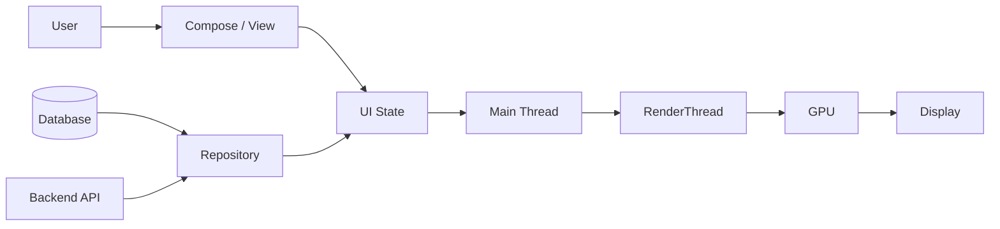
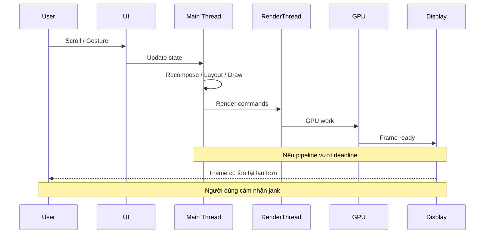

# 018 - Jank

**Học phần:** 05 - Quality, Release and Portfolio
**Module:** Module 10 - Linting, Debugging and Benchmark
**Nhóm nội dung:** Performance
**Nguồn roadmap:** Linting, Debugging and Benchmark / Performance
**Loại bài:** quality
**Thứ tự trong module:** 018
**Thời lượng gợi ý:** 30 phút

---

## 1. Tóm tắt

**Jank** là hiện tượng giao diện Android bị giật, khựng hoặc mất độ mượt vì một hoặc nhiều frame không được hoàn thành đúng thời điểm cần hiển thị. Người dùng thường nhận thấy jank khi cuộn danh sách, chạy animation, chuyển màn hình, mở menu hoặc tương tác với giao diện.

Jank khác với việc một API phản hồi chậm. Nếu ứng dụng đang chờ dữ liệu mạng nhưng animation loading vẫn được render mượt, đó chủ yếu là vấn đề latency. Jank xuất hiện khi chính quá trình tạo và hiển thị frame không đáp ứng được deadline của hệ thống.

Android cung cấp nhiều công cụ để phát hiện và phân tích jank như `JankStats`, Macrobenchmark với `FrameTimingMetric`, system trace và Perfetto. `JankStats` có thể báo frame bị jank cùng với trạng thái UI tại thời điểm vấn đề xảy ra.

Trong một ứng dụng production, xử lý jank không chỉ là "làm app nhanh hơn" mà là một quy trình:

```text
User flow
    ↓
Đo frame
    ↓
Xác định frame bị jank
    ↓
Trace nguyên nhân
    ↓
Tối ưu
    ↓
Benchmark lại
    ↓
Theo dõi regression
```

## 2. Mục tiêu học tập

Sau bài học, người học có thể:

* Giải thích được khái niệm jank bằng ngôn ngữ của mình.
* Phân biệt jank với network latency, ANR và thời gian startup chậm.
* Giải thích mối quan hệ giữa refresh rate, frame deadline và độ mượt UI.
* Xác định các nguyên nhân thường gây jank trên Android.
* Nhận biết tác động của main thread, `RenderThread`, GPU, recomposition và garbage collection đến rendering.
* Sử dụng `JankStats` để phát hiện frame bị jank.
* Sử dụng `FrameTimingMetric` trong Macrobenchmark để kiểm tra một user flow.
* Phân tích trace bằng Perfetto khi cần tìm nguyên nhân sâu hơn.
* Đưa một kiểm tra performance có thể lặp lại vào quy trình quality/release.
* Tạo artifact đo lường jank cho portfolio.

## 3. Khái niệm cốt lõi

### 3.1. Jank là gì?

Ứng dụng Android tạo ra một chuỗi frame để tạo cảm giác chuyển động liên tục.

Một frame điển hình có thể liên quan đến:

* xử lý input;
* cập nhật state;
* chạy animation;
* recomposition trong Jetpack Compose;
* measure và layout;
* tạo draw commands;
* xử lý trên `RenderThread`;
* GPU rendering;
* compositor;
* đưa frame ra màn hình.

Nếu frame không sẵn sàng vào thời điểm hệ thống muốn trình bày nó, người dùng có thể nhìn thấy:

* animation bị khựng;
* scroll nhảy không đều;
* chuyển màn hình bị giật;
* gesture thiếu phản hồi mượt;
* một frame tồn tại trên màn hình lâu hơn dự kiến.

Android mô tả jank theo hướng frame không đạt được thời điểm hiển thị dự kiến, thường do bỏ lỡ rendering deadline.

### 3.2. Frame budget và refresh rate

Refresh rate ảnh hưởng trực tiếp đến khoảng thời gian giữa các frame.

Công thức đơn giản để hình dung:

```text
Frame interval ≈ 1000 / refresh rate
```

Ví dụ:

| Refresh rate | Khoảng thời gian giữa hai frame |
| -----------: | ------------------------------: |
|        60 Hz |                 khoảng 16,67 ms |
|        90 Hz |                 khoảng 11,11 ms |
|       120 Hz |                  khoảng 8,33 ms |

> **Lưu ý:** Không nên hard-code quy tắc "frame trên 16 ms luôn là jank". Thiết bị Android hiện đại có nhiều refresh rate khác nhau và deadline rendering thực tế được hệ thống quản lý theo pipeline hiển thị.

`FrameMetrics.DEADLINE` trên Android mới biểu diễn khoảng thời gian hệ thống cấp cho ứng dụng để tạo frame; nếu tổng thời gian của frame vượt deadline thì ứng dụng không đạt deadline dự kiến.

`JankStats` cũng sử dụng heuristic thay vì chỉ áp dụng một ngưỡng 16 ms cố định. Theo tài liệu Android hiện tại, heuristic mặc định của thư viện có buffer để tránh đánh dấu quá nhạy những frame chỉ hơi vượt khoảng thời gian theo refresh rate.

## 4. Vị trí của jank trong kiến trúc Android

Jank biểu hiện ở UI nhưng nguyên nhân có thể xuất phát từ nhiều tầng.



Ví dụ, một request network không trực tiếp render frame. Tuy nhiên khi response trả về:

1. `Repository` nhận một danh sách lớn.
2. `ViewModel` tạo state mới.
3. UI nhận toàn bộ state.
4. Hàng trăm item bị invalidated.
5. Compose thực hiện nhiều recomposition.
6. Main thread mất quá nhiều thời gian.
7. Frame bỏ lỡ deadline.
8. Người dùng thấy danh sách bị khựng.

Do đó, khi điều tra jank không nên chỉ nhìn vào composable hoặc layout đang hiển thị. Cần xem toàn bộ data flow tạo ra công việc trên UI thread.

## 5. Cách jank hình thành

Một flow đơn giản có thể được mô tả như sau:



Một frame có thể chậm do CPU, GPU hoặc cả hai. Vì vậy chỉ nhìn vào thời gian của một function Kotlin thường chưa đủ để kết luận nguyên nhân.

## 6. Nguyên nhân phổ biến

Các nguyên nhân thường gặp gồm:

* thực hiện I/O đồng bộ trên main thread;
* decode hoặc xử lý bitmap lớn trên main thread;
* parse JSON lớn ngay trong UI thread;
* tính toán CPU-heavy trong composable;
* tạo quá nhiều object tạm thời;
* garbage collection xảy ra vào thời điểm nhạy cảm;
* cập nhật state quá thường xuyên;
* invalidation một vùng UI lớn không cần thiết;
* recomposition quá rộng;
* thiếu key ổn định cho lazy list;
* layout hoặc draw quá phức tạp;
* overdraw;
* shader hoặc GPU workload nặng;
* tải ảnh không tối ưu trong lúc scroll;
* khởi tạo dependency lớn đúng lúc animation đang chạy;
* thực hiện logging quá nhiều trong đường code nóng;
* binder hoặc IPC blocking;
* lock contention;
* code debug/instrumentation làm sai lệch phép đo.

Đối với Compose, composable có thể được thực thi lại nhiều lần, thậm chí liên quan tới từng frame trong animation. Android khuyến nghị không thực hiện công việc đắt đỏ như đọc storage trực tiếp trong composable mà nên chuyển công việc đó ra khỏi composition.

Một lỗi khác là thay đổi toàn bộ backing state của lazy layout trong khi chỉ một item thực sự thay đổi. Điều này có thể gây recomposition không cần thiết và kéo dài thời gian tạo frame.

## 7. Đo lường jank

### 7.1. JankStats

`JankStats` thuộc AndroidX Metrics và được thiết kế để theo dõi performance của frame trong ứng dụng.

Thư viện cung cấp cho từng frame các thông tin như:

* frame bắt đầu khi nào;
* thời lượng frame;
* frame có được xem là jank hay không;
* trạng thái ứng dụng tại thời điểm frame xảy ra.

`JankStats` theo dõi theo từng `Window` và có thể kết hợp với `PerformanceMetricsState` để gắn context như screen, user flow hoặc UI state vào dữ liệu performance.

### 7.2. Macrobenchmark

Macrobenchmark phù hợp khi cần kiểm tra performance của một user journey có thể tái tạo, ví dụ:

* mở màn hình feed;
* scroll `LazyColumn`;
* mở product detail;
* chuyển tab;
* chạy animation;
* cold startup.

`FrameTimingMetric` có thể thu thập:

* `frameDurationCpuMs`;
* `frameOverrunMs`.

Trên Android 12 trở lên, `frameOverrunMs` cho biết frame vượt deadline bao nhiêu. Giá trị dương cho thấy frame đã vượt deadline và có khả năng tạo ra jank nhìn thấy được. Kết quả được tổng hợp theo các percentile như P50, P90, P95 và P99.

### 7.3. Perfetto và system trace

Macrobenchmark cho biết **flow có vấn đề hay không**.

Perfetto giúp trả lời câu hỏi sâu hơn:

> **Vì sao frame này bị chậm?**

Trace có thể giúp kiểm tra:

* main thread đang chạy gì;
* thread nào bị block;
* scheduling;
* binder call;
* rendering;
* frame timeline;
* Compose recomposition;
* CPU contention;
* system activity xảy ra cùng thời điểm.

Android khuyến nghị system tracing và Perfetto khi phân tích các vấn đề như UI jank, slow transitions và startup performance.

## 8. Theo dõi jank bằng `JankStats`

Dependency được tài liệu Android hiện tại minh họa như sau:

```kotlin
dependencies {
    implementation("androidx.metrics:metrics-performance:1.0.0")
}
```

Ví dụ Activity:

```kotlin
import android.os.Bundle
import android.util.Log
import androidx.activity.ComponentActivity
import androidx.activity.compose.setContent
import androidx.metrics.performance.JankStats
import androidx.metrics.performance.PerformanceMetricsState

class MainActivity : ComponentActivity() {

    private lateinit var jankStats: JankStats

    private val jankFrameListener =
        JankStats.OnFrameListener { frameData ->
            if (frameData.isJank) {
                Log.w(
                    "JankMonitor",
                    "duration=${frameData.frameDurationUiNanos}ns, " +
                        "states=${frameData.states}"
                )
            }
        }

    override fun onCreate(savedInstanceState: Bundle?) {
        super.onCreate(savedInstanceState)

        setContent {
            App()
        }

        val stateHolder =
            PerformanceMetricsState.getHolderForHierarchy(window.decorView)

        stateHolder.state?.putState(
            key = "Screen",
            value = "Home"
        )

        jankStats = JankStats.createAndTrack(
            window = window,
            listener = jankFrameListener
        )
    }

    override fun onResume() {
        super.onResume()

        if (::jankStats.isInitialized) {
            jankStats.isTrackingEnabled = true
        }
    }

    override fun onPause() {
        if (::jankStats.isInitialized) {
            jankStats.isTrackingEnabled = false
        }

        super.onPause()
    }
}
```

`FrameData` có thể cung cấp những thông tin như:

* `isJank`;
* `frameDurationUiNanos`;
* `frameStartNanos`;
* `states`.

Android cũng lưu ý rằng listener cần xử lý nhanh. Không nên biến callback performance thành nơi thực hiện database operation, network request hoặc logging nặng cho từng frame.

Trong production nên ưu tiên:

```text
Frame event
    ↓
Lọc / aggregate
    ↓
Lưu số liệu nhỏ
    ↓
Batch
    ↓
Upload sau
```

thay vì:

```text
Mỗi frame
    ↓
JSON lớn
    ↓
Disk write
    ↓
Network request
```

Cách thứ hai có thể tự tạo thêm performance problem.

## 9. Kiểm tra jank bằng Macrobenchmark

Một benchmark có thể mô phỏng việc người dùng cuộn danh sách và thu thập `FrameTimingMetric`.

```kotlin
import androidx.benchmark.macro.FrameTimingMetric
import androidx.benchmark.macro.MacrobenchmarkRule
import androidx.benchmark.macro.StartupMode
import androidx.benchmark.macro.junit4.MacrobenchmarkRule
import androidx.test.ext.junit.runners.AndroidJUnit4
import androidx.test.filters.LargeTest
import androidx.test.uiautomator.By
import androidx.test.uiautomator.Direction
import org.junit.Rule
import org.junit.Test
import org.junit.runner.RunWith

@RunWith(AndroidJUnit4::class)
@LargeTest
class FeedScrollBenchmark {

    @get:Rule
    val benchmarkRule = MacrobenchmarkRule()

    @Test
    fun scrollFeed() {
        benchmarkRule.measureRepeated(
            packageName = "com.example.app",
            metrics = listOf(
                FrameTimingMetric()
            ),
            iterations = 5,
            startupMode = StartupMode.WARM,
            setupBlock = {
                pressHome()
            }
        ) {
            startActivityAndWait()

            val feed = device.findObject(
                By.res("feed_list")
            )

            feed.setGestureMargin(
                device.displayWidth / 5
            )

            feed.fling(Direction.DOWN)
        }
    }
}
```

Trong một Compose screen, có thể cung cấp test tag cho UI Automator:

```kotlin
LazyColumn(
    modifier = Modifier.testTag("feed_list")
) {
    items(
        items = products,
        key = { product -> product.id }
    ) { product ->
        ProductItem(product)
    }
}
```

Android hỗ trợ đo các tương tác UI như scrolling bằng Macrobenchmark và `FrameTimingMetric`; UI Automator được sử dụng để tương tác với app như người dùng thực.

> **Lưu ý:** Benchmark performance không nên được đánh giá dựa trên debug build thông thường. Target app nên có cấu hình gần với production/release để kết quả phản ánh thực tế tốt hơn.

## 10. Đọc kết quả benchmark

Giả sử benchmark trả về:

```text
frameDurationCpuMs P50  = 4.2
frameDurationCpuMs P90  = 7.6
frameDurationCpuMs P95  = 11.1
frameDurationCpuMs P99  = 19.4

frameOverrunMs P50      = -8.5
frameOverrunMs P90      = -3.1
frameOverrunMs P95      = 1.8
frameOverrunMs P99      = 9.6
```

Không nên chỉ nhìn P50.

P50 cho biết trường hợp điển hình, nhưng jank thường nằm ở các frame tệ nhất.

Trong ví dụ trên:

* phần lớn frame ổn;
* P95 bắt đầu vượt deadline;
* P99 vượt deadline đáng kể;
* một tỷ lệ nhỏ frame có thể tạo cảm giác khựng rõ rệt.

Vì vậy khi tối ưu UI, P95 và P99 đặc biệt hữu ích để tìm những frame xấu hiếm nhưng ảnh hưởng mạnh đến UX. Android cũng khuyến nghị quan sát các percentile cao khi phân tích UI performance.

## 11. Quy trình debugging jank

Một quy trình thực tế nên đi từ triệu chứng đến nguyên nhân thay vì tối ưu ngẫu nhiên.

1. Chọn một user flow cụ thể.

Ví dụ:

```text
Home
  ↓
Open Feed
  ↓
Scroll nhanh 5 lần
  ↓
Open Product
```

2. Chạy flow trên thiết bị thật.

3. Kiểm tra xem hiện tượng có tái tạo ổn định hay không.

4. Chạy Macrobenchmark với `FrameTimingMetric`.

5. Xác định percentile hoặc frame có `frameOverrunMs` bất thường.

6. Capture system trace.

7. Mở trace bằng Perfetto.

8. Xác định frame bị jank.

9. Kiểm tra main thread trong khoảng thời gian đó.

10. Kiểm tra thêm:

* recomposition;
* layout;
* image decode;
* GC;
* lock;
* binder;
* disk I/O;
* GPU workload.

11. Đưa ra một thay đổi tối ưu duy nhất.

12. Chạy benchmark lại.

13. So sánh kết quả trước và sau.

Nguyên tắc quan trọng là:

```text
Measure
   ↓
Hypothesis
   ↓
Change
   ↓
Measure again
```

Không nên:

```text
Đoán
   ↓
Refactor rất nhiều code
   ↓
Cảm thấy app có vẻ nhanh hơn
```

## 12. Chiến lược giảm jank

### 12.1. Tối ưu main thread

Tránh đưa công việc nặng lên main thread.

Ví dụ không nên:

```kotlin
@Composable
fun ProfileScreen() {
    val json = File("large.json").readText()

    // ...
}
```

Nên chuyển I/O xuống data layer và thực hiện bằng coroutine phù hợp:

```kotlin
class ProfileRepository(
    private val ioDispatcher: CoroutineDispatcher = Dispatchers.IO
) {

    suspend fun loadProfile(): Profile =
        withContext(ioDispatcher) {
            loadProfileFromStorage()
        }
}
```

UI chỉ nhận dữ liệu đã xử lý:

```kotlin
data class ProfileUiState(
    val isLoading: Boolean = false,
    val profile: Profile? = null
)
```

### 12.2. Giảm công việc không cần thiết trong UI

Với Compose:

* tránh tính toán nặng trực tiếp trong composable;
* tránh tạo lại object lớn ở mỗi recomposition;
* sử dụng state ở phạm vi nhỏ nhất phù hợp;
* sử dụng stable key cho lazy list;
* tránh cập nhật toàn bộ danh sách khi chỉ một item thay đổi;
* cache hoặc memoize computation khi phù hợp;
* đưa business logic ra khỏi UI;
* đo trước khi thêm optimization phức tạp.

Ví dụ:

```kotlin
LazyColumn {
    items(
        items = messages,
        key = { message -> message.id }
    ) { message ->
        MessageItem(message)
    }
}
```

Stable key giúp Compose nhận diện item tốt hơn khi danh sách thay đổi.

## 13. Những lỗi dễ nhầm với jank

| Hiện tượng                     | Có nhất thiết là jank không? | Ví dụ                                            |
| ------------------------------ | ---------------------------- | ------------------------------------------------ |
| API mất 3 giây                 | Không                        | Loading animation vẫn mượt                       |
| App startup chậm               | Không nhất thiết             | Splash tồn tại lâu nhưng frame vẫn đúng deadline |
| Scroll bị giật                 | Có khả năng cao              | Một số frame bỏ lỡ deadline                      |
| App đứng nhiều giây            | Có thể nghiêm trọng hơn jank | Có nguy cơ ANR                                   |
| Animation FPS không đều        | Có khả năng                  | Frame timing bất ổn                              |
| Ảnh xuất hiện muộn             | Không nhất thiết             | Image loading latency                            |
| UI freeze trong lúc decode ảnh | Có                           | Main thread bị block                             |

Điểm cần nhớ:

> **Không phải mọi UX chậm đều là jank, nhưng jank luôn liên quan đến việc frame không được trình bày đúng nhịp mong muốn.**

## 14. Lỗi thường gặp khi xử lý jank

### 14.1. Chỉ nhìn bằng mắt

**Hiện tượng:** Developer nói app "có vẻ mượt hơn".

**Nguyên nhân:** Không có metric trước và sau optimization.

**Cách xử lý:** Dùng Macrobenchmark hoặc một phương pháp đo có thể lặp lại.

### 14.2. Tối ưu debug build

**Hiện tượng:** Trace cho thấy rất nhiều overhead nhưng không phản ánh production.

**Nguyên nhân:** Debug tooling và build configuration có thể làm thay đổi performance.

**Cách xử lý:** Benchmark với build gần release/production.

### 14.3. Chuyển mọi thứ sang background thread

**Hiện tượng:** Architecture phức tạp hơn nhưng UI vẫn jank.

**Nguyên nhân:** Không phải mọi jank đều đến từ main-thread computation. GPU, layout, rendering hoặc state invalidation vẫn có thể là bottleneck.

**Cách xử lý:** Trace trước để xác định bottleneck thực tế.

### 14.4. Log mọi frame

**Hiện tượng:** Sau khi thêm performance monitoring, app chậm hơn.

**Nguyên nhân:** Callback theo frame thực hiện quá nhiều logging hoặc allocation.

**Cách xử lý:** Lọc, aggregate và xử lý callback nhanh.

### 14.5. Chỉ tối ưu average

**Hiện tượng:** Average tốt nhưng người dùng vẫn thấy các cú khựng.

**Nguyên nhân:** Một số frame rất chậm bị average che khuất.

**Cách xử lý:** Theo dõi distribution và các percentile như P90, P95, P99.

## 15. Testing và quality gate

Jank nên được kiểm tra như một quality characteristic chứ không chỉ debug khi có complaint.

| Test case                      | Kiểm tra                                   |
| ------------------------------ | ------------------------------------------ |
| Scroll danh sách dài           | Frame timing ổn định                       |
| Scroll nhanh liên tục          | Không xuất hiện regression rõ rệt          |
| Load thêm dữ liệu              | UI không freeze khi append item            |
| Hiển thị ảnh                   | Decode/loading không block UI              |
| Animation khi dữ liệu cập nhật | Không tạo recomposition quá lớn            |
| Màn hình có nhiều item         | P95/P99 không tăng bất thường              |
| Release mới                    | Benchmark không regression so với baseline |

Một pipeline đơn giản có thể là:

```text
Code change
    ↓
Build benchmark variant
    ↓
Run Macrobenchmark
    ↓
Collect frame metrics
    ↓
Compare baseline
    ↓
Regression?
   ├── No  → Continue release
   └── Yes → Investigate trace
```

Performance test có thể có noise do:

* thiết bị;
* nhiệt độ;
* background process;
* compilation state;
* power mode;
* workload không ổn định.

Do đó không nên đặt quality gate dựa trên một lần chạy duy nhất.

## 16. Best practices

* Đo performance trước khi tối ưu.
* Tập trung vào user journey quan trọng thay vì benchmark function ngẫu nhiên.
* Kiểm tra P95/P99 thay vì chỉ average.
* Giữ main thread tránh I/O và computation nặng.
* Không thực hiện công việc đắt đỏ trực tiếp trong composable.
* Tránh recomposition diện rộng không cần thiết.
* Sử dụng stable key cho lazy layout.
* Tối ưu ảnh trước khi hiển thị nếu kích thước nguồn quá lớn.
* Không tạo allocation lớn trong animation loop.
* Không log dữ liệu performance quá mức trên từng frame.
* Benchmark trên thiết bị thật khi đánh giá UX.
* Sử dụng cấu hình build gần production.
* Capture trace khi metric cho thấy regression.
* So sánh trước và sau mỗi optimization.
* Không kết luận nguyên nhân jank chỉ từ cảm nhận.

## 17. Liên hệ với các chủ đề performance khác

Jank có quan hệ chặt chẽ với nhiều chủ đề khác trong quality và performance:

```text
UI Rendering
      ↓
    Jank
   ↙    ↘
Compose  Frame Timing
   ↓        ↓
Tracing  Macrobenchmark
   ↓        ↓
Perfetto  Regression Test
      \    /
       Release Quality
```

Các chủ đề thường liên quan gồm:

* Compose performance;
* rendering;
* profiling;
* tracing;
* Macrobenchmark;
* Baseline Profiles;
* startup performance;
* memory allocation;
* garbage collection;
* Android vitals;
* release performance regression.

Baseline Profiles có thể cải thiện startup và runtime performance trong một số trường hợp, nhưng không thay thế việc tìm nguyên nhân thực sự của jank. Android khuyến nghị đo tác động của Baseline Profiles bằng Macrobenchmark thay vì giả định rằng chúng luôn giải quyết vấn đề.

## 18. Bài thực hành

### 18.1. Yêu cầu

Tạo một ứng dụng Compose nhỏ có màn hình chứa `LazyColumn` với ít nhất vài chục item.

Thực hiện:

1. Gắn `JankStats` vào `MainActivity`.
2. Gắn UI state `"Screen" = "Feed"`.
3. Ghi nhận các frame bị đánh dấu jank.
4. Tạo một tình huống performance kém có chủ đích trong bản demo.
5. Scroll danh sách và quan sát kết quả.
6. Sửa nguyên nhân performance.
7. Chạy lại cùng user flow.
8. Lưu kết quả trước và sau.

Có thể tạo tình huống không tối ưu để học bằng một computation CPU-heavy được gọi trong lúc UI update.

> **Lưu ý:** Code cố ý chậm chỉ dùng cho project học tập, không đưa vào production.

### 18.2. Gợi ý triển khai

Cấu trúc project:

```text
app/
├── MainActivity.kt
├── ui/
│   ├── FeedScreen.kt
│   └── FeedItem.kt
└── performance/
    └── JankMonitor.kt

benchmark/
└── FeedScrollBenchmark.kt
```

User flow cần benchmark:

```text
Launch app
    ↓
Open Feed
    ↓
Wait until content appears
    ↓
Scroll down
    ↓
Scroll up
    ↓
Collect FrameTimingMetric
```

Sau khi xác định regression, capture trace để tìm nguyên nhân.

### 18.3. Kết quả mong đợi

Người học cần có:

* một app demo chạy được;
* một `JankStats` monitor;
* ít nhất một log hoặc report ghi nhận jank;
* một Macrobenchmark cho scroll;
* kết quả frame timing;
* mô tả nguyên nhân;
* thay đổi tối ưu;
* kết quả sau optimization;
* ảnh chụp hoặc trace dùng làm bằng chứng.

## 19. Artifact cho portfolio

Tạo thư mục:

```text
performance-jank-demo/
├── README.md
├── app/
├── benchmark/
├── traces/
│   └── feed-scroll.perfetto-trace
└── reports/
    └── jank-report.md
```

Trong `jank-report.md`, ghi:

```text
User flow:
Feed scrolling

Problem:
Scroll khựng khi dữ liệu được cập nhật.

Measurement:
FrameTimingMetric.

Before:
P95/P99 có frame overrun.

Root cause:
Công việc CPU-heavy xảy ra trên UI thread.

Fix:
Chuyển computation khỏi UI thread và giảm UI invalidation.

After:
P95/P99 cải thiện.

Evidence:
- Benchmark output
- Perfetto trace
- Screenshot
```

README nên trả lời bốn câu hỏi:

1. Jank là gì?
2. Demo tạo ra jank bằng cách nào?
3. Bạn tìm nguyên nhân bằng công cụ nào?
4. Metric thay đổi như thế nào sau khi sửa?

Artifact này thể hiện không chỉ khả năng viết Android code mà còn khả năng:

* đo performance;
* phân tích trace;
* xác định bottleneck;
* kiểm chứng optimization;
* kiểm soát regression.

## 20. Checklist hoàn thành

* [ ] Tôi giải thích được jank mà không chỉ nói "app bị lag".
* [ ] Tôi hiểu khái niệm frame deadline.
* [ ] Tôi biết vì sao 16,67 ms không phải ngưỡng cố định cho mọi thiết bị.
* [ ] Tôi phân biệt được jank với network latency.
* [ ] Tôi biết main thread có thể gây jank như thế nào.
* [ ] Tôi biết recomposition quá mức có thể ảnh hưởng UI performance.
* [ ] Tôi tích hợp được `JankStats` vào ứng dụng mẫu.
* [ ] Tôi biết gắn UI state vào performance report.
* [ ] Tôi tạo được Macrobenchmark sử dụng `FrameTimingMetric`.
* [ ] Tôi biết ý nghĩa cơ bản của `frameOverrunMs`.
* [ ] Tôi biết vì sao cần quan sát P95 và P99.
* [ ] Tôi biết khi nào cần sử dụng Perfetto.
* [ ] Tôi benchmark bằng cấu hình gần production.
* [ ] Tôi có kết quả trước và sau optimization.
* [ ] Tôi lưu report hoặc trace làm artifact portfolio.

## 21. Câu hỏi tự kiểm tra

1. Vì sao một API mất 5 giây để phản hồi chưa đủ để kết luận ứng dụng đang gặp jank?
2. Vì sao quy tắc "frame trên 16 ms là jank" không chính xác trên mọi thiết bị Android?
3. `JankStats` cung cấp thêm giá trị gì so với việc chỉ đo duration của frame?
4. Tại sao P95 và P99 có thể quan trọng hơn average khi đánh giá UI performance?
5. Khi Macrobenchmark phát hiện `frameOverrunMs` tăng mạnh, bước tiếp theo nên là gì?

## 22. Tổng kết

**Jank** là vấn đề rendering xảy ra khi frame không đạt thời điểm hiển thị mong muốn, khiến scroll, animation hoặc interaction bị giật và thiếu mượt.

Việc xử lý jank nên dựa trên dữ liệu:

```text
Reproduce
    ↓
Measure
    ↓
Find janky frame
    ↓
Trace
    ↓
Find root cause
    ↓
Optimize
    ↓
Benchmark again
```

`JankStats` phù hợp để theo dõi frame và gắn context UI. Macrobenchmark với `FrameTimingMetric` phù hợp để đo user journey có thể lặp lại. Perfetto được sử dụng khi cần đi sâu vào nguyên nhân ở thread, scheduling và rendering pipeline.

Mục tiêu cuối cùng không phải là làm cho một metric đẹp hơn, mà là đảm bảo những user flow quan trọng của ứng dụng duy trì trải nghiệm mượt, ổn định và không bị performance regression qua các lần release.
