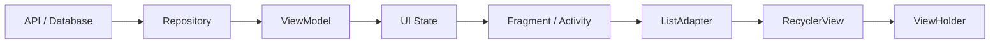
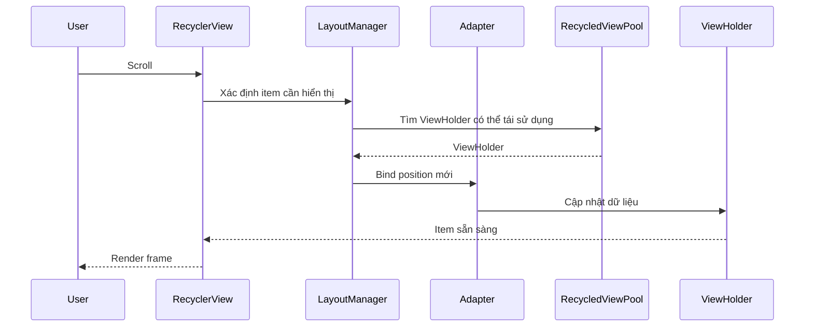
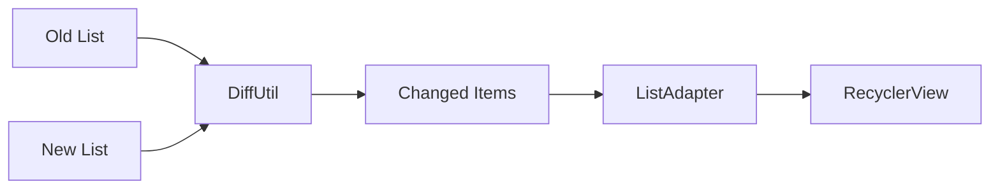

# 019 - RecyclerView Performance

**Học phần:** 05 - Quality, Release and Portfolio
**Module:** Module 10 - Linting, Debugging and Benchmark
**Nhóm nội dung:** Performance
**Nguồn roadmap:** Linting, Debugging and Benchmark / Performance
**Loại bài:** quality
**Thứ tự trong module:** 019
**Thời lượng gợi ý:** 30 phút

---

## 1. Tóm tắt

`RecyclerView` là thành phần UI thuộc hệ thống Android Views, được thiết kế để hiển thị tập dữ liệu lớn bằng cách **tái sử dụng `ViewHolder` thay vì tạo một `View` mới cho mọi phần tử**. Cơ chế recycling giúp giảm số lượng `View` phải tạo, giảm allocation và cải thiện khả năng phản hồi của ứng dụng.

Tuy nhiên, việc sử dụng `RecyclerView` không tự động bảo đảm danh sách luôn mượt. Scroll vẫn có thể bị giật nếu ứng dụng thực hiện quá nhiều công việc trong `onBindViewHolder()`, inflate layout phức tạp, decode ảnh trên main thread, cập nhật toàn bộ danh sách không cần thiết hoặc tạo nhiều object trong quá trình scroll.

Tối ưu `RecyclerView` vì vậy phải được nhìn theo chuỗi:

```text
Data update
    ↓
Diff calculation
    ↓
Adapter update
    ↓
ViewHolder binding
    ↓
Measure / Layout
    ↓
Draw
    ↓
Frame xuất hiện trên màn hình
```

Mục tiêu cuối cùng không phải là áp dụng càng nhiều "mẹo tối ưu" càng tốt, mà là:

* xác định nguyên nhân thực sự gây jank;
* giảm công việc trên main thread;
* giảm số lần bind không cần thiết;
* đơn giản hóa item layout;
* quản lý ảnh hợp lý;
* đo hiệu năng bằng công cụ thay vì chỉ dựa vào cảm giác.

---

## 2. Mục tiêu học tập

Sau bài học, người học có thể:

* giải thích cơ chế recycling của `RecyclerView`;
* phân biệt `onCreateViewHolder()` và `onBindViewHolder()`;
* nhận biết những thao tác thường gây jank khi scroll;
* sử dụng `ListAdapter` và `DiffUtil.ItemCallback` để cập nhật danh sách hiệu quả;
* tránh lạm dụng `notifyDataSetChanged()`;
* sử dụng payload để cập nhật một phần item khi phù hợp;
* đánh giá khi nào nên sử dụng `setHasFixedSize(true)`;
* hiểu vai trò của `RecycledViewPool` trong các danh sách lồng nhau;
* tối ưu image loading trong item;
* kiểm tra hiệu năng scroll bằng Android Studio, trace và `Macrobenchmark`;
* xây dựng một benchmark có thể chạy lặp lại để phát hiện performance regression;
* tạo artifact về RecyclerView Performance để đưa vào portfolio.

---

## 3. Khái niệm cốt lõi

### 3.1. Recycling

Giả sử ứng dụng có danh sách 10.000 sản phẩm.

Nếu tạo đồng thời 10.000 item view, ứng dụng sẽ phải:

* inflate hàng nghìn layout;
* tạo hàng nghìn `TextView`, `ImageView` và container;
* giữ lượng lớn object trong bộ nhớ;
* thực hiện measure và layout trên rất nhiều view.

`RecyclerView` không hoạt động như vậy.

Nó chỉ cần tạo số lượng `ViewHolder` cần thiết cho các item đang hiển thị và một số view phục vụ caching/prefetch.

Khi item A đi ra khỏi màn hình, `ViewHolder` của A có thể được tái sử dụng để hiển thị item B sắp đi vào màn hình.

```text
Viewport

┌───────────────────────┐
│ ViewHolder 1 → Item 20│
│ ViewHolder 2 → Item 21│
│ ViewHolder 3 → Item 22│
│ ViewHolder 4 → Item 23│
│ ViewHolder 5 → Item 24│
└───────────────────────┘

Scroll ↓

ViewHolder của Item 20
        ↓
được recycle
        ↓
bind thành Item 25
```

Cơ chế này là lý do `RecyclerView` có thể xử lý danh sách lớn mà không phải tạo view cho toàn bộ dữ liệu.

### 3.2. Chi phí tạo view và chi phí bind

Hai thao tác quan trọng trong adapter là:

```kotlin
onCreateViewHolder()
```

và:

```kotlin
onBindViewHolder()
```

`onCreateViewHolder()` chịu trách nhiệm tạo cấu trúc view.

Ví dụ:

```text
Inflate XML
   ↓
Create View objects
   ↓
Create ViewHolder
```

Trong khi đó, `onBindViewHolder()` cập nhật dữ liệu của một `ViewHolder` đã tồn tại.

```text
ViewHolder
   +
Product
   ↓
Set title
Set price
Load image
Set state
```

`onBindViewHolder()` có thể được gọi rất nhiều lần khi người dùng scroll, vì vậy đây là một **hot path** cần giữ nhẹ.

> **Nguyên tắc:** Không đặt công việc CPU nặng, I/O, truy vấn database hoặc xử lý ảnh đồng bộ trong `onBindViewHolder()`.

### 3.3. Frame và jank

Một danh sách có thể đúng về chức năng nhưng vẫn tạo UX kém nếu frame không được render kịp thời.

Khi người dùng fling:

```text
Input
 ↓
Bind
 ↓
Measure
 ↓
Layout
 ↓
Draw
 ↓
Display frame
```

Nếu main thread phải xử lý quá nhiều công việc trong chuỗi này, frame có thể bị trễ.

Kết quả người dùng nhìn thấy là:

* scroll giật;
* animation không đều;
* touch phản hồi chậm;
* item xuất hiện trễ;
* ảnh nhấp nháy;
* màn hình có cảm giác "nặng".

Android Macrobenchmark cung cấp `FrameTimingMetric` để đo thời gian frame trong các user journey như scroll và animation thay vì chỉ đánh giá bằng mắt.

---

## 4. Vị trí trong kiến trúc Android

`RecyclerView` thuộc UI layer.

Một kiến trúc phổ biến có thể được tổ chức như sau:



Vai trò của từng tầng:

* `Repository` chịu trách nhiệm cung cấp dữ liệu.
* `ViewModel` quản lý state cho màn hình.
* `Fragment` hoặc `Activity` observe state.
* `ListAdapter` nhận danh sách mới.
* `DiffUtil` xác định item nào thực sự thay đổi.
* `RecyclerView` quản lý hiển thị và recycling.
* `ViewHolder` bind dữ liệu của từng item.

Performance problem không nhất thiết xuất phát từ chính `RecyclerView`.

Ví dụ:

```text
Database query chậm
        ↓
Mapping model quá nặng
        ↓
UI state tạo lại liên tục
        ↓
Adapter nhận list liên tục
        ↓
ViewHolder bind lại
        ↓
Scroll bị giật
```

Do đó cần phân tích toàn bộ data flow thay vì chỉ sửa adapter.

---

## 5. Cách RecyclerView hoạt động khi scroll

Flow đơn giản có thể hình dung như sau:



Một chu kỳ scroll điển hình:

1. Người dùng scroll danh sách.
2. `LayoutManager` xác định những item sắp cần hiển thị.
3. `RecyclerView` cố gắng lấy `ViewHolder` có thể tái sử dụng.
4. Nếu không có view phù hợp, adapter có thể phải tạo `ViewHolder` mới.
5. Adapter gọi `onBindViewHolder()`.
6. Dữ liệu được bind vào view.
7. View được measure, layout và draw.
8. Item xuất hiện trên màn hình.
9. View rời khỏi viewport có thể được cache hoặc recycle.

`RecyclerView.LayoutManager` cũng có cơ chế item prefetch để chuẩn bị `ViewHolder` cho các vị trí sắp cần hiển thị khi còn đủ thời gian trước frame tiếp theo.

---

## 6. Nguyên nhân thường làm RecyclerView chậm

### 6.1. `onBindViewHolder()` thực hiện công việc quá nặng

Không nên:

```kotlin
override fun onBindViewHolder(holder: ProductViewHolder, position: Int) {
    val product = items[position]

    val bitmap = decodeLargeBitmap(product.imagePath)
    val formatted = expensiveCalculation(product)

    holder.bind(product, bitmap, formatted)
}
```

Các công việc như:

* decode bitmap;
* đọc file;
* query database;
* gọi network;
* parse JSON;
* xử lý collection lớn;
* tính toán phức tạp;

không nên chạy trực tiếp trong quá trình binding.

### 6.2. Cập nhật toàn bộ danh sách khi chỉ một item thay đổi

Ví dụ:

```kotlin
notifyDataSetChanged()
```

làm adapter thông báo rằng toàn bộ dataset có thể đã thay đổi.

Nếu chỉ một sản phẩm đổi trạng thái yêu thích nhưng ứng dụng khiến toàn bộ danh sách phải cập nhật, lượng công việc phát sinh có thể lớn hơn nhiều so với cần thiết.

Với danh sách có model ổn định, nên ưu tiên:

```text
New List
   ↓
DiffUtil
   ↓
Chỉ item thay đổi
   ↓
RecyclerView update
```

`AsyncListDiffer`, thành phần được sử dụng bởi `ListAdapter`, hỗ trợ tính diff giữa các list trên background thread.

### 6.3. Item layout quá phức tạp

Một item có hierarchy như:

```text
LinearLayout
 └── LinearLayout
      └── RelativeLayout
           └── LinearLayout
                ├── ImageView
                ├── TextView
                └── ...
```

có thể tăng chi phí:

* inflate;
* measure;
* layout;
* traversal.

Nên giữ hierarchy hợp lý và tránh nesting không cần thiết.

### 6.4. Xử lý ảnh không hiệu quả

Ảnh thường là nguồn gây vấn đề lớn trong feed.

Các lỗi thường gặp:

* decode ảnh full resolution dù `ImageView` rất nhỏ;
* load ảnh đồng bộ trên main thread;
* không cache;
* không có placeholder;
* request ảnh cũ tiếp tục chạy khi `ViewHolder` đã được recycle;
* load lại cùng một URL quá nhiều lần.

Nên sử dụng image loading library phù hợp như Coil hoặc Glide để xử lý:

```text
URL
 ↓
Memory Cache
 ↓
Disk Cache
 ↓
Network
 ↓
Decode / Resize
 ↓
ImageView
```

### 6.5. Allocation trong lúc bind

Không nên liên tục tạo các object đắt tiền trong `bind()`.

Ví dụ:

```kotlin
fun bind(product: Product) {
    binding.root.setOnClickListener {
        onProductClick(product)
    }

    val formatter = DecimalFormat("#,###")
    binding.price.text = formatter.format(product.price)
}
```

Nếu có thể, formatter nên được tái sử dụng hoặc dữ liệu nên được chuẩn hóa trước khi đưa xuống UI.

Listener cũng cần được thiết kế để tránh tạo logic phức tạp trong mỗi lần bind.

### 6.6. Nested RecyclerView

Feed có cấu trúc:

```text
RecyclerView dọc
    │
    ├── RecyclerView ngang
    ├── RecyclerView ngang
    ├── RecyclerView ngang
    └── RecyclerView ngang
```

có thể tạo nhiều `ViewHolder` và pool riêng biệt.

Khi các RecyclerView con sử dụng cùng loại item, chia sẻ `RecycledViewPool` có thể giảm số lượng view phải tạo lại.

---

## 7. Chiến lược tối ưu cốt lõi

### 7.1. Giữ `ViewHolder` đơn giản

Một `ViewHolder` tốt chủ yếu làm nhiệm vụ:

```text
Model
 ↓
UI fields
```

Ví dụ:

```kotlin
class ProductViewHolder(
    private val binding: ItemProductBinding,
    private val onClick: (ProductUiModel) -> Unit
) : RecyclerView.ViewHolder(binding.root) {

    fun bind(item: ProductUiModel) {
        binding.name.text = item.name
        binding.price.text = item.formattedPrice
        binding.favorite.isSelected = item.isFavorite

        binding.root.setOnClickListener {
            onClick(item)
        }
    }
}
```

Không nên để `ViewHolder` tự:

* query database;
* gọi API;
* điều phối business logic;
* tạo coroutine dài hạn;
* truy cập repository.

### 7.2. Dùng `ListAdapter` và `DiffUtil`

Với danh sách thông thường, `ListAdapter` giúp quản lý list update hiệu quả hơn việc tự gọi `notifyDataSetChanged()`.

Flow:



Điểm quan trọng nhất là xác định đúng hai khái niệm:

```kotlin
areItemsTheSame()
```

và:

```kotlin
areContentsTheSame()
```

Ví dụ:

```kotlin
override fun areItemsTheSame(
    oldItem: ProductUiModel,
    newItem: ProductUiModel
): Boolean {
    return oldItem.id == newItem.id
}
```

Hai object đại diện cùng một product nếu có cùng identity.

Trong khi:

```kotlin
override fun areContentsTheSame(
    oldItem: ProductUiModel,
    newItem: ProductUiModel
): Boolean {
    return oldItem == newItem
}
```

kiểm tra nội dung item có thay đổi hay không.

### 7.3. Dùng `setHasFixedSize(true)` đúng trường hợp

Có thể sử dụng:

```kotlin
recyclerView.setHasFixedSize(true)
```

khi thay đổi nội dung adapter **không làm thay đổi kích thước tổng thể của chính `RecyclerView`**.

`RecyclerView` có thể thực hiện một số tối ưu khi biết trước rằng kích thước của nó không bị ảnh hưởng bởi nội dung adapter.

Không nên bật chỉ vì thấy đây là một "performance trick".

Phải hiểu điều kiện của màn hình trước khi sử dụng.

### 7.4. Dùng payload cho partial update

Nếu item có:

```text
Image
Title
Price
Favorite Button
Rating
```

nhưng chỉ `Favorite Button` thay đổi thì không nhất thiết phải bind lại toàn bộ item.

Payload cho phép truyền thông tin:

```text
Favorite changed
```

và chỉ cập nhật phần UI cần thiết.

### 7.5. Tối ưu image loading

Nên:

* resize ảnh về kích thước phù hợp;
* sử dụng memory/disk cache;
* có placeholder;
* tránh bitmap quá lớn;
* để image library quản lý request khi view bị recycle;
* tránh animation ảnh không cần thiết trong feed tốc độ cao.

### 7.6. Tối ưu danh sách lồng nhau

Khi nhiều `RecyclerView` sử dụng chung một loại item:

```kotlin
val sharedPool = RecyclerView.RecycledViewPool()

sectionAdapter.sharedPool = sharedPool
```

Các RecyclerView con có thể sử dụng:

```kotlin
recyclerView.setRecycledViewPool(sharedPool)
```

`RecycledViewPool` cho phép nhiều `RecyclerView` chia sẻ pool của các view đã recycle.

Không cần sử dụng cơ chế này cho mọi màn hình. Nó đặc biệt hữu ích với cấu trúc feed có nhiều RecyclerView tương tự nhau.

---

## 8. Triển khai mẫu

### 8.1. Model và `DiffUtil`

```kotlin
data class ProductUiModel(
    val id: Long,
    val name: String,
    val formattedPrice: String,
    val imageUrl: String,
    val isFavorite: Boolean
)
```

Tạo `DiffUtil.ItemCallback`:

```kotlin
object ProductDiffCallback : DiffUtil.ItemCallback<ProductUiModel>() {

    override fun areItemsTheSame(
        oldItem: ProductUiModel,
        newItem: ProductUiModel
    ): Boolean {
        return oldItem.id == newItem.id
    }

    override fun areContentsTheSame(
        oldItem: ProductUiModel,
        newItem: ProductUiModel
    ): Boolean {
        return oldItem == newItem
    }
}
```

### 8.2. Layout item

Ví dụ `item_product.xml`:

```xml
<?xml version="1.0" encoding="utf-8"?>
<androidx.constraintlayout.widget.ConstraintLayout
    xmlns:android="http://schemas.android.com/apk/res/android"
    xmlns:app="http://schemas.android.com/apk/res-auto"
    android:layout_width="match_parent"
    android:layout_height="96dp"
    android:padding="12dp">

    <ImageView
        android:id="@+id/image"
        android:layout_width="72dp"
        android:layout_height="72dp"
        android:contentDescription="@null"
        android:scaleType="centerCrop"
        app:layout_constraintBottom_toBottomOf="parent"
        app:layout_constraintStart_toStartOf="parent"
        app:layout_constraintTop_toTopOf="parent" />

    <TextView
        android:id="@+id/name"
        android:layout_width="0dp"
        android:layout_height="wrap_content"
        android:ellipsize="end"
        android:maxLines="1"
        app:layout_constraintEnd_toStartOf="@id/favorite"
        app:layout_constraintStart_toEndOf="@id/image"
        app:layout_constraintTop_toTopOf="@id/image" />

    <TextView
        android:id="@+id/price"
        android:layout_width="0dp"
        android:layout_height="wrap_content"
        app:layout_constraintEnd_toStartOf="@id/favorite"
        app:layout_constraintStart_toStartOf="@id/name"
        app:layout_constraintTop_toBottomOf="@id/name" />

    <ImageButton
        android:id="@+id/favorite"
        android:layout_width="48dp"
        android:layout_height="48dp"
        android:background="?attr/selectableItemBackgroundBorderless"
        android:contentDescription="@string/favorite"
        app:layout_constraintBottom_toBottomOf="parent"
        app:layout_constraintEnd_toEndOf="parent"
        app:layout_constraintTop_toTopOf="parent" />

</androidx.constraintlayout.widget.ConstraintLayout>
```

Layout sử dụng chiều cao xác định rõ giúp quá trình đo layout dễ dự đoán hơn trong trường hợp thiết kế item phù hợp với kích thước cố định.

### 8.3. Adapter

```kotlin
class ProductAdapter(
    private val onProductClick: (ProductUiModel) -> Unit,
    private val onFavoriteClick: (ProductUiModel) -> Unit
) : ListAdapter<ProductUiModel, ProductAdapter.ProductViewHolder>(
    ProductDiffCallback
) {

    override fun onCreateViewHolder(
        parent: ViewGroup,
        viewType: Int
    ): ProductViewHolder {
        val inflater = LayoutInflater.from(parent.context)

        val binding = ItemProductBinding.inflate(
            inflater,
            parent,
            false
        )

        return ProductViewHolder(
            binding = binding,
            onProductClick = onProductClick,
            onFavoriteClick = onFavoriteClick
        )
    }

    override fun onBindViewHolder(
        holder: ProductViewHolder,
        position: Int
    ) {
        holder.bind(getItem(position))
    }

    class ProductViewHolder(
        private val binding: ItemProductBinding,
        private val onProductClick: (ProductUiModel) -> Unit,
        private val onFavoriteClick: (ProductUiModel) -> Unit
    ) : RecyclerView.ViewHolder(binding.root) {

        fun bind(item: ProductUiModel) {
            binding.name.text = item.name
            binding.price.text = item.formattedPrice
            binding.favorite.isSelected = item.isFavorite

            binding.root.setOnClickListener {
                onProductClick(item)
            }

            binding.favorite.setOnClickListener {
                onFavoriteClick(item)
            }
        }
    }
}
```

Nếu sử dụng Coil hoặc Glide, image loading có thể được đặt trong `bind()` nhưng việc download/decode/cache phải được thư viện xử lý ngoài main-thread path thích hợp.

### 8.4. Thiết lập RecyclerView

```kotlin
private val productAdapter by lazy {
    ProductAdapter(
        onProductClick = viewModel::openProduct,
        onFavoriteClick = viewModel::toggleFavorite
    )
}

private fun setupRecyclerView() {
    binding.productList.apply {
        layoutManager = LinearLayoutManager(requireContext())
        adapter = productAdapter
        setHasFixedSize(true)
    }
}
```

Observe state:

```kotlin
viewLifecycleOwner.lifecycleScope.launch {
    viewLifecycleOwner.repeatOnLifecycle(Lifecycle.State.STARTED) {
        viewModel.uiState.collect { state ->
            productAdapter.submitList(state.products)
        }
    }
}
```

Flow hoàn chỉnh:

```text
Repository
    ↓
ViewModel
    ↓
StateFlow<List<ProductUiModel>>
    ↓
submitList()
    ↓
DiffUtil
    ↓
Minimal adapter updates
    ↓
RecyclerView
```

---

## 9. Cập nhật một phần item bằng payload

Giả sử người dùng bấm nút yêu thích.

Ban đầu:

```text
Product 42
isFavorite = false
```

Sau thao tác:

```text
Product 42
isFavorite = true
```

Không nhất thiết phải:

* load lại image;
* set lại title;
* set lại price;
* bind lại toàn bộ view.

Có thể định nghĩa payload:

```kotlin
data class ProductPayload(
    val favoriteChanged: Boolean = false
)
```

Sau đó override:

```kotlin
override fun onBindViewHolder(
    holder: ProductViewHolder,
    position: Int,
    payloads: MutableList<Any>
) {
    if (payloads.isEmpty()) {
        super.onBindViewHolder(holder, position, payloads)
        return
    }

    val item = getItem(position)

    payloads
        .filterIsInstance<ProductPayload>()
        .forEach { payload ->
            if (payload.favoriteChanged) {
                holder.bindFavorite(item.isFavorite)
            }
        }
}
```

Trong `ViewHolder`:

```kotlin
fun bindFavorite(isFavorite: Boolean) {
    binding.favorite.isSelected = isFavorite
}
```

Payload hữu ích khi:

```text
Full bind đắt
+
Một phần UI thay đổi thường xuyên
+
Có thể xác định rõ phần thay đổi
```

Không nên thêm payload vào item đơn giản chỉ để tăng độ phức tạp của code.

---

## 10. Dữ liệu rất lớn và Paging

`RecyclerView` tối ưu số lượng view được tạo nhưng không có nghĩa ứng dụng nên luôn load toàn bộ dataset vào memory.

Ví dụ database có:

```text
500.000 transactions
```

Không nên mặc định:

```text
Database
   ↓
Load 500.000 rows
   ↓
List
   ↓
RecyclerView
```

Thay vào đó có thể sử dụng Paging:

```text
Database / API
      ↓
PagingSource
      ↓
Pager
      ↓
Flow<PagingData<T>>
      ↓
PagingDataAdapter
      ↓
RecyclerView
```

`PagingDataAdapter` sử dụng `DiffUtil` để tính các cập nhật chi tiết khi dữ liệu paging thay đổi.

Paging đặc biệt phù hợp với:

* timeline;
* news feed;
* lịch sử giao dịch;
* danh mục hàng nghìn sản phẩm;
* log;
* danh sách tìm kiếm từ server.

---

## 11. Lifecycle và state

Performance optimization không nên phá vỡ state management.

Ví dụ người dùng đang ở:

```text
Position 850
```

sau khi rotate:

```text
Activity recreate
```

nếu list hoặc scroll state bị reset thì UX vẫn kém dù FPS rất tốt.

Nên phân tách:

```text
Business/UI State
        ↓
ViewModel

Scroll/Layout State
        ↓
RecyclerView / LayoutManager
```

Không nên giữ reference đến:

* `Activity`;
* `Fragment`;
* `RecyclerView`;
* `ViewHolder`;

trong `ViewModel`.

Đồng thời cần tránh việc lifecycle event khiến cùng một dataset bị load hoặc submit lại không cần thiết liên tục.

Với `Flow`, có thể thu thập state bằng:

```kotlin
repeatOnLifecycle(Lifecycle.State.STARTED)
```

để collection phù hợp với lifecycle của UI.

---

## 12. Đo lường và debugging

### 12.1. Phân tích trước khi tối ưu

Không nên bắt đầu bằng:

```text
RecyclerView hơi lag
        ↓
Tăng cache
        ↓
Tăng pool
        ↓
Tắt animation
        ↓
Hy vọng hết lag
```

Nên bắt đầu bằng:

```text
Reproduce
   ↓
Measure
   ↓
Find bottleneck
   ↓
Optimize
   ↓
Measure again
```

Các công cụ hữu ích gồm:

* Android Studio Profiler;
* CPU Profiler;
* Memory Profiler;
* System Trace;
* Perfetto;
* Layout Inspector;
* `Macrobenchmark`;
* `FrameTimingMetric`;
* `JankStats` khi cần theo dõi jank trong ứng dụng.

Benchmark đặc biệt hữu ích vì có thể chạy lại sau mỗi thay đổi để phát hiện performance regression. Android khuyến nghị Macrobenchmark cho các tương tác end-to-end như startup, animation và scrolling.

### 12.2. Các dấu hiệu cần quan sát

Khi profile scroll, cần tìm:

```text
Main Thread
├── onBindViewHolder quá lâu?
├── Layout quá lâu?
├── Inflate nhiều?
├── Bitmap decode?
├── JSON parsing?
├── Database access?
├── GC thường xuyên?
└── Allocation spike?
```

Nếu `onBindViewHolder()` mất nhiều thời gian:

```text
Bind
 ↓
Find expensive operation
 ↓
Move computation upstream
 ↓
Precompute UI model
 ↓
Bind lightweight values
```

Ví dụ thay vì:

```kotlin
binding.price.text = expensiveCurrencyFormat(product.price)
```

mỗi lần bind, có thể mapping ở tầng phù hợp:

```kotlin
Product
   ↓
UiMapper
   ↓
ProductUiModel(
    formattedPrice = "120.000 ₫"
)
```

và bind chỉ còn:

```kotlin
binding.price.text = item.formattedPrice
```

---

## 13. Benchmark scroll RecyclerView

Một performance check tốt nên có khả năng chạy lặp lại.

Android Macrobenchmark có thể điều khiển một `RecyclerView` từ process benchmark và đo frame trong lúc scroll.

Ví dụ:

```kotlin
@RunWith(AndroidJUnit4::class)
@LargeTest
class RecyclerViewScrollBenchmark {

    @get:Rule
    val benchmarkRule = MacrobenchmarkRule()

    @Test
    fun scrollProductList() {
        benchmarkRule.measureRepeated(
            packageName = "com.example.catalog",
            metrics = listOf(
                FrameTimingMetric()
            ),
            iterations = 5,
            startupMode = StartupMode.WARM,
            setupBlock = {
                pressHome()
            }
        ) {
            startActivityAndWait()

            val recyclerView = device.findObject(
                By.res(
                    packageName,
                    "productList"
                )
            )

            recyclerView.setGestureMargin(
                device.displayWidth / 5
            )

            repeat(5) {
                recyclerView.fling(Direction.DOWN)
            }
        }
    }
}
```

Benchmark này kiểm tra một user journey cụ thể:

```text
Open screen
    ↓
RecyclerView xuất hiện
    ↓
Fling nhiều lần
    ↓
Capture frame timing
    ↓
So sánh kết quả
```

`FrameTimingMetric` cung cấp các số liệu như `frameDurationCpuMs` và, trên các phiên bản Android hỗ trợ, `frameOverrunMs`. Giá trị `frameOverrunMs` dương biểu thị frame đã vượt deadline và có khả năng tạo jank nhìn thấy được.

> **Quan trọng:** Không đặt một con số FPS duy nhất làm tiêu chuẩn cho mọi thiết bị. Hãy benchmark trên môi trường kiểm thử nhất quán và quan sát xu hướng regression giữa các phiên bản ứng dụng.

---

## 14. Lỗi thường gặp

| Hiện tượng                                  | Nguyên nhân có thể                                  | Cách xử lý                                                 |
| ------------------------------------------- | --------------------------------------------------- | ---------------------------------------------------------- |
| Scroll giật khi item mới xuất hiện          | `onBindViewHolder()` quá nặng                       | Profile bind và chuyển computation khỏi main thread        |
| Mỗi thay đổi nhỏ làm toàn bộ list nhấp nháy | Dùng `notifyDataSetChanged()`                       | Dùng `ListAdapter`, `DiffUtil` hoặc update cụ thể          |
| Ảnh hiển thị sai item khi scroll nhanh      | Request ảnh cũ không được quản lý đúng khi recycle  | Dùng image loading library lifecycle-aware với `ImageView` |
| Memory tăng mạnh                            | Bitmap quá lớn hoặc cache không phù hợp             | Resize ảnh và kiểm tra memory profile                      |
| GC xuất hiện liên tục khi scroll            | Allocation quá nhiều trong `bind()`                 | Giảm object creation trong hot path                        |
| Item animation quá nhiều                    | `areContentsTheSame()` luôn trả `false`             | Sửa logic `DiffUtil`                                       |
| Item không update                           | `areContentsTheSame()` trả `true` dù dữ liệu đã đổi | Kiểm tra equality và immutable model                       |
| Scroll position bị reset                    | Adapter/list/state bị khởi tạo lại                  | Giữ state đúng lifecycle                                   |
| RecyclerView lồng nhau bị lag               | Nhiều view giống nhau được inflate riêng            | Xem xét shared `RecycledViewPool`                          |
| UI freeze khi mở danh sách                  | Query hoặc mapping lớn chạy trên main thread        | Di chuyển data processing khỏi main thread                 |
| Item bind lại quá thường xuyên              | State phát cùng nội dung liên tục                   | Kiểm soát state emission và diff                           |
| Tối ưu nhưng không biết có tốt hơn          | Không đo trước/sau                                  | Tạo benchmark có khả năng chạy lặp lại                     |

---

## 15. Best practices

* Giữ `onBindViewHolder()` nhẹ và dễ dự đoán.
* Không thực hiện network hoặc database I/O trong `ViewHolder`.
* Ưu tiên immutable UI model.
* Sử dụng stable identity cho item.
* Dùng `ListAdapter`/`DiffUtil` khi phù hợp.
* Không lạm dụng `notifyDataSetChanged()`.
* Chỉ dùng payload khi partial update mang lại lợi ích thực tế.
* Dùng `setHasFixedSize(true)` khi đúng điều kiện, không coi đây là cấu hình bắt buộc.
* Giữ item hierarchy đơn giản.
* Resize ảnh theo kích thước hiển thị thực tế.
* Dùng cache ảnh phù hợp.
* Không decode bitmap lớn trên main thread.
* Tránh allocation không cần thiết trong `bind()`.
* Tránh tạo formatter hoặc parser đắt tiền cho mỗi lần bind.
* Với dataset rất lớn, cân nhắc Paging.
* Với RecyclerView lồng nhau có cùng loại item, cân nhắc shared `RecycledViewPool`.
* Không tăng `itemViewCacheSize` một cách tùy tiện vì cache lớn hơn cũng làm tăng memory usage.
* Không tối ưu theo cảm giác.
* Luôn đo trước và sau thay đổi.
* Benchmark trên cùng môi trường để phát hiện regression.

---

## 16. Chiến lược kiểm thử

RecyclerView Performance nên được kiểm tra ở nhiều tầng.

| Test case                        | Kết quả mong đợi                                   |
| -------------------------------- | -------------------------------------------------- |
| Load 20 item                     | Danh sách hiển thị đúng                            |
| Load vài nghìn item              | Không crash hoặc freeze do tạo toàn bộ view        |
| Scroll nhanh                     | Không xuất hiện lỗi bind sai dữ liệu               |
| Toggle favorite                  | Chỉ state liên quan thay đổi                       |
| Submit list mới                  | `DiffUtil` xác định đúng item thay đổi             |
| Thay đổi nội dung nhưng giữ `id` | Item được cập nhật                                 |
| Thay item bằng `id` khác         | Adapter nhận diện đây là item khác                 |
| Rotate màn hình                  | State và scroll behavior hợp lý                    |
| Scroll trong khi ảnh đang load   | Không hiển thị ảnh của item cũ                     |
| Mạng chậm                        | Scroll không bị block bởi image/network request    |
| Dataset lớn                      | Memory nằm trong mức chấp nhận được                |
| Fling liên tục                   | Không có regression frame rõ rệt                   |
| Benchmark sau thay đổi adapter   | Metrics không xấu đi ngoài ngưỡng project cho phép |

Ngoài functional test, cần có ít nhất một performance journey lặp lại được:

```text
Launch
  ↓
Open product screen
  ↓
Wait list loaded
  ↓
Fling
  ↓
Capture metrics
```

---

## 17. Ví dụ thực tế

Giả sử ứng dụng thương mại điện tử có danh sách 5.000 sản phẩm.

Mỗi item gồm:

```text
Thumbnail
Product Name
Price
Rating
Favorite
Promotion Badge
```

Phiên bản ban đầu:

```text
API trả list
    ↓
Adapter thay mutable list
    ↓
notifyDataSetChanged()
    ↓
Full rebinding
    ↓
Mỗi bind format giá
    ↓
Decode / load ảnh không tối ưu
    ↓
Scroll jank
```

Sau khi tối ưu:

```text
API / Database
      ↓
Repository
      ↓
UiMapper
      ↓
ProductUiModel
      ↓
StateFlow
      ↓
ListAdapter
      ↓
DiffUtil
      ↓
Minimal update
```

Đồng thời:

```text
Ảnh
 ↓
Coil / Glide
 ↓
Resize
 ↓
Memory cache
 ↓
ImageView
```

Khi người dùng bấm favorite:

```text
Product 25
      ↓
ViewModel cập nhật state
      ↓
New immutable list
      ↓
DiffUtil
      ↓
Item 25 changed
      ↓
Partial/full bind cần thiết
```

Kết quả cần đánh giá bằng benchmark chứ không chỉ kết luận:

> "Có vẻ mượt hơn."

---

## 18. Liên hệ với các chủ đề khác

RecyclerView Performance có quan hệ trực tiếp với nhiều phần trong một ứng dụng Android:

```text
Repository
    ↓
Coroutines / Flow
    ↓
ViewModel
    ↓
UI State
    ↓
RecyclerView
    ↓
DiffUtil
    ↓
ViewHolder
    ↓
Rendering
    ↓
Benchmark
```

Các kiến thức liên quan gồm:

* `ViewModel`: giữ state của màn hình.
* `Flow` / `StateFlow`: truyền state đến UI.
* lifecycle: kiểm soát việc collect state.
* `DiffUtil`: xác định thay đổi giữa hai dataset.
* Paging: tải dữ liệu lớn theo từng phần.
* image loading: ảnh hưởng trực tiếp đến memory và scroll.
* profiling: tìm CPU/memory bottleneck.
* Macrobenchmark: kiểm tra performance end-to-end.
* debugging: xác định nguyên nhân frame chậm.
* release quality: ngăn performance regression trước khi phát hành.

Nếu ứng dụng sử dụng Jetpack Compose hoàn toàn, thành phần tương ứng thường là các lazy list như `LazyColumn` hoặc `LazyRow`; bài này tập trung vào hệ thống Android Views và `RecyclerView`. Android cũng cung cấp hướng dẫn migration từ `RecyclerView` sang Compose lazy lists.

---

## 19. Bài thực hành

### 19.1. Yêu cầu

Tạo một màn hình:

```text
ProductListFragment
```

hiển thị ít nhất vài trăm product giả lập bằng `RecyclerView`.

Mỗi item gồm:

* ảnh;
* tên sản phẩm;
* giá;
* trạng thái yêu thích.

Ứng dụng phải sử dụng:

* `ViewModel`;
* `StateFlow`;
* `ListAdapter`;
* `DiffUtil.ItemCallback`;
* `ViewBinding`;
* `LinearLayoutManager`.

### 19.2. Các bước thực hiện

1. Tạo `ProductUiModel`.
2. Sinh dataset giả lập.
3. Xây dựng `DiffUtil.ItemCallback`.
4. Xây dựng `ListAdapter`.
5. Bind dữ liệu bằng `ViewHolder`.
6. Dùng `submitList()` thay cho `notifyDataSetChanged()`.
7. Thêm chức năng favorite.
8. Kiểm tra một thay đổi favorite có làm toàn bộ list bind lại hay không.
9. Thêm image loading nếu project có ảnh.
10. Profile scroll.
11. Tìm ít nhất một bottleneck.
12. Ghi lại kết quả trước khi tối ưu.
13. Thực hiện một thay đổi tối ưu.
14. Đo lại.
15. Tạo Macrobenchmark cho thao tác fling danh sách.
16. Lưu kết quả và mô tả vào README.

Có thể chủ động tạo một phiên bản chậm bằng cách thêm computation giả vào `bind()`:

```kotlin
fun expensiveOperation(): Long {
    var result = 0L

    repeat(100_000) {
        result += it
    }

    return result
}
```

Sau đó:

```text
Version A
Expensive work trong bind()
        ↓
Benchmark
```

so với:

```text
Version B
Precomputed data
        ↓
Lightweight bind()
        ↓
Benchmark
```

Không giữ computation giả trong production code sau khi hoàn thành thí nghiệm.

### 19.3. Kết quả mong đợi

Sau bài thực hành, người học phải có:

```text
RecyclerView demo
        +
ListAdapter / DiffUtil
        +
Performance trace
        +
Macrobenchmark
        +
Before / After result
        +
README
```

README cần trả lời được:

1. Vấn đề performance ban đầu là gì?
2. Bottleneck nằm ở đâu?
3. Công cụ nào được dùng để tìm bottleneck?
4. Code được thay đổi như thế nào?
5. Kết quả benchmark trước và sau khác nhau ra sao?

---

## 20. Artifact cho portfolio

Artifact đề xuất:

```text
recyclerview-performance-demo/
├── app/
├── benchmark/
├── screenshots/
├── traces/
└── README.md
```

Trong đó nên có:

* source code `RecyclerView`;
* `ListAdapter`;
* `DiffUtil.ItemCallback`;
* UI model;
* screenshot danh sách;
* screenshot profiler hoặc trace;
* benchmark scroll;
* bảng kết quả trước và sau tối ưu;
* architecture diagram;
* phần giải thích bottleneck;
* checklist performance.

Một README tốt có thể trình bày:

```text
Problem
   ↓
Measurement
   ↓
Root Cause
   ↓
Optimization
   ↓
Benchmark
   ↓
Result
```

Artifact này có giá trị hơn một project chỉ ghi:

> "Ứng dụng sử dụng RecyclerView."

vì nó chứng minh người học biết **đo, phân tích và cải thiện performance**.

---

## 21. Checklist hoàn thành

* [ ] Tôi giải thích được cơ chế recycling của `RecyclerView`.
* [ ] Tôi phân biệt được `onCreateViewHolder()` và `onBindViewHolder()`.
* [ ] Tôi hiểu vì sao `onBindViewHolder()` phải nhẹ.
* [ ] Tôi sử dụng được `ListAdapter`.
* [ ] Tôi viết đúng `DiffUtil.ItemCallback`.
* [ ] Tôi phân biệt được `areItemsTheSame()` và `areContentsTheSame()`.
* [ ] Tôi không lạm dụng `notifyDataSetChanged()`.
* [ ] Tôi biết khi nào payload có ích.
* [ ] Tôi hiểu điều kiện sử dụng `setHasFixedSize(true)`.
* [ ] Tôi biết rủi ro của image loading trong RecyclerView.
* [ ] Tôi biết mục đích của `RecycledViewPool`.
* [ ] Tôi biết khi nào nên cân nhắc Paging.
* [ ] Tôi profile được một RecyclerView khi scroll.
* [ ] Tôi xác định được ít nhất một bottleneck thực tế.
* [ ] Tôi tạo được một benchmark scroll có thể chạy lại.
* [ ] Tôi có số liệu trước và sau khi tối ưu.
* [ ] Tôi kiểm tra được state khi rotate hoặc recreate UI.
* [ ] Tôi hoàn thành demo RecyclerView Performance.
* [ ] Tôi lưu code, benchmark và báo cáo vào portfolio.

---

## 22. Câu hỏi tự kiểm tra

1. Vì sao `RecyclerView` vẫn có thể bị giật dù đã có cơ chế recycling?
2. Sự khác nhau giữa `onCreateViewHolder()` và `onBindViewHolder()` là gì?
3. Vì sao thực hiện database query trong `onBindViewHolder()` là một thiết kế xấu?
4. `areItemsTheSame()` và `areContentsTheSame()` giải quyết hai vấn đề khác nhau như thế nào?
5. Tại sao không nên mặc định thay mọi cập nhật adapter bằng `notifyDataSetChanged()`?
6. Khi nào `setHasFixedSize(true)` có thể được sử dụng?
7. Payload giúp giảm công việc binding như thế nào?
8. Tại sao image loading có thể gây cả vấn đề CPU, memory và scroll performance?
9. Shared `RecycledViewPool` hữu ích trong trường hợp nào?
10. Vì sao dataset rất lớn có thể cần Paging dù `RecyclerView` đã recycle view?
11. Vì sao benchmark đáng tin cậy hơn việc kéo list bằng tay rồi kết luận "có vẻ mượt"?
12. Bạn sẽ kiểm tra những gì nếu trace cho thấy main thread bị block đúng lúc item mới xuất hiện?

---

## 23. Tổng kết

`RecyclerView` đạt hiệu quả nhờ việc tái sử dụng `ViewHolder`, nhưng hiệu năng thực tế phụ thuộc rất nhiều vào code của ứng dụng.

Một RecyclerView có performance tốt thường tuân theo luồng:

```text
Stable UI Model
      ↓
Efficient State Update
      ↓
ListAdapter
      ↓
DiffUtil
      ↓
Minimal Binding
      ↓
Simple Layout
      ↓
Efficient Image Loading
      ↓
Smooth Rendering
```

Các nguyên tắc quan trọng cần nhớ:

* giữ `onBindViewHolder()` nhẹ;
* không thực hiện I/O trong quá trình binding;
* cập nhật đúng item thay vì refresh toàn bộ dataset;
* dùng `DiffUtil` để giảm update không cần thiết;
* kiểm soát image loading và memory;
* sử dụng Paging khi dataset quá lớn;
* tối ưu nested RecyclerView khi thực sự cần;
* không áp dụng performance trick một cách máy móc;
* đo trước khi tối ưu;
* đo lại sau khi tối ưu;
* dùng benchmark để bảo vệ ứng dụng khỏi performance regression.

Mục tiêu của RecyclerView Performance không chỉ là làm một danh sách "có vẻ mượt", mà là xây dựng một UI có **performance có thể đo lường, giải thích, kiểm thử và duy trì qua nhiều phiên bản ứng dụng**.
