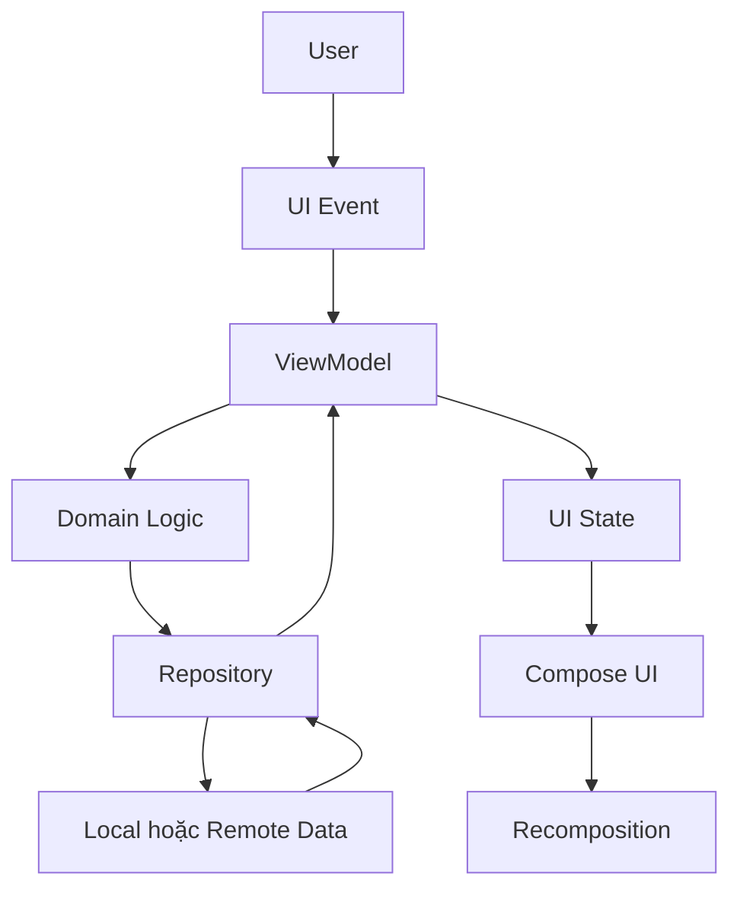
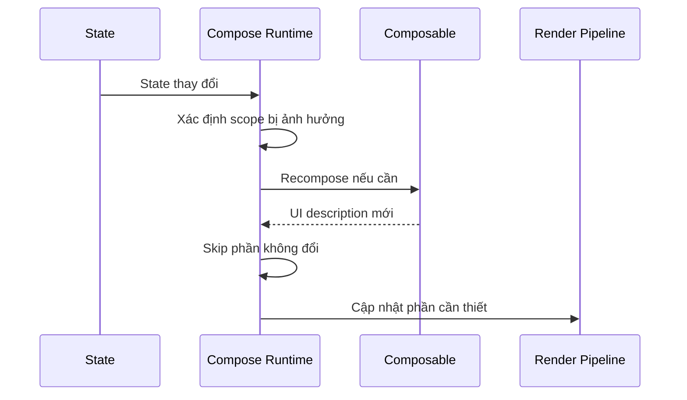

# 020 - Compose Recomposition

**Học phần:** 05 - Quality, Release and Portfolio
**Module:** Module 10 - Linting, Debugging and Benchmark
**Nhóm nội dung:** Performance
**Nguồn roadmap:** Linting, Debugging and Benchmark / Performance
**Loại bài:** quality
**Thứ tự trong module:** 020
**Thời lượng gợi ý:** 30 phút

---

## 1. Tóm tắt

**Compose Recomposition** là cơ chế Jetpack Compose thực thi lại những `Composable` cần thiết khi dữ liệu mà giao diện phụ thuộc vào thay đổi. Đây là nền tảng giúp Compose xây dựng UI theo mô hình khai báo: thay vì developer trực tiếp thay đổi từng `View`, ứng dụng thay đổi **state**, sau đó Compose xác định phần giao diện nào cần cập nhật.

Recomposition không đồng nghĩa với việc toàn bộ màn hình luôn được dựng lại. Compose theo dõi các state được đọc trong Composition, đánh dấu những phạm vi bị ảnh hưởng khi state thay đổi và có thể bỏ qua các `Composable` có đầu vào không thay đổi. ([Android Developers][1])

Trong một ứng dụng thực tế, hiểu recomposition giúp Android Developer:

* thiết kế state đúng;
* tránh chạy công việc nặng trong `Composable`;
* tránh side effect ngoài ý muốn;
* giảm recomposition không cần thiết;
* tìm nguyên nhân UI bị giật hoặc cập nhật quá nhiều;
* đánh giá performance bằng công cụ thay vì tối ưu theo cảm tính.

---

## 2. Mục tiêu học tập

Sau bài học, người học có thể:

* giải thích được `Composition`, initial composition và recomposition;
* mô tả quan hệ giữa state và quá trình cập nhật Compose UI;
* xác định state nào có thể làm một `Composable` recompose;
* phân biệt recomposition cần thiết và recomposition không cần thiết;
* giải thích cơ chế skipping của Compose;
* sử dụng `remember`, `rememberSaveable` và `derivedStateOf` đúng tình huống;
* tổ chức `ViewModel`, `StateFlow` và Compose UI theo Unidirectional Data Flow;
* tránh đặt side effect hoặc công việc nặng trực tiếp trong `Composable`;
* sử dụng Android Studio để quan sát recomposition;
* tạo một artifact nhỏ chứng minh khả năng phân tích performance của Compose UI.

---

## 3. Khái niệm cốt lõi

### 3.1. Composition, initial composition và recomposition

Trong Jetpack Compose, UI được mô tả bằng các hàm `@Composable`.

Ví dụ:

```kotlin
@Composable
fun Greeting(name: String) {
    Text(text = "Xin chào $name")
}
```

Có ba khái niệm cần phân biệt:

| Khái niệm           | Ý nghĩa                                                    |
| ------------------- | ---------------------------------------------------------- |
| `Composition`       | Cấu trúc UI mà Compose đang quản lý                        |
| Initial composition | Lần đầu Compose chạy các `Composable` để tạo UI            |
| Recomposition       | Chạy lại những phần cần thiết khi dữ liệu đầu vào thay đổi |

Recomposition là một phần bình thường của Compose. Bản thân việc một `Composable` recompose không phải là lỗi performance.

Vấn đề chỉ xuất hiện khi:

* quá nhiều phạm vi bị invalidated;
* `Composable` thực hiện công việc quá nặng;
* state thay đổi với tần suất không cần thiết;
* object đầu vào làm Compose khó skip;
* một thay đổi nhỏ ở state khiến phạm vi UI quá lớn phải thực thi lại.

### 3.2. State là động lực của recomposition

Compose hoạt động tốt nhất với mô hình:

```text
State → UI
Event → State thay đổi → UI mới
```

Ví dụ:

```kotlin
@Composable
fun Counter() {
    var count by remember { mutableIntStateOf(0) }

    Column {
        Text(text = "Count: $count")

        Button(
            onClick = {
                count++
            }
        ) {
            Text("Tăng")
        }
    }
}
```

Khi `count` thay đổi:

1. `MutableState` thông báo thay đổi.
2. Compose xác định nơi đang đọc `count`.
3. Phạm vi tương ứng được lên lịch recomposition.
4. UI được tính lại với giá trị mới.

`MutableState` được tích hợp trực tiếp với Compose runtime; thay đổi giá trị của state sẽ lên lịch cập nhật các phần Composition đã đọc state đó. ([Android Developers][2])

> **Điểm cần nhớ:** Không phải cứ một biến Kotlin thay đổi là Compose tự động biết. Compose cần một nguồn dữ liệu observable hoặc một đầu vào mới đi vào `Composable`.

### 3.3. Skipping và stability

Compose cố gắng bỏ qua những `Composable` không cần thực thi lại.

Ví dụ:

```kotlin
@Composable
fun ProfileScreen(
    username: String,
    score: Int
) {
    Column {
        UserName(username)
        UserScore(score)
    }
}
```

Nếu chỉ `score` thay đổi, Compose có thể giữ nguyên phần không bị ảnh hưởng thay vì thực hiện lại toàn bộ UI một cách mù quáng.

Khả năng skip liên quan đến:

* tham số có thay đổi hay không;
* kiểu dữ liệu có được Compose coi là stable hay không;
* phạm vi state được đọc ở đâu;
* cấu trúc của `Composable`.

Khi các đầu vào stable không thay đổi, Compose có thể bỏ qua recomposition của `Composable`. ([Android Developers][3])

Không nên vì vậy mà gắn `@Stable` hoặc `@Immutable` một cách tùy tiện.

Các annotation này là một **contract** với Compose. Nếu developer khai báo một object là stable nhưng object thực tế thay đổi theo cách Compose không quan sát được, UI có thể hoạt động không đúng.

---

## 4. Vị trí của recomposition trong kiến trúc Android

Trong kiến trúc Android hiện đại, recomposition chủ yếu nằm ở **UI layer**, nhưng nguyên nhân kích hoạt thường bắt đầu từ state được tạo ở các tầng khác.



Một flow điển hình:

1. Người dùng thực hiện thao tác.
2. UI gửi event đến `ViewModel`.
3. `ViewModel` xử lý hoặc gọi domain/data layer.
4. State mới được tạo.
5. Compose nhận state.
6. Những phần UI phụ thuộc vào state thay đổi được cập nhật.

Mô hình này phù hợp với **Unidirectional Data Flow**:

```text
       State
         ↓
   Compose UI
         ↓
       Event
         ↓
     ViewModel
         │
         └────────→ State mới
```

Việc tách state khỏi UI làm tăng khả năng kiểm thử và giúp duy trì một nguồn dữ liệu rõ ràng cho giao diện. ([Android Developers][4])

---

## 5. Recomposition hoạt động như thế nào?

Giả sử màn hình đang hiển thị số lượng sản phẩm trong giỏ hàng.

```kotlin
@Composable
fun CartBadge(count: Int) {
    Text(text = "Giỏ hàng: $count")
}
```

Khi `count` thay đổi:

1. nguồn state phát ra giá trị mới;
2. Compose nhận thấy đầu vào của `CartBadge()` đã thay đổi;
3. phạm vi liên quan được invalidated;
4. Compose thực thi lại phần cần thiết;
5. kết quả mới được so sánh với Composition hiện tại;
6. các thay đổi cần thiết được áp dụng vào UI.

Có thể hình dung:



Recomposition có thể bị bỏ qua hoặc thậm chí bị hủy và thực hiện lại nếu dữ liệu thay đổi trong quá trình tính toán. Vì vậy, `Composable` nên nhanh, idempotent và tránh side effect trực tiếp. ([Android Developers][1])

---

## 6. Những nguyên nhân thường kích hoạt recomposition

### 6.1. State được đọc bởi Composable thay đổi

Ví dụ:

```kotlin
@Composable
fun Example() {
    var username by remember { mutableStateOf("An") }

    Text(text = username)
}
```

Nếu:

```kotlin
username = "Khánh"
```

thì phần UI đọc `username` cần được cập nhật.

Tương tự với:

* `mutableStateOf()`;
* `mutableIntStateOf()`;
* state nhận từ `collectAsStateWithLifecycle()`;
* state từ các API Compose tương thích khác.

### 6.2. Parameter của Composable thay đổi

Ví dụ:

```kotlin
@Composable
fun UserCard(
    name: String,
    online: Boolean
) {
    Text(
        text = if (online) {
            "$name đang online"
        } else {
            "$name đang offline"
        }
    )
}
```

Khi caller truyền `online` mới, `UserCard()` có thể cần được thực thi lại.

### 6.3. Parent được thực thi lại

Một `Composable` cha có thể được thực thi lại vì state mà nó đọc thay đổi.

Điều đó không nhất thiết có nghĩa mọi `Composable` con đều phải thực hiện toàn bộ công việc lại.

Compose có thể skip các phần con có đầu vào phù hợp và không thay đổi.

Đây là lý do cần phân biệt:

```text
Parent recomposed
```

với:

```text
Toàn bộ subtree chắc chắn bị render lại hoàn toàn
```

Hai khái niệm này không giống nhau.

---

## 7. Triển khai state đúng cách

### 7.1. Local UI state

Đối với state chỉ cần tồn tại trong một `Composable`, có thể sử dụng `remember`.

```kotlin
@Composable
fun ExpandableDescription(
    description: String
) {
    var expanded by remember {
        mutableStateOf(false)
    }

    Column {
        Text(
            text = if (expanded) {
                description
            } else {
                description.take(80)
            }
        )

        Button(
            onClick = {
                expanded = !expanded
            }
        ) {
            Text(
                text = if (expanded) {
                    "Thu gọn"
                } else {
                    "Xem thêm"
                }
            )
        }
    }
}
```

`remember` giữ object trong Composition qua các lần recomposition nhưng state này không tự động sống qua mọi trường hợp Composition bị loại bỏ.

Nếu state UI cần được lưu qua các trường hợp có thể lưu/khôi phục bằng saved instance state, cân nhắc `rememberSaveable`.

```kotlin
@Composable
fun SearchInput() {
    var query by rememberSaveable {
        mutableStateOf("")
    }

    OutlinedTextField(
        value = query,
        onValueChange = {
            query = it
        },
        label = {
            Text("Tìm kiếm")
        }
    )
}
```

### 7.2. Screen state từ ViewModel

State nghiệp vụ của màn hình thường nên được quản lý ngoài UI.

```kotlin
data class CounterUiState(
    val count: Int = 0
)
```

```kotlin
class CounterViewModel : ViewModel() {

    private val _uiState = MutableStateFlow(
        CounterUiState()
    )

    val uiState: StateFlow<CounterUiState> =
        _uiState.asStateFlow()

    fun increment() {
        _uiState.update { current ->
            current.copy(
                count = current.count + 1
            )
        }
    }
}
```

Compose UI:

```kotlin
@Composable
fun CounterRoute(
    viewModel: CounterViewModel
) {
    val uiState by viewModel.uiState.collectAsStateWithLifecycle()

    CounterScreen(
        count = uiState.count,
        onIncrement = viewModel::increment
    )
}
```

UI thuần:

```kotlin
@Composable
fun CounterScreen(
    count: Int,
    onIncrement: () -> Unit
) {
    Column {
        Text(text = "Count: $count")

        Button(
            onClick = onIncrement
        ) {
            Text("Tăng")
        }
    }
}
```

Cấu trúc này tạo luồng rõ ràng:

```text
User click
    ↓
onIncrement
    ↓
ViewModel
    ↓
StateFlow
    ↓
collectAsStateWithLifecycle()
    ↓
Compose State
    ↓
Recomposition
```

---

## 8. Tối ưu recomposition

### 8.1. Giữ Composable nhanh và không thực hiện công việc nặng

Không nên:

```kotlin
@Composable
fun ProductScreen() {
    val result = performExpensiveCalculation()

    Text(result)
}
```

Nếu `ProductScreen()` thường xuyên recompose, calculation cũng có nguy cơ được thực hiện nhiều lần.

Nếu kết quả chỉ phụ thuộc vào một input cụ thể, có thể dùng `remember`:

```kotlin
@Composable
fun ProductScreen(
    products: List<Product>
) {
    val sortedProducts = remember(products) {
        products.sortedBy { product ->
            product.name
        }
    }

    ProductList(sortedProducts)
}
```

Nếu đây là xử lý nghiệp vụ hoặc công việc đáng kể, giải pháp tốt hơn thường là thực hiện ngoài UI layer.

> **Nguyên tắc:** `remember` không phải công cụ để che giấu kiến trúc sai. Business logic và I/O vẫn nên nằm ngoài `Composable`.

### 8.2. Dùng `derivedStateOf` khi tốc độ thay đổi của state cao hơn nhu cầu UI

Giả sử danh sách thay đổi scroll position liên tục nhưng UI chỉ quan tâm người dùng đã scroll khỏi item đầu tiên hay chưa.

Không cần toàn bộ logic phụ thuộc trực tiếp vào từng thay đổi vị trí.

```kotlin
@Composable
fun MessageList() {
    val listState = rememberLazyListState()

    val showScrollToTop by remember {
        derivedStateOf {
            listState.firstVisibleItemIndex > 0
        }
    }

    Box {
        LazyColumn(
            state = listState
        ) {
            items(100) { index ->
                Text("Message $index")
            }
        }

        if (showScrollToTop) {
            Text("Đã rời đầu danh sách")
        }
    }
}
```

`derivedStateOf` hữu ích khi input thay đổi thường xuyên hơn giá trị mà UI thực sự cần phản ứng.

Không nên dùng nó cho mọi phép tính đơn giản vì bản thân `derivedStateOf` cũng có chi phí. ([Android Developers][5])

### 8.3. Tránh truyền state lớn khi component chỉ cần một phần nhỏ

Ví dụ model:

```kotlin
data class Article(
    val id: String,
    val title: String,
    val subtitle: String,
    val body: String,
    val author: String,
    val viewCount: Long
)
```

Component chỉ hiển thị tiêu đề:

```kotlin
@Composable
fun ArticleHeader(
    title: String,
    subtitle: String
) {
    Column {
        Text(title)
        Text(subtitle)
    }
}
```

Thường rõ ràng hơn việc truyền cả `Article` nếu component không cần các trường còn lại.

Điều này:

* giảm coupling;
* làm API component rõ hơn;
* giúp xác định dependency của UI;
* có thể giúp Compose tránh công việc không cần thiết trong một số cấu trúc state.

Android Developers cũng khuyến nghị cân nhắc lượng dữ liệu được truyền vào `Composable`, vì truyền cả object lớn trong khi UI chỉ sử dụng vài thuộc tính có thể làm phạm vi cập nhật kém chính xác hơn. ([Android Developers][4])

---

## 9. Recomposition và side effect

Một lỗi nghiêm trọng là giả định:

> "`Composable` chỉ chạy một lần."

Điều này không đúng.

Không nên:

```kotlin
@Composable
fun UserScreen(
    viewModel: UserViewModel
) {
    viewModel.loadUser()

    UserContent()
}
```

Nếu `UserScreen()` recompose nhiều lần, `loadUser()` cũng có thể bị gọi nhiều lần.

Hậu quả có thể là:

```text
Recomposition
    ↓
loadUser()
    ↓
HTTP request
    ↓
State update
    ↓
Recomposition
    ↓
loadUser()
    ↓
HTTP request
    ↓
...
```

Có thể dẫn tới:

* request trùng;
* database query lặp;
* analytics event lặp;
* CPU usage tăng;
* state khó dự đoán;
* bug không ổn định.

Đối với side effect thực sự gắn với lifecycle của Composition, Compose cung cấp các API effect phù hợp như:

* `LaunchedEffect`;
* `DisposableEffect`;
* `SideEffect`;
* `rememberCoroutineScope`.

Ví dụ:

```kotlin
@Composable
fun UserScreen(
    userId: String,
    viewModel: UserViewModel
) {
    LaunchedEffect(userId) {
        viewModel.loadUser(userId)
    }

    UserContent()
}
```

Tuy nhiên, việc lựa chọn effect phải dựa vào lifecycle mong muốn của tác vụ chứ không phải chỉ để "ngăn recomposition".

---

## 10. Recomposition không đồng nghĩa với layout và draw

Khi phân tích Compose performance, cần hiểu UI pipeline có nhiều loại công việc.

Có thể hình dung đơn giản:

```text
Composition
    ↓
Layout
    ↓
Drawing
```

Một thay đổi không nhất thiết phải khiến cả ba giai đoạn đều thực hiện lại toàn bộ.

Vì vậy, câu hỏi tốt hơn:

> Thay đổi này invalidated giai đoạn nào?

thay vì chỉ hỏi:

> Composable này có recompose không?

Một màn hình có recomposition nhưng vẫn rất mượt nếu:

* scope nhỏ;
* computation nhẹ;
* layout đơn giản;
* draw rẻ.

Ngược lại, một số vấn đề performance có thể nằm ở layout hoặc drawing thay vì recomposition.

---

## 11. Lỗi thường gặp

### 11.1. Đọc state quá cao trong UI tree

**Hiện tượng:** Một state nhỏ thay đổi nhưng một phạm vi UI lớn thường xuyên được thực thi lại.

Ví dụ:

```kotlin
@Composable
fun HomeScreen(
    viewModel: HomeViewModel
) {
    val uiState by viewModel.uiState.collectAsStateWithLifecycle()

    Header(uiState)
    Content(uiState)
    Footer(uiState)
}
```

Nếu các component chỉ cần từng trường riêng biệt, truyền toàn bộ state có thể tạo coupling không cần thiết.

Có thể tổ chức:

```kotlin
Header(
    username = uiState.username
)

Content(
    products = uiState.products
)

Footer(
    cartCount = uiState.cartCount
)
```

Điều quan trọng không phải là "chia nhỏ càng nhiều càng tốt", mà là tạo dependency rõ ràng giữa state và component.

### 11.2. Tạo object mới không cần thiết

Ví dụ:

```kotlin
@Composable
fun Example() {
    ProductList(
        options = listOf(
            "Price",
            "Rating",
            "Newest"
        )
    )
}
```

Nếu object cần được giữ ổn định và việc tạo lại có ý nghĩa về performance, có thể cân nhắc:

```kotlin
@Composable
fun Example() {
    val options = remember {
        listOf(
            "Price",
            "Rating",
            "Newest"
        )
    }

    ProductList(
        options = options
    )
}
```

Không cần `remember` mọi object nhỏ. Chỉ tối ưu khi có lý do đo lường hoặc dependency rõ ràng.

### 11.3. Chạy I/O trong Composable

Không nên:

```kotlin
@Composable
fun SettingsScreen(
    context: Context
) {
    val preferences = context.getSharedPreferences(
        "settings",
        Context.MODE_PRIVATE
    )

    val username = preferences.getString(
        "username",
        ""
    )

    Text(username.orEmpty())
}
```

`Composable` có thể được thực thi nhiều lần, nên I/O cần được quản lý bên ngoài Composition và state kết quả được truyền vào UI.

Android Developers cũng khuyến nghị giữ `Composable` nhanh và tránh các side effect hoặc thao tác tốn kém trực tiếp trong quá trình composition. ([Android Developers][1])

### 11.4. Tối ưu mọi recomposition bằng cảm tính

Thấy recomposition không có nghĩa là phải sửa.

Ví dụ:

```text
Composable A: 50 recompositions
Composable B: 5 recompositions
```

Không thể kết luận `A` có performance kém hơn chỉ dựa vào số lần.

Cần xem thêm:

* mỗi lần tốn bao nhiêu thời gian;
* có gây dropped frame không;
* state có thực sự cần thay đổi không;
* phạm vi recomposition lớn đến đâu;
* layout/draw có tốn kém không;
* vấn đề có xuất hiện trong release build hay không.

---

## 12. Best practices

* Hoist state khi nhiều component hoặc business logic cần quản lý state đó.
* Giữ state gần nơi sử dụng khi nó chỉ là local UI state.
* Truyền dữ liệu tối thiểu mà component thực sự cần.
* Giữ `Composable` càng nhẹ càng tốt.
* Không thực hiện network, database hoặc file I/O trực tiếp trong body của `Composable`.
* Không dựa vào việc một `Composable` chắc chắn được thực thi đúng một lần.
* Không đặt side effect tùy tiện trong `Composable`.
* Sử dụng effect API đúng lifecycle khi cần side effect.
* Dùng `remember` để giữ calculation/object khi có dependency rõ ràng.
* Dùng `derivedStateOf` khi state nguồn thay đổi thường xuyên hơn giá trị UI cần quan sát.
* Ưu tiên immutable UI state.
* Không lạm dụng `@Stable` hoặc `@Immutable` chỉ để tăng khả năng skipping.
* Đo performance trước khi thực hiện micro-optimization.
* Tập trung vào jank và trải nghiệm người dùng thay vì chỉ số recomposition đơn lẻ.

---

## 13. Debugging và đo recomposition

Android Studio cung cấp **Layout Inspector** để kiểm tra Compose UI đang chạy.

Công cụ này có thể hỗ trợ quan sát:

* cấu trúc Compose UI;
* số lần recomposition;
* số lần recomposition được skip;
* component nào đang thay đổi nhiều hơn dự kiến.

Android Developers khuyến nghị sử dụng Layout Inspector để phân tích các composable bị recompose quá thường xuyên hoặc không recompose đúng khi dữ liệu thay đổi. ([Android Developers][6])

Quy trình kiểm tra thực tế:

1. Chạy ứng dụng trên emulator hoặc thiết bị.
2. Mở **Layout Inspector**.
3. Chọn process của ứng dụng.
4. Điều hướng tới màn hình cần phân tích.
5. Thực hiện user flow cần kiểm tra.
6. Quan sát component nào recompose.
7. Xác định state gây invalidation.
8. Kiểm tra xem recomposition có thực sự gây vấn đề performance hay không.
9. Thay đổi code nếu có bằng chứng.
10. Chạy lại cùng user flow để so sánh.

> **Lưu ý:** Debug build có thể có đặc tính performance khác release build. Với benchmark performance nghiêm túc, không nên chỉ dựa vào cảm giác khi chạy Debug.

---

## 14. Testing

Recomposition chủ yếu là cơ chế runtime, vì vậy không nên viết test chỉ để kiểm tra:

> "`Composable` phải recompose đúng ba lần."

Đó thường là kiểm thử quá phụ thuộc implementation.

Nên kiểm thử **hành vi observable**.

| Test case                            | Kết quả mong đợi             |
| ------------------------------------ | ---------------------------- |
| State `Loading`                      | Hiển thị loading indicator   |
| State chuyển sang `Success`          | Nội dung mới xuất hiện       |
| State chuyển sang `Error`            | Hiển thị error UI            |
| User tăng counter                    | Giá trị trên UI thay đổi     |
| Screen bị recreate với state cần lưu | State phù hợp được khôi phục |
| State từ `ViewModel` thay đổi        | UI phản ánh đúng state mới   |

Ví dụ Compose UI test:

```kotlin
@get:Rule
val composeTestRule = createComposeRule()

@Test
fun counter_updates_when_button_is_clicked() {
    composeTestRule.setContent {
        Counter()
    }

    composeTestRule
        .onNodeWithText("Tăng")
        .performClick()

    composeTestRule
        .onNodeWithText("Count: 1")
        .assertExists()
}
```

Test này kiểm tra kết quả mà người dùng nhìn thấy thay vì khóa implementation vào số lần recomposition.

---

## 15. Ví dụ thực tế

Giả sử ứng dụng thương mại điện tử có màn hình:

```text
Product Detail
├── Product image
├── Product name
├── Description
├── Price
├── Stock
└── Cart badge
```

Khi người dùng thêm sản phẩm vào giỏ:

```text
Add to cart
    ↓
ViewModel cập nhật cartCount
    ↓
StateFlow phát state mới
    ↓
Compose nhận state
    ↓
Cart badge cập nhật
```

Nếu kiến trúc tốt, việc thay đổi `cartCount` không nên kéo theo:

* tải lại ảnh sản phẩm;
* đọc lại database một cách vô nghĩa;
* gọi lại API product detail;
* gửi lại analytics screen event;
* chạy lại calculation nặng không phụ thuộc `cartCount`.

Đây là cách recomposition gắn trực tiếp với:

* architecture;
* state management;
* performance;
* maintainability;
* UX.

---

## 16. Bài thực hành

Xây dựng một màn hình Compose nhỏ gồm:

1. Một `TextField` nhập từ khóa tìm kiếm.
2. Một danh sách ít nhất 50 item.
3. Một counter hiển thị số lần người dùng nhấn nút.
4. State màn hình được quản lý bằng `ViewModel`.
5. State được expose bằng `StateFlow`.
6. Compose thu state theo lifecycle.
7. Một giá trị dẫn xuất được quản lý hợp lý bằng `derivedStateOf` nếu phù hợp.
8. Mở Layout Inspector và quan sát recomposition khi:

   * nhập từng ký tự;
   * tăng counter;
   * scroll danh sách;
   * thay đổi query.
9. Chụp screenshot kết quả.
10. Ghi lại ít nhất một điểm có thể cải thiện.

Kết quả mong đợi:

```text
UI Event
    ↓
ViewModel
    ↓
StateFlow
    ↓
Compose
    ↓
Recomposition đúng phạm vi
```

Người học phải giải thích được:

* state nào thay đổi;
* component nào phụ thuộc state đó;
* component nào không cần cập nhật;
* có công việc nặng nào đang nằm trong Composition không;
* có recomposition nào đáng tối ưu hay không.

---

## 17. Artifact cho portfolio

Tạo thư mục:

```text
compose-recomposition-analysis/
├── README.md
├── screenshots/
│   └── layout-inspector.png
├── app/
└── notes/
    └── recomposition-analysis.md
```

Trong `README.md`, ghi rõ:

* mục tiêu demo;
* kiến trúc state;
* user flow đã kiểm tra;
* state nào kích hoạt UI update;
* cách sử dụng Layout Inspector;
* vấn đề performance tìm thấy;
* thay đổi đã thực hiện;
* kết quả trước và sau khi thay đổi.

Artifact tốt không chỉ nói:

> "Tôi biết Compose Recomposition."

Mà phải chứng minh được:

```text
Observe
    ↓
Measure
    ↓
Identify state dependency
    ↓
Optimize
    ↓
Measure again
    ↓
Document
```

---

## 18. Checklist hoàn thành

* [ ] Tôi phân biệt được Composition, initial composition và recomposition.
* [ ] Tôi giải thích được tại sao state có thể kích hoạt recomposition.
* [ ] Tôi hiểu Compose không mặc định rebuild toàn bộ màn hình mỗi khi state thay đổi.
* [ ] Tôi hiểu khái niệm skipping.
* [ ] Tôi biết stability ảnh hưởng đến khả năng skipping như thế nào.
* [ ] Tôi sử dụng được `remember` đúng mục đích.
* [ ] Tôi biết khi nào nên cân nhắc `rememberSaveable`.
* [ ] Tôi biết tình huống phù hợp với `derivedStateOf`.
* [ ] Tôi không đặt network hoặc database I/O trực tiếp trong `Composable`.
* [ ] Tôi không đặt side effect tùy tiện trong body của `Composable`.
* [ ] Tôi tổ chức được `ViewModel` → `StateFlow` → Compose UI.
* [ ] Tôi sử dụng được Layout Inspector để quan sát recomposition.
* [ ] Tôi không tối ưu chỉ dựa trên số lần recomposition.
* [ ] Tôi hoàn thành bài thực hành.
* [ ] Tôi có screenshot hoặc technical note làm artifact portfolio.

## 19. Câu hỏi tự kiểm tra

1. Recomposition khác initial composition như thế nào?
2. Tại sao một state thay đổi không đồng nghĩa toàn bộ UI tree phải được dựng lại?
3. Vì sao gọi API trực tiếp trong body của `Composable` có thể tạo lỗi nghiêm trọng?
4. Khi nào `derivedStateOf` hữu ích và tại sao không nên dùng nó cho mọi calculation?
5. Vì sao số lần recomposition cao chưa đủ để kết luận một màn hình có performance kém?

## 20. Tổng kết

Compose Recomposition là cơ chế cốt lõi cho phép Jetpack Compose biến **state hiện tại thành UI hiện tại**.

Luồng quan trọng cần nhớ là:

```text
User Event
    ↓
State Change
    ↓
Compose phát hiện dependency
    ↓
Invalidation
    ↓
Recomposition cần thiết
    ↓
Skip phần không đổi
    ↓
UI mới
```

Một Android Developer không cần cố gắng loại bỏ recomposition. Mục tiêu đúng là làm cho recomposition:

* xảy ra vì những thay đổi state hợp lý;
* giới hạn trong phạm vi phù hợp;
* thực hiện các `Composable` nhẹ;
* không gây side effect ngoài ý muốn;
* không kích hoạt I/O hoặc computation nặng;
* được đo bằng công cụ khi nghi ngờ có vấn đề performance.

Khi kết hợp kiến thức về **state management**, **Unidirectional Data Flow**, **stability**, **Layout Inspector** và testing theo hành vi người dùng, recomposition trở thành một cơ chế có thể kiểm soát và phân tích thay vì một vấn đề performance khó đoán.

[1]: https://developer.android.com/develop/ui/compose/mental-model?utm_source=chatgpt.com "Thinking in Compose  |  Jetpack Compose  |  Android Developers"
[2]: https://developer.android.com/develop/ui/compose/state?utm_source=chatgpt.com "State and Jetpack Compose  |  Android Developers"
[3]: https://developer.android.com/develop/ui/compose/lifecycle?utm_source=chatgpt.com "Lifecycle of composables  |  Jetpack Compose  |  Android Developers"
[4]: https://developer.android.com/develop/ui/compose/architecture?utm_source=chatgpt.com "Compose UI Architecture  |  Jetpack Compose  |  Android Developers"
[5]: https://developer.android.com/develop/ui/compose/side-effects?utm_source=chatgpt.com "Side-effects in Compose  |  Jetpack Compose  |  Android Developers"
[6]: https://developer.android.com/develop/ui/compose/tooling/debug?authuser=19&utm_source=chatgpt.com "Debug your Compose UI  |  Jetpack Compose  |  Android Developers"
