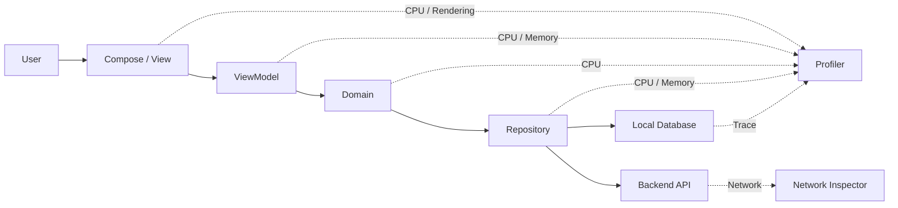
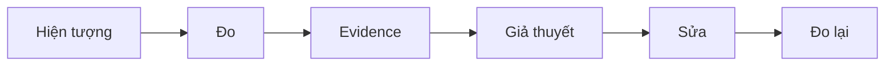
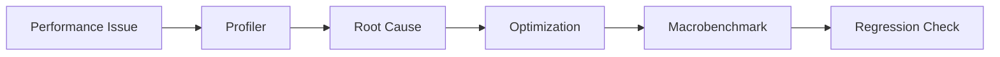

# 021 - Android Profiler

**Học phần:** 05 - Quality, Release and Portfolio
**Module:** Module 10 - Linting, Debugging and Benchmark
**Nhóm nội dung:** Performance
**Nguồn roadmap:** Linting, Debugging and Benchmark / Performance
**Loại bài:** quality
**Thứ tự trong module:** 021
**Thời lượng gợi ý:** 30 phút

---

## 1. Tóm tắt

**Android Profiler** là nhóm công cụ phân tích hiệu năng trong Android Studio, giúp developer quan sát ứng dụng trong lúc chạy để tìm nguyên nhân của các vấn đề như CPU tăng cao, thao tác UI bị giật, main thread bị block, cấp phát bộ nhớ quá nhiều, memory leak hoặc các đoạn xử lý mất nhiều thời gian.

Android Studio hiện cung cấp các công cụ profiling để theo dõi CPU và memory, phân tích method call, heap dump và system trace. Với vấn đề network, Android Studio cung cấp **Network Inspector** trong cửa sổ **App Inspection** để theo dõi request và response theo thời gian thực.

Profiler không chỉ trả lời câu hỏi:

> "Ứng dụng có chậm không?"

Mục tiêu quan trọng hơn là xác định:

> "Ứng dụng chậm ở đâu, trong user flow nào, thread nào, method nào hoặc tài nguyên nào?"

Trong quy trình phát triển Android, profiling nằm giữa việc **phát hiện vấn đề hiệu năng** và **xác minh giải pháp**:

```text
Phát hiện vấn đề
        ↓
Tái hiện user flow
        ↓
Đo bằng profiler
        ↓
Tìm bottleneck
        ↓
Tối ưu code
        ↓
Đo lại
        ↓
Benchmark / Regression Test
```

Android Profiler vì vậy là công cụ điều tra hiệu năng, còn các công cụ như `Macrobenchmark` phù hợp hơn để tạo phép đo lặp lại nhằm phát hiện performance regression.

## 2. Mục tiêu học tập

Sau bài học, người học có thể:

* Giải thích được mục đích của Android Profiler trong quá trình phát triển ứng dụng.
* Phân biệt profiling với debugging và benchmarking.
* Xác định khi nào nên sử dụng CPU profiling, Memory Profiler hoặc Network Inspector.
* Xây dựng một user journey cụ thể trước khi bắt đầu profiling.
* Phân tích CPU usage, thread activity, call stack và system trace ở mức cơ bản.
* Sử dụng heap dump và allocation information để điều tra vấn đề bộ nhớ.
* Phát hiện request mạng dư thừa hoặc bất thường bằng Network Inspector.
* Thêm trace section vào code để đánh dấu đoạn xử lý quan trọng.
* Phân tích một bottleneck và đưa ra giả thuyết tối ưu thay vì tối ưu theo cảm tính.
* Đo lại sau khi sửa để xác minh hiệu quả.
* Tạo được một performance investigation report làm artifact cho portfolio.

## 3. Khái niệm cốt lõi

### 3.1. Profiling là gì?

**Profiling** là quá trình thu thập và phân tích dữ liệu runtime của ứng dụng để xác định ứng dụng đang sử dụng tài nguyên như thế nào.

Các tài nguyên thường được quan tâm gồm:

* CPU;
* main thread;
* worker thread;
* memory;
* object allocation;
* garbage collection;
* network;
* rendering;
* thời gian thực thi của method;
* system event.

Ví dụ, một màn hình danh sách cuộn không mượt có thể xuất phát từ nhiều nguyên nhân:

* deserialize JSON trên main thread;
* decode bitmap quá lớn;
* tính toán phức tạp trong `Composable`;
* tạo quá nhiều object;
* garbage collection xảy ra liên tục;
* database query chạy đồng bộ;
* quá nhiều recomposition;
* xử lý dữ liệu lặp lại cho mỗi frame.

Nếu chỉ nhìn code, developer có thể đoán sai nguyên nhân.

Profiler cung cấp dữ liệu runtime để biến quá trình:

```text
"Em nghĩ đoạn này chậm"
```

thành:

```text
"Trace cho thấy đoạn này chiếm phần lớn thời gian của user journey"
```

### 3.2. Profiling khác debugging và benchmarking

| Kỹ thuật     | Câu hỏi chính                                          | Ví dụ                                        |
| ------------ | ------------------------------------------------------ | -------------------------------------------- |
| Debugging    | Vì sao chương trình chạy sai?                          | Tìm nguyên nhân `NullPointerException`       |
| Profiling    | Thời gian và tài nguyên đang bị tiêu tốn ở đâu?        | Tìm method làm main thread bị block          |
| Benchmarking | Hiệu năng đo được là bao nhiêu và có regression không? | Đo startup hoặc scrolling qua nhiều lần chạy |

Android Profiler phù hợp với việc điều tra một lần chạy cụ thể.

`Macrobenchmark` phù hợp hơn khi cần đo các user journey lớn như startup, scrolling hoặc animation theo một quy trình có thể lặp lại.

> **Nguyên tắc:** Profile để tìm nguyên nhân. Benchmark để đo và bảo vệ kết quả.

## 4. Vị trí của Android Profiler trong quy trình phát triển

Android Profiler không thuộc riêng UI layer, data layer hay domain layer. Nó quan sát hành vi runtime xuyên qua nhiều tầng của ứng dụng.



Ví dụ một thao tác `Refresh` tưởng như chỉ liên quan network nhưng thực tế có thể bao gồm:

1. Người dùng nhấn refresh.
2. UI gửi event đến `ViewModel`.
3. `ViewModel` gọi `Repository`.
4. `Repository` gọi REST API.
5. Response được deserialize.
6. Dữ liệu được map sang domain model.
7. Dữ liệu được ghi vào Room.
8. `Flow` emit state mới.
9. Compose recompose.
10. Danh sách được render.

Một lỗi performance ở bất kỳ bước nào cũng có thể khiến người dùng cảm nhận rằng:

> "API chậm."

Trong khi nguyên nhân thật có thể là JSON mapping, database, main-thread work hoặc rendering.

## 5. Các công cụ quan trọng

### 5.1. CPU profiling và System Trace

CPU profiling được sử dụng khi ứng dụng có các dấu hiệu như:

* UI phản hồi chậm;
* startup lâu;
* animation giật;
* scrolling không mượt;
* CPU usage cao;
* một thao tác mất nhiều thời gian;
* main thread bị block.

Android Studio có thể cung cấp thông tin về CPU usage, interaction, lifecycle event, thread và call stack. Với Java/Kotlin method recording, profiler có thể dùng runtime instrumentation để ghi nhận thời điểm vào và ra khỏi method, từ đó phân tích thời gian thực thi. Instrumentation tạo overhead nên kết quả profiling không nên được xem như benchmark production tuyệt đối.

Một số dạng dữ liệu thường gặp:

* CPU usage timeline;
* threads;
* call stack;
* flame chart;
* top-down view;
* method trace;
* system trace.

**System Trace** cho góc nhìn rộng hơn về hoạt động của process, thread, CPU scheduling và các event của hệ thống. Đây là công cụ đặc biệt hữu ích khi điều tra latency, UI jank hoặc contention.

Ví dụ:

```text
User nhấn "Mở chi tiết"
        ↓
Main thread
        ↓
loadArticle()
        ↓
decodeLargeImage()
        ↓
120 ms
```

Profiler giúp developer chuyển từ:

> "Mở màn hình hơi lag."

sang giả thuyết cụ thể:

> "`decodeLargeImage()` đang thực hiện quá nhiều công việc trên main thread."

### 5.2. Memory Profiler

Memory Profiler được sử dụng để điều tra:

* memory usage tăng liên tục;
* object không được giải phóng;
* `Activity` hoặc object lớn bị giữ lại;
* allocation quá nhiều;
* garbage collection xảy ra thường xuyên;
* ứng dụng bị `OutOfMemoryError`;
* thao tác UI tạo ra lượng lớn object ngắn hạn.

Memory Profiler có thể hiển thị memory usage theo thời gian, object allocation, garbage collection và cho phép capture heap dump để phân tích object đang tồn tại trong heap.

Một pattern đáng chú ý:

```text
Mở Screen A
Memory: 150 MB

Thoát Screen A
Memory: 149 MB

Mở lại Screen A
Memory: 190 MB

Thoát
Memory: 189 MB

Mở lại
Memory: 230 MB
```

Pattern này chưa tự động chứng minh có memory leak, nhưng là tín hiệu cần điều tra.

Developer có thể:

1. Thực hiện cùng một user journey nhiều lần.
2. Quan sát memory timeline.
3. Capture heap dump.
4. Tìm các object đáng lẽ đã được giải phóng.
5. Kiểm tra reference chain.
6. Xác định object nào đang giữ reference.

> **Lưu ý:** Memory tăng không đồng nghĩa chắc chắn memory leak. Runtime, cache và garbage collector có thể giữ bộ nhớ vì nhiều lý do. Cần kiểm tra object và reference thực tế.

### 5.3. Network Inspector

Trong Android Studio hiện đại, việc phân tích network được thực hiện bằng **Network Inspector** tại:

```text
View
→ Tool Windows
→ App Inspection
→ Network Inspector
```

Network Inspector hiển thị network activity theo timeline và cho phép xem thông tin request, response, timing và thread liên quan. Công cụ hiện hỗ trợ trực tiếp các kết nối qua `HttpsURLConnection` và `OkHttp`; `Retrofit` thường được quan sát được khi sử dụng `OkHttp` bên dưới.

Network Inspector hữu ích để phát hiện:

* một API bị gọi nhiều lần;
* request bị gửi khi không cần;
* payload quá lớn;
* response mất nhiều thời gian;
* request được trigger sai lifecycle;
* cùng dữ liệu được tải lại khi rotate;
* pagination gọi trùng page;
* image hoặc resource được tải dư thừa.

Ví dụ:

```text
Mở ProductScreen
    ↓
GET /product/42
GET /product/42
GET /product/42
```

Nếu user chỉ mở màn hình một lần, ba request giống nhau là dấu hiệu cần kiểm tra.

Nguyên nhân có thể là:

* gọi API trực tiếp từ `Composable`;
* `LaunchedEffect` sử dụng key không ổn định;
* collector được tạo nhiều lần;
* `ViewModel` khởi tạo logic không đúng;
* retry bị cấu hình sai.

### 5.4. Các công cụ bổ trợ

Không nên cố dùng Android Profiler cho mọi loại vấn đề.

Một số công cụ bổ trợ gồm:

| Công cụ           | Phù hợp với                                  |
| ----------------- | -------------------------------------------- |
| Layout Inspector  | Layout, Compose hierarchy, recomposition     |
| Network Inspector | Request/response và network timing           |
| Logcat            | Event, exception và diagnostic log           |
| Perfetto          | System-level trace chuyên sâu                |
| Macrobenchmark    | Startup, scrolling, animation benchmark      |
| Android Vitals    | Performance thực tế từ người dùng production |

Layout Inspector còn có thể hỗ trợ quan sát số lần một `Composable` được recomposed hoặc skipped, hữu ích khi điều tra Compose UI cập nhật quá mức.

## 6. Quy trình profiling thực tế

### 6.1. Xác định user journey

Không nên mở Profiler rồi quan sát toàn bộ ứng dụng một cách ngẫu nhiên.

Trước tiên phải xác định một **critical user journey**.

Ví dụ:

```text
Cold start
→ Home
→ Product list
→ Product detail
```

Hoặc:

```text
Open Feed
→ Scroll 20 items
→ Load next page
```

Các user journey thường đáng profiling gồm:

* cold startup;
* mở màn hình quan trọng;
* scrolling;
* chuyển màn hình;
* animation;
* phát video/audio;
* xử lý ảnh;
* sync dữ liệu.

Android performance guidance khuyến nghị tập trung vào các critical user journeys như startup, scrolling, transition và long-running flow rồi dùng các công cụ phù hợp để điều tra.

### 6.2. Tái hiện và ghi dữ liệu

Một quy trình đơn giản:

1. Khởi chạy app trên device hoặc emulator.
2. Mở Profiler.
3. Chọn đúng app process.
4. Bắt đầu recording phù hợp.
5. Thực hiện đúng user journey đã định nghĩa.
6. Dừng recording.
7. Chỉ phân tích khoảng thời gian liên quan.

Ví dụ:

```text
00:00 Start recording
00:02 Open Feed
00:04 Start scrolling
00:09 Jank xuất hiện
00:11 Stop recording
```

Khi phân tích, cần tập trung vào đoạn `00:04` đến `00:09` thay vì toàn bộ session.

### 6.3. Hình thành giả thuyết

Profiler cung cấp dữ liệu, nhưng developer vẫn phải diễn giải dữ liệu.

Quy trình nên là:



Ví dụ:

**Hiện tượng:** Product list scroll bị giật.

**Evidence:** Main thread có đoạn xử lý dài trong `mapProduct()`.

**Giả thuyết:** UI đang chuyển đổi model quá nhiều lần trong quá trình cập nhật state.

**Thay đổi:** Chuyển mapping sang data/domain layer và cache kết quả.

**Xác minh:** Profile lại cùng user journey.

Đây là cách tiếp cận tốt hơn:

```text
"List lag → đổi LazyColumn thành RecyclerView"
```

mà chưa có dữ liệu chứng minh nguyên nhân.

### 6.4. Đo lại sau khi tối ưu

Mọi tối ưu performance nên có phép đo trước và sau.

Ví dụ:

| Phiên bản | Quan sát                                                  |
| --------- | --------------------------------------------------------- |
| Before    | Main thread thường xuyên chạy `buildUiModel()` khi scroll |
| After     | Mapping chỉ xảy ra khi data thay đổi                      |
| Kết quả   | Trace không còn hotspot tương ứng trong scroll journey    |

Nếu cần con số ổn định để đưa vào CI hoặc regression testing, bước tiếp theo nên chuyển sang `Macrobenchmark` thay vì dựa hoàn toàn vào một lần chạy Profiler.

## 7. Đánh dấu code bằng trace section

Khi một đoạn nghiệp vụ khó nhận biết trong system trace, developer có thể thêm trace section để đánh dấu đoạn code cần quan sát.

Ví dụ:

```kotlin
import android.os.Trace

fun buildHomeFeed(): List<FeedItem> {
    Trace.beginSection("BuildHomeFeed")

    return try {
        loadPosts()
            .filter { it.isVisible }
            .map { post ->
                FeedItem(
                    id = post.id,
                    title = post.title,
                    thumbnailUrl = post.thumbnailUrl
                )
            }
    } finally {
        Trace.endSection()
    }
}
```

Trace section giúp tạo mốc có ý nghĩa nghiệp vụ như:

```text
BuildHomeFeed
```

thay vì chỉ phải đọc một chuỗi call stack khó liên hệ với user flow.

Có thể áp dụng cách tương tự cho:

```kotlin
Trace.beginSection("DecodeAvatar")
Trace.beginSection("LoadDashboard")
Trace.beginSection("MapSearchResults")
Trace.beginSection("PrepareCheckout")
```

> **Lưu ý:** Trace marker nên ngắn, có ý nghĩa và tập trung vào đoạn code đang cần phân tích. Không nên thêm trace vào mọi method trong ứng dụng.

## 8. Các tình huống điều tra thực tế

### 8.1. UI bị jank khi scrolling

Giả sử ứng dụng thương mại điện tử có danh sách 200 sản phẩm.

Người dùng phản ánh:

> "Cuộn danh sách cứ bị khựng."

Quy trình:

1. Xác định user journey: mở Product List và scroll liên tục.
2. Ghi CPU/System Trace.
3. Quan sát main thread.
4. Tìm những đoạn execution dài trùng với thời điểm jank.
5. Kiểm tra call stack.

Phát hiện:

```text
ProductCard
    ↓
formatPrice()
    ↓
DecimalFormat(...)
```

`DecimalFormat` được tạo lại cho nhiều item trong quá trình render.

Giải pháp có thể là:

* chuẩn hóa dữ liệu trước khi đưa lên UI;
* tránh lặp computation không cần thiết;
* tránh tạo object nặng trong hot rendering path.

Sau đó profile lại cùng user journey.

### 8.2. Memory tăng sau mỗi lần mở màn hình

User journey:

```text
Home
→ PhotoDetail
→ Back
→ PhotoDetail
→ Back
→ lặp lại
```

Memory tăng sau mỗi vòng.

Developer capture heap dump và phát hiện một object có reference chain:

```text
Singleton
    ↓
listener
    ↓
PhotoDetailActivity
```

Nguyên nhân:

* listener được đăng ký;
* listener không được unregister;
* singleton sống lâu hơn `Activity`;
* `Activity` không thể được garbage collector thu hồi.

Cách xử lý:

* bỏ listener khi không còn cần;
* tránh giữ `Activity` hoặc `View` trong object có lifecycle dài;
* sử dụng lifecycle-aware API khi phù hợp.

### 8.3. API bị gọi lặp

Network Inspector cho thấy:

```text
GET /profile
GET /profile
GET /profile
GET /profile
```

trong vài giây.

Code có dạng:

```kotlin
@Composable
fun ProfileScreen(
    viewModel: ProfileViewModel
) {
    viewModel.loadProfile()

    // UI...
}
```

Đây là vấn đề vì `Composable` có thể chạy lại nhiều lần.

Có thể chuyển event khởi tạo sang một cơ chế phù hợp hơn:

```kotlin
@Composable
fun ProfileScreen(
    viewModel: ProfileViewModel
) {
    LaunchedEffect(Unit) {
        viewModel.loadProfile()
    }

    // UI...
}
```

Tuy nhiên giải pháp tốt hơn còn phụ thuộc vào ownership của data và cách `ViewModel` được thiết kế.

Profiler/Inspector giúp xác nhận request thực tế có bị gửi lặp hay không thay vì suy luận chỉ từ source code.

## 9. Lỗi thường gặp khi profiling

**Chỉ nhìn CPU percentage rồi kết luận code chậm**

* **Hiện tượng:** CPU tăng cao trong một thời điểm.
* **Vấn đề:** CPU cao chưa cho biết method nào gây ra vấn đề hoặc có ảnh hưởng người dùng hay không.
* **Cách xử lý:** Liên hệ CPU spike với user journey, thread và call stack.

**Profile toàn bộ ứng dụng mà không có kịch bản**

* **Hiện tượng:** Trace chứa quá nhiều dữ liệu.
* **Nguyên nhân:** Không xác định user journey trước khi recording.
* **Cách xử lý:** Profile một thao tác nhỏ, có điểm bắt đầu và kết thúc rõ ràng.

**Xem một lần chạy như benchmark tuyệt đối**

* **Hiện tượng:** Tối ưu dựa trên chênh lệch rất nhỏ giữa hai session.
* **Nguyên nhân:** Device state, thermal state, background process và profiler overhead có thể làm thay đổi kết quả.
* **Cách xử lý:** Dùng profiler để điều tra; dùng benchmark lặp lại cho số liệu performance chính thức.

**Kết luận memory leak chỉ vì memory chưa giảm**

* **Hiện tượng:** Heap không trở về mức ban đầu.
* **Nguyên nhân:** Cache, runtime hoặc object chưa được GC.
* **Cách xử lý:** Kiểm tra heap dump và reference chain.

**Profile debug build rồi xem đó là performance production**

* **Hiện tượng:** App có vẻ chậm hơn nhiều so với production.
* **Nguyên nhân:** Debugging và instrumentation có thể tạo overhead.
* **Cách xử lý:** Hiểu build configuration đang đo và lựa chọn chiến lược profiling/benchmark phù hợp.

**Tối ưu một method nhưng UX không thay đổi**

* **Hiện tượng:** Một method nhanh hơn nhưng screen vẫn lag.
* **Nguyên nhân:** Method đó không nằm trên critical path hoặc bottleneck thật nằm ở nơi khác.
* **Cách xử lý:** Luôn bắt đầu từ critical user journey.

## 10. Best practices

* Xác định performance problem từ góc nhìn người dùng trước khi mở Profiler.
* Profile một user journey cụ thể thay vì toàn bộ app.
* Reproduce cùng một flow trước và sau khi tối ưu.
* Bắt đầu từ thread và khoảng thời gian liên quan rồi mới đi sâu xuống method.
* Tập trung vào main thread khi điều tra UI jank.
* Không block main thread bằng disk I/O, network hoặc computation nặng.
* Không kết luận memory leak chỉ từ đường memory graph.
* Dùng heap dump để xem object và reference chain khi điều tra leak.
* Dùng Network Inspector để xác nhận request thực tế thay vì chỉ đọc Retrofit interface.
* Không tối ưu code không xuất hiện trên critical path.
* Tách profiling và benchmarking thành hai bước khác nhau.
* Ghi lại evidence trước khi sửa code.
* Đo lại sau mỗi tối ưu quan trọng.
* Test trên thiết bị có đặc điểm gần với nhóm thiết bị người dùng mục tiêu khi performance thực tế quan trọng.
* Kết hợp dữ liệu local profiling với Android Vitals hoặc production telemetry khi đánh giá vấn đề ngoài thực tế.

## 11. Testing và performance regression

Profiler là công cụ điều tra tương tác, không nên là lớp bảo vệ duy nhất cho performance.

Một workflow trưởng thành hơn:



Ví dụ các test case:

| Test case                 | Công cụ phù hợp          | Kết quả mong đợi                          |
| ------------------------- | ------------------------ | ----------------------------------------- |
| Cold startup              | `Macrobenchmark` + trace | Không regression đáng kể                  |
| Scroll product list       | `FrameTimingMetric`      | Không xuất hiện jank bất thường           |
| Memory khi mở/đóng screen | Memory Profiler          | Object màn hình cũ có thể được giải phóng |
| Duplicate API request     | Network Inspector        | Một interaction không tạo request dư      |
| Heavy computation         | CPU/System Trace         | Không block main thread                   |
| Compose update            | Layout Inspector         | Không có recomposition bất thường         |

`FrameTimingMetric` trong Macrobenchmark có thể cung cấp dữ liệu về thời gian frame và frame overrun, giúp theo dõi performance của các journey như scrolling hoặc animation.

## 12. Bảo mật và quyền riêng tư

Profiling có thể làm lộ dữ liệu mà developer không nên chia sẻ tùy tiện.

Đặc biệt với network inspection, request hoặc response có thể chứa:

* access token;
* session identifier;
* email;
* user ID;
* location;
* personal profile;
* backend payload;
* internal endpoint.

Do đó:

* Không đưa access token thật vào screenshot portfolio.
* Không commit trace chứa dữ liệu nhạy cảm vào public repository.
* Không chia sẻ request/response production chưa được làm sạch.
* Mask user identifier khi viết performance report.
* Ưu tiên dữ liệu mock hoặc staging khi tạo tài liệu demo.
* Kiểm tra trace, screenshot và heap dump trước khi gửi cho người khác.
* Không sử dụng profiling như một lý do để thu thập thêm dữ liệu production không cần thiết.

> **Nguyên tắc:** Performance evidence cũng có thể là dữ liệu nhạy cảm.

## 13. Bài thực hành

### 13.1. Yêu cầu

Tạo hoặc sử dụng một Android app nhỏ có màn hình hiển thị danh sách.

Tạo một hàm cố ý thực hiện computation tương đối nặng:

```kotlin
fun expensiveTransform(values: List<Int>): List<Int> {
    return values
        .map { value ->
            var result = value.toLong()

            repeat(5_000) {
                result = (result * 31 + it) % 1_000_003
            }

            result.toInt()
        }
}
```

Gọi hàm này trong một user flow có thể tái hiện được.

> Đoạn code trên chỉ dùng để tạo tình huống profiling trong bài thực hành, không phải ví dụ kiến trúc nên dùng trong production.

### 13.2. Các bước thực hiện

1. Chạy ứng dụng.
2. Xác định user journey kích hoạt `expensiveTransform()`.
3. Mở Profiler trong Android Studio.
4. Ghi CPU trace cho user journey.
5. Tìm đoạn execution liên quan.
6. Ghi lại:

   * thread;
   * method;
   * khoảng thời gian;
   * biểu hiện trên UI.
7. Thêm trace marker:

```kotlin
import android.os.Trace

fun expensiveTransform(values: List<Int>): List<Int> {
    Trace.beginSection("ExpensiveTransform")

    return try {
        values.map { value ->
            var result = value.toLong()

            repeat(5_000) {
                result = (result * 31 + it) % 1_000_003
            }

            result.toInt()
        }
    } finally {
        Trace.endSection()
    }
}
```

8. Record lại.
9. Xác định marker `ExpensiveTransform`.
10. Chuyển computation khỏi main thread nếu user flow hiện đang block UI.
11. Profile lần nữa.
12. So sánh before/after.

### 13.3. Kết quả mong đợi

Người học cần tạo được một báo cáo ngắn:

```text
User journey:
Home → Analyze Data

Symptom:
UI bị đứng trong lúc xử lý.

Evidence:
ExpensiveTransform xuất hiện trên critical path.

Root cause:
Computation nặng chạy trên main thread.

Fix:
Chuyển computation sang background execution phù hợp.

Verification:
Profile lại và main thread không còn bị block bởi computation này.
```

Không yêu cầu báo cáo phải chứng minh một con số benchmark tuyệt đối.

Mục tiêu của bài là xây dựng đúng quy trình:

```text
Symptom
→ Evidence
→ Root cause
→ Fix
→ Verification
```

## 14. Artifact cho portfolio

Tạo thư mục:

```text
performance-investigation/
├── README.md
├── before.png
├── after.png
└── findings.md
```

Trong `README.md`, ghi:

```markdown
# Android Performance Investigation

## Problem

Mô tả vấn đề từ góc nhìn người dùng.

## User Journey

Các bước tái hiện vấn đề.

## Tool

Android Studio Profiler.

## Evidence

Mô tả hotspot, thread hoặc memory behavior đã quan sát.

## Root Cause

Giải thích nguyên nhân kỹ thuật.

## Fix

Mô tả thay đổi trong code.

## Verification

Mô tả kết quả sau khi profile lại.
```

Artifact tốt phải thể hiện được tư duy điều tra, không chỉ có screenshot Profiler.

Portfolio nên cho thấy:

```text
Tôi phát hiện vấn đề
        ↓
Tôi đo nó
        ↓
Tôi tìm được evidence
        ↓
Tôi xác định nguyên nhân
        ↓
Tôi sửa
        ↓
Tôi xác minh lại
```

## 15. Checklist hoàn thành

* [ ] Tôi giải thích được profiling là gì.
* [ ] Tôi phân biệt được profiling với debugging.
* [ ] Tôi phân biệt được profiling với benchmarking.
* [ ] Tôi biết khi nào cần CPU/System Trace.
* [ ] Tôi biết khi nào cần Memory Profiler.
* [ ] Tôi biết khi nào cần Network Inspector.
* [ ] Tôi biết cách bắt đầu từ một critical user journey.
* [ ] Tôi hiểu CPU spike không tự động chỉ ra root cause.
* [ ] Tôi biết cách tìm call stack hoặc hotspot liên quan.
* [ ] Tôi biết heap dump dùng để điều tra object và reference.
* [ ] Tôi không kết luận memory leak chỉ từ memory graph.
* [ ] Tôi biết cách thêm `Trace.beginSection()` và `Trace.endSection()`.
* [ ] Tôi biết profiler có thể tạo measurement overhead.
* [ ] Tôi biết phải profile lại sau khi tối ưu.
* [ ] Tôi hiểu khi nào nên chuyển sang `Macrobenchmark`.
* [ ] Tôi đã hoàn thành một performance investigation nhỏ.
* [ ] Tôi đã lưu evidence before/after.
* [ ] Tôi đã tạo artifact có thể đưa vào portfolio.

## 16. Câu hỏi tự kiểm tra

1. Vì sao developer không nên bắt đầu profiling bằng cách mở Profiler rồi tương tác ngẫu nhiên với toàn bộ ứng dụng?

2. CPU usage tăng cao có đủ để kết luận một method cụ thể là nguyên nhân gây lag không? Vì sao?

3. Khi memory của ứng dụng tăng sau mỗi lần mở một màn hình, cần kiểm tra thêm dữ liệu gì trước khi kết luận có memory leak?

4. Trong trường hợp API `/profile` được gọi bốn lần sau một thao tác duy nhất, Network Inspector giúp developer xác minh điều gì?

5. Vì sao kết quả từ một profiler session không nên thay thế hoàn toàn cho `Macrobenchmark` khi cần theo dõi performance regression?

## 17. Tổng kết

Android Profiler là công cụ quan trọng để chuyển một vấn đề performance mơ hồ thành evidence có thể phân tích.

Quy trình cốt lõi cần nhớ là:

```text
Critical User Journey
        ↓
Reproduce
        ↓
Profile
        ↓
Find Evidence
        ↓
Form Hypothesis
        ↓
Optimize
        ↓
Profile Again
        ↓
Benchmark
```

CPU profiling và System Trace giúp điều tra thời gian thực thi, thread và bottleneck. Memory Profiler giúp phân tích allocation, heap và reference. Network Inspector giúp quan sát request/response và phát hiện network behavior bất thường. Các công cụ này nên được kết hợp với Layout Inspector, Perfetto, Android Vitals và Macrobenchmark tùy loại vấn đề.

Điểm quan trọng nhất của bài không phải là nhớ vị trí từng nút trong Android Studio, mà là hình thành tư duy performance engineering:

> **Không tối ưu bằng cảm giác. Hãy xác định user journey, đo, tìm evidence, sửa đúng bottleneck và đo lại.**
