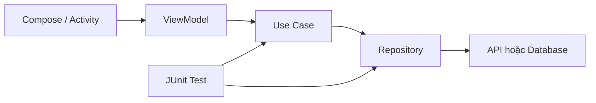

# 001 - JUnit

**Học phần:** 05 - Quality, Release and Portfolio
**Module:** Module 11 - Testing
**Nhóm nội dung:** Unit Testing
**Nguồn roadmap:** Testing / Unit Testing
**Loại bài:** lesson
**Thứ tự trong module:** 001
**Thời lượng gợi ý:** 30 phút

---

## 1. Tóm tắt

`JUnit` là nền tảng phổ biến để viết và chạy unit test cho mã JVM, đồng thời được sử dụng rộng rãi trong các dự án Android để kiểm thử logic Kotlin/Java trên máy phát triển.

Trong Android, local unit test thường chạy trực tiếp trên JVM mà không cần khởi động emulator hoặc thiết bị thật. Vì vậy, chúng phù hợp để kiểm tra nhanh các thành phần như validator, use case, ViewModel có thể tách khỏi Android framework, repository logic và các hàm xử lý dữ liệu. Android hiện vẫn hướng dẫn viết local unit test bằng JUnit 4 trong source set `src/test/`.

Unit test không chỉ giúp phát hiện lỗi. Một test suite tốt còn đóng vai trò như lớp bảo vệ khi refactor, thay đổi state logic hoặc mở rộng kiến trúc ứng dụng. Android Developers cũng xem kiểm thử tự động là một phần quan trọng để phát hiện lỗi sớm và giảm rủi ro regression.

---

## 2. Mục tiêu học tập

Sau bài học này, người học có thể:

* Giải thích được vai trò của `JUnit` trong một dự án Android.
* Phân biệt được local unit test với instrumented test.
* Xác định được những thành phần phù hợp để kiểm thử bằng JUnit trên JVM.
* Viết được một test sử dụng `@Test` và các assertion cơ bản.
* Tổ chức test theo mô hình Arrange → Act → Assert.
* Phân tích được một test failure để tìm nguyên nhân.
* Nhận biết được vấn đề khi local test phụ thuộc trực tiếp vào Android framework.
* Tạo được một artifact unit test có thể đưa vào portfolio hoặc pipeline CI.

---

## 3. Vì sao ứng dụng Android cần unit test?

Giả sử một ứng dụng có chức năng tính giá sau khi áp dụng khuyến mãi.

Logic ban đầu:

```text
Giá gốc
   ↓
Áp dụng phần trăm giảm giá
   ↓
Tính giá cuối
   ↓
Hiển thị trên UI
```

Developer có thể mở ứng dụng và thử thủ công:

```text
100.000 đồng
↓
giảm 20%
↓
80.000 đồng
```

Cách kiểm tra này có thể hoạt động với một trường hợp, nhưng khi logic phát triển sẽ xuất hiện nhiều tình huống:

* giảm 0%;
* giảm 100%;
* giá bằng 0;
* phần trăm giảm âm;
* phần trăm giảm lớn hơn 100;
* thay đổi công thức tính trong một lần refactor.

Nếu mỗi lần thay đổi code đều phải mở ứng dụng và kiểm tra thủ công, quá trình phát triển sẽ chậm và rất dễ bỏ sót regression.

Unit test chuyển việc kiểm tra này thành mã có thể chạy lại tự động:

```text
Code production
      ↓
JUnit test
      ↓
Chạy test
      ↓
So sánh actual với expected
      ↓
Pass hoặc Fail
```

Một test tốt cho phép developer thay đổi implementation nhưng vẫn nhanh chóng xác nhận rằng hành vi quan trọng của ứng dụng chưa bị phá vỡ.

---

## 4. JUnit trong hệ thống kiểm thử Android

Một dự án Android thường có hai môi trường kiểm thử quan trọng:

| Đặc điểm               | Local unit test                  | Instrumented test                      |
| ---------------------- | -------------------------------- | -------------------------------------- |
| Source set             | `src/test/`                      | `src/androidTest/`                     |
| Nơi chạy               | JVM trên máy phát triển hoặc CI  | Thiết bị Android hoặc emulator         |
| Tốc độ                 | Thường nhanh                     | Thường chậm hơn                        |
| Android framework thật | Không                            | Có                                     |
| Phù hợp                | Logic Kotlin/Java                | Integration với Android, UI, framework |
| Ví dụ                  | Validator, use case, calculation | `Context`, Room trên thiết bị, UI flow |

Android Developers xác định `test` là source set dành cho test chạy trên máy local, còn `androidTest` dành cho test chạy trên thiết bị thật hoặc thiết bị ảo.

Điều quan trọng là:

> Không phải mọi logic trong ứng dụng Android đều cần chạy trên Android để kiểm thử.

Nếu một thành phần có thể được viết dưới dạng Kotlin thuần và không phụ thuộc trực tiếp vào UI hoặc Android framework, local unit test thường là lựa chọn đầu tiên vì phản hồi nhanh hơn.

---

## 5. Thành phần cơ bản của một JUnit test

Một unit test thường gồm ba bước:

```text
Arrange
   ↓
Act
   ↓
Assert
```

* **Arrange:** chuẩn bị object, dependency và input.
* **Act:** thực thi hành vi cần kiểm thử.
* **Assert:** kiểm tra kết quả thực tế có đúng với kết quả mong đợi hay không.

JUnit nhận biết test method thông qua annotation `@Test`. Các assertion như `assertEquals()`, `assertTrue()` và `assertFalse()` được sử dụng để xác minh kết quả.

Ví dụ:

```kotlin
import org.junit.Assert.assertEquals
import org.junit.Test

class CalculatorTest {

    @Test
    fun add_twoNumbers_returnsSum() {
        // Arrange
        val calculator = Calculator()

        // Act
        val result = calculator.add(2, 3)

        // Assert
        assertEquals(5, result)
    }
}
```

Nếu `result` bằng `5`, test pass.

Nếu implementation trả về giá trị khác:

```text
Expected: 5
Actual:   6
```

test sẽ fail và cung cấp tín hiệu rằng hành vi của code không còn đúng với kỳ vọng đã được định nghĩa.

---

## 6. Viết unit test đầu tiên

Giả sử ứng dụng có logic tính giá sau giảm giá.

Code production:

```kotlin
class DiscountCalculator {

    fun calculate(
        originalPrice: Int,
        discountPercent: Int
    ): Int {
        require(originalPrice >= 0)
        require(discountPercent in 0..100)

        return originalPrice -
            originalPrice * discountPercent / 100
    }
}
```

Ta cần kiểm tra ít nhất:

* trường hợp thông thường;
* boundary case;
* input không hợp lệ.

### 6.1. Kiểm tra hành vi thông thường

```kotlin
import org.junit.Assert.assertEquals
import org.junit.Test

class DiscountCalculatorTest {

    private val calculator = DiscountCalculator()

    @Test
    fun calculate_twentyPercentDiscount_returnsDiscountedPrice() {
        val result = calculator.calculate(
            originalPrice = 100_000,
            discountPercent = 20
        )

        assertEquals(80_000, result)
    }
}
```

Tên test mô tả ba thông tin:

```text
calculate
    ↓
twentyPercentDiscount
    ↓
returnsDiscountedPrice
```

Có thể đọc gần giống một câu:

> Khi `calculate()` nhận mức giảm 20%, nó phải trả về giá sau giảm chính xác.

Test name rõ nghĩa giúp developer biết ngay hành vi nào bị lỗi mà không cần mở implementation.

### 6.2. Kiểm tra boundary và input không hợp lệ

Không nên chỉ kiểm tra happy path.

Ví dụ mức giảm 0%:

```kotlin
@Test
fun calculate_zeroPercentDiscount_returnsOriginalPrice() {
    val result = calculator.calculate(
        originalPrice = 100_000,
        discountPercent = 0
    )

    assertEquals(100_000, result)
}
```

Mức giảm 100%:

```kotlin
@Test
fun calculate_fullDiscount_returnsZero() {
    val result = calculator.calculate(
        originalPrice = 100_000,
        discountPercent = 100
    )

    assertEquals(0, result)
}
```

Input không hợp lệ:

```kotlin
@Test(expected = IllegalArgumentException::class)
fun calculate_discountAboveOneHundred_throwsException() {
    calculator.calculate(
        originalPrice = 100_000,
        discountPercent = 120
    )
}
```

Các test này tạo thành một specification nhỏ cho `DiscountCalculator`.

Developer có thể refactor implementation sau này, nhưng miễn các hành vi trên vẫn được giữ nguyên thì test suite vẫn pass.

---

## 7. Unit test trong kiến trúc Android

JUnit trở nên đặc biệt hữu ích khi business logic được tách khỏi UI và Android framework.

Một kiến trúc đơn giản có thể có luồng:



Trong kiến trúc này:

* UI chịu trách nhiệm hiển thị và nhận interaction.
* `ViewModel` quản lý state ở tầng presentation.
* Use case chứa business rule.
* Repository cung cấp abstraction cho nguồn dữ liệu.
* JUnit có thể kiểm thử các lớp logic mà không cần chạy toàn bộ ứng dụng.

Một mục tiêu quan trọng của kiến trúc dễ kiểm thử là hạn chế việc business logic phụ thuộc trực tiếp vào `Activity`, `Fragment`, `Context` hoặc UI component.

Ví dụ, thay vì đặt logic tính giảm giá trong một composable:

```kotlin
@Composable
fun CheckoutScreen() {
    // Không nên chứa business rule phức tạp tại đây.
}
```

hãy tách thành:

```kotlin
class CalculateFinalPriceUseCase {

    operator fun invoke(
        price: Int,
        discountPercent: Int
    ): Int {
        require(price >= 0)
        require(discountPercent in 0..100)

        return price - price * discountPercent / 100
    }
}
```

Lúc này business rule có thể được kiểm thử bằng local JUnit test mà không cần Compose, emulator hay Android lifecycle.

---

## 8. Kiểm thử dependency bằng test double

Các class thực tế thường có dependency.

Ví dụ:

```kotlin
interface UserRepository {
    fun isPremiumUser(): Boolean
}

class GetDiscountUseCase(
    private val repository: UserRepository
) {

    fun execute(): Int {
        return if (repository.isPremiumUser()) {
            20
        } else {
            0
        }
    }
}
```

Không nên để unit test gọi database hoặc server thật.

Ta có thể tạo một fake đơn giản:

```kotlin
class FakeUserRepository(
    private val premium: Boolean
) : UserRepository {

    override fun isPremiumUser(): Boolean {
        return premium
    }
}
```

Test:

```kotlin
import org.junit.Assert.assertEquals
import org.junit.Test

class GetDiscountUseCaseTest {

    @Test
    fun execute_premiumUser_returnsTwentyPercent() {
        val repository = FakeUserRepository(
            premium = true
        )

        val useCase = GetDiscountUseCase(repository)

        val result = useCase.execute()

        assertEquals(20, result)
    }

    @Test
    fun execute_regularUser_returnsZeroPercent() {
        val repository = FakeUserRepository(
            premium = false
        )

        val useCase = GetDiscountUseCase(repository)

        val result = useCase.execute()

        assertEquals(0, result)
    }
}
```

Luồng test trở thành:

```text
Fake dependency
      ↓
Use Case
      ↓
Business logic
      ↓
Result
      ↓
Assertion
```

Android Developers cũng khuyến nghị thay dependency của unit under test bằng các thành phần có thể kiểm soát như fake hoặc test double để giữ test độc lập.

Fake thường dễ đọc và ít phụ thuộc framework hơn một hệ thống mock phức tạp.

---

## 9. Những gì nên kiểm thử bằng JUnit

Các đối tượng phù hợp với local unit test thường bao gồm:

* business rule;
* validator;
* mapper;
* formatter;
* calculator;
* parser;
* use case;
* state transformation;
* repository logic có dependency được thay bằng fake;
* ViewModel nếu dependency và asynchronous execution được kiểm soát;
* logic xử lý success/error;
* thuật toán hoặc utility Kotlin thuần.

Ví dụ:

```text
EmailValidator
PasswordValidator
CalculateShippingCostUseCase
LoginUseCase
ProductMapper
CartCalculator
SearchStateReducer
```

Không nên cố sử dụng local JUnit test cho mọi thứ.

Các hành vi phụ thuộc mạnh vào:

* UI framework;
* Android lifecycle thực;
* sensor;
* camera;
* permission;
* hệ thống Android;
* rendering;

có thể cần instrumented test, Robolectric hoặc các loại test khác.

Một chiến lược kiểm thử tốt thường sử dụng nhiều small test nhanh và ít test lớn hơn nhưng có fidelity cao hơn.

---

## 10. Lỗi thường gặp

**Hiện tượng:** Test pass khi chạy riêng nhưng fail khi chạy cả suite.
**Nguyên nhân:** Các test chia sẻ mutable state hoặc phụ thuộc vào thứ tự chạy.
**Cách xử lý:** Mỗi test phải tự chuẩn bị state cần thiết và không phụ thuộc vào test khác.

---

**Hiện tượng:** Test phụ thuộc vào network và lúc pass lúc fail.
**Nguyên nhân:** Unit test đang gọi external service thật.
**Cách xử lý:** Thay dependency mạng bằng fake hoặc test double có dữ liệu deterministic.

---

**Hiện tượng:** Local unit test xuất hiện lỗi `Method ... not mocked`.
**Nguyên nhân:** Test trong `src/test/` đang gọi trực tiếp method của Android framework. Android local test chạy trên JVM và không có implementation Android framework thực để thực thi method đó.
**Cách xử lý:** Tách Android dependency khỏi business logic, sử dụng fake/mock phù hợp hoặc chuyển loại test sang môi trường có Android framework khi thực sự cần.

---

**Hiện tượng:** Một thay đổi nhỏ khiến hàng chục test phải sửa.
**Nguyên nhân:** Test đang kiểm tra implementation detail thay vì behavior.
**Cách xử lý:** Ưu tiên test public behavior và kết quả quan sát được.

---

**Hiện tượng:** Test có quá nhiều mock và setup dài.
**Nguyên nhân:** Class production có quá nhiều dependency hoặc trách nhiệm.
**Cách xử lý:** Xem lại thiết kế class, dependency boundaries và cân nhắc sử dụng fake đơn giản hơn. Android Developers cũng cảnh báo nên tránh complex mock khi có thể.

---

## 11. Best practices

Một unit test tốt nên có các đặc điểm:

* **Nhanh:** có thể chạy liên tục trong quá trình phát triển.
* **Độc lập:** một test không phụ thuộc vào kết quả của test khác.
* **Deterministic:** cùng input phải cho cùng kết quả.
* **Dễ đọc:** tên test cho biết scenario và expected behavior.
* **Tập trung:** mỗi test bảo vệ một hành vi cụ thể.
* **Không phụ thuộc môi trường:** hạn chế network, thời gian hệ thống, database thật hoặc thiết bị.
* **Kiểm tra behavior:** không khóa chặt implementation detail.
* **Bao phủ boundary quan trọng:** không chỉ kiểm tra happy path.

Một cách đặt tên dễ đọc:

```text
method_condition_expectedResult
```

Ví dụ:

```text
calculate_zeroDiscount_returnsOriginalPrice

login_wrongPassword_returnsInvalidCredentials

execute_premiumUser_returnsDiscount

validate_emptyEmail_returnsFalse
```

Tên test không bắt buộc phải theo đúng một convention duy nhất, nhưng convention phải nhất quán trong project.

---

## 12. Bài thực hành

Tạo unit test cho một `PasswordValidator`.

Yêu cầu production code:

```kotlin
class PasswordValidator {

    fun isValid(password: String): Boolean {
        return password.length >= 8 &&
            password.any { it.isDigit() } &&
            password.any { it.isLetter() }
    }
}
```

Viết test cho ít nhất các trường hợp:

1. Password hợp lệ.
2. Password ngắn hơn 8 ký tự.
3. Password không có chữ số.
4. Password không có chữ cái.
5. Password rỗng.

Ví dụ cấu trúc:

```kotlin
class PasswordValidatorTest {

    private val validator = PasswordValidator()

    @Test
    fun isValid_validPassword_returnsTrue() {
        // Arrange

        // Act

        // Assert
    }
}
```

**Kết quả mong đợi:**

```text
PasswordValidator
        ↓
PasswordValidatorTest
        ↓
5 test cases
        ↓
Run tests
        ↓
5 tests passed
```

Khi chạy test, hãy cố tình sửa một điều kiện trong `PasswordValidator` để tạo failure, sau đó quan sát:

* test nào fail;
* expected result;
* actual result;
* business rule nào vừa bị phá vỡ.

Đây là cách trực tiếp để thấy unit test bảo vệ ứng dụng trước regression.

---

## 13. Artifact cho portfolio

Artifact tối thiểu của bài:

```text
app/
└── src/
    ├── main/
    │   └── ...
    └── test/
        └── ...
            └── PasswordValidatorTest.kt
```

README có thể ghi ngắn:

```markdown
### Unit Testing

Business logic của `PasswordValidator` được kiểm thử bằng JUnit.

Các trường hợp được bảo vệ:

- password hợp lệ;
- password quá ngắn;
- thiếu chữ số;
- thiếu chữ cái;
- input rỗng.

Các test chạy dưới dạng local JVM unit test nên không cần emulator.
```

Artifact này cho thấy không chỉ có khả năng viết feature mà còn biết bảo vệ business logic bằng automated test.

---

## 14. Checklist hoàn thành

* [ ] Giải thích được `JUnit` dùng để làm gì trong Android.
* [ ] Phân biệt được `src/test/` và `src/androidTest/`.
* [ ] Giải thích được Arrange → Act → Assert.
* [ ] Sử dụng được annotation `@Test`.
* [ ] Sử dụng được assertion để kiểm tra kết quả.
* [ ] Viết được test cho happy path.
* [ ] Viết được test cho boundary hoặc invalid input.
* [ ] Biết sử dụng fake để cô lập dependency.
* [ ] Nhận biết được lỗi `Method ... not mocked`.
* [ ] Chạy được local unit test mà không cần emulator.
* [ ] Có ít nhất một file test có thể đưa vào repository portfolio.

---

## 15. Câu hỏi tự kiểm tra

1. Vì sao local unit test thường chạy nhanh hơn instrumented test?
2. Trong trường hợp nào một class Android khó kiểm thử bằng local JUnit test?
3. Vì sao unit test không nên gọi API server thật?
4. Fake repository giúp unit test trở nên độc lập như thế nào?
5. Khi refactor implementation nhưng behavior không thay đổi, unit test lý tưởng nên có cần sửa theo không?

---

## 16. Tổng kết

`JUnit` cung cấp nền tảng để biến các kỳ vọng về hành vi của code thành test có thể thực thi tự động.

Trong Android, local JUnit test đặc biệt phù hợp với những phần logic có thể chạy trên JVM:

```text
Business logic
      ↓
Unit test
      ↓
Assertion
      ↓
Phát hiện regression
      ↓
Refactor an toàn hơn
      ↓
Chất lượng ứng dụng tốt hơn
```

Giá trị lớn nhất của unit test không nằm ở số lượng test, mà ở việc các hành vi quan trọng của ứng dụng được bảo vệ một cách nhanh, lặp lại được và đáng tin cậy.

Khi business logic được tách khỏi Android framework và dependency được thiết kế để có thể thay thế bằng fake hoặc test double, JUnit trở thành một công cụ quan trọng để cải thiện maintainability, giảm release risk và tạo nền tảng cho một testing strategy Android có khả năng mở rộng.
