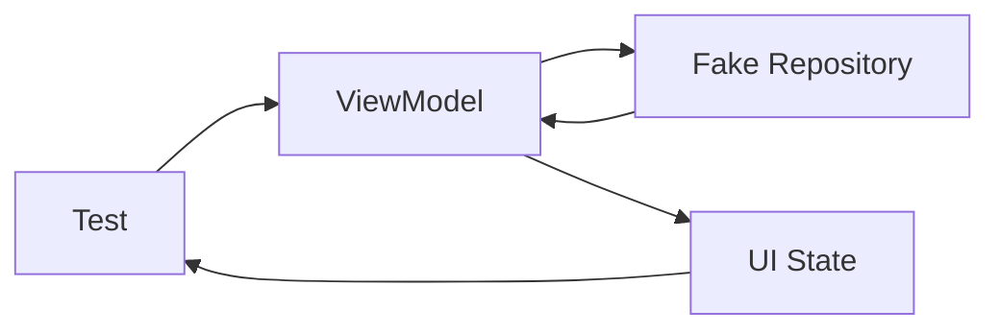

# 003 - ViewModel Test

**Học phần:** 05 - Quality, Release and Portfolio
**Module:** Module 11 - Testing
**Nhóm nội dung:** Unit Testing
**Nguồn roadmap:** Testing / Unit Testing
**Loại bài:** lesson
**Thứ tự trong module:** 003
**Thời lượng gợi ý:** 30 phút

---

## 1. Tóm tắt

`ViewModel` thường là nơi điều phối dữ liệu và quản lý trạng thái của một màn hình Android. Nếu logic trong `ViewModel` sai, giao diện có thể hiển thị trạng thái không chính xác, giữ trạng thái loading vô hạn, xử lý lỗi không đúng hoặc phát sinh hành vi khó tái hiện.

`ViewModel Test` là việc kiểm thử `ViewModel` ở mức unit test mà không cần khởi chạy toàn bộ ứng dụng hay giao diện Android. Mục tiêu chính là xác minh:

* business rule được thực thi đúng;
* trạng thái UI chuyển đổi đúng trình tự;
* dữ liệu từ repository được xử lý chính xác;
* lỗi được chuyển thành trạng thái mà UI có thể xử lý;
* coroutine chạy trong môi trường kiểm thử có thể kiểm soát;
* kết quả test ổn định và có thể lặp lại.

Một thiết kế tốt cho phép thay repository, dispatcher hoặc dependency thật bằng `fake` hoặc test implementation để kiểm tra riêng logic của `ViewModel`.

---

## 2. Mục tiêu học tập

Sau khi hoàn thành bài này, người học có thể:

* Giải thích được mục đích của `ViewModel Test` trong Android.
* Phân biệt được kiểm thử `ViewModel` với UI test.
* Xác định được những trạng thái và business rule quan trọng cần kiểm thử.
* Thiết kế dependency để `ViewModel` có thể được kiểm thử độc lập.
* Sử dụng fake repository để tạo các tình huống thành công và thất bại.
* Kiểm soát coroutine trong unit test để test có tính deterministic.
* Kiểm tra được sự chuyển đổi của `StateFlow` hoặc UI state.
* Xây dựng một bộ test nhỏ có thể sử dụng làm artifact cho portfolio Android.

---

## 3. Vì sao cần kiểm thử ViewModel?

Một màn hình Android thường có luồng xử lý tương tự:

```text
Người dùng
    ↓
UI
    ↓
ViewModel
    ↓
Repository
    ↓
Database / Network
```

`ViewModel` nằm giữa UI và tầng dữ liệu nên thường chịu trách nhiệm:

* nhận sự kiện từ UI;
* gọi repository;
* áp dụng business rule;
* cập nhật trạng thái;
* xử lý loading;
* xử lý thành công;
* xử lý lỗi;
* giữ state khi UI được tạo lại.

Nếu chỉ kiểm tra thủ công bằng cách mở ứng dụng, developer phải phụ thuộc vào nhiều thành phần cùng lúc:

```text
UI
+ Android runtime
+ network
+ database
+ backend
+ dữ liệu thật
```

Điều này làm việc tìm lỗi trở nên khó khăn.

Unit test cô lập `ViewModel`:



Trong mô hình này:

* test đóng vai trò tạo input;
* `ViewModel` chứa logic cần kiểm tra;
* repository thật được thay bằng fake;
* kết quả được quan sát thông qua UI state;
* network và database thật không cần được khởi động.

Nhờ đó, developer có thể kiểm tra logic của `ViewModel` nhanh hơn và xác định lỗi chính xác hơn.

---

## 4. Những gì nên được kiểm thử trong ViewModel

Không cần kiểm tra mọi dòng code. Unit test nên tập trung vào **hành vi có ý nghĩa đối với ứng dụng**.

Một `ViewModel` quản lý việc tải danh sách bài viết có thể có state:

```kotlin
sealed interface ArticleUiState {
    data object Idle : ArticleUiState
    data object Loading : ArticleUiState

    data class Success(
        val articles: List<Article>
    ) : ArticleUiState

    data class Error(
        val message: String
    ) : ArticleUiState
}
```

Các hành vi quan trọng cần kiểm tra gồm:

| Tình huống             | Kết quả cần xác minh                                 |
| ---------------------- | ---------------------------------------------------- |
| ViewModel vừa được tạo | State ban đầu chính xác                              |
| Bắt đầu tải dữ liệu    | State chuyển sang `Loading`                          |
| Repository trả dữ liệu | State chuyển sang `Success`                          |
| Repository báo lỗi     | State chuyển sang `Error`                            |
| Dữ liệu rỗng           | ViewModel xử lý đúng quy tắc thiết kế                |
| Người dùng retry       | Repository được gọi lại                              |
| Có validation          | Input không hợp lệ không được xử lý như input hợp lệ |

Điểm quan trọng là test **behavior**, không test implementation detail.

Ví dụ, câu hỏi hữu ích là:

> Khi repository thất bại, UI state có chuyển sang trạng thái lỗi hay không?

Thay vì:

> Hàm nội bộ thứ ba của `ViewModel` có được gọi đúng một lần hay không?

Nếu chi tiết nội bộ thay đổi nhưng hành vi của ứng dụng vẫn đúng, unit test lý tưởng không nên bị hỏng.

---

## 5. Xây dựng ViewModel có thể kiểm thử

### 5.1. Tách repository khỏi ViewModel

Không nên tạo dependency trực tiếp bên trong `ViewModel`:

```kotlin
class ArticleViewModel : ViewModel() {

    private val repository = ArticleRepositoryImpl()

    // ...
}
```

Thiết kế này khiến unit test khó thay repository thật bằng một dependency kiểm thử.

Thay vào đó, `ViewModel` nhận dependency từ bên ngoài:

```kotlin
class ArticleViewModel(
    private val repository: ArticleRepository
) : ViewModel() {
    // ...
}
```

Repository được mô tả thông qua interface:

```kotlin
interface ArticleRepository {
    suspend fun getArticles(): List<Article>
}
```

Nhờ dependency injection, production có thể truyền implementation thật, còn unit test có thể truyền fake.

### 5.2. Quản lý UI state bằng StateFlow

Một `ViewModel` đơn giản có thể được triển khai như sau:

```kotlin
class ArticleViewModel(
    private val repository: ArticleRepository
) : ViewModel() {

    private val _uiState =
        MutableStateFlow<ArticleUiState>(ArticleUiState.Idle)

    val uiState: StateFlow<ArticleUiState> =
        _uiState.asStateFlow()

    fun loadArticles() {
        viewModelScope.launch {
            _uiState.value = ArticleUiState.Loading

            _uiState.value = try {
                val articles = repository.getArticles()

                ArticleUiState.Success(
                    articles = articles
                )
            } catch (exception: Exception) {
                ArticleUiState.Error(
                    message = exception.message ?: "Unknown error"
                )
            }
        }
    }
}
```

Logic quan trọng của `ViewModel` nằm ở quá trình:

```text
Idle
 ↓
loadArticles()
 ↓
Loading
 ↓
Repository
 ├── thành công → Success
 └── thất bại  → Error
```

Đây chính là state transition cần được unit test bảo vệ.

### 5.3. Tạo Fake Repository

Fake repository cho phép test chủ động quyết định repository sẽ trả kết quả gì.

```kotlin
class FakeArticleRepository : ArticleRepository {

    var articlesToReturn: List<Article> = emptyList()

    var errorToThrow: Exception? = null

    override suspend fun getArticles(): List<Article> {
        errorToThrow?.let { throw it }

        return articlesToReturn
    }
}
```

Test có thể cấu hình:

```kotlin
fakeRepository.articlesToReturn = articles
```

hoặc:

```kotlin
fakeRepository.errorToThrow =
    IllegalStateException("Network error")
```

Nhờ đó, các tình huống được tạo ra hoàn toàn trong test mà không cần network thật.

---

## 6. Kiểm soát Coroutine trong Unit Test

`viewModelScope` sử dụng coroutine và dựa vào `Dispatchers.Main`.

Trong unit test chạy trên JVM thông thường, Android Main dispatcher không tồn tại giống trên thiết bị thật. Vì vậy test cần cung cấp một test dispatcher.

Một rule có thể được tạo để thay `Dispatchers.Main`:

```kotlin
@OptIn(ExperimentalCoroutinesApi::class)
class MainDispatcherRule(
    val testDispatcher: TestDispatcher = StandardTestDispatcher()
) : TestWatcher() {

    override fun starting(description: Description) {
        Dispatchers.setMain(testDispatcher)
    }

    override fun finished(description: Description) {
        Dispatchers.resetMain()
    }
}
```

Trong test class:

```kotlin
@get:Rule
val mainDispatcherRule = MainDispatcherRule()
```

Sau đó có thể sử dụng `runTest`:

```kotlin
@Test
fun example() = runTest {
    // Arrange
    // Act
    // Assert
}
```

`StandardTestDispatcher` không nhất thiết thực thi coroutine ngay lập tức. Khi cần hoàn tất các coroutine đang chờ, có thể sử dụng:

```kotlin
advanceUntilIdle()
```

Điều này giúp test kiểm soát thời điểm coroutine chạy thay vì phụ thuộc vào timing thực tế của CPU.

---

## 7. Viết ViewModel Test theo Arrange - Act - Assert

Một cấu trúc test dễ đọc là:

```text
Arrange
   ↓
Chuẩn bị dependency và dữ liệu

Act
   ↓
Thực thi hành động

Assert
   ↓
Kiểm tra kết quả
```

Ví dụ:

```kotlin
@Test
fun loadArticles_whenRepositorySucceeds_updatesStateToSuccess() = runTest {
    // Arrange
    val expectedArticles = listOf(
        Article(
            id = 1,
            title = "Android Testing"
        )
    )

    val repository = FakeArticleRepository().apply {
        articlesToReturn = expectedArticles
    }

    val viewModel = ArticleViewModel(repository)

    // Act
    viewModel.loadArticles()
    advanceUntilIdle()

    // Assert
    assertEquals(
        ArticleUiState.Success(expectedArticles),
        viewModel.uiState.value
    )
}
```

Test này không quan tâm:

* màn hình được render thế nào;
* `RecyclerView` hay Compose được sử dụng;
* server thật có hoạt động hay không.

Nó chỉ kiểm tra một hợp đồng:

```text
Repository thành công
        ↓
ViewModel
        ↓
Success state đúng
```

---

## 8. Kiểm thử các state transition quan trọng

Một bộ `ViewModel Test` tốt thường không chỉ có success case.

Ví dụ lỗi repository:

```kotlin
@Test
fun loadArticles_whenRepositoryFails_updatesStateToError() = runTest {
    // Arrange
    val repository = FakeArticleRepository().apply {
        errorToThrow = IllegalStateException("Network error")
    }

    val viewModel = ArticleViewModel(repository)

    // Act
    viewModel.loadArticles()
    advanceUntilIdle()

    // Assert
    assertEquals(
        ArticleUiState.Error("Network error"),
        viewModel.uiState.value
    )
}
```

State ban đầu cũng có thể được kiểm tra:

```kotlin
@Test
fun initialState_isIdle() {
    val repository = FakeArticleRepository()

    val viewModel = ArticleViewModel(repository)

    assertEquals(
        ArticleUiState.Idle,
        viewModel.uiState.value
    )
}
```

Khi kiểm thử, nên suy nghĩ theo ma trận:

| Input hoặc điều kiện | State mong đợi             |
| -------------------- | -------------------------- |
| Chưa có hành động    | `Idle`                     |
| Request đang xử lý   | `Loading`                  |
| Request thành công   | `Success`                  |
| Request thất bại     | `Error`                    |
| Retry thành công     | `Success`                  |
| Input không hợp lệ   | State validation tương ứng |

Mục tiêu không phải tạo nhiều test nhất có thể mà là bảo vệ những state transition có thể ảnh hưởng đến người dùng.

---

## 9. Kiểm tra chuỗi trạng thái thay vì chỉ state cuối

Trong một số trường hợp, chỉ kiểm tra state cuối là chưa đủ.

Ví dụ ViewModel phải chuyển:

```text
Idle → Loading → Success
```

Nếu implementation vô tình bỏ `Loading`:

```text
Idle → Success
```

test chỉ kiểm tra `Success` cuối cùng vẫn có thể pass.

Khi thứ tự state là một phần quan trọng của UX, có thể collect `Flow` trong test và kiểm tra từng emission.

Một test về state sequence thường cần xác minh:

```text
1. state ban đầu;
2. loading;
3. kết quả cuối.
```

Đây đặc biệt hữu ích đối với:

* loading indicator;
* progress state;
* multi-step operation;
* validation state;
* retry;
* refresh;
* pagination.

Không cần kiểm tra mọi emission nếu chúng không có ý nghĩa đối với hành vi của màn hình.

---

## 10. Fake, Mock và dependency thật

Trong `ViewModel Test`, dependency nên được lựa chọn dựa trên mục tiêu test.

| Loại dependency     | Đặc điểm                              | Phù hợp khi                     |
| ------------------- | ------------------------------------- | ------------------------------- |
| Real implementation | Chạy logic thật                       | Integration test                |
| Fake                | Implementation đơn giản dành cho test | Unit test hành vi               |
| Mock                | Cấu hình phản hồi và interaction      | Cần xác minh interaction cụ thể |

Fake thường phù hợp với `ViewModel Test` vì:

* dễ đọc;
* ít phụ thuộc framework mocking;
* có thể lưu state;
* có thể mô phỏng success và failure;
* behavior gần với dependency thật hơn một stub đơn giản.

Ví dụ fake có thể đếm số lần repository được gọi:

```kotlin
class FakeArticleRepository : ArticleRepository {

    var callCount = 0

    var articlesToReturn: List<Article> = emptyList()

    override suspend fun getArticles(): List<Article> {
        callCount++
        return articlesToReturn
    }
}
```

Sau đó test retry có thể xác minh:

```kotlin
assertEquals(
    2,
    repository.callCount
)
```

Chỉ nên kiểm tra interaction khi interaction đó thực sự là một phần của yêu cầu nghiệp vụ.

---

## 11. ViewModel Test khác UI Test như thế nào?

`ViewModel Test` và UI test bảo vệ các lớp lỗi khác nhau.

| ViewModel Test               | UI Test                             |
| ---------------------------- | ----------------------------------- |
| Kiểm tra logic               | Kiểm tra giao diện                  |
| Không cần render screen      | Render hoặc tương tác với UI        |
| Thường chạy nhanh            | Thường chạy chậm hơn                |
| Dùng fake dependency dễ dàng | Thường cần nhiều thành phần Android |
| Kiểm tra state               | Kiểm tra hành vi người dùng         |
| Phù hợp business rule        | Phù hợp navigation và interaction   |

Ví dụ:

**ViewModel Test**

```text
Repository trả lỗi
→ state phải là Error
```

**UI Test**

```text
State là Error
→ màn hình phải hiển thị thông báo lỗi
```

Hai loại test bổ sung cho nhau.

Không nên dùng UI test để thay thế toàn bộ unit test logic của `ViewModel`.

---

## 12. Những lỗi thường gặp

| Hiện tượng                           | Nguyên nhân thường gặp                    | Cách xử lý                               |
| ------------------------------------ | ----------------------------------------- | ---------------------------------------- |
| Test coroutine không hoàn thành      | Coroutine chưa được tiến scheduler        | Sử dụng `advanceUntilIdle()` khi phù hợp |
| Lỗi liên quan `Dispatchers.Main`     | JVM test không có Android Main dispatcher | Cấu hình test dispatcher                 |
| Test lúc pass lúc fail               | Dùng delay hoặc timing thực               | Dùng coroutine test utilities            |
| Test cần Internet                    | Repository thật được sử dụng              | Thay bằng fake                           |
| Test khó thiết lập                   | ViewModel tự tạo dependency               | Inject dependency từ constructor         |
| Refactor nhỏ làm hàng loạt test hỏng | Test implementation detail                | Test observable behavior                 |
| Chỉ kiểm tra success case            | Bỏ qua lỗi thực tế                        | Thêm failure và edge cases               |
| Test rất dài                         | ViewModel chứa quá nhiều trách nhiệm      | Tách business logic hoặc use case        |

Một unit test tốt cần **deterministic**:

```text
Cùng input
   ↓
Cùng điều kiện
   ↓
Luôn cùng kết quả
```

Test không nên phụ thuộc vào:

* Internet;
* server thật;
* thời gian hệ thống không kiểm soát;
* dữ liệu ngẫu nhiên không cố định;
* thứ tự thread không thể dự đoán.

---

## 13. Best practices

Khi xây dựng và kiểm thử `ViewModel`, nên ưu tiên:

* Inject repository thay vì khởi tạo dependency trực tiếp.
* Giữ UI state rõ ràng và có mô hình nhất quán.
* Test observable behavior thay vì private implementation.
* Kiểm tra success, failure và các edge case quan trọng.
* Dùng fake dependency để test có thể lặp lại.
* Kiểm soát dispatcher khi coroutine tham gia vào logic.
* Đặt tên test thể hiện điều kiện và kết quả.
* Không gọi network hoặc database thật trong unit test của `ViewModel`.
* Không đưa Android UI vào test nếu mục tiêu chỉ là kiểm tra logic.
* Giữ từng test tập trung vào một hành vi chính.

Một convention đặt tên dễ đọc là:

```text
function_condition_expectedResult
```

Ví dụ:

```kotlin
loadArticles_whenRepositoryFails_updatesStateToError
```

Tên test cho biết ngay:

```text
Hành động
+
Điều kiện
+
Kết quả mong đợi
```

---

## 14. Bài thực hành

Xây dựng một `ProfileViewModel` có nhiệm vụ tải thông tin người dùng.

Ứng dụng có ba trạng thái chính:

```kotlin
sealed interface ProfileUiState {
    data object Loading : ProfileUiState

    data class Success(
        val profile: UserProfile
    ) : ProfileUiState

    data class Error(
        val message: String
    ) : ProfileUiState
}
```

Repository:

```kotlin
interface ProfileRepository {
    suspend fun getProfile(): UserProfile
}
```

Yêu cầu:

1. Tạo `ProfileViewModel`.
2. Inject `ProfileRepository` qua constructor.
3. Quản lý state bằng `StateFlow`.
4. Tạo `FakeProfileRepository`.
5. Viết test cho trường hợp repository thành công.
6. Viết test cho trường hợp repository báo lỗi.
7. Đảm bảo test không gọi network thật.
8. Đảm bảo coroutine được kiểm soát bởi test environment.

**Kết quả mong đợi:**

```text
Fake Repository
      ↓
ProfileViewModel
      ↓
StateFlow
      ↓
Unit Test
```

Bộ test phải chạy lặp lại và cho cùng kết quả.

---

## 15. Artifact cho portfolio

Một artifact nhỏ nhưng có giá trị có thể bao gồm:

```text
app/
└── src/main/
    └── ...
        └── ProfileViewModel.kt

app/
└── src/test/
    └── ...
        ├── ProfileViewModelTest.kt
        ├── FakeProfileRepository.kt
        └── MainDispatcherRule.kt
```

README nên mô tả ngắn:

* logic nào được kiểm thử;
* dependency nào được fake;
* những state nào được xác minh;
* cách chạy unit test;
* một ví dụ failure mà bộ test có thể phát hiện.

Ví dụ giá trị của artifact:

```text
Bug:
Repository thất bại nhưng ViewModel vẫn giữ Loading.

Test:
loadProfile_whenRepositoryFails_updatesStateToError

Kết quả:
Test fail nếu Error state không được phát ra.
```

Cách trình bày này cho thấy developer không chỉ biết viết test mà còn hiểu **test đang bảo vệ rủi ro nào của sản phẩm**.

---

## 16. Checklist hoàn thành

* [ ] Giải thích được mục đích của `ViewModel Test`.
* [ ] Phân biệt được unit test của `ViewModel` với UI test.
* [ ] Xác định được các state transition quan trọng cần kiểm tra.
* [ ] Inject dependency vào `ViewModel` thay vì tạo trực tiếp bên trong.
* [ ] Tạo được fake repository.
* [ ] Viết được success test.
* [ ] Viết được failure test.
* [ ] Kiểm soát được coroutine trong unit test.
* [ ] Không phụ thuộc vào network hoặc database thật.
* [ ] Test tập trung vào observable behavior.
* [ ] Bộ test chạy lặp lại với kết quả ổn định.
* [ ] Có ít nhất một artifact có thể trình bày trong portfolio.

---

## 17. Câu hỏi tự kiểm tra

1. Vì sao unit test của `ViewModel` không nên gọi repository kết nối trực tiếp với server thật?
2. Một test chỉ kiểm tra `Success` cuối cùng có thể bỏ sót lỗi gì trong chuỗi `Idle → Loading → Success`?
3. Vì sao constructor injection giúp `ViewModel` dễ kiểm thử hơn?
4. Trong trường hợp nào nên sử dụng fake repository thay cho implementation thật?
5. Vì sao việc kiểm soát coroutine dispatcher giúp test trở nên deterministic?

---

## 18. Tổng kết

`ViewModel Test` giúp bảo vệ phần logic nằm giữa UI và tầng dữ liệu của ứng dụng Android. Thay vì khởi chạy toàn bộ ứng dụng, developer có thể cô lập `ViewModel`, cung cấp fake dependency và kiểm tra trực tiếp UI state hoặc business behavior.

Một chiến lược kiểm thử tốt thường có luồng:

```text
Xác định behavior cần bảo vệ
        ↓
Inject dependency
        ↓
Thay dependency thật bằng fake
        ↓
Thiết lập test dispatcher
        ↓
Thực thi hành động
        ↓
Quan sát state
        ↓
So sánh với kết quả mong đợi
```

Giá trị của `ViewModel Test` không nằm ở số lượng test, mà ở khả năng phát hiện sớm những lỗi có thể làm sai trạng thái giao diện, phá vỡ business rule hoặc khiến trải nghiệm người dùng không ổn định.
