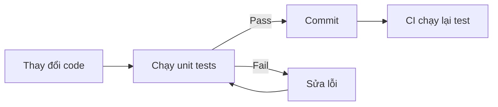

# 004 - UseCase Test

**Học phần:** 05 - Quality, Release and Portfolio
**Module:** Module 11 - Testing
**Nhóm nội dung:** Unit Testing
**Nguồn roadmap:** Testing / Unit Testing
**Loại bài:** lesson
**Thứ tự trong module:** 004
**Thời lượng gợi ý:** 30 phút

---

## 1. Tóm tắt

`UseCase Test` là kiểm thử đơn vị dành cho lớp xử lý **business logic** của ứng dụng Android. Mục tiêu là xác minh các quy tắc nghiệp vụ, điều kiện đầu vào, kết quả đầu ra và quá trình chuyển trạng thái mà không cần khởi chạy `Activity`, `Fragment`, Compose UI hoặc toàn bộ ứng dụng.

Một `UseCase` thường nằm giữa `ViewModel` và `Repository`:

```text
UI
 ↓
ViewModel
 ↓
UseCase
 ↓
Repository
 ↓
API / Database
```

Khi kiểm thử `UseCase`, các dependency như `Repository` nên được thay bằng **fake** hoặc test double phù hợp. Nhờ đó, bài test tập trung vào business logic, chạy nhanh, ổn định và có kết quả xác định.

Sau bài học, người học có thể xây dựng một `UseCase Test`, kiểm tra cả đường đi thành công lẫn thất bại, đồng thời biến bài test thành một quality artifact có thể chạy lặp lại ở local hoặc CI.

---

## 2. Mục tiêu học tập

Sau khi hoàn thành bài này, người học có thể:

* Giải thích được vai trò của `UseCase Test` trong kiến trúc ứng dụng Android.
* Phân biệt được kiểm thử `UseCase` với kiểm thử `ViewModel`, `Repository` và UI.
* Thiết kế `UseCase` có dependency dễ thay thế trong môi trường test.
* Sử dụng fake repository để cô lập business logic khỏi network và database thật.
* Kiểm thử được success case, validation failure và lỗi từ dependency.
* Kiểm thử được `suspend` function một cách xác định.
* Nhận biết các dấu hiệu khiến `UseCase Test` trở nên flaky hoặc khó bảo trì.
* Tạo được một automated quality check có thể chạy lại bằng local command hoặc CI.

---

## 3. UseCase Test giải quyết vấn đề gì?

Một ứng dụng Android thường chứa nhiều quy tắc không thuộc trực tiếp về UI hoặc tầng lưu trữ dữ liệu, chẳng hạn:

* không cho phép gửi username rỗng;
* không cho phép đặt số lượng sản phẩm nhỏ hơn `1`;
* chỉ cho phép thực hiện một hành động khi người dùng có quyền;
* chuyển đổi dữ liệu từ repository thành kết quả nghiệp vụ;
* quyết định khi nào cần lưu, đồng bộ hoặc từ chối dữ liệu;
* kết hợp kết quả từ nhiều repository.

Nếu toàn bộ logic này chỉ được kiểm tra bằng cách chạy ứng dụng:

```text
Business rule thay đổi
        ↓
Build ứng dụng
        ↓
Mở màn hình
        ↓
Nhập dữ liệu
        ↓
Thực hiện thao tác
        ↓
Quan sát kết quả
```

thì feedback loop sẽ chậm và khó lặp lại.

`UseCase Test` rút ngắn quá trình thành:

```text
Business rule
      ↓
Unit test
      ↓
Fake dependency
      ↓
Assert kết quả
```

Một test như vậy có thể chạy mà không cần:

* emulator;
* thiết bị Android;
* backend thật;
* database thật;
* thao tác UI;
* tài khoản người dùng thật.

Đây là lý do `UseCase` thường là một trong những tầng thích hợp nhất để áp dụng unit testing.

---

## 4. Vị trí của UseCase trong ứng dụng Android

Một kiến trúc phổ biến có thể được mô tả như sau:

```mermaid
flowchart LR
    UI[Compose / Fragment] --> VM[ViewModel]
    VM --> UC[UseCase]
    UC --> REPO[Repository]
    REPO --> API[Remote API]
    REPO --> DB[Local Database]

    TEST[UseCase Test] --> UC
    FAKE[Fake Repository] --> UC
```



Trong runtime thật:

1. UI gửi hành động đến `ViewModel`.
2. `ViewModel` gọi `UseCase`.
3. `UseCase` áp dụng business rule.
4. `UseCase` gọi `Repository` khi cần dữ liệu.
5. `Repository` làm việc với API hoặc local storage.

Trong unit test:

1. `UseCase` được tạo trực tiếp.
2. `Repository` thật được thay bằng fake.
3. Test truyền input vào `UseCase`.
4. Test kiểm tra output và interaction cần thiết.

Nhờ đó, lỗi từ network hoặc database không làm sai lệch kết quả kiểm thử business logic.

---

## 5. Nên kiểm thử điều gì trong UseCase?

Không nên kiểm thử chỉ để xác nhận rằng một method đã được gọi. Giá trị chính của `UseCase Test` nằm ở việc bảo vệ **business behavior**.

Các nhóm tình huống quan trọng gồm:

| Nhóm kiểm thử      | Ví dụ                                                   |
| ------------------ | ------------------------------------------------------- |
| Happy path         | Input hợp lệ và repository thành công                   |
| Validation         | Username rỗng bị từ chối                                |
| Boundary           | Số lượng bằng đúng giới hạn                             |
| Dependency failure | Repository trả lỗi                                      |
| Business rule      | Không đủ quyền nên không được thực hiện                 |
| Mapping            | Dữ liệu repository được chuyển thành domain result đúng |
| State transition   | Trạng thái nghiệp vụ chuyển đúng sau hành động          |

Ví dụ, một `UpdateUsernameUseCase` có quy tắc:

```text
Nhận username
      ↓
Loại khoảng trắng đầu/cuối
      ↓
Username rỗng?
   ┌──┴───┐
  Có    Không
   ↓       ↓
Reject   Repository
           ↓
         Result
```

Một bộ test tốt cần kiểm tra ít nhất:

* username hợp lệ;
* username chỉ chứa khoảng trắng;
* repository thất bại.

---

## 6. Thiết kế UseCase có khả năng kiểm thử

Giả sử ứng dụng cho phép đổi username.

Repository được định nghĩa bằng interface:

```kotlin
interface UserRepository {
    suspend fun updateUsername(username: String): Result<Unit>
}
```

`UseCase` chứa quy tắc nghiệp vụ:

```kotlin
class UpdateUsernameUseCase(
    private val userRepository: UserRepository
) {
    suspend operator fun invoke(username: String): Result<Unit> {
        val normalizedUsername = username.trim()

        if (normalizedUsername.isBlank()) {
            return Result.failure(
                IllegalArgumentException("Username must not be blank")
            )
        }

        return userRepository.updateUsername(normalizedUsername)
    }
}
```

Có hai chi tiết quan trọng.

Thứ nhất, `UseCase` phụ thuộc vào abstraction:

```kotlin
UserRepository
```

thay vì phụ thuộc trực tiếp vào:

```text
Retrofit
Room
Firebase
HTTP client
Android Context
```

Thứ hai, business rule được đặt ngay trong `UseCase`:

```kotlin
if (normalizedUsername.isBlank()) {
    // reject
}
```

Điều này cho phép test quy tắc mà không cần UI hay backend.

---

## 7. Sử dụng Fake Repository

### 7.1. Fake khác repository thật như thế nào?

Repository thật có thể thực hiện:

```text
Repository
   ↓
Retrofit
   ↓
Internet
   ↓
Backend
```

Trong unit test, đường đi này không cần thiết.

Fake repository có thể chỉ lưu dữ liệu trong bộ nhớ:

```text
UseCase
   ↓
FakeRepository
   ↓
Biến trong memory
```

Ví dụ:

```kotlin
class FakeUserRepository : UserRepository {

    var updatedUsername: String? = null
    var result: Result<Unit> = Result.success(Unit)

    override suspend fun updateUsername(
        username: String
    ): Result<Unit> {
        updatedUsername = username
        return result
    }
}
```

Fake này cho phép test kiểm soát:

* repository sẽ thành công hay thất bại;
* giá trị nào đã được truyền vào repository.

### 7.2. Vì sao fake giúp test deterministic?

Một test tốt nên có quan hệ:

```text
Cùng input
   +
Cùng setup
      ↓
Cùng kết quả
```

Nếu test phụ thuộc vào network thật:

```text
Network chậm
Backend down
Token hết hạn
Server thay đổi dữ liệu
```

thì cùng một test có thể lúc pass, lúc fail.

Fake loại bỏ các biến số này khỏi unit test.

---

## 8. Viết UseCase Test

Vì `UseCase` sử dụng `suspend function`, test có thể chạy trong coroutine test scope bằng `runTest`.

### 8.1. Kiểm thử trường hợp thành công

```kotlin
@Test
fun `valid username updates repository`() = runTest {
    val repository = FakeUserRepository()
    val useCase = UpdateUsernameUseCase(repository)

    val result = useCase("alice")

    assertTrue(result.isSuccess)
    assertEquals("alice", repository.updatedUsername)
}
```

Test này xác minh hai điều:

* `UseCase` trả kết quả thành công;
* dữ liệu đúng được chuyển xuống repository.

### 8.2. Kiểm thử business validation

```kotlin
@Test
fun `blank username returns failure`() = runTest {
    val repository = FakeUserRepository()
    val useCase = UpdateUsernameUseCase(repository)

    val result = useCase("   ")

    assertTrue(result.isFailure)
    assertNull(repository.updatedUsername)
}
```

Điểm quan trọng ở đây là:

```kotlin
assertNull(repository.updatedUsername)
```

Không chỉ cần xác nhận rằng kết quả thất bại. Test còn đảm bảo repository **không bị gọi với dữ liệu không hợp lệ**.

### 8.3. Kiểm thử việc chuẩn hóa dữ liệu

```kotlin
@Test
fun `username is trimmed before update`() = runTest {
    val repository = FakeUserRepository()
    val useCase = UpdateUsernameUseCase(repository)

    val result = useCase("  alice  ")

    assertTrue(result.isSuccess)
    assertEquals("alice", repository.updatedUsername)
}
```

Test này bảo vệ một business behavior cụ thể:

```text
"  alice  "
      ↓
trim()
      ↓
"alice"
      ↓
Repository
```

### 8.4. Kiểm thử lỗi từ Repository

```kotlin
@Test
fun `repository failure is returned`() = runTest {
    val repository = FakeUserRepository().apply {
        result = Result.failure(
            IllegalStateException("Server error")
        )
    }

    val useCase = UpdateUsernameUseCase(repository)

    val result = useCase("alice")

    assertTrue(result.isFailure)
}
```

Test không cần tạo HTTP error thật. Fake repository trực tiếp mô phỏng failure path.

---

## 9. UseCase Test và Coroutine

Business logic Android hiện đại thường sử dụng `suspend`, `Flow` hoặc coroutine. Điều này tạo ra một yêu cầu quan trọng: test không nên phụ thuộc vào timing thực tế.

Không nên thiết kế unit test dựa vào:

```kotlin
Thread.sleep(...)
```

vì thời gian thực thi của máy và CI có thể khác nhau.

Với coroutine test, mục tiêu là:

```text
Test code
   ↓
Test coroutine environment
   ↓
Điều khiển execution
   ↓
Assert
```

Ví dụ cơ bản:

```kotlin
@Test
fun `use case completes successfully`() = runTest {
    val repository = FakeUserRepository()
    val useCase = UpdateUsernameUseCase(repository)

    val result = useCase("alice")

    assertTrue(result.isSuccess)
}
```

Nếu `UseCase` phụ thuộc trực tiếp vào dispatcher, nên truyền dependency đó vào thay vì hard-code ở bên trong business logic.

Tư duy cần hướng đến là:

```text
Dependency có thể thay thế
        ↓
Test kiểm soát execution
        ↓
Kết quả ổn định
```

---

## 10. Phân biệt UseCase Test với các loại test khác

| Test                 | Trọng tâm                               |
| -------------------- | --------------------------------------- |
| `UseCase Test`       | Business rule                           |
| `ViewModel Test`     | UI state và event handling              |
| `Repository Test`    | Data orchestration, cache, API/database |
| DAO Test             | Query và persistence                    |
| API integration test | Contract với backend                    |
| UI Test              | Hành vi người dùng trên giao diện       |

Ví dụ với chức năng đổi username:

```text
UI Test
→ Người dùng nhập và nhấn Save

ViewModel Test
→ Save event tạo đúng UI state

UseCase Test
→ Username rỗng bị từ chối

Repository Test
→ Update thành công thì cache được cập nhật

API Test
→ Request được gửi đúng contract
```

Không cần bắt một loại test kiểm tra mọi tầng.

Đây là nguyên tắc quan trọng để tránh test quá lớn và khó debug.

---

## 11. State transition trong UseCase

Một `UseCase` đôi khi không chỉ trả dữ liệu mà còn quyết định chuyển trạng thái nghiệp vụ.

Ví dụ:

```text
Pending
   ↓ approve()
Approved
```

Hoặc:

```text
Cart
 ↓ checkout()
Paid
```

Với những trường hợp này, test nên kiểm tra **trạng thái trước và sau**.

Ví dụ quy tắc:

```text
Order chưa thanh toán
        +
Payment thành công
        ↓
Order = Paid
```

Các test cần bao phủ:

```text
Payment success → Paid
Payment failure → giữ trạng thái cũ
Order đã Paid → không thanh toán lại
```

Đây là nơi `UseCase Test` đặc biệt quan trọng vì lỗi state transition thường ảnh hưởng trực tiếp tới hành vi người dùng và dữ liệu hệ thống.

---

## 12. Những gì không nên nằm trong UseCase Test

Một unit test cho `UseCase` thường không nên khởi chạy:

* `Activity`;
* `Fragment`;
* Compose UI;
* Retrofit server thật;
* production database;
* Firebase thật;
* emulator;
* Android lifecycle đầy đủ.

Nếu một test cần toàn bộ những thành phần này chỉ để kiểm tra một business rule, boundary của test có thể đang quá rộng.

Mục tiêu nên là:

```text
Input
   ↓
UseCase
   ↓
Controlled dependencies
   ↓
Output / interaction
```

thay vì:

```text
UI
 ↓
ViewModel
 ↓
UseCase
 ↓
Repository
 ↓
Database
 ↓
Network
```

Đường đi thứ hai phù hợp hơn với integration hoặc end-to-end testing.

---

## 13. Lỗi thường gặp

### 13.1. Test gọi API thật

**Hiện tượng:** test đôi khi pass, đôi khi fail.

**Nguyên nhân:** unit test phụ thuộc vào network hoặc backend.

**Cách xử lý:** thay repository thật bằng fake hoặc test double phù hợp.

---

### 13.2. Chỉ kiểm tra happy path

**Hiện tượng:** test pass nhưng production vẫn lỗi khi input bất thường.

**Nguyên nhân:** chỉ kiểm tra dữ liệu hợp lệ.

**Cách xử lý:** bổ sung các trường hợp:

* empty;
* blank;
* boundary;
* invalid input;
* dependency failure;
* conflicting state.

---

### 13.3. Business logic nằm trong ViewModel

Ví dụ:

```text
ViewModel
 ├─ validate input
 ├─ xử lý quyền
 ├─ tính toán
 ├─ gọi repository
 └─ cập nhật UI
```

Khi đó ViewModel vừa điều phối UI vừa xử lý nghiệp vụ, làm test phức tạp.

Có thể tách thành:

```text
ViewModel
   ↓
UseCase
   ↓
Repository
```

để business rule có boundary rõ ràng hơn.

---

### 13.4. Test phụ thuộc vào thời gian thật

**Hiện tượng:** test coroutine chạy không ổn định trên CI.

**Nguyên nhân:** sử dụng delay, sleep hoặc scheduler ngoài khả năng kiểm soát của test.

**Cách xử lý:** sử dụng coroutine test utilities và inject dependency thời gian khi cần.

---

### 13.5. Test implementation thay vì behavior

Một test quá phụ thuộc implementation có thể kiểm tra:

```text
method A gọi method B đúng một lần
method B gọi method C đúng hai lần
```

trong khi business requirement thực sự chỉ là:

```text
username rỗng phải bị từ chối
```

Ưu tiên kiểm tra observable behavior và business rule. Chỉ kiểm tra interaction cụ thể khi interaction đó thực sự có ý nghĩa nghiệp vụ.

---

## 14. Best practices

* Đặt business rule ở tầng domain hoặc boundary phù hợp thay vì phân tán trong UI.
* Phụ thuộc vào interface để dependency có thể thay thế khi test.
* Giữ fake nhỏ và dễ hiểu.
* Mỗi test nên kiểm tra một behavior rõ ràng.
* Đặt tên test theo điều kiện và kết quả mong đợi.
* Bao phủ cả success path và failure path.
* Không sử dụng network thật trong unit test.
* Không phụ thuộc vào thời gian thực nếu có thể kiểm soát bằng test scheduler.
* Kiểm tra boundary value đối với các quy tắc có giới hạn.
* Ưu tiên test business behavior thay vì implementation detail.
* Đảm bảo test có thể chạy lặp lại trên máy cá nhân và CI.
* Khi sửa bug business logic, bổ sung regression test trước hoặc cùng với bản sửa lỗi.

Một naming pattern hữu ích là:

```text
condition → expected behavior
```

Ví dụ:

```kotlin
`blank username returns failure`

`valid username updates repository`

`repository failure is returned`
```

Tên test nên giúp developer hiểu ngay behavior bị hỏng khi test fail.

---

## 15. Quality feedback loop

Một `UseCase Test` chỉ thực sự hữu ích khi có thể chạy lặp lại.

Feedback loop lý tưởng:



Ở local, developer nên có một command hoặc IDE action nhất quán để chạy unit test.

Trong CI:

```text
Push / Pull Request
        ↓
Build
        ↓
Unit Tests
        ↓
Pass?
   ┌────┴────┐
  Có        Không
   ↓           ↓
Review      Block / Fix
```

Nhờ đó, một business rule đã được bảo vệ bởi test sẽ được kiểm tra lại mỗi khi code thay đổi.

---

## 16. Bài thực hành

Xây dựng một `UseCase` nhỏ có ít nhất một business rule và viết unit test cho nó.

Có thể sử dụng tình huống:

```text
UpdateUsernameUseCase
```

với các quy tắc:

1. Loại khoảng trắng ở đầu và cuối username.
2. Không chấp nhận username rỗng.
3. Chỉ gọi repository khi dữ liệu hợp lệ.
4. Trả lại failure khi repository thất bại.

Bộ test tối thiểu cần bao phủ:

```text
Valid input
    ↓
Success

Blank input
    ↓
Failure

Input có whitespace
    ↓
Normalized value

Repository error
    ↓
Failure
```

**Kết quả mong đợi:**

* Test chạy được mà không cần emulator.
* Không sử dụng network thật.
* Có fake repository.
* Có ít nhất một failure case.
* Các test chạy lặp lại với kết quả ổn định.

---

## 17. Artifact đưa vào portfolio

Không cần đưa toàn bộ test suite vào portfolio. Một artifact nhỏ nhưng rõ ràng có thể gồm:

```text
domain/
└── UpdateUsernameUseCase.kt

test/
├── FakeUserRepository.kt
└── UpdateUsernameUseCaseTest.kt

README.md
```

Trong `README.md`, có thể mô tả ngắn:

* business rule được kiểm thử;
* dependency nào được fake;
* những trường hợp test chính;
* command dùng để chạy test;
* ví dụ output khi test pass;
* loại regression mà bộ test giúp ngăn chặn.

Một portfolio artifact tốt nên chứng minh rằng developer không chỉ biết viết code hoạt động mà còn biết tạo **repeatable quality checks** để bảo vệ hành vi của hệ thống.

---

## 18. Checklist hoàn thành

* [ ] Giải thích được `UseCase Test` kiểm tra loại logic nào.
* [ ] Xác định được vị trí của `UseCase` giữa `ViewModel` và `Repository`.
* [ ] Viết được một `UseCase` có dependency có thể thay thế.
* [ ] Tạo được fake repository cho unit test.
* [ ] Kiểm thử được happy path.
* [ ] Kiểm thử được validation failure.
* [ ] Kiểm thử được dependency failure.
* [ ] Không phụ thuộc vào API hoặc database thật trong unit test.
* [ ] Không dùng timing thực tế một cách không cần thiết.
* [ ] Chạy được test lặp lại ở local.
* [ ] Có thể đưa test vào CI.
* [ ] Có artifact nhỏ hoặc README mô tả quality check.

---

## 19. Câu hỏi tự kiểm tra

1. Vì sao `UseCase Test` không nên gọi trực tiếp backend thật?
2. Trong trường hợp username không hợp lệ, ngoài việc kiểm tra `Result.failure`, vì sao còn nên xác minh repository không được gọi?
3. Business rule nằm hoàn toàn trong `ViewModel` có thể gây khó khăn gì cho testing?
4. Khi nào một test nên được xem là integration test thay vì unit test cho `UseCase`?
5. Vì sao một test có thể chạy ở local nhưng trở nên flaky trên CI nếu phụ thuộc vào timing thực tế?

---

## 20. Tổng kết

`UseCase Test` bảo vệ tầng business logic của ứng dụng Android mà không cần khởi chạy toàn bộ app. Cách tiếp cận cốt lõi là cô lập `UseCase`, thay dependency thật bằng fake và kiểm tra behavior dưới nhiều điều kiện khác nhau.

Luồng kiểm thử cơ bản là:

```text
Arrange
   ↓
Tạo fake dependency

Act
   ↓
Gọi UseCase

Assert
   ↓
Kiểm tra result
+
Kiểm tra business behavior
```

Một `UseCase Test` tốt cần nhanh, deterministic, dễ đọc và có khả năng chạy lặp lại. Khi được tích hợp vào local development và CI, nó trở thành một lớp bảo vệ quan trọng giúp giảm regression, tăng maintainability và giảm rủi ro khi release ứng dụng.
