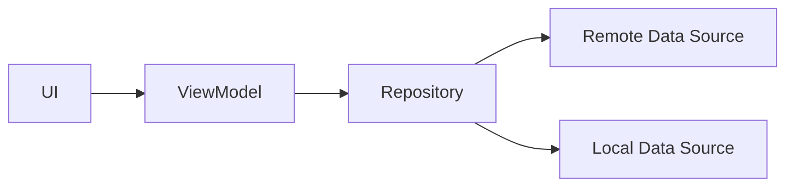
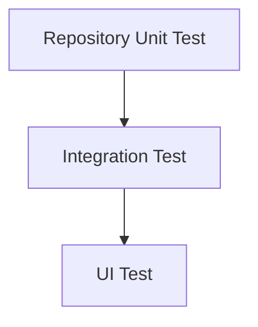

# 005 - Repository Test

**Học phần:** 05 - Quality, Release and Portfolio
**Module:** Module 11 - Testing
**Nhóm nội dung:** Unit Testing
**Nguồn roadmap:** Testing / Unit Testing
**Loại bài:** lesson
**Thứ tự trong module:** 005
**Thời lượng gợi ý:** 30 phút

---

## 1. Tóm tắt

`Repository Test` là kỹ thuật kiểm thử lớp `Repository` trong ứng dụng Android mà không cần khởi động toàn bộ ứng dụng, không cần render UI và thường không cần kết nối tới API hoặc database thật.

Repository nằm giữa phần sử dụng dữ liệu như `ViewModel` hoặc domain layer và các nguồn dữ liệu như REST API, Room, DataStore hoặc cache. Vì vậy, lỗi tại Repository có thể khiến ứng dụng trả sai dữ liệu, xử lý lỗi không đúng, ghi cache không chính xác hoặc tạo ra trạng thái không nhất quán.

Một Repository Test tốt tập trung kiểm tra các quy tắc có thể dự đoán được, chẳng hạn:

* dữ liệu từ remote được trả về chính xác;
* dữ liệu mới được lưu vào cache;
* khi network thất bại, repository fallback về local data;
* exception được chuyển thành trạng thái lỗi phù hợp;
* các dependency được thay bằng fake để test nhanh và ổn định;
* coroutine được kiểm soát bằng test dispatcher thay vì phụ thuộc vào timing thật.

Mục tiêu cuối cùng là tạo ra một vòng phản hồi nhanh:

```text
Thay đổi code
    ↓
Chạy unit test
    ↓
Phát hiện regression
    ↓
Sửa lỗi
    ↓
Chạy lại test
    ↓
Đưa kiểm tra vào CI
```

---

## 2. Mục tiêu học tập

Sau bài này, người học có thể:

* Giải thích được vai trò của Repository Test trong kiến trúc Android.
* Xác định được những hành vi của Repository nên được kiểm thử.
* Phân biệt fake dependency với dependency thật trong unit test.
* Viết được unit test cho Repository có sử dụng coroutine.
* Kiểm thử được success path, fallback path và failure path.
* Sử dụng test dispatcher để làm test coroutine có tính xác định.
* Nhận diện được các Repository Test dễ trở nên chậm, mong manh hoặc phụ thuộc môi trường.
* Tích hợp Repository Test vào vòng kiểm tra chất lượng cục bộ và CI.

---

## 3. Repository Test bảo vệ phần nào của ứng dụng?

Trong một kiến trúc Android phổ biến, Repository đóng vai trò cung cấp một giao diện dữ liệu thống nhất cho phần còn lại của ứng dụng.



`ViewModel` không nhất thiết phải biết dữ liệu đến từ network hay database. Nó chỉ yêu cầu Repository cung cấp dữ liệu.

Repository có thể chịu trách nhiệm:

* chọn nguồn dữ liệu;
* kết hợp nhiều nguồn dữ liệu;
* cache dữ liệu;
* chuyển đổi model;
* xử lý exception;
* fallback khi một nguồn dữ liệu thất bại;
* quyết định thời điểm refresh;
* cung cấp `Flow`, `StateFlow` hoặc `suspend` API cho tầng phía trên.

Điều này khiến Repository trở thành một vị trí quan trọng để viết unit test.

Ví dụ, nếu API thành công nhưng Repository quên lưu dữ liệu mới vào database, UI có thể vẫn hoạt động trong lần mở đầu tiên nhưng hiển thị dữ liệu cũ khi người dùng mở ứng dụng lần sau.

Repository Test có thể phát hiện lỗi này mà không cần chạy emulator.

---

## 4. Repository Test nên kiểm tra điều gì?

Không nên viết test chỉ để chứng minh rằng một method có thể được gọi. Test nên bảo vệ một hành vi quan trọng.

Các nhóm hành vi thường đáng kiểm thử gồm:

| Hành vi           | Ví dụ                                                  |
| ----------------- | ------------------------------------------------------ |
| Success path      | API trả dữ liệu và Repository trả đúng kết quả         |
| Cache             | Dữ liệu remote mới được ghi xuống local                |
| Fallback          | Network lỗi thì sử dụng dữ liệu đã lưu                 |
| Error propagation | Không có dữ liệu thì trả lỗi phù hợp                   |
| Mapping           | DTO được chuyển thành domain model chính xác           |
| State transition  | `Loading → Success` hoặc `Loading → Error` đúng thứ tự |
| Filtering         | Repository loại bỏ dữ liệu không hợp lệ                |
| Synchronization   | Đồng bộ remote và local theo đúng quy tắc              |

Một test tốt nên trả lời được câu hỏi:

> Nếu một developer vô tình thay đổi logic này, test nào sẽ thất bại?

Nếu không có câu trả lời rõ ràng, test có thể đang kiểm tra implementation detail thay vì hành vi.

---

## 5. Fake giúp Repository Test có tính xác định

Unit test không nên phụ thuộc vào network thật, database production hoặc thời gian thực.

Giả sử Repository phụ thuộc vào hai nguồn dữ liệu:

```kotlin
interface ProfileRemoteDataSource {
    suspend fun getProfile(userId: String): Profile
}

interface ProfileLocalDataSource {
    suspend fun getProfile(userId: String): Profile?
    suspend fun saveProfile(profile: Profile)
}
```

Trong production, các interface này có thể được triển khai bằng:

```text
ProfileRemoteDataSource
        ↓
      Retrofit

ProfileLocalDataSource
        ↓
       Room
```

Trong unit test, có thể thay chúng bằng fake:

```text
ProfileRepository
      │
      ├── FakeRemoteDataSource
      │
      └── FakeLocalDataSource
```

Fake là implementation đơn giản được kiểm soát trực tiếp trong test.

Ví dụ:

```kotlin
class FakeProfileRemoteDataSource(
    var profile: Profile? = null,
    var error: Throwable? = null
) : ProfileRemoteDataSource {

    override suspend fun getProfile(userId: String): Profile {
        error?.let { throw it }

        return requireNotNull(profile)
    }
}
```

Fake local data source:

```kotlin
class FakeProfileLocalDataSource(
    var storedProfile: Profile? = null
) : ProfileLocalDataSource {

    override suspend fun getProfile(userId: String): Profile? {
        return storedProfile
    }

    override suspend fun saveProfile(profile: Profile) {
        storedProfile = profile
    }
}
```

Nhờ đó, test có thể chủ động tạo ra mọi tình huống mà không phụ thuộc vào dịch vụ bên ngoài.

---

## 6. Ví dụ Repository cần kiểm thử

Giả sử ứng dụng có Repository lấy hồ sơ người dùng theo chiến lược:

1. Thử lấy dữ liệu mới từ server.
2. Nếu thành công, lưu dữ liệu xuống local.
3. Trả dữ liệu mới.
4. Nếu remote thất bại, thử đọc cache.
5. Nếu cache tồn tại, trả cache.
6. Nếu cả hai đều thất bại, trả lỗi.

Model:

```kotlin
data class Profile(
    val id: String,
    val name: String
)
```

Repository:

```kotlin
class ProfileRepository(
    private val remote: ProfileRemoteDataSource,
    private val local: ProfileLocalDataSource
) {

    suspend fun getProfile(userId: String): Result<Profile> {
        return try {
            val profile = remote.getProfile(userId)

            local.saveProfile(profile)

            Result.success(profile)
        } catch (error: Exception) {
            val cachedProfile = local.getProfile(userId)

            if (cachedProfile != null) {
                Result.success(cachedProfile)
            } else {
                Result.failure(error)
            }
        }
    }
}
```

Logic này có ít nhất ba hành vi quan trọng cần được bảo vệ:

```text
Remote thành công
      ↓
Lưu cache
      ↓
Trả remote
```

```text
Remote thất bại
      ↓
Cache tồn tại
      ↓
Trả cache
```

```text
Remote thất bại
      ↓
Không có cache
      ↓
Trả failure
```

Thay vì kiểm thử từng dòng code, Repository Test sẽ kiểm tra ba hành vi này.

---

## 7. Viết Repository Test với coroutine

Với API `suspend`, có thể sử dụng `runTest` từ `kotlinx-coroutines-test` để chạy coroutine trong môi trường test được kiểm soát.

### Trường hợp remote thành công

```kotlin
@Test
fun `remote success returns profile and updates cache`() = runTest {
    val remoteProfile = Profile(
        id = "user-1",
        name = "An"
    )

    val remote = FakeProfileRemoteDataSource(
        profile = remoteProfile
    )

    val local = FakeProfileLocalDataSource()

    val repository = ProfileRepository(
        remote = remote,
        local = local
    )

    val result = repository.getProfile("user-1")

    assertEquals(
        remoteProfile,
        result.getOrNull()
    )

    assertEquals(
        remoteProfile,
        local.storedProfile
    )
}
```

Test này bảo vệ hai yêu cầu riêng biệt:

* Repository phải trả dữ liệu lấy từ remote.
* Repository phải cập nhật cache sau khi remote thành công.

Nếu developer vô tình xóa:

```kotlin
local.saveProfile(profile)
```

assertion thứ hai sẽ thất bại.

---

### Trường hợp remote lỗi nhưng cache tồn tại

```kotlin
@Test
fun `remote failure returns cached profile when available`() = runTest {
    val cachedProfile = Profile(
        id = "user-1",
        name = "Cached User"
    )

    val remote = FakeProfileRemoteDataSource(
        error = IOException("Network unavailable")
    )

    val local = FakeProfileLocalDataSource(
        storedProfile = cachedProfile
    )

    val repository = ProfileRepository(
        remote = remote,
        local = local
    )

    val result = repository.getProfile("user-1")

    assertEquals(
        cachedProfile,
        result.getOrNull()
    )
}
```

Test xác nhận rằng network failure không nhất thiết phải biến thành lỗi hiển thị cho người dùng nếu ứng dụng vẫn có dữ liệu sử dụng được trong cache.

---

### Trường hợp cả remote và cache đều không có dữ liệu

```kotlin
@Test
fun `remote failure without cache returns failure`() = runTest {
    val networkError = IOException("Network unavailable")

    val remote = FakeProfileRemoteDataSource(
        error = networkError
    )

    val local = FakeProfileLocalDataSource(
        storedProfile = null
    )

    val repository = ProfileRepository(
        remote = remote,
        local = local
    )

    val result = repository.getProfile("user-1")

    assertTrue(result.isFailure)
    assertEquals(
        networkError,
        result.exceptionOrNull()
    )
}
```

Test này bảo vệ failure path.

Một Repository chỉ được kiểm thử success path thường vẫn có thể chứa nhiều lỗi nghiêm trọng trong các tình huống thực tế như mất mạng, database rỗng hoặc dữ liệu lỗi.

---

## 8. Test coroutine phải có tính xác định

Một lỗi phổ biến là Repository tự tạo dispatcher cố định:

```kotlin
withContext(Dispatchers.IO) {
    // work
}
```

Code như vậy làm unit test khó kiểm soát hơn.

Một thiết kế dễ test hơn là inject dispatcher:

```kotlin
class ProfileRepository(
    private val remote: ProfileRemoteDataSource,
    private val local: ProfileLocalDataSource,
    private val ioDispatcher: CoroutineDispatcher
)
```

Repository:

```kotlin
suspend fun getProfile(userId: String): Result<Profile> =
    withContext(ioDispatcher) {
        try {
            val profile = remote.getProfile(userId)

            local.saveProfile(profile)

            Result.success(profile)
        } catch (error: Exception) {
            val cachedProfile = local.getProfile(userId)

            if (cachedProfile != null) {
                Result.success(cachedProfile)
            } else {
                Result.failure(error)
            }
        }
    }
```

Trong production có thể cung cấp:

```kotlin
Dispatchers.IO
```

Trong test có thể sử dụng dispatcher được tạo từ test scheduler:

```kotlin
@Test
fun `repository can run with test dispatcher`() = runTest {
    val dispatcher = StandardTestDispatcher(testScheduler)

    val repository = ProfileRepository(
        remote = FakeProfileRemoteDataSource(
            profile = Profile("user-1", "An")
        ),
        local = FakeProfileLocalDataSource(),
        ioDispatcher = dispatcher
    )

    val result = repository.getProfile("user-1")

    assertTrue(result.isSuccess)
}
```

Ý tưởng quan trọng không phải là dùng một class dispatcher cụ thể trong mọi test, mà là tránh để unit test phụ thuộc vào thread scheduling thật.

Một test deterministic phải cho cùng một kết quả khi:

* chạy riêng;
* chạy cùng toàn bộ test suite;
* chạy trên máy developer;
* chạy trên CI.

---

## 9. Fake, mock và implementation thật

Có nhiều cách thay dependency trong Repository Test.

| Cách tiếp cận       | Đặc điểm                               | Phù hợp khi                      |
| ------------------- | -------------------------------------- | -------------------------------- |
| Fake                | Implementation nhỏ, có trạng thái thật | Kiểm thử repository và data flow |
| Mock                | Ghi nhận lời gọi và cấu hình phản hồi  | Cần xác minh interaction cụ thể  |
| Stub                | Chủ yếu trả dữ liệu định trước         | Dependency rất đơn giản          |
| Real implementation | Dùng dependency thật                   | Integration test                 |

Ví dụ, nếu yêu cầu nghiệp vụ là:

> Sau khi remote thành công, profile phải được lưu vào local storage.

Fake local data source cho phép kiểm tra trạng thái cuối cùng:

```kotlin
assertEquals(
    expectedProfile,
    local.storedProfile
)
```

Trong nhiều trường hợp đây là cách dễ đọc hơn việc kiểm tra một chuỗi interaction phức tạp.

Không nên mock mọi class chỉ vì framework cho phép. Mục tiêu của Repository Test là tạo test:

* dễ đọc;
* dễ duy trì;
* nhanh;
* ổn định;
* thể hiện hành vi mong muốn.

---

## 10. Không nên kiểm tra implementation detail

Giả sử repository thực hiện:

```kotlin
val remoteProfile = remote.getProfile(userId)
local.saveProfile(remoteProfile)
return Result.success(remoteProfile)
```

Điều người dùng và phần còn lại của ứng dụng quan tâm là:

```text
Input
  ↓
Repository
  ↓
Output chính xác + side effect cần thiết
```

Test không nên phụ thuộc quá mức vào cách repository chia thành bao nhiêu private method.

Ví dụ, test sau thường có giá trị thấp nếu việc gọi method đó không phải contract quan trọng:

```text
verify method A được gọi
verify method B được gọi
verify method C được gọi
```

Nếu developer refactor code nhưng hành vi ứng dụng không đổi, test lý tưởng vẫn nên pass.

Ngược lại, khi interaction chính là một yêu cầu quan trọng, nó hoàn toàn có thể được kiểm tra. Ví dụ:

> Dữ liệu remote thành công bắt buộc phải được persist xuống cache.

Đây là một hành vi có ý nghĩa chứ không chỉ là chi tiết implementation.

---

## 11. Repository trả `Flow`

Repository Android thường không chỉ trả một giá trị mà còn cung cấp stream:

```kotlin
interface TaskRepository {
    fun observeTasks(): Flow<List<Task>>
}
```

Trong trường hợp này, test cần kiểm tra các emission quan trọng.

Ví dụ với fake sử dụng `MutableStateFlow`:

```kotlin
class FakeTaskDataSource {

    private val tasks = MutableStateFlow<List<Task>>(emptyList())

    fun observeTasks(): Flow<List<Task>> {
        return tasks
    }

    fun emit(value: List<Task>) {
        tasks.value = value
    }
}
```

Test:

```kotlin
@Test
fun `repository emits updated task list`() = runTest {
    val source = FakeTaskDataSource()
    val repository = TaskRepository(source)

    val expected = listOf(
        Task(id = "1", title = "Write tests")
    )

    source.emit(expected)

    val result = repository.observeTasks().first()

    assertEquals(expected, result)
}
```

Với stream phức tạp hơn, cần kiểm tra:

* emission đầu tiên;
* emission sau khi dữ liệu thay đổi;
* error handling;
* filtering;
* mapping;
* cancellation nếu có liên quan.

Không nên dùng `delay()` tùy ý để "đợi Flow chạy". Test phụ thuộc timing thực dễ flaky trên CI.

---

## 12. Những lỗi Repository Test thường gặp

> **Hiện tượng:** Test thỉnh thoảng pass, thỉnh thoảng fail.
> **Nguyên nhân:** Test phụ thuộc vào dispatcher, thread hoặc thời gian thực.
> **Cách xử lý:** Sử dụng `runTest`, test dispatcher và tránh `delay()` dùng như cơ chế đồng bộ.

> **Hiện tượng:** Unit test cần Internet mới chạy được.
> **Nguyên nhân:** Repository đang sử dụng API implementation thật.
> **Cách xử lý:** Thay remote dependency bằng fake hoặc test double.

> **Hiện tượng:** Một refactor nhỏ khiến hàng chục test hỏng dù behavior không đổi.
> **Nguyên nhân:** Test phụ thuộc quá nhiều vào implementation detail.
> **Cách xử lý:** Assert public behavior và những side effect thực sự quan trọng.

> **Hiện tượng:** Chỉ success path được kiểm thử.
> **Nguyên nhân:** Test được viết theo happy path của demo.
> **Cách xử lý:** Bổ sung network error, empty cache, invalid data và các failure path quan trọng.

> **Hiện tượng:** Test phải khởi động emulator.
> **Nguyên nhân:** Test đang phụ thuộc Android framework hoặc implementation cần thiết bị.
> **Cách xử lý:** Tách abstraction để logic Repository có thể chạy trong local unit test; chuyển phần thực sự cần framework sang integration hoặc instrumented test.

---

## 13. Best practices

Khi xây dựng Repository Test trong dự án Android, nên ưu tiên:

* Test behavior thay vì private implementation.
* Bao phủ cả success path và failure path quan trọng.
* Inject dependency thay vì khởi tạo trực tiếp trong Repository.
* Sử dụng fake nhỏ, dễ hiểu khi phù hợp.
* Không gọi API production trong local unit test.
* Không sử dụng database production.
* Kiểm soát coroutine scheduler trong test.
* Tránh phụ thuộc vào `delay()` và timing thật.
* Đặt tên test mô tả rõ điều kiện và kết quả.
* Mỗi test nên tập trung vào một hành vi chính.
* Đảm bảo test có thể chạy lặp lại với cùng kết quả.
* Chạy Repository Test trong CI để phát hiện regression trước release.

Tên test nên diễn đạt behavior, ví dụ:

```kotlin
@Test
fun `remote failure returns cached profile when available`() {
    // ...
}
```

Tên này hữu ích hơn:

```kotlin
@Test
fun testGetProfile() {
    // ...
}
```

Khi test thất bại trên CI, tên test tốt giúp developer hiểu ngay contract nào đã bị phá vỡ.

---

## 14. Repository Test và các tầng kiểm thử khác

Repository Test không thay thế toàn bộ chiến lược testing.



Repository unit test tập trung vào logic của Repository với dependency được thay thế.

Integration test kiểm tra nhiều component thật hoạt động cùng nhau, chẳng hạn:

```text
Repository
   +
Room
   +
Mapper
```

UI test kiểm tra hành vi ở mức người dùng, chẳng hạn:

```text
Người dùng nhấn Refresh
        ↓
Dữ liệu được tải
        ↓
Danh sách mới xuất hiện
```

Không nên đưa mọi lỗi xuống UI test. Repository Test thường:

* chạy nhanh hơn;
* dễ xác định nguyên nhân lỗi hơn;
* ít flaky hơn;
* phù hợp để chạy sau mỗi thay đổi code.

---

## 15. Bài thực hành

Xây dựng một Repository nhỏ cho chức năng tải danh sách bài viết.

Repository phải có hành vi:

```text
Gọi remote
    ↓
Thành công?
 ┌──┴──┐
Có   Không
│       │
Lưu    Đọc cache
cache   │
│       ├── Có dữ liệu → trả cache
│       │
│       └── Không có → trả failure
│
Trả dữ liệu mới
```

Viết tối thiểu các test sau:

1. Remote thành công thì Repository trả dữ liệu mới.
2. Remote thành công thì dữ liệu được lưu vào local.
3. Remote thất bại nhưng có cache thì Repository trả cache.
4. Remote thất bại và không có cache thì Repository trả failure.

Không sử dụng network thật.

Không yêu cầu khởi động emulator.

**Artifact cần lưu:**

* file Repository;
* fake remote data source;
* fake local data source;
* Repository Test;
* command dùng để chạy test;
* kết quả test thành công;
* ghi chú ngắn về loại regression mà bộ test có thể phát hiện.

Một cấu trúc thư mục có thể tương tự:

```text
data/
├── repository/
│   └── PostRepository.kt
├── remote/
│   └── PostRemoteDataSource.kt
└── local/
    └── PostLocalDataSource.kt

test/
└── repository/
    └── PostRepositoryTest.kt
```

Không bắt buộc phải giữ chính xác cấu trúc này nếu project đang sử dụng convention khác.

---

## 16. Đưa Repository Test vào vòng kiểm tra chất lượng

Một test chỉ hữu ích lâu dài khi developer có thể chạy lại dễ dàng.

Workflow nên hướng tới:

```text
Developer thay đổi Repository
          ↓
Chạy unit tests cục bộ
          ↓
Commit / Pull Request
          ↓
CI chạy lại unit tests
          ↓
Test fail?
     ┌────┴────┐
    Có        Không
     │           │
Chặn thay đổi   Tiếp tục pipeline
```

Repository Test đặc biệt phù hợp với CI vì local unit test thường không cần emulator.

Khi đưa artifact vào portfolio hoặc README, không nên chỉ ghi:

> Có viết unit test.

Nên mô tả rõ giá trị:

```text
Repository tests verify remote success, cache persistence,
offline fallback and terminal failure without requiring
network access or an Android emulator.
```

Điều này thể hiện rằng test được thiết kế để bảo vệ behavior cụ thể chứ không chỉ tăng số lượng test.

---

## 17. Checklist hoàn thành

* [ ] Giải thích được Repository Test dùng để bảo vệ phần nào của ứng dụng.
* [ ] Xác định được ít nhất ba behavior quan trọng cần kiểm thử.
* [ ] Phân biệt được dependency thật và fake dependency.
* [ ] Viết được Repository Test chạy không cần emulator.
* [ ] Kiểm thử được success path.
* [ ] Kiểm thử được ít nhất một failure hoặc fallback path.
* [ ] Không phụ thuộc vào API production.
* [ ] Kiểm soát được coroutine trong môi trường test.
* [ ] Test có thể chạy lặp lại với kết quả ổn định.
* [ ] Có command hoặc quy trình chạy test cục bộ.
* [ ] Có artifact test có thể đưa vào repository hoặc portfolio.
* [ ] Có thể giải thích loại regression mà test đang bảo vệ.

---

## 18. Câu hỏi tự kiểm tra

1. Vì sao gọi API production trực tiếp trong Repository Unit Test thường là một thiết kế không tốt?
2. Trong trường hợp remote request thất bại nhưng cache tồn tại, Repository Test nên xác minh hành vi nào?
3. Tại sao coroutine dispatcher nên có khả năng được thay thế trong code cần kiểm thử?
4. Khi nào việc kiểm tra một interaction giữa Repository và dependency là behavior có ý nghĩa thay vì implementation detail?
5. Repository Unit Test khác Integration Test ở điểm nào?

---

## 19. Tổng kết

Repository Test kiểm tra logic của tầng dữ liệu mà không cần chạy toàn bộ ứng dụng Android. Đây là một trong những vị trí hiệu quả nhất để bảo vệ các quy tắc như lấy dữ liệu, cache, fallback, mapping và xử lý lỗi.

Một Repository Test có chất lượng nên:

* kiểm tra behavior có ý nghĩa;
* sử dụng dependency có thể kiểm soát;
* xử lý coroutine theo cách deterministic;
* bao phủ cả success và failure path;
* chạy nhanh trên máy developer;
* chạy lặp lại được trên CI;
* thất bại khi một contract quan trọng của Repository bị phá vỡ.

Khi những điều kiện này được đáp ứng, Repository Test không chỉ là một bài tập unit testing mà trở thành một lớp bảo vệ trực tiếp cho độ ổn định, maintainability và chất lượng release của ứng dụng Android.
