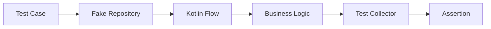

# 007 - Flow Test

**Học phần:** 05 - Quality, Release and Portfolio
**Module:** Module 11 - Testing
**Nhóm nội dung:** Unit Testing
**Nguồn roadmap:** Testing / Unit Testing
**Loại bài:** lesson
**Thứ tự trong module:** 007
**Thời lượng gợi ý:** 30 phút

---

## 1. Tóm tắt

`Flow Test` là kỹ thuật kiểm thử các luồng dữ liệu bất đồng bộ được xây dựng bằng Kotlin `Flow`, đặc biệt quan trọng trong ứng dụng Android sử dụng kiến trúc reactive.

Thay vì khởi chạy toàn bộ ứng dụng rồi thao tác trên UI, developer có thể kiểm tra trực tiếp:

* giá trị được `Flow` phát ra;
* thứ tự các emission;
* sự thay đổi của `StateFlow`;
* business rule trong `Repository` hoặc `ViewModel`;
* trạng thái `Loading`, `Success`, `Error`;
* phản ứng của hệ thống khi dữ liệu đầu vào thay đổi;
* các trường hợp lỗi hoặc race condition liên quan đến coroutine.

Một `Flow Test` tốt cần **nhanh, lặp lại được và xác định được kết quả**. Vì vậy, unit test thường sử dụng fake dependency và công cụ kiểm soát coroutine thay vì phụ thuộc vào mạng, database hoặc timing thực tế.

---

## 2. Mục tiêu học tập

Sau bài học này, người học có thể:

* Giải thích được mục đích của việc kiểm thử Kotlin `Flow` trong ứng dụng Android.
* Phân biệt cách kiểm thử cold `Flow` và hot flow như `StateFlow`.
* Kiểm tra được giá trị và thứ tự emission của một `Flow`.
* Sử dụng `runTest` để kiểm soát coroutine trong unit test.
* Thiết kế fake repository để test business logic mà không phụ thuộc network hoặc database thật.
* Kiểm thử được state transition trong `ViewModel`.
* Nhận diện được các nguyên nhân khiến test bất đồng bộ không ổn định.
* Tạo được một automated test có thể chạy lặp lại ở local hoặc CI.

---

## 3. Vì sao `Flow` cần được kiểm thử riêng?

Một ứng dụng Android hiện đại thường truyền dữ liệu qua nhiều tầng:

```text
Network / Database
        ↓
Repository
        ↓
Flow
        ↓
ViewModel
        ↓
StateFlow
        ↓
UI
```

Nếu chỉ kiểm thử UI, khi một màn hình hiển thị sai rất khó xác định lỗi nằm ở:

* API;
* database;
* repository;
* phép biến đổi dữ liệu;
* coroutine;
* state management;
* hay UI.

Unit test cho `Flow` cho phép kiểm tra logic ở tầng thấp hơn mà không cần mở emulator hoặc khởi chạy Activity.

Ví dụ, một ứng dụng có thể có repository:

```kotlin
fun observeUsers(): Flow<List<User>>
```

`ViewModel` tiếp tục biến đổi dữ liệu:

```kotlin
val userCount: Flow<Int> =
    repository.observeUsers()
        .map { users -> users.size }
```

Nếu repository phát danh sách gồm ba người dùng, test có thể xác minh trực tiếp rằng `userCount` phát ra `3`.

Nhờ đó, lỗi business logic được phát hiện trước khi lan tới UI.

---

## 4. Mô hình kiểm thử `Flow`

Một Flow test điển hình có luồng như sau:



Trong mô hình này:

* **Test Case** thiết lập dữ liệu và hành vi mong muốn.
* **Fake Repository** thay thế dependency thật.
* **Flow** vận chuyển dữ liệu bất đồng bộ.
* **Business Logic** có thể nằm trong repository, use case hoặc `ViewModel`.
* **Test Collector** thu thập emission.
* **Assertion** so sánh kết quả thực tế với kết quả mong đợi.

Mục tiêu là loại bỏ càng nhiều yếu tố không xác định càng tốt. Một unit test không nên phụ thuộc vào việc server có hoạt động hay thiết bị có kết nối Internet.

---

## 5. Công cụ nền tảng để test `Flow`

### 5.1. `runTest`

`runTest` thuộc thư viện `kotlinx-coroutines-test` và cung cấp môi trường kiểm thử dành cho coroutine.

Ví dụ:

```kotlin
@Test
fun `flow emits expected value`() = runTest {
    // test coroutine code
}
```

So với việc dùng `runBlocking` cho mọi trường hợp, `runTest` được thiết kế riêng cho coroutine testing và hỗ trợ kiểm soát scheduler tốt hơn.

### 5.2. Các toán tử hữu ích

Một số toán tử `Flow` đặc biệt hữu ích trong unit test:

| API             | Mục đích                             |
| --------------- | ------------------------------------ |
| `first()`       | Lấy emission đầu tiên                |
| `first { ... }` | Chờ emission đầu tiên thỏa điều kiện |
| `take(n)`       | Chỉ thu thập `n` emission            |
| `toList()`      | Chuyển emission thành danh sách      |
| `drop(n)`       | Bỏ qua một số emission ban đầu       |
| `filter()`      | Chỉ giữ emission phù hợp             |

Việc giới hạn số emission đặc biệt quan trọng đối với hot flow hoặc flow không kết thúc.

---

## 6. Kiểm thử cold `Flow`

Cold `Flow` chỉ bắt đầu thực thi khi có collector.

Ví dụ:

```kotlin
class UserRepository {

    fun userNames(): Flow<String> = flow {
        emit("An")
        emit("Bình")
        emit("Chi")
    }
}
```

Ta có thể thu thập toàn bộ emission:

```kotlin
@Test
fun `userNames emits users in correct order`() = runTest {
    val repository = UserRepository()

    val result = repository.userNames().toList()

    assertEquals(
        listOf("An", "Bình", "Chi"),
        result
    )
}
```

Test này kiểm tra hai yếu tố:

1. Giá trị được phát ra có đúng không.
2. Thứ tự emission có đúng không.

Nếu thứ tự dữ liệu là một phần của business rule, việc chỉ kiểm tra `contains()` sẽ chưa đủ.

---

## 7. Kiểm thử `StateFlow`

`StateFlow` là hot flow luôn giữ một giá trị hiện tại.

Ví dụ:

```kotlin
class CounterViewModel {

    private val _count = MutableStateFlow(0)
    val count: StateFlow<Int> = _count

    fun increment() {
        _count.value += 1
    }
}
```

Nếu chỉ cần kiểm tra state hiện tại, có thể đọc trực tiếp `value`:

```kotlin
@Test
fun `increment increases count`() {
    val viewModel = CounterViewModel()

    viewModel.increment()

    assertEquals(1, viewModel.count.value)
}
```

Đây thường là cách đơn giản nhất nếu mục tiêu chỉ là xác minh state cuối cùng.

Tuy nhiên, nếu cần kiểm tra nhiều state transition, ta phải thực sự collect flow.

Ví dụ logic mong đợi:

```text
0
↓
increment()
↓
1
↓
increment()
↓
2
```

Trong các trường hợp như vậy, test cần quan sát chuỗi emission thay vì chỉ kiểm tra state cuối.

---

## 8. Test state transition trong `ViewModel`

Một pattern phổ biến trong Android là biểu diễn trạng thái màn hình bằng sealed interface:

```kotlin
sealed interface UiState {
    data object Loading : UiState

    data class Success(
        val users: List<String>
    ) : UiState

    data class Error(
        val message: String
    ) : UiState
}
```

Repository:

```kotlin
interface UserRepository {
    suspend fun getUsers(): List<String>
}
```

Fake repository:

```kotlin
class FakeUserRepository(
    private val users: List<String>
) : UserRepository {

    override suspend fun getUsers(): List<String> {
        return users
    }
}
```

`ViewModel` có thể chuyển state theo logic:

```text
Loading
   ↓
Repository trả dữ liệu
   ↓
Success
```

Điều cần kiểm thử không chỉ là danh sách user cuối cùng mà còn là **state transition**.

Một test tốt cần trả lời:

* State khởi đầu là gì?
* Khi operation bắt đầu, state là gì?
* Khi thành công, state trở thành gì?
* Khi dependency lỗi, state trở thành gì?

Đây là nơi Flow testing bảo vệ trực tiếp UX vì UI thường render dựa trên chính những state này.

---

## 9. Sử dụng fake thay vì dependency thật

Unit test không nên gọi API production chỉ để kiểm tra business rule.

Thay vì:

```text
Test
 ↓
Internet
 ↓
Backend
 ↓
Database
```

hãy ưu tiên:

```text
Test
 ↓
Fake Repository
 ↓
Business Logic
```

Ví dụ một repository có thể được điều khiển từ test:

```kotlin
class FakeScoreRepository {

    private val scores = MutableStateFlow<List<Int>>(emptyList())

    fun observeScores(): Flow<List<Int>> = scores

    fun setScores(value: List<Int>) {
        scores.value = value
    }
}
```

Business logic:

```kotlin
class ScoreService(
    private val repository: FakeScoreRepository
) {

    fun averageScore(): Flow<Double> {
        return repository.observeScores()
            .map { values ->
                if (values.isEmpty()) {
                    0.0
                } else {
                    values.average()
                }
            }
    }
}
```

Test:

```kotlin
@Test
fun `averageScore calculates average`() = runTest {
    val repository = FakeScoreRepository()
    val service = ScoreService(repository)

    repository.setScores(listOf(8, 9, 10))

    val result = service.averageScore().first()

    assertEquals(9.0, result)
}
```

Test này không cần:

* emulator;
* Activity;
* database;
* network;
* API server.

Nó chỉ kiểm tra business rule cần thiết.

---

## 10. Kiểm thử nhiều emission

Giả sử hệ thống phát lần lượt:

```text
Loading
↓
Progress
↓
Success
```

Ta có thể thu thập một số lượng emission xác định:

```kotlin
@Test
fun `status emits expected sequence`() = runTest {
    val flow = flow {
        emit("Loading")
        emit("Progress")
        emit("Success")
    }

    val result = flow.take(3).toList()

    assertEquals(
        listOf(
            "Loading",
            "Progress",
            "Success"
        ),
        result
    )
}
```

`take(3)` giúp test biết chính xác khi nào dừng collection.

Điều này đặc biệt quan trọng nếu flow không tự kết thúc.

---

## 11. Kiểm thử lỗi

Flow không chỉ cần test happy path.

Giả sử một operation có thể thất bại:

```kotlin
fun loadData(): Flow<Result<String>> = flow {
    emit(Result.success("Android"))
}
```

Khi xây dựng test suite thực tế, nên có ít nhất các trường hợp:

| Trường hợp         | Điều cần xác minh        |
| ------------------ | ------------------------ |
| Thành công         | Data đúng                |
| Empty data         | State xử lý đúng         |
| Repository lỗi     | Error state đúng         |
| Dữ liệu thay đổi   | Flow cập nhật đúng       |
| Nhiều emission     | Thứ tự đúng              |
| Input không hợp lệ | Business rule xử lý đúng |

Ví dụ một fake repository có thể chủ động phát lỗi để kiểm tra error handling thay vì chờ một API thật thất bại.

---

## 12. Tính xác định của test

Một test được gọi là deterministic khi cùng một đầu vào luôn tạo ra cùng một kết quả.

Flow test dễ trở nên không ổn định nếu phụ thuộc vào:

* `delay()` thực;
* network thật;
* database bên ngoài;
* clock hệ thống;
* thread scheduler không được kiểm soát;
* dữ liệu dùng chung giữa các test.

Ví dụ không nên tạo test dựa trên việc ngủ một khoảng thời gian tùy ý:

```kotlin
delay(2000)
```

với giả định rằng operation chắc chắn hoàn thành sau hai giây.

Cách này tạo ra flaky test vì thời gian thực thi có thể thay đổi tùy máy hoặc môi trường CI.

Thay vào đó, coroutine test nên sử dụng test scheduler và API từ `kotlinx-coroutines-test`.

---

## 13. Dispatcher trong code có coroutine

Nếu business logic hard-code dispatcher:

```kotlin
withContext(Dispatchers.IO) {
    // work
}
```

việc test có thể khó kiểm soát hơn.

Một thiết kế dễ kiểm thử hơn là cho phép inject dispatcher khi cần:

```kotlin
class DataRepository(
    private val ioDispatcher: CoroutineDispatcher
) {

    suspend fun loadData(): String =
        withContext(ioDispatcher) {
            "Android"
        }
}
```

Trong production có thể truyền dispatcher phù hợp.

Trong test có thể truyền test dispatcher.

Nguyên tắc quan trọng là:

> Dependency ảnh hưởng đến concurrency nên có khả năng được kiểm soát trong môi trường test khi điều đó cần thiết cho tính xác định.

Điều này giúp giảm flaky test và làm test suite chạy ổn định hơn trên CI.

---

## 14. Lỗi thường gặp khi test `Flow`

### 14.1. Collect một flow không bao giờ kết thúc

**Hiện tượng:** Test chạy mãi hoặc timeout.

**Nguyên nhân:** Một `StateFlow`, `SharedFlow` hoặc flow dài hạn đang được gọi bằng:

```kotlin
flow.toList()
```

nhưng flow không bao giờ complete.

**Cách xử lý:** Giới hạn emission:

```kotlin
flow.take(3).toList()
```

hoặc chỉ lấy giá trị cần thiết:

```kotlin
flow.first()
```

### 14.2. Test phụ thuộc vào timing thực

**Hiện tượng:** Test lúc pass, lúc fail.

**Nguyên nhân:** Test sử dụng timeout hoặc `delay()` thực để chờ coroutine.

**Cách xử lý:**

* dùng `runTest`;
* sử dụng test scheduler;
* tránh sleep tùy ý;
* kiểm soát dispatcher.

### 14.3. Dùng repository production trong unit test

**Hiện tượng:** Test chậm hoặc thất bại khi mất mạng.

**Nguyên nhân:** Test đang phụ thuộc vào API hoặc database thật.

**Cách xử lý:** Sử dụng fake hoặc dependency có thể kiểm soát.

### 14.4. Chỉ kiểm tra state cuối

**Hiện tượng:** Test vẫn pass dù UI từng đi qua state sai.

Ví dụ implementation phát:

```text
Loading
→ Error
→ Success
```

nhưng test chỉ kiểm tra cuối cùng là `Success`.

**Cách xử lý:** Nếu state transition có ý nghĩa đối với UX, hãy kiểm tra chuỗi emission.

---

## 15. Best practices

Khi xây dựng Flow test trong dự án Android, nên:

* Test business behavior thay vì implementation detail không cần thiết.
* Dùng fake cho dependency có thể thay đổi hoặc khó kiểm soát.
* Dùng `runTest` cho unit test có coroutine.
* Không phụ thuộc vào Internet hoặc backend production.
* Chỉ collect số emission thực sự cần kiểm tra.
* Kiểm tra thứ tự emission khi thứ tự ảnh hưởng đến behavior.
* Bao phủ cả success và failure path.
* Kiểm tra state transition nếu UI phụ thuộc vào chúng.
* Tránh delay thực để đồng bộ test.
* Giữ test nhỏ để lỗi có thể được định vị nhanh.
* Chạy test bằng một command có thể lặp lại.
* Đưa test suite quan trọng vào CI để lỗi được phát hiện trước release.

---

## 16. Bài thực hành

Xây dựng một component quản lý trạng thái đăng nhập bằng `StateFlow`.

State có ba giá trị:

```kotlin
sealed interface LoginState {
    data object Idle : LoginState
    data object Loading : LoginState
    data object Success : LoginState
    data class Error(val message: String) : LoginState
}
```

Logic cần hỗ trợ hai trường hợp:

```text
Đăng nhập hợp lệ
Idle
 ↓
Loading
 ↓
Success
```

và:

```text
Đăng nhập thất bại
Idle
 ↓
Loading
 ↓
Error
```

Yêu cầu:

1. Tạo một fake authentication repository.
2. Cho fake repository có khả năng trả thành công hoặc lỗi.
3. Tạo component sử dụng repository và expose `StateFlow<LoginState>`.
4. Viết test cho trường hợp đăng nhập thành công.
5. Viết test cho trường hợp đăng nhập thất bại.
6. Kiểm tra cả state cuối và state transition khi chúng có ý nghĩa.
7. Chạy toàn bộ unit test từ local.

**Kết quả mong đợi:**

* Test không cần Internet.
* Test không cần emulator.
* Success case có kết quả ổn định.
* Failure case có kết quả ổn định.
* Test chạy lặp lại mà không phụ thuộc timing thực.

---

## 17. Artifact cho portfolio

Flow testing có thể trở thành một quality artifact nhỏ nhưng có giá trị nếu được trình bày rõ.

Có thể lưu:

```text
app/
└── src/
    └── test/
        └── ...
            ├── LoginViewModelTest.kt
            └── FakeAuthRepository.kt
```

Trong `README`, ghi ngắn gọn:

```markdown
## Flow Testing

Business state được kiểm thử bằng unit test thay vì UI test.

Các trường hợp được bảo vệ:

- Login success.
- Login failure.
- State transition.
- Repository error.

Test sử dụng fake dependency để không phụ thuộc vào network.
```

Artifact này thể hiện rằng developer không chỉ triển khai tính năng mà còn biết xây dựng feedback loop để bảo vệ behavior của ứng dụng.

---

## 18. Checklist hoàn thành

* [ ] Giải thích được vì sao Kotlin `Flow` cần được unit test.
* [ ] Phân biệt được cách tiếp cận với cold `Flow` và `StateFlow`.
* [ ] Sử dụng được `runTest`.
* [ ] Kiểm tra được emission đầu tiên của một `Flow`.
* [ ] Kiểm tra được một chuỗi nhiều emission.
* [ ] Biết cách tránh collect vô hạn.
* [ ] Sử dụng được fake repository trong test.
* [ ] Kiểm tra được success path.
* [ ] Kiểm tra được failure path.
* [ ] Nhận diện được flaky test do timing hoặc dependency thật.
* [ ] Có ít nhất một automated Flow test trong project mẫu.
* [ ] Có thể chạy test bằng một quy trình lặp lại ở local hoặc CI.

---

## 19. Câu hỏi tự kiểm tra

1. Tại sao unit test cho `Flow` không nên phụ thuộc vào API production?
2. Khi nào chỉ kiểm tra `StateFlow.value` là đủ, và khi nào cần collect nhiều emission?
3. Vì sao gọi `toList()` trên một hot flow có thể khiến test không kết thúc?
4. `runTest` giúp Flow testing ổn định hơn như thế nào?
5. Nếu UI hiển thị lần lượt `Loading → Error → Success` nhưng test chỉ kiểm tra `Success`, test đang bỏ sót vấn đề gì?

---

## 20. Tổng kết

`Flow Test` cho phép kiểm tra trực tiếp luồng dữ liệu và state bất đồng bộ mà không cần khởi chạy toàn bộ ứng dụng Android.

Ba nguyên tắc quan trọng nhất là:

* **Kiểm soát dependency:** sử dụng fake thay cho network hoặc database thật.
* **Kiểm soát concurrency:** sử dụng công cụ coroutine testing như `runTest`.
* **Kiểm tra behavior:** xác minh dữ liệu, thứ tự emission và state transition có ý nghĩa đối với ứng dụng.

Khi được tích hợp vào quy trình local và CI, Flow test tạo ra một feedback loop nhanh giúp phát hiện lỗi business logic sớm, giảm flaky behavior và giảm rủi ro trước khi release.
