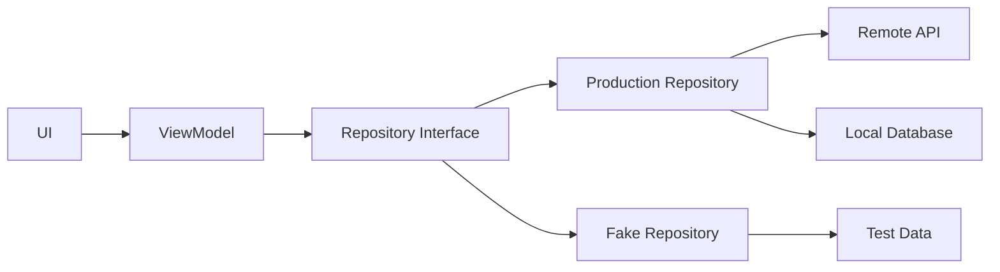

# 008 - Fake Repository

**Học phần:** 05 - Quality, Release and Portfolio
**Module:** Module 11 - Testing
**Nhóm nội dung:** Unit Testing
**Nguồn roadmap:** Testing / Unit Testing
**Loại bài:** lesson
**Thứ tự trong module:** 008
**Thời lượng gợi ý:** 30 phút

---

## 1. Tóm tắt

`Fake Repository` là một kỹ thuật kiểm thử trong Android dùng để thay thế repository thật bằng một implementation đơn giản, có hành vi được kiểm soát hoàn toàn bởi test.

Thay vì để unit test truy cập database, gọi HTTP API hoặc phụ thuộc vào môi trường bên ngoài, developer có thể cung cấp dữ liệu giả trực tiếp từ `Fake Repository`. Nhờ đó, test chạy nhanh hơn, ổn định hơn và có thể kiểm tra chính xác các tình huống như:

* tải dữ liệu thành công;
* repository trả về danh sách rỗng;
* xảy ra lỗi;
* dữ liệu thay đổi;
* business rule chuyển sang state khác.

Trong kiến trúc Android, `Fake Repository` đặc biệt hữu ích khi kiểm thử `ViewModel`, use case và các thành phần chứa business logic mà không cần khởi chạy toàn bộ ứng dụng.

---

## 2. Mục tiêu học tập

Sau bài này, người học có thể:

* Giải thích được `Fake Repository` là gì và vì sao nó hữu ích trong unit testing.
* Phân biệt repository thật với repository giả dùng trong test.
* Thiết kế repository thông qua abstraction để có thể thay implementation khi kiểm thử.
* Xây dựng một `Fake Repository` đơn giản bằng Kotlin.
* Sử dụng fake để kiểm thử business rule và state của `ViewModel`.
* Mô phỏng được cả trường hợp thành công và thất bại mà không truy cập network hoặc database.
* Nhận biết các trường hợp fake có thể làm test trở nên sai lệch so với production.
* Tạo được một test artifact nhỏ có thể đưa vào portfolio Android.

---

## 3. Vấn đề mà Fake Repository giải quyết

Giả sử một màn hình Android cần tải danh sách công việc từ server.

Luồng production có thể là:

```text
UI
 ↓
ViewModel
 ↓
Repository
 ↓
Remote API
```

Nếu unit test `ViewModel` bằng repository thật, test có thể phụ thuộc vào:

* kết nối Internet;
* trạng thái backend;
* authentication;
* database;
* thời gian phản hồi;
* dữ liệu đang tồn tại trên server;
* lỗi hệ thống bên ngoài.

Khi đó một test có thể thất bại dù business logic trong `ViewModel` hoàn toàn đúng.

Unit test cần một môi trường khác:

```text
ViewModel
    ↓
Fake Repository
    ↓
Dữ liệu do test kiểm soát
```

`Fake Repository` loại bỏ phần lớn các biến số bên ngoài để test chỉ tập trung vào hành vi cần kiểm chứng.

---

## 4. Fake Repository là gì?

`Fake Repository` là một implementation thay thế của repository được thiết kế cho môi trường kiểm thử.

Ví dụ ứng dụng định nghĩa abstraction:

```kotlin
interface TaskRepository {
    suspend fun getTasks(): List<Task>
}
```

Production có thể sử dụng implementation thật:

```kotlin
class NetworkTaskRepository(
    private val api: TaskApi
) : TaskRepository {

    override suspend fun getTasks(): List<Task> {
        return api.getTasks()
    }
}
```

Trong unit test, thay vì sử dụng `NetworkTaskRepository`, ta tạo:

```kotlin
class FakeTaskRepository : TaskRepository {

    var tasks: List<Task> = emptyList()

    override suspend fun getTasks(): List<Task> {
        return tasks
    }
}
```

Test có thể chủ động thiết lập dữ liệu:

```kotlin
fakeRepository.tasks = listOf(
    Task(id = 1, title = "Learn Unit Testing"),
    Task(id = 2, title = "Write ViewModel Test")
)
```

Không có request HTTP nào được gửi đi.

Không cần backend.

Kết quả được kiểm soát hoàn toàn bởi test.

---

## 5. Vị trí của Fake Repository trong kiến trúc Android

Một kiến trúc phổ biến có thể được mô tả như sau:



Điểm quan trọng là `ViewModel` không cần biết repository phía dưới đang là production implementation hay fake implementation.

Cả hai cùng tuân theo một contract:

```kotlin
TaskRepository
```

Trong production:

```text
TaskRepository
       ↓
NetworkTaskRepository
       ↓
API / Database
```

Trong test:

```text
TaskRepository
       ↓
FakeTaskRepository
       ↓
Controlled Test Data
```

Khả năng thay dependency này giúp business logic có thể được kiểm thử độc lập với tầng data thật.

---

## 6. Thiết kế code để có thể sử dụng Fake Repository

Một fake chỉ thực sự hữu ích khi code production không phụ thuộc cứng vào implementation cụ thể.

Ví dụ model:

```kotlin
data class Task(
    val id: Int,
    val title: String
)
```

Repository contract:

```kotlin
interface TaskRepository {
    suspend fun getTasks(): List<Task>
}
```

`ViewModel` nhận repository thông qua constructor:

```kotlin
class TaskViewModel(
    private val repository: TaskRepository
) : ViewModel() {

    private val _tasks = MutableStateFlow<List<Task>>(emptyList())
    val tasks: StateFlow<List<Task>> = _tasks

    suspend fun loadTasks() {
        _tasks.value = repository.getTasks()
    }
}
```

Điểm quan trọng nằm ở:

```kotlin
private val repository: TaskRepository
```

thay vì:

```kotlin
private val repository = NetworkTaskRepository(...)
```

Khi dependency được truyền từ bên ngoài, test có thể thay repository thật bằng fake một cách dễ dàng.

Đây cũng là một ví dụ điển hình của dependency injection.

---

## 7. Xây dựng Fake Repository

Một fake cơ bản có thể lưu dữ liệu ngay trong bộ nhớ:

```kotlin
class FakeTaskRepository : TaskRepository {

    private val tasks = mutableListOf<Task>()

    fun setTasks(newTasks: List<Task>) {
        tasks.clear()
        tasks.addAll(newTasks)
    }

    override suspend fun getTasks(): List<Task> {
        return tasks.toList()
    }
}
```

Test có thể thiết lập trạng thái ban đầu:

```kotlin
val repository = FakeTaskRepository()

repository.setTasks(
    listOf(
        Task(1, "Learn Fake Repository"),
        Task(2, "Write Unit Tests")
    )
)
```

Fake này có một số đặc điểm hữu ích:

* không truy cập network;
* không truy cập database;
* chạy hoàn toàn trong memory;
* dữ liệu được điều khiển bởi test;
* kết quả có thể lặp lại;
* dễ thiết lập nhiều test scenario.

---

## 8. Kiểm thử ViewModel bằng Fake Repository

Giả sử cần kiểm tra rằng `TaskViewModel` tải đúng danh sách task.

Có thể viết test:

```kotlin
@Test
fun loadTasks_updatesTaskState() = runTest {
    val repository = FakeTaskRepository()

    repository.setTasks(
        listOf(
            Task(1, "Learn Testing"),
            Task(2, "Build Fake Repository")
        )
    )

    val viewModel = TaskViewModel(repository)

    viewModel.loadTasks()

    assertEquals(
        listOf(
            Task(1, "Learn Testing"),
            Task(2, "Build Fake Repository")
        ),
        viewModel.tasks.value
    )
}
```

Test này chỉ kiểm tra:

```text
Repository trả dữ liệu
        ↓
ViewModel xử lý dữ liệu
        ↓
State được cập nhật
```

Nó không kiểm tra:

* Retrofit có hoạt động hay không;
* server có online hay không;
* JSON có parse đúng hay không;
* database có truy cập được hay không.

Các vấn đề đó nên được kiểm thử ở những tầng thích hợp khác.

---

## 9. Fake Repository và tính deterministic của test

Một unit test tốt nên có tính **deterministic**: cùng một input phải tạo ra cùng một kết quả.

Ví dụ không tốt:

```text
Test
 ↓
Internet
 ↓
Production API
 ↓
Dữ liệu thay đổi
```

Hôm nay API có thể trả:

```text
10 tasks
```

Ngày mai có thể trả:

```text
12 tasks
```

Hoặc server có thể tạm thời không phản hồi.

Test khi đó không còn deterministic.

Với fake:

```text
Test
 ↓
Fake Repository
 ↓
2 tasks cố định
```

Mỗi lần chạy test đều nhận cùng một trạng thái đầu vào.

Đây là một trong những lý do quan trọng nhất để sử dụng fake trong unit testing.

---

## 10. Mô phỏng lỗi bằng Fake Repository

Fake không chỉ dùng để trả dữ liệu thành công.

Một fake tốt còn cho phép test chủ động tạo lỗi.

Có thể mở rộng repository:

```kotlin
class FakeTaskRepository : TaskRepository {

    var tasks: List<Task> = emptyList()
    var shouldThrowError: Boolean = false

    override suspend fun getTasks(): List<Task> {
        if (shouldThrowError) {
            throw IllegalStateException("Fake repository error")
        }

        return tasks
    }
}
```

Test có thể chuyển fake sang trạng thái lỗi:

```kotlin
repository.shouldThrowError = true
```

Điều này đặc biệt hữu ích khi cần kiểm tra:

* loading state;
* error state;
* retry;
* fallback;
* empty state;
* business rule khi dependency thất bại.

Thay vì phải làm server thật gặp lỗi, test chỉ cần thay đổi một biến.

---

## 11. Kiểm thử state transition

Trong Android hiện đại, `ViewModel` thường quản lý UI state.

Ví dụ:

```kotlin
sealed interface TaskUiState {

    data object Loading : TaskUiState

    data class Success(
        val tasks: List<Task>
    ) : TaskUiState

    data class Error(
        val message: String
    ) : TaskUiState
}
```

Một flow tải dữ liệu có thể là:

```text
Idle
 ↓
Loading
 ↓
Success
```

hoặc:

```text
Idle
 ↓
Loading
 ↓
Error
```

Fake Repository giúp test chủ động kích hoạt cả hai nhánh.

### Trường hợp thành công

```text
Fake Repository
      ↓
Returns tasks
      ↓
ViewModel
      ↓
Success
```

### Trường hợp thất bại

```text
Fake Repository
      ↓
Throws error
      ↓
ViewModel
      ↓
Error
```

Nhờ đó unit test có thể tập trung kiểm chứng state transition thay vì phụ thuộc vào cách tạo lỗi từ backend thật.

---

## 12. Fake Repository khác gì mock?

`Fake` và `mock` đều có thể thay dependency thật trong test, nhưng mục đích sử dụng thường khác nhau.

| Kỹ thuật | Đặc điểm chính                                     | Phù hợp khi                               |
| -------- | -------------------------------------------------- | ----------------------------------------- |
| Fake     | Có implementation đơn giản nhưng thực sự hoạt động | Muốn mô phỏng repository hoặc data source |
| Mock     | Chủ yếu ghi nhận và xác minh interaction           | Muốn kiểm tra method nào đã được gọi      |
| Stub     | Trả về giá trị đã định trước                       | Chỉ cần cung cấp response cụ thể          |

Ví dụ fake có thể thực sự lưu task trong memory:

```kotlin
fakeRepository.addTask(task)
```

sau đó:

```kotlin
fakeRepository.getTasks()
```

trả về dữ liệu đã được thêm.

Trong khi mock thường được dùng cho câu hỏi kiểu:

```text
saveTask() có được gọi đúng một lần không?
```

Không có kỹ thuật nào luôn tốt hơn kỹ thuật nào. Chọn loại test double dựa trên điều cần kiểm chứng.

---

## 13. Khi nào nên sử dụng Fake Repository?

`Fake Repository` đặc biệt phù hợp khi kiểm thử:

* `ViewModel`;
* use case;
* domain service;
* business rule;
* state transformation;
* validation;
* filtering;
* sorting;
* retry logic;
* xử lý lỗi;
* hành vi phụ thuộc vào dữ liệu repository.

Ví dụ cần kiểm tra:

> Khi repository trả về danh sách task rỗng, UI state có chuyển sang trạng thái empty hay không?

Fake rất phù hợp vì test có thể thiết lập:

```kotlin
repository.tasks = emptyList()
```

và kiểm tra kết quả ngay lập tức.

---

## 14. Khi nào Fake Repository không đủ?

Fake Repository không thay thế mọi loại test.

Nếu cần xác nhận:

* Retrofit configuration;
* HTTP request;
* JSON serialization;
* Room query;
* database migration;
* SQL behavior;
* dependency injection configuration;
* tương tác thật giữa nhiều thành phần;

thì cần integration test hoặc loại test phù hợp hơn.

Một hệ thống test tốt thường có nhiều tầng:

```text
Unit Tests
    ↓
Fake Repository
    ↓
Kiểm tra business logic

Integration Tests
    ↓
Repository thật
    ↓
Database / API client

UI Tests
    ↓
Screen thật
    ↓
User flow
```

Fake giúp unit test nhanh và cô lập, nhưng không chứng minh toàn bộ hệ thống production hoạt động chính xác.

---

## 15. Lỗi thường gặp

**Hiện tượng:** Unit test vẫn gọi API thật.

**Nguyên nhân:** `ViewModel` tự khởi tạo repository cụ thể thay vì nhận dependency từ bên ngoài.

**Cách xử lý:** Phụ thuộc vào repository interface và truyền implementation qua constructor hoặc dependency injection.

---

**Hiện tượng:** Fake ngày càng chứa rất nhiều logic giống production repository.

**Nguyên nhân:** Fake đang cố mô phỏng toàn bộ implementation thật.

**Cách xử lý:** Giữ fake đơn giản. Chỉ triển khai hành vi cần thiết cho test.

---

**Hiện tượng:** Test chạy thành công với fake nhưng production lại lỗi.

**Nguyên nhân:** Fake không phản ánh một đặc điểm quan trọng của data source thật.

Ví dụ:

* production có thể trả lỗi;
* production có độ trễ;
* dữ liệu có thể rỗng;
* dữ liệu có thể không hợp lệ.

**Cách xử lý:** Bổ sung các scenario quan trọng và kết hợp với integration test.

---

**Hiện tượng:** Nhiều test ảnh hưởng lẫn nhau.

**Nguyên nhân:** Một instance fake được chia sẻ và không reset state.

**Cách xử lý:** Tạo fake mới cho từng test hoặc reset dữ liệu rõ ràng trước mỗi test.

---

## 16. Best practices

Khi thiết kế và sử dụng `Fake Repository`, nên:

* phụ thuộc vào abstraction thay vì concrete implementation;
* tạo fake riêng cho test thay vì thêm logic test vào production repository;
* giữ fake nhỏ và dễ đọc;
* cho phép test kiểm soát dữ liệu trả về;
* cho phép mô phỏng lỗi khi cần;
* tránh network và database thật trong unit test;
* khởi tạo state riêng cho từng test;
* đặt tên scenario test theo hành vi cần kiểm chứng;
* kết hợp fake-based unit test với integration test;
* kiểm thử cả happy path và failure path.

Ví dụ tên test nên thể hiện hành vi:

```kotlin
@Test
fun loadTasks_whenRepositorySucceeds_updatesSuccessState()
```

thay vì tên quá chung chung:

```kotlin
@Test
fun testLoadTasks()
```

Tên test tốt giúp developer hiểu ngay điều gì bị hỏng khi CI báo failure.

---

## 17. Bài thực hành

Xây dựng một `FakeTaskRepository` và sử dụng nó để kiểm thử `TaskViewModel`.

Yêu cầu:

1. Tạo `TaskRepository`.
2. Tạo production implementation hoặc placeholder tương ứng.
3. Tạo `FakeTaskRepository`.
4. Cho phép fake thiết lập danh sách task.
5. Cho phép fake mô phỏng lỗi.
6. Viết test cho trường hợp repository trả dữ liệu thành công.
7. Viết test cho trường hợp repository trả danh sách rỗng.
8. Viết test cho trường hợp repository phát sinh lỗi.
9. Chạy toàn bộ test nhiều lần để kiểm tra tính ổn định.

**Kết quả mong đợi:**

```text
Repository thật không được truy cập
           ↓
Fake cung cấp test data
           ↓
ViewModel xử lý
           ↓
Unit test xác minh state
```

Mỗi test phải có thể chạy độc lập và cho kết quả nhất quán.

---

## 18. Artifact cho portfolio

Có thể lưu một artifact nhỏ theo cấu trúc:

```text
app/
└── src/
    ├── main/
    │   └── ...
    └── test/
        └── ...
            ├── FakeTaskRepository.kt
            └── TaskViewModelTest.kt
```

README ngắn nên mô tả:

* component đang được kiểm thử;
* lý do sử dụng `Fake Repository`;
* những dependency thật đã được loại bỏ khỏi unit test;
* các scenario được kiểm thử;
* ví dụ test failure;
* lệnh hoặc cách chạy test.

Một portfolio artifact tốt không chỉ chứng minh rằng test chạy thành công mà còn cho thấy developer hiểu:

```text
Test đang bảo vệ hành vi nào?
```

và:

```text
Failure này có ý nghĩa gì đối với người dùng?
```

Ví dụ, nếu test bảo vệ việc xử lý lỗi khi tải task, failure của test có thể báo hiệu nguy cơ UI bị kẹt ở loading state khi request production thất bại.

---

## 19. Checklist hoàn thành

* [ ] Giải thích được `Fake Repository` bằng ngôn ngữ của mình.
* [ ] Phân biệt được repository production và fake repository.
* [ ] Giải thích được vì sao fake làm unit test deterministic hơn.
* [ ] Thiết kế repository thông qua abstraction.
* [ ] Tạo được một fake implementation bằng Kotlin.
* [ ] Kiểm thử được trường hợp dữ liệu thành công.
* [ ] Kiểm thử được trường hợp dữ liệu rỗng.
* [ ] Kiểm thử được trường hợp repository phát sinh lỗi.
* [ ] Không phụ thuộc vào network hoặc database thật trong unit test.
* [ ] Có ít nhất một automated test có thể chạy lặp lại.
* [ ] Ghi lại được failure mà test đang ngăn chặn.
* [ ] Có test artifact hoặc README phù hợp để đưa vào portfolio.

---

## 20. Câu hỏi tự kiểm tra

1. Vì sao unit test sử dụng production API có thể trở nên không deterministic?
2. `Fake Repository` giúp cô lập `ViewModel` khỏi những dependency nào?
3. Vì sao repository interface giúp code dễ kiểm thử hơn?
4. Trong trường hợp nào nên dùng integration test thay vì chỉ dựa vào fake?
5. Một fake quá giống production implementation có thể gây ra vấn đề gì?

---

## 21. Tổng kết

`Fake Repository` là một test double đặc biệt hữu ích trong Android unit testing. Nó cung cấp một implementation đơn giản của repository để test có thể kiểm soát dữ liệu, lỗi và trạng thái mà không phụ thuộc vào network hoặc database thật.

Kiến trúc cốt lõi là:

```text
Production
ViewModel → Repository Interface → Real Repository → API / Database

Testing
ViewModel → Repository Interface → Fake Repository → Controlled Data
```

Kỹ thuật này giúp test:

* nhanh;
* cô lập;
* lặp lại được;
* dễ mô phỏng edge case;
* dễ kiểm tra business rule và state transition.

Tuy nhiên, fake không thay thế integration test. Unit test với `Fake Repository` kiểm chứng logic của từng thành phần, còn các test ở tầng cao hơn vẫn cần thiết để đảm bảo repository thật, database, network và toàn bộ ứng dụng hoạt động đúng khi tích hợp với nhau.
