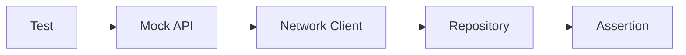
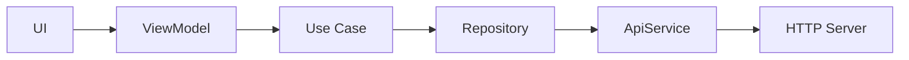
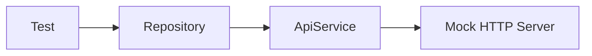

# 009 - Mock API

**Học phần:** 05 - Quality, Release and Portfolio  
**Module:** Module 11 - Testing  
**Nhóm nội dung:** Unit Testing  
**Nguồn roadmap:** Testing / Unit Testing  
**Loại bài:** lesson  
**Thứ tự trong module:** 009  
**Thời lượng gợi ý:** 30 phút

---

## 1. Tóm tắt

`Mock API` là kỹ thuật mô phỏng hành vi của một API thật để kiểm thử ứng dụng mà không phụ thuộc vào backend, kết nối mạng hoặc dữ liệu production.

Trong Android, Mock API đặc biệt hữu ích khi kiểm thử các thành phần như `Repository`, xử lý lỗi mạng, ánh xạ dữ liệu, state của màn hình và các business rule liên quan đến dữ liệu từ server.

Thay vì để test phụ thuộc vào một backend có thể chậm, mất kết nối hoặc thay đổi dữ liệu, developer chủ động xác định response mà hệ thống sẽ nhận:

```text
Test
  ↓
Mock API
  ↓
Response được kiểm soát
  ↓
Repository / Use Case
  ↓
State
  ↓
Assertion
```

Kỹ thuật này giúp test nhanh hơn, ổn định hơn và có thể tái hiện chính xác những trường hợp khó tạo ra trên hệ thống thật như `404`, `500`, timeout hoặc dữ liệu không hợp lệ.

---

## 2. Mục tiêu học tập

Sau bài học, người học có thể:

- Giải thích được Mock API là gì và lý do cần sử dụng trong kiểm thử Android.
- Phân biệt Mock API với backend thật, fake repository và mock object.
- Thiết kế được response thành công và response lỗi để kiểm thử networking layer.
- Sử dụng Mock API để kiểm tra `Repository` hoặc luồng xử lý dữ liệu.
- Kiểm thử được những trường hợp như HTTP error, dữ liệu rỗng và JSON không hợp lệ.
- Giải thích được cách Mock API giúp test trở nên deterministic và giảm release risk.
- Tạo được một test artifact có thể đưa vào portfolio Android.

---

## 3. Vấn đề khi test trực tiếp với API thật

Giả sử ứng dụng Android tải danh sách người dùng từ:

```text
GET /users
```

Một test gọi trực tiếp server thật có thể gặp nhiều yếu tố nằm ngoài quyền kiểm soát của test:

- server đang bảo trì;
- mạng chậm;
- mất Internet;
- token hết hạn;
- dữ liệu trên server thay đổi;
- rate limit;
- database backend thay đổi;
- API production không cho phép tạo dữ liệu lỗi tùy ý.

Khi đó một test có thể thất bại dù code Android hoàn toàn đúng.

Ví dụ:

```text
Test Repository
      ↓
Internet
      ↓
Backend thật
      ↓
Database thật
```

Có quá nhiều thành phần bên ngoài tham gia vào phép kiểm thử.

Một unit test tốt cần gần với nguyên tắc:

```text
Cùng input
   ↓
Cùng hành vi
   ↓
Cùng output
```

Đặc tính này thường được gọi là **deterministic**.

Mock API giúp loại bỏ phần lớn yếu tố không ổn định bằng cách thay backend thật bằng một server mô phỏng do test kiểm soát.

---

## 4. Mock API là gì?

Mock API là một API giả có interface hoặc hành vi tương tự API mà ứng dụng thực sự sử dụng.

Ví dụ ứng dụng mong đợi:

```http
GET /users
```

Backend thật có thể trả:

```json
[
  {
    "id": 1,
    "name": "An"
  }
]
```

Trong test, Mock API có thể trả chính response đó mà không cần gọi backend thật.

Developer cũng có thể chủ động yêu cầu Mock API trả lỗi:

```http
HTTP/1.1 500 Internal Server Error
```

hoặc:

```json
{
  "message": "Server error"
}
```

Điểm quan trọng không phải là xây dựng một backend hoàn chỉnh, mà là tạo ra **hành vi mạng có thể kiểm soát được**.

Có thể hình dung:



`Test` định nghĩa response cần mô phỏng. Network client của ứng dụng vẫn xử lý HTTP gần giống khi chạy thật, sau đó `Repository` xử lý dữ liệu và test kiểm tra kết quả cuối cùng.

Nhờ vậy, phần networking của ứng dụng được kiểm tra mà không phụ thuộc Internet hoặc backend production.

---

## 5. Mock API, Mock Object và Fake Repository khác nhau thế nào?

Ba khái niệm này thường bị nhầm lẫn.

| Kỹ thuật | Mô phỏng | Mức kiểm thử phù hợp |
|---|---|---|
| Mock API | HTTP server và response | Networking, repository |
| Mock object | Một object hoặc dependency | Unit test |
| Fake repository | Toàn bộ `Repository` | ViewModel, Use Case, UI state |
| API thật | Backend production hoặc staging | Integration, end-to-end |

Ví dụ với kiến trúc:

```text
ViewModel
   ↓
Repository
   ↓
ApiService
   ↓
HTTP Server
```

Nếu kiểm thử `ViewModel`, có thể thay `Repository` bằng `FakeRepository`.

Nếu kiểm thử `Repository`, việc fake luôn `Repository` không còn ý nghĩa vì chính `Repository` là thành phần cần kiểm tra. Khi đó Mock API thường phù hợp hơn:

```text
Repository thật
     ↓
ApiService thật
     ↓
Mock API
```

Đây là điểm quan trọng khi lựa chọn test double.

---

## 6. Mock API trong kiến trúc Android

Một kiến trúc networking phổ biến có thể gồm:



Khi test `Repository`, phần trên `Repository` không nhất thiết phải tham gia.

Ta có thể cô lập phạm vi:



Cấu trúc production của `Repository` và `ApiService` vẫn được sử dụng.

Chỉ endpoint server được thay bằng Mock API.

Điều này cho phép kiểm tra những thành phần quan trọng như:

- URL;
- HTTP method;
- request body;
- header;
- parsing JSON;
- HTTP status code;
- mapping DTO;
- error handling;
- repository result.

---

## 7. Ví dụ kiểm thử với MockWebServer

Trong hệ sinh thái Android sử dụng OkHttp, một cách phổ biến để mô phỏng HTTP server trong test là `MockWebServer`.

Giả sử ứng dụng có model:

```kotlin
data class UserDto(
    val id: Long,
    val name: String
)
```

API:

```kotlin
interface UserApi {

    @GET("users")
    suspend fun getUsers(): List<UserDto>
}
```

Repository:

```kotlin
class UserRepository(
    private val api: UserApi
) {

    suspend fun getUsers(): List<UserDto> {
        return api.getUsers()
    }
}
```

Trong ứng dụng thật:

```text
Retrofit
   ↓
https://api.example.com/
```

Trong test:

```text
Retrofit
   ↓
MockWebServer
```

Logic production không cần thay đổi.

---

## 8. Kiểm thử response thành công

Một test cơ bản cần xác minh rằng `Repository` xử lý đúng response `200 OK`.

Ví dụ Mock API trả:

```json
[
  {
    "id": 1,
    "name": "An"
  },
  {
    "id": 2,
    "name": "Minh"
  }
]
```

Test có thể được tổ chức như sau:

```kotlin
class UserRepositoryTest {

    private lateinit var server: MockWebServer
    private lateinit var api: UserApi
    private lateinit var repository: UserRepository

    @Before
    fun setup() {
        server = MockWebServer()
        server.start()

        api = Retrofit.Builder()
            .baseUrl(server.url("/"))
            .addConverterFactory(GsonConverterFactory.create())
            .build()
            .create(UserApi::class.java)

        repository = UserRepository(api)
    }

    @After
    fun tearDown() {
        server.shutdown()
    }
}
```

Sau đó chuẩn bị response:

```kotlin
@Test
fun getUsers_returnsUsers_whenApiSucceeds() = runTest {
    server.enqueue(
        MockResponse()
            .setResponseCode(200)
            .setBody(
                """
                [
                  {"id":1,"name":"An"},
                  {"id":2,"name":"Minh"}
                ]
                """.trimIndent()
            )
            .addHeader("Content-Type", "application/json")
    )

    val users = repository.getUsers()

    assertEquals(2, users.size)
    assertEquals("An", users[0].name)
}
```

Luồng thực thi:

```text
server.enqueue()
       ↓
Chuẩn bị HTTP response
       ↓
repository.getUsers()
       ↓
Retrofit gửi request
       ↓
MockWebServer trả JSON
       ↓
Retrofit parse JSON
       ↓
Repository nhận List<UserDto>
       ↓
Assertion
```

Test này không cần Internet và không cần backend thật.

---

## 9. Kiểm tra request do ứng dụng gửi đi

Mock API không chỉ giúp kiểm tra response.

Ta cũng có thể kiểm tra request mà ứng dụng gửi.

Ví dụ:

```kotlin
val request = server.takeRequest()

assertEquals("/users", request.path)
assertEquals("GET", request.method)
```

Điều này rất hữu ích khi test:

- endpoint;
- query parameter;
- header;
- HTTP method;
- request body.

Ví dụ API:

```kotlin
@GET("users")
suspend fun searchUsers(
    @Query("page") page: Int
): List<UserDto>
```

Test có thể xác minh:

```kotlin
val request = server.takeRequest()

assertEquals("/users?page=2", request.path)
```

Nhờ đó test không chỉ kiểm tra dữ liệu đầu ra mà còn bảo vệ HTTP contract giữa Android app và backend.

---

## 10. Kiểm thử các tình huống lỗi

Một lợi ích lớn của Mock API là developer có thể chủ động tạo những lỗi hiếm xảy ra trên backend thật.

### 10.1. HTTP error

Mock server có thể trả:

```kotlin
server.enqueue(
    MockResponse()
        .setResponseCode(500)
        .setBody(
            """
            {
              "message": "Internal server error"
            }
            """.trimIndent()
        )
)
```

Test cần xác minh ứng dụng không coi response này là dữ liệu thành công.

### 10.2. Dữ liệu JSON không hợp lệ

Ví dụ:

```kotlin
server.enqueue(
    MockResponse()
        .setResponseCode(200)
        .setBody("invalid-json")
)
```

Trường hợp này giúp kiểm tra khả năng xử lý lỗi parsing.

Các lỗi khác có thể mô phỏng gồm:

- `401 Unauthorized`;
- `403 Forbidden`;
- `404 Not Found`;
- `429 Too Many Requests`;
- `500 Internal Server Error`;
- response body rỗng;
- danh sách rỗng;
- field bị thiếu;
- dữ liệu sai format.

Đây là những trường hợp cần được kiểm tra trước khi phát hành ứng dụng thay vì chờ người dùng gặp lỗi trong production.

---

## 11. Mock API và state của ứng dụng

Networking thường không kết thúc ở `Repository`.

Response từ API thường được chuyển thành UI state:

```text
API response
    ↓
Repository
    ↓
Use Case
    ↓
ViewModel
    ↓
UI State
```

Ví dụ một màn hình có thể sử dụng:

```kotlin
sealed interface UserUiState {

    data object Loading : UserUiState

    data class Success(
        val users: List<UserDto>
    ) : UserUiState

    data class Error(
        val message: String
    ) : UserUiState
}
```

Một request thành công cần dẫn đến:

```text
Loading
   ↓
Success
```

Một lỗi network có thể dẫn đến:

```text
Loading
   ↓
Error
```

Mock API giúp chủ động tạo từng loại response để kiểm tra state transition tương ứng.

Tuy nhiên, nếu mục tiêu chỉ là test logic của `ViewModel`, việc dùng Mock API có thể quá nặng. Trong trường hợp đó, một `FakeRepository` thường đơn giản và nhanh hơn.

Nguyên tắc là test ở đúng boundary cần kiểm chứng.

---

## 12. Không phải test nào cũng cần Mock API

Không nên sử dụng Mock API cho mọi test.

Nếu muốn test:

```text
ViewModel
```

thì dependency phù hợp để fake thường là:

```text
Repository
```

Nếu muốn test:

```text
Repository + Retrofit + JSON parsing
```

thì Mock API rất phù hợp.

Nếu muốn test toàn bộ hệ thống:

```text
Android App
    ↓
Network
    ↓
Backend
    ↓
Database
```

thì cần integration test hoặc end-to-end test với môi trường backend thích hợp.

Có thể chọn theo phạm vi:

| Thành phần cần kiểm tra | Test double phù hợp |
|---|---|
| Business rule đơn giản | Fake dependency |
| `ViewModel` | Fake Repository |
| `UseCase` | Fake Repository |
| `Repository` | Mock API hoặc Fake Data Source |
| Retrofit / OkHttp | Mock API |
| Backend integration thực tế | Staging API |

---

## 13. Deterministic test và coroutine

Network test thường kết hợp với coroutine.

Nếu test vừa phụ thuộc networking vừa phụ thuộc dispatcher thật, độ ổn định có thể giảm.

Vì vậy nên kiểm soát các dependency bất đồng bộ khi có thể.

Ví dụ một class phụ thuộc `CoroutineDispatcher`:

```kotlin
class UserRepository(
    private val api: UserApi,
    private val ioDispatcher: CoroutineDispatcher
) {

    suspend fun getUsers(): List<UserDto> =
        withContext(ioDispatcher) {
            api.getUsers()
        }
}
```

Trong production có thể truyền dispatcher phù hợp.

Trong test, truyền test dispatcher giúp kiểm soát execution.

Ý tưởng tổng quát:

```text
Không kiểm soát dependency
        ↓
Timing khó dự đoán
        ↓
Flaky test
```

so với:

```text
Fake / Mock dependency
        +
Test dispatcher
        +
Mock API
        ↓
Deterministic test
```

Không phải mọi repository đều bắt buộc phải tự chuyển dispatcher; điều quan trọng là những thành phần bất đồng bộ cần được thiết kế sao cho có thể kiểm thử.

---

## 14. Các lỗi thường gặp

| Hiện tượng | Nguyên nhân | Cách xử lý |
|---|---|---|
| Test vẫn gọi API production | `baseUrl` không được thay bằng Mock API | Inject hoặc cấu hình `baseUrl` dành cho test |
| Test thỉnh thoảng fail | Phụ thuộc timing hoặc network thật | Dùng Mock API và test utilities cho coroutine |
| Response không parse được | JSON mock không đúng schema | Đối chiếu JSON với DTO |
| Request không đi tới server mock | Retrofit đang dùng client/config khác | Kiểm tra dependency injection |
| Test luôn trả cùng một trường hợp | Chỉ test happy path | Bổ sung error và edge case |
| Test quá phức tạp | Phạm vi test quá rộng | Thu nhỏ boundary cần kiểm tra |
| Test implementation detail | Assert quá nhiều chi tiết nội bộ | Ưu tiên behavior và contract quan trọng |

Một lỗi thiết kế phổ biến khác là mock mọi dependency đến mức test không còn chạy logic thật.

Ví dụ:

```text
Mock Repository
Mock ApiService
Mock Mapper
Mock Response
Mock Result
```

Nếu tất cả thành phần đều bị mock, test có thể chỉ đang chứng minh rằng các mock được cấu hình đúng.

---

## 15. Best practices

Một bộ test sử dụng Mock API nên tuân thủ các nguyên tắc sau:

- Không gọi production API trong unit test.
- Mỗi test chỉ kiểm tra một behavior chính.
- Response mock phải nhỏ và dễ đọc.
- Bao phủ cả happy path lẫn error path.
- Kiểm tra HTTP request khi contract đó quan trọng.
- Không phụ thuộc vào thứ tự chạy của các test.
- Khởi tạo trạng thái mới cho từng test.
- Giải phóng mock server sau khi test hoàn thành.
- Không sử dụng dữ liệu ngẫu nhiên nếu điều đó làm test khó tái hiện.
- Tách fixture JSON lớn ra khỏi test nếu chúng làm test khó đọc.
- Test behavior quan trọng hơn implementation detail.
- Chỉ dùng Mock API ở layer mà HTTP behavior thực sự cần được kiểm chứng.

---

## 16. Ảnh hưởng đến chất lượng và release risk

Mock API không chỉ là kỹ thuật dành cho unit test.

Nó trực tiếp giảm rủi ro phát hành.

Ví dụ một ứng dụng chỉ được kiểm thử với:

```text
200 OK
```

có thể hoạt động tốt trong quá trình phát triển nhưng gặp lỗi khi production trả:

```text
401
429
500
timeout
invalid JSON
```

Nếu các trường hợp này đã được mô phỏng trước release, developer có thể xác minh:

- app không crash;
- loading state kết thúc đúng;
- error state xuất hiện;
- retry hoạt động đúng;
- dữ liệu cũ không bị mất ngoài ý muốn;
- UI không mắc kẹt;
- thông báo lỗi phù hợp với người dùng.

Do đó Mock API bảo vệ cả networking layer lẫn UX.

---

## 17. Bài thực hành

Xây dựng một test nhỏ cho `UserRepository` sử dụng Mock API.

Yêu cầu:

1. Tạo Mock HTTP server.
2. Cấu hình Retrofit sử dụng URL của server mock.
3. Mô phỏng response `200`.
4. Kiểm tra dữ liệu được parse chính xác.
5. Kiểm tra request sử dụng đúng endpoint.
6. Thêm một test mô phỏng lỗi `500`.
7. Ghi lại behavior mong đợi khi request thất bại.

**Kết quả mong đợi:**

```text
Test 1
Mock API → 200
         ↓
Repository trả dữ liệu đúng
         ↓
PASS

Test 2
Mock API → 500
         ↓
Repository xử lý lỗi
         ↓
PASS
```

Không test nào cần phụ thuộc vào Internet hoặc backend production.

---

## 18. Artifact cho portfolio

Một artifact nhỏ nhưng có giá trị có thể gồm:

```text
app/
└── src/
    └── test/
        └── java/
            └── UserRepositoryTest.kt
```

Kèm một đoạn README ngắn mô tả:

- thành phần được kiểm thử;
- lý do sử dụng Mock API;
- happy path được bao phủ;
- error path được bao phủ;
- cách test HTTP request;
- kết quả chạy test.

Ví dụ phần mô tả:

> Repository networking được kiểm thử bằng local Mock API thay vì backend thật. Test bao phủ response thành công, HTTP error và xác minh endpoint được gọi chính xác. Cách tiếp cận này giúp test deterministic và không phụ thuộc Internet.

Artifact này thể hiện rõ hơn năng lực testing so với chỉ viết rằng dự án "có unit test".

---

## 19. Câu hỏi tự kiểm tra

1. Vì sao unit test không nên phụ thuộc trực tiếp vào API production?
2. Khi test `ViewModel`, tại sao `FakeRepository` thường phù hợp hơn Mock API?
3. Mock API giúp kiểm thử những phần nào của networking layer mà fake repository không kiểm tra được?
4. Vì sao cần test cả `500`, dữ liệu rỗng và JSON không hợp lệ thay vì chỉ test `200 OK`?
5. Một test vẫn gọi Retrofit và parser thật nhưng thay backend bằng Mock API đang kiểm tra những thành phần nào?

---

## 20. Checklist hoàn thành

- [ ] Giải thích được Mock API là gì.
- [ ] Phân biệt được Mock API, mock object và fake repository.
- [ ] Giải thích được vì sao network thật khiến unit test thiếu ổn định.
- [ ] Cấu hình được API client sử dụng mock server trong test.
- [ ] Mô phỏng được response thành công.
- [ ] Mô phỏng được ít nhất một HTTP error.
- [ ] Kiểm tra được endpoint hoặc HTTP method của request.
- [ ] Liên hệ được response mạng với state của ứng dụng.
- [ ] Biết khi nào nên dùng `FakeRepository` thay cho Mock API.
- [ ] Có ít nhất một automated test có thể chạy lặp lại mà không phụ thuộc backend thật.
- [ ] Có artifact hoặc README ngắn ghi lại chiến lược kiểm thử.

---

## 21. Tổng kết

Mock API tạo ra một HTTP environment có thể kiểm soát để Android app được kiểm thử mà không phụ thuộc backend thật.

Kỹ thuật này đặc biệt phù hợp khi cần kiểm tra:

- `Repository`;
- Retrofit hoặc OkHttp;
- JSON parsing;
- HTTP contract;
- error handling;
- networking behavior.

Điểm quan trọng nhất là chọn đúng test boundary.

Nếu chỉ cần test business logic hoặc `ViewModel`, fake dependency thường đủ. Nếu cần xác minh cách ứng dụng thực sự giao tiếp qua HTTP, Mock API cung cấp mức kiểm thử sát thực tế hơn nhưng vẫn nhanh, lặp lại được và deterministic.

Một chiến lược testing tốt không cố gắng mock mọi thứ. Nó sử dụng đúng loại test double để cô lập phần cần kiểm chứng, từ đó phát hiện lỗi sớm và giảm rủi ro khi ứng dụng được phát hành.