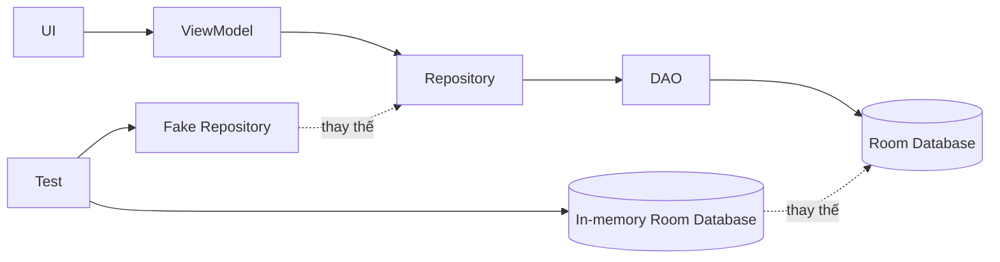

# 010 - Mock Database

**Học phần:** 05 - Quality, Release and Portfolio
**Module:** Module 11 - Testing
**Nhóm nội dung:** Unit Testing
**Nguồn roadmap:** Testing / Unit Testing
**Loại bài:** lesson
**Thứ tự trong module:** 010
**Thời lượng gợi ý:** 30 phút

---

## 1. Tóm tắt

`Mock Database` là kỹ thuật thay thế cơ sở dữ liệu production bằng một phiên bản được kiểm soát trong môi trường kiểm thử. Mục tiêu là giúp test logic liên quan đến lưu trữ dữ liệu, truy vấn, transaction, migration hoặc repository mà không phụ thuộc vào dữ liệu thật của người dùng hay trạng thái không ổn định của hệ thống bên ngoài.

Trong Android, khái niệm này đặc biệt hữu ích khi ứng dụng sử dụng `Room`, mô hình `Repository`, coroutine hoặc `Flow`. Một test tốt cần có trạng thái ban đầu xác định, chạy độc lập, tạo được kết quả lặp lại và không làm thay đổi database thật.

Sau bài học, người học có thể lựa chọn giữa fake database, in-memory database và mock dependency; xây dựng test cho tầng dữ liệu; đồng thời nhận biết những trường hợp mà mock quá mức có thể khiến test không phản ánh đúng hành vi thực tế.

---

## 2. Mục tiêu học tập

Sau khi hoàn thành bài học, người học có thể:

* Giải thích được mục đích của `Mock Database` trong kiểm thử ứng dụng Android.
* Phân biệt được mock, fake và in-memory database.
* Giải thích được vì sao test database cần tính cô lập và khả năng tái lập.
* Thiết kế test cho `DAO` hoặc `Repository` mà không sử dụng database production.
* Kiểm tra được các thao tác insert, update, delete và query.
* Nhận biết được các rủi ro liên quan đến threading, transaction, migration và `single source of truth`.
* Lựa chọn đúng loại test dựa trên mức độ trung thực cần thiết của tầng dữ liệu.

---

## 3. Vì sao cần Mock Database?

Một ứng dụng Android thường có luồng dữ liệu tương tự:

```text
UI
 ↓
ViewModel
 ↓
Repository
 ↓
DAO
 ↓
Database
```

Nếu unit test kết nối trực tiếp tới database production hoặc một database được dùng chung giữa nhiều test, kết quả có thể phụ thuộc vào:

* dữ liệu còn sót lại từ test trước;
* thứ tự chạy test;
* trạng thái thiết bị;
* transaction chưa hoàn tất;
* thay đổi schema;
* dữ liệu thật của người dùng;
* thao tác bất đồng bộ chưa hoàn thành.

Khi đó, cùng một test có thể lúc thành công, lúc thất bại dù source code không thay đổi. Đây là dạng kiểm thử không ổn định, thường được gọi là flaky test.

Một database dùng riêng cho test giúp tạo môi trường:

```text
Arrange
   ↓
Tạo trạng thái dữ liệu xác định
   ↓
Act
   ↓
Thực hiện thao tác cần kiểm thử
   ↓
Assert
   ↓
So sánh kết quả với kỳ vọng
   ↓
Dispose
   ↓
Hủy database test
```

Mỗi test bắt đầu từ trạng thái đã biết và không làm ảnh hưởng đến test khác.

---

## 4. Mock, Fake và In-Memory Database

Các thuật ngữ này thường được sử dụng gần nhau nhưng không hoàn toàn giống nhau.

| Kỹ thuật                | Đặc điểm                                             | Phù hợp khi                              |
| ----------------------- | ---------------------------------------------------- | ---------------------------------------- |
| Mock                    | Mô phỏng lời gọi và kết quả của dependency           | Kiểm tra interaction hoặc business logic |
| Fake                    | Implementation đơn giản nhưng hoạt động thật         | Test repository hoặc domain logic        |
| In-memory database      | Database thật nhưng dữ liệu chỉ tồn tại trong bộ nhớ | Kiểm tra query, DAO, transaction         |
| Test database trên file | Database thật được tạo riêng cho test                | Kiểm tra hành vi gần production hơn      |

Ví dụ, nếu mục tiêu chỉ là kiểm tra `ViewModel` gọi đúng phương thức của repository, không cần tạo database thật.

Ngược lại, nếu cần xác minh một câu query của `Room DAO`, mock `DAO` sẽ không kiểm chứng được SQL mà Room thực thi. Khi đó, in-memory database phù hợp hơn.

Nguyên tắc quan trọng là:

> Mock dependency ở tầng mà hành vi implementation không phải đối tượng cần kiểm thử.

---

## 5. Mock Database trong kiến trúc Android

Một kiến trúc phổ biến có thể được mô tả như sau:



Có hai chiến lược kiểm thử chính trong kiến trúc này:

* Với `ViewModel` hoặc business logic, có thể thay `Repository` thật bằng `FakeRepository`.
* Với tầng persistence, có thể giữ `DAO` thật nhưng thay database trên thiết bị bằng một `Room` database chạy trong memory.

Cách thứ hai có mức độ trung thực cao hơn vì Room vẫn thực thi mapping, query và transaction thực tế.

---

## 6. Kiểm thử Room bằng In-Memory Database

`Room` hỗ trợ tạo database chỉ tồn tại trong memory. Database này có thể được tạo khi test bắt đầu và đóng sau khi test kết thúc.

Ví dụ với một entity đơn giản:

```kotlin
@Entity(tableName = "users")
data class UserEntity(
    @PrimaryKey val id: Long,
    val name: String
)
```

DAO:

```kotlin
@Dao
interface UserDao {

    @Insert
    suspend fun insert(user: UserEntity)

    @Query("SELECT * FROM users WHERE id = :id")
    suspend fun findById(id: Long): UserEntity?

    @Query("DELETE FROM users")
    suspend fun deleteAll()
}
```

Database:

```kotlin
@Database(
    entities = [UserEntity::class],
    version = 1
)
abstract class AppDatabase : RoomDatabase() {
    abstract fun userDao(): UserDao
}
```

Trong test, database có thể được tạo bằng `Room.inMemoryDatabaseBuilder()`:

```kotlin
private lateinit var database: AppDatabase
private lateinit var userDao: UserDao

@Before
fun setup() {
    database = Room.inMemoryDatabaseBuilder(
        ApplicationProvider.getApplicationContext(),
        AppDatabase::class.java
    ).build()

    userDao = database.userDao()
}

@After
fun teardown() {
    database.close()
}
```

Ở đây, database production không được sử dụng. Mỗi lần test suite thiết lập database mới, dữ liệu bắt đầu từ trạng thái sạch.

---

## 7. Kiểm tra thao tác ghi và đọc dữ liệu

Một test cơ bản có thể xác minh rằng dữ liệu được insert và query đúng.

```kotlin
@Test
fun insertUser_thenFindById_returnsUser() = runTest {
    val user = UserEntity(
        id = 1,
        name = "An"
    )

    userDao.insert(user)

    val result = userDao.findById(1)

    assertEquals(user, result)
}
```

Test này kiểm tra cả hai hành vi:

1. `insert()` ghi đúng dữ liệu.
2. `findById()` trả đúng entity tương ứng.

Đây là điểm khác biệt quan trọng so với mock `UserDao`.

Nếu `UserDao` chỉ được mock để trả về một object đã định nghĩa trước, test không kiểm tra được:

* annotation `@Query`;
* mapping giữa table và entity;
* tên column;
* điều kiện `WHERE`;
* behavior thực tế của SQLite thông qua Room.

---

## 8. Fake Repository để test business logic

Không phải test nào cũng cần database thật.

Giả sử `ViewModel` chỉ cần repository cung cấp danh sách người dùng. Có thể tạo fake implementation:

```kotlin
interface UserRepository {
    suspend fun getUsers(): List<UserEntity>
}
```

Fake repository:

```kotlin
class FakeUserRepository : UserRepository {

    private val users = mutableListOf<UserEntity>()

    fun addUser(user: UserEntity) {
        users += user
    }

    override suspend fun getUsers(): List<UserEntity> {
        return users.toList()
    }
}
```

Trong test:

```kotlin
@Test
fun getUsers_returnsStoredUsers() = runTest {
    val repository = FakeUserRepository()

    repository.addUser(
        UserEntity(
            id = 1,
            name = "An"
        )
    )

    val result = repository.getUsers()

    assertEquals(1, result.size)
    assertEquals("An", result.first().name)
}
```

Fake repository giúp test business logic nhanh hơn vì không cần khởi tạo `Room`.

Tuy nhiên, nó không thay thế test DAO. Hai loại test bảo vệ hai lớp khác nhau của hệ thống.

---

## 9. Tính xác định của test

Một test tốt cần có tính deterministic: cùng source code và cùng điều kiện đầu vào phải tạo ra cùng kết quả.

Không nên để test phụ thuộc vào:

```text
Database từ test trước
        +
Network thật
        +
Clock hệ thống
        +
Dispatcher không kiểm soát
        +
Thread timing
        ↓
Kết quả không ổn định
```

Nên hướng tới:

```text
Database test riêng
       +
Fake dependency
       +
Test dispatcher
       +
Input cố định
       ↓
Kết quả tái lập
```

Đặc biệt với coroutine, test cần đảm bảo tất cả công việc bất đồng bộ cần thiết đã hoàn thành trước khi thực hiện assertion.

---

## 10. Mock Database và Single Source of Truth

Trong nhiều ứng dụng Android, local database đóng vai trò `single source of truth`.

Ví dụ:

```text
Backend API
    ↓
Repository
    ↓
Room Database
    ↓
Flow
    ↓
ViewModel
    ↓
UI
```

Network không nhất thiết cập nhật UI trực tiếp. Thay vào đó:

1. Repository lấy dữ liệu từ server.
2. Repository ghi dữ liệu vào Room.
3. Room phát dữ liệu mới thông qua `Flow`.
4. UI quan sát state và cập nhật giao diện.

Khi kiểm thử kiến trúc này, mock database không chỉ liên quan đến CRUD mà còn liên quan đến state transition.

Ví dụ cần kiểm tra:

```text
Database rỗng
   ↓
Sync thành công
   ↓
Database có dữ liệu
   ↓
Flow phát giá trị mới
   ↓
UI state được cập nhật
```

Đây là lý do database testing có liên hệ trực tiếp với state management và độ ổn định của UI.

---

## 11. Transaction và tính toàn vẹn dữ liệu

Các nghiệp vụ gồm nhiều thao tác database thường cần transaction.

Ví dụ:

```text
Xóa dữ liệu cũ
       ↓
Insert dữ liệu mới
       ↓
Cập nhật metadata
```

Nếu thao tác thứ hai thất bại nhưng thao tác đầu tiên đã được commit, ứng dụng có thể rơi vào trạng thái không nhất quán.

Một test tốt cần kiểm tra không chỉ trường hợp thành công mà còn cả failure path.

Các tình huống đáng kiểm thử gồm:

* transaction hoàn tất thành công;
* exception xảy ra giữa transaction;
* dữ liệu có được rollback hay không;
* hai thao tác đồng thời có gây trạng thái sai không;
* dữ liệu sau transaction có đáp ứng invariant của nghiệp vụ không.

Mock quá đơn giản thường không mô phỏng chính xác transaction behavior. Với trường hợp này, database test gần implementation thật sẽ có giá trị hơn.

---

## 12. Migration cũng cần được kiểm thử

Khi schema database thay đổi giữa các phiên bản, migration trở thành một phần quan trọng của chất lượng ứng dụng.

Ví dụ:

```text
Version 1
users(id, name)

        ↓ Migration

Version 2
users(id, name, email)
```

Nếu migration sai, ứng dụng có thể:

* crash khi khởi động;
* mất dữ liệu;
* tạo schema không đúng;
* đọc dữ liệu cũ thất bại.

Do đó, testing database không nên chỉ tập trung vào DAO. Với ứng dụng production sử dụng Room lâu dài, migration test cần được xem là một lớp bảo vệ riêng.

Mục tiêu của migration test là xác minh:

```text
Database phiên bản cũ
        ↓
Chạy migration
        ↓
Schema mới hợp lệ
        ↓
Dữ liệu cũ vẫn được bảo toàn
```

---

## 13. Lỗi thường gặp

**Hiện tượng:** Test thành công khi chạy riêng nhưng thất bại khi chạy cả suite.
**Nguyên nhân:** Các test chia sẻ database hoặc dữ liệu không được dọn sạch.
**Cách xử lý:** Tạo trạng thái test độc lập và đóng database sau mỗi test hoặc mỗi nhóm test phù hợp.

**Hiện tượng:** Test repository luôn thành công nhưng ứng dụng production lỗi SQL.
**Nguyên nhân:** DAO hoặc database đã bị mock hoàn toàn nên query thật chưa bao giờ được thực thi.
**Cách xử lý:** Thêm test bằng Room database thật hoặc in-memory database cho tầng persistence.

**Hiện tượng:** Assertion chạy trước khi dữ liệu được cập nhật.
**Nguyên nhân:** Coroutine, `Flow` hoặc transaction chưa hoàn tất.
**Cách xử lý:** Kiểm soát coroutine test environment và đợi đúng state trước khi assertion.

**Hiện tượng:** Test chỉ kiểm tra happy path.
**Nguyên nhân:** Test data luôn hợp lệ và không mô phỏng failure case.
**Cách xử lý:** Bổ sung dữ liệu biên, duplicate key, empty result, exception và transaction failure khi phù hợp.

**Hiện tượng:** Fake hoạt động khác production implementation.
**Nguyên nhân:** Fake đã trở nên quá đơn giản hoặc không được cập nhật khi contract thay đổi.
**Cách xử lý:** Giữ fake bám theo interface và bổ sung integration test ở boundary quan trọng.

---

## 14. Best practices

* Không sử dụng database production trong automated test.
* Mỗi test phải tự thiết lập dữ liệu cần thiết.
* Không để kết quả test phụ thuộc vào thứ tự chạy.
* Dùng fake cho business logic khi không cần kiểm tra persistence implementation.
* Dùng database thật hoặc in-memory database khi cần kiểm tra `Room DAO`, query và transaction.
* Test cả dữ liệu tồn tại và dữ liệu không tồn tại.
* Kiểm tra failure path chứ không chỉ happy path.
* Đóng database sau khi test hoàn tất.
* Không mock quá sâu đến mức test chỉ kiểm tra chính mock configuration.
* Xem migration là một phần của database quality nếu ứng dụng có schema được nâng cấp theo phiên bản.

Một nguyên tắc hữu ích là:

> Fake ở nơi cần tốc độ, dùng implementation thật ở nơi correctness của implementation chính là điều cần kiểm tra.

---

## 15. Bài thực hành

Xây dựng một automated test nhỏ cho tầng dữ liệu của ứng dụng Android sử dụng `Room`.

Yêu cầu:

1. Tạo một in-memory database dành riêng cho test.
2. Lấy một `DAO` từ database đó.
3. Insert ít nhất một entity.
4. Query entity vừa insert và kiểm tra giá trị.
5. Kiểm tra trường hợp query một ID không tồn tại.
6. Đóng database sau khi test hoàn tất.

**Kết quả mong đợi:**

* Test chạy lặp lại mà không phụ thuộc dữ liệu cũ.
* Database production không bị thay đổi.
* Trường hợp dữ liệu tồn tại trả về đúng entity.
* Trường hợp dữ liệu không tồn tại trả về kết quả đúng với contract của DAO.
* Kết quả test đủ rõ để xác định lỗi nằm ở query hoặc persistence layer nếu assertion thất bại.

**Artifact có thể đưa vào portfolio:**

* test class cho `Room DAO`;
* ảnh hoặc log kết quả test thành công;
* README ngắn mô tả điều test đang bảo vệ;
* ví dụ một failure case và nguyên nhân của nó.

---

## 16. Câu hỏi tự kiểm tra

1. Vì sao mock hoàn toàn một `DAO` không đủ để xác minh câu `@Query` của Room?
2. Khi nào nên dùng `FakeRepository` thay vì in-memory database?
3. Một test database phụ thuộc dữ liệu được tạo từ test trước có vấn đề gì?
4. Vì sao transaction failure cần được kiểm thử?
5. Nếu database là `single source of truth`, thay đổi dữ liệu có thể tác động đến UI state theo luồng nào?

---

## 17. Checklist hoàn thành

* [ ] Giải thích được mục đích của `Mock Database`.
* [ ] Phân biệt được mock, fake và in-memory database.
* [ ] Biết khi nào nên mock repository và khi nào nên dùng Room thật.
* [ ] Viết được test cho thao tác insert và query.
* [ ] Kiểm tra được trường hợp dữ liệu không tồn tại.
* [ ] Giữ được test độc lập và deterministic.
* [ ] Nhận biết được ảnh hưởng của coroutine và threading tới database test.
* [ ] Giải thích được vai trò của transaction và migration trong chất lượng tầng dữ liệu.
* [ ] Có ít nhất một automated database test hoặc artifact tương đương để đưa vào portfolio.

---

## 18. Tổng kết

`Mock Database` không đơn thuần là tạo một database giả. Bản chất của kỹ thuật này là cô lập tầng dữ liệu để kiểm thử có thể chạy an toàn, lặp lại và có kết quả xác định.

Trong Android, nên lựa chọn công cụ theo đúng mục tiêu kiểm thử: fake repository phù hợp với business logic, trong khi in-memory `Room` database phù hợp với DAO, query và persistence behavior. Với hệ thống thực tế, transaction, concurrency, migration và mô hình `single source of truth` cũng cần được xem xét vì lỗi ở tầng database có thể lan trực tiếp tới state, UI và dữ liệu của người dùng.

Một chiến lược kiểm thử tốt không cố mock mọi thứ. Nó sử dụng mức mô phỏng vừa đủ để test nhanh, đồng thời giữ implementation thật ở những boundary mà correctness cần được xác minh.
