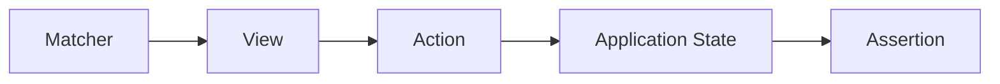

# 011 - Espresso

**Học phần:** 05 - Quality, Release and Portfolio
**Module:** Module 11 - Testing
**Nhóm nội dung:** UI Testing
**Nguồn roadmap:** Testing / UI Testing
**Loại bài:** lesson
**Thứ tự trong module:** 011
**Thời lượng gợi ý:** 30 phút

---

## 1. Tóm tắt

`Espresso` là framework UI testing thuộc hệ sinh thái AndroidX Test, được thiết kế để kiểm thử giao diện Android bằng cách tìm `View`, thực hiện hành động giống người dùng và xác minh trạng thái giao diện.

Một Espresso test thường đi theo chu trình:

```text
Tìm View
   ↓
Thực hiện hành động
   ↓
Ứng dụng xử lý
   ↓
Kiểm tra kết quả trên UI
```

Ví dụ, với luồng đăng nhập:

```text
Nhập email
   ↓
Nhập mật khẩu
   ↓
Nhấn Login
   ↓
Ứng dụng xử lý
   ↓
Kiểm tra màn hình Home hoặc thông báo lỗi
```

Espresso phù hợp nhất với các luồng UI quan trọng như đăng nhập, kiểm tra form, tạo dữ liệu, chỉnh sửa và xóa dữ liệu. UI test không nên bao phủ mọi chi tiết của ứng dụng vì chúng thường chạy chậm và dễ bị ảnh hưởng bởi môi trường hơn unit test.

Với giao diện dựa trên Android `View`, Espresso là công cụ kiểm thử UI quan trọng. Với giao diện Jetpack Compose, nên sử dụng Compose Testing API cho các `Composable`; Espresso vẫn hữu ích trong ứng dụng hybrid chứa cả `View` và Compose.

## 2. Mục tiêu học tập

Sau bài học, người học có thể:

* Giải thích được vai trò của `Espresso` trong chiến lược kiểm thử Android.
* Phân biệt UI test với unit test.
* Mô tả được mô hình `Matcher → Action → Assertion` của Espresso.
* Viết được một Espresso test cơ bản với `onView()`.
* Sử dụng `ViewMatcher`, `ViewAction` và `ViewAssertion`.
* Giải thích được vì sao không nên dùng `Thread.sleep()` để chờ UI.
* Nhận biết được trường hợp cần `IdlingResource`.
* Lựa chọn các user flow phù hợp để bảo vệ bằng UI test.
* Tạo được một Espresso test làm artifact cho portfolio Android.

## 3. Espresso giải quyết vấn đề gì?

Unit test rất hiệu quả khi kiểm tra logic:

```text
Function
Repository
UseCase
ViewModel
Validator
```

Nhưng một ứng dụng có thể có logic đúng mà user flow thực tế vẫn bị lỗi.

Ví dụ:

```text
LoginValidator hoạt động đúng
        ↓
ViewModel trả đúng state
        ↓
Nhưng nút Login không gọi ViewModel
        ↓
Người dùng vẫn không đăng nhập được
```

UI test kiểm tra ứng dụng ở một lớp gần với trải nghiệm của người dùng hơn.

Espresso cho phép tự động hóa các hành động như:

* tìm một `View`;
* nhập text;
* nhấn button;
* scroll;
* chọn item;
* kiểm tra text;
* kiểm tra trạng thái hiển thị;
* xác minh một user flow.

Một Espresso test không chỉ hỏi:

> Hàm xử lý có trả đúng kết quả không?

Mà thường hỏi:

> Khi người dùng thực hiện hành động này trên UI, ứng dụng có hiển thị đúng kết quả hay không?

## 4. Vị trí của Espresso trong chiến lược testing

Một Android project thường có nhiều lớp kiểm thử.

| Loại test        | Mục tiêu chính                        | Tốc độ tương đối |
| ---------------- | ------------------------------------- | ---------------- |
| Unit test        | Logic nhỏ, độc lập                    | Nhanh            |
| Integration test | Tương tác giữa nhiều thành phần       | Trung bình       |
| UI test          | Luồng giao diện và hành vi người dùng | Chậm hơn         |

Không nên dùng Espresso để thay thế unit test.

Ví dụ, với validation email:

```text
EmailValidator
      ↓
Unit test
```

Trong khi:

```text
User nhập email sai
        ↓
Nhấn Login
        ↓
UI hiển thị lỗi
        ↓
Espresso UI test
```

Một chiến lược tốt thường có nhiều unit test và chỉ một số UI test tập trung vào các luồng quan trọng.

Ví dụ các flow đáng được bảo vệ:

* đăng nhập;
* đăng ký;
* validation form;
* tạo item;
* chỉnh sửa item;
* xóa item;
* checkout;
* navigation quan trọng;
* flow liên quan trực tiếp đến dữ liệu người dùng.

## 5. Mô hình Matcher → Action → Assertion

Espresso xoay quanh ba thành phần chính:



`Matcher` tìm đúng `View` cần tương tác.

`Action` mô phỏng hành động của người dùng.

`Assertion` kiểm tra kết quả sau hành động.

Cấu trúc phổ biến nhất là:

```kotlin
onView(matcher)
    .perform(action)
    .check(assertion)
```

Ví dụ:

```kotlin
onView(withId(R.id.loginButton))
    .perform(click())
```

Ở đây:

* `onView()` bắt đầu một tương tác với UI;
* `withId()` tìm `View` có ID phù hợp;
* `perform()` thực hiện hành động;
* `click()` mô phỏng thao tác nhấn.

Để kiểm tra kết quả:

```kotlin
onView(withText("Login successful"))
    .check(matches(isDisplayed()))
```

Espresso cung cấp `onView()` như một entry point chính để tương tác với Android `View`.

## 6. Viết Espresso test cơ bản

Espresso test thường nằm trong:

```text
app/
└── src/
    └── androidTest/
```

Đây là instrumented test, nghĩa là test chạy trên thiết bị Android hoặc emulator.

Project cần cấu hình Android test runner và dependency AndroidX Test/Espresso phù hợp với version catalog hoặc phiên bản AndroidX Test mà project đang sử dụng.

Một test đơn giản có thể kiểm tra validation của màn hình đăng nhập.

```kotlin
@RunWith(AndroidJUnit4::class)
class LoginScreenTest {

    @get:Rule
    val activityRule = ActivityScenarioRule(LoginActivity::class.java)

    @Test
    fun invalidEmail_showsValidationMessage() {
        onView(withId(R.id.emailInput))
            .perform(
                typeText("invalid-email"),
                closeSoftKeyboard()
            )

        onView(withId(R.id.loginButton))
            .perform(click())

        onView(withText(R.string.invalid_email))
            .check(matches(isDisplayed()))
    }
}
```

Luồng test là:

```text
Khởi động LoginActivity
        ↓
Tìm ô email
        ↓
Nhập email không hợp lệ
        ↓
Nhấn Login
        ↓
Tìm thông báo lỗi
        ↓
Xác nhận thông báo đang hiển thị
```

Điểm quan trọng là test kiểm tra hành vi quan sát được từ UI thay vì gọi trực tiếp logic nội bộ của màn hình.

## 7. Matcher, Action và Assertion thường dùng

Espresso cung cấp nhiều matcher để xác định `View`.

Ví dụ theo ID:

```kotlin
onView(withId(R.id.usernameInput))
```

Theo text:

```kotlin
onView(withText("Login"))
```

Theo content description:

```kotlin
onView(withContentDescription("Open settings"))
```

Các action phổ biến gồm:

```kotlin
click()
typeText("hello@example.com")
replaceText("new value")
clearText()
scrollTo()
closeSoftKeyboard()
```

Ví dụ nhập dữ liệu:

```kotlin
onView(withId(R.id.emailInput))
    .perform(replaceText("user@example.com"))

onView(withId(R.id.passwordInput))
    .perform(replaceText("password123"))
```

Các assertion thường dùng:

```kotlin
matches(isDisplayed())
matches(withText("Welcome"))
matches(isEnabled())
matches(isChecked())
```

Ví dụ:

```kotlin
onView(withId(R.id.errorMessage))
    .check(matches(isDisplayed()))
```

Hoặc:

```kotlin
onView(withId(R.id.usernameText))
    .check(matches(withText("An Khanh")))
```

Nếu matcher không xác định được duy nhất một `View`, test có thể thất bại vì nhiều phần tử cùng khớp điều kiện. Espresso có các exception riêng cho trường hợp không tìm thấy hoặc matcher khớp nhiều `View`.

## 8. Đồng bộ và IdlingResource

Một trong những vấn đề khó của UI testing là asynchronous work.

Ví dụ:

```text
User nhấn Login
      ↓
Network request bắt đầu
      ↓
Response chưa về
      ↓
Test kiểm tra HomeScreen quá sớm
      ↓
Test thất bại
```

Cách xử lý không tốt là:

```kotlin
Thread.sleep(3000)
```

Cách này gây nhiều vấn đề:

* nếu request chỉ cần 500 ms thì test lãng phí thời gian;
* nếu request cần hơn 3 giây thì test vẫn thất bại;
* tốc độ emulator và CI khác nhau;
* test trở nên flaky.

Espresso có cơ chế synchronization và chờ UI đạt trạng thái idle trước khi thực hiện các tương tác phù hợp. Với các tác vụ asynchronous mà Espresso không tự nhận biết, có thể đăng ký `IdlingResource`.

Luồng hoạt động có thể hình dung như sau:

```text
Test thực hiện action
        ↓
Ứng dụng bắt đầu async work
        ↓
IdlingResource = busy
        ↓
Espresso chờ
        ↓
Async work kết thúc
        ↓
IdlingResource = idle
        ↓
Espresso tiếp tục assertion
```

Một implementation thường gặp là `CountingIdlingResource`.

Về bản chất:

```text
Bắt đầu async operation
        ↓
increment()
        ↓
Resource đang busy
        ↓
Async operation hoàn thành
        ↓
decrement()
        ↓
Counter = 0
        ↓
Resource trở về idle
```

AndroidX cũng cung cấp `IdlingRegistry` để đăng ký các `IdlingResource` mà Espresso cần theo dõi.

Tuy nhiên, không phải mọi test network đều cần kết nối thật tới server. Với test quan trọng, dữ liệu giả hoặc fake backend thường giúp test ổn định và dễ tái tạo hơn.

## 9. Thiết kế Espresso test ổn định

Một Espresso test tốt nên kiểm tra hành vi thay vì phụ thuộc quá nhiều vào chi tiết implementation.

Ví dụ, thay vì cố xác minh:

```text
Repository method A được gọi
→ biến B đổi giá trị
→ callback C chạy
```

UI test nên quan sát:

```text
User thực hiện action
        ↓
UI hiển thị kết quả mong đợi
```

Tên test nên mô tả điều kiện và kết quả.

Ví dụ:

```kotlin
fun emptyEmail_showsRequiredError()
```

```kotlin
fun validCredentials_opensHomeScreen()
```

```kotlin
fun deleteItem_removesItemFromList()
```

```kotlin
fun networkFailure_showsRetryAction()
```

Các nguyên tắc quan trọng:

* tập trung vào critical user flow;
* tránh `Thread.sleep()`;
* tránh phụ thuộc vào dữ liệu production;
* chuẩn bị trạng thái đầu vào rõ ràng;
* mỗi test nên có thể chạy độc lập;
* không phụ thuộc vào thứ tự chạy của test khác;
* sử dụng matcher đủ ổn định;
* ưu tiên ID hoặc thuộc tính UI có ý nghĩa;
* assertion nên kiểm tra hành vi quan trọng;
* tránh tạo UI test cho logic có thể kiểm tra bằng unit test.

## 10. Espresso với View và Jetpack Compose

Espresso được thiết kế chủ yếu cho giao diện Android dựa trên `View`.

Ví dụ:

```text
TextView
Button
EditText
RecyclerView
ConstraintLayout
```

Với Jetpack Compose, UI được kiểm thử bằng Compose Testing API dựa trên semantics tree.

Ví dụ Compose:

```kotlin
composeTestRule
    .onNodeWithText("Login")
    .performClick()
```

Trong ứng dụng hybrid:

```text
Activity
├── Android Views
└── ComposeView
    └── Composables
```

có thể kết hợp cả hai:

```text
Android View
     ↓
Espresso
```

và:

```text
Composable
     ↓
Compose Testing API
```

Android hỗ trợ interoperability giữa hai hệ thống, vì vậy một test có thể tương tác với `View` bằng Espresso và `Composable` bằng Compose test API trong cùng một luồng.

Điều này đặc biệt hữu ích khi một ứng dụng đang dần migrate từ XML/View sang Jetpack Compose.

## 11. Những lỗi thường gặp

**Hiện tượng:** Espresso không tìm thấy `View`.

**Nguyên nhân có thể:**

* màn hình chưa được mở;
* ID không đúng;
* phần tử chưa hiển thị;
* matcher đang tìm sai `View`.

**Cách xử lý:**

* kiểm tra state trước action;
* kiểm tra navigation;
* xác minh ID;
* kiểm tra matcher.

---

**Hiện tượng:** Test chạy được lúc này nhưng thất bại lúc khác.

**Nguyên nhân có thể:**

* sử dụng `Thread.sleep()`;
* phụ thuộc network thật;
* animation hoặc async task chưa hoàn thành;
* dữ liệu test không ổn định;
* test phụ thuộc test khác.

**Cách xử lý:**

* sử dụng synchronization phù hợp;
* cân nhắc `IdlingResource`;
* fake các dependency không cần thiết;
* reset trạng thái trước mỗi test.

---

**Hiện tượng:** `withText()` khớp nhiều phần tử.

**Nguyên nhân:**

Nhiều `View` có cùng text.

**Cách xử lý:**

Kết hợp matcher để xác định phần tử chính xác hơn.

```kotlin
onView(
    allOf(
        withId(R.id.title),
        withText("Settings")
    )
)
```

---

**Hiện tượng:** Test chỉ chạy được trên máy developer.

**Nguyên nhân có thể:**

* phụ thuộc dữ liệu local;
* phụ thuộc server;
* phụ thuộc tốc độ thiết bị;
* phụ thuộc locale;
* phụ thuộc animation hoặc cấu hình thiết bị.

**Cách xử lý:**

Thiết kế môi trường test có trạng thái xác định và có thể tái tạo.

## 12. Espresso trong production workflow

Không nên đánh giá giá trị của Espresso bằng số lượng UI test.

Một test bảo vệ đúng critical flow thường có giá trị hơn nhiều test nhỏ và dễ vỡ.

Ví dụ với một ứng dụng Todo:

```text
Critical Flow 1
Mở app
→ Tạo task
→ Task xuất hiện
```

```text
Critical Flow 2
Chọn task
→ Đánh dấu hoàn thành
→ UI cập nhật
```

```text
Critical Flow 3
Xóa task
→ Xác nhận
→ Task biến mất
```

Những flow này có thể chạy trước release để phát hiện regression.

Khi thiết kế UI test cho production, cần đặt các câu hỏi:

* User flow nào gây ảnh hưởng lớn nếu bị lỗi?
* State nào phải được giữ khi Activity được recreate?
* Network failure được hiển thị như thế nào?
* Dữ liệu test có thể reset hay không?
* Test có chạy ổn định trên emulator trong CI không?
* Flow nào đã được unit test và không cần lặp lại bằng UI test?
* Test nào cần trở thành release gate?

Espresso vì vậy không chỉ là công cụ dành cho thư mục `androidTest`; nó là một phần của chiến lược giảm release risk.

## 13. Bài thực hành

Xây dựng một Espresso test cho form đăng nhập.

Ứng dụng cần có:

* ô nhập email;
* ô nhập password;
* nút `Login`;
* validation cho email không hợp lệ.

Test cần thực hiện flow:

```text
Mở LoginScreen
      ↓
Nhập email không hợp lệ
      ↓
Nhập password
      ↓
Nhấn Login
      ↓
Kiểm tra thông báo validation
```

Một cấu trúc test tham khảo:

```kotlin
@Test
fun invalidEmail_showsErrorMessage() {
    onView(withId(R.id.emailInput))
        .perform(replaceText("abc"))

    onView(withId(R.id.passwordInput))
        .perform(replaceText("123456"))

    onView(withId(R.id.loginButton))
        .perform(click())

    onView(withText(R.string.invalid_email))
        .check(matches(isDisplayed()))
}
```

Sau khi hoàn thành, tạo thêm một test cho trường hợp:

```text
Email hợp lệ
+
Password hợp lệ
      ↓
Login
      ↓
HomeScreen xuất hiện
```

Không cần kết nối backend thật nếu mục tiêu của bài chỉ là kiểm tra UI flow. Có thể dùng fake data hoặc fake authentication layer để tạo trạng thái xác định.

**Artifact portfolio:**

```text
androidTest/
└── LoginScreenTest.kt
```

Kèm theo:

* screenshot test chạy thành công;
* screenshot một test thất bại có chủ đích;
* README ngắn mô tả flow được bảo vệ;
* ghi chú lỗi mà Espresso test có khả năng phát hiện.

## 14. Checklist hoàn thành

* [ ] Giải thích được Espresso dùng để làm gì.
* [ ] Phân biệt được UI test và unit test.
* [ ] Giải thích được `Matcher → Action → Assertion`.
* [ ] Sử dụng được `onView()`.
* [ ] Sử dụng được `withId()` hoặc `withText()`.
* [ ] Thực hiện được `click()` hoặc nhập text.
* [ ] Kiểm tra được UI bằng `check(matches(...))`.
* [ ] Giải thích được vì sao không nên dùng `Thread.sleep()` để đồng bộ test.
* [ ] Biết khi nào cần cân nhắc `IdlingResource`.
* [ ] Phân biệt được Espresso testing cho `View` và Compose Testing API.
* [ ] Viết được ít nhất một Espresso test cho critical user flow.
* [ ] Lưu được test và kết quả chạy làm artifact cho portfolio.

## 15. Câu hỏi tự kiểm tra

1. Vì sao không nên chuyển toàn bộ unit test thành Espresso UI test?
2. Trong biểu thức `onView(withId(...)).perform(click())`, matcher và action nằm ở đâu?
3. Vì sao `Thread.sleep()` dễ làm UI test trở nên flaky?
4. Khi một background operation không được Espresso tự động nhận biết, cơ chế nào có thể giúp Espresso chờ đúng thời điểm?
5. Nếu ứng dụng sử dụng hoàn toàn Jetpack Compose, API kiểm thử UI nào nên được ưu tiên thay vì viết mọi test bằng Espresso?

## 16. Tổng kết

`Espresso` giúp kiểm thử hành vi của giao diện Android từ góc nhìn gần với người dùng thông qua ba bước chính:

```text
Matcher
   ↓
Action
   ↓
Assertion
```

Espresso đặc biệt hữu ích để bảo vệ các critical user flow như login, validation, create, edit và delete.

Một chiến lược testing hiệu quả không cố kiểm tra mọi thứ bằng UI test. Logic nên được bảo vệ chủ yếu bằng unit test, trong khi Espresso tập trung vào các luồng giao diện có giá trị cao.

Để Espresso test ổn định:

* không dựa vào `Thread.sleep()`;
* kiểm soát asynchronous work;
* sử dụng `IdlingResource` khi cần;
* giữ dữ liệu test có thể tái tạo;
* tránh dependency production không cần thiết;
* tập trung assertion vào hành vi người dùng thực sự quan tâm.

Trong dự án dùng Android `View`, Espresso là công cụ UI testing quan trọng. Trong dự án Jetpack Compose, Compose Testing API là lựa chọn chính cho `Composable`, còn Espresso vẫn có giá trị trong các màn hình View hoặc ứng dụng hybrid.
