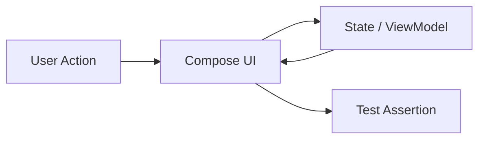
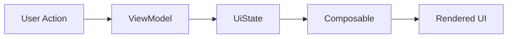
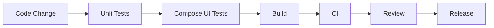

# 012 - Compose UI Test

**Học phần:** 05 - Quality, Release and Portfolio
**Module:** Module 11 - Testing
**Nhóm nội dung:** UI Testing
**Nguồn roadmap:** Testing / UI Testing
**Loại bài:** lesson
**Thứ tự trong module:** 012
**Thời lượng gợi ý:** 30 phút

---

## 1. Tóm tắt

`Compose UI Test` là hệ thống API kiểm thử giao diện dành cho ứng dụng Android sử dụng Jetpack Compose. Thay vì kiểm tra trực tiếp các `View` như giao diện Android truyền thống, Compose UI Test tương tác với **semantics tree** — cấu trúc mô tả ý nghĩa và trạng thái của các phần tử giao diện.

Một bài UI test thường thực hiện ba việc chính:

1. Tìm một phần tử trên màn hình.
2. Thực hiện hành động của người dùng.
3. Kiểm tra trạng thái giao diện sau hành động.

Ví dụ:

```text
Mở màn hình
    ↓
Tìm nút "Đăng nhập"
    ↓
Nhấn nút
    ↓
State thay đổi
    ↓
Compose recompose
    ↓
Kiểm tra thông báo mới
```

Compose cung cấp các API cho việc tìm node, thực hiện hành động và assertion, đồng thời tự đồng bộ với trạng thái idle của UI để giúp test ổn định hơn.

UI test đặc biệt quan trọng đối với các luồng người dùng như đăng nhập, nhập biểu mẫu, chuyển màn hình, hiển thị loading/error, cập nhật state và các tương tác có ảnh hưởng trực tiếp đến trải nghiệm người dùng.

---

## 2. Mục tiêu học tập

Sau khi hoàn thành bài này, người học có thể:

* Giải thích được vai trò của `Compose UI Test` trong chiến lược kiểm thử ứng dụng Android.
* Phân biệt được UI test với unit test và kiểm thử logic thuần Kotlin.
* Giải thích được vai trò của **semantics tree** trong Jetpack Compose.
* Cấu hình được dependency cần thiết cho Compose UI Test.
* Sử dụng được `ComposeTestRule` để khởi tạo giao diện cần kiểm thử.
* Tìm được UI node bằng text, content description hoặc test tag.
* Thực hiện được các hành động như click và nhập text.
* Sử dụng assertion để xác minh trạng thái giao diện.
* Kiểm thử được sự thay đổi UI khi state thay đổi.
* Debug được trường hợp test không tìm thấy node.
* Nhận biết được các nguyên nhân phổ biến gây flaky UI test.
* Tạo được một automated UI test có thể đưa vào quy trình quality check của dự án.

---

## 3. Compose UI Test giải quyết vấn đề gì?

Một ứng dụng có thể có unit test đầy đủ nhưng giao diện vẫn hoạt động sai.

Giả sử logic đăng nhập đã được kiểm thử:

```text
Email hợp lệ
Password hợp lệ
       ↓
LoginUseCase
       ↓
Success
```

Unit test có thể xác nhận rằng `LoginUseCase` trả về `Success`.

Nhưng nó chưa chứng minh rằng:

* nút đăng nhập thực sự gọi đúng callback;
* loading indicator được hiển thị;
* lỗi được hiển thị đúng;
* state mới thực sự cập nhật UI;
* nút bị disable khi đang gửi request;
* thông báo thành công xuất hiện;
* người dùng có thể tương tác với màn hình như thiết kế.

Đây là khoảng trống mà UI test cần kiểm tra.



UI test quan sát ứng dụng từ góc nhìn gần với người dùng hơn: thực hiện hành động trên giao diện và xác minh kết quả có thể quan sát được.

Một chiến lược kiểm thử tốt thường kết hợp nhiều lớp:

| Loại test       | Mục đích chính                                  |
| --------------- | ----------------------------------------------- |
| Unit test       | Kiểm tra logic nhỏ, độc lập                     |
| ViewModel test  | Kiểm tra state và business flow                 |
| Repository test | Kiểm tra data flow                              |
| Compose UI test | Kiểm tra giao diện và tương tác                 |
| End-to-end test | Kiểm tra luồng hoàn chỉnh giữa nhiều thành phần |

Không nên sử dụng UI test để thay thế mọi unit test. UI test thường chậm và phức tạp hơn, vì vậy nên tập trung vào những hành vi giao diện quan trọng.

---

## 4. Semantics Tree trong Compose

Compose UI Test không chủ yếu tìm kiếm composable dựa trên tên hàm Kotlin.

Ví dụ:

```kotlin
Button(
    onClick = onLogin
) {
    Text("Đăng nhập")
}
```

Test không tìm:

```text
Button()
Text()
```

theo cách nhìn source code.

Thay vào đó, Compose xây dựng một **semantics tree** chứa thông tin mô tả ý nghĩa và hành vi của giao diện.

Semantics có thể chứa:

* text;
* content description;
* trạng thái enabled/disabled;
* click action;
* selected state;
* toggle state;
* test tag;
* accessibility information.

Compose UI Test sử dụng chính thông tin semantics này để xác định và tương tác với UI. Semantics cũng là nền tảng quan trọng cho accessibility trong Compose.

Ví dụ một giao diện:

```text
Column
├── Text("Đăng nhập")
├── TextField
└── Button
    └── Text("Tiếp tục")
```

Semantics tree mà test nhìn thấy có thể không hoàn toàn giống cây composable, bởi một số semantics node có thể được **merge** với node con.

Đây là lý do một composable tồn tại trên màn hình nhưng test đôi khi không tìm thấy node theo cách developer dự đoán.

---

## 5. Cấu hình Compose UI Test

Các UI test chạy trên Android thường được đặt tại:

```text
app/
└── src/
    └── androidTest/
        └── java/
            └── ...
```

Compose cung cấp dependency `ui-test-junit4` cho test rule và các API kiểm thử UI. `ui-test-manifest` được dùng trong một số cấu hình test cần manifest hỗ trợ. Tài liệu Android hiện tại cũng khuyến nghị quản lý các thư viện Compose thông qua Compose BOM thay vì tự gắn version riêng cho từng dependency.

Ví dụ với `build.gradle.kts`:

```kotlin
dependencies {
    val composeBom = platform("androidx.compose:compose-bom:<bom-version>")

    implementation(composeBom)
    androidTestImplementation(composeBom)

    androidTestImplementation("androidx.compose.ui:ui-test-junit4")
    debugImplementation("androidx.compose.ui:ui-test-manifest")
}
```

Không nên hard-code một version ngẫu nhiên trong tài liệu hoặc dự án nếu project đã quản lý Compose bằng version catalog hoặc BOM.

Sau khi dependency được cấu hình, test có thể sử dụng:

```kotlin
createComposeRule()
```

hoặc:

```kotlin
createAndroidComposeRule<MainActivity>()
```

`createComposeRule()` phù hợp khi muốn kiểm thử một composable hoặc screen tương đối độc lập.

`createAndroidComposeRule<MainActivity>()` hữu ích khi test cần truy cập `Activity` hoặc chạy giao diện trong activity thực tế.

---

## 6. Cấu trúc cơ bản của một Compose UI Test

Một Compose UI Test thường theo mô hình:

```text
Arrange
   ↓
Act
   ↓
Assert
```

### 6.1. Arrange

Chuẩn bị giao diện và state ban đầu.

```kotlin
composeTestRule.setContent {
    LoginScreen(
        isLoading = false,
        onLoginClick = {}
    )
}
```

### 6.2. Act

Mô phỏng hành động của người dùng.

```kotlin
composeTestRule
    .onNodeWithText("Đăng nhập")
    .performClick()
```

### 6.3. Assert

Kiểm tra kết quả.

```kotlin
composeTestRule
    .onNodeWithText("Đang xử lý")
    .assertExists()
```

Cấu trúc này giúp test dễ đọc:

```text
Given → trạng thái ban đầu
When  → người dùng thực hiện hành động
Then  → giao diện phải đạt trạng thái mong đợi
```

---

## 7. Finders, Actions và Assertions

API Compose UI Test có thể chia thành ba nhóm quan trọng: **Finders**, **Actions** và **Assertions**.

### 7.1. Finders

Finder xác định node cần kiểm tra hoặc tương tác.

Ví dụ tìm bằng text:

```kotlin
composeTestRule.onNodeWithText("Đăng nhập")
```

Tìm bằng content description:

```kotlin
composeTestRule.onNodeWithContentDescription("Quay lại")
```

Tìm bằng test tag:

```kotlin
composeTestRule.onNodeWithTag("login_button")
```

Có thể tìm nhiều node:

```kotlin
composeTestRule.onAllNodesWithText("Sản phẩm")
```

Compose cũng cung cấp các matcher tổng quát thông qua `SemanticsMatcher`, vì vậy developer có thể tạo điều kiện tìm node phức tạp hơn khi cần.

### 7.2. Actions

Actions mô phỏng hành vi người dùng.

Click:

```kotlin
composeTestRule
    .onNodeWithText("Đăng nhập")
    .performClick()
```

Nhập text:

```kotlin
composeTestRule
    .onNodeWithTag("email_field")
    .performTextInput("student@example.com")
```

Xóa nội dung:

```kotlin
composeTestRule
    .onNodeWithTag("email_field")
    .performTextClearance()
```

Các API kiểm thử có thể mô phỏng nhiều loại interaction khác ngoài click và nhập text, bao gồm gesture khi test yêu cầu.

### 7.3. Assertions

Assertion xác minh UI đang ở trạng thái mong đợi.

Kiểm tra node tồn tại:

```kotlin
composeTestRule
    .onNodeWithText("Đăng nhập thành công")
    .assertExists()
```

Kiểm tra node được hiển thị:

```kotlin
composeTestRule
    .onNodeWithText("Trang chủ")
    .assertIsDisplayed()
```

Kiểm tra button được enable:

```kotlin
composeTestRule
    .onNodeWithTag("login_button")
    .assertIsEnabled()
```

Kiểm tra button bị disable:

```kotlin
composeTestRule
    .onNodeWithTag("login_button")
    .assertIsNotEnabled()
```

Một test tốt thường kiểm tra **hành vi có ý nghĩa với người dùng** thay vì quá phụ thuộc vào chi tiết implementation.

---

## 8. Kiểm thử một Composable độc lập

Xét một màn hình đơn giản:

```kotlin
@Composable
fun CounterScreen() {
    var count by remember { mutableIntStateOf(0) }

    Column {
        Text(
            text = "Số lần: $count",
            modifier = Modifier.testTag("counter_text")
        )

        Button(
            onClick = { count++ },
            modifier = Modifier.testTag("increase_button")
        ) {
            Text("Tăng")
        }
    }
}
```

Có thể kiểm thử bằng:

```kotlin
class CounterScreenTest {

    @get:Rule
    val composeTestRule = createComposeRule()

    @Test
    fun clickIncrease_updatesCounter() {
        composeTestRule.setContent {
            CounterScreen()
        }

        composeTestRule
            .onNodeWithTag("counter_text")
            .assertTextEquals("Số lần: 0")

        composeTestRule
            .onNodeWithTag("increase_button")
            .performClick()

        composeTestRule
            .onNodeWithTag("counter_text")
            .assertTextEquals("Số lần: 1")
    }
}
```

Test này xác minh toàn bộ chuỗi:

```text
State ban đầu = 0
       ↓
UI hiển thị "Số lần: 0"
       ↓
Test nhấn nút
       ↓
count = 1
       ↓
Compose recompose
       ↓
UI hiển thị "Số lần: 1"
       ↓
Assertion pass
```

Điểm quan trọng ở đây không phải kiểm tra trực tiếp biến `count`.

Test quan sát **kết quả cuối cùng trên UI**, giống cách người dùng nhìn thấy ứng dụng.

---

## 9. State và Compose UI Test

Jetpack Compose là UI framework dựa mạnh vào state.

Mô hình phổ biến:



UI test có thể kiểm tra ở ranh giới cuối:

```text
UiState
   ↓
Composable
   ↓
UI observable
```

Ví dụ:

```kotlin
data class LoginUiState(
    val isLoading: Boolean = false,
    val errorMessage: String? = null
)
```

Composable:

```kotlin
@Composable
fun LoginScreen(
    uiState: LoginUiState,
    onLoginClick: () -> Unit
) {
    Column {
        Button(
            onClick = onLoginClick,
            enabled = !uiState.isLoading,
            modifier = Modifier.testTag("login_button")
        ) {
            Text("Đăng nhập")
        }

        if (uiState.isLoading) {
            CircularProgressIndicator(
                modifier = Modifier.testTag("loading")
            )
        }

        uiState.errorMessage?.let { message ->
            Text(
                text = message,
                modifier = Modifier.testTag("error_message")
            )
        }
    }
}
```

Test trạng thái loading:

```kotlin
@Test
fun loadingState_disablesButtonAndShowsProgress() {
    composeTestRule.setContent {
        LoginScreen(
            uiState = LoginUiState(isLoading = true),
            onLoginClick = {}
        )
    }

    composeTestRule
        .onNodeWithTag("login_button")
        .assertIsNotEnabled()

    composeTestRule
        .onNodeWithTag("loading")
        .assertExists()
}
```

Cách thiết kế composable nhận `uiState` từ bên ngoài giúp screen dễ kiểm thử hơn vì test có thể tạo trực tiếp từng trạng thái:

```text
Idle
Loading
Success
Error
```

mà không cần gọi network thật.

---

## 10. Sử dụng `testTag` đúng cách

Không phải mọi node đều nên được gắn `testTag`.

Ví dụ:

```kotlin
Modifier.testTag("login_button")
```

`testTag` hữu ích khi:

* text có thể thay đổi;
* ứng dụng hỗ trợ nhiều ngôn ngữ;
* nhiều node có cùng text;
* node khó xác định bằng semantics tự nhiên;
* cần một định danh ổn định cho automation.

Tuy nhiên, không nên biến toàn bộ UI thành:

```text
test_tag_1
test_tag_2
test_tag_3
test_tag_4
```

nếu semantics hiện tại đã đủ rõ.

Ví dụ một button có text:

```text
Đăng nhập
```

có thể tìm bằng:

```kotlin
onNodeWithText("Đăng nhập")
```

Trong nhiều trường hợp điều này còn giúp test phản ánh đúng nội dung mà người dùng thực sự nhìn thấy.

Nguyên tắc nên áp dụng là:

> Ưu tiên semantics có ý nghĩa với người dùng; sử dụng `testTag` khi cần một selector ổn định hoặc rõ ràng hơn.

---

## 11. Semantics Tree bị merge

Một vấn đề phổ biến của Compose UI Test là developer nhìn thấy composable trong source nhưng test không tìm thấy node tương ứng.

Ví dụ:

```kotlin
Button(
    onClick = {}
) {
    Icon(...)
    Text("Thích")
}
```

Semantics của các phần tử con có thể được merge vào semantics của button.

Do đó:

```text
Composable tree
```

và:

```text
Semantics tree
```

không nhất thiết giống nhau.

Compose cho phép test làm việc với **merged tree** hoặc **unmerged tree**. Tài liệu Android cũng khuyến nghị kiểm tra semantics tree khi selector không hoạt động như dự kiến.

Ví dụ:

```kotlin
composeTestRule.onNode(
    matcher = hasText("Thích"),
    useUnmergedTree = true
)
```

Không nên bật `useUnmergedTree = true` một cách mặc định cho mọi test.

Chỉ sử dụng khi thực sự cần truy cập node con đang bị merge.

---

## 12. Debug khi test không tìm thấy UI

Một trong những công cụ debug hữu ích nhất là in semantics tree.

```kotlin
composeTestRule
    .onRoot()
    .printToLog("ComposeTest")
```

Android Developers khuyến nghị sử dụng `printToLog()` để quan sát semantics tree khi cần tìm nguyên nhân matcher không chọn được node mong muốn.

Ví dụ log có thể thể hiện:

```text
Node
|- Text = 'Đăng nhập'
|- OnClick
|- Enabled = true
```

Khi gặp lỗi:

```text
Expected exactly '1' node but found '0'
```

hãy kiểm tra:

```text
Node có thực sự tồn tại?
        ↓
Text có đúng không?
        ↓
Semantics có bị merge không?
        ↓
Node có contentDescription không?
        ↓
testTag có được gắn đúng không?
        ↓
UI có đang ở state dự kiến không?
```

Đây thường hiệu quả hơn việc thay selector ngẫu nhiên cho đến khi test chạy.

---

## 13. Synchronization và asynchronous UI

UI thường không thay đổi ngay lập tức.

Ví dụ:

```text
Click
  ↓
ViewModel
  ↓
Coroutine
  ↓
Repository
  ↓
StateFlow
  ↓
Recomposition
```

Nếu test đọc UI đúng vào thời điểm đang cập nhật, kết quả có thể không ổn định.

Compose test framework cung cấp cơ chế synchronization để chờ UI đạt trạng thái idle trước khi thực hiện nhiều thao tác và assertion, giúp test có tính xác định tốt hơn.

Vì vậy, tránh cách xử lý:

```kotlin
Thread.sleep(2000)
```

`Thread.sleep()` thường làm test:

* chậm;
* phụ thuộc tốc độ thiết bị;
* dễ flaky;
* khó maintain.

Nếu ứng dụng có async resource ngoài khả năng đồng bộ mặc định của Compose, cần thiết kế test để kiểm soát dependency hoặc sử dụng cơ chế synchronization phù hợp thay vì thêm sleep tùy ý.

Ví dụ với network:

```text
UI Test
   ↓
Fake Repository
   ↓
Deterministic Result
```

thường tốt hơn:

```text
UI Test
   ↓
Internet thật
   ↓
Backend thật
   ↓
Kết quả không ổn định
```

đối với UI test ở cấp screen.

---

## 14. UI Test và lifecycle

Một Compose UI test xác nhận state đang render đúng không đồng nghĩa với việc ứng dụng đã xử lý đầy đủ mọi lifecycle scenario.

Các tình huống cần quan tâm gồm:

* Activity recreation;
* configuration change;
* process recreation;
* app chuyển background;
* state restoration;
* navigation state.

Ví dụ một screen có thể pass:

```text
Nhập tên → tên hiển thị đúng
```

nhưng thất bại sau:

```text
Nhập tên
   ↓
Activity recreate
   ↓
Tên biến mất
```

Vì vậy cần phân biệt:

```text
UI behavior test
```

và:

```text
state restoration / lifecycle test
```

UI test là một phần trong chiến lược quality chứ không phải toàn bộ chiến lược testing.

---

## 15. Kiểm thử accessibility thông qua semantics

Semantics không chỉ tồn tại cho testing.

Nó còn cung cấp thông tin mà các accessibility service có thể sử dụng. Compose UI Test tận dụng cùng mô hình semantics này.

Ví dụ một icon button nên có mô tả có ý nghĩa:

```kotlin
IconButton(onClick = onBack) {
    Icon(
        imageVector = Icons.AutoMirrored.Filled.ArrowBack,
        contentDescription = "Quay lại"
    )
}
```

Test:

```kotlin
composeTestRule
    .onNodeWithContentDescription("Quay lại")
    .assertExists()
```

Nếu một control quan trọng không có semantics phù hợp, đây có thể không chỉ là vấn đề testability mà còn là dấu hiệu cần kiểm tra accessibility.

UI testing vì vậy có thể giúp phát hiện:

* button không có nhãn rõ;
* icon tương tác thiếu description;
* state không được mô tả;
* control khó xác định bằng semantics.

---

## 16. Lỗi thường gặp

**Hiện tượng:** Test không tìm thấy text.

**Nguyên nhân:** Node bị merge trong semantics tree, text khác với dự kiến hoặc UI chưa ở đúng state.

**Cách xử lý:** Dùng `printToLog()` để kiểm tra semantics tree trước khi thay matcher.

---

**Hiện tượng:** Test chạy được trên máy này nhưng fail trên máy khác.

**Nguyên nhân:** Test phụ thuộc timing, network thật, dữ liệu thật hoặc `Thread.sleep()`.

**Cách xử lý:** Fake các dependency không cần thiết và sử dụng synchronization thích hợp.

---

**Hiện tượng:** Thay đổi text nhỏ làm hàng loạt test fail.

**Nguyên nhân:** Test đang dùng text như selector cho các node mà text thường xuyên thay đổi.

**Cách xử lý:** Với node cần selector ổn định, cân nhắc sử dụng `testTag`.

---

**Hiện tượng:** UI test rất khó thiết lập.

**Nguyên nhân:** Composable phụ thuộc trực tiếp vào network client, database, singleton hoặc nhiều Android dependency.

**Cách xử lý:** Tách UI khỏi data source và truyền state/callback vào composable.

---

**Hiện tượng:** Test kiểm tra quá nhiều chi tiết implementation.

**Nguyên nhân:** Test xác minh cách UI được viết thay vì hành vi người dùng.

**Cách xử lý:** Ưu tiên assertion trên trạng thái và hành vi có thể quan sát.

---

## 17. Best practices

Một Compose UI Test tốt nên kiểm tra một hành vi rõ ràng.

Tên test nên mô tả:

```text
điều kiện → hành động → kết quả
```

Ví dụ:

```kotlin
@Test
fun loadingState_disablesLoginButton() {
    // ...
}
```

hoặc:

```kotlin
@Test
fun clickingIncrease_updatesCounter() {
    // ...
}
```

Ngoài ra nên:

* giữ test độc lập với nhau;
* không phụ thuộc thứ tự chạy;
* tránh network thật khi không cần;
* dùng fake state hoặc fake repository cho screen test;
* ưu tiên kiểm tra hành vi người dùng;
* tránh `Thread.sleep()`;
* sử dụng semantics có ý nghĩa;
* kiểm tra loading, error và empty state ngoài happy path;
* chỉ dùng `testTag` khi nó thực sự cải thiện độ ổn định hoặc rõ ràng;
* chia composable lớn thành các phần có thể kiểm thử độc lập;
* giữ các test quan trọng trong CI để phát hiện regression trước khi release.

Compose hỗ trợ kiểm thử composable độc lập, nhưng Android Developers cũng nhấn mạnh rằng test phạm vi lớn hơn vẫn quan trọng; không nên chỉ viết các test cho từng component nhỏ riêng lẻ.

---

## 18. Ví dụ chiến lược test cho một màn hình đăng nhập

Một màn hình đăng nhập có thể có các state:

```text
Idle
Loading
Error
Success
```

Không nhất thiết phải viết một test kiểm tra tất cả mọi thứ.

Có thể chia thành:

| Test        | Điều cần bảo vệ                      |
| ----------- | ------------------------------------ |
| Empty email | Validation hiển thị                  |
| Valid input | Button hoạt động                     |
| Loading     | Button bị disable                    |
| Error       | Error message hiển thị               |
| Success     | UI chuyển sang trạng thái thành công |

Ví dụ:

```kotlin
@Test
fun errorState_displaysErrorMessage() {
    composeTestRule.setContent {
        LoginScreen(
            uiState = LoginUiState(
                errorMessage = "Đăng nhập thất bại"
            ),
            onLoginClick = {}
        )
    }

    composeTestRule
        .onNodeWithText("Đăng nhập thất bại")
        .assertIsDisplayed()
}
```

Điều quan trọng là các test bảo vệ **user flow** thay vì cố đạt số lượng test lớn.

---

## 19. Vị trí của Compose UI Test trong quy trình quality

Compose UI Test nên nằm trong một chuỗi kiểm soát chất lượng rộng hơn:



Một test UI tự động giúp ngăn regression như:

```text
Developer sửa UI
        ↓
Nút quan trọng biến mất
        ↓
Compose UI Test fail
        ↓
CI báo lỗi
        ↓
Bug bị chặn trước release
```

Giá trị lớn nhất của automated test không phải chỉ là chứng minh tính năng hoạt động tại thời điểm viết code.

Nó tạo một **quality guard** có thể chạy lại sau mỗi thay đổi.

---

## 20. Bài thực hành

Xây dựng một composable `FavoriteButton` có hai trạng thái:

```text
Chưa thích
Đã thích
```

Khi người dùng nhấn button:

```text
Chưa thích
    ↓ click
Đã thích
```

Yêu cầu:

1. Tạo composable `FavoriteButton`.
2. Hiển thị text phù hợp với state.
3. Thêm semantics hoặc `testTag` nếu cần.
4. Viết UI test kiểm tra trạng thái ban đầu.
5. Thực hiện `performClick()`.
6. Kiểm tra UI chuyển sang trạng thái mới.
7. Chạy test trên emulator hoặc thiết bị test.
8. Cố tình sửa text hoặc logic để quan sát test fail.

Ví dụ mục tiêu test:

```kotlin
@Test
fun clickFavorite_changesState() {
    // Arrange

    // Act

    // Assert
}
```

**Kết quả mong đợi:**

```text
Initial state
     ↓
"Chưa thích"
     ↓
Click
     ↓
"Đã thích"
     ↓
Test PASS
```

Artifact nên lưu lại:

* file UI test;
* kết quả test pass;
* một ảnh chụp test result hoặc test report;
* ghi chú ngắn về regression mà test có thể phát hiện.

Artifact này có thể được dùng trong portfolio để chứng minh dự án không chỉ có UI hoạt động mà còn có automated quality checks.

---

## 21. Checklist hoàn thành

* [ ] Giải thích được mục đích của `Compose UI Test`.
* [ ] Giải thích được semantics tree.
* [ ] Phân biệt được composable tree và semantics tree.
* [ ] Biết vai trò của `ComposeTestRule`.
* [ ] Sử dụng được `setContent()`.
* [ ] Tìm được node bằng text, content description hoặc `testTag`.
* [ ] Thực hiện được `performClick()`.
* [ ] Thực hiện được ít nhất một assertion.
* [ ] Kiểm thử được UI thay đổi theo state.
* [ ] Biết sử dụng `printToLog()` để debug semantics tree.
* [ ] Không sử dụng `Thread.sleep()` tùy tiện để sửa flaky test.
* [ ] Biết khi nào nên fake repository hoặc external dependency.
* [ ] Có ít nhất một Compose UI Test chạy thành công.
* [ ] Có artifact hoặc test result có thể lưu trong project.

---

## 22. Câu hỏi tự kiểm tra

1. Vì sao Compose UI Test sử dụng semantics tree thay vì chỉ dựa trên composable function?
2. `Finder`, `Action` và `Assertion` đóng vai trò gì trong một UI test?
3. Khi nào nên sử dụng `testTag` thay vì `onNodeWithText()`?
4. Vì sao `Thread.sleep()` thường là giải pháp không tốt cho synchronization trong UI test?
5. Nếu test không tìm thấy một node dù phần tử đang xuất hiện trên màn hình, bạn nên kiểm tra điều gì trước?
6. Vì sao một màn hình nhận `UiState` và callback từ bên ngoài thường dễ kiểm thử hơn một màn hình tự truy cập trực tiếp repository?
7. Một Compose UI Test pass có đủ để kết luận rằng state vẫn được bảo toàn sau Activity recreation hay không? Vì sao?
8. UI test nên kiểm tra implementation detail hay hành vi quan sát được của người dùng?

---

## 23. Tổng kết

`Compose UI Test` giúp tự động hóa việc kiểm tra hành vi giao diện trong ứng dụng Jetpack Compose.

Luồng cốt lõi có thể ghi nhớ bằng:

```text
Set Content
    ↓
Find Node
    ↓
Perform Action
    ↓
State Changes
    ↓
UI Recomposition
    ↓
Assertion
```

Ba nhóm API quan trọng là:

```text
Finder
Action
Assertion
```

Trong khi đó, **semantics tree** là nền tảng giúp test xác định và tương tác với các phần tử Compose.

Một UI test có giá trị không cần kiểm tra mọi pixel hoặc mọi composable. Nó nên bảo vệ những hành vi quan trọng mà người dùng thực sự phụ thuộc vào:

```text
User action
     ↓
Correct state
     ↓
Correct UI
```

Khi được kết hợp với unit test, ViewModel test, integration test và CI, Compose UI Test trở thành một quality guard giúp phát hiện regression trước khi lỗi giao diện đi vào production.
