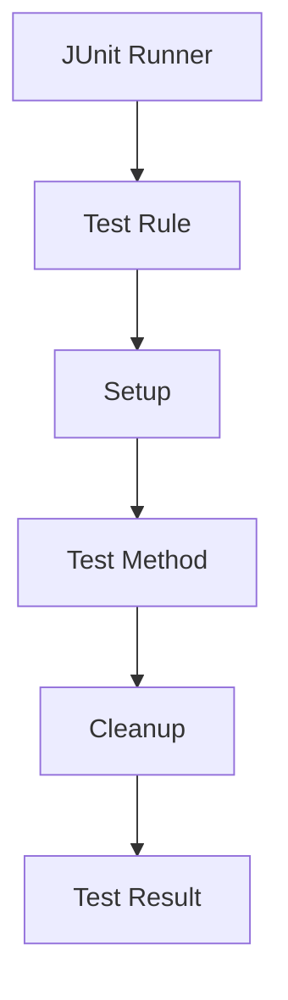
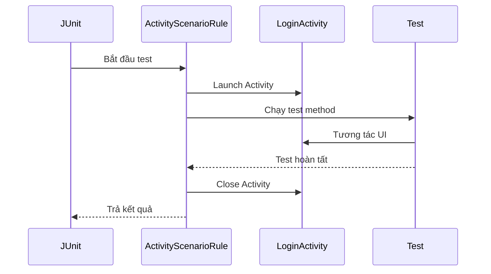

# 013 - Test Rule

**Học phần:** 05 - Quality, Release and Portfolio
**Module:** Module 11 - Testing
**Nhóm nội dung:** UI Testing
**Nguồn roadmap:** Testing / UI Testing
**Loại bài:** lesson
**Thứ tự trong module:** 013
**Thời lượng gợi ý:** 30 phút

---

## 1. Tóm tắt

Trong Android testing, nhiều test cần thực hiện cùng một chuỗi thao tác lặp lại trước và sau mỗi test case: khởi tạo `Activity`, cấp quyền, thiết lập dependency, chuẩn bị database, cấu hình dispatcher hoặc giải phóng tài nguyên sau khi test kết thúc.

Nếu những thao tác này được viết trực tiếp trong từng test, test suite nhanh chóng trở nên dài, khó đọc và dễ sai lệch giữa các test case.

`TestRule` trong JUnit 4 cung cấp cơ chế đóng gói các hành vi thiết lập và dọn dẹp đó thành một thành phần có thể tái sử dụng. Trong Android, nhiều công cụ testing quen thuộc như `ActivityScenarioRule`, `GrantPermissionRule`, `HiltAndroidRule` hoặc các rule phục vụ UI testing đều xây dựng trên ý tưởng này.

Sau bài học, người học có thể giải thích cơ chế của Test Rule, sử dụng rule trong Android test và nhận biết khi nào nên tạo custom rule thay vì lặp lại setup trong từng test.

---

## 2. Mục tiêu học tập

Sau khi hoàn thành bài học, người học có thể:

* Giải thích được vai trò của `TestRule` trong vòng đời của một test JUnit 4.
* Phân biệt được Test Rule với `@Before` và `@After`.
* Sử dụng `@Rule` để cấu hình hành vi dùng chung cho nhiều test case.
* Sử dụng `ActivityScenarioRule` để quản lý `Activity` trong UI test.
* Giải thích được vì sao thứ tự của nhiều rule có thể ảnh hưởng đến kết quả test.
* Thiết kế được một custom Test Rule đơn giản.
* Nhận biết các lỗi phổ biến khi sử dụng Test Rule trong Android testing.

---

## 3. Vì sao Test Rule tồn tại?

Giả sử một UI test cần thực hiện các bước sau:

```text
Chuẩn bị môi trường
        ↓
Khởi chạy Activity
        ↓
Thực hiện test
        ↓
Đóng Activity
        ↓
Dọn dẹp tài nguyên
```

Nếu có 20 test case, việc tự viết chuỗi setup và cleanup cho từng test sẽ tạo ra rất nhiều code lặp.

Một cách phổ biến là sử dụng `@Before` và `@After`:

```kotlin
@Before
fun setup() {
    // Chuẩn bị môi trường
}

@After
fun tearDown() {
    // Dọn dẹp
}
```

Cách này phù hợp với setup đơn giản. Tuy nhiên, khi logic setup trở thành một thành phần có thể tái sử dụng giữa nhiều test class, Test Rule thường phù hợp hơn.

Ý tưởng của Test Rule là:

```text
Test thông thường
        ↓
TestRule bao quanh test
        ↓
Before logic
        ↓
Test case
        ↓
After logic
```

Rule không thay đổi mục tiêu của test. Nó bổ sung một lớp hành vi xung quanh quá trình thực thi test.

---

## 4. Test Rule trong JUnit 4

Một Test Rule thực chất là một đối tượng có thể can thiệp vào quá trình JUnit thực thi một test.

Ở mức khái niệm, Test Rule hoạt động như một wrapper:



JUnit Runner chuẩn bị test rồi chuyển quá trình thực thi qua Rule. Rule có thể thực hiện logic trước test, gọi test thực tế và tiếp tục xử lý sau khi test hoàn thành.

Điểm quan trọng là Rule có thể đóng gói toàn bộ logic này thành một component độc lập.

Một custom rule ở mức JUnit có thể triển khai interface `TestRule`:

```kotlin
class LoggingRule : TestRule {

    override fun apply(
        base: Statement,
        description: Description
    ): Statement {
        return object : Statement() {

            override fun evaluate() {
                println("Start: ${description.methodName}")

                try {
                    base.evaluate()
                } finally {
                    println("Finish: ${description.methodName}")
                }
            }
        }
    }
}
```

Trong đoạn code này:

* `base` đại diện cho test sẽ được thực thi.
* `description` chứa thông tin về test hiện tại.
* `evaluate()` là nơi rule bao quanh quá trình chạy test.
* `base.evaluate()` thực thi test thực tế.
* `finally` giúp cleanup vẫn được thực hiện kể cả khi test thất bại.

Rule được gắn vào test bằng `@Rule`:

```kotlin
@get:Rule
val loggingRule = LoggingRule()
```

Trong Kotlin, annotation thường được đặt với use-site target `@get:Rule` để JUnit có thể nhận diện property đúng cách.

---

## 5. `@Before`, `@After` và Test Rule

`@Before`, `@After` và Test Rule đều có thể tham gia vào setup hoặc cleanup, nhưng mục đích thiết kế khác nhau.

| Cơ chế      | Phù hợp khi                                                                           |
| ----------- | ------------------------------------------------------------------------------------- |
| `@Before`   | Setup đơn giản, chỉ sử dụng trong một test class                                      |
| `@After`    | Cleanup đơn giản sau mỗi test                                                         |
| `TestRule`  | Logic setup/cleanup có thể tái sử dụng hoặc cần bao quanh toàn bộ quá trình chạy test |
| Custom Rule | Dự án có một quy trình testing đặc thù xuất hiện ở nhiều test class                   |

Ví dụ, việc khởi tạo một biến nhỏ có thể đặt trong `@Before`:

```kotlin
private lateinit var repository: FakeUserRepository

@Before
fun setup() {
    repository = FakeUserRepository()
}
```

Ngược lại, một cơ chế như tự động khởi chạy và đóng `Activity` phù hợp với Rule hơn vì nó là một lifecycle riêng có thể được đóng gói thành component.

Một nguyên tắc thực tế là:

> Nếu setup chỉ là vài dòng dữ liệu riêng cho test class, `@Before` thường đủ. Nếu setup trở thành một cơ chế dùng lại và có lifecycle rõ ràng, hãy cân nhắc Test Rule.

---

## 6. `ActivityScenarioRule` trong Android UI Testing

Một trường hợp sử dụng Test Rule phổ biến trong Android là quản lý lifecycle của `Activity` trong instrumented UI test.

`ActivityScenarioRule` có thể tự động khởi chạy `Activity` trước test và đóng scenario sau khi test hoàn thành.

Ví dụ:

```kotlin
@RunWith(AndroidJUnit4::class)
class LoginActivityTest {

    @get:Rule
    val activityRule = ActivityScenarioRule(LoginActivity::class.java)

    @Test
    fun loginButton_isDisplayed() {
        onView(withId(R.id.buttonLogin))
            .check(matches(isDisplayed()))
    }
}
```

Flow thực thi có thể hình dung như sau:



Rule giải quyết phần lifecycle, trong khi test method chỉ tập trung vào hành vi cần xác minh.

Điều này làm test dễ đọc hơn:

```text
Rule
→ quản lý môi trường

Test method
→ mô tả hành vi cần kiểm thử
```

Đây là một nguyên tắc quan trọng của automated testing: test case nên thể hiện rõ intent thay vì bị che khuất bởi nhiều đoạn setup kỹ thuật.

---

## 7. Rule và UI Testing

Test Rule đặc biệt hữu ích trong UI testing vì một UI test thường phụ thuộc vào nhiều điều kiện môi trường.

Ví dụ:

```text
Dependency Injection
        ↓
Runtime Permission
        ↓
Activity
        ↓
UI State
        ↓
User Action
        ↓
Assertion
```

Các thành phần hỗ trợ có thể được tổ chức thành rule thay vì nhồi tất cả logic vào test method.

Một test tốt nên đọc gần giống mô tả hành vi:

```kotlin
@Test
fun validCredentials_openHomeScreen() {
    onView(withId(R.id.emailInput))
        .perform(typeText("user@example.com"))

    onView(withId(R.id.passwordInput))
        .perform(typeText("password"))

    onView(withId(R.id.loginButton))
        .perform(click())

    onView(withId(R.id.homeScreen))
        .check(matches(isDisplayed()))
}
```

Test method tập trung vào ba phần:

```text
Arrange
   ↓
Act
   ↓
Assert
```

Các chi tiết môi trường có thể được chuyển sang Rule hoặc setup phù hợp.

---

## 8. Custom Test Rule

Custom Rule hữu ích khi một quy trình được lặp lại ở nhiều test class.

Ví dụ, dự án cần tự động đo thời gian chạy từng test:

```kotlin
class TestTimerRule : TestRule {

    override fun apply(
        base: Statement,
        description: Description
    ): Statement {
        return object : Statement() {

            override fun evaluate() {
                val start = System.nanoTime()

                try {
                    base.evaluate()
                } finally {
                    val elapsedMs =
                        (System.nanoTime() - start) / 1_000_000

                    println(
                        "${description.methodName}: ${elapsedMs} ms"
                    )
                }
            }
        }
    }
}
```

Sử dụng:

```kotlin
@get:Rule
val timerRule = TestTimerRule()
```

Sau đó mọi test trong class đều tự động được đo thời gian:

```kotlin
@Test
fun exampleTest() {
    // Test logic
}
```

Test không cần biết timer được triển khai như thế nào.

Đây chính là lợi ích của việc tách cross-cutting testing behavior thành Rule.

---

## 9. Nhiều Rule trong cùng một test

Một test class có thể cần nhiều rule.

Ví dụ:

```text
Dependency setup
        ↓
Permission setup
        ↓
Activity launch
        ↓
Test
```

Trong trường hợp này, thứ tự thực thi trở nên quan trọng.

Ví dụ, nếu `Activity` cần dependency đã được cấu hình trước khi khởi chạy thì dependency rule phải được áp dụng đúng thời điểm.

Một lỗi thiết kế thường gặp là xem các Rule như những component hoàn toàn độc lập:

```text
Rule A
Rule B
Rule C
```

Trong thực tế, chúng có thể tạo thành một chuỗi bao quanh nhau:

```text
Rule A
└── Rule B
    └── Rule C
        └── Test
```

Khi test phụ thuộc vào thứ tự, developer nên thể hiện dependency đó một cách rõ ràng thay vì dựa vào giả định ngầm.

JUnit cung cấp các cơ chế để quản lý rule ordering, trong đó có `RuleChain` khi cần mô hình outer/inner rule rõ ràng.

Ví dụ khái niệm:

```kotlin
private val outerRule = EnvironmentRule()
private val innerRule = LoggingRule()

@get:Rule
val ruleChain: TestRule = RuleChain
    .outerRule(outerRule)
    .around(innerRule)
```

Flow:

```text
Environment setup
        ↓
Logging setup
        ↓
Test
        ↓
Logging cleanup
        ↓
Environment cleanup
```

Nếu các rule không phụ thuộc thứ tự, không nên tạo dependency giả giữa chúng.

---

## 10. Test Rule và Dependency Injection

Trong một ứng dụng sử dụng Dependency Injection, UI test thường cần thay implementation thật bằng fake implementation.

Ví dụ:

```text
Production
UI
 ↓
ViewModel
 ↓
Real Repository
 ↓
Network
```

Trong test:

```text
Test
 ↓
Fake Dependency Setup
 ↓
UI
 ↓
ViewModel
 ↓
Fake Repository
```

Một Rule có thể đảm nhiệm phần chuẩn bị môi trường dependency trước khi `Activity` được tạo.

Điểm quan trọng là dependency phải sẵn sàng trước component sử dụng nó.

Nếu thứ tự sai:

```text
Activity được tạo
        ↓
Activity lấy dependency thật
        ↓
Test mới thay dependency
        ↓
Quá muộn
```

UI test có thể trở nên flaky hoặc vô tình gọi network thật.

Do đó, khi kết hợp nhiều testing framework, cần xác định rõ:

* Rule nào chuẩn bị dependency.
* Rule nào khởi chạy UI.
* Rule nào cấp permission.
* Rule nào thực hiện cleanup.
* Component nào phải chạy trước component nào.

---

## 11. Test Rule không thay thế test design

Test Rule chỉ quản lý môi trường thực thi. Nó không sửa được một test case thiết kế kém.

Ví dụ không nên kiểm tra quá nhiều hành vi trong cùng một test:

```kotlin
@Test
fun testEverything() {
    // login
    // update profile
    // create item
    // delete item
    // logout
}
```

Nếu test thất bại, rất khó biết nguyên nhân nằm ở đâu.

Tốt hơn là mỗi test tập trung vào một hành vi quan trọng:

```text
validCredentials_openHomeScreen

invalidPassword_showError

logout_returnToLoginScreen
```

Rule hỗ trợ các test này dùng chung môi trường, nhưng assertion và test scenario vẫn cần được thiết kế rõ ràng.

---

## 12. Những lỗi thường gặp

**Rule không được áp dụng**

Hiện tượng: logic trong rule không chạy.

Nguyên nhân thường gặp trong Kotlin là khai báo annotation không đúng vị trí.

Nên sử dụng:

```kotlin
@get:Rule
val rule = SomeRule()
```

---

**Activity được khởi chạy quá sớm**

Hiện tượng: test đã cấu hình fake dependency nhưng `Activity` vẫn sử dụng dependency production.

Nguyên nhân: rule khởi chạy `Activity` được thực thi trước bước cấu hình dependency.

Cách xử lý: xem lại lifecycle và thứ tự của các rule.

---

**Test vẫn phụ thuộc dữ liệu cũ**

Hiện tượng: test chạy riêng thì thành công nhưng chạy cả suite lại thất bại.

Nguyên nhân có thể là trạng thái từ test trước chưa được cleanup.

Cách xử lý:

* Reset fake repository.
* Xóa database test khi cần.
* Reset singleton hoặc dependency test.
* Đảm bảo cleanup được thực hiện kể cả khi test thất bại.

---

**Đưa assertion vào Rule**

Rule nên quản lý môi trường hoặc concern dùng chung. Assertion dành riêng cho một hành vi thường nên nằm trong test method.

Nếu Rule biết quá nhiều về business behavior, test suite sẽ khó đọc và khó bảo trì.

---

**Custom Rule quá lớn**

Một Rule thực hiện đồng thời database setup, networking, authentication, UI launch và logging thường là dấu hiệu responsibility bị trộn lẫn.

Nên tách theo trách nhiệm khi các concern thực sự độc lập.

---

## 13. Best practices

* Dùng Rule cho behavior setup/cleanup có khả năng tái sử dụng.
* Giữ test method tập trung vào hành vi cần xác minh.
* Ưu tiên deterministic test environment.
* Không để UI test phụ thuộc network thật nếu không phải mục tiêu của test.
* Đảm bảo cleanup chạy kể cả khi test thất bại.
* Tránh shared mutable state giữa các test.
* Đặt tên custom rule theo trách nhiệm, ví dụ `MainDispatcherRule`, `DatabaseRule` hoặc `TestTimerRule`.
* Chỉ tạo custom rule khi nó thực sự loại bỏ duplication hoặc chuẩn hóa lifecycle.
* Khi có nhiều rule phụ thuộc nhau, làm rõ execution order.
* Đưa các automated test quan trọng vào CI để feedback loop có thể lặp lại sau mỗi thay đổi code.

---

## 14. Bài thực hành

Tạo một instrumented UI test cho màn hình bất kỳ có `Activity`.

Yêu cầu:

1. Sử dụng `ActivityScenarioRule` để khởi chạy `Activity`.
2. Tìm một `View` quan trọng trên màn hình.
3. Kiểm tra `View` đó đang hiển thị.
4. Thực hiện ít nhất một thao tác người dùng.
5. Kiểm tra trạng thái UI sau thao tác.

Ví dụ skeleton:

```kotlin
@RunWith(AndroidJUnit4::class)
class MainActivityTest {

    @get:Rule
    val activityRule =
        ActivityScenarioRule(MainActivity::class.java)

    @Test
    fun action_updatesUiState() {
        onView(withId(R.id.actionButton))
            .check(matches(isDisplayed()))
            .perform(click())

        onView(withId(R.id.resultText))
            .check(matches(isDisplayed()))
    }
}
```

Sau khi test chạy thành công, tạo thêm một custom rule nhỏ có nhiệm vụ ghi lại tên test trước và sau khi thực thi.

**Kết quả mong đợi:**

* Test chạy tự động.
* `Activity` được Rule quản lý lifecycle.
* Test method chỉ chứa logic tương tác và assertion chính.
* Custom rule được gọi cho mỗi test.
* Chạy lại nhiều lần cho kết quả nhất quán.

---

## 15. Artifact cho portfolio

Một artifact nhỏ nhưng có giá trị hơn việc chỉ ghi rằng đã học Android UI Testing.

Có thể lưu trong repository:

```text
app/
src/
└── androidTest/
    └── ...
        ├── MainActivityTest.kt
        └── rules/
            └── TestTimerRule.kt
```

README nên mô tả ngắn:

* Mục tiêu của UI test.
* Rule được sử dụng.
* Vấn đề Rule giải quyết.
* Cách chạy test.
* Ví dụ failure mà test có thể phát hiện.

Ví dụ command chạy instrumented tests:

```bash
./gradlew connectedAndroidTest
```

Nếu dự án sử dụng module khác hoặc build variant khác, command cần được điều chỉnh theo cấu trúc dự án thực tế.

---

## 16. Checklist hoàn thành

* [ ] Giải thích được Test Rule dùng để làm gì.
* [ ] Mô tả được cách Rule bao quanh quá trình chạy test.
* [ ] Phân biệt được Rule với `@Before` và `@After`.
* [ ] Sử dụng được `@get:Rule` trong Kotlin.
* [ ] Sử dụng được `ActivityScenarioRule` trong UI test.
* [ ] Giải thích được vì sao thứ tự nhiều Rule có thể quan trọng.
* [ ] Tạo được một custom Rule đơn giản.
* [ ] Viết được test có setup tách biệt khỏi assertion.
* [ ] Chạy test bằng Gradle hoặc Android Studio.
* [ ] Ghi lại artifact testing trong repository hoặc portfolio.

---

## 17. Câu hỏi tự kiểm tra

1. Vì sao một setup có thể tái sử dụng giữa nhiều test class phù hợp với Test Rule hơn việc copy vào từng `@Before`?

2. Điều gì có thể xảy ra nếu rule khởi chạy `Activity` trước khi fake dependency được cài đặt?

3. Vì sao cleanup nên được đặt trong `finally` khi viết custom Test Rule?

4. Khi nào `@Before` đơn giản hơn và phù hợp hơn custom Rule?

5. Vì sao Test Rule giúp cải thiện maintainability nhưng không thể thay thế việc thiết kế test case tốt?

---

## 18. Tổng kết

`TestRule` là cơ chế của JUnit 4 cho phép bao quanh quá trình thực thi test bằng logic có thể tái sử dụng.

Trong Android testing, Rule đặc biệt hữu ích cho các trách nhiệm như:

* quản lý lifecycle của `Activity`;
* chuẩn bị môi trường test;
* cấu hình dependency;
* cấp quyền;
* điều khiển dispatcher;
* logging;
* cleanup tài nguyên.

Một test suite được thiết kế tốt thường tách rõ:

```text
Rule
→ chuẩn bị và quản lý môi trường

Test case
→ thực hiện hành vi

Assertion
→ xác minh kết quả
```

Mục tiêu cuối cùng không phải tạo càng nhiều Rule càng tốt, mà là làm cho test dễ đọc, ổn định, có thể lặp lại và đủ tin cậy để bảo vệ ứng dụng trong quá trình phát triển và release.
