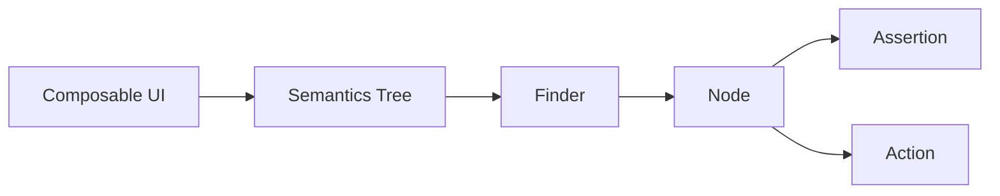
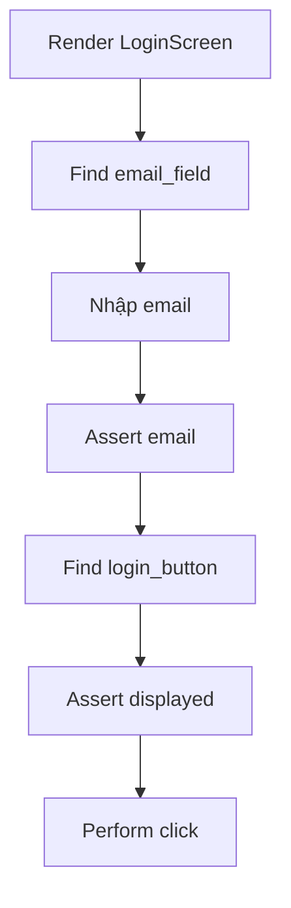

# 014 - Find Node

**Học phần:** 05 - Quality, Release and Portfolio
**Module:** Module 11 - Testing
**Nhóm nội dung:** UI Testing
**Nguồn roadmap:** Testing / UI Testing
**Loại bài:** lesson
**Thứ tự trong module:** 014
**Thời lượng gợi ý:** 30 phút

---

## 1. Tóm tắt

Trong UI Testing, trước khi kiểm tra nội dung, nhấn nút hay nhập dữ liệu, test cần **tìm đúng phần tử giao diện cần tương tác**. Với Jetpack Compose, phần tử mà test làm việc thường được gọi là **node** trong `Semantics Tree`.

Quá trình cơ bản của một Compose UI test thường là:

```text
Tìm node
    ↓
Kiểm tra node
    ↓
Thực hiện hành động
    ↓
Kiểm tra trạng thái mới
```

Jetpack Compose cung cấp các finder như `onNode()`, `onNodeWithText()`, `onNodeWithContentDescription()` và `onNodeWithTag()` để định vị node. Với nhiều phần tử cùng loại, có thể sử dụng `onAllNodes()` hoặc các finder tương ứng cho collection.

Khả năng tìm node ổn định là nền tảng để xây dựng UI test dễ đọc, ít flaky và ít phụ thuộc vào chi tiết triển khai của giao diện.

## 2. Mục tiêu học tập

Sau bài học, người học có thể:

* Giải thích được node trong Jetpack Compose UI Testing là gì.
* Mô tả được vai trò của `Semantics Tree` khi test giao diện Compose.
* Sử dụng được `onNode()`, `onNodeWithText()`, `onNodeWithContentDescription()` và `onNodeWithTag()`.
* Phân biệt được tìm một node và tìm collection nhiều node.
* Kết hợp nhiều `SemanticsMatcher` để xác định phần tử chính xác hơn.
* Phân tích được nguyên nhân khi test không tìm thấy node hoặc tìm thấy nhiều node.
* Sử dụng `useUnmergedTree` khi cần kiểm tra cấu trúc semantics chi tiết.
* Viết được một UI test có luồng find → action → assertion rõ ràng.

## 3. Vì sao UI test phải tìm node?

Giả sử ứng dụng có màn hình đăng nhập:

```text
┌──────────────────────────┐
│        Đăng nhập         │
│                          │
│  Email                   │
│  [____________________]  │
│                          │
│  Mật khẩu                │
│  [____________________]  │
│                          │
│      [ Đăng nhập ]       │
└──────────────────────────┘
```

Một test có thể cần:

1. Tìm ô nhập email.
2. Nhập địa chỉ email.
3. Tìm ô mật khẩu.
4. Nhập mật khẩu.
5. Tìm nút đăng nhập.
6. Nhấn nút.
7. Kiểm tra kết quả.

Test không thể đơn giản yêu cầu:

```text
Click button
```

vì trên màn hình có thể tồn tại nhiều button.

Nó phải xác định:

```text
Button nào?
    ↓
Có đặc điểm gì?
    ↓
Matcher nào xác định được nó?
    ↓
Node nào phù hợp?
```

Đó chính là vai trò của **Find Node**.

## 4. Node và Semantics Tree

Trong Jetpack Compose, UI test không làm việc trực tiếp với mọi lời gọi composable trong source code. Thay vào đó, Compose tạo một **semantics tree** chứa thông tin có ý nghĩa về giao diện, chẳng hạn:

* text;
* content description;
* role;
* trạng thái enabled;
* trạng thái selected;
* trạng thái checked;
* click action;
* test tag;
* các semantics property khác.

Compose UI Testing sử dụng chính cấu trúc semantics này để tìm và tương tác với UI.

Ví dụ:

```kotlin
Button(
    onClick = onLogin
) {
    Text("Đăng nhập")
}
```

Có thể hình dung theo hai lớp:

```text
Composable Tree
Button
└── Text("Đăng nhập")

        ↓ semantics

Semantics Tree
Node
├── Text = "Đăng nhập"
├── Role = Button
└── OnClick
```

Test không cần biết button được vẽ như thế nào. Test quan tâm đến **ý nghĩa có thể quan sát được của UI**.

Điều này tạo nên mô hình:



`Finder` truy vấn `Semantics Tree`. Kết quả là một đối tượng tương tác với node, từ đó test có thể thực hiện assertion hoặc action. `SemanticsNodeInteraction`, chẳng hạn, có thể được sử dụng để `performClick()` hoặc thực hiện các assertion trên node đã tìm thấy.

## 5. Mô hình Find → Assert → Act

Ba nhóm API quan trọng trong Compose UI Testing là:

| Nhóm      | Vai trò       | Ví dụ                 |
| --------- | ------------- | --------------------- |
| Finder    | Tìm node      | `onNodeWithText()`    |
| Assertion | Kiểm tra node | `assertIsDisplayed()` |
| Action    | Tương tác     | `performClick()`      |

Một test đơn giản:

```kotlin
composeTestRule
    .onNodeWithText("Đăng nhập")
    .assertIsDisplayed()
    .performClick()
```

Có thể đọc gần giống ngôn ngữ tự nhiên:

```text
Tìm node có text "Đăng nhập"
        ↓
Xác nhận nó đang hiển thị
        ↓
Click vào node
```

Cách viết này làm test dễ đọc và thể hiện trực tiếp hành vi của người dùng.

## 6. Các cách tìm node phổ biến

### 6.1. Tìm bằng text

Khi UI có text rõ ràng:

```kotlin
composeTestRule
    .onNodeWithText("Đăng nhập")
    .assertIsDisplayed()
```

`onNodeWithText()` phù hợp với:

* button có label;
* tiêu đề;
* message;
* menu item;
* text trong màn hình.

Ví dụ:

```kotlin
@Test
fun loginTitle_isDisplayed() {
    composeTestRule
        .onNodeWithText("Đăng nhập")
        .assertIsDisplayed()
}
```

### 6.2. Tìm bằng content description

Đối với icon hoặc thành phần hỗ trợ accessibility, có thể dùng:

```kotlin
composeTestRule
    .onNodeWithContentDescription("Tìm kiếm")
    .performClick()
```

Ví dụ UI:

```kotlin
IconButton(onClick = onSearch) {
    Icon(
        imageVector = Icons.Default.Search,
        contentDescription = "Tìm kiếm"
    )
}
```

Test:

```kotlin
composeTestRule
    .onNodeWithContentDescription("Tìm kiếm")
    .assertIsDisplayed()
    .performClick()
```

Cách tiếp cận này đồng thời khuyến khích giao diện cung cấp semantics có ý nghĩa cho accessibility.

## 7. Tìm node bằng `testTag`

Text không phải lúc nào cũng là locator phù hợp. Ví dụ:

* text có thể được dịch;
* hai button có cùng text;
* component không có text;
* cần định danh một container cụ thể.

Jetpack Compose cho phép gắn `testTag` vào semantics của component và tìm bằng `onNodeWithTag()`.

UI:

```kotlin
Button(
    modifier = Modifier.testTag("login_button"),
    onClick = onLogin
) {
    Text("Đăng nhập")
}
```

Test:

```kotlin
composeTestRule
    .onNodeWithTag("login_button")
    .performClick()
```

`testTag` nên mô tả **vai trò ổn định** của phần tử:

```text
login_button
email_field
password_field
profile_avatar
product_list
checkout_button
```

Không nên gắn tag dựa trên vị trí trình bày:

```text
button_1
button_left
row_3_child_2
```

Các tên như vậy phụ thuộc mạnh vào implementation và dễ làm test hỏng khi UI được tái cấu trúc.

## 8. Sử dụng `onNode()` và `SemanticsMatcher`

Các finder tiện ích như:

```kotlin
onNodeWithText(...)
onNodeWithTag(...)
onNodeWithContentDescription(...)
```

phù hợp với trường hợp thông thường.

Khi cần điều kiện phức tạp hơn, sử dụng:

```kotlin
onNode(matcher)
```

Ví dụ:

```kotlin
composeTestRule
    .onNode(
        hasText("Đăng nhập") and hasClickAction()
    )
    .assertIsDisplayed()
```

Luồng tìm kiếm:

```text
Semantics Tree
      ↓
hasText("Đăng nhập")
      ↓
hasClickAction()
      ↓
AND
      ↓
Node thỏa cả hai điều kiện
```

Các matcher có thể kết hợp bằng các phép logic như `and` và `or`. Compose cũng cung cấp matcher liên quan đến quan hệ trong semantics tree như parent, ancestor, descendant và sibling.

Ví dụ:

```kotlin
val loginButtonMatcher =
    hasText("Đăng nhập") and hasClickAction()

composeTestRule
    .onNode(loginButtonMatcher)
    .performClick()
```

Việc đặt matcher vào biến đặc biệt hữu ích khi điều kiện được tái sử dụng.

## 9. Một node và nhiều node

`onNode()` được sử dụng khi test kỳ vọng **chính xác một node** phù hợp.

Ví dụ:

```kotlin
composeTestRule
    .onNodeWithText("Đăng nhập")
    .assertExists()
```

Nếu giao diện chứa nhiều phần tử cùng thỏa điều kiện, nên dùng collection:

```kotlin
composeTestRule
    .onAllNodesWithText("Thêm")
```

Hoặc matcher tổng quát:

```kotlin
composeTestRule
    .onAllNodes(hasClickAction())
```

Ví dụ kiểm tra số lượng:

```kotlin
composeTestRule
    .onAllNodesWithText("Thêm")
    .assertCountEquals(3)
```

Mô hình lựa chọn:

```text
Kỳ vọng đúng một node?
        │
   ┌────┴────┐
   │         │
  Có        Không
   │         │
onNode    onAllNodes
```

Finder dành cho một node có kỳ vọng về tính duy nhất; thao tác tiếp theo có thể thất bại nếu không tìm được node hoặc có nhiều hơn một node phù hợp.

## 10. Khi text không đủ để xác định node

Xét giao diện:

```text
Sản phẩm A          [Thêm]
Sản phẩm B          [Thêm]
Sản phẩm C          [Thêm]
```

Test sau không đủ chính xác:

```kotlin
composeTestRule
    .onNodeWithText("Thêm")
    .performClick()
```

Có ba node giống nhau.

Một chiến lược tốt hơn là sử dụng quan hệ semantics.

Ví dụ ý tưởng:

```kotlin
composeTestRule.onNode(
    hasText("Thêm") and
        hasAnyAncestor(hasTestTag("product_b"))
)
```

Test lúc này không chỉ hỏi:

```text
Node có text "Thêm"?
```

mà hỏi:

```text
Node có text "Thêm"
AND
nằm trong product B?
```

Matcher càng mô tả đúng ý nghĩa của phần tử thì test càng ít phụ thuộc vào bố cục trực quan.

## 11. Merged và unmerged Semantics Tree

Compose có thể gộp semantics của nhiều composable con thành một node cha.

Ví dụ:

```kotlin
Button(onClick = {}) {
    Text("Hello")
    Text("World")
}
```

Semantics có thể được biểu diễn theo dạng đã merge:

```text
Button
└── Text = ["Hello", "World"]
```

thay vì:

```text
Button
├── Text("Hello")
└── Text("World")
```

Đây là lý do đôi khi test nhìn source code thấy một `Text`, nhưng không thể tìm được node riêng tương ứng.

Nếu thực sự cần truy cập cấu trúc trước khi merge, finder hỗ trợ:

```kotlin
useUnmergedTree = true
```

Ví dụ:

```kotlin
composeTestRule
    .onNodeWithText(
        text = "World",
        useUnmergedTree = true
    )
    .assertExists()
```

Android khuyến nghị xem `useUnmergedTree` như công cụ cho trường hợp cần kiểm tra chi tiết implementation bên trong, thay vì mặc định sử dụng nó cho mọi test.

## 12. Quan sát Semantics Tree khi debug

Khi không hiểu tại sao finder thất bại, một trong những kỹ thuật hữu ích nhất là in semantics tree.

```kotlin
composeTestRule
    .onRoot()
    .printToLog("UI_TEST")
```

Nếu cần xem unmerged tree:

```kotlin
composeTestRule
    .onRoot(useUnmergedTree = true)
    .printToLog("UI_TEST")
```

Việc này giúp trả lời:

* text thực tế nằm ở node nào;
* semantics có bị merge hay không;
* node có `testTag` chưa;
* node có click action hay không;
* component cha hay component con đang giữ semantics.

Đây thường hiệu quả hơn việc thử ngẫu nhiên nhiều finder khác nhau. Android Developers cũng sử dụng `printToLog()` như kỹ thuật quan sát merged và unmerged semantics tree khi debug test.

## 13. Ví dụ hoàn chỉnh: tìm và kiểm tra màn hình đăng nhập

Giả sử màn hình:

```kotlin
@Composable
fun LoginScreen(
    email: String,
    onEmailChanged: (String) -> Unit,
    onLogin: () -> Unit
) {
    Column {
        Text("Đăng nhập")

        TextField(
            value = email,
            onValueChange = onEmailChanged,
            modifier = Modifier.testTag("email_field"),
            label = {
                Text("Email")
            }
        )

        Button(
            modifier = Modifier.testTag("login_button"),
            onClick = onLogin
        ) {
            Text("Đăng nhập")
        }
    }
}
```

Test:

```kotlin
class LoginScreenTest {

    @get:Rule
    val composeTestRule = createComposeRule()

    @Test
    fun loginScreen_allowsSubmittingEmail() {
        composeTestRule.setContent {
            var email by remember {
                mutableStateOf("")
            }

            LoginScreen(
                email = email,
                onEmailChanged = {
                    email = it
                },
                onLogin = {}
            )
        }

        composeTestRule
            .onNodeWithTag("email_field")
            .performTextInput("user@example.com")

        composeTestRule
            .onNodeWithTag("email_field")
            .assertTextContains("user@example.com")

        composeTestRule
            .onNodeWithTag("login_button")
            .assertIsDisplayed()
            .performClick()
    }
}
```

Luồng test:



Ví dụ thể hiện ba trách nhiệm tách biệt:

* finder xác định component;
* action mô phỏng hành vi người dùng;
* assertion xác nhận trạng thái có thể quan sát được.

## 14. Chọn locator phù hợp

Không tồn tại một finder tốt nhất cho mọi trường hợp.

| Locator                          | Phù hợp khi                     | Lưu ý                              |
| -------------------------------- | ------------------------------- | ---------------------------------- |
| `onNodeWithText()`               | Text là đặc điểm ổn định        | Có thể ảnh hưởng bởi localization  |
| `onNodeWithContentDescription()` | Icon hoặc element accessibility | Description nên có ý nghĩa         |
| `onNodeWithTag()`                | Cần định danh ổn định cho test  | Tránh lạm dụng tag cho mọi element |
| `onNode(matcher)`                | Điều kiện phức tạp              | Có thể kết hợp nhiều semantics     |
| `onAllNodes()`                   | Kỳ vọng nhiều kết quả           | Cần kiểm tra collection phù hợp    |

Một locator tốt cần đạt hai mục tiêu:

```text
Đủ cụ thể để chọn đúng node
          +
Đủ ổn định để không phụ thuộc UI implementation
```

## 15. Lỗi thường gặp

### 15.1. Không tìm thấy node

**Hiện tượng:**

```text
AssertionError
Node not found
```

**Nguyên nhân có thể:**

* text không giống giá trị thực tế;
* node chưa xuất hiện;
* semantics đã bị merge;
* `testTag` gắn vào component khác;
* UI đang ở state khác mong đợi.

**Cách xử lý:**

```kotlin
composeTestRule
    .onRoot()
    .printToLog("UI_TEST")
```

Sau đó kiểm tra semantics tree trước khi sửa finder.

### 15.2. Tìm thấy nhiều node

**Hiện tượng:** finder cho một node không thể xác định duy nhất phần tử cần thao tác.

Ví dụ:

```kotlin
composeTestRule
    .onNodeWithText("Thêm")
```

trong khi màn hình có nhiều nút `Thêm`.

**Cách xử lý:**

* thêm matcher;
* xác định ancestor hoặc parent;
* sử dụng `testTag`;
* hoặc dùng `onAllNodes...()` nếu nhiều kết quả thực sự là điều mong đợi.

## 16. Các lỗi thiết kế test nên tránh

Không nên viết locator quá phụ thuộc vào cấu trúc:

```text
Column
 └── Row thứ 3
      └── child thứ 2
           └── Button
```

Nếu designer thay `Column` thành `LazyColumn`, logic test có thể hỏng dù hành vi ứng dụng không thay đổi.

Nên ưu tiên semantics phản ánh ý nghĩa:

```text
login_button
checkout_button
search
delete_item
```

Một UI test tốt nên kiểm tra:

```text
Người dùng nhìn thấy gì?
Người dùng có thể làm gì?
Ứng dụng phản hồi như thế nào?
```

thay vì:

```text
Composable nằm ở vị trí nào trong source?
```

## 17. Best practices

* Ưu tiên semantics mang ý nghĩa người dùng thay vì chi tiết layout.
* Sử dụng `onNodeWithText()` khi text là locator tự nhiên và ổn định.
* Sử dụng content description đối với các phần tử mà accessibility dựa vào description.
* Dùng `testTag` khi locator theo semantics hiện tại không đủ ổn định hoặc không đủ rõ.
* Đặt tên test tag theo vai trò như `login_button`, không theo vị trí như `button_2`.
* Kết hợp matcher khi một thuộc tính không đủ để xác định node.
* Sử dụng `onAllNodes()` khi thực sự mong đợi nhiều phần tử.
* Debug bằng semantics tree trước khi thêm workaround.
* Chỉ sử dụng `useUnmergedTree = true` khi cần truy cập semantics chi tiết đã bị merge.
* Tránh biến test thành bản sao cấu trúc implementation của UI.

## 18. Bài thực hành

Xây dựng một Compose screen gồm:

```text
Product List

Laptop        [Add]
Keyboard      [Add]
Mouse         [Add]

Cart: 0
```

Yêu cầu:

1. Gắn một định danh ổn định cho từng product row.
2. Tìm node chứa sản phẩm `Keyboard`.
3. Tìm đúng nút `Add` thuộc sản phẩm đó.
4. Thực hiện `performClick()`.
5. Xác nhận cart thay đổi từ `0` thành `1`.
6. In semantics tree nếu finder ban đầu không xác định được đúng node.

**Kết quả mong đợi:**

* test không click nhầm `Add` của sản phẩm khác;
* test có ít nhất một matcher dựa trên semantics;
* test chạy lặp lại được;
* việc thay đổi khoảng cách hoặc bố cục cơ bản không làm test hỏng nếu hành vi không đổi.

**Artifact cho portfolio:**

```text
ui-testing/
├── ProductScreen.kt
├── ProductScreenTest.kt
└── README.md
```

Trong `README.md`, mô tả ngắn:

* node được tìm bằng cách nào;
* tại sao chọn locator đó;
* failure ban đầu nếu có;
* cách kiểm tra semantics tree;
* kết quả test cuối cùng.

## 19. Checklist hoàn thành

* [ ] Giải thích được node trong Compose UI Testing.
* [ ] Giải thích được vai trò của `Semantics Tree`.
* [ ] Sử dụng được `onNodeWithText()`.
* [ ] Sử dụng được `onNodeWithContentDescription()`.
* [ ] Sử dụng được `onNodeWithTag()`.
* [ ] Sử dụng được `onNode()` với `SemanticsMatcher`.
* [ ] Phân biệt được `onNode()` và `onAllNodes()`.
* [ ] Nhận biết được trường hợp node bị merge semantics.
* [ ] Biết khi nào cần `useUnmergedTree`.
* [ ] Biết dùng `printToLog()` để debug semantics tree.
* [ ] Viết được test theo luồng find → action → assertion.
* [ ] Tránh locator phụ thuộc quá mạnh vào cấu trúc UI.

## 20. Câu hỏi tự kiểm tra

1. Vì sao Compose UI Testing tìm kiếm `Semantics Node` thay vì đơn giản truy cập mọi composable trong source code?

2. Trong trường hợp nào `onNodeWithTag()` phù hợp hơn `onNodeWithText()`?

3. Điều gì có thể xảy ra nếu `onNodeWithText("Add")` khớp với ba node cùng lúc?

4. Vì sao `useUnmergedTree = true` không nên được sử dụng mặc định cho mọi finder?

5. Nếu test không tìm thấy một `Text` mặc dù bạn nhìn thấy `Text(...)` trong source code, bạn sẽ debug theo những bước nào?

## 21. Tổng kết

Find Node là bước đầu tiên của phần lớn Jetpack Compose UI test:

```text
Semantics
    ↓
Finder
    ↓
Node
    ↓
Assertion / Action
```

Các finder như `onNodeWithText()`, `onNodeWithContentDescription()` và `onNodeWithTag()` giải quyết những trường hợp phổ biến, trong khi `onNode()` kết hợp `SemanticsMatcher` cho phép xây dựng truy vấn chính xác hơn.

Điểm quan trọng không phải là tìm node bằng mọi giá, mà là chọn một **locator phản ánh đúng ý nghĩa của giao diện và đủ ổn định trước thay đổi implementation**.

Khi finder hoạt động không như mong đợi, hãy kiểm tra `Semantics Tree`, xác định merged hay unmerged semantics và chỉ sử dụng `useUnmergedTree` khi thực sự cần. Khi nền tảng Find Node được thiết kế tốt, các bước assertion và interaction phía sau cũng trở nên rõ ràng, ổn định và dễ bảo trì hơn.
