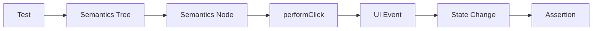
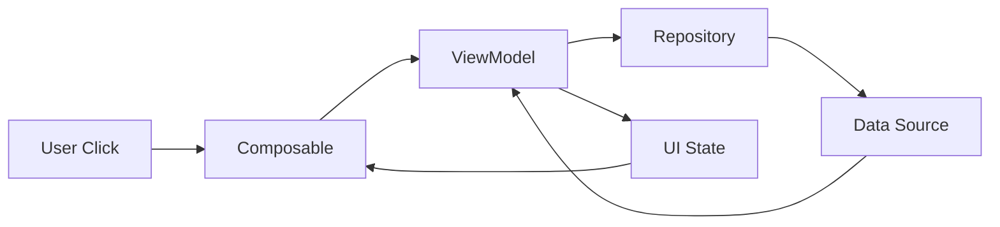

# 015 - Click Action

**Học phần:** 05 - Quality, Release and Portfolio
**Module:** Module 11 - Testing
**Nhóm nội dung:** UI Testing
**Nguồn roadmap:** Testing / UI Testing
**Loại bài:** lesson
**Thứ tự trong module:** 015
**Thời lượng gợi ý:** 30 phút

---

## 1. Tóm tắt

`Click Action` là một trong những thao tác cơ bản nhất của UI Testing trên Android. Thay vì yêu cầu người kiểm thử tự mở ứng dụng, tìm một nút và chạm vào nó, automated UI test có thể xác định phần tử giao diện, thực hiện hành động click và kiểm tra trạng thái của ứng dụng sau tương tác.

Một test click có giá trị không chỉ vì nó chứng minh rằng một nút có thể được nhấn. Điều quan trọng hơn là kiểm tra:

* phần tử cần tương tác có tồn tại;
* phần tử đó thực sự hỗ trợ hành động click;
* click kích hoạt đúng hành vi;
* UI hoặc state thay đổi đúng;
* lỗi hồi quy trong user flow có thể được phát hiện tự động.

Với Jetpack Compose, thao tác này thường được thực hiện bằng `performClick()`. Với giao diện Android View truyền thống và Espresso, có thể sử dụng `perform(click())`. Android cung cấp các API tương tác trực tiếp với node trong semantics tree của Compose, bao gồm `performClick()` và các assertion liên quan đến click. ([Android Developers][1])

---

## 2. Mục tiêu học tập

Sau bài học, người học có thể:

* Giải thích được vai trò của `Click Action` trong automated UI testing.
* Mô tả được chu trình `find → action → assert` của một UI test.
* Sử dụng `performClick()` để mô phỏng thao tác click trong Jetpack Compose test.
* Sử dụng `perform(click())` khi kiểm thử giao diện Android View bằng Espresso.
* Lựa chọn selector phù hợp để giảm nguy cơ test bị flaky.
* Kiểm tra được kết quả thực sự xảy ra sau một click thay vì chỉ kiểm tra thao tác.
* Phân tích được các nguyên nhân phổ biến khiến automated click test thất bại.

---

## 3. Click Action giải quyết vấn đề gì?

Giả sử một màn hình đăng nhập có nút `Đăng nhập`.

Người kiểm thử thủ công có thể thực hiện:

```text
Mở ứng dụng
    ↓
Nhập email
    ↓
Nhập mật khẩu
    ↓
Nhấn Đăng nhập
    ↓
Quan sát màn hình tiếp theo
```

Cách này phù hợp cho exploratory testing nhưng khó lặp lại liên tục mỗi khi source code thay đổi.

Automated UI testing chuyển user flow thành một test có thể chạy lại:

```text
Khởi tạo UI
    ↓
Tìm phần tử
    ↓
Thực hiện click
    ↓
Ứng dụng xử lý event
    ↓
State thay đổi
    ↓
UI được cập nhật
    ↓
Assertion kiểm tra kết quả
```

`Click Action` chính là bước mô phỏng tương tác của người dùng trong chuỗi này.

Điểm quan trọng là click không phải kết quả cuối cùng của test. Click chỉ là **stimulus** kích hoạt hệ thống. Test phải tiếp tục kiểm tra **effect** do stimulus đó tạo ra.

Ví dụ:

```text
Click "Add"
    ↓
ViewModel xử lý event
    ↓
Cart state thay đổi
    ↓
UI hiển thị số lượng = 1
```

Một test tốt phải xác nhận phần cuối:

```text
Cart state → UI hiển thị đúng
```

chứ không chỉ xác nhận rằng lệnh click đã được gọi.

---

## 4. Mô hình Arrange - Act - Assert

Một Click Action test thường phù hợp với mô hình `Arrange - Act - Assert`.

### 4.1. Arrange

Chuẩn bị trạng thái cần thiết cho test.

Ví dụ:

* hiển thị màn hình;
* cung cấp fake data;
* đặt state ban đầu;
* xác định node cần tương tác.

### 4.2. Act

Thực hiện hành động mà người dùng sẽ làm.

Ví dụ:

```kotlin
composeTestRule
    .onNodeWithText("Thêm")
    .performClick()
```

### 4.3. Assert

Kiểm tra hậu quả sau hành động.

Ví dụ:

```kotlin
composeTestRule
    .onNodeWithText("Đã thêm")
    .assertIsDisplayed()
```

Toàn bộ test có thể được đọc theo ngôn ngữ tự nhiên:

> Cho trước màn hình sản phẩm, khi người dùng nhấn `Thêm`, ứng dụng phải hiển thị trạng thái `Đã thêm`.

Cách tổ chức này giúp test thể hiện hành vi của sản phẩm thay vì chỉ thể hiện implementation detail.

---

## 5. Click Action trong Jetpack Compose

Jetpack Compose UI Testing làm việc chủ yếu thông qua **semantics tree**.

Composable có thể cung cấp các semantics như:

* text;
* content description;
* state;
* role;
* click action;
* test tag.

Test tìm một semantics node phù hợp rồi thực hiện action trên node đó.

Luồng cơ bản:



Test không nên phụ thuộc vào tọa độ cố định trên màn hình. Thay vào đó, nó tìm đúng node theo semantics và thực hiện hành động trên node đó.

API Compose Testing cho phép `SemanticsNodeInteraction` thực hiện `performClick()` và kiểm tra khả năng click của node. ([Android Developers][2])

---

## 6. Click một Button trong Compose

Giả sử ứng dụng có một counter:

```kotlin
@Composable
fun CounterScreen() {
    var count by remember { mutableIntStateOf(0) }

    Column {
        Text(
            text = "Count: $count",
            modifier = Modifier.testTag("count_text")
        )

        Button(
            onClick = { count++ },
            modifier = Modifier.testTag("increment_button")
        ) {
            Text("Increase")
        }
    }
}
```

Yêu cầu cần kiểm thử:

```text
Given: Count = 0
When:  Click nút Increase
Then:  Count = 1
```

Test:

```kotlin
@Test
fun clickIncreaseButton_updatesCounter() {
    composeTestRule.setContent {
        CounterScreen()
    }

    composeTestRule
        .onNodeWithTag("increment_button")
        .performClick()

    composeTestRule
        .onNodeWithTag("count_text")
        .assertTextEquals("Count: 1")
}
```

Ví dụ này thể hiện đúng cấu trúc:

```text
Tìm button
    ↓
performClick()
    ↓
State count tăng
    ↓
Compose recomposition
    ↓
Kiểm tra Text mới
```

Các ví dụ chính thức của Compose Testing cũng sử dụng `performClick()` theo mô hình tương tự: tìm node, thực hiện click rồi xác minh state/UI sau tương tác. ([Android Developers][3])

---

## 7. Cách tìm phần tử trước khi click

Một Click Action chỉ đáng tin cậy khi test xác định đúng phần tử.

### 7.1. Tìm bằng text

```kotlin
composeTestRule
    .onNodeWithText("Đăng nhập")
    .performClick()
```

Cách này dễ đọc và phù hợp khi text là một phần ổn định trong hành vi mà người dùng nhìn thấy.

Tuy nhiên, test có thể bị ảnh hưởng nếu:

* thay đổi nội dung text;
* localization;
* có nhiều node chứa cùng text.

### 7.2. Tìm bằng test tag

UI:

```kotlin
Button(
    onClick = onLogin,
    modifier = Modifier.testTag("login_button")
) {
    Text("Đăng nhập")
}
```

Test:

```kotlin
composeTestRule
    .onNodeWithTag("login_button")
    .performClick()
```

`testTag` hữu ích khi cần một selector ổn định và không muốn test phụ thuộc trực tiếp vào chuỗi hiển thị.

Nguyên tắc quan trọng là selector phải đủ cụ thể để xác định đúng node nhưng không nên ràng buộc test quá chặt với implementation detail không cần thiết.

---

## 8. Kiểm tra node có hỗ trợ click

Không phải node nào xuất hiện trên màn hình cũng có thể click.

Một node có thể:

* chỉ hiển thị text;
* bị disabled;
* không cung cấp click semantics;
* không phải phần tử mà người dùng thực sự tương tác.

Compose Testing cung cấp assertion để kiểm tra node có click action:

```kotlin
composeTestRule
    .onNodeWithTag("login_button")
    .assertHasClickAction()
```

Sau đó mới thực hiện:

```kotlin
composeTestRule
    .onNodeWithTag("login_button")
    .performClick()
```

`assertHasClickAction()` đặc biệt hữu ích khi mục đích của test bao gồm xác minh khả năng tương tác của thành phần UI. `SemanticsNodeInteraction` hỗ trợ cả `performClick()` lẫn assertion về click action. ([Android Developers][2])

Tuy nhiên, không cần thêm assertion này vào mọi test một cách máy móc. Nếu `performClick()` chỉ là bước trung gian để kiểm tra hành vi nghiệp vụ, assertion quan trọng nhất vẫn là kết quả sau click.

---

## 9. Click phải đi kèm assertion có ý nghĩa

Test sau đây chưa đủ mạnh:

```kotlin
@Test
fun clickLoginButton() {
    composeTestRule
        .onNodeWithTag("login_button")
        .performClick()
}
```

Test chỉ thể hiện rằng test framework đã thực hiện một thao tác.

Nó chưa xác nhận:

* đăng nhập thành công;
* loading xuất hiện;
* navigation xảy ra;
* error được hiển thị;
* state được cập nhật.

Một test tốt hơn:

```kotlin
@Test
fun validCredentials_clickLogin_opensHomeScreen() {
    composeTestRule
        .onNodeWithTag("email_field")
        .performTextInput("student@example.com")

    composeTestRule
        .onNodeWithTag("password_field")
        .performTextInput("password")

    composeTestRule
        .onNodeWithTag("login_button")
        .performClick()

    composeTestRule
        .onNodeWithTag("home_screen")
        .assertIsDisplayed()
}
```

Cấu trúc kiểm thử lúc này là:

```text
Input
    ↓
Click
    ↓
Behavior
    ↓
Observable Result
```

Đây mới là mục tiêu chính của UI Testing.

---

## 10. Click và state của ứng dụng

Trong kiến trúc Android hiện đại, click thường không nên chứa toàn bộ business logic ngay trong UI.

Ví dụ:

```kotlin
Button(
    onClick = viewModel::onRetry
) {
    Text("Retry")
}
```

Luồng xử lý có thể là:



Trong trường hợp này, UI test không nhất thiết phải kiểm tra nội bộ `ViewModel` gọi method nào.

Thay vào đó, test nên quan sát hành vi người dùng có thể thấy:

```text
Click Retry
    ↓
Loading xuất hiện
    ↓
Request hoàn thành
    ↓
Content hoặc Error được hiển thị
```

Điều này giúp test ít phụ thuộc implementation và vẫn có giá trị khi kiến trúc bên trong được refactor.

---

## 11. Click Action với Android View và Espresso

Ứng dụng sử dụng XML/View truyền thống thường dùng Espresso.

Ví dụ:

```kotlin
onView(withId(R.id.loginButton))
    .perform(click())
```

Sau click, tiếp tục kiểm tra:

```kotlin
onView(withText("Trang chủ"))
    .check(matches(isDisplayed()))
```

Mô hình vẫn giống Compose:

```text
Compose
onNode(...) → performClick() → assert...

View + Espresso
onView(...) → perform(click()) → check(...)
```

Espresso vẫn là công cụ quan trọng đối với các UI dựa trên View, trong khi Compose Testing cung cấp API chuyên biệt cho semantics của Jetpack Compose. ([Android Developers][1])

---

## 12. Click Action và bất đồng bộ

Một click có thể kích hoạt tác vụ không hoàn thành ngay lập tức.

Ví dụ:

```text
Click Sync
    ↓
ViewModel
    ↓
Repository
    ↓
HTTP request
    ↓
Response
    ↓
StateFlow
    ↓
Recomposition
```

Nếu test kiểm tra kết quả quá sớm, nó có thể thất bại dù ứng dụng hoạt động đúng.

Một nguyên tắc quan trọng là:

> Không giải quyết asynchronous UI test bằng `Thread.sleep()` tùy tiện.

Ví dụ không nên dùng:

```kotlin
composeTestRule
    .onNodeWithText("Sync")
    .performClick()

Thread.sleep(3000)

composeTestRule
    .onNodeWithText("Completed")
    .assertIsDisplayed()
```

Test kiểu này:

* chạy chậm;
* phụ thuộc tốc độ thiết bị;
* dễ flaky;
* vẫn có thể thất bại nếu tác vụ mất hơn 3 giây.

Compose Testing có cơ chế đồng bộ với hoạt động UI của Compose, nhưng các nguồn công việc bất đồng bộ bên ngoài Compose vẫn cần được thiết kế test phù hợp, chẳng hạn bằng fake dependency, kiểm soát dispatcher hoặc cơ chế synchronization thích hợp.

---

## 13. Kiểm thử một user flow hoàn chỉnh

Giả sử màn hình có nút `Add to cart`.

Yêu cầu:

```text
Khi người dùng nhấn Add to cart
→ sản phẩm được thêm vào giỏ
→ badge tăng từ 0 thành 1
```

Test:

```kotlin
@Test
fun clickAddToCart_updatesCartBadge() {
    composeTestRule.setContent {
        ProductScreen()
    }

    composeTestRule
        .onNodeWithTag("add_to_cart_button")
        .assertHasClickAction()
        .performClick()

    composeTestRule
        .onNodeWithTag("cart_badge")
        .assertTextEquals("1")
}
```

Điều test đang bảo vệ không phải API `performClick()`.

Nó đang bảo vệ business behavior:

```text
Add product
    ↓
Cart được cập nhật
    ↓
UI phản ánh cart mới
```

Nếu sau một lần refactor, developer vô tình làm button không cập nhật cart nữa, test sẽ phát hiện regression.

---

## 14. Các lỗi thường gặp

**Hiện tượng:** `performClick()` không tìm thấy node.
**Nguyên nhân:** selector không khớp semantics tree, node chưa xuất hiện hoặc text đã thay đổi.
**Cách xử lý:** kiểm tra selector, semantics và trạng thái UI trước khi click.

**Hiện tượng:** Có nhiều node khớp cùng selector.
**Nguyên nhân:** text hoặc tag không đủ đặc trưng.
**Cách xử lý:** sử dụng matcher cụ thể hơn hoặc thiết kế `testTag` ổn định.

**Hiện tượng:** Node hiển thị nhưng không click được.
**Nguyên nhân:** node không có click semantics hoặc thành phần đang disabled.
**Cách xử lý:** kiểm tra `assertHasClickAction()`, trạng thái `enabled` và semantics của composable.

**Hiện tượng:** Click thành công nhưng assertion sau đó thất bại không ổn định.
**Nguyên nhân:** tác vụ bất đồng bộ chưa hoàn thành hoặc dependency thực như network làm test không deterministic.
**Cách xử lý:** sử dụng fake dependency và cơ chế synchronization phù hợp thay vì delay cố định.

**Hiện tượng:** Test hỏng sau khi đổi text nhưng chức năng vẫn đúng.
**Nguyên nhân:** selector phụ thuộc quá chặt vào copy của UI.
**Cách xử lý:** cân nhắc selector theo semantics hoặc `testTag` khi text không phải nội dung cần kiểm chứng.

---

## 15. Best practices

* Viết test theo hành vi người dùng thay vì implementation detail.
* Mỗi click quan trọng nên dẫn đến ít nhất một kết quả có thể quan sát và kiểm chứng.
* Sử dụng selector ổn định và đủ cụ thể.
* Không phụ thuộc vào tọa độ màn hình nếu semantics có thể xác định phần tử.
* Không dùng `Thread.sleep()` như giải pháp mặc định cho synchronization.
* Fake network, database hoặc repository khi mục tiêu của test là UI behavior.
* Đặt tên test thể hiện điều kiện, action và expected result.

Ví dụ:

```kotlin
fun validCredentials_clickLogin_opensHomeScreen()
```

tốt hơn tên chung chung:

```kotlin
fun testButton()
```

* Không kiểm tra quá nhiều user flow không liên quan trong cùng một test.
* Với action quan trọng, kiểm tra cả trạng thái trước và sau tương tác khi điều đó giúp test rõ nghĩa.
* Ưu tiên assertion phản ánh điều người dùng thực sự quan sát được.

---

## 16. Bài thực hành

Xây dựng một màn hình Compose đơn giản gồm:

* một giá trị counter ban đầu bằng `0`;
* một nút `Increase`;
* một nút `Reset`.

Yêu cầu hành vi:

```text
Increase
→ counter + 1

Reset
→ counter = 0
```

Viết UI test cho user flow:

```text
Count = 0
    ↓
Click Increase
    ↓
Count = 1
    ↓
Click Increase
    ↓
Count = 2
    ↓
Click Reset
    ↓
Count = 0
```

Test cần kiểm tra kết quả sau từng interaction quan trọng.

Một cấu trúc có thể sử dụng:

```kotlin
@Test
fun increaseThenReset_updatesCounterCorrectly() {
    composeTestRule
        .onNodeWithTag("increase_button")
        .performClick()

    composeTestRule
        .onNodeWithTag("counter")
        .assertTextEquals("1")

    composeTestRule
        .onNodeWithTag("increase_button")
        .performClick()

    composeTestRule
        .onNodeWithTag("counter")
        .assertTextEquals("2")

    composeTestRule
        .onNodeWithTag("reset_button")
        .performClick()

    composeTestRule
        .onNodeWithTag("counter")
        .assertTextEquals("0")
}
```

**Kết quả mong đợi:**

* test chạy thành công;
* mỗi click tạo đúng state mới;
* test không sử dụng delay cố định;
* selector không phụ thuộc vào tọa độ màn hình.

**Artifact cho portfolio:**

* file UI test;
* screenshot kết quả test chạy thành công;
* README ngắn mô tả user flow được bảo vệ;
* ví dụ một regression mà test này có thể phát hiện.

---

## 17. Checklist hoàn thành

* [ ] Giải thích được vai trò của `Click Action` trong UI Testing.
* [ ] Mô tả được chu trình `find → action → assert`.
* [ ] Sử dụng được `performClick()` trong Compose UI test.
* [ ] Biết cách sử dụng `perform(click())` với Espresso.
* [ ] Phân biệt được click action với expected result của test.
* [ ] Chọn được selector ổn định cho phần tử cần click.
* [ ] Kiểm tra được UI hoặc state quan sát được sau click.
* [ ] Tránh sử dụng `Thread.sleep()` như cơ chế synchronization mặc định.
* [ ] Viết được ít nhất một automated test cho user flow có click.
* [ ] Ghi lại được artifact kiểm thử để sử dụng trong portfolio.

---

## 18. Câu hỏi tự kiểm tra

1. Vì sao test chỉ gọi `performClick()` mà không có assertion thường chưa đủ giá trị?
2. Khi nào nên cân nhắc dùng `testTag` thay vì chỉ tìm node bằng text?
3. Một nút hiển thị trên màn hình có đồng nghĩa với việc semantics node của nó chắc chắn có click action không?
4. Vì sao `Thread.sleep()` dễ khiến UI test trở nên chậm và flaky?
5. Nếu click một nút kích hoạt `ViewModel → Repository → API`, UI test nên ưu tiên kiểm tra implementation bên trong hay kết quả người dùng quan sát được? Vì sao?

---

## 19. Tổng kết

`Click Action` là cầu nối giữa automated UI test và hành vi tương tác thực tế của người dùng.

Với Jetpack Compose, mẫu kiểm thử cốt lõi là:

```text
Find Node
    ↓
performClick()
    ↓
Application Behavior
    ↓
State/UI Change
    ↓
Assertion
```

`performClick()` không phải mục tiêu cuối cùng. Một UI test có giá trị phải chứng minh rằng sau tương tác, ứng dụng tạo ra đúng hành vi mong đợi.

Khi kết hợp selector ổn định, assertion có ý nghĩa và cách xử lý bất đồng bộ phù hợp, Click Action test có thể bảo vệ các user flow quan trọng khỏi regression và trở thành một phần đáng tin cậy của quality pipeline Android.

[1]: https://developer.android.com/develop/ui/compose/testing/apis?utm_source=chatgpt.com "Testing APIs  |  Jetpack Compose  |  Android Developers"
[2]: https://developer.android.com/reference/kotlin/androidx/compose/ui/test/SemanticsNodeInteraction?utm_source=chatgpt.com "SemanticsNodeInteraction  |  API reference  |  Android Developers"
[3]: https://developer.android.com/develop/ui/compose/testing/common-patterns?utm_source=chatgpt.com "Common patterns  |  Jetpack Compose  |  Android Developers"
