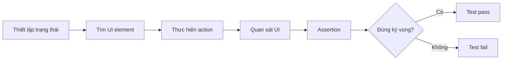

# 016 - Assertion

**Học phần:** 05 - Quality, Release and Portfolio
**Module:** Module 11 - Testing
**Nhóm nội dung:** UI Testing
**Nguồn roadmap:** Testing / UI Testing
**Loại bài:** lesson
**Thứ tự trong module:** 016
**Thời lượng gợi ý:** 30 phút

---

## 1. Tóm tắt

`Assertion` là bước kiểm chứng trong một automated test, dùng để xác nhận rằng trạng thái thực tế của ứng dụng phù hợp với kết quả mong đợi.

Trong UI Testing, thao tác nhấn nút, nhập dữ liệu hoặc mở một màn hình chưa đủ để chứng minh tính năng hoạt động đúng. Test cần một hoặc nhiều assertion để trả lời các câu hỏi như:

* Màn hình mong đợi có thực sự xuất hiện không?
* Text hiển thị có đúng không?
* Button có đang được bật không?
* Loading indicator đã biến mất chưa?
* Sau khi người dùng thực hiện thao tác, UI có chuyển sang đúng state không?

Với Android hiện đại, assertion thường xuất hiện trong:

* Jetpack Compose UI Testing;
* Espresso đối với View-based UI;
* unit test cho ViewModel, Repository hoặc business logic.

Bài học tập trung vào assertion trong UI Testing và cách viết assertion có giá trị, ổn định và phản ánh đúng hành vi người dùng.

## 2. Mục tiêu học tập

Sau bài học, người học có thể:

* Giải thích được vai trò của `Assertion` trong automated testing.
* Phân biệt được action, finder/matcher và assertion.
* Viết assertion cơ bản cho Jetpack Compose UI Testing.
* Viết assertion cơ bản bằng Espresso cho View-based UI.
* Thiết kế assertion dựa trên hành vi quan sát được thay vì chi tiết triển khai nội bộ.
* Phân tích được nguyên nhân khi một assertion thất bại.
* Viết một UI test có cấu trúc Arrange → Act → Assert hoàn chỉnh.

## 3. Vì sao UI test cần assertion?

Giả sử ứng dụng có màn hình đăng nhập.

Một test chỉ thực hiện:

```text
Nhập email
    ↓
Nhập mật khẩu
    ↓
Nhấn Login

```

chưa chứng minh rằng chức năng đăng nhập hoạt động.

Test cần tiếp tục kiểm tra kết quả:

```text
Nhập email
    ↓
Nhập mật khẩu
    ↓
Nhấn Login
    ↓
Kiểm tra màn hình Home xuất hiện
```

Bước cuối chính là assertion.

Có thể mô hình hóa một UI test như sau:



Assertion biến hành vi của test thành một phép kiểm chứng. Nếu không có assertion phù hợp, test có thể chạy thành công về mặt kỹ thuật nhưng không xác nhận được yêu cầu sản phẩm.

## 4. Bản chất của Assertion

Assertion so sánh **actual result** với **expected result**.

Có thể hình dung:

```text
Expected
   ↓
Assertion ← Actual
   ↓
Pass / Fail
```

Ví dụ:

```text
Expected: "Welcome"
Actual:   "Welcome"
→ Pass
```

Ngược lại:

```text
Expected: "Welcome"
Actual:   "Login failed"
→ Fail
```

Trong UI Testing, actual result thường là trạng thái có thể quan sát được từ giao diện:

* element tồn tại;
* element đang hiển thị;
* text có giá trị cụ thể;
* button được enabled hoặc disabled;
* checkbox đang checked;
* một element không còn tồn tại;
* danh sách có đúng số lượng item;
* một màn hình xuất hiện sau interaction.

Một assertion tốt nên trả lời một yêu cầu hoặc hành vi cụ thể của ứng dụng, thay vì kiểm tra những chi tiết không ảnh hưởng tới người dùng.

## 5. Cấu trúc Arrange → Act → Assert

Một cách phổ biến để tổ chức test là mô hình AAA:

```text
Arrange
   ↓
Act
   ↓
Assert
```

**Arrange** chuẩn bị trạng thái ban đầu.

Ví dụ:

* cung cấp fake data;
* mở màn hình;
* cấu hình ViewModel;
* đặt UI vào trạng thái cần kiểm thử.

**Act** mô phỏng hành động.

Ví dụ:

* click;
* nhập text;
* scroll;
* chọn item.

**Assert** kiểm tra kết quả sau hành động.

Ví dụ:

```kotlin
@Test
fun clickingContinue_showsWelcomeMessage() {
    // Arrange
    composeTestRule.setContent {
        LoginScreen()
    }

    // Act
    composeTestRule
        .onNodeWithText("Continue")
        .performClick()

    // Assert
    composeTestRule
        .onNodeWithText("Welcome")
        .assertIsDisplayed()
}
```

Trong ví dụ này, điều quan trọng không phải việc button đã nhận được click, mà là tác động quan sát được của hành động đó: `"Welcome"` xuất hiện trên UI.

Compose Testing cung cấp finder để tìm node, action để tương tác và assertion để kiểm tra node hoặc thuộc tính của node. Các assertion tiện dụng bao gồm `assertExists()`, `assertIsDisplayed()` và các assertion kiểm tra text.

## 6. Assertion trong Jetpack Compose UI Testing

Jetpack Compose UI Testing làm việc với **semantics tree** thay vì trực tiếp thao tác với `View`.

Một flow thường có dạng:

```text
Finder
   ↓
SemanticsNodeInteraction
   ↓
Action hoặc Assertion
```

Ví dụ:

```kotlin
composeTestRule
    .onNodeWithText("Save")
    .assertIsDisplayed()
```

`onNodeWithText("Save")` tìm node phù hợp.

`assertIsDisplayed()` xác nhận node đó thực sự đang được hiển thị trên màn hình. Theo Android Developers, một node được coi là displayed khi nó được compose, được đặt trong layout và ít nhất một phần bounds còn nhìn thấy sau clipping. Assertion sẽ thất bại nếu điều kiện không được đáp ứng.

Một số dạng assertion thường gặp:

| Assertion                | Mục đích                        |
| ------------------------ | ------------------------------- |
| `assertExists()`         | Kiểm tra node tồn tại           |
| `assertDoesNotExist()`   | Kiểm tra node không tồn tại     |
| `assertIsDisplayed()`    | Kiểm tra node đang hiển thị     |
| `assertIsNotDisplayed()` | Kiểm tra node không hiển thị    |
| `assertIsEnabled()`      | Kiểm tra element được bật       |
| `assertIsNotEnabled()`   | Kiểm tra element bị vô hiệu hóa |
| `assertIsSelected()`     | Kiểm tra element đang được chọn |
| `assertTextEquals()`     | So sánh nội dung text           |
| `assertCountEquals()`    | Kiểm tra số lượng node          |

Ví dụ kiểm tra button bị khóa khi form chưa hợp lệ:

```kotlin
composeTestRule
    .onNodeWithText("Submit")
    .assertIsNotEnabled()
```

Ví dụ kiểm tra thông báo:

```kotlin
composeTestRule
    .onNodeWithText("Saved successfully")
    .assertIsDisplayed()
```

Ví dụ kiểm tra một loading indicator đã được loại khỏi UI:

```kotlin
composeTestRule
    .onNodeWithTag("loading")
    .assertDoesNotExist()
```

Đối với collection, Compose Testing cũng hỗ trợ assertion trên nhiều node, chẳng hạn kiểm tra số lượng node phù hợp.

```kotlin
composeTestRule
    .onAllNodesWithTag("product_item")
    .assertCountEquals(5)
```

## 7. Assertion trong Espresso

Đối với ứng dụng sử dụng Android View system, Espresso thường áp dụng pattern:

```text
onView(...)
   ↓
check(...)
   ↓
ViewAssertion
```

Ví dụ:

```kotlin
onView(withText("Welcome"))
    .check(matches(isDisplayed()))
```

Trong đó:

* `onView()` tìm `View`;
* `withText()` là matcher;
* `check()` thực hiện kiểm tra;
* `matches(isDisplayed())` xác nhận trạng thái mong đợi.

Android Developers sử dụng chính pattern `onView(...).check(matches(...))` cho UI test dựa trên Espresso.

Một test hoàn chỉnh có thể là:

```kotlin
@Test
fun continueButton_opensWelcomeScreen() {
    onView(withText("Continue"))
        .perform(click())

    onView(withText("Welcome"))
        .check(matches(isDisplayed()))
}
```

Về ý tưởng, Compose UI Testing và Espresso thực hiện cùng một quy trình:

```text
Tìm element
    ↓
Tương tác
    ↓
Kiểm tra kết quả
```

Khác biệt chủ yếu nằm ở API và mô hình UI mà framework kiểm thử.

## 8. Assertion nên kiểm tra điều gì?

Không phải mọi thuộc tính có thể kiểm tra đều nên được assertion.

Ưu tiên kiểm tra **observable behavior**.

Ví dụ với màn hình đăng nhập, các assertion có giá trị gồm:

* button Login bị disabled khi form chưa hợp lệ;
* progress indicator xuất hiện khi request đang chạy;
* màn hình Home xuất hiện khi đăng nhập thành công;
* error message xuất hiện khi đăng nhập thất bại.

Một test như sau thường có giá trị cao:

```kotlin
composeTestRule
    .onNodeWithText("Login")
    .performClick()

composeTestRule
    .onNodeWithText("Invalid credentials")
    .assertIsDisplayed()
```

Nó kiểm tra trực tiếp trải nghiệm mà người dùng nhận được.

Ngược lại, UI test không nên cố kiểm tra chi tiết implementation như:

```text
ViewModel gọi method X đúng một lần
Repository thay đổi private variable Y
Composable nội bộ được gọi bao nhiêu lần
```

Những chi tiết đó phù hợp hơn với unit test hoặc integration test nếu thực sự cần kiểm chứng.

## 9. Assertion và UI State

Android UI hiện đại thường được xây dựng từ state.

Ví dụ:

```kotlin
sealed interface LoginUiState {
    data object Idle : LoginUiState
    data object Loading : LoginUiState
    data object Success : LoginUiState
    data class Error(val message: String) : LoginUiState
}
```

UI có thể ánh xạ các state thành:

```text
Idle
  ↓
Form đăng nhập

Loading
  ↓
Progress indicator

Success
  ↓
Home screen

Error
  ↓
Error message
```

UI test nên assertion dựa trên biểu hiện của các state đó.

Ví dụ:

```kotlin
composeTestRule
    .onNodeWithTag("loading")
    .assertIsDisplayed()
```

hoặc:

```kotlin
composeTestRule
    .onNodeWithText("Login failed")
    .assertIsDisplayed()
```

Điểm quan trọng là assertion xác nhận **UI được render đúng từ state**, chứ không nhất thiết phải truy cập trực tiếp vào state nội bộ.

Điều này giúp test gần với trải nghiệm thật của người dùng hơn.

## 10. Kiểm tra thay đổi state sau interaction

Một assertion đơn lẻ thường chưa đủ cho các flow có chuyển trạng thái.

Ví dụ, khi người dùng nhập email hợp lệ:

```text
Email rỗng
    ↓
Submit disabled
    ↓
Nhập email
    ↓
Submit enabled
```

Test có thể kiểm tra cả hai trạng thái:

```kotlin
composeTestRule
    .onNodeWithText("Submit")
    .assertIsNotEnabled()

composeTestRule
    .onNodeWithTag("email_input")
    .performTextInput("user@example.com")

composeTestRule
    .onNodeWithText("Submit")
    .assertIsEnabled()
```

Cách này giúp phát hiện lỗi state transition, chẳng hạn:

* state không được cập nhật;
* UI không recomposition đúng;
* validation không chạy;
* button vẫn giữ trạng thái cũ.

## 11. Assertion và Lifecycle

UI Testing thường chạy trên Activity hoặc môi trường instrumented, vì vậy lifecycle có thể ảnh hưởng đến kết quả.

Một tính năng có thể hoạt động ở trạng thái ban đầu nhưng lỗi sau:

* rotate;
* recreate Activity;
* chuyển app xuống background;
* quay lại foreground;
* process hoặc state được khôi phục.

Ví dụ một form cần giữ text sau recreation.

Test cần kiểm chứng kết quả quan sát được sau lifecycle event, thay vì chỉ xác nhận state trước khi recreation.

Về tư duy:

```text
Thiết lập state
     ↓
Lifecycle event
     ↓
UI được tạo lại
     ↓
Assertion
```

Assertion sau lifecycle giúp phát hiện các lỗi như:

* state bị mất;
* UI quay lại trạng thái mặc định;
* dữ liệu hiển thị không đồng bộ;
* navigation state bị sai.

Không phải mọi UI test đều cần kiểm tra lifecycle. Chỉ thêm loại assertion này khi lifecycle thực sự là một phần của yêu cầu tính năng hoặc rủi ro regression.

## 12. Một assertion hay nhiều assertion?

Một test có thể chứa nhiều assertion nếu chúng cùng kiểm tra một hành vi.

Ví dụ đăng nhập thành công:

```kotlin
composeTestRule
    .onNodeWithText("Login")
    .performClick()

composeTestRule
    .onNodeWithTag("login_screen")
    .assertDoesNotExist()

composeTestRule
    .onNodeWithTag("home_screen")
    .assertIsDisplayed()
```

Hai assertion đều phục vụ một kết luận:

> Đăng nhập thành công đưa người dùng từ Login sang Home.

Tuy nhiên, không nên nhồi nhiều hành vi không liên quan vào cùng một test:

```text
Đăng nhập
+ đổi theme
+ thêm sản phẩm
+ logout
+ kiểm tra notification
```

Nếu assertion cuối thất bại, việc xác định hành vi nào gây lỗi sẽ khó hơn.

Một test nên tập trung vào một behavior hoặc một user scenario rõ ràng.

## 13. Viết Assertion ổn định

UI test dễ trở nên flaky nếu assertion phụ thuộc vào yếu tố không ổn định.

Tránh kiểm tra những chi tiết dễ thay đổi mà không ảnh hưởng đến chức năng, chẳng hạn:

* vị trí pixel tuyệt đối khi không thực sự cần;
* text động phụ thuộc thời gian thực;
* dữ liệu mạng thật không được kiểm soát;
* animation timing bằng delay cố định;
* implementation detail của component.

Ví dụ không nên dựa vào:

```kotlin
Thread.sleep(3000)
```

rồi giả định UI chắc chắn đã cập nhật.

Cách tiếp cận tốt hơn là để testing framework đồng bộ với UI hoặc kiểm soát dependency bất đồng bộ bằng fake/test implementation.

Test ổn định thường có:

```text
Input xác định
     ↓
Dependency xác định
     ↓
Action xác định
     ↓
Expected result xác định
```

Kết quả test vì vậy có thể tái lập nhiều lần.

## 14. Lỗi thường gặp

**Hiện tượng:** Test thực hiện click nhưng luôn pass dù tính năng đã hỏng.

**Nguyên nhân:** Test không có assertion kiểm tra kết quả sau interaction.

**Cách xử lý:** Thêm assertion dựa trên outcome của hành động, chẳng hạn màn hình mới, state mới hoặc message mới.

---

**Hiện tượng:** `assertIsDisplayed()` thất bại dù developer nghĩ element tồn tại.

**Nguyên nhân:** Tồn tại trong UI tree không đồng nghĩa với đang hiển thị trên màn hình.

**Cách xử lý:** Xác định test thực sự cần kiểm tra `exists` hay `displayed`.

---

**Hiện tượng:** Finder không tìm thấy Compose node.

**Nguyên nhân:** Matcher không phù hợp với semantics tree hoặc semantics đã được merge.

**Cách xử lý:** Kiểm tra semantics tree, `testTag`, text, `contentDescription` và chỉ sử dụng `useUnmergedTree` khi thực sự cần. Compose Testing cho phép finder hoạt động với merged hoặc unmerged semantics tree.

---

**Hiện tượng:** UI test đôi lúc pass, đôi lúc fail.

**Nguyên nhân:** Test phụ thuộc vào network thật, timer, animation hoặc asynchronous operation không được kiểm soát.

**Cách xử lý:** Kiểm soát dependency, tránh delay cố định và kiểm tra trạng thái ổn định thay vì thời điểm tuyệt đối.

---

**Hiện tượng:** Thay đổi wording nhỏ làm hàng loạt test thất bại.

**Nguyên nhân:** Test dùng text làm selector cho mọi element dù text không phải đặc tính quan trọng của test.

**Cách xử lý:** Dùng semantic property hoặc `testTag` hợp lý cho element cần định danh ổn định.

## 15. Best practices

* Mỗi test nên chứng minh một behavior rõ ràng.
* Assertion nên kiểm tra kết quả mà người dùng có thể quan sát.
* Đặt assertion sau action tạo ra kết quả cần kiểm chứng.
* Dùng nhiều assertion khi chúng cùng mô tả một scenario.
* Không assertion mọi chi tiết chỉ vì framework cho phép.
* Tránh phụ thuộc vào network hoặc dữ liệu không xác định trong UI test.
* Giữ error output đủ rõ để developer nhanh chóng biết expectation nào thất bại.
* Ưu tiên selector phản ánh semantics của UI.
* Tách business logic phức tạp sang unit test thay vì cố kiểm tra tất cả qua UI.
* Kiểm thử cả happy path và failure path đối với flow quan trọng.

## 16. Bài thực hành

Xây dựng một UI test cho màn hình đăng nhập có:

* trường email;
* trường password;
* button `Login`;
* progress indicator;
* error message.

Test scenario:

```text
Nhập thông tin không hợp lệ
        ↓
Nhấn Login
        ↓
Ứng dụng xử lý request
        ↓
Hiển thị "Invalid credentials"
```

Yêu cầu:

1. Tìm email field và password field.
2. Nhập dữ liệu test.
3. Nhấn `Login`.
4. Kiểm tra error message xuất hiện.
5. Kiểm tra màn hình Home không xuất hiện.

Ví dụ hướng triển khai với Compose:

```kotlin
@Test
fun invalidCredentials_showErrorMessage() {
    composeTestRule
        .onNodeWithTag("email_input")
        .performTextInput("user@example.com")

    composeTestRule
        .onNodeWithTag("password_input")
        .performTextInput("wrong-password")

    composeTestRule
        .onNodeWithText("Login")
        .performClick()

    composeTestRule
        .onNodeWithText("Invalid credentials")
        .assertIsDisplayed()

    composeTestRule
        .onNodeWithTag("home_screen")
        .assertDoesNotExist()
}
```

**Kết quả mong đợi:**

* Test pass khi UI hiển thị đúng error state.
* Test fail nếu error message không xuất hiện.
* Test fail nếu ứng dụng chuyển nhầm sang Home.
* Test có thể chạy lặp lại mà không phụ thuộc vào backend thật.

Artifact có thể lưu vào portfolio:

```text
app/src/androidTest/.../LoginScreenTest.kt
```

README ngắn nên mô tả:

* scenario được kiểm thử;
* behavior mà assertion bảo vệ;
* dependency nào được fake;
* failure nào test có thể phát hiện.

## 17. Checklist hoàn thành

* [ ] Giải thích được assertion dùng để làm gì.
* [ ] Phân biệt được action và assertion.
* [ ] Giải thích được Arrange → Act → Assert.
* [ ] Viết được `assertIsDisplayed()` trong Compose UI Testing.
* [ ] Viết được `assertDoesNotExist()` khi cần kiểm tra element biến mất.
* [ ] Viết được `check(matches(...))` với Espresso.
* [ ] Chọn assertion dựa trên user-visible behavior.
* [ ] Tránh assertion vào implementation detail không cần thiết.
* [ ] Nhận biết được assertion có thể bị flaky do asynchronous dependency.
* [ ] Có ít nhất một UI test tự động hoàn chỉnh để đưa vào project hoặc portfolio.

## 18. Câu hỏi tự kiểm tra

1. Vì sao một test chỉ gọi `performClick()` chưa đủ để chứng minh tính năng hoạt động đúng?
2. Khi nào nên dùng `assertExists()` thay vì `assertIsDisplayed()`?
3. Vì sao assertion dựa trên observable behavior thường bền vững hơn assertion dựa trên implementation detail?
4. Nếu UI test đôi lúc pass và đôi lúc fail do dữ liệu mạng, vấn đề chính nằm ở assertion hay ở tính xác định của môi trường test?
5. Sau khi rotate hoặc recreate Activity, assertion nào cần được thêm nếu yêu cầu sản phẩm quy định dữ liệu nhập phải được giữ lại?

## 19. Tổng kết

`Assertion` là phần biến một test từ chuỗi thao tác tự động thành phép kiểm chứng thực sự.

Một UI test có giá trị thường tuân theo logic:

```text
Chuẩn bị trạng thái
       ↓
Thực hiện hành động
       ↓
Quan sát kết quả
       ↓
Assertion
```

Trong Jetpack Compose, assertion được thực hiện trên semantics node thông qua các API như `assertIsDisplayed()`, `assertExists()` hoặc `assertDoesNotExist()`. Với Espresso, pattern phổ biến là `check(matches(...))`.

Điểm quan trọng nhất không phải viết được nhiều assertion, mà là chọn đúng điều cần kiểm chứng: **hành vi và trạng thái UI có ý nghĩa đối với người dùng**. Khi assertion tập trung vào contract của tính năng thay vì chi tiết triển khai, test sẽ dễ hiểu, dễ bảo trì và có giá trị cao hơn trong việc ngăn regression.
