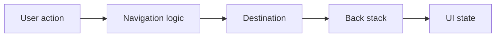
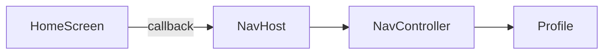
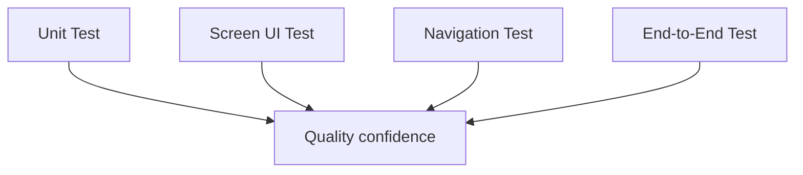

# 018 - Navigation Test

**Học phần:** 05 - Quality, Release and Portfolio
**Module:** Module 11 - Testing
**Nhóm nội dung:** UI Testing
**Nguồn roadmap:** Testing / UI Testing
**Loại bài:** lesson
**Thứ tự trong module:** 018
**Thời lượng gợi ý:** 30 phút

---

## 1. Tóm tắt

`Navigation Test` là nhóm kiểm thử dùng để xác nhận rằng các luồng điều hướng trong ứng dụng Android hoạt động đúng theo hành vi mong đợi của người dùng.

Một ứng dụng có thể render từng màn hình hoàn toàn chính xác nhưng vẫn bị lỗi nghiêm trọng nếu:

* nhấn nút nhưng mở sai màn hình;
* nhấn Back quay về sai vị trí;
* một màn hình bị thêm nhiều lần vào back stack;
* argument truyền sang destination bị sai;
* deep link mở sai destination;
* sau khi đăng nhập vẫn quay lại màn hình đăng nhập;
* state bị mất khi người dùng điều hướng;
* một flow nhiều bước có thể rơi vào trạng thái không hợp lệ.

Vì vậy, mục tiêu của `Navigation Test` không phải kiểm thử lại toàn bộ `Navigation Component`, mà là xác minh **logic điều hướng do chính ứng dụng định nghĩa**: hành động nào phải dẫn đến destination nào, back stack phải thay đổi ra sao và người dùng có đi đúng qua các user flow hay không. Android cung cấp `TestNavHostController` trong artifact `androidx.navigation:navigation-testing` để hỗ trợ kiểm thử các tình huống này. ([Android Developers][1])

---

## 2. Mục tiêu học tập

Sau bài học, người học có thể:

* Giải thích được mục đích của `Navigation Test` trong Android.
* Phân biệt kiểm thử màn hình riêng lẻ với kiểm thử luồng điều hướng.
* Xác định được những hành vi navigation quan trọng cần bảo vệ bằng test.
* Thiết kế composable sao cho logic điều hướng dễ kiểm thử.
* Sử dụng `TestNavHostController` để kiểm tra `NavHost`.
* Kiểm tra destination hiện tại sau một thao tác UI.
* Phân tích được các lỗi liên quan đến back stack, arguments và navigation state.
* Xây dựng một navigation test có thể chạy lặp lại trong local development hoặc CI.

---

## 3. Navigation Test giải quyết vấn đề gì?

Giả sử ứng dụng có flow:

```text
Home
  ↓
Product Detail
  ↓
Checkout
  ↓
Payment Success
```

Từng màn hình có thể vượt qua UI test riêng:

```text
Home            → hiển thị đúng
Product Detail  → hiển thị đúng
Checkout        → hiển thị đúng
Payment Success → hiển thị đúng
```

Nhưng điều đó chưa chứng minh rằng user flow hoàn chỉnh hoạt động.

Ví dụ:

```text
Home
  ↓ click sản phẩm
Checkout
```

Ứng dụng đã bỏ qua `Product Detail`.

Hoặc:

```text
Payment Success
      ↓ Back
Checkout
```

Người dùng có thể vô tình thanh toán lại.

Đây là loại lỗi mà `Navigation Test` cần phát hiện.

Có thể nhìn navigation testing theo chuỗi:



Một navigation test tốt có thể kiểm tra một hoặc nhiều điểm trong chuỗi:

* thao tác nào kích hoạt navigation;
* destination sau navigation;
* route hoặc destination ID;
* arguments;
* back stack;
* trạng thái UI sau khi chuyển màn hình.

---

## 4. Những gì nên kiểm thử

### 4.1. Forward navigation

Đây là trường hợp người dùng thực hiện hành động để đi tới một màn hình mới.

Ví dụ:

```text
Home
  ↓ click Profile
Profile
```

Test cần chứng minh:

```text
Given
Home đang hiển thị

When
Người dùng nhấn Profile

Then
Profile trở thành destination hiện tại
```

### 4.2. Back navigation

Back navigation thường phức tạp hơn forward navigation vì nó liên quan trực tiếp đến back stack.

Ví dụ:

```text
Home
  ↓
Detail
  ↓ Back
Home
```

Test cần xác minh rằng:

* destination phía trước bị loại khỏi stack;
* destination trước đó được khôi phục đúng;
* không xuất hiện màn hình không mong muốn.

Back stack đặc biệt quan trọng với:

* authentication;
* checkout;
* onboarding;
* multi-step form;
* bottom navigation;
* nested navigation graph.

---

## 5. Không kiểm thử framework thay cho logic ứng dụng

`Navigation Component` đã có test riêng ở cấp framework. Ứng dụng không cần viết test chỉ để chứng minh rằng bản thân `NavController.navigate()` hoạt động.

Thay vào đó, hãy kiểm tra:

```text
User interaction
       ↓
Application logic
       ↓
Navigation request
       ↓
Expected destination
```

Ví dụ, test sau có giá trị:

```text
Nhấn "Xem hồ sơ"
→ ứng dụng điều hướng tới Profile
```

Trong khi test kiểu:

```text
Gọi trực tiếp NavController.navigate()
→ kiểm tra NavController navigate được
```

thường ít giá trị hơn vì nó chủ yếu kiểm thử API của thư viện.

Android cũng khuyến nghị tập trung vào tương tác giữa code riêng của ứng dụng và `NavController` thay vì kiểm thử lại hành vi nội bộ của Navigation Component. ([Android Developers][1])

---

## 6. Thiết kế navigation dễ kiểm thử với Jetpack Compose

Một nguyên tắc quan trọng là **không truyền trực tiếp `NavController` sâu vào từng screen composable nếu không cần thiết**.

Không nên:

```kotlin
@Composable
fun HomeScreen(
    navController: NavController
) {
    Button(
        onClick = {
            navController.navigate("profile")
        }
    ) {
        Text("Profile")
    }
}
```

`HomeScreen` lúc này phụ thuộc trực tiếp vào Navigation framework.

Cách tốt hơn là truyền một callback:

```kotlin
@Composable
fun HomeScreen(
    onOpenProfile: () -> Unit
) {
    Button(
        onClick = onOpenProfile
    ) {
        Text("Profile")
    }
}
```

Sau đó kết nối navigation tại `NavHost`:

```kotlin
@Composable
fun AppNavHost(
    navController: NavHostController
) {
    NavHost(
        navController = navController,
        startDestination = "home"
    ) {
        composable("home") {
            HomeScreen(
                onOpenProfile = {
                    navController.navigate("profile")
                }
            )
        }

        composable("profile") {
            ProfileScreen()
        }
    }
}
```

Kiến trúc trở thành:



`HomeScreen` chỉ phát ra ý định:

```text
onOpenProfile()
```

Còn `NavHost` quyết định ý định đó tương ứng với route nào.

Cách tách này giúp:

* test `HomeScreen` mà không cần `NavController`;
* test callback riêng;
* test navigation graph riêng;
* giảm coupling;
* dễ thay đổi cấu trúc navigation.

Đây cũng là cách tổ chức được Android khuyến nghị cho Compose navigation testing. ([Android Developers][2])

---

## 7. Kiểm thử `NavHost` bằng `TestNavHostController`

`TestNavHostController` là phiên bản `NavHostController` dành cho testing.

Nó thuộc artifact:

```text
androidx.navigation:navigation-testing
```

và cung cấp API phục vụ việc kiểm tra navigation state, destination và back stack. ([Android Developers][3])

Với Compose, một cấu hình test điển hình có dạng:

```kotlin
class NavigationTest {

    @get:Rule
    val composeTestRule = createComposeRule()

    private lateinit var navController: TestNavHostController

    @Before
    fun setup() {
        composeTestRule.setContent {
            navController = TestNavHostController(LocalContext.current)

            navController.navigatorProvider.addNavigator(
                ComposeNavigator()
            )

            AppNavHost(
                navController = navController
            )
        }
    }
}
```

Có ba thành phần quan trọng:

```text
ComposeTestRule
      ↓
TestNavHostController
      ↓
AppNavHost
```

`ComposeTestRule` điều khiển UI.

`TestNavHostController` giữ navigation state phục vụ test.

`AppNavHost` là navigation graph thật của ứng dụng.

Android cũng sử dụng mô hình này trong hướng dẫn kiểm thử `NavHost` cho Compose. ([Android Developers][2])

---

## 8. Các navigation test quan trọng

### 8.1. Kiểm tra start destination

Một lỗi cấu hình navigation graph có thể khiến ứng dụng mở nhầm màn hình đầu tiên.

Ví dụ:

```kotlin
@Test
fun appStartsOnHomeScreen() {
    composeTestRule
        .onNodeWithText("Home")
        .assertIsDisplayed()
}
```

Test này kiểm tra theo góc nhìn người dùng:

```text
Khởi động navigation graph
        ↓
Home phải xuất hiện
```

Ngoài kiểm tra UI, có thể kiểm tra destination:

```kotlin
@Test
fun startDestinationIsHome() {
    assertEquals(
        "home",
        navController.currentDestination?.route
    )
}
```

### 8.2. Kiểm tra điều hướng sau thao tác

Giả sử `HomeScreen` có nút:

```text
Open Profile
```

Test:

```kotlin
@Test
fun clickingProfileNavigatesToProfile() {
    composeTestRule
        .onNodeWithText("Open Profile")
        .performClick()

    assertEquals(
        "profile",
        navController.currentDestination?.route
    )
}
```

Test mô hình hóa chính xác hành vi:

```text
Given: Home
When: click Open Profile
Then: current destination = profile
```

Android khuyến nghị khi kiểm thử implementation thực tế nên ưu tiên kích hoạt navigation thông qua thao tác UI, sau đó kiểm tra destination hoặc route hiện tại. ([Android Developers][2])

---

## 9. Kiểm thử kết quả trên UI hay kiểm tra `NavController`?

Có hai chiến lược phổ biến.

### 9.1. Kiểm tra UI destination

Ví dụ:

```kotlin
composeTestRule
    .onNodeWithText("Open Profile")
    .performClick()

composeTestRule
    .onNodeWithText("Profile")
    .assertIsDisplayed()
```

Ưu điểm:

* gần với hành vi thực tế của người dùng;
* ít phụ thuộc implementation;
* test vẫn có giá trị nếu navigation internals thay đổi.

### 9.2. Kiểm tra navigation state

Ví dụ:

```kotlin
composeTestRule
    .onNodeWithText("Open Profile")
    .performClick()

assertEquals(
    "profile",
    navController.currentDestination?.route
)
```

Ưu điểm:

* assertion rõ ràng;
* dễ kiểm tra route;
* hữu ích khi destination có UI giống nhau;
* thuận tiện khi kiểm tra back stack.

Trong nhiều trường hợp, test có thể kết hợp:

```text
User action
    ↓
Kiểm tra navigation state
    ↓
Kiểm tra UI quan trọng
```

Không cần kiểm tra mọi chi tiết UI trong navigation test nếu chúng đã được bảo vệ bởi screen-specific UI tests.

---

## 10. Arguments, back stack và navigation state

### 10.1. Destination arguments

Một ứng dụng thường không chỉ mở màn hình mà còn truyền dữ liệu.

Ví dụ:

```text
Product List
      ↓ productId = 42
Product Detail
```

Navigation test nên phát hiện các lỗi như:

```text
route đúng
argument sai
```

hoặc:

```text
Product 42
→ mở Product 41
```

Không nên chỉ kiểm tra:

```text
Đã vào Detail
```

nếu argument quyết định nội dung của destination.

### 10.2. Back stack

Giả sử flow:

```text
Login
  ↓
Home
```

Sau khi đăng nhập thành công, nhiều ứng dụng mong muốn:

```text
Back
→ không quay lại Login
```

Flow mong muốn có thể là:

```text
Before login

[Login]

After login

[Home]
```

thay vì:

```text
[Login]
[Home]
```

Một navigation test cho authentication cần kiểm tra chính sách back stack này, không chỉ kiểm tra Home đã mở.

`TestNavHostController` cung cấp state phục vụ việc xác minh destination và back stack trong test. ([Android Developers][3])

---

## 11. Navigation Test trong kiến trúc kiểm thử

Navigation testing không thay thế unit test hay screen UI test.

Một chiến lược hợp lý là:



Vai trò có thể phân chia như sau:

| Loại test       | Trách nhiệm chính                       |
| --------------- | --------------------------------------- |
| Unit Test       | Business logic, state transformation    |
| Screen UI Test  | UI của một màn hình                     |
| Navigation Test | Quan hệ giữa action và destination      |
| End-to-End Test | User flow hoàn chỉnh qua nhiều hệ thống |

Ví dụ với checkout:

```text
Unit test
→ tính tổng tiền đúng

Screen UI test
→ nút Pay hiển thị đúng

Navigation test
→ Pay thành công dẫn tới Success

End-to-End test
→ chọn sản phẩm → checkout → thanh toán → hoàn thành
```

---

## 12. Những trường hợp nên có Navigation Test

Navigation test đặc biệt hữu ích cho:

* authentication flow;
* onboarding;
* checkout;
* payment;
* multi-step form;
* bottom navigation;
* nested navigation;
* deep link;
* conditional navigation;
* route dựa trên user state;
* màn hình yêu cầu quyền truy cập;
* flow có nhiều destination sử dụng chung dữ liệu;
* flow cần kiểm soát `popUpTo`;
* flow không được phép quay lại destination cũ.

Một rule thực tế là:

> Nếu việc đi sai destination có thể làm user không hoàn thành nhiệm vụ chính, navigation đó nên được bảo vệ bằng test.

---

## 13. Lỗi thường gặp

**Hiện tượng:** Test click vào button nhưng destination không thay đổi.
**Nguyên nhân:** callback navigation chưa được nối đúng trong `NavHost`.
**Cách xử lý:** kiểm tra callback của screen và lời gọi `navigate()`.

**Hiện tượng:** Compose navigation test không hoạt động với `TestNavHostController`.
**Nguyên nhân:** chưa đăng ký `ComposeNavigator`.
**Cách xử lý:** thêm navigator tương ứng vào `navigatorProvider`.

```kotlin
navController.navigatorProvider.addNavigator(
    ComposeNavigator()
)
```

**Hiện tượng:** Test destination đúng nhưng app vẫn có bug khi nhấn Back.
**Nguyên nhân:** chỉ kiểm tra forward navigation mà không kiểm tra back stack.
**Cách xử lý:** thêm test cho `popBackStack()`, Back button hoặc chính sách `popUpTo`.

**Hiện tượng:** Navigation test rất khó viết.
**Nguyên nhân:** screen nhận trực tiếp `NavController` và chứa quá nhiều navigation logic.
**Cách xử lý:** truyền callback như `onOpenProfile`, `onCheckout` hoặc `onBack`.

**Hiện tượng:** Test phụ thuộc quá nhiều vào route string.
**Nguyên nhân:** assertion gắn chặt với implementation.
**Cách xử lý:** khi phù hợp, kiểm tra cả hành vi UI hoặc sử dụng cơ chế route có kiểu của kiến trúc Navigation hiện tại.

---

## 14. Best practices

* Ưu tiên kiểm tra **user behavior** thay vì implementation nội bộ.
* Giữ navigation logic gần `NavHost`, không phân tán khắp các composable.
* Truyền callback navigation vào screen thay vì truyền toàn bộ `NavController`.
* Kiểm tra các flow quan trọng trước các route ít rủi ro.
* Không chỉ test forward navigation; kiểm tra cả Back.
* Kiểm tra argument khi destination phụ thuộc argument.
* Kiểm tra back stack với authentication, onboarding và transaction flow.
* Không dùng navigation test để kiểm tra lại toàn bộ UI của destination.
* Đặt tên test theo hành vi.

Ví dụ:

```kotlin
fun clickingProfileNavigatesToProfile()
```

tốt hơn:

```kotlin
fun navigationTest1()
```

Tên test nên cho phép đọc như specification:

```text
clickingProfileNavigatesToProfile
paymentSuccessRemovesCheckoutFromBackStack
backFromDetailsReturnsToProductList
unauthenticatedUserIsRedirectedToLogin
```

---

## 15. Bài thực hành

Xây dựng một navigation flow nhỏ:

```text
Home
  ↓ Open Profile
Profile
  ↓ Back
Home
```

Ứng dụng cần có:

```kotlin
@Composable
fun HomeScreen(
    onOpenProfile: () -> Unit
)
```

và:

```kotlin
@Composable
fun ProfileScreen()
```

Cấu hình navigation:

```kotlin
@Composable
fun AppNavHost(
    navController: NavHostController
) {
    NavHost(
        navController = navController,
        startDestination = "home"
    ) {
        composable("home") {
            HomeScreen(
                onOpenProfile = {
                    navController.navigate("profile")
                }
            )
        }

        composable("profile") {
            ProfileScreen()
        }
    }
}
```

Viết tối thiểu ba test:

```text
Test 1
App mở tại Home.

Test 2
Nhấn Open Profile → Profile xuất hiện.

Test 3
Từ Profile nhấn Back → quay về Home.
```

**Kết quả mong đợi:**

* navigation graph chạy được trong test;
* thao tác UI kích hoạt navigation;
* destination được assertion tự động;
* test có thể chạy lại mà không cần kiểm tra thủ công.

---

## 16. Artifact cho portfolio

Một artifact nhỏ nhưng có giá trị có thể gồm:

```text
app/
└── src/
    ├── main/
    │   └── ...
    └── androidTest/
        └── ...
            └── NavigationTest.kt
```

README nên mô tả ngắn:

```text
Navigation flow được kiểm thử:
Home → Profile → Back → Home

Các failure được bảo vệ:
- button không navigate;
- sai destination;
- back stack sai;
- flow bị phá khi refactor navigation graph.
```

Có thể bổ sung screenshot hoặc kết quả test:

```text
NavigationTest
✓ appStartsOnHomeScreen
✓ clickingProfileNavigatesToProfile
✓ backFromProfileReturnsToHome
```

Điểm quan trọng của artifact không phải số lượng test mà là chứng minh rằng navigation behavior đã trở thành **một quality check lặp lại được**.

---

## 17. Checklist hoàn thành

* [ ] Giải thích được `Navigation Test` kiểm tra điều gì.
* [ ] Phân biệt được screen UI test và navigation test.
* [ ] Xác định được start destination cần kiểm tra.
* [ ] Kiểm tra được navigation sau một user action.
* [ ] Biết sử dụng `TestNavHostController`.
* [ ] Biết vai trò của `ComposeNavigator` trong Compose navigation test.
* [ ] Thiết kế screen nhận navigation callback thay vì phụ thuộc trực tiếp vào `NavController` khi phù hợp.
* [ ] Kiểm tra được ít nhất một trường hợp Back.
* [ ] Nhận biết khi nào cần kiểm tra arguments và back stack.
* [ ] Có ít nhất một navigation test chạy tự động trong sample app.
* [ ] Có artifact hoặc README mô tả lỗi mà test có thể phát hiện.

---

## 18. Câu hỏi tự kiểm tra

1. Vì sao một ứng dụng có đầy đủ UI test cho từng màn hình vẫn có thể cần `Navigation Test`?
2. Vì sao truyền callback navigation vào composable thường dễ kiểm thử hơn truyền trực tiếp `NavController`?
3. Khi nào chỉ kiểm tra destination hiện tại là chưa đủ?
4. Vì sao authentication và payment flow cần chú ý đặc biệt tới back stack?
5. Một navigation test nên ưu tiên gọi trực tiếp `navigate()` hay kích hoạt navigation thông qua hành động của người dùng? Vì sao?

---

## 19. Tổng kết

`Navigation Test` bảo vệ **mối liên hệ giữa hành động của người dùng và luồng di chuyển trong ứng dụng**.

Trọng tâm của bài không phải chứng minh Navigation framework hoạt động, mà là xác minh logic riêng của ứng dụng:

```text
Action đúng
   ↓
Destination đúng
   ↓
Argument đúng
   ↓
Back stack đúng
   ↓
User flow đúng
```

Trong Jetpack Compose, việc tách screen khỏi `NavController` thông qua callback giúp navigation dễ kiểm thử hơn. `TestNavHostController` có thể được sử dụng cùng UI test để chạy navigation graph và kiểm tra destination hoặc back stack. ([Android Developers][2])

Khi những flow quan trọng như login, onboarding, checkout hay payment được bảo vệ bằng navigation test tự động, các thay đổi navigation graph hoặc refactor UI sẽ có feedback sớm hơn và giảm đáng kể nguy cơ tạo regression trước khi release.

[1]: https://developer.android.com/guide/navigation/testing/fragments?utm_source=chatgpt.com "Test fragment navigation  |  App architecture  |  Android Developers"
[2]: https://developer.android.com/guide/navigation/testing/compose?utm_source=chatgpt.com "Test Compose navigation  |  App architecture  |  Android Developers"
[3]: https://developer.android.com/reference/androidx/navigation/testing/TestNavHostController?utm_source=chatgpt.com "TestNavHostController  |  API reference  |  Android Developers"
