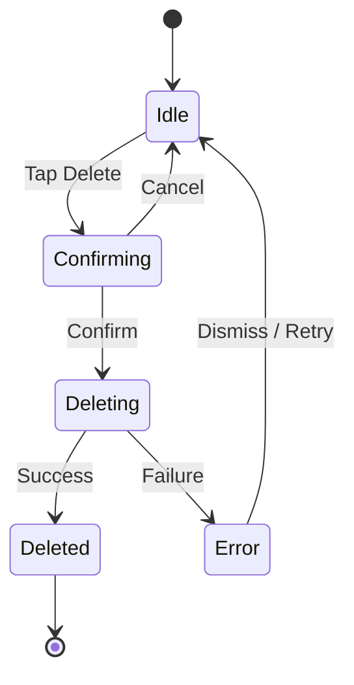
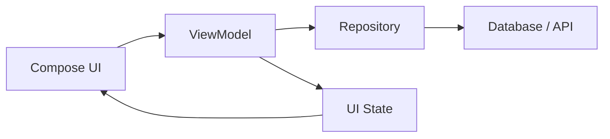

# 019 - Delete Flow Test

**Học phần:** 05 - Quality, Release and Portfolio
**Module:** Module 11 - Testing
**Nhóm nội dung:** UI Testing
**Nguồn roadmap:** Testing / UI Testing
**Loại bài:** lesson
**Thứ tự trong module:** 019
**Thời lượng gợi ý:** 30 phút

---

## 1. Tóm tắt

Xóa dữ liệu là một user flow có rủi ro cao vì kết quả thường làm thay đổi trạng thái ứng dụng và có thể khiến dữ liệu biến mất vĩnh viễn. Một nút `Delete` hoạt động đúng về mặt giao diện chưa đủ; ứng dụng còn phải xử lý đúng bước xác nhận, gọi tầng dữ liệu, cập nhật UI, phản hồi khi thất bại và ngăn những hành vi ngoài ý muốn như xóa nhiều lần.

`Delete Flow Test` là cách kiểm thử toàn bộ luồng xóa từ góc nhìn người dùng thay vì chỉ kiểm tra riêng một hàm `delete()`.

Một luồng điển hình có thể được mô hình hóa như sau:

```text
Người dùng chọn Delete
        ↓
Hiển thị xác nhận
        ↓
Người dùng Confirm / Cancel
        ↓
ViewModel xử lý intent
        ↓
Repository thực hiện xóa
        ↓
State được cập nhật
        ↓
UI phản ánh kết quả
```

Bài học tập trung vào cách xác định các trạng thái quan trọng, thiết kế test case và xây dựng UI test có khả năng phát hiện lỗi thực tế trong delete flow của ứng dụng Android.

## 2. Mục tiêu học tập

Sau khi hoàn thành bài này, người học có thể:

* Giải thích được phạm vi của một `Delete Flow Test`.
* Phân biệt kiểm thử hành động xóa với kiểm thử một hàm `delete()` đơn lẻ.
* Xác định được các trạng thái cần kiểm thử trong một delete flow.
* Thiết kế test case cho `Confirm`, `Cancel`, thành công và thất bại.
* Sử dụng `Fake Repository` để kiểm soát kết quả của thao tác xóa.
* Kiểm tra được sự thay đổi của UI sau khi dữ liệu bị xóa.
* Phát hiện các lỗi liên quan đến loading state, duplicate action và error handling.
* Xây dựng một automated test có thể chạy lặp lại trong quá trình phát triển và CI.

## 3. Delete Flow Test kiểm tra điều gì?

Giả sử màn hình chi tiết một ghi chú có nút xóa:

```text
NoteDetailScreen
      ↓
Delete
      ↓
Confirmation Dialog
      ↓
Confirm
      ↓
deleteNote(id)
      ↓
Database / API
      ↓
Success hoặc Failure
```

Nếu chỉ unit test:

```kotlin
repository.deleteNote(noteId)
```

ta mới kiểm tra một phần rất nhỏ của hành vi.

Một delete flow hoàn chỉnh còn chứa:

* người dùng có thực sự kích hoạt thao tác xóa hay không;
* confirmation dialog có xuất hiện đúng lúc hay không;
* chọn `Cancel` có giữ nguyên dữ liệu hay không;
* chọn `Confirm` có gọi đúng hành động xóa hay không;
* UI có khóa thao tác trong khi đang xử lý hay không;
* dữ liệu có biến mất sau khi xóa thành công hay không;
* màn hình có điều hướng đúng hay không;
* lỗi từ storage hoặc network có được phản ánh cho người dùng hay không.

Vì vậy:

> `Delete Flow Test` kiểm tra chuỗi hành vi của hệ thống khi người dùng thực hiện thao tác xóa, từ UI interaction đến trạng thái cuối cùng của ứng dụng.

## 4. Mô hình trạng thái của delete flow

Một delete flow nên được xem như một state transition thay vì chỉ là một nút bấm.



Các trạng thái quan trọng gồm:

* `Idle`: dữ liệu đang hiển thị bình thường.
* `Confirming`: ứng dụng chờ người dùng xác nhận.
* `Deleting`: thao tác xóa đang được xử lý.
* `Deleted`: dữ liệu đã được xóa thành công.
* `Error`: thao tác xóa thất bại.

Cách tư duy theo state giúp test không bỏ sót những nhánh quan trọng. Nếu chỉ viết test cho đường đi thành công:

```text
Delete → Confirm → Success
```

thì các nhánh `Cancel` và `Failure` vẫn chưa được bảo vệ.

## 5. Những test case cốt lõi

### 5.1. Nhánh Cancel

Test cần chứng minh rằng việc mở confirmation dialog không tự động làm thay đổi dữ liệu.

Kịch bản:

```text
Given
    Item đang tồn tại

When
    Người dùng nhấn Delete
    Confirmation dialog xuất hiện
    Người dùng nhấn Cancel

Then
    Dialog đóng
    Item vẫn tồn tại
    Repository không nhận lệnh delete
```

Đây là test quan trọng vì delete flow phải đảm bảo người dùng có thể rút lại thao tác trước khi dữ liệu bị thay đổi.

### 5.2. Nhánh Confirm

Kịch bản:

```text
Given
    Item đang tồn tại

When
    Người dùng nhấn Delete
    Người dùng xác nhận

Then
    Delete action được gửi đúng một lần
    Repository xóa đúng item
    UI cập nhật sang trạng thái sau khi xóa
```

Test không nên chỉ kiểm tra dialog biến mất. Nó cần xác nhận hậu quả thực sự của hành động.

## 6. Kiến trúc giúp delete flow dễ kiểm thử

Một kiến trúc phổ biến có thể tổ chức như sau:



UI chỉ phát ra intent như:

```text
DeleteClicked
ConfirmDelete
CancelDelete
```

`ViewModel` quyết định state transition và gọi `Repository`.

`Repository` chịu trách nhiệm thao tác với nguồn dữ liệu.

Trong test, repository thật có thể được thay bằng `Fake Repository`:

```text
UI Test
   ↓
ViewModel
   ↓
Fake Repository
```

Điều này mang lại hai lợi ích:

* không cần database hoặc backend thật;
* test có thể chủ động tạo cả trường hợp thành công lẫn thất bại.

## 7. Thiết kế UI state cho thao tác xóa

Một UI state tối thiểu có thể chứa:

```kotlin
data class DetailUiState(
    val isDeleteDialogVisible: Boolean = false,
    val isDeleting: Boolean = false,
    val deleteError: String? = null
)
```

Các trường này thể hiện trạng thái mà UI cần render.

Ví dụ:

```kotlin
fun onDeleteClicked() {
    _uiState.update {
        it.copy(isDeleteDialogVisible = true)
    }
}

fun onDeleteCancelled() {
    _uiState.update {
        it.copy(isDeleteDialogVisible = false)
    }
}
```

Khi người dùng xác nhận:

```kotlin
fun onDeleteConfirmed() {
    viewModelScope.launch {
        _uiState.update {
            it.copy(
                isDeleteDialogVisible = false,
                isDeleting = true,
                deleteError = null
            )
        }

        runCatching {
            repository.deleteNote(noteId)
        }.onSuccess {
            _uiState.update {
                it.copy(isDeleting = false)
            }

            _events.emit(DetailEvent.Deleted)
        }.onFailure {
            _uiState.update {
                it.copy(
                    isDeleting = false,
                    deleteError = "Không thể xóa dữ liệu"
                )
            }
        }
    }
}
```

Điểm cần kiểm thử không chỉ là `repository.deleteNote()` được gọi mà còn là state trước, trong và sau thao tác.

## 8. Fake Repository cho Delete Flow Test

Một fake đơn giản có thể lưu lại các ID đã bị yêu cầu xóa:

```kotlin
class FakeNoteRepository : NoteRepository {

    val deletedIds = mutableListOf<Long>()

    var deleteShouldFail = false

    override suspend fun deleteNote(id: Long) {
        if (deleteShouldFail) {
            throw IllegalStateException("Delete failed")
        }

        deletedIds += id
    }
}
```

Test có thể dùng:

```kotlin
fakeRepository.deleteShouldFail = false
```

để mô phỏng thành công.

Hoặc:

```kotlin
fakeRepository.deleteShouldFail = true
```

để kiểm tra error flow.

Không nên gọi API production trong UI test cho một flow như thế này nếu mục tiêu là kiểm tra hành vi của ứng dụng. Backend thật làm test:

* chậm hơn;
* khó lặp lại;
* phụ thuộc mạng;
* khó tạo deterministic failure;
* dễ gây dữ liệu rác.

## 9. Test confirmation dialog

Giả sử các thành phần UI có semantic identifier:

```kotlin
Modifier.testTag("delete_button")
Modifier.testTag("delete_dialog")
Modifier.testTag("confirm_delete_button")
Modifier.testTag("cancel_delete_button")
```

Một test cho dialog có thể bắt đầu như sau:

```kotlin
@Test
fun clickDelete_showsConfirmationDialog() {
    composeTestRule
        .onNodeWithTag("delete_button")
        .performClick()

    composeTestRule
        .onNodeWithTag("delete_dialog")
        .assertIsDisplayed()
}
```

Test này bảo vệ hành vi:

```text
Delete click
    ↓
Không xóa ngay
    ↓
Hiển thị bước xác nhận
```

Điều này đặc biệt quan trọng đối với destructive action.

## 10. Test Cancel flow

Cancel flow phải chứng minh rằng repository không bị thay đổi.

Ví dụ logic mong đợi:

```kotlin
@Test
fun cancelDelete_keepsItemUntouched() {
    composeTestRule
        .onNodeWithTag("delete_button")
        .performClick()

    composeTestRule
        .onNodeWithTag("cancel_delete_button")
        .performClick()

    composeTestRule
        .onNodeWithTag("delete_dialog")
        .assertDoesNotExist()

    assert(fakeRepository.deletedIds.isEmpty())
}
```

Nếu test thất bại và `deletedIds` đã chứa dữ liệu, ứng dụng đang có lỗi nghiêm trọng:

```text
Delete click
    ↓
Data bị xóa trước Confirm
```

Confirmation dialog lúc đó chỉ còn mang tính hình thức.

## 11. Test successful delete flow

Một success flow có thể kiểm tra ba lớp hành vi:

```text
Interaction
    ↓
Data effect
    ↓
UI effect
```

Ví dụ:

```kotlin
@Test
fun confirmDelete_deletesCorrectItem() {
    composeTestRule
        .onNodeWithTag("delete_button")
        .performClick()

    composeTestRule
        .onNodeWithTag("confirm_delete_button")
        .performClick()

    assert(fakeRepository.deletedIds == listOf(42L))
}
```

Điểm quan trọng là phải kiểm tra đúng identifier.

Test yếu:

```kotlin
assert(fakeRepository.deletedIds.isNotEmpty())
```

Test mạnh hơn:

```kotlin
assert(fakeRepository.deletedIds == listOf(42L))
```

Test thứ hai có thể phát hiện cả lỗi xóa nhầm item.

## 12. Kiểm tra UI sau khi xóa

Thao tác xóa thành công thường kéo theo một trong các kết quả:

* item biến mất khỏi danh sách;
* màn hình detail được đóng;
* ứng dụng điều hướng về màn hình trước;
* snackbar thông báo thành công xuất hiện.

Ví dụ đối với danh sách:

```kotlin
composeTestRule
    .onNodeWithText("Ghi chú cần xóa")
    .assertDoesNotExist()
```

Nếu flow dùng navigation, không nên chỉ kiểm tra repository.

Test cần bảo vệ cả trải nghiệm:

```text
Confirm Delete
      ↓
Repository success
      ↓
Detail screen đóng
      ↓
List screen xuất hiện
      ↓
Item không còn tồn tại
```

## 13. Test khi thao tác xóa thất bại

Delete flow không nên giả định storage hoặc network luôn thành công.

Có thể mô phỏng lỗi:

```kotlin
fakeRepository.deleteShouldFail = true
```

Sau đó thực hiện delete:

```kotlin
@Test
fun deleteFails_showsErrorAndKeepsUserOnScreen() {
    fakeRepository.deleteShouldFail = true

    composeTestRule
        .onNodeWithTag("delete_button")
        .performClick()

    composeTestRule
        .onNodeWithTag("confirm_delete_button")
        .performClick()

    composeTestRule
        .onNodeWithText("Không thể xóa dữ liệu")
        .assertIsDisplayed()
}
```

Một failure flow tốt phải tránh tình trạng:

```text
Delete failed
      ↓
UI vẫn giả vờ item đã bị xóa
```

Nếu operation thất bại, application state và displayed state phải nhất quán.

## 14. Loading state và duplicate delete

Một lỗi dễ bỏ qua là người dùng nhấn nút xác nhận nhiều lần.

```text
Confirm
Confirm
Confirm
   ↓
3 delete requests
```

Điều này đặc biệt nguy hiểm nếu thao tác phía sau không hoàn toàn idempotent.

Trong lúc `isDeleting == true`, nút xác nhận có thể bị disable:

```kotlin
Button(
    onClick = onConfirmDelete,
    enabled = !uiState.isDeleting
) {
    Text("Xóa")
}
```

Test cần xác minh rằng thao tác không được gửi nhiều lần.

Ví dụ điều kiện mong đợi:

```kotlin
assert(fakeRepository.deletedIds.size == 1)
```

Một delete flow ổn định nên đảm bảo:

```text
Một user action hợp lệ
        ↓
Một delete operation
```

## 15. Các lỗi thường gặp

| Hiện tượng                             | Nguyên nhân có thể                         | Cách xử lý                                      |
| -------------------------------------- | ------------------------------------------ | ----------------------------------------------- |
| Item bị xóa ngay khi nhấn `Delete`     | Logic xóa đặt trước confirmation           | Chỉ gọi delete khi nhận `ConfirmDelete`         |
| Nhấn `Cancel` nhưng item vẫn biến mất  | State hoặc callback bị xử lý sai           | Test riêng nhánh Cancel                         |
| Item xóa khỏi DB nhưng vẫn còn trên UI | UI state không được cập nhật               | Quan sát lại nguồn dữ liệu hoặc cập nhật state  |
| UI điều hướng dù delete thất bại       | Navigation xảy ra trước kết quả repository | Chỉ phát `Deleted` event sau success            |
| Có nhiều request delete                | Nút vẫn clickable trong loading            | Disable action khi `isDeleting`                 |
| Test lúc pass lúc fail                 | Dùng delay hoặc backend thật               | Dùng fake và synchronization của test framework |
| Xóa nhầm item                          | ID truyền từ UI sai                        | Assert chính xác ID trong fake                  |
| Lỗi không được hiển thị                | Failure bị swallow                         | Đưa failure vào UI state hoặc event             |

## 16. Những điều không nên làm trong UI test

Không nên dùng delay tùy ý:

```kotlin
Thread.sleep(2000)
```

Cách này làm test:

* chậm;
* không ổn định;
* phụ thuộc tốc độ thiết bị;
* dễ tạo flaky test.

Cũng không nên xác minh implementation detail không liên quan tới hành vi người dùng.

Ví dụ UI test không cần biết internal function cụ thể tên gì nếu contract là:

```text
Người dùng xác nhận
        ↓
Item bị xóa
        ↓
UI chuyển sang trạng thái đúng
```

Test nên ưu tiên observable behavior.

## 17. Delete flow và configuration change

Nếu confirmation dialog hoặc loading state nằm trong `ViewModel` state, configuration change không nên làm mất logic đang diễn ra một cách bất thường.

Một tình huống cần cân nhắc:

```text
User mở Delete Dialog
        ↓
Thiết bị rotate
        ↓
UI được tạo lại
```

Ứng dụng cần có hành vi nhất quán theo thiết kế.

Điều quan trọng hơn là thao tác xóa đang chạy không được vô tình kích hoạt lại chỉ vì UI được recreate.

Không nên đặt destructive operation trực tiếp trong logic render:

```text
state == Deleting
       ↓
Composable gọi repository.delete()
```

Side effect phải được kiểm soát ở tầng thích hợp như `ViewModel`.

## 18. Chiến lược test hợp lý

Không phải mọi thứ đều cần UI test.

Có thể chia trách nhiệm:

```text
Unit Test
├── state transition
├── repository interaction
└── error handling

UI Test
├── click Delete
├── confirmation dialog
├── Cancel
├── Confirm
└── visible result

Integration Test
├── Repository
└── Database
```

Cách phân tầng này giúp test suite vừa nhanh vừa có độ bao phủ tốt.

UI test tập trung vào câu hỏi:

> Khi người dùng thực hiện hành động này, ứng dụng có phản ứng đúng hay không?

## 19. Bài thực hành

Xây dựng automated test cho delete flow của một màn hình quản lý ghi chú.

Ứng dụng có:

* danh sách ghi chú;
* màn hình chi tiết;
* nút `Delete`;
* confirmation dialog;
* `NoteRepository`.

Hãy triển khai các test sau:

1. Nhấn `Delete` phải mở confirmation dialog.
2. Nhấn `Cancel` phải đóng dialog và không xóa dữ liệu.
3. Nhấn `Confirm` phải xóa đúng `noteId`.
4. Sau khi xóa thành công, item không còn xuất hiện.
5. Khi repository trả lỗi, UI phải hiển thị trạng thái lỗi.
6. Trong lúc đang xóa, không được gửi nhiều delete request.

**Artifact cần tạo:**

* một `FakeNoteRepository`;
* một file UI test cho delete flow;
* kết quả chạy test thành công;
* ghi chú ngắn mô tả lỗi mà từng test có thể phát hiện.

## 20. Checklist hoàn thành

* [ ] Giải thích được `Delete Flow Test` kiểm tra phạm vi nào.
* [ ] Xác định được các trạng thái `Idle`, `Confirming`, `Deleting`, `Deleted` và `Error`.
* [ ] Kiểm thử được confirmation dialog.
* [ ] Kiểm thử được nhánh `Cancel`.
* [ ] Kiểm thử được nhánh `Confirm`.
* [ ] Xác minh đúng item được xóa.
* [ ] Kiểm thử được failure flow.
* [ ] Ngăn được duplicate delete action.
* [ ] Kiểm tra được UI sau khi delete thành công.
* [ ] Không phụ thuộc vào backend production trong UI test.
* [ ] Có automated test có thể chạy lặp lại.

## 21. Câu hỏi tự kiểm tra

1. Vì sao test trực tiếp `repository.deleteNote()` chưa đủ để được xem là một `Delete Flow Test`?
2. Nhánh `Cancel` bảo vệ ứng dụng khỏi loại lỗi nào?
3. Vì sao cần kiểm tra chính xác ID của item bị xóa thay vì chỉ kiểm tra rằng repository đã nhận một lệnh delete?
4. Tại sao navigation nên xảy ra sau khi delete operation thành công?
5. Duplicate delete request có thể xuất hiện trong tình huống nào và nên được ngăn chặn ra sao?

## 22. Tổng kết

`Delete Flow Test` bảo vệ một trong những thao tác có rủi ro cao nhất của ứng dụng: thay đổi hoặc loại bỏ dữ liệu thông qua hành động của người dùng.

Một delete flow đáng tin cậy không chỉ cần kiểm tra rằng hàm xóa chạy được. Test phải bao phủ toàn bộ chuỗi:

```text
Delete
   ↓
Confirm / Cancel
   ↓
Loading
   ↓
Repository
   ↓
Success / Failure
   ↓
UI State
```

Ba nguyên tắc quan trọng nhất là:

* kiểm tra cả nhánh thành công và nhánh thất bại;
* kiểm tra observable behavior thay vì chỉ implementation detail;
* sử dụng fake dependency để test nhanh, deterministic và có thể chạy lặp lại.

Khi delete flow được bảo vệ bằng automated test, những thay đổi ở UI, `ViewModel`, `Repository` hoặc data layer ít có khả năng tạo regression khiến người dùng mất dữ liệu hoặc gặp trạng thái ứng dụng không nhất quán.
