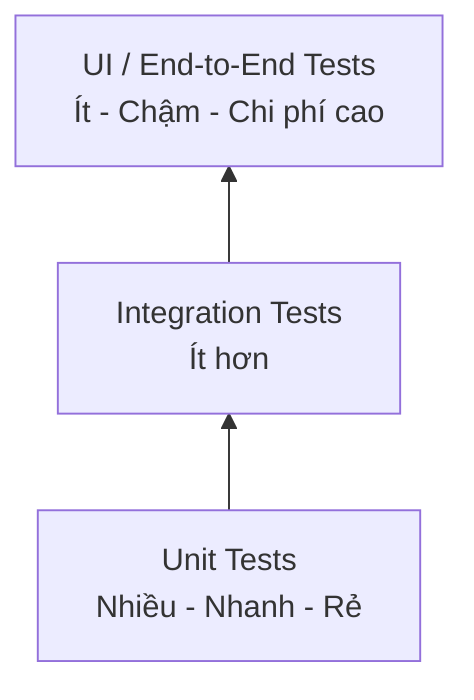
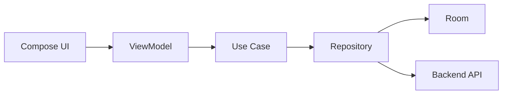
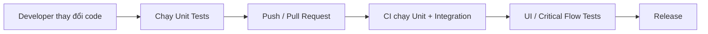

# 020 - Test Pyramid

**Học phần:** 05 - Quality, Release and Portfolio
**Module:** Module 11 - Testing
**Nhóm nội dung:** Testing Strategy
**Nguồn roadmap:** Testing / Testing Strategy
**Loại bài:** lesson
**Thứ tự trong module:** 020
**Thời lượng gợi ý:** 30 phút

---

## 1. Tóm tắt

`Test Pyramid` là mô hình chiến lược giúp đội phát triển phân bổ các loại kiểm thử tự động theo chi phí, tốc độ và phạm vi kiểm chứng.

Thay vì cố gắng kiểm thử mọi hành vi của ứng dụng bằng UI test, Test Pyramid khuyến khích:

* xây dựng nhiều test nhỏ, nhanh và ổn định ở tầng thấp;
* sử dụng ít test tích hợp hơn để kiểm tra sự phối hợp giữa các thành phần;
* chỉ giữ một số lượng nhỏ UI hoặc end-to-end test cho các luồng người dùng quan trọng.

Trong Android, tư duy này đặc biệt hữu ích vì UI test chạy trên emulator hoặc thiết bị thường chậm và dễ bị ảnh hưởng bởi lifecycle, animation, network, database hoặc trạng thái hệ thống. Nếu logic nghiệp vụ có thể được kiểm chứng bằng local test trên JVM, việc đưa toàn bộ kiểm thử lên thiết bị sẽ làm feedback loop chậm hơn mà không nhất thiết tăng chất lượng tương ứng.

Mục tiêu của Test Pyramid không phải tạo ra một tỷ lệ test cứng nhắc, mà là xây dựng một hệ thống kiểm thử có khả năng phát hiện lỗi sớm, chạy lặp lại được và hỗ trợ release an toàn.

## 2. Mục tiêu học tập

Sau bài học, người học có thể:

* Giải thích được mục đích và cấu trúc của `Test Pyramid`.
* Phân biệt được unit test, integration test và UI/end-to-end test trong ứng dụng Android.
* Lựa chọn tầng kiểm thử phù hợp cho từng loại hành vi.
* Giải thích được vì sao không nên kiểm thử toàn bộ ứng dụng bằng UI test.
* Thiết kế một test strategy cơ bản cho ứng dụng Android có `ViewModel`, `Repository`, database và network.
* Tổ chức test để tạo feedback loop nhanh trên máy local và CI.
* Xác định được những luồng người dùng quan trọng cần được bảo vệ trước khi release.

## 3. Vì sao cần Test Pyramid?

Một ứng dụng Android có thể chứa nhiều lớp:

```text
UI
↓
ViewModel
↓
Use Case
↓
Repository
↓
Database / Network / Local Storage
```

Nếu mọi hành vi đều được kiểm thử thông qua UI, mỗi test có thể phải:

1. Khởi động ứng dụng.
2. Tạo hoặc khôi phục state.
3. Điều hướng đến màn hình cần kiểm thử.
4. Thao tác với UI.
5. Chờ coroutine, database hoặc network hoàn thành.
6. Kiểm tra nội dung hiển thị.
7. Dọn dữ liệu cho lần chạy tiếp theo.

Một lỗi nhỏ trong môi trường chạy, animation, timing hoặc dữ liệu cũng có thể khiến test thất bại dù logic nghiệp vụ vẫn đúng.

Ngược lại, nếu logic được tách khỏi Android framework, một test có thể chỉ cần:

```text
Input
↓
Gọi function
↓
Nhận output
↓
Assertion
```

Test như vậy thường:

* nhanh hơn;
* ổn định hơn;
* dễ debug hơn;
* dễ chạy hàng trăm hoặc hàng nghìn lần;
* phù hợp với CI.

Test Pyramid giải quyết bài toán cân bằng giữa **độ tin cậy của kiểm thử** và **chi phí thực thi kiểm thử**.

## 4. Cấu trúc của Test Pyramid

Mô hình cơ bản có ba tầng:



Phần đáy chứa nhiều test nhất vì đây là các test có phạm vi nhỏ và feedback nhanh.

Tầng giữa kiểm tra cách nhiều thành phần phối hợp với nhau.

Phần đỉnh chỉ nên chứa số lượng nhỏ các test bao phủ những hành trình quan trọng của người dùng.

Đi từ dưới lên trên, thông thường:

* phạm vi kiểm thử tăng;
* số thành phần thật tham gia tăng;
* thời gian chạy tăng;
* khả năng phát sinh lỗi môi trường tăng;
* chi phí bảo trì tăng.

Đồng thời, mức độ gần với hành vi thực tế của người dùng cũng tăng.

## 5. Ba tầng kiểm thử trong Android

### 5.1. Unit Test

Unit test kiểm tra một đơn vị logic nhỏ trong môi trường được kiểm soát.

Đối tượng phù hợp gồm:

* function tính toán;
* validator;
* formatter;
* mapper;
* use case;
* reducer;
* logic trong `ViewModel`;
* logic nghiệp vụ trong `Repository`.

Ví dụ, ứng dụng có quy tắc:

```text
Độ dài mật khẩu >= 8
AND
Có ít nhất một chữ số
```

Logic có thể được tách thành:

```kotlin
fun isValidPassword(password: String): Boolean {
    return password.length >= 8 &&
        password.any { it.isDigit() }
}
```

Unit test:

```kotlin
import org.junit.Assert.assertFalse
import org.junit.Assert.assertTrue
import org.junit.Test

class PasswordValidatorTest {

    @Test
    fun validPassword_returnsTrue() {
        val result = isValidPassword("android9")

        assertTrue(result)
    }

    @Test
    fun passwordWithoutNumber_returnsFalse() {
        val result = isValidPassword("android")

        assertFalse(result)
    }
}
```

Không cần emulator, Activity hay Compose UI để kiểm tra quy tắc này.

Đây là loại test nên chiếm phần lớn suite kiểm thử.

### 5.2. Integration Test

Integration test kiểm tra việc nhiều thành phần phối hợp với nhau.

Ví dụ:

```text
ViewModel
    ↓
Repository
    ↓
Fake Data Source
```

hoặc:

```text
Repository
    ↓
Room DAO
    ↓
Database
```

Integration test hữu ích khi từng thành phần riêng lẻ hoạt động đúng nhưng lỗi có thể xuất hiện tại ranh giới giữa chúng.

Ví dụ:

* DTO được map sai sang domain model;
* Repository không lưu dữ liệu sau khi tải từ API;
* Room query trả dữ liệu sai thứ tự;
* `ViewModel` không chuyển lỗi từ Repository thành UI state đúng;
* cache và network không phối hợp đúng.

Integration test thường chạy ít hơn unit test vì phạm vi và chi phí lớn hơn.

### 5.3. UI và End-to-End Test

UI test kiểm tra hành vi của giao diện từ góc nhìn gần với người dùng.

Ví dụ:

```text
Nhập email
↓
Nhập mật khẩu
↓
Nhấn Login
↓
Loading xuất hiện
↓
Đăng nhập thành công
↓
Home được hiển thị
```

Với Jetpack Compose, một test UI đơn giản có thể có dạng:

```kotlin
@get:Rule
val composeRule = createComposeRule()

@Test
fun loginButton_isDisplayed() {
    composeRule.setContent {
        LoginScreen()
    }

    composeRule
        .onNodeWithText("Login")
        .assertIsDisplayed()
}
```

UI test có giá trị cao đối với:

* navigation;
* interaction;
* accessibility semantics;
* form;
* rendering state;
* lifecycle-sensitive flow;
* luồng người dùng quan trọng.

Tuy nhiên, chúng không nên thay thế unit test cho toàn bộ logic nghiệp vụ.

## 6. Chọn tầng kiểm thử phù hợp

Không phải mọi yêu cầu đều cần cùng một loại test.

| Hành vi cần kiểm tra              | Tầng phù hợp     |
| --------------------------------- | ---------------- |
| Hàm tính tổng tiền                | Unit test        |
| Validator email                   | Unit test        |
| Mapping DTO → Domain              | Unit test        |
| `ViewModel` xử lý `Success/Error` | Unit test        |
| Repository kết hợp cache và API   | Integration test |
| Room DAO lưu và truy vấn dữ liệu  | Integration test |
| Màn hình hiển thị đúng theo state | UI test          |
| Điều hướng Login → Home           | UI test          |
| Luồng đăng nhập quan trọng        | End-to-end test  |

Một nguyên tắc hữu ích là:

> Hãy kiểm thử hành vi ở tầng thấp nhất vẫn có thể chứng minh hành vi đó một cách đáng tin cậy.

Nếu một phép tính có thể được kiểm tra bằng unit test trong vài mili giây, không cần mở Activity chỉ để xác nhận cùng phép tính đó.

## 7. Áp dụng Test Pyramid vào kiến trúc Android

Giả sử ứng dụng sử dụng kiến trúc:



Không cần tạo một end-to-end test cho mọi nhánh.

Chiến lược hợp lý có thể là:

* `Use Case`: unit test.
* Logic state trong `ViewModel`: unit test.
* Mapper: unit test.
* Repository với fake dependency: unit hoặc integration test.
* `Room DAO`: integration test.
* UI state quan trọng: Compose UI test.
* Luồng đăng nhập hoặc checkout: một số end-to-end test.

Nhờ đó, lỗi có thể được phát hiện ở lớp gần nguyên nhân nhất.

Ví dụ, nếu `ViewModel` chuyển `IOException` thành sai UI state, unit test của `ViewModel` có thể chỉ ra lỗi trực tiếp.

Nếu chỉ có end-to-end test, developer có thể chỉ nhìn thấy:

```text
Expected: Error screen
Actual: Loading screen
```

sau đó phải điều tra qua nhiều tầng mới tìm được nguyên nhân.

## 8. Test Double và khả năng kiểm thử

Một Test Pyramid hiệu quả thường cần kiến trúc cho phép thay thế dependency trong test.

Ví dụ:

```kotlin
interface UserRepository {
    suspend fun getUser(): User
}
```

Production có thể sử dụng:

```text
RemoteUserRepository
```

Trong test có thể sử dụng:

```kotlin
class FakeUserRepository(
    private val user: User
) : UserRepository {

    override suspend fun getUser(): User {
        return user
    }
}
```

Sau đó kiểm thử `ViewModel` mà không cần network thật.

Flow trở thành:

```text
Test
↓
Fake Repository
↓
ViewModel
↓
UI State
↓
Assertion
```

Fake giúp test:

* nhanh;
* xác định;
* không phụ thuộc Internet;
* dễ tạo success case;
* dễ tạo error case;
* dễ tạo edge case.

Việc dependency khó thay thế thường là dấu hiệu kiến trúc chưa thân thiện với kiểm thử.

## 9. Test Pyramid và lifecycle, state

Android có nhiều trạng thái đặc thù:

```text
Foreground
Background
Configuration change
Process recreation
Navigation
Lifecycle transition
```

Không phải tất cả các trường hợp này đều nên được giải quyết bằng unit test.

Cần tách hai câu hỏi:

```text
Logic state có đúng không?
```

và:

```text
Android framework có khôi phục hoặc hiển thị state đúng không?
```

Logic như:

```text
Loading → Success
Loading → Error
```

thường có thể kiểm thử ở tầng `ViewModel`.

Nhưng hành vi như:

```text
Rotate
↓
Activity được tạo lại
↓
State vẫn được hiển thị đúng
```

có thể cần instrumentation hoặc UI test vì lifecycle thật của Android tham gia vào hành vi.

Test Pyramid không có nghĩa là tránh hoàn toàn test tầng cao. Mục tiêu là chỉ sử dụng tầng cao khi nó thực sự cần thiết.

## 10. Anti-pattern: Ice Cream Cone

Một chiến lược kiểm thử dễ gặp là:

```text
Rất ít Unit Test
Ít Integration Test
Rất nhiều UI Test
```

Hình dạng của nó ngược với Test Pyramid và thường được gọi là `Ice Cream Cone`.

Hệ quả có thể gồm:

* test suite chạy lâu;
* CI chậm;
* khó xác định nguyên nhân lỗi;
* test dễ flaky;
* developer ngại chạy test local;
* thay đổi UI nhỏ phá nhiều test;
* feedback xuất hiện quá muộn.

Ví dụ, nếu mỗi Pull Request cần chờ hàng chục UI test khởi động emulator, nhóm phát triển có thể dần bỏ qua test suite vì chi phí quá cao.

Test automation chỉ có giá trị khi developer thực sự có thể chạy nó thường xuyên.

## 11. Không biến Test Pyramid thành tỷ lệ cứng

Test Pyramid không yêu cầu một công thức kiểu:

```text
70% Unit
20% Integration
10% UI
```

cho mọi dự án.

Tỷ lệ thực tế phụ thuộc vào:

* kiến trúc;
* độ phức tạp UI;
* mức độ quan trọng của integration;
* số lượng dependency;
* yêu cầu business;
* rủi ro release;
* khả năng kiểm thử của hệ thống.

Một ứng dụng chứa nhiều logic tính toán có thể có rất nhiều unit test.

Một ứng dụng phụ thuộc mạnh vào database, Bluetooth, camera hoặc hệ thống bên ngoài có thể cần nhiều integration test hơn.

Điều cần giữ là nguyên tắc:

```text
Nhiều test nhanh ở tầng thấp
↓
Ít test phạm vi rộng hơn
↓
Rất ít test end-to-end đắt đỏ
```

## 12. Tạo feedback loop cho local và CI

Một test strategy tốt không chỉ quan tâm có bao nhiêu test mà còn quan tâm **khi nào chúng được chạy**.

Có thể tổ chức feedback loop:



Unit test nên đủ nhanh để developer chạy thường xuyên trong quá trình viết code.

Ví dụ với Gradle:

```bash
./gradlew test
```

Các instrumentation test có thể được chạy riêng theo cấu hình dự án:

```bash
./gradlew connectedAndroidTest
```

CI có thể tăng dần phạm vi kiểm thử:

```text
Commit
↓
Fast tests
↓
Integration tests
↓
UI tests
↓
Build artifact
```

Nếu test nhanh thất bại, pipeline có thể dừng trước khi tiêu tốn tài nguyên cho emulator hoặc test tầng cao.

## 13. Lỗi thường gặp khi xây dựng Test Pyramid

**Hiện tượng:** Có rất nhiều unit test nhưng bug vẫn xuất hiện khi các thành phần kết nối với nhau.
**Nguyên nhân:** Chỉ kiểm tra từng class mà thiếu integration test tại các boundary quan trọng.
**Cách xử lý:** Bổ sung test cho Repository, database, serialization hoặc các điểm tích hợp có rủi ro cao.

**Hiện tượng:** UI test thất bại ngẫu nhiên.
**Nguyên nhân:** Phụ thuộc animation, network thật, timeout hoặc dữ liệu môi trường.
**Cách xử lý:** Kiểm soát dependency, synchronization và dữ liệu test; không dùng UI test cho logic có thể kiểm tra ở tầng thấp hơn.

**Hiện tượng:** Test chỉ kiểm tra implementation detail.
**Nguyên nhân:** Test gắn quá chặt với internal method hoặc cấu trúc class.
**Cách xử lý:** Ưu tiên kiểm tra observable behavior và contract.

**Hiện tượng:** Developer không chạy test trước khi commit.
**Nguyên nhân:** Test suite quá chậm.
**Cách xử lý:** Tách fast test khỏi test đắt hơn và đưa chúng vào các stage CI phù hợp.

**Hiện tượng:** Có nhiều mock đến mức test khó đọc.
**Nguyên nhân:** Class có quá nhiều dependency hoặc test mô phỏng toàn bộ implementation.
**Cách xử lý:** Cân nhắc fake, giảm coupling và đơn giản hóa thiết kế.

## 14. Best practices

* Đưa phần lớn logic nghiệp vụ về các thành phần có thể chạy bằng local unit test.
* Ưu tiên kiểm thử behavior thay vì implementation detail.
* Sử dụng fake cho dependency khi fake giúp test dễ đọc và ổn định hơn.
* Kiểm tra các boundary quan trọng bằng integration test.
* Giữ UI test tập trung vào interaction và user flow có giá trị cao.
* Không gọi network production trong automated test thông thường.
* Đảm bảo test có thể chạy lặp lại và tạo cùng kết quả với cùng điều kiện.
* Đặt tên test để failure message giúp xác định hành vi bị hỏng.
* Chạy test nhanh thường xuyên ở local.
* Tự động hóa test quan trọng trên CI.
* Khi một bug production xuất hiện, cân nhắc bổ sung regression test ở tầng thấp nhất có thể tái hiện lỗi.
* Đánh giá test strategy theo rủi ro thay vì chạy theo số lượng test.

## 15. Bài thực hành

Thiết kế Test Pyramid cho một ứng dụng Todo có kiến trúc:

```text
Compose UI
↓
TodoViewModel
↓
TodoRepository
↓
Room Database
```

Ứng dụng hỗ trợ:

* thêm Todo;
* đánh dấu Todo hoàn thành;
* xóa Todo;
* hiển thị danh sách Todo.

Hãy đề xuất ít nhất:

* ba unit test;
* hai integration test;
* một UI test.

Một phương án có thể gồm:

```text
Unit
├── AddTodoUseCase rejects empty title
├── TodoViewModel emits updated state
└── CompletedTodoFilter returns correct items

Integration
├── Repository saves Todo through DAO
└── DAO returns stored Todo correctly

UI
└── User creates Todo and sees it in list
```

Sau đó ghi lại lý do vì sao từng hành vi được đặt ở tầng kiểm thử đó.

**Kết quả mong đợi:**

* Có sơ đồ hoặc README mô tả Test Pyramid của ứng dụng.
* Mỗi test có mục tiêu cụ thể.
* Không sử dụng UI test cho logic có thể kiểm tra đáng tin cậy ở tầng thấp hơn.
* Có ít nhất một command dùng để chạy test local.
* Có mô tả failure mà mỗi nhóm test có thể phát hiện.

## 16. Artifact cho portfolio

Có thể đưa vào portfolio một thư mục:

```text
testing/
├── TEST_STRATEGY.md
├── unit/
├── integration/
└── ui/
```

Trong `TEST_STRATEGY.md`, mô tả ngắn:

```text
Critical user flows
↓
Các rủi ro chính
↓
Tầng kiểm thử tương ứng
↓
Lệnh chạy test
↓
Cách CI thực thi test
```

Một artifact tốt không cần hàng trăm test. Điều quan trọng là thể hiện được tư duy:

> chọn đúng loại test cho đúng rủi ro.

## 17. Checklist hoàn thành

* [ ] Giải thích được Test Pyramid giải quyết vấn đề gì.
* [ ] Phân biệt được unit test, integration test và UI/end-to-end test.
* [ ] Biết vì sao phần lớn test nên nằm ở tầng thấp.
* [ ] Biết khi nào cần integration test.
* [ ] Biết khi nào UI test thực sự cần thiết.
* [ ] Nhận biết được anti-pattern `Ice Cream Cone`.
* [ ] Không xem tỷ lệ giữa các tầng là một công thức cố định.
* [ ] Có thể thiết kế Test Pyramid cho một ứng dụng Android nhỏ.
* [ ] Có thể chạy các test quan trọng bằng command lặp lại được.
* [ ] Có chiến lược đưa test vào CI và release workflow.

## 18. Câu hỏi tự kiểm tra

1. Vì sao kiểm thử validator bằng UI test thường không phải lựa chọn tốt nhất?
2. Một `Repository` sử dụng đồng thời Room và network nên có loại test nào ngoài unit test?
3. Khi nào lifecycle Android khiến instrumentation test trở nên cần thiết?
4. Vì sao một test suite có rất nhiều UI test có thể làm tăng release risk thay vì giảm nó?
5. Nếu một bug production xuất phát từ mapper DTO sang domain model, regression test nên được đặt ở tầng nào?

## 19. Tổng kết

`Test Pyramid` là một chiến lược phân bổ kiểm thử theo chi phí và phạm vi.

Đối với Android:

```text
Unit Tests
→ bảo vệ logic nhỏ và tạo feedback nhanh

Integration Tests
→ bảo vệ boundary giữa các thành phần

UI / End-to-End Tests
→ bảo vệ những hành trình người dùng quan trọng
```

Mục tiêu không phải đạt một tỷ lệ test cố định mà là xây dựng một hệ thống kiểm thử:

* đủ nhanh để chạy thường xuyên;
* đủ ổn định để tin tưởng;
* đủ rộng để bảo vệ các điểm tích hợp;
* đủ thực tế để phát hiện lỗi trong những user flow quan trọng.

Một Test Pyramid tốt giúp testing trở thành một phần của vòng lặp phát triển và release, thay vì chỉ là bước kiểm tra cuối cùng trước khi phát hành.
