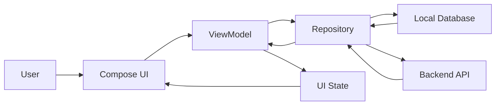

# 021 - Critical User Flow

**Học phần:** 05 - Quality, Release and Portfolio
**Module:** Module 11 - Testing
**Nhóm nội dung:** Testing Strategy
**Nguồn roadmap:** Testing / Testing Strategy
**Loại bài:** lesson
**Thứ tự trong module:** 021
**Thời lượng gợi ý:** 30 phút

---

## 1. Tóm tắt

`Critical User Flow` là luồng thao tác quan trọng mà người dùng phải hoàn thành thành công để đạt được giá trị cốt lõi của ứng dụng. Với một ứng dụng Android, đó có thể là đăng nhập, tìm kiếm sản phẩm, đặt hàng, thanh toán, gửi tin nhắn, lưu dữ liệu hoặc đồng bộ thông tin.

Một ứng dụng có hàng chục màn hình nhưng không phải mọi màn hình đều có mức độ rủi ro như nhau. Nếu màu của một icon hiển thị sai, trải nghiệm có thể bị ảnh hưởng nhẹ. Ngược lại, nếu người dùng không thể đăng nhập, mất dữ liệu sau khi xoay màn hình hoặc thanh toán thành công nhưng ứng dụng báo thất bại, hậu quả nghiêm trọng hơn nhiều.

Vì vậy, kiểm thử `Critical User Flow` là một phần quan trọng của `Testing Strategy`. Thay vì cố gắng kiểm thử mọi thứ với cùng mức độ ưu tiên, nhóm phát triển xác định những hành trình quan trọng nhất và xây dựng nhiều lớp bảo vệ xung quanh chúng.

Trong Android, một critical flow thường đi xuyên qua nhiều lớp:

```text
User
  ↓
UI
  ↓
ViewModel
  ↓
Use Case / Repository
  ↓
Local Database / Backend API
  ↓
State mới
  ↓
UI phản hồi cho User
```

Do đó, kiểm thử critical flow không chỉ là kiểm tra một nút có click được hay không. Developer cần xem xét cả `UI state`, lifecycle, navigation, network, storage, lỗi hệ thống và khả năng phục hồi của ứng dụng.

## 2. Mục tiêu học tập

Sau bài này, người học có thể:

* Giải thích được `Critical User Flow` và vai trò của nó trong chiến lược kiểm thử Android.
* Phân biệt được critical flow với một thao tác UI thông thường.
* Xác định được các user flow có mức độ ưu tiên kiểm thử cao.
* Phân tích một flow theo điểm bắt đầu, trạng thái trung gian và kết quả cuối.
* Xác định các failure point liên quan đến UI, state, lifecycle, network và storage.
* Lựa chọn được loại test phù hợp cho từng lớp của critical flow.
* Xây dựng được một automated test bảo vệ hành trình quan trọng của người dùng.
* Đưa critical flow vào release checklist và portfolio kỹ thuật.

## 3. Vì sao cần xác định Critical User Flow?

Giả sử một ứng dụng thương mại điện tử có các tính năng:

* xem banner;
* thay đổi avatar;
* tìm kiếm sản phẩm;
* thêm sản phẩm vào giỏ hàng;
* đăng nhập;
* thanh toán;
* xem lịch sử đơn hàng;
* đổi theme.

Không phải lỗi nào cũng có mức độ nghiêm trọng giống nhau.

Nếu người dùng không thể đổi theme, ứng dụng vẫn có thể cung cấp chức năng chính. Nhưng nếu người dùng đã nhập thông tin thanh toán và không thể hoàn tất đơn hàng, giá trị cốt lõi của sản phẩm bị phá vỡ.

Có thể hình dung:

```text
Tất cả tính năng
      ↓
Xác định giá trị cốt lõi
      ↓
Xác định hành trình tạo ra giá trị đó
      ↓
Đánh giá hậu quả khi flow thất bại
      ↓
Critical User Flow
      ↓
Ưu tiên test và release protection
```

Một testing strategy tốt vì thế không bắt đầu bằng câu hỏi:

> Có bao nhiêu màn hình cần test?

Mà nên bắt đầu bằng:

> Những hành trình nào tuyệt đối không được phép bị hỏng khi phát hành?

## 4. Critical User Flow là gì?

`Critical User Flow` là chuỗi hành động và thay đổi trạng thái mà người dùng thực hiện để hoàn thành một mục tiêu có giá trị cao đối với sản phẩm.

Một flow thường có:

* điểm bắt đầu;
* một hoặc nhiều hành động;
* các trạng thái trung gian;
* dependency bên ngoài;
* điều kiện thành công;
* các trường hợp thất bại;
* trạng thái cuối cùng mà hệ thống phải duy trì.

Ví dụ với ứng dụng Todo:

```text
Mở ứng dụng
     ↓
Nhấn Add
     ↓
Nhập tiêu đề
     ↓
Nhấn Save
     ↓
ViewModel xử lý
     ↓
Repository lưu dữ liệu
     ↓
Danh sách được cập nhật
     ↓
Task mới xuất hiện
```

Nếu `Save` thành công nhưng task biến mất sau khi mở lại ứng dụng thì flow vẫn chưa thực sự thành công.

Critical flow phải được đánh giá từ góc nhìn của người dùng, không chỉ từ góc nhìn của từng method trong source code.

## 5. Cách xác định một flow có thực sự critical hay không

Không nên gọi mọi flow là critical. Nếu mọi thứ đều được đánh dấu critical thì cuối cùng không còn cơ chế ưu tiên.

Một flow thường có mức độ quan trọng cao khi đáp ứng nhiều tiêu chí sau:

| Tiêu chí           | Câu hỏi cần đặt ra                                                            |
| ------------------ | ----------------------------------------------------------------------------- |
| Giá trị người dùng | Người dùng có đạt mục tiêu chính thông qua flow này không?                    |
| Giá trị kinh doanh | Flow có liên quan đến doanh thu, retention hoặc hoạt động cốt lõi không?      |
| Tần suất           | Người dùng có thực hiện flow này thường xuyên không?                          |
| Mức độ thiệt hại   | Nếu flow thất bại, hậu quả có nghiêm trọng không?                             |
| Dữ liệu            | Flow có tạo, sửa hoặc xóa dữ liệu quan trọng không?                           |
| Khả năng phục hồi  | Người dùng có dễ dàng thử lại không?                                          |
| Dependency         | Flow có phụ thuộc API, database, authentication hoặc dịch vụ bên ngoài không? |
| Release risk       | Thay đổi trong code có thường xuyên ảnh hưởng flow này không?                 |

Ví dụ:

**Đăng nhập** thường là critical nếu phần lớn chức năng yêu cầu authentication.

**Thanh toán** gần như luôn là critical trong ứng dụng thương mại điện tử.

**Lưu bài viết** có thể là critical trong ứng dụng ghi chú nếu mất dữ liệu gây ảnh hưởng trực tiếp đến người dùng.

**Mở trang About** thường không phải critical flow.

## 6. Anatomy của một Critical User Flow trên Android

Một Android flow hiếm khi tồn tại hoàn toàn trong UI.

Ví dụ:



Trong flow này:

* `UI` nhận thao tác từ người dùng.
* `ViewModel` điều phối state và business action.
* `Repository` quyết định lấy hoặc lưu dữ liệu ở đâu.
* `Local Database` có thể giữ dữ liệu lâu dài hoặc hỗ trợ offline.
* `Backend API` xử lý dữ liệu từ server.
* kết quả quay lại `ViewModel`;
* `ViewModel` cập nhật `UI State`;
* UI render trạng thái mới.

Một lỗi ở bất kỳ mắt xích nào đều có thể làm critical flow thất bại.

Ví dụ, API có thể trả thành công nhưng UI không cập nhật vì state management sai. Ngược lại, UI có thể hiển thị thành công tạm thời nhưng repository chưa thực sự lưu dữ liệu.

## 7. Các trạng thái cần kiểm thử

Chỉ kiểm thử happy path là chưa đủ đối với critical flow.

Một flow quan trọng nên được xem xét ít nhất qua các nhóm trạng thái sau:

| Trạng thái | Ví dụ                                    |
| ---------- | ---------------------------------------- |
| Initial    | Màn hình vừa được mở                     |
| Loading    | Đang gọi API hoặc đọc database           |
| Success    | Thao tác hoàn thành                      |
| Empty      | Không có dữ liệu                         |
| Error      | Request hoặc xử lý thất bại              |
| Retry      | Người dùng thử lại                       |
| Restored   | State được khôi phục sau lifecycle event |

Ví dụ đối với flow tải danh sách:

```text
Initial
  ↓
Loading
  ├── Success → Content
  ├── Success → Empty
  └── Failure → Error
                  ↓
                Retry
                  ↓
               Loading
```

Nếu test chỉ kiểm tra `Success → Content`, nhiều lỗi production vẫn có thể bị bỏ sót.

## 8. Lifecycle và state trong Critical User Flow

Android có một đặc điểm quan trọng: UI không tồn tại vĩnh viễn.

Activity hoặc composable có thể bị tái tạo khi:

* xoay thiết bị;
* thay đổi configuration;
* ứng dụng chuyển background;
* process bị hệ điều hành giải phóng;
* người dùng điều hướng sang màn hình khác rồi quay lại.

Critical flow cần xác định state nào:

* chỉ thuộc UI tạm thời;
* cần nằm trong `ViewModel`;
* cần sử dụng `SavedStateHandle`;
* cần lưu lâu dài trong database hoặc backend.

Ví dụ người dùng đang nhập một form thanh toán.

Nếu rotate màn hình làm mất toàn bộ dữ liệu form, flow bị gián đoạn.

Nếu người dùng nhấn `Pay`, request đã được gửi nhưng app chuyển background, hệ thống cũng phải tránh việc người dùng quay lại và vô tình thanh toán hai lần.

Do đó, lifecycle testing của critical flow phải tập trung vào **tính liên tục và tính đúng đắn của trạng thái**, không đơn thuần kiểm tra Activity có crash hay không.

## 9. Network failure và dependency bên ngoài

Critical flow sử dụng network cần được kiểm thử trong nhiều điều kiện hơn trạng thái mạng lý tưởng.

Ví dụ:

```text
User nhấn Submit
       ↓
Request được gửi
       ↓
   ┌───────────────┐
   │ Backend       │
   └───────────────┘
      ↓        ↓
   Success    Failure
      ↓        ↓
 Update UI   Error state
               ↓
             Retry
```

Một testing strategy tốt cần đặt các câu hỏi:

* Mất mạng trước khi request bắt đầu thì sao?
* Mạng mất giữa request thì sao?
* Server trả `4xx` thì UI phản hồi thế nào?
* Server trả `5xx` thì có retry phù hợp không?
* Request timeout thì sao?
* Authentication hết hạn giữa flow thì sao?
* Người dùng nhấn nút nhiều lần có tạo request trùng không?
* Server đã xử lý thành công nhưng client không nhận được response thì sao?

Các trường hợp cuối đặc biệt quan trọng đối với những hành động không nên lặp lại như:

* thanh toán;
* đặt vé;
* đặt hàng;
* gửi giao dịch;
* tạo dữ liệu có tính duy nhất.

## 10. Chiến lược kiểm thử theo nhiều lớp

Critical User Flow không nhất thiết phải được bảo vệ bằng một test khổng lồ.

Cách tốt hơn là kết hợp nhiều lớp kiểm thử.

```text
Critical User Flow
       ↓
┌────────────────────────────┐
│ Unit Tests                 │
│ Business logic + state     │
├────────────────────────────┤
│ Integration Tests          │
│ Repository + data layer    │
├────────────────────────────┤
│ UI Tests                   │
│ User interaction + UI      │
├────────────────────────────┤
│ End-to-End / Smoke Tests   │
│ Critical journey           │
└────────────────────────────┘
```

Mỗi lớp có mục đích khác nhau.

**Unit test** phù hợp để kiểm tra:

* validation;
* state transition;
* business rule;
* mapping;
* xử lý success/error.

**Integration test** phù hợp để kiểm tra:

* repository;
* database;
* API abstraction;
* serialization;
* cache behavior.

**UI test** phù hợp để kiểm tra:

* người dùng thực hiện được hành động;
* UI hiển thị đúng state;
* navigation hoạt động;
* error message xuất hiện.

**End-to-end hoặc smoke test** bảo vệ một số hành trình quan trọng nhất trước release.

Không nên cố chuyển toàn bộ testing strategy thành UI test vì UI test thường chậm và dễ bị ảnh hưởng bởi môi trường hơn unit test.

## 11. Ví dụ: Critical Flow tạo một Task

Xét ứng dụng Todo có flow:

```text
Home
  ↓
Add Task
  ↓
Nhập title
  ↓
Save
  ↓
Persist data
  ↓
Quay lại Home
  ↓
Task mới xuất hiện
```

Điều kiện thành công không chỉ là:

> Nút Save hoạt động.

Definition chính xác hơn có thể là:

* người dùng nhập được title;
* dữ liệu hợp lệ được chấp nhận;
* dữ liệu không hợp lệ bị từ chối;
* task được lưu;
* UI hiển thị task mới;
* task vẫn tồn tại sau khi màn hình được tạo lại;
* lỗi lưu dữ liệu được hiển thị rõ ràng;
* thao tác Save lặp nhanh không tạo duplicate ngoài ý muốn.

Flow này có thể được bảo vệ bằng nhiều test khác nhau.

Ví dụ, unit test kiểm tra `ViewModel`:

```kotlin
@Test
fun saveTask_withValidTitle_emitsSuccess() = runTest {
    val repository = FakeTaskRepository()
    val viewModel = AddTaskViewModel(repository)

    viewModel.updateTitle("Learn Android Testing")
    viewModel.saveTask()

    assertTrue(viewModel.uiState.value.isSaved)
}
```

Test này không chứng minh toàn bộ UI flow hoạt động nhưng bảo vệ logic quan trọng ở tầng state.

Ở tầng UI với Jetpack Compose, có thể kiểm tra một hành trình người dùng:

```kotlin
@get:Rule
val composeRule = createComposeRule()

@Test
fun userCanCreateTask() {
    composeRule.setContent {
        TodoApp()
    }

    composeRule
        .onNodeWithContentDescription("Add task")
        .performClick()

    composeRule
        .onNodeWithTag("taskTitle")
        .performTextInput("Learn Android Testing")

    composeRule
        .onNodeWithText("Save")
        .performClick()

    composeRule
        .onNodeWithText("Learn Android Testing")
        .assertIsDisplayed()
}
```

Điểm quan trọng của test không phải số lượng câu lệnh `performClick()`, mà là nó mô phỏng một mục tiêu thực tế:

> Người dùng có thể tạo một task và nhìn thấy kết quả.

## 12. Happy Path và Failure Path

Mỗi critical flow nên có ít nhất một happy path rõ ràng.

Ví dụ:

```text
Nhập dữ liệu hợp lệ
      ↓
Submit
      ↓
Backend thành công
      ↓
UI cập nhật
      ↓
User nhận kết quả
```

Sau đó xác định các failure path quan trọng.

Ví dụ:

```text
Nhập dữ liệu
      ↓
Submit
      ↓
Network failure
      ↓
Error message
      ↓
Retry
      ↓
Success
```

Hoặc:

```text
Submit
   ↓
Session expired
   ↓
Authentication required
   ↓
Login lại
   ↓
Tiếp tục flow
```

Không nhất thiết mọi lỗi nhỏ đều cần end-to-end test. Cần ưu tiên những lỗi có khả năng phá hỏng hành trình chính hoặc tạo trạng thái dữ liệu nguy hiểm.

## 13. Tránh viết UI test quá phụ thuộc implementation

Một lỗi phổ biến là test UI dựa quá nhiều vào cấu trúc nội bộ.

Ví dụ, test biết chính xác:

* composable nào được gọi;
* `ViewModel` sử dụng method nội bộ nào;
* repository có bao nhiêu lớp;
* state được lưu bằng field nào.

Khi implementation thay đổi nhưng hành vi người dùng không đổi, test có thể hỏng không cần thiết.

Critical flow test nên ưu tiên quan sát behavior:

```text
Given
Người dùng đang ở trạng thái xác định

When
Người dùng thực hiện hành động

Then
Kết quả quan sát được phải đúng
```

Ví dụ:

```text
Given:
Người dùng đang ở màn hình Add Task.

When:
Người dùng nhập title hợp lệ và nhấn Save.

Then:
Task mới xuất hiện trong danh sách.
```

Cách mô tả này ổn định hơn nhiều so với việc gắn test với implementation detail.

## 14. Những lỗi thường gặp

**Hiện tượng:** Automated UI test pass nhưng production flow vẫn lỗi.

**Nguyên nhân:** Test sử dụng fake data quá đơn giản và không kiểm tra các boundary quan trọng.

**Cách xử lý:** Kết hợp unit, integration và UI test; bổ sung failure scenario cho dependency quan trọng.

---

**Hiện tượng:** Test thường xuyên fail ngẫu nhiên.

**Nguyên nhân:** Sử dụng delay cố định, phụ thuộc timing hoặc network thật.

**Cách xử lý:** Dùng synchronization phù hợp và kiểm soát dependency trong môi trường test.

---

**Hiện tượng:** Một thay đổi UI nhỏ làm hàng loạt test hỏng.

**Nguyên nhân:** Test gắn quá chặt với implementation hoặc hierarchy.

**Cách xử lý:** Test theo behavior và sử dụng semantic identifier ổn định khi cần.

---

**Hiện tượng:** Rotate hoặc background làm mất state giữa flow.

**Nguyên nhân:** State quan trọng chỉ được giữ trong UI.

**Cách xử lý:** Đặt state ở tầng có lifecycle phù hợp và kiểm thử khả năng phục hồi.

---

**Hiện tượng:** User nhấn Submit hai lần tạo hai transaction.

**Nguyên nhân:** Không kiểm soát repeated action hoặc idempotency.

**Cách xử lý:** Chặn thao tác lặp ở UI khi thích hợp và thiết kế backend/data layer an toàn cho operation quan trọng.

## 15. Best practices

* Bắt đầu từ mục tiêu của người dùng thay vì bắt đầu từ danh sách màn hình.
* Chỉ đánh dấu một số flow thực sự quan trọng là critical.
* Viết rõ precondition và expected outcome của từng critical flow.
* Kiểm thử cả success path và failure path có rủi ro cao.
* Ưu tiên unit test cho business logic và state transition.
* Dùng integration test cho ranh giới giữa các thành phần dữ liệu.
* Giữ số lượng end-to-end test nhỏ nhưng tập trung vào hành trình có giá trị cao.
* Không phụ thuộc network production trong automated test thông thường.
* Kiểm tra lifecycle đối với flow dài hoặc có state nhập liệu.
* Kiểm tra thao tác lặp đối với operation có side effect.
* Đưa critical flow test vào CI khi nó đủ ổn định.
* Xem critical flow như release protection chứ không chỉ là tài liệu QA.

## 16. Critical User Flow trong release strategy

Một critical flow nên có liên hệ trực tiếp với release checklist.

Ví dụ trước khi phát hành:

```text
Build candidate
      ↓
Unit tests
      ↓
Integration tests
      ↓
Critical flow smoke tests
      ↓
Manual verification nếu cần
      ↓
Release
```

Không phải mọi regression test đều cần trở thành release blocker.

Nhưng nếu một critical flow như đăng nhập hoặc thanh toán bị hỏng, release thường không nên tiếp tục.

Có thể xây dựng release gate như:

```text
Login flow          PASS
Create content      PASS
Sync data           PASS
Purchase flow       FAIL
                         ↓
                    Block release
```

Điều này biến Testing Strategy thành một cơ chế quản trị rủi ro thực tế.

## 17. Bài thực hành

Chọn một ứng dụng Android nhỏ và xác định một critical flow.

Ví dụ:

```text
Mở app
  ↓
Tạo dữ liệu
  ↓
Lưu dữ liệu
  ↓
Quay lại màn hình danh sách
  ↓
Kiểm tra dữ liệu xuất hiện
```

Thực hiện các yêu cầu:

1. Viết tên và mục tiêu của flow.
2. Xác định precondition.
3. Liệt kê các bước người dùng thực hiện.
4. Xác định expected outcome.
5. Xác định ít nhất ba failure point.
6. Chọn phần nên được bảo vệ bằng unit test.
7. Chọn phần cần integration hoặc UI test.
8. Viết ít nhất một automated test.
9. Chạy test và ghi lại kết quả.
10. Mô tả trường hợp test thất bại sẽ biểu hiện như thế nào đối với người dùng.

**Artifact nên tạo:**

* một file test tự động;
* sơ đồ critical flow;
* screenshot kết quả test;
* đoạn README mô tả flow;
* danh sách failure scenario quan trọng.

## 18. Checklist hoàn thành

* [ ] Giải thích được `Critical User Flow` bằng góc nhìn của người dùng.
* [ ] Phân biệt được critical flow với một thao tác UI đơn lẻ.
* [ ] Xác định được một flow quan trọng trong ứng dụng Android.
* [ ] Mô tả được điểm bắt đầu và kết quả cuối của flow.
* [ ] Xác định được các state quan trọng của flow.
* [ ] Phân tích được ảnh hưởng của lifecycle.
* [ ] Xác định được failure path liên quan đến network hoặc storage khi có.
* [ ] Phân biệt được vai trò của unit, integration và UI test.
* [ ] Có ít nhất một automated test bảo vệ flow.
* [ ] Có thể giải thích vì sao test đó cần thiết trước khi release.

## 19. Câu hỏi tự kiểm tra

1. Vì sao không nên coi mọi user flow trong ứng dụng là `Critical User Flow`?
2. Một UI test kiểm tra nút `Save` có click được đã đủ để chứng minh flow lưu dữ liệu hoạt động đúng chưa? Vì sao?
3. Trong trường hợp nào rotate hoặc process recreation có thể làm một critical flow thất bại?
4. Tại sao không nên xây dựng toàn bộ testing strategy chỉ bằng end-to-end UI test?
5. Nếu backend đã tạo đơn hàng nhưng client bị timeout trước khi nhận response, hệ thống cần quan tâm đến rủi ro gì?
6. Những critical flow nào trong ứng dụng của bạn nên trở thành release blocker?

## 20. Tổng kết

`Critical User Flow` giúp nhóm Android tập trung kiểm thử vào những hành trình có ảnh hưởng lớn nhất đến người dùng và sản phẩm.

Một critical flow không chỉ là chuỗi click trên UI. Nó có thể đi xuyên qua:

```text
UI
→ State
→ ViewModel
→ Business Logic
→ Repository
→ Database / Network
→ Lifecycle
→ UI mới
```

Vì vậy, bảo vệ critical flow cần một testing strategy nhiều lớp thay vì một test duy nhất.

Các nguyên tắc quan trọng cần ghi nhớ:

* xác định flow dựa trên giá trị và rủi ro;
* kiểm thử theo hành vi người dùng;
* bảo vệ business logic bằng test nhanh ở tầng thấp;
* sử dụng UI test cho hành trình thực sự quan trọng;
* kiểm tra lifecycle, network và khả năng phục hồi;
* đưa critical flow vào release gate khi failure của nó không thể chấp nhận.

Khi một Android developer có thể xác định, mô hình hóa, tự động hóa và giải thích các critical flow của ứng dụng, testing không còn chỉ là hoạt động tìm bug mà trở thành một phần trực tiếp của chiến lược chất lượng và quản trị rủi ro sản phẩm.
