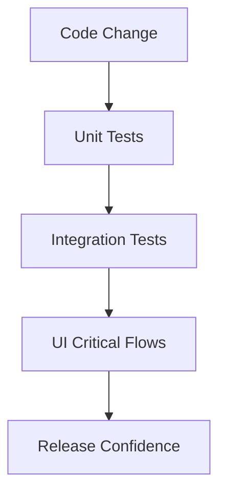
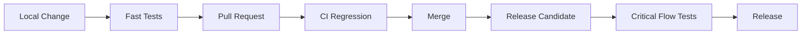

# 022 - Regression Test

**Học phần:** 05 - Quality, Release and Portfolio
**Module:** Module 11 - Testing
**Nhóm nội dung:** Testing Strategy
**Nguồn roadmap:** Testing / Testing Strategy
**Loại bài:** lesson
**Thứ tự trong module:** 022
**Thời lượng gợi ý:** 30 phút

---

## 1. Tóm tắt

`Regression Test` hay **kiểm thử hồi quy** là hoạt động kiểm tra lại những hành vi đã hoạt động đúng của ứng dụng sau khi source code, dependency, cấu hình, kiến trúc hoặc môi trường được thay đổi.

Mục tiêu của regression testing không chỉ là chứng minh tính năng mới hoạt động. Điều quan trọng hơn là phát hiện trường hợp:

> Một thay đổi ở khu vực A vô tình làm hỏng hành vi đã ổn định ở khu vực B.

Trong Android, rủi ro hồi quy xuất hiện thường xuyên vì một user flow có thể đi qua nhiều lớp:

```text
UI
 ↓
ViewModel
 ↓
Use Case
 ↓
Repository
 ↓
Database / Network
```

Một thay đổi trong `Repository`, coroutine, database migration, navigation hoặc lifecycle handling có thể làm hỏng UI dù màn hình đó không được sửa trực tiếp.

Regression testing vì vậy là một phần quan trọng của **Testing Strategy**, CI và quy trình release ứng dụng Android.

---

## 2. Mục tiêu học tập

Sau bài học này, người học có thể:

* Giải thích được mục đích của `Regression Test`.
* Phân biệt regression testing với retesting.
* Xác định được những thay đổi có nguy cơ gây regression trong ứng dụng Android.
* Lựa chọn phạm vi regression test dựa trên mức độ rủi ro.
* Xây dựng một regression suite gồm unit test, integration test và UI test phù hợp.
* Thực thi regression test bằng các lệnh có thể lặp lại.
* Đưa regression test vào CI để giảm rủi ro trước release.
* Phân tích một regression failure và xác định thành phần có khả năng gây lỗi.

---

## 3. Regression Test giải quyết vấn đề gì?

Trong quá trình phát triển ứng dụng, source code liên tục thay đổi.

Một developer có thể:

* thêm tính năng;
* sửa bug;
* refactor;
* thay dependency;
* tối ưu database;
* đổi API;
* sửa navigation;
* thay đổi coroutine;
* chỉnh sửa `ViewModel`;
* thêm caching;
* thay đổi serialization;
* nâng cấp Android SDK.

Mỗi thay đổi đều có khả năng ảnh hưởng đến những hành vi đã tồn tại.

Ví dụ, ứng dụng đang có luồng:

```text
Mở ứng dụng
    ↓
Đăng nhập
    ↓
Lấy profile
    ↓
Lưu dữ liệu local
    ↓
Hiển thị Home
```

Developer thay đổi cơ chế cache của `Repository` để tăng tốc màn hình Home.

Tính năng mới có thể hoạt động đúng nhưng đồng thời xuất hiện lỗi:

* profile cũ được hiển thị sau khi đổi tài khoản;
* logout không xóa cache;
* màn hình Home hiển thị dữ liệu trước đó;
* app crash khi database chưa có dữ liệu;
* UI không cập nhật sau khi network request hoàn thành.

Đây là các **regression defect**: lỗi xuất hiện trong chức năng vốn đã hoạt động trước khi hệ thống được thay đổi.

Regression testing tạo một lớp bảo vệ:

```text
Code thay đổi
      ↓
Chạy regression suite
      ↓
Kiểm tra hành vi cũ
      ↓
Phát hiện regression
      ↓
Sửa trước khi merge/release
```

---

## 4. Bản chất của Regression Testing

Regression testing không phải là một framework, API hay loại test riêng biệt.

Một regression suite có thể chứa:

* unit test;
* integration test;
* repository test;
* database test;
* API contract test;
* instrumented test;
* navigation test;
* UI test;
* end-to-end test.

Điểm quyết định một test có thuộc regression suite hay không nằm ở **mục đích sử dụng**.

Nếu test được chạy lại sau thay đổi nhằm bảo vệ hành vi đã được xác nhận trước đó, test đang đóng vai trò regression test.

Ví dụ:

```kotlin
@Test
fun logout_clearsCachedUser() {
    repository.saveUser(
        User(
            id = "u01",
            name = "An"
        )
    )

    repository.logout()

    assertNull(repository.getCachedUser())
}
```

Test này có thể ban đầu được viết để kiểm tra chức năng logout. Sau khi chức năng đã ổn định, nó trở thành một phần của regression suite để ngăn các thay đổi tương lai làm hỏng hành vi xóa cache.

---

## 5. Regression Test và Retest

`Regression Test` dễ bị nhầm với `Retest`, nhưng hai hoạt động có mục đích khác nhau.

| Hoạt động       | Mục tiêu                                                             |
| --------------- | -------------------------------------------------------------------- |
| Retest          | Kiểm tra bug vừa được sửa đã thực sự hết hay chưa                    |
| Regression Test | Kiểm tra thay đổi vừa thực hiện có làm hỏng chức năng khác hay không |

Ví dụ có bug:

> Người dùng bấm Logout nhưng token vẫn còn trong local storage.

Developer sửa `AuthRepository.logout()`.

Retest tập trung vào:

```text
Logout
   ↓
Token bị xóa?
   ↓
User được chuyển về Login?
```

Regression test cần mở rộng sang các hành vi liên quan:

```text
Login vẫn hoạt động?
Refresh token còn đúng?
Auto-login có bị ảnh hưởng?
Profile cache được xóa?
Back navigation có quay lại màn hình private?
App restart có giữ trạng thái logout?
```

Một bản sửa bug tốt không chỉ phải sửa đúng bug mà còn không được tạo ra bug mới.

---

## 6. Những thay đổi Android có nguy cơ gây regression

Không phải mọi thay đổi đều có mức độ rủi ro giống nhau. Regression testing hiệu quả cần dựa trên phạm vi ảnh hưởng của thay đổi.

### 6.1. Thay đổi logic và dữ liệu

Nhóm thay đổi này thường ảnh hưởng đến business logic hoặc data flow:

* sửa `UseCase`;
* thay đổi `Repository`;
* đổi mapping DTO → domain model;
* sửa caching;
* thay database schema;
* thêm Room migration;
* thay coroutine dispatcher;
* đổi retry logic;
* thay API response;
* sửa authentication.

Ví dụ:

```text
API
 ↓
RemoteDataSource
 ↓
Repository
 ↓
ViewModel
 ↓
StateFlow
 ↓
UI
```

Nếu `Repository` thay đổi cách xử lý lỗi, nhiều màn hình sử dụng repository đó đều có thể bị ảnh hưởng.

Regression scope vì vậy không nên chỉ kiểm tra màn hình nơi developer vừa sửa code.

### 6.2. Thay đổi UI và lifecycle

Một số regression chỉ xuất hiện khi Android lifecycle thay đổi.

Các tình huống quan trọng gồm:

* rotate thiết bị;
* chuyển app xuống background;
* quay lại foreground;
* process recreation;
* điều hướng Back;
* mở deep link;
* activity hoặc composable được tạo lại;
* request đang chạy khi UI bị destroy.

Ví dụ một màn hình có trạng thái:

```text
Loading
  ↓
Success
```

Sau một refactor, trạng thái có thể bị reset khi rotate:

```text
Success
   ↓
Rotate
   ↓
Loading lại
   ↓
Request API lần nữa
```

Ứng dụng vẫn có thể chạy nhưng UX đã bị regression.

Regression test trong Android vì vậy cần quan tâm không chỉ đến output dữ liệu mà còn đến:

* state;
* lifecycle;
* navigation;
* persistence;
* error recovery.

---

## 7. Xây dựng Regression Test Strategy

Một dự án thực tế không nên chạy mọi test theo cùng một cách cho mọi thay đổi.

Chiến lược tốt cần cân bằng giữa:

```text
Độ bao phủ
    ↕
Thời gian chạy
    ↕
Chi phí bảo trì
    ↕
Rủi ro release
```

### 7.1. Regression suite theo nhiều tầng

Một chiến lược phổ biến là chia test thành nhiều tầng.



**Unit tests** chạy nhanh và bảo vệ logic nhỏ.

**Integration tests** kiểm tra nhiều thành phần kết hợp với nhau, chẳng hạn `Repository` với fake data source hoặc database.

**UI tests** bảo vệ các user flow quan trọng từ góc nhìn người dùng.

Không nên dùng hàng trăm UI test để thay thế unit test. UI test thường chậm hơn, phụ thuộc nhiều thành phần hơn và có chi phí bảo trì cao hơn.

### 7.2. Regression suite theo mức độ rủi ro

Không phải chức năng nào cũng cần mức độ bảo vệ giống nhau.

Một ứng dụng thương mại điện tử có thể ưu tiên:

```text
Login
 ↓
Product
 ↓
Cart
 ↓
Checkout
 ↓
Payment
```

Một app banking có thể ưu tiên:

```text
Authentication
      ↓
Account
      ↓
Transfer
      ↓
Confirmation
```

Các flow có mức độ ưu tiên cao thường là:

* authentication;
* lưu dữ liệu;
* thanh toán;
* subscription;
* chức năng tạo hoặc xóa dữ liệu;
* luồng chính tạo giá trị cho người dùng;
* chức năng từng có bug nghiêm trọng.

Regression suite nên phản ánh **business risk**, không chỉ phản ánh cấu trúc source code.

---

## 8. Ví dụ Regression Test trong Android

Giả sử ứng dụng có `ProfileViewModel` tải thông tin người dùng.

```kotlin
data class ProfileUiState(
    val isLoading: Boolean = false,
    val username: String? = null,
    val error: String? = null
)
```

`ViewModel` sử dụng repository:

```kotlin
class ProfileViewModel(
    private val repository: ProfileRepository
) : ViewModel() {

    private val _uiState = MutableStateFlow(ProfileUiState())
    val uiState: StateFlow<ProfileUiState> = _uiState

    fun loadProfile() {
        viewModelScope.launch {
            _uiState.value = ProfileUiState(isLoading = true)

            runCatching {
                repository.getProfile()
            }.onSuccess { profile ->
                _uiState.value = ProfileUiState(
                    username = profile.name
                )
            }.onFailure {
                _uiState.value = ProfileUiState(
                    error = "Không thể tải profile"
                )
            }
        }
    }
}
```

Một regression test quan trọng có thể bảo vệ trường hợp lỗi:

```kotlin
@Test
fun loadProfile_whenRepositoryFails_showsErrorState() = runTest {
    val repository = FakeProfileRepository(
        result = Result.failure(RuntimeException())
    )

    val viewModel = ProfileViewModel(repository)

    viewModel.loadProfile()
    advanceUntilIdle()

    val state = viewModel.uiState.value

    assertFalse(state.isLoading)
    assertEquals("Không thể tải profile", state.error)
}
```

Test này bảo vệ một hành vi quan trọng:

```text
Repository lỗi
      ↓
ViewModel không crash
      ↓
Loading kết thúc
      ↓
UI nhận error state
```

Sau này developer có thể refactor loading logic, chuyển repository sang API mới hoặc thay đổi coroutine. Nếu error state bị mất, regression test sẽ phát hiện vấn đề.

---

## 9. Regression Test cho user flow

Không phải mọi regression đều có thể phát hiện bằng unit test.

Giả sử ứng dụng có luồng:

```text
Login
 ↓
Home
 ↓
Profile
 ↓
Logout
 ↓
Login Screen
```

Regression UI test cần kiểm tra hành vi người dùng thực sự quan tâm.

Với ứng dụng sử dụng Jetpack Compose, test có thể có dạng:

```kotlin
@Test
fun logout_returnsUserToLoginScreen() {
    composeTestRule
        .onNodeWithText("Profile")
        .performClick()

    composeTestRule
        .onNodeWithText("Logout")
        .performClick()

    composeTestRule
        .onNodeWithText("Login")
        .assertIsDisplayed()
}
```

Giá trị của test không nằm ở việc kiểm tra một button có tồn tại hay không. Nó bảo vệ một user flow:

```text
User đang đăng nhập
      ↓
User logout
      ↓
Session kết thúc
      ↓
Ứng dụng trở về trạng thái unauthenticated
```

Nếu một thay đổi navigation vô tình giữ người dùng ở màn hình private, regression test có thể phát hiện vấn đề trước khi release.

---

## 10. Chuyển bug thành Regression Test

Một trong những cách xây dựng regression suite hiệu quả nhất là:

> Mỗi bug quan trọng đã sửa nên để lại một test bảo vệ hành vi đó khi có thể tự động hóa.

Quy trình:

```text
Bug được phát hiện
      ↓
Tạo test tái hiện bug
      ↓
Test thất bại
      ↓
Sửa code
      ↓
Test pass
      ↓
Giữ test trong regression suite
```

Ví dụ có bug:

```text
Rotate màn hình
    ↓
Form mất dữ liệu
```

Thay vì chỉ sửa code và đóng issue, cần đặt câu hỏi:

* Có thể thêm test bảo vệ state không?
* State thuộc `ViewModel` hay UI?
* Có cần `SavedStateHandle` không?
* Những màn hình khác có cùng pattern không?

Khi test được giữ lại, cùng một lỗi sẽ khó quay trở lại trong những lần refactor sau.

---

## 11. Tự động hóa Regression Test

Regression testing phát huy giá trị lớn nhất khi có thể chạy lặp lại một cách nhất quán.

Trong Android project sử dụng Gradle, local regression có thể bắt đầu từ các lệnh như:

```bash
./gradlew test
```

Lệnh này thường được sử dụng để chạy local unit tests.

Instrumented tests có thể được thực thi trên device hoặc emulator bằng:

```bash
./gradlew connectedAndroidTest
```

Một feedback loop cơ bản:

```text
Developer thay code
       ↓
Chạy unit tests
       ↓
Commit / Push
       ↓
CI chạy regression suite
       ↓
Pass
       ↓
Merge
```

Nếu test fail:

```text
CI Failure
   ↓
Không merge
   ↓
Phân tích regression
   ↓
Sửa code hoặc test
   ↓
Chạy lại pipeline
```

Mục tiêu là biến regression testing từ một hoạt động phụ thuộc trí nhớ của developer thành một quy trình có thể lặp lại.

---

## 12. Regression Test trong CI và release

Không phải toàn bộ regression suite nhất thiết phải chạy ở cùng một thời điểm.

Có thể thiết kế feedback loop như:



Các test nhanh nên được chạy sớm để developer nhận feedback nhanh.

Những test tốn thời gian hơn có thể được dành cho:

* pull request;
* branch chính;
* release candidate;
* nightly pipeline;

tùy chiến lược của dự án.

Điều quan trọng là các flow có rủi ro cao phải được bảo vệ **trước thời điểm release**, không phải sau khi người dùng phát hiện lỗi.

---

## 13. Chọn Regression Test nào cần chạy

Khi dự án lớn dần, chạy toàn bộ test suite cho mọi thay đổi có thể trở nên tốn thời gian.

Có thể phân tích phạm vi ảnh hưởng của thay đổi.

Ví dụ developer sửa:

```text
AuthRepository
```

Các khu vực liên quan có thể là:

```text
AuthRepository
      ↓
Login
      ↓
Token Refresh
      ↓
Session Restore
      ↓
Logout
      ↓
Protected Screens
```

Regression scope hợp lý nên bao gồm các luồng có liên hệ với authentication.

Ngược lại, thay đổi typography nhỏ trong màn hình About thường không cần chạy toàn bộ end-to-end suite cho payment.

Một cách suy nghĩ thực tế:

```text
Thay đổi gì?
     ↓
Thành phần nào phụ thuộc nó?
     ↓
User flow nào đi qua thành phần đó?
     ↓
Nếu lỗi xảy ra thì mức độ nghiêm trọng thế nào?
     ↓
Test nào cần chạy?
```

Đây là **risk-based regression testing**.

---

## 14. Những lỗi thường gặp

**Hiện tượng:** Chỉ kiểm tra tính năng vừa phát triển.

**Nguyên nhân:** Developer tập trung vào acceptance criteria của tính năng mới nhưng không xem xét phạm vi ảnh hưởng.

**Cách xử lý:** Xác định dependency và các user flow liên quan trước khi merge.

---

**Hiện tượng:** Regression suite có rất nhiều UI test nhưng chạy chậm và không ổn định.

**Nguyên nhân:** Những hành vi có thể kiểm tra ở tầng logic lại được đẩy lên UI test.

**Cách xử lý:** Đưa phần lớn business logic xuống unit hoặc integration test, chỉ giữ UI test cho các flow quan trọng.

---

**Hiện tượng:** Một bug cũ xuất hiện lại sau vài tháng.

**Nguyên nhân:** Bug được sửa nhưng không có test bảo vệ.

**Cách xử lý:** Với bug phù hợp để tự động hóa, thêm test tái hiện bug vào regression suite.

---

**Hiện tượng:** Test fail sau refactor dù hành vi người dùng không thay đổi.

**Nguyên nhân:** Test phụ thuộc quá nhiều vào implementation detail.

**Cách xử lý:** Ưu tiên kiểm tra observable behavior thay vì cấu trúc nội bộ không quan trọng.

---

**Hiện tượng:** CI pass nhưng production vẫn xuất hiện regression.

**Nguyên nhân:** Regression suite không bao phủ critical flow hoặc không kiểm tra các trạng thái lỗi quan trọng.

**Cách xử lý:** Phân tích production incident, bổ sung test phù hợp và cập nhật release checklist.

---

## 15. Best practices

* Ưu tiên tự động hóa những hành vi quan trọng và lặp lại thường xuyên.
* Giữ unit test nhanh để developer có feedback sớm.
* Không cố thay thế toàn bộ test strategy bằng UI test.
* Tập trung regression test vào hành vi có ý nghĩa đối với người dùng.
* Khi sửa bug quan trọng, cân nhắc thêm test để lỗi không quay lại.
* Kiểm tra cả success path và các failure path quan trọng.
* Xem xét lifecycle khi test Android state.
* Xem xét network failure, timeout, dữ liệu rỗng và storage failure nếu flow phụ thuộc chúng.
* Đảm bảo test có thể chạy lặp lại với kết quả ổn định.
* Giữ các lệnh chạy test trong README hoặc tài liệu development.
* Chạy regression suite phù hợp trước khi merge và trước release.
* Xóa hoặc sửa những test không còn phản ánh yêu cầu thực tế thay vì để suite mất độ tin cậy.

---

## 16. Bài thực hành

Xây dựng một regression check cho một ứng dụng Android mẫu có chức năng tải dữ liệu từ repository.

Yêu cầu:

1. Chọn một hành vi đã hoạt động, ví dụ:

   * tải danh sách thành công;
   * hiển thị error khi repository lỗi;
   * logout xóa session;
   * dữ liệu form không mất khi UI được tạo lại.

2. Viết ít nhất một automated test bảo vệ hành vi đó.

3. Chạy test bằng Gradle.

4. Chủ động sửa code để tạo regression.

5. Xác nhận test chuyển từ trạng thái pass sang fail.

6. Khôi phục implementation đúng và xác nhận test pass trở lại.

Lưu lại lệnh đã sử dụng, ví dụ:

```bash
./gradlew test
```

**Kết quả mong đợi:**

```text
Implementation đúng
       ↓
Regression Test PASS

Implementation bị phá
       ↓
Regression Test FAIL
```

Artifact có thể đưa vào portfolio:

* file test;
* screenshot test result;
* lệnh Gradle đã chạy;
* README ngắn mô tả regression scenario;
* commit cho thấy test phát hiện lỗi.

---

## 17. Checklist hoàn thành

* [ ] Giải thích được Regression Test là gì.
* [ ] Phân biệt được regression testing và retesting.
* [ ] Xác định được phạm vi ảnh hưởng của một thay đổi Android.
* [ ] Biết khi nào nên dùng unit test, integration test và UI test trong regression suite.
* [ ] Viết được ít nhất một test bảo vệ hành vi đã tồn tại.
* [ ] Chứng minh được test fail khi chủ động tạo regression.
* [ ] Chạy được test bằng lệnh Gradle phù hợp.
* [ ] Giải thích được vai trò của regression test trong CI.
* [ ] Có ít nhất một artifact có thể lưu vào portfolio.

---

## 18. Câu hỏi tự kiểm tra

1. Tại sao việc xác nhận tính năng mới hoạt động chưa đủ để kết luận một release an toàn?

2. Một bug vừa được sửa cần retest và regression test khác nhau như thế nào?

3. Nếu thay đổi `AuthRepository`, những user flow nào nên được xem xét trong regression scope?

4. Tại sao không nên triển khai toàn bộ regression suite dưới dạng UI test?

5. Khi một production bug được sửa, tại sao thêm automated test có thể giúp giảm rủi ro trong các release tương lai?

---

## 19. Tổng kết

`Regression Test` bảo vệ những hành vi đã hoạt động của ứng dụng trước tác động không mong muốn từ các thay đổi mới.

Trong Android, regression có thể xuất hiện ở nhiều lớp:

```text
UI
State
Lifecycle
ViewModel
Business Logic
Repository
Network
Database
Navigation
```

Một regression strategy tốt không đơn giản là “chạy thật nhiều test”. Nó cần lựa chọn test dựa trên kiến trúc, user flow và mức độ rủi ro.

Chu trình quan trọng cần hình thành là:

```text
Thay đổi
   ↓
Đánh giá phạm vi ảnh hưởng
   ↓
Chạy regression tests phù hợp
   ↓
Phát hiện lỗi sớm
   ↓
Sửa lỗi
   ↓
CI xác nhận
   ↓
Release an toàn hơn
```

Khi regression testing được tự động hóa và tích hợp vào feedback loop của dự án, test không còn chỉ là bước kiểm tra cuối cùng mà trở thành cơ chế bảo vệ chất lượng trong suốt quá trình phát triển ứng dụng.
