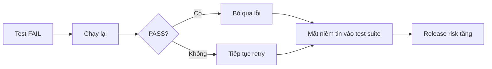
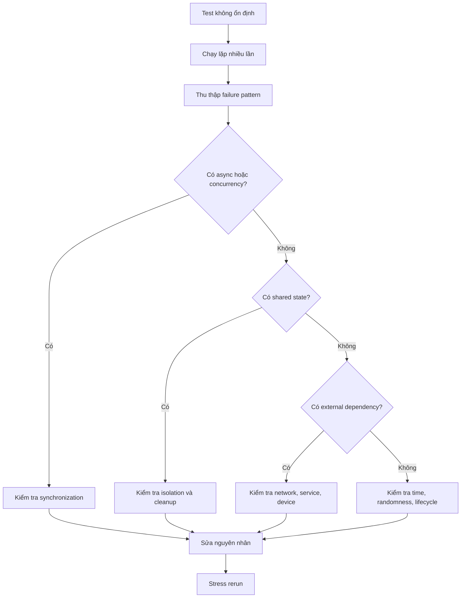
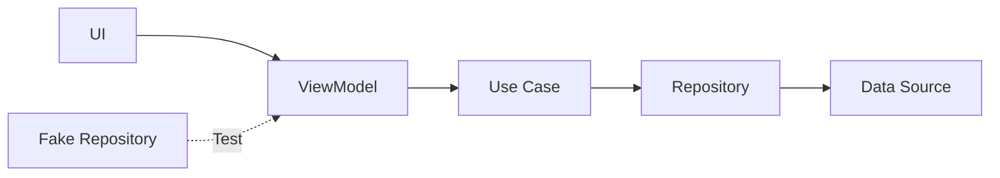

# 023 - Flaky Test

**Học phần:** 05 - Quality, Release and Portfolio  
**Module:** Module 11 - Testing  
**Nhóm nội dung:** Testing Strategy  
**Nguồn roadmap:** Testing / Testing Strategy  
**Loại bài:** lesson  
**Thứ tự trong module:** 023  
**Thời lượng gợi ý:** 30 phút  

---

## 1. Tóm tắt

`Flaky Test` là một bài kiểm thử có kết quả **không ổn định**: cùng một phiên bản code, cùng một test case và về nguyên tắc cùng điều kiện thực thi nhưng test có thể lúc `PASS`, lúc `FAIL`.

Đây là vấn đề nghiêm trọng trong chiến lược kiểm thử Android vì một test suite chỉ hữu ích khi developer có thể tin tưởng kết quả của nó. Nếu test thất bại ngẫu nhiên, nhóm phát triển dần hình thành thói quen chạy lại test, bỏ qua lỗi hoặc merge code dù pipeline đang đỏ. Khi đó, test không còn đóng vai trò như một cơ chế bảo vệ chất lượng.

Trong Android, flaky test thường xuất hiện quanh:

- asynchronous code;
- coroutine;
- animation;
- UI synchronization;
- lifecycle;
- shared state;
- database;
- network;
- concurrency;
- thời gian hệ thống;
- thiết bị hoặc emulator;
- dependency bên ngoài.

Mục tiêu không phải là làm cho pipeline "xanh" bằng cách retry vô hạn, mà là tìm ra **nguồn nondeterminism** và biến test thành một phép kiểm tra có thể lặp lại.

---

## 2. Mục tiêu học tập

Sau bài học, người học có thể:

- Giải thích được `Flaky Test` và phân biệt với một test thất bại ổn định.
- Nhận diện các nguồn nondeterminism phổ biến trong Android testing.
- Phân tích mối quan hệ giữa asynchronous code, lifecycle, state và test instability.
- Viết test tránh phụ thuộc vào `Thread.sleep()` hoặc timing thực tế.
- Thiết kế test có tính isolation và repeatability cao.
- Phân tích một test lúc `PASS`, lúc `FAIL` thay vì chỉ chạy lại cho đến khi thành công.
- Đánh giá ảnh hưởng của flaky test tới CI/CD và release risk.
- Xây dựng một quality check nhỏ có thể sử dụng làm artifact trong portfolio.

---

## 3. Flaky Test là gì?

Một test lý tưởng là một hàm xác định:

```text
Code + Test Input + Controlled Environment
                    ↓
               Kết quả cố định
```

Nếu behavior đúng, test phải luôn `PASS`.

Nếu behavior sai, test phải luôn `FAIL`.

Flaky test phá vỡ nguyên tắc này:

```text
Cùng code
Cùng test
Cùng mục tiêu kiểm thử
        ↓
Lần 1 → PASS
Lần 2 → PASS
Lần 3 → FAIL
Lần 4 → PASS
```

Điểm quan trọng là lỗi không nhất thiết nằm trong assertion. Nó thường xuất phát từ việc test phụ thuộc vào một yếu tố không được kiểm soát.

Ví dụ:

```kotlin
@Test
fun user_is_loaded() {
    viewModel.loadUser()

    Thread.sleep(500)

    assertEquals("An", viewModel.uiState.value.name)
}
```

Test này ngầm giả định rằng `loadUser()` luôn hoàn thành trong vòng `500 ms`.

Nhưng thời gian thực thi có thể thay đổi vì:

- CPU đang bận;
- emulator chậm;
- CI runner có tài nguyên thấp;
- database phản hồi chậm;
- coroutine được schedule khác;
- network có độ trễ lớn hơn.

Do đó, `500 ms` không phải là một điều kiện logic. Nó chỉ là một dự đoán về timing.

---

## 4. Vì sao Flaky Test nguy hiểm?

Một test thất bại ổn định thường dễ xử lý:

```text
Test FAIL
   ↓
Developer điều tra
   ↓
Bug được sửa
```

Flaky test tạo ra vòng lặp nguy hiểm hơn:



Vấn đề lớn nhất không chỉ là thời gian CI bị lãng phí. Flaky test làm giảm **trust** vào toàn bộ hệ thống kiểm thử.

Khi pipeline thường xuyên thất bại không rõ nguyên nhân, developer có thể bắt đầu:

- retry job theo thói quen;
- merge dù test đang đỏ;
- disable test;
- thêm `sleep()` dài hơn;
- đánh dấu lỗi là "CI issue";
- bỏ qua failure thực sự.

Một bug production nghiêm trọng có thể bị che giấu trong chính những failure mà nhóm đã quen coi là flaky.

---

## 5. Phân biệt Flaky Test với các loại failure khác

| Trường hợp | Đặc điểm |
| --- | --- |
| Deterministic failure | Test luôn `FAIL` khi bug tồn tại |
| Flaky test | Test lúc `PASS`, lúc `FAIL` mà code không đổi |
| Broken test | Test sai logic hoặc expectation không còn đúng |
| Environment failure | Hạ tầng, emulator, service hoặc dependency bị lỗi |
| Product bug | Behavior thực tế của ứng dụng không đúng yêu cầu |

Một environment failure có thể khiến test trông giống flaky test.

Ví dụ:

```text
Test login thất bại
        ↓
Backend staging timeout
        ↓
Chạy lại sau 20 giây
        ↓
PASS
```

Nếu integration test phụ thuộc trực tiếp vào backend không ổn định, kết quả test cũng trở nên không ổn định dù logic Android không thay đổi.

Vì vậy, khi điều tra flaky test, cần xác định chính xác:

> Nondeterminism nằm trong application code, test code hay test environment?

---

## 6. Các nguyên nhân phổ biến trong Android

### 6.1. Async và timing

Đây là nguyên nhân phổ biến nhất.

Ví dụ:

```kotlin
viewModel.refresh()

assertEquals(
    false,
    viewModel.uiState.value.isLoading
)
```

Nếu `refresh()` khởi động coroutine, assertion có thể chạy trước khi coroutine hoàn thành.

Developer đôi khi sửa bằng:

```kotlin
Thread.sleep(1000)
```

Cách này chỉ chuyển vấn đề từ:

```text
"race condition rõ ràng"
```

thành:

```text
"race condition khó xuất hiện hơn"
```

Giải pháp tốt hơn là đồng bộ test với điều kiện thực sự cần kiểm tra.

---

### 6.2. Shared state và test isolation

Hai test sử dụng chung dữ liệu có thể ảnh hưởng lẫn nhau.

Ví dụ:

```text
Test A
↓
Lưu user vào database

Test B
↓
Giả định database đang rỗng
```

Nếu thứ tự chạy là:

```text
B → A
```

test có thể `PASS`.

Nếu thứ tự là:

```text
A → B
```

test B có thể `FAIL`.

Một test tốt không nên phụ thuộc vào test nào chạy trước.

Mỗi test cần tự:

- chuẩn bị dữ liệu;
- thực hiện hành động;
- kiểm tra kết quả;
- cleanup nếu cần.

---

### 6.3. Phụ thuộc vào thứ tự thực thi

Không nên thiết kế test suite theo kiểu:

```text
testCreateUser()
      ↓
testUpdateUser()
      ↓
testDeleteUser()
```

Nếu `testUpdateUser()` chỉ chạy được sau `testCreateUser()`, các test không còn độc lập.

Thay vào đó:

```text
testUpdateUser()
      ↓
Tự tạo user cần thiết
      ↓
Update
      ↓
Assert
```

Mỗi test nên có đầy đủ fixture cần thiết.

---

### 6.4. Network thật

Ví dụ integration test gọi:

```text
Android test
    ↓
Internet
    ↓
Staging API
    ↓
Database
```

Kết quả lúc này có thể phụ thuộc vào:

- kết nối mạng;
- DNS;
- server load;
- backend deployment;
- rate limit;
- database;
- dữ liệu staging;
- authentication token.

Nếu mục tiêu chỉ là kiểm tra `Repository`, dùng fake hoặc mock dependency thường cho kết quả ổn định hơn.

Ví dụ:

```kotlin
class FakeUserRepository(
    private val user: User
) : UserRepository {

    override suspend fun getUser(): User {
        return user
    }
}
```

Test kiểm soát hoàn toàn đầu vào thay vì phụ thuộc vào một server bên ngoài.

---

### 6.5. Thời gian hệ thống

Code như sau khó test ổn định:

```kotlin
fun isExpired(expiredAt: Long): Boolean {
    return System.currentTimeMillis() > expiredAt
}
```

Test có thể phụ thuộc vào thời điểm thực thi.

Thiết kế tốt hơn là inject nguồn thời gian:

```kotlin
interface Clock {
    fun nowMillis(): Long
}
```

Production implementation:

```kotlin
class SystemClock : Clock {

    override fun nowMillis(): Long {
        return System.currentTimeMillis()
    }
}
```

Trong test:

```kotlin
class FakeClock(
    private val currentTime: Long
) : Clock {

    override fun nowMillis(): Long {
        return currentTime
    }
}
```

Lúc này test kiểm soát được thời gian.

---

### 6.6. Randomness

Code dùng giá trị random cũng có thể tạo test không xác định.

Ví dụ:

```kotlin
val delay = Random.nextLong(100, 1000)
```

Nếu randomness ảnh hưởng đến business logic, nên cho phép inject nguồn random hoặc cố định seed khi kiểm thử.

Nguyên tắc chung là:

```text
Production
→ Có thể nondeterministic

Test
→ Phải kiểm soát nondeterminism
```

---

### 6.7. UI animation và transition

UI test có thể tương tác với một component trước khi animation hoàn thành.

Ví dụ:

```text
Tap button
   ↓
Screen transition đang chạy
   ↓
Test tìm node
   ↓
Node chưa sẵn sàng
   ↓
FAIL
```

Chạy lại khi emulator nhanh hơn:

```text
Tap button
   ↓
Transition hoàn thành sớm
   ↓
Node xuất hiện
   ↓
PASS
```

UI test nên chờ trạng thái UI thích hợp thông qua synchronization mechanism của framework thay vì sử dụng delay tùy ý.

---

### 6.8. Lifecycle

Android component thay đổi theo lifecycle.

Một test có thể vô tình phụ thuộc vào trạng thái:

```text
CREATED
STARTED
RESUMED
DESTROYED
```

Ví dụ observer chỉ hoạt động khi lifecycle đạt `STARTED`, nhưng test assertion chạy khi component chưa ở trạng thái thích hợp.

Điều này đặc biệt quan trọng với:

- `Activity`;
- `Fragment`;
- `LifecycleOwner`;
- `Flow`;
- `StateFlow`;
- `LiveData`;
- lifecycle-aware collection.

Test cần chủ động thiết lập lifecycle state phù hợp thay vì dựa vào timing thực thi.

---

### 6.9. Concurrency và race condition

Giả sử hai coroutine cùng cập nhật state:

```text
Coroutine A ──→ state
Coroutine B ──→ state
```

Nếu kết quả phụ thuộc vào coroutine nào hoàn thành trước, test có thể thay đổi giữa các lần chạy.

Ví dụ:

```text
Run 1:
A → B → expected result

Run 2:
B → A → unexpected result
```

Trong trường hợp này, flaky test có thể đang chỉ ra một **race condition thực sự trong production code**.

Không nên luôn giả định rằng test bị lỗi.

---

## 7. Một ví dụ Flaky Test với Coroutine

Xét `ViewModel`:

```kotlin
class UserViewModel(
    private val repository: UserRepository
) : ViewModel() {

    private val _uiState = MutableStateFlow(UserUiState())
    val uiState: StateFlow<UserUiState> = _uiState

    fun loadUser() {
        viewModelScope.launch {
            val user = repository.getUser()

            _uiState.value = UserUiState(
                name = user.name
            )
        }
    }
}
```

Một test không tốt có thể viết:

```kotlin
@Test
fun loadUser_updates_name() {
    viewModel.loadUser()

    Thread.sleep(100)

    assertEquals(
        "An",
        viewModel.uiState.value.name
    )
}
```

Vấn đề không nằm ở giá trị `"An"`.

Vấn đề nằm ở giả định:

```text
100 ms đủ để coroutine hoàn thành
```

Đó không phải guarantee.

### 7.1. Kiểm soát scheduler trong test

Với coroutine test utilities, test có thể kiểm soát thời gian thực thi thay vì chờ thời gian thật.

Ví dụ:

```kotlin
@Test
fun loadUser_updates_name() = runTest {
    val repository = FakeUserRepository(
        User(name = "An")
    )

    val viewModel = UserViewModel(repository)

    viewModel.loadUser()

    advanceUntilIdle()

    assertEquals(
        "An",
        viewModel.uiState.value.name
    )
}
```

Ý tưởng quan trọng không phải chỉ là `advanceUntilIdle()`.

Điểm cốt lõi là:

> Test chủ động điều khiển asynchronous execution thay vì đoán mất bao lâu để asynchronous execution hoàn thành.

### 7.2. Không dùng sleep như cơ chế đồng bộ

So sánh:

```text
Thread.sleep(1000)
```

với:

```text
Chờ đúng điều kiện mà test cần
```

`Thread.sleep()` nói:

> "Tôi hy vọng mọi thứ đã hoàn thành sau khoảng thời gian này."

Synchronization đúng nói:

> "Chỉ tiếp tục khi hệ thống đạt trạng thái cần kiểm thử."

Đây là khác biệt quan trọng khi xây dựng test ổn định.

---

## 8. Flaky UI Test

Giả sử một UI test thực hiện:

```text
Mở màn hình
   ↓
Nhấn Refresh
   ↓
API trả dữ liệu
   ↓
State cập nhật
   ↓
UI recomposition
   ↓
Danh sách xuất hiện
```

Nếu test viết theo timing:

```text
Nhấn Refresh
   ↓
Sleep 500 ms
   ↓
Tìm item
```

thì test phụ thuộc vào tốc độ của:

- coroutine;
- repository;
- network;
- state propagation;
- recomposition;
- emulator.

Một cách tiếp cận tốt hơn là kiểm soát dependency và đồng bộ với UI framework.

Ví dụ, trong test nên ưu tiên:

```text
Fake Repository
      ↓
Kết quả xác định
      ↓
State xác định
      ↓
UI xác định
```

thay vì:

```text
Real Repository
      ↓
Real Network
      ↓
Timing không xác định
      ↓
UI test
```

Điều này không có nghĩa mọi test đều phải mock network. End-to-end test vẫn có giá trị, nhưng nó phải được phân biệt với unit/UI test và có chiến lược riêng cho external dependency.

---

## 9. Chiến lược điều tra một Flaky Test

Khi gặp một test lúc `PASS`, lúc `FAIL`, không nên bắt đầu bằng cách tăng timeout.

Có thể sử dụng flow sau:



Quy trình này tập trung vào việc tìm **nguồn nondeterminism**.

Một test flaky thường để lại pattern.

Ví dụ:

```text
FAIL chủ yếu trên CI
```

có thể gợi ý:

- timing;
- CPU contention;
- emulator performance;
- environment configuration.

Nếu:

```text
FAIL khi chạy cả test suite
PASS khi chạy riêng
```

hãy nghi ngờ:

- shared state;
- database không cleanup;
- singleton;
- global cache;
- test ordering.

Nếu:

```text
FAIL vào một số thời điểm nhất định
```

hãy kiểm tra:

- clock;
- timezone;
- locale;
- date boundary;
- token expiration.

---

## 10. Retry có giải quyết Flaky Test không?

CI có thể được cấu hình retry test thất bại.

Retry đôi khi hữu ích như một cơ chế thu thập thông tin hoặc giảm tác động tạm thời, nhưng nó không sửa nguyên nhân.

Ví dụ:

```text
Test run 1 → FAIL
Retry 1    → FAIL
Retry 2    → PASS
```

Pipeline có thể chuyển xanh.

Nhưng thông tin quan trọng lại là:

```text
Test vừa chứng minh rằng hệ thống không deterministic.
```

Nếu retry được sử dụng không kiểm soát, nó có thể biến failure thành noise bị che giấu.

Retry nên được xem như:

```text
Mitigation tạm thời
```

không phải:

```text
Root-cause fix
```

Một test phải retry thường xuyên cần được đưa vào danh sách điều tra.

---

## 11. Thiết kế test để giảm Flakiness

Các nguyên tắc quan trọng gồm:

- Test phải độc lập với thứ tự chạy.
- Mỗi test tự tạo fixture cần thiết.
- Cleanup state sau test khi có persistent resource.
- Không phụ thuộc vào dữ liệu tồn tại từ test khác.
- Không dùng `Thread.sleep()` để đồng bộ asynchronous behavior.
- Kiểm soát coroutine scheduler trong unit test.
- Fake hoặc mock external dependency khi mục tiêu test không phải integration.
- Inject clock khi business logic phụ thuộc thời gian.
- Kiểm soát randomness.
- Không dựa vào locale, timezone hoặc device state mặc định.
- Hạn chế global mutable state.
- Đồng bộ UI test bằng trạng thái thực tế thay vì timing dự đoán.
- Ghi log đủ thông tin để failure có thể điều tra.

Một nguyên tắc hữu ích là:

> Nếu một test phụ thuộc vào "may mắn đúng lúc", nó chưa được đồng bộ đúng.

---

## 12. Flaky Test và kiến trúc Android

Một kiến trúc có dependency rõ ràng thường dễ kiểm thử ổn định hơn.

Ví dụ:



Khi `ViewModel` phụ thuộc vào abstraction như `UserRepository`, test có thể thay implementation thật bằng `FakeUserRepository`.

Điều này mang lại:

- dữ liệu xác định;
- không cần network;
- không phụ thuộc server;
- không phụ thuộc latency;
- dễ tạo success case;
- dễ tạo error case.

Testability vì thế không chỉ là vấn đề của test code. Nó chịu ảnh hưởng trực tiếp từ kiến trúc production code.

Code có dependency hard-coded thường khó kiểm soát:

```kotlin
class UserViewModel : ViewModel() {
    private val api = RealUserApi()
}
```

Thiết kế injectable dễ test hơn:

```kotlin
class UserViewModel(
    private val repository: UserRepository
) : ViewModel()
```

---

## 13. Flaky Test trong CI/CD

Trên máy developer:

```text
10 test
↓
2 giây
```

Trong CI:

```text
5.000 test
↓
nhiều worker
↓
emulator
↓
resource contention
↓
parallel execution
```

Những assumption không an toàn dễ lộ ra hơn.

Ví dụ:

```text
"Operation này chắc chắn xong trong 200 ms"
```

có thể đúng trên laptop mạnh nhưng sai trên CI runner đang tải cao.

Vì vậy, CI không nhất thiết là nguyên nhân tạo flaky test. CI thường chỉ làm cho nondeterminism vốn đã tồn tại dễ quan sát hơn.

Flaky tests trong release pipeline gây ra ba chi phí lớn:

1. **Engineering cost:** developer phải điều tra hoặc chạy lại pipeline.
2. **Feedback cost:** thời gian nhận kết quả build tăng.
3. **Release risk:** team bắt đầu bỏ qua test failure.

---

## 14. Những cách sửa sai phổ biến

### 14.1. Tăng `sleep()`

Ví dụ:

```kotlin
Thread.sleep(500)
```

không ổn nên đổi thành:

```kotlin
Thread.sleep(3000)
```

Test có thể ít fail hơn nhưng:

- test chậm hơn;
- vẫn không có guarantee;
- CI vẫn có thể vượt quá 3 giây.

Đây không phải synchronization thực sự.

### 14.2. Retry cho đến khi xanh

Nếu developer liên tục chọn:

```text
Re-run failed jobs
```

mà không tạo bug hoặc điều tra root cause, test suite sẽ dần mất giá trị.

### 14.3. Xóa test

Disable một flaky test có thể cần thiết trong trường hợp test đang chặn toàn bộ pipeline, nhưng phải đi kèm việc theo dõi và sửa lỗi.

Nếu chỉ xóa test:

```text
Flakiness biến mất
```

nhưng đồng thời:

```text
Test coverage cũng biến mất
```

### 14.4. Làm assertion yếu hơn

Ví dụ test kỳ vọng:

```kotlin
assertEquals(expected, actual)
```

sau đó được sửa thành một assertion rất chung chỉ để tránh failure.

Điều này có thể làm test xanh nhưng không còn bảo vệ requirement ban đầu.

---

## 15. Debug một test lúc PASS lúc FAIL

Khi điều tra, hãy thu thập dữ liệu trước khi sửa.

Ví dụ ghi lại:

```text
Run: 37
Result: FAIL
Device: emulator
API level: ...
Duration: ...
Expected state: Success
Actual state: Loading
```

Sau đó tìm correlation.

Có thể chạy một test nhiều lần để tăng xác suất tái hiện:

```text
Test
↓
Repeat N times
↓
Failure count
↓
Phân tích pattern
```

Nếu test fail:

```text
1 / 100 lần
```

thì một lần chạy đơn lẻ rất khó xác nhận rằng lỗi đã thực sự được sửa.

Sau khi sửa, nên chạy stress rerun đủ nhiều lần để tăng độ tin cậy rằng nguồn nondeterminism đã được loại bỏ.

Không nên kết luận:

```text
"Chạy lại một lần đã xanh nên fix xong."
```

---

## 16. Tình huống thực tế

Giả sử ứng dụng có màn hình tìm kiếm:

```text
User nhập "android"
        ↓
Request A được gửi

User nhanh chóng đổi thành "kotlin"
        ↓
Request B được gửi
```

Nếu request A trả về sau request B:

```text
Request B → Kotlin results
Request A → Android results
```

UI cuối cùng có thể hiển thị kết quả `"android"` dù query hiện tại là `"kotlin"`.

Một test chạy trên machine nhanh có thể luôn thấy:

```text
A hoàn thành trước B
```

nên `PASS`.

Trên CI, scheduling thay đổi:

```text
B hoàn thành trước A
```

test bắt đầu `FAIL` ngẫu nhiên.

Trong tình huống này, flaky test không chỉ là vấn đề test infrastructure. Nó đang phát hiện một race condition thật trong ứng dụng.

Giải pháp phải xử lý production behavior, chẳng hạn đảm bảo chỉ kết quả của request mới nhất được sử dụng.

Đây là lý do không nên mặc định mọi flaky failure đều là "test bị lỗi".

---

## 17. Bài thực hành

Xây dựng một ví dụ nhỏ minh họa việc loại bỏ timing dependency khỏi Android test.

Yêu cầu:

1. Tạo một `Repository` có hàm `suspend` trả về dữ liệu người dùng.
2. Tạo một `ViewModel` gọi repository bằng coroutine.
3. Viết một test không tốt sử dụng `Thread.sleep()`.
4. Chạy test lặp lại và phân tích vì sao cách kiểm thử phụ thuộc vào timing.
5. Viết lại test bằng coroutine testing mechanism để kiểm soát asynchronous execution.
6. Loại bỏ hoàn toàn `Thread.sleep()`.
7. Ghi lại sự khác biệt giữa hai cách tiếp cận.

**Kết quả mong đợi:**

- Test không còn dựa vào thời gian thực.
- Repository được kiểm soát trong test.
- Kết quả có thể tái lập.
- Người đọc README hiểu được nguyên nhân khiến phiên bản ban đầu có nguy cơ flaky.

Artifact có thể gồm:

```text
app/
test/
README.md
```

Trong `README.md`, mô tả ngắn:

```text
Problem
Root Cause
Bad Approach
Stable Approach
Verification
```

Đây là một artifact nhỏ nhưng thể hiện tốt tư duy về testing strategy và software quality.

---

## 18. Checklist hoàn thành

- [ ] Giải thích được `Flaky Test` là gì.
- [ ] Phân biệt được flaky failure với deterministic failure.
- [ ] Nhận diện được timing dependency trong test.
- [ ] Giải thích được vì sao `Thread.sleep()` không phải synchronization tốt.
- [ ] Nhận diện được shared state giữa các test.
- [ ] Giải thích được ảnh hưởng của network và external dependency.
- [ ] Nhận diện được race condition có thể gây flakiness.
- [ ] Biết cách kiểm soát clock hoặc randomness khi cần.
- [ ] Hiểu vai trò của test isolation.
- [ ] Giải thích được vì sao retry không phải root-cause fix.
- [ ] Có thể phân tích một flaky test trong CI.
- [ ] Có một test hoặc artifact nhỏ minh họa cách loại bỏ nondeterminism.

---

## 19. Câu hỏi tự kiểm tra

1. Vì sao một test lúc `PASS`, lúc `FAIL` nguy hiểm hơn một test luôn `FAIL`?

2. Vì sao `Thread.sleep(1000)` không đảm bảo asynchronous operation đã hoàn thành?

3. Nếu một test `PASS` khi chạy riêng nhưng `FAIL` khi chạy toàn bộ test suite, những nguyên nhân nào nên được kiểm tra đầu tiên?

4. Trong trường hợp nào flaky test có thể là dấu hiệu của bug concurrency thật trong production code?

5. Vì sao retry test trong CI chỉ nên được xem là mitigation thay vì giải pháp cuối cùng?

---

## 20. Tổng kết

`Flaky Test` là test có kết quả không ổn định do một hoặc nhiều yếu tố không được kiểm soát như timing, concurrency, lifecycle, shared state, network, clock, randomness hoặc environment.

Trong Android, cách xử lý đúng không phải là thêm delay hoặc chạy lại cho đến khi test xanh. Mục tiêu là làm cho test có tính **deterministic**, **isolated** và **repeatable**.

Một chiến lược kiểm thử đáng tin cậy cần đảm bảo:

```text
Cùng code
+
Cùng input
+
Cùng điều kiện được kiểm soát
        ↓
Cùng kết quả
```

Khi một flaky test xuất hiện, hãy xem nó như một tín hiệu chất lượng cần điều tra. Nó có thể phản ánh test code chưa tốt, môi trường không ổn định hoặc thậm chí một race condition thật trong ứng dụng. Việc loại bỏ flaky tests giúp CI đáng tin cậy hơn, rút ngắn feedback loop và giảm rủi ro khi release.