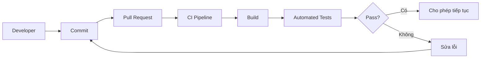

# 024 - CI Test Run

**Học phần:** 05 - Quality, Release and Portfolio  
**Module:** Module 11 - Testing  
**Nhóm nội dung:** Testing Strategy  
**Nguồn roadmap:** Testing / Testing Strategy  
**Loại bài:** lesson  
**Thứ tự trong module:** 024  
**Thời lượng gợi ý:** 30 phút  

---

## 1. Tóm tắt

`CI Test Run` là quá trình tự động chạy các kiểm thử của dự án trong hệ thống Continuous Integration (CI) mỗi khi mã nguồn có thay đổi, chẳng hạn khi developer push commit hoặc tạo Pull Request.

Trong dự án Android, test chạy thành công trên máy cá nhân chưa đủ để bảo đảm thay đổi có thể merge an toàn. Máy của từng developer có thể khác nhau về cấu hình, cache, JDK, Android SDK hoặc trạng thái môi trường. CI cung cấp một môi trường kiểm tra có thể lặp lại để xác minh rằng source code vẫn build được và các test quan trọng vẫn vượt qua.

Một CI test run tốt tạo thành vòng phản hồi:

```text
Thay đổi source code
        ↓
Push / Pull Request
        ↓
CI chuẩn bị môi trường
        ↓
Build
        ↓
Chạy automated tests
        ↓
Phân tích kết quả
        ↓
Pass → có thể tiếp tục merge/release
Fail → sửa lỗi trước khi tiếp tục
```

Mục tiêu không phải chạy càng nhiều test càng tốt trong mọi pipeline, mà là xây dựng một **quality gate nhanh, ổn định và có khả năng phát hiện regression trước khi thay đổi được tích hợp vào codebase chính**.

## 2. Mục tiêu học tập

Sau bài học, người học có thể:

- Giải thích được vai trò của `CI Test Run` trong chiến lược kiểm thử Android.
- Phân biệt test chạy trực tiếp trên JVM với test cần emulator hoặc thiết bị Android.
- Xây dựng được một tập lệnh Gradle có thể chạy giống nhau trên máy local và CI.
- Thiết kế được một CI feedback loop phù hợp cho Pull Request.
- Phân tích được nguyên nhân khi test chỉ thất bại trên CI.
- Xác định được những test nên dùng làm quality gate trước khi merge.
- Tạo được artifact nhỏ thể hiện khả năng tích hợp testing vào quy trình phát triển Android.

## 3. CI Test Run giải quyết vấn đề gì?

Trong quá trình phát triển Android, developer thường kiểm tra thay đổi bằng cách chạy ứng dụng hoặc chạy test trên máy cá nhân.

Cách này có một số giới hạn:

- Developer có thể quên chạy test.
- Chỉ một phần test được chạy.
- Máy local có cache hoặc cấu hình khác CI.
- Code của một người có thể hoạt động riêng lẻ nhưng gây lỗi khi tích hợp với thay đổi của người khác.
- Regression có thể được phát hiện quá muộn, sau khi code đã merge.
- Release có thể chứa lỗi mà automated tests vốn đã có khả năng phát hiện.

CI giải quyết vấn đề bằng cách biến kiểm thử thành một bước tự động của quy trình phát triển.



Developer vẫn chịu trách nhiệm kiểm tra code trước khi push. CI không thay thế local testing mà đóng vai trò như **lớp xác minh độc lập và có thể lặp lại** trước khi thay đổi được tích hợp.

## 4. CI Test Run nằm ở đâu trong quy trình Android?

CI Test Run không phải thành phần chạy bên trong ứng dụng Android production. Nó thuộc **quy trình engineering và quality assurance** bao quanh source code.

Hai thời điểm quan trọng nhất là trước khi merge và trước khi release.

### 4.1. Kiểm tra trước khi merge

Khi Pull Request được tạo hoặc cập nhật, CI nên chạy những kiểm tra có tốc độ đủ nhanh để developer nhận feedback sớm.

Ví dụ:

```text
Pull Request
    ↓
Compile
    ↓
JVM Unit Tests
    ↓
Static Analysis / Lint
    ↓
Quality Gate
```

Nếu một bước thất bại, Pull Request chưa nên được coi là an toàn để merge.

Mục tiêu ở giai đoạn này là phát hiện nhanh:

- lỗi compile;
- regression trong business logic;
- test thất bại;
- lỗi quality nghiêm trọng;
- thay đổi phá vỡ behavior đã được bảo vệ bởi test.

### 4.2. Kiểm tra trước khi release

Release pipeline có thể yêu cầu mức kiểm tra rộng hơn:

```text
Release Candidate
       ↓
Unit Tests
       ↓
Integration Tests
       ↓
Instrumentation / UI Tests
       ↓
Build Artifact
       ↓
Release Gate
```

Các test cần emulator hoặc thiết bị thường tốn thời gian và tài nguyên hơn nên không nhất thiết phải chạy trong mọi commit nếu dự án lớn.

Chiến lược phù hợp thường là:

- test nhanh chạy thường xuyên;
- test chậm chạy tại những checkpoint quan trọng;
- test quan trọng nhất luôn bảo vệ branch hoặc release.

## 5. Các loại test thường xuất hiện trong CI Android

Không phải mọi test Android đều có cùng yêu cầu môi trường.

### 5.1. JVM tests

Local unit tests thường nằm trong:

```text
src/test/
```

Chúng chạy trên JVM của máy build và không cần boot thiết bị Android.

Ví dụ:

```kotlin
import org.junit.Assert.assertEquals
import org.junit.Test

class PriceCalculatorTest {

    @Test
    fun totalPrice_returnsExpectedValue() {
        val quantity = 3
        val unitPrice = 50_000

        val total = quantity * unitPrice

        assertEquals(150_000, total)
    }
}
```

Một lệnh Gradle thường dùng để chạy unit test của debug variant là:

```bash
./gradlew testDebugUnitTest
```

JVM tests thường phù hợp để đặt ở đầu CI pipeline vì:

- khởi động nhanh;
- không cần emulator;
- dễ chạy song song;
- phù hợp với business logic, mapper, use case, validator và nhiều thành phần không phụ thuộc Android Framework.

### 5.2. Instrumentation tests

Instrumentation tests thường nằm trong:

```text
src/androidTest/
```

Khác JVM test, chúng chạy trong môi trường Android thực tế nên cần:

- emulator;
- thiết bị vật lý;
- hoặc hạ tầng device testing tương đương.

Khi CI đã có thiết bị hoặc emulator hoạt động, có thể chạy:

```bash
./gradlew connectedDebugAndroidTest
```

Nhóm này phù hợp cho những behavior phụ thuộc Android Framework hoặc UI, chẳng hạn:

- Activity;
- Fragment;
- Compose UI;
- database integration;
- permission flow;
- navigation;
- interaction với Android system.

| Đặc điểm | JVM Test | Instrumentation Test |
| --- | --- | --- |
| Vị trí thường dùng | `src/test/` | `src/androidTest/` |
| Cần Android device | Không | Có |
| Tốc độ | Thường nhanh | Thường chậm hơn |
| Phù hợp CI nhanh | Rất phù hợp | Cần cân nhắc |
| Business logic | Rất phù hợp | Không cần nếu logic độc lập Android |
| Android Framework/UI | Hạn chế | Phù hợp |

Một chiến lược tốt không cố đưa mọi test lên emulator. Logic có thể kiểm thử độc lập nên ưu tiên JVM test để giữ feedback loop nhanh.

## 6. Xây dựng test command có thể lặp lại

Một nguyên tắc quan trọng của CI là:

> Developer phải có khả năng chạy gần giống quality check của CI ngay trên máy local.

Không nên để pipeline chứa hàng loạt thao tác mà developer không biết cách tái hiện khi CI thất bại.

Ví dụ có thể tạo file:

```text
scripts/ci-test.sh
```

Nội dung:

```bash
#!/usr/bin/env bash

set -euo pipefail

./gradlew --no-daemon testDebugUnitTest lintDebug
```

`set -euo pipefail` giúp script dừng khi command quan trọng thất bại thay vì tiếp tục và tạo kết quả sai lệch.

Developer có thể chạy:

```bash
bash scripts/ci-test.sh
```

CI cũng chạy chính script đó.

Flow trở thành:

```text
Local
  ↓
scripts/ci-test.sh
  ↓
Gradle
```

và:

```text
CI
 ↓
scripts/ci-test.sh
 ↓
Gradle
```

Việc dùng chung command giảm tình trạng:

> Test pass trên máy tôi nhưng fail trên CI.

Nếu instrumentation tests được chạy ở một stage riêng, có thể tách command:

```bash
./gradlew --no-daemon connectedDebugAndroidTest
```

Stage này chỉ được thực thi sau khi CI đã khởi tạo thành công emulator hoặc thiết bị kiểm thử.

## 7. Điều gì xảy ra khi CI test thất bại?

Automated test không chỉ tạo thông báo `PASS` hoặc `FAIL`. Giá trị thực sự nằm ở khả năng chặn regression và cung cấp thông tin đủ để developer tìm nguyên nhân.

Ví dụ pipeline:

```text
Build
  ↓
Unit Tests
  ↓
Lint
  ↓
Instrumentation Tests
```

Nếu `Unit Tests` thất bại:

```text
Build
  ↓
Unit Tests ✗
  ↓
Pipeline Failed
```

Các bước phía sau có thể không cần chạy nữa.

Điều này gọi là **fail fast**: phát hiện lỗi càng sớm càng tốt để tránh tiêu tốn tài nguyên cho các bước đắt hơn.

Một test failure hữu ích cần cho developer biết:

- test nào thất bại;
- assertion nào không đúng;
- expected value là gì;
- actual value là gì;
- stack trace liên quan;
- log cần thiết;
- môi trường hoặc variant được sử dụng.

Ví dụ:

```text
Expected: SUCCESS
Actual: ERROR
```

Thông tin như vậy hữu ích hơn nhiều so với một test chỉ báo:

```text
Something went wrong
```

## 8. Thiết kế CI feedback loop hiệu quả

CI pipeline nên được thiết kế theo nguyên tắc đưa kiểm tra nhanh và có khả năng phát hiện lỗi cao lên trước.

Một thứ tự hợp lý có thể là:

```text
Checkout source
      ↓
Prepare environment
      ↓
Compile / Build verification
      ↓
Fast unit tests
      ↓
Static quality checks
      ↓
Integration tests
      ↓
Device / UI tests
```

Không phải dự án nào cũng cần đầy đủ mọi stage.

Với một ứng dụng Android nhỏ, quality gate ban đầu có thể chỉ cần:

```bash
./gradlew testDebugUnitTest lintDebug
```

Sau khi dự án phát triển, pipeline có thể mở rộng thêm:

- integration tests;
- instrumentation tests;
- UI tests;
- screenshot tests;
- release build verification.

Điểm quan trọng là pipeline phải phát triển cùng độ phức tạp của sản phẩm thay vì thêm test stage chỉ để pipeline trông đầy đủ.

## 9. CI Test Run và lifecycle, state, network

CI bản thân không quản lý lifecycle hoặc state của ứng dụng. Tuy nhiên test chạy trong CI phải bảo vệ những behavior liên quan đến chúng khi behavior đó quan trọng đối với người dùng.

Ví dụ một màn hình:

```text
UI
 ↓
ViewModel
 ↓
Repository
 ↓
Backend API
```

Có thể phát sinh các lỗi:

- request thất bại nhưng UI không hiển thị error;
- ViewModel mất state không đúng cách;
- dữ liệu duplicate sau retry;
- loading state không kết thúc;
- repository trả dữ liệu không hợp lệ;
- navigation xảy ra nhiều lần;
- coroutine bị quản lý sai lifecycle.

Không thể chỉ viết một test mang tên `"CI Test"` để kiểm tra tất cả những vấn đề này.

CI chỉ là nơi **tự động thực thi các test đã được thiết kế để bảo vệ behavior cụ thể**.

Ví dụ:

```text
Network failure
      ↓
Repository returns error
      ↓
ViewModel updates state
      ↓
UI displays retry state
```

Test strategy có thể chia trách nhiệm:

- Repository test kiểm tra mapping network error.
- ViewModel test kiểm tra state transition.
- UI test kiểm tra retry interaction.

CI chạy các test này liên tục để bảo đảm behavior không bị phá vỡ bởi thay đổi mới.

## 10. Những lỗi CI Test Run thường gặp

| Hiện tượng | Nguyên nhân thường gặp | Cách xử lý |
| --- | --- | --- |
| Test pass local nhưng fail CI | Môi trường hoặc dependency khác nhau | Chuẩn hóa JDK, Gradle và command chạy test |
| Test lúc pass lúc fail | Flaky test, race condition hoặc phụ thuộc timing | Loại bỏ phụ thuộc timing, kiểm soát coroutine và test data |
| Instrumentation test không chạy | Emulator/device chưa sẵn sàng | Kiểm tra bước boot và trạng thái thiết bị |
| Pipeline quá chậm | Chạy toàn bộ test đắt tiền ở mọi commit | Chia fast checks và device tests thành các stage |
| CI báo lỗi nhưng khó debug | Không lưu log/report cần thiết | Giữ test report và log quan trọng |
| Test phụ thuộc Internet bên ngoài | External service không ổn định | Dùng fake/mock khi mục tiêu không phải kiểm thử service thật |
| Test phụ thuộc thứ tự | Shared mutable state giữa các test | Làm test độc lập và reset fixture |
| CI chỉ kiểm tra build | Pipeline chưa có quality gate thực sự | Bổ sung automated tests phù hợp |

Một test chạy trong CI nên có ba đặc tính quan trọng:

- **repeatable:** có thể chạy lại;
- **isolated:** không phụ thuộc test khác;
- **deterministic:** cùng điều kiện phải cho cùng kết quả.

## 11. Flaky test là rủi ro nghiêm trọng

Một `flaky test` là test có lúc pass và có lúc fail dù source code không thay đổi.

Ví dụ nguyên nhân:

```kotlin
Thread.sleep(3000)
```

Test dựa vào thời gian cố định có thể hoạt động trên máy local nhưng thất bại khi CI đang tải cao.

Flaky test nguy hiểm vì sau nhiều lần gặp false alarm, developer có xu hướng:

- rerun pipeline cho tới khi pass;
- bỏ qua failure;
- mất niềm tin vào test suite.

Khi đó CI quality gate gần như mất giá trị.

Không nên coi việc rerun liên tục là giải pháp cho flaky test. Cần xác định nguyên nhân và làm test có tính quyết định hơn.

Trong code dùng coroutine, test nên kiểm soát coroutine execution bằng công cụ testing phù hợp thay vì dựa vào thời gian thực.

## 12. Best practices

Khi xây dựng CI Test Run cho Android, nên áp dụng các nguyên tắc sau:

- Cho phép developer chạy quality command tương tự CI trên máy local.
- Chạy test nhanh trước test chậm.
- Không dùng emulator cho logic có thể kiểm thử trên JVM.
- Giữ test độc lập với thứ tự thực thi.
- Không để automated tests phụ thuộc không cần thiết vào Internet thật.
- Không coi flaky test là trạng thái bình thường.
- Đặt tên test thể hiện behavior đang được bảo vệ.
- Fail pipeline khi quality gate quan trọng thất bại.
- Giữ log và report đủ để điều tra lỗi.
- Không biến pipeline thành một tập hợp command mà chỉ một người trong nhóm hiểu.
- Ưu tiên feedback nhanh cho Pull Request.
- Tách các suite rất chậm nếu chúng không cần chạy trong mọi thay đổi.
- Bảo vệ các user flow và business rule có rủi ro cao bằng automated tests.

CI hiệu quả không được đo bằng số lượng stage mà bằng khả năng cung cấp feedback đáng tin cậy trước khi lỗi đến tay người dùng.

## 13. Bài thực hành

Xây dựng một CI test command có thể sử dụng cho một ứng dụng Android mẫu.

### 13.1. Nhiệm vụ 1 - Tạo test bảo vệ business rule

Chọn một logic đơn giản trong ứng dụng, ví dụ:

```text
Order total
Discount
Form validation
Data mapper
Use case
```

Viết ít nhất:

- một test cho trường hợp hợp lệ;
- một test cho trường hợp biên hoặc lỗi.

Ví dụ cấu trúc:

```kotlin
class UsernameValidatorTest {

    @Test
    fun validate_validUsername_returnsTrue() {
        // Arrange

        // Act

        // Assert
    }

    @Test
    fun validate_blankUsername_returnsFalse() {
        // Arrange

        // Act

        // Assert
    }
}
```

### 13.2. Nhiệm vụ 2 - Tạo command CI

Tạo:

```text
scripts/ci-test.sh
```

với nội dung:

```bash
#!/usr/bin/env bash

set -euo pipefail

./gradlew --no-daemon testDebugUnitTest lintDebug
```

Chạy:

```bash
bash scripts/ci-test.sh
```

Xác minh command kết thúc thành công.

Sau đó cố ý làm một assertion sai và chạy lại để quan sát failure.

**Kết quả mong đợi:**

```text
Test đúng
   ↓
CI command PASS

Assertion sai
   ↓
Test FAIL
   ↓
Command trả failure
   ↓
Pipeline có thể chặn thay đổi
```

## 14. Artifact cho portfolio

Bài này có thể tạo một artifact nhỏ nhưng có giá trị hơn việc chỉ ghi trong CV rằng đã biết CI.

Deliverable nên gồm:

```text
project/
├── app/
│   └── src/
│       └── test/
│           └── ...
├── scripts/
│   └── ci-test.sh
└── README.md
```

Trong `README.md`, mô tả ngắn:

- test suite bảo vệ phần nào của ứng dụng;
- command chạy local;
- test nào được dùng làm quality gate;
- pipeline phải làm gì khi test fail;
- nếu có instrumentation tests, chúng được chạy ở stage nào.

Có thể bổ sung screenshot của một CI run thành công và một CI run thất bại nếu repository đã được tích hợp với CI platform.

Không cần tạo pipeline quá phức tạp. Một project nhỏ nhưng chứng minh được rằng automated tests thực sự bảo vệ Pull Request có giá trị hơn một file cấu hình CI dài nhưng không có test hữu ích.

## 15. Checklist hoàn thành

- [ ] Giải thích được `CI Test Run` dùng để giải quyết vấn đề gì.
- [ ] Phân biệt được JVM test và instrumentation test.
- [ ] Biết test nào cần emulator hoặc thiết bị Android.
- [ ] Chạy được `testDebugUnitTest` bằng Gradle.
- [ ] Tạo được command kiểm tra có thể lặp lại.
- [ ] Quan sát được trạng thái pass và fail của automated test.
- [ ] Hiểu vì sao flaky test làm giảm độ tin cậy của CI.
- [ ] Biết cách tổ chức test nhanh trước test tốn tài nguyên.
- [ ] Có ít nhất một test bảo vệ behavior thực tế.
- [ ] Có artifact hoặc README mô tả CI quality gate.

## 16. Câu hỏi tự kiểm tra

1. Vì sao việc test pass trên máy local chưa đủ để quyết định một Pull Request an toàn để merge?
2. Khi nào nên ưu tiên `testDebugUnitTest` thay vì instrumentation test?
3. Vì sao instrumentation tests thường không nên là bước đầu tiên của CI pipeline?
4. Flaky test ảnh hưởng thế nào đến độ tin cậy của quality gate?
5. Nếu một test chỉ thất bại trên CI, những khác biệt môi trường nào cần được kiểm tra?
6. Vì sao developer nên có khả năng chạy local cùng command mà CI sử dụng?
7. Nếu pipeline mất quá nhiều thời gian, nên xóa test hay tổ chức lại test strategy như thế nào?

## 17. Tổng kết

`CI Test Run` biến automated testing từ một thao tác tùy ý của từng developer thành một phần có thể lặp lại của quy trình phát triển phần mềm.

Trong Android, chiến lược cơ bản là:

```text
Source change
     ↓
Local verification
     ↓
Push / Pull Request
     ↓
CI Test Run
     ↓
Quality Gate
     ↓
Merge / Release
```

JVM tests cung cấp feedback nhanh và phù hợp để bảo vệ phần lớn business logic. Instrumentation và UI tests cung cấp mức kiểm chứng sâu hơn nhưng yêu cầu môi trường Android và thường tốn nhiều tài nguyên hơn.

Một CI test run tốt cần **nhanh, ổn định, tái lập được, cung cấp failure rõ ràng và bảo vệ những behavior thực sự quan trọng đối với sản phẩm**. Khi test suite được tích hợp đúng vào Pull Request và release workflow, CI trở thành một trong những cơ chế quan trọng giúp giảm regression và release risk trong dự án Android.