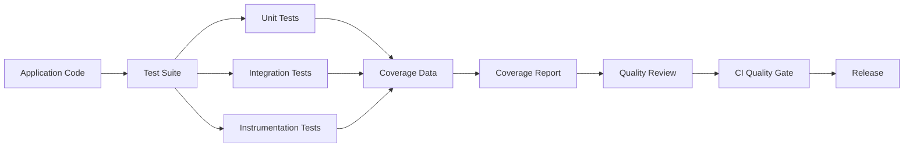
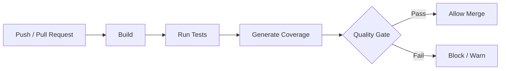

# 025 - Coverage Report

**Học phần:** 05 - Quality, Release and Portfolio  
**Module:** Module 11 - Testing  
**Nhóm nội dung:** Testing Strategy  
**Nguồn roadmap:** Testing / Testing Strategy  
**Loại bài:** lesson  
**Thứ tự trong module:** 025  
**Thời lượng gợi ý:** 30 phút

---

## 1. Tóm tắt

`Coverage Report` là báo cáo cho biết phần nào của mã nguồn đã được thực thi khi bộ kiểm thử chạy. Trong Android, báo cáo này thường được sử dụng cùng unit test, integration test hoặc instrumentation test để đánh giá phạm vi mà test suite hiện tại đang bảo vệ.

Coverage không trả lời trực tiếp câu hỏi:

> Ứng dụng có đúng hoàn toàn hay không?

Thay vào đó, nó giúp trả lời:

> Những phần nào của code đã được test chạy qua và những phần nào chưa được kiểm tra?

Một coverage report tốt giúp developer:

- phát hiện vùng code quan trọng chưa có test;
- đánh giá chất lượng của test suite;
- theo dõi coverage thay đổi sau mỗi feature hoặc refactor;
- thiết lập quality gate trong CI;
- giảm rủi ro regression trước khi release.

Tuy nhiên, coverage cao không đồng nghĩa với test tốt. Một test có thể chạy qua rất nhiều dòng code nhưng không có assertion đủ mạnh để phát hiện lỗi.

---

## 2. Mục tiêu học tập

Sau bài học này, người học có thể:

- Giải thích được mục đích của `Coverage Report` trong chiến lược kiểm thử Android.
- Phân biệt được line coverage, branch coverage, method coverage và class coverage.
- Giải thích được vì sao coverage cao không đồng nghĩa với phần mềm có chất lượng cao.
- Tạo và đọc một coverage report cho một module Android.
- Xác định các vùng code có rủi ro cao nhưng chưa được kiểm thử đầy đủ.
- Sử dụng coverage như một tín hiệu chất lượng thay vì chạy theo một tỷ lệ phần trăm tuyệt đối.
- Đề xuất quality gate phù hợp cho quá trình CI và release.

---

## 3. Coverage Report giải quyết vấn đề gì?

Một Android project có thể chứa hàng nghìn dòng code trải rộng trên nhiều thành phần:

- `ViewModel`;
- `Repository`;
- `UseCase`;
- mapper;
- validator;
- database;
- network client;
- Worker;
- business rules;
- UI state transformation.

Giả sử project có 300 test và tất cả đều báo thành công:

```text
300 tests
    ↓
300 passed
    ↓
Build xanh
```

Thông tin này vẫn chưa cho biết những đoạn code nào thực sự được test.

Ví dụ, một repository có logic:

```kotlin
fun calculateDiscount(total: Double, isPremium: Boolean): Double {
    return if (isPremium) {
        total * 0.8
    } else {
        total
    }
}
```

Nếu test suite chỉ kiểm tra trường hợp:

```text
isPremium = true
```

thì nhánh:

```text
isPremium = false
```

chưa được kiểm chứng.

Coverage tool quan sát việc thực thi code trong quá trình chạy test và tạo báo cáo:

```text
Source Code
     ↓
Instrumentation
     ↓
Run Tests
     ↓
Execution Data
     ↓
Coverage Analysis
     ↓
HTML / XML Report
```

Từ báo cáo này, developer có thể nhìn thấy vùng code nào đã chạy và vùng nào chưa chạy.

---

## 4. Các chỉ số coverage quan trọng

Coverage không chỉ có một chỉ số duy nhất. Một báo cáo thường chứa nhiều metric khác nhau.

### 4.1. Line Coverage

`Line Coverage` đo tỷ lệ dòng code có thể thực thi đã được chạy trong quá trình test.

Công thức khái quát:

```text
Line Coverage
=
Số dòng đã được thực thi
─────────────────────────
Tổng số dòng có thể thực thi
× 100%
```

Ví dụ:

```text
100 dòng có thể thực thi
80 dòng được test chạy qua

Line Coverage = 80%
```

Line coverage rất dễ đọc nhưng không đảm bảo mọi nhánh logic đã được kiểm tra.

### 4.2. Branch Coverage

`Branch Coverage` đo số nhánh điều kiện đã được thực thi.

Ví dụ:

```kotlin
fun canCheckout(balance: Double): Boolean {
    return if (balance > 0) {
        true
    } else {
        false
    }
}
```

Có hai nhánh:

```text
balance > 0
├── true
└── false
```

Nếu test chỉ sử dụng:

```kotlin
canCheckout(100.0)
```

thì dòng chứa `if` có thể đã được thực thi nhưng nhánh `false` vẫn chưa được test.

Đây là lý do branch coverage thường cung cấp tín hiệu tốt hơn line coverage đối với business logic.

### 4.3. Method Coverage

`Method Coverage` cho biết bao nhiêu method hoặc function đã được gọi ít nhất một lần trong quá trình test.

Ví dụ một class có:

```text
login()
logout()
refreshToken()
deleteAccount()
```

Nếu test chỉ gọi:

```text
login()
logout()
```

thì method coverage mới chỉ bao phủ một phần API của class.

### 4.4. Class Coverage

`Class Coverage` đo số class được sử dụng khi chạy test.

Metric này hữu ích để phát hiện những vùng lớn của hệ thống hoàn toàn chưa được đưa vào test suite.

Ví dụ:

```text
UserRepository        covered
LoginUseCase          covered
PaymentRepository     uncovered
SubscriptionManager   uncovered
```

Một class quan trọng bị hoàn toàn `uncovered` thường đáng chú ý hơn vài dòng utility code chưa được test.

---

## 5. Coverage nằm ở đâu trong chiến lược kiểm thử Android?

Coverage report không phải một loại test.

Nó là công cụ quan sát test suite.



Unit test thường tạo coverage tốt nhất cho:

- business rules;
- `UseCase`;
- mapper;
- validator;
- `ViewModel`;
- state transformation;
- repository logic đã tách dependency.

Instrumentation test có thể kiểm tra các thành phần phụ thuộc Android runtime, nhưng chi phí thực thi cao hơn.

Coverage report tổng hợp dữ liệu đó thành thông tin mà developer có thể sử dụng để quyết định vùng nào cần bổ sung test.

---

## 6. Coverage cao không đồng nghĩa với test tốt

Đây là nguyên tắc quan trọng nhất khi sử dụng coverage.

Giả sử có function:

```kotlin
fun add(a: Int, b: Int): Int {
    return a + b
}
```

Một test như sau:

```kotlin
@Test
fun executeAdd() {
    add(10, 20)
}
```

Test này chạy qua toàn bộ function.

Coverage có thể báo:

```text
Line Coverage: 100%
Method Coverage: 100%
```

Nhưng test không có assertion.

Nếu implementation vô tình bị sửa thành:

```kotlin
fun add(a: Int, b: Int): Int {
    return a - b
}
```

test vẫn có thể pass.

Test tốt hơn:

```kotlin
@Test
fun add_returnsSumOfTwoNumbers() {
    val result = add(10, 20)

    assertEquals(30, result)
}
```

Coverage chỉ đo:

```text
Code đã chạy qua đâu?
```

Assertion và test design mới kiểm tra:

```text
Behavior có đúng hay không?
```

Do đó:

```text
Coverage cao
    ≠
Test chất lượng cao
```

Mục tiêu đúng là:

```text
Test đúng hành vi
      +
Bao phủ vùng rủi ro
      +
Assertion đủ mạnh
      +
Coverage hợp lý
```

---

## 7. Ví dụ coverage cho business logic Android

Xét một `LoginValidator`:

```kotlin
class LoginValidator {

    fun validate(email: String, password: String): Boolean {
        if (email.isBlank()) {
            return false
        }

        if (password.length < 8) {
            return false
        }

        return true
    }
}
```

Logic có ba đường đi chính:

```text
validate()
   │
   ├── email rỗng ──────────────→ false
   │
   ├── password < 8 ký tự ─────→ false
   │
   └── dữ liệu hợp lệ ─────────→ true
```

Một test duy nhất:

```kotlin
@Test
fun validCredentials_returnTrue() {
    val validator = LoginValidator()

    val result = validator.validate(
        email = "user@example.com",
        password = "password123"
    )

    assertTrue(result)
}
```

chỉ kiểm tra happy path.

Một test suite tốt hơn cần kiểm tra nhiều behavior:

```kotlin
class LoginValidatorTest {

    private val validator = LoginValidator()

    @Test
    fun blankEmail_returnsFalse() {
        val result = validator.validate(
            email = "",
            password = "password123"
        )

        assertFalse(result)
    }

    @Test
    fun shortPassword_returnsFalse() {
        val result = validator.validate(
            email = "user@example.com",
            password = "123"
        )

        assertFalse(result)
    }

    @Test
    fun validCredentials_returnTrue() {
        val result = validator.validate(
            email = "user@example.com",
            password = "password123"
        )

        assertTrue(result)
    }
}
```

Coverage report lúc này không chỉ tăng về số dòng mà còn thể hiện nhiều branch đã được kiểm tra hơn.

Điểm quan trọng không phải là cố đạt `100%`, mà là nhận diện và kiểm thử đầy đủ các behavior có ý nghĩa.

---

## 8. Tạo Coverage Report với JaCoCo

`JaCoCo` là công cụ phổ biến trong hệ sinh thái JVM để thu thập code coverage.

Một pipeline cơ bản có dạng:

```text
Gradle
   ↓
Compile App
   ↓
Compile Tests
   ↓
Run Tests
   ↓
JaCoCo thu execution data
   ↓
Generate Report
   ↓
HTML / XML
```

HTML report phù hợp để developer đọc trực tiếp.

XML report thường được dùng cho:

- CI;
- SonarQube;
- quality gate;
- dashboard chất lượng;
- các công cụ phân tích tự động.

Trong Gradle project, cấu hình cụ thể có thể khác nhau tùy cấu trúc module, Android Gradle Plugin và loại test đang sử dụng. Vì vậy, nên xem coverage task như một phần của build pipeline thay vì copy cứng cấu hình từ project khác.

Một task coverage điển hình cần xác định:

```text
Test execution data
+
Compiled class files
+
Source files
=
Coverage Report
```

Mục tiêu cuối cùng thường là có một lệnh có thể lặp lại, chẳng hạn:

```bash
./gradlew test
```

hoặc một task coverage riêng của project:

```bash
./gradlew jacocoTestReport
```

Tên task thực tế phụ thuộc vào cấu hình Gradle của project.

---

## 9. Cách đọc Coverage Report

Coverage report thường cho phép đi từ cấp tổng quan xuống từng package, class và dòng code.

Ví dụ:

```text
app
├── domain
│   ├── LoginUseCase              95%
│   └── CalculatePriceUseCase     88%
├── data
│   ├── UserRepository            72%
│   └── PaymentRepository         31%
└── presentation
    ├── LoginViewModel            91%
    └── CheckoutViewModel         64%
```

Không nên chỉ nhìn vào:

```text
Project Coverage = 78%
```

Thay vào đó, hãy tìm vùng có sự kết hợp:

```text
Coverage thấp
      +
Business impact cao
      +
Logic phức tạp
      +
Dễ regression
```

Ví dụ:

```text
PaymentRepository = 31%
```

đáng ưu tiên hơn một utility formatter có coverage thấp nhưng gần như không chứa business logic.

Khi đọc từng file, coverage tool thường đánh dấu:

```text
Covered
Partially covered
Uncovered
```

Một nhánh `partially covered` đặc biệt quan trọng vì nó thường cho thấy developer đã test một trường hợp nhưng bỏ sót trường hợp còn lại.

---

## 10. Nên ưu tiên test phần nào?

Không phải mọi dòng code đều có giá trị kiểm thử giống nhau.

Coverage nên tập trung trước vào:

1. Business rules.
2. Logic tính toán.
3. State transition.
4. Error handling.
5. Authentication và authorization logic.
6. Payment hoặc subscription logic.
7. Data transformation.
8. Cache và synchronization logic.
9. Repository có nhiều nhánh xử lý.
10. Bug đã từng xuất hiện trong production.

Ví dụ với Android:

```text
CheckoutViewModel
       ↓
CheckoutUseCase
       ↓
PaymentRepository
       ↓
Backend API
```

Nếu business rule liên quan thanh toán nằm trong `CheckoutUseCase`, đây là vùng đáng có coverage cao và test kỹ hơn UI animation hoặc getter đơn giản.

---

## 11. Những vùng không nên chạy theo coverage một cách máy móc

Một project không nhất thiết phải đạt 100% coverage.

Một số code thường mang giá trị coverage thấp hơn:

- generated code;
- trivial getter/setter;
- Android framework boilerplate;
- code chỉ gọi trực tiếp SDK mà không có business logic;
- dependency injection wiring đơn giản;
- model chỉ chứa dữ liệu;
- UI code rất khó kiểm thử bằng unit test nhưng được bảo vệ bằng UI test khác.

Ví dụ:

```kotlin
data class User(
    val id: String,
    val name: String
)
```

Viết test chỉ để đảm bảo constructor của `User` tăng coverage thường không mang lại nhiều giá trị.

Ngược lại:

```kotlin
fun calculateSubscriptionPrice(
    basePrice: Double,
    discount: Double,
    tax: Double
): Double
```

là logic đáng kiểm thử kỹ.

Coverage phải phản ánh ưu tiên rủi ro, không phải cuộc đua tăng phần trăm.

---

## 12. Coverage và các loại test

Mỗi tầng test cung cấp một góc nhìn khác nhau.

| Loại test | Mục tiêu chính | Coverage thường phù hợp |
| --- | --- | --- |
| Unit test | Kiểm tra logic nhỏ, cô lập | Business logic, ViewModel, UseCase |
| Integration test | Kiểm tra nhiều component phối hợp | Repository, database, API adapter |
| Instrumentation test | Kiểm tra trong Android runtime | Android framework integration |
| UI test | Kiểm tra user flow | Hành vi giao diện và flow quan trọng |

Không nên cố dùng một loại test để bao phủ mọi thứ.

Ví dụ:

```text
Business rule
→ Unit Test

Room + Repository
→ Integration Test

Navigation + UI interaction
→ UI / Instrumentation Test
```

Coverage report cần được đọc trong bối cảnh test pyramid của project.

---

## 13. Coverage trong CI

Coverage trở nên hữu ích hơn khi được tự động hóa.

Một CI pipeline có thể hoạt động như sau:



Quality gate có thể kiểm tra:

- tổng coverage;
- coverage của module quan trọng;
- coverage của code mới;
- coverage có giảm mạnh hay không.

Trong thực tế, kiểm tra coverage của code mới thường hữu ích hơn việc ép toàn bộ legacy project lập tức đạt một tỷ lệ cao.

Ví dụ:

```text
Legacy code coverage: 45%

Feature mới:
- có test;
- coverage của logic mới đủ tốt;
- tổng coverage không giảm.
```

Cách này cho phép chất lượng được cải thiện dần thay vì buộc team viết hàng trăm test ít giá trị chỉ để đạt một con số.

---

## 14. Những lỗi thường gặp khi sử dụng Coverage Report

**Hiện tượng:** Coverage đạt hơn 90% nhưng production vẫn xuất hiện nhiều bug.

**Nguyên nhân:** Test chỉ chạy code nhưng assertion yếu hoặc không kiểm tra behavior quan trọng.

**Cách xử lý:** Review chất lượng test, boundary case và assertion thay vì chỉ tăng coverage.

---

**Hiện tượng:** Developer viết test cho getter, constructor và model đơn giản để tăng coverage.

**Nguyên nhân:** Coverage percentage trở thành KPI.

**Cách xử lý:** Ưu tiên risk-based testing và business-critical code.

---

**Hiện tượng:** Một dòng được đánh dấu covered nhưng vẫn tồn tại bug.

**Nguyên nhân:** Line coverage không chứng minh tất cả input và branch đã được kiểm tra.

**Cách xử lý:** Xem thêm branch coverage và thiết kế test theo behavior.

---

**Hiện tượng:** Coverage report thiếu class Kotlin hoặc Android class.

**Nguyên nhân:** Report task có thể chưa trỏ đúng compiled classes, source directories hoặc execution data.

**Cách xử lý:** Kiểm tra lại cấu hình coverage của từng Gradle module và variant.

---

**Hiện tượng:** Coverage giảm mạnh sau khi thêm feature.

**Nguyên nhân:** Feature mới có nhiều production code nhưng chưa có test tương ứng.

**Cách xử lý:** Xem diff coverage và bổ sung test cho phần behavior mới.

---

## 15. Best practices

- Sử dụng coverage như một tín hiệu chất lượng, không phải mục tiêu duy nhất.
- Ưu tiên branch coverage đối với code chứa nhiều điều kiện.
- Tập trung coverage vào business-critical code.
- Kiểm tra cả happy path, error path và boundary case.
- Không viết meaningless test chỉ để tăng phần trăm.
- Kết hợp coverage với code review và mutation testing khi cần đánh giá sâu hơn chất lượng test.
- Lưu coverage report dưới dạng artifact của CI khi hữu ích.
- Theo dõi coverage của code mới để ngăn chất lượng suy giảm.
- Review các file hoàn toàn `uncovered` sau khi thêm feature lớn.
- Không đặt cùng một coverage threshold cho mọi module nếu mức rủi ro của chúng khác nhau.

---

## 16. Coverage và release risk

Coverage hữu ích nhất khi được kết nối với rủi ro release.

Trước khi release, có thể đặt các câu hỏi:

```text
Feature mới có business logic không?
        ↓
Có test cho behavior chính không?
        ↓
Error path đã được kiểm tra chưa?
        ↓
Coverage report còn vùng quan trọng nào đỏ không?
        ↓
Có regression test cho bug đã sửa không?
        ↓
Có thể release?
```

Ví dụ một feature checkout chứa:

```text
Load cart
   ↓
Calculate price
   ↓
Apply voucher
   ↓
Create payment
   ↓
Handle payment result
```

Nếu coverage cho thấy nhánh payment failure chưa bao giờ được thực thi trong test suite, đây là tín hiệu cần xem xét trước khi release.

Coverage lúc này không chỉ là số liệu kỹ thuật mà trở thành công cụ quản lý release risk.

---

## 17. Bài thực hành

Tạo coverage report cho một Android project nhỏ có ít nhất một class chứa business logic.

Sử dụng ví dụ như:

```kotlin
class ShippingCalculator {

    fun calculate(orderValue: Double): Double {
        return if (orderValue >= 500_000) {
            0.0
        } else {
            30_000.0
        }
    }
}
```

Thực hiện các nhiệm vụ sau:

1. Viết test cho trường hợp đơn hàng đủ điều kiện miễn phí vận chuyển.
2. Chạy test và tạo coverage report.
3. Quan sát branch chưa được kiểm thử.
4. Viết thêm test cho trường hợp phải trả phí vận chuyển.
5. Tạo lại coverage report.
6. So sánh coverage trước và sau khi bổ sung test.
7. Ghi lại lý do vì sao test thứ hai có giá trị về mặt behavior chứ không chỉ để tăng coverage.

**Kết quả mong đợi:**

- Có ít nhất hai test kiểm tra hai branch chính.
- Test chứa assertion rõ ràng.
- Có coverage report có thể mở và kiểm tra.
- Có thể xác định được code nào đã và chưa được bao phủ.

---

## 18. Artifact cho portfolio

Một artifact nhỏ nhưng có giá trị có thể gồm:

```text
project/
├── app/
│   └── src/
│       ├── main/
│       └── test/
├── coverage/
│   └── report
└── README.md
```

Trong `README.md`, mô tả ngắn:

- công cụ coverage được sử dụng;
- cách chạy test;
- cách tạo report;
- metric đang theo dõi;
- vùng business logic quan trọng;
- ví dụ một branch từng chưa được test;
- cách coverage được sử dụng trong CI hoặc release checklist.

Một portfolio tốt không chỉ ghi:

> Coverage đạt 90%.

Nên giải thích:

> Coverage report phát hiện payment error branch chưa được test. Sau khi bổ sung regression test cho error path, branch coverage của payment logic được cải thiện và test được đưa vào CI.

Điều này thể hiện khả năng reasoning về chất lượng phần mềm tốt hơn một con số phần trăm đơn lẻ.

---

## 19. Checklist hoàn thành

- [ ] Giải thích được `Coverage Report` dùng để làm gì.
- [ ] Phân biệt được line coverage và branch coverage.
- [ ] Giải thích được vì sao coverage 100% vẫn có thể tồn tại bug.
- [ ] Biết cách xác định vùng code có coverage thấp nhưng rủi ro cao.
- [ ] Có thể tạo coverage report từ một test suite.
- [ ] Biết đọc class, line và branch chưa được bao phủ.
- [ ] Không viết test vô nghĩa chỉ để tăng coverage.
- [ ] Biết cách đưa coverage vào CI hoặc release quality gate.
- [ ] Có một artifact coverage nhỏ có thể trình bày trong portfolio.

---

## 20. Câu hỏi tự kiểm tra

1. Vì sao line coverage cao không đảm bảo tất cả branch của một function đã được test?
2. Một test chạy qua 100% code nhưng không có assertion có giá trị như thế nào?
3. Vì sao business logic nên được ưu tiên coverage hơn generated code hoặc getter đơn giản?
4. Khi coverage của project giảm sau một pull request, cần kiểm tra những gì trước khi kết luận chất lượng đã giảm?
5. Vì sao coverage của code mới có thể là quality gate hữu ích hơn việc ép toàn bộ legacy code đạt 100%?

---

## 21. Tổng kết

`Coverage Report` giúp quan sát phạm vi mà test suite đang bảo vệ trong Android project. Những metric như line coverage, branch coverage, method coverage và class coverage giúp developer phát hiện vùng code chưa được kiểm thử.

Coverage chỉ trả lời câu hỏi code có được thực thi trong test hay không; nó không chứng minh behavior đã được kiểm tra chính xác. Vì vậy, coverage phải được kết hợp với assertion tốt, test design, boundary case, error path và tư duy dựa trên rủi ro.

Mục tiêu của một testing strategy trưởng thành không phải là đạt con số coverage đẹp nhất, mà là đảm bảo những phần code quan trọng nhất của sản phẩm được bảo vệ bởi những test có khả năng phát hiện regression thực sự.