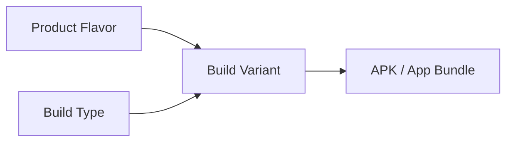
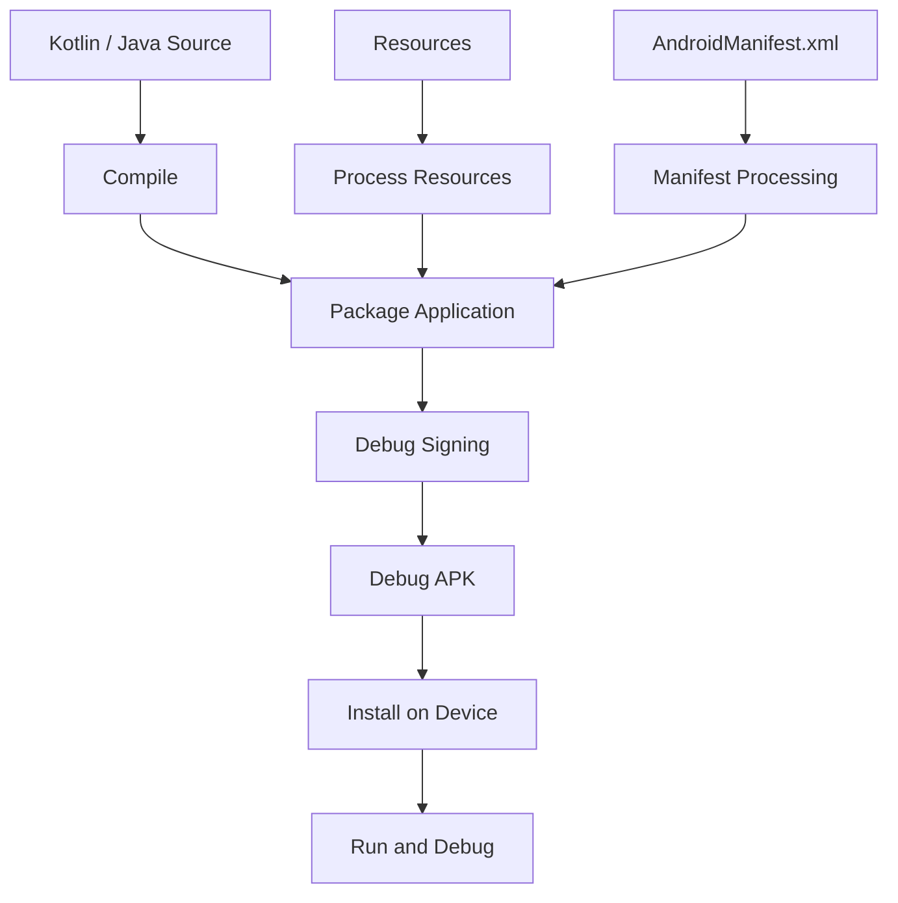
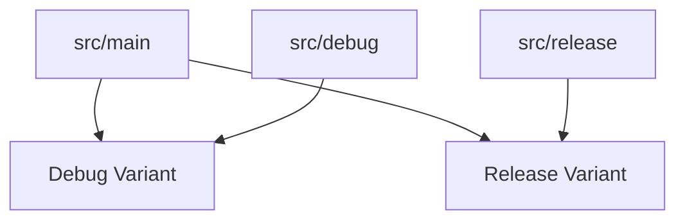

# 001 - Debug Build

**Học phần:** 05 - Quality, Release and Portfolio
**Module:** Module 12 - Distribution and Final Project
**Nhóm nội dung:** Build and Signing
**Nguồn roadmap:** Distribution and Final Project / Build and Signing
**Loại bài:** lesson
**Thứ tự trong module:** 001
**Thời lượng gợi ý:** 45 phút

---

## 1. Tóm tắt

`Debug Build` là phiên bản ứng dụng Android được tạo ra chủ yếu cho quá trình phát triển, chạy thử và gỡ lỗi. Khác với bản phát hành chính thức, debug build thường được cấu hình để debugger có thể kết nối, sử dụng chữ ký debug và cho phép developer quan sát hành vi của ứng dụng dễ dàng hơn.

Hiểu đúng debug build giúp Android developer:

* phân biệt môi trường phát triển với môi trường phát hành;
* chạy và kiểm tra ứng dụng an toàn trong quá trình lập trình;
* sử dụng debugger, Logcat và các công cụ profiling hiệu quả;
* tránh vô tình phát hành cấu hình dành cho development;
* chuẩn bị nền tảng để làm việc với `release`, signing và distribution.

Luồng tổng quát:

```text
Source code
    ↓
Build Variant
    ↓
Debug Build
    ↓
Compile + Package
    ↓
Debug Signing
    ↓
APK / App Bundle phục vụ phát triển
    ↓
Cài đặt → chạy → debug → kiểm thử
```

## 2. Mục tiêu học tập

Sau bài này, người học có thể:

* Giải thích được mục đích của `Debug Build` trong quá trình phát triển ứng dụng Android.
* Phân biệt được `debug` và `release` build ở các đặc điểm quan trọng.
* Xác định được vai trò của `buildTypes` và `Build Variant`.
* Tạo và chạy một debug build bằng Android Studio hoặc Gradle.
* Giải thích được vì sao debug build vẫn cần được ký.
* Sử dụng `BuildConfig.DEBUG` cho những hành vi chỉ phục vụ development khi phù hợp.
* Kiểm tra được artifact debug được tạo ra sau quá trình build.
* Nhận diện được những dữ liệu hoặc công cụ không được phép xuất hiện trong production build.

## 3. Vì sao Android cần Debug Build?

Trong quá trình phát triển, developer cần nhiều khả năng mà người dùng production không cần:

* kết nối debugger;
* đặt breakpoint;
* quan sát biến tại runtime;
* xem log chi tiết;
* thử nghiệm API;
* sử dụng server development;
* hiển thị diagnostic information;
* bật các công cụ kiểm thử nội bộ.

Nếu chỉ tồn tại một cấu hình duy nhất cho cả development và production, source code rất dễ chứa các thiết lập nguy hiểm như:

```text
Development API
Debug logging
Test account
Debug menu
Mock data
Developer tools
        ↓
     Production
```

Điều này làm tăng release risk.

Android build system giải quyết vấn đề bằng cách cho phép tạo nhiều biến thể của cùng một ứng dụng.

Ví dụ phổ biến:

```text
Ứng dụng
├── debug
└── release
```

Developer có thể sử dụng `debug` trong quá trình phát triển, sau đó tạo `release` khi chuẩn bị phân phối ứng dụng.

## 4. Debug Build là gì?

`Debug Build` là artifact của ứng dụng được tạo từ build type `debug`.

Trong một Android project thông thường, Android Gradle Plugin cung cấp hai build type cơ bản:

* `debug`;
* `release`.

`debug` được thiết kế cho quá trình development và debugging.

Ví dụ cấu hình trong `build.gradle.kts`:

```kotlin
android {
    buildTypes {
        getByName("debug") {
            applicationIdSuffix = ".debug"
            versionNameSuffix = "-debug"
        }

        getByName("release") {
            isMinifyEnabled = true
        }
    }
}
```

Việc thêm:

```kotlin
applicationIdSuffix = ".debug"
```

có thể làm application ID của debug build khác với release build.

Ví dụ:

```text
Release:
com.example.myapp

Debug:
com.example.myapp.debug
```

Khi application ID khác nhau, hai phiên bản có thể được cài đồng thời trên cùng một thiết bị.

Đây là một kỹ thuật hữu ích nhưng không bắt buộc đối với mọi dự án.

## 5. Debug, Build Type và Build Variant

Ba thuật ngữ dễ bị nhầm là `Build Type`, `Product Flavor` và `Build Variant`.

| Thành phần       | Vai trò                                                  |
| ---------------- | -------------------------------------------------------- |
| `Build Type`     | Mô tả cách ứng dụng được build, ví dụ `debug`, `release` |
| `Product Flavor` | Mô tả một phiên bản sản phẩm hoặc môi trường             |
| `Build Variant`  | Kết quả kết hợp giữa flavor và build type                |

Nếu project chỉ có:

```text
debug
release
```

thì hai build variant cũng tương ứng với hai build type đó.

Nếu project có thêm:

```text
Flavor:
dev
production

Build Type:
debug
release
```

các variant có thể trở thành:

```text
devDebug
devRelease
productionDebug
productionRelease
```

Có thể hình dung:



`Build Variant` quyết định tập source, resource và cấu hình nào sẽ được sử dụng để tạo artifact cuối cùng.

Với một project nhỏ chưa sử dụng product flavor, `debug` build type thường là đủ cho nhu cầu phát triển hằng ngày.

## 6. Điều gì xảy ra khi tạo một Debug Build?

Khi developer yêu cầu Gradle tạo debug build, nhiều giai đoạn được thực hiện liên tiếp.



Quá trình này có thể được hiểu theo các bước:

1. Kotlin hoặc Java source code được biên dịch.
2. Android resources được xử lý.
3. Manifest được merge và xử lý.
4. Code và resources được đóng gói.
5. Artifact được ký bằng debug signing configuration.
6. APK được tạo.
7. APK có thể được cài lên emulator hoặc thiết bị.
8. Developer chạy ứng dụng và sử dụng debugger hoặc các công cụ kiểm tra.

Debug build vì vậy không chỉ là việc "chạy source code". Nó vẫn trải qua một build pipeline hoàn chỉnh để tạo thành một Android application package có thể cài đặt.

## 7. Debug Signing

Android yêu cầu ứng dụng được ký trước khi có thể được cài đặt theo cơ chế phân phối Android thông thường.

Vì developer không muốn nhập release signing key mỗi lần chạy ứng dụng, môi trường phát triển sử dụng một debug signing key.

Luồng đơn giản:

```text
Debug Build
    ↓
Debug Signing Key
    ↓
Signed Debug APK
    ↓
Install on emulator/device
```

Debug key chỉ phục vụ development.

Không nên xem debug signing key như release signing identity của sản phẩm.

Release signing cần được quản lý riêng vì khóa release có liên quan trực tiếp đến danh tính và quá trình cập nhật ứng dụng được phân phối cho người dùng.

Một nguyên tắc quan trọng là:

> Debug signing phục vụ development; release signing phục vụ distribution.

Không sử dụng debug signing configuration như giải pháp ký production build.

## 8. Tạo Debug Build

Có hai cách phổ biến để tạo debug build.

### 8.1. Tạo bằng Android Studio

Trong Android Studio, chọn build variant phù hợp:

```text
debug
```

Sau đó chạy ứng dụng trên:

* Android Emulator;
* thiết bị Android thật đã được cấu hình cho development.

Khi nhấn Run hoặc Debug, Android Studio phối hợp với Gradle để build, cài đặt và khởi chạy ứng dụng.

Chế độ Debug còn cho phép developer sử dụng:

* breakpoint;
* step over;
* step into;
* variable inspection;
* expression evaluation;
* Logcat.

### 8.2. Tạo bằng Gradle

Có thể build debug APK trực tiếp bằng Gradle Wrapper.

Trên macOS hoặc Linux:

```bash
./gradlew assembleDebug
```

Trên Windows:

```powershell
gradlew.bat assembleDebug
```

Task `assembleDebug` tạo artifact debug nhưng không yêu cầu cài ứng dụng lên thiết bị.

Một task khác thường hữu ích trong quá trình development là:

```bash
./gradlew installDebug
```

Task này build và cài debug variant lên thiết bị hoặc emulator phù hợp đang kết nối.

Sau khi `assembleDebug` hoàn tất, artifact thường nằm trong thư mục build output của module ứng dụng. Developer nên kiểm tra output thực tế của project thay vì phụ thuộc vào một đường dẫn hard-code trong automation.

## 9. Sử dụng `BuildConfig.DEBUG`

Một số hành vi chỉ nên hoạt động trong development.

Ví dụ:

```kotlin
if (BuildConfig.DEBUG) {
    println("Debug mode enabled")
}
```

`BuildConfig.DEBUG` cho phép code kiểm tra build hiện tại có phải debug build hay không.

Một ví dụ thực tế hơn:

```kotlin
fun setupLogging() {
    if (BuildConfig.DEBUG) {
        enableVerboseLogging()
    }
}
```

Cách này phù hợp với những công cụ chỉ phục vụ development.

Tuy nhiên, không nên biến `BuildConfig.DEBUG` thành nơi chứa toàn bộ logic môi trường của ứng dụng.

Ví dụ, nếu ứng dụng có nhiều backend:

```text
Development
Staging
Production
```

thì product flavor, build configuration hoặc dependency injection thường phù hợp hơn so với việc đặt hàng loạt điều kiện:

```kotlin
if (BuildConfig.DEBUG) {
    // ...
} else {
    // ...
}
```

## 10. Debug Build và Release Build

Hai build type phục vụ hai mục tiêu khác nhau.

| Đặc điểm        | Debug Build               | Release Build                     |
| --------------- | ------------------------- | --------------------------------- |
| Mục đích        | Development và debugging  | Phân phối sản phẩm                |
| Debugger        | Phục vụ quá trình debug   | Không nên phụ thuộc vào debugger  |
| Signing         | Debug signing             | Release signing                   |
| Logging         | Có thể chi tiết hơn       | Nên hạn chế log nhạy cảm          |
| Developer tools | Có thể bật                | Nên loại bỏ                       |
| Test endpoint   | Có thể sử dụng            | Không nên sử dụng nhầm            |
| Tối ưu hóa      | Ưu tiên tốc độ phát triển | Có thể áp dụng tối ưu hóa phù hợp |
| Distribution    | Nội bộ development        | Store hoặc distribution channel   |

Điểm quan trọng là không nên đánh giá hiệu năng production chỉ dựa trên debug build.

Debugging, instrumentation hoặc các thiết lập dành cho development có thể làm hành vi runtime khác với release build.

Nếu cần đánh giá:

* startup time;
* rendering performance;
* memory;
* binary size;
* release behavior;

hãy kiểm tra trên build configuration phù hợp với mục tiêu đo.

## 11. Quản lý cấu hình Development

Một debug build thực tế thường cần kết nối đến development environment.

Ví dụ:

```text
Debug App
    ↓
Development API
    ↓
Test Database
```

Trong khi production:

```text
Release App
    ↓
Production API
    ↓
Production Database
```

Không nên hard-code bằng cách chỉnh source thủ công trước mỗi lần build:

```kotlin
const val BASE_URL = "https://dev.example.com/"
```

sau đó nhớ đổi thành production URL trước khi release.

Quy trình này dễ gây lỗi.

Thay vào đó, build configuration nên giúp phân tách môi trường một cách có hệ thống.

Ví dụ:

```kotlin
android {
    buildTypes {
        getByName("debug") {
            buildConfigField(
                "String",
                "API_BASE_URL",
                "\"https://dev.example.com/\""
            )
        }

        getByName("release") {
            buildConfigField(
                "String",
                "API_BASE_URL",
                "\"https://api.example.com/\""
            )
        }
    }
}
```

Sau đó sử dụng:

```kotlin
val baseUrl = BuildConfig.API_BASE_URL
```

Lưu ý rằng build configuration không phải secret vault. Những giá trị được đóng gói vào ứng dụng có khả năng bị phân tích từ artifact.

Không đặt các bí mật thực sự như private server credentials vào APK chỉ vì chúng nằm trong `BuildConfig`.

## 12. Source Set dành cho Debug

Android build system cho phép cung cấp source hoặc resource riêng cho từng variant.

Một project có thể có cấu trúc:

```text
app/
└── src/
    ├── main/
    ├── debug/
    └── release/
```

`src/main/` chứa code và resources dùng chung.

`src/debug/` có thể chứa thành phần chỉ dành cho debug.

Ví dụ:

```text
src/debug/
├── java/
└── res/
```

Trường hợp sử dụng phù hợp gồm:

* debug menu;
* development-only implementation;
* test server configuration;
* diagnostic screen;
* mock integration phục vụ nội bộ.

Ví dụ kiến trúc:



Debug variant nhận nội dung dùng chung từ `main` và nội dung đặc thù từ `debug`.

Release variant không cần đóng gói những thành phần chỉ tồn tại trong debug source set.

Cách tổ chức này thường rõ ràng hơn việc bao quanh một lượng lớn code bằng `if (BuildConfig.DEBUG)`.

## 13. Debug Build không phải Automated Test

`Debug Build` giúp developer chạy và quan sát ứng dụng, nhưng build thành công không đồng nghĩa ứng dụng đúng.

Ví dụ:

```text
assembleDebug thành công
        ↓
Ứng dụng compile được
        ↓
Không đồng nghĩa
        ↓
Logic đúng
UI đúng
Network đúng
State đúng
Lifecycle đúng
```

Debug build nên được kết hợp với các hoạt động kiểm thử như:

* unit test;
* integration test;
* UI test;
* manual exploratory testing;
* static analysis;
* lint;
* release verification.

Một project có thể build hoàn toàn bình thường nhưng vẫn crash khi:

* rotate màn hình;
* mất mạng;
* process bị recreate;
* backend trả lỗi;
* database migration thất bại.

Vì vậy, debug build là một phần của development workflow, không phải bằng chứng duy nhất cho chất lượng ứng dụng.

## 14. Lỗi thường gặp

**Hiện tượng:** Debug build chạy được nhưng release build lỗi.

**Nguyên nhân:** Developer chỉ kiểm thử debug configuration, trong khi release có signing, shrinking, optimization hoặc configuration khác.

**Cách xử lý:** Build và kiểm thử release configuration trước khi phát hành.

---

**Hiện tượng:** Cả debug và release app không thể cài cùng lúc.

**Nguyên nhân:** Hai variant đang sử dụng cùng application ID.

**Cách xử lý:** Nếu workflow cần cài song song, có thể cấu hình `applicationIdSuffix` cho debug build.

---

**Hiện tượng:** Ứng dụng production kết nối nhầm development server.

**Nguyên nhân:** Endpoint bị hard-code hoặc build configuration chưa tách rõ môi trường.

**Cách xử lý:** Phân tách configuration theo variant và kiểm tra release artifact trước distribution.

---

**Hiện tượng:** Log nhạy cảm xuất hiện trong production.

**Nguyên nhân:** Logging dành cho debug không được giới hạn theo build configuration.

**Cách xử lý:** Thiết kế logging strategy riêng và loại bỏ dữ liệu nhạy cảm khỏi log.

---

**Hiện tượng:** Developer kết luận ứng dụng chậm dựa hoàn toàn trên debug build.

**Nguyên nhân:** Debug environment không phản ánh đầy đủ điều kiện runtime của production artifact.

**Cách xử lý:** Đo performance bằng build và configuration thích hợp với mục tiêu benchmark.

## 15. Best practices

* Sử dụng debug build cho development và debugging, không sử dụng như production artifact.
* Giữ release signing material tách biệt với debug signing.
* Không lưu secret thật trong source code hoặc `BuildConfig`.
* Phân tách development và production endpoint bằng build configuration rõ ràng.
* Đặt những công cụ chỉ phục vụ developer trong debug source set khi thích hợp.
* Không để debug menu hoặc diagnostic UI vô tình xuất hiện trong production.
* Luôn kiểm thử release configuration trước khi phát hành.
* Không xem việc `assembleDebug` thành công là đủ để kết luận ứng dụng đã sẵn sàng production.
* Tự động hóa những kiểm tra quan trọng trong CI thay vì phụ thuộc hoàn toàn vào thao tác thủ công.
* Đảm bảo source control không chứa signing credentials hoặc secret production không nên được commit.

## 16. Bài thực hành

Tạo một debug build cho một ứng dụng Android nhỏ và ghi nhận đầy đủ quá trình kiểm tra.

Yêu cầu:

1. Xác nhận build variant đang là `debug`.
2. Build ứng dụng bằng Android Studio.
3. Build lại bằng Gradle:

```bash
./gradlew assembleDebug
```

4. Xác định debug artifact được tạo ra.
5. Cài và chạy ứng dụng trên emulator hoặc thiết bị thật.
6. Đặt ít nhất một breakpoint.
7. Quan sát một giá trị runtime bằng debugger.
8. Thêm một đoạn logic chỉ chạy khi:

```kotlin
BuildConfig.DEBUG
```

9. Xác nhận hành vi debug hoạt động đúng.
10. Ghi lại kết quả trong README.

**Artifact đề xuất:**

```text
android-debug-build/
├── app/
├── screenshots/
│   ├── debug-variant.png
│   └── debugger-breakpoint.png
└── README.md
```

README nên mô tả:

* mục tiêu;
* cách build;
* cách chạy;
* cách debug;
* artifact được tạo;
* khác biệt giữa debug và release;
* giới hạn hoặc lưu ý của project.

## 17. Checklist hoàn thành

* [ ] Giải thích được `Debug Build` là gì.
* [ ] Phân biệt được `debug` và `release`.
* [ ] Giải thích được vai trò của `Build Type`.
* [ ] Giải thích được `Build Variant`.
* [ ] Tạo được debug build bằng Android Studio.
* [ ] Chạy được `assembleDebug`.
* [ ] Xác định được artifact debug.
* [ ] Sử dụng được breakpoint và debugger.
* [ ] Giải thích được mục đích của debug signing.
* [ ] Biết khi nào nên sử dụng `BuildConfig.DEBUG`.
* [ ] Biết cách tránh đưa developer-only behavior vào production.
* [ ] Không lưu secret production trong debug configuration hoặc source code.

## 18. Câu hỏi tự kiểm tra

1. Vì sao Android application vẫn cần được ký khi chỉ chạy trong môi trường development?
2. `Build Type` và `Build Variant` khác nhau như thế nào?
3. Vì sao không nên đánh giá production performance chỉ từ debug build?
4. Khi nào `src/debug/` phù hợp hơn `if (BuildConfig.DEBUG)`?
5. Vì sao `BuildConfig` không nên được coi là nơi lưu trữ secret?
6. Điều gì có thể xảy ra nếu developer chỉ kiểm thử debug build mà không kiểm thử release configuration?

## 19. Tổng kết

`Debug Build` là cấu hình build phục vụ quá trình phát triển, chạy thử và gỡ lỗi ứng dụng Android. Nó cho phép developer sử dụng debugger, logging và các công cụ development thuận tiện mà không trộn trực tiếp những hành vi đó với production workflow.

Một Android developer cần hiểu không chỉ cách nhấn Run trong Android Studio mà còn phải hiểu chuỗi:

```text
Build Type
    ↓
Build Variant
    ↓
Compile + Package
    ↓
Signing
    ↓
Artifact
    ↓
Install
    ↓
Debug và kiểm thử
```

Debug build giúp tăng tốc quá trình phát triển, nhưng chất lượng production chỉ được đảm bảo khi developer còn kiểm tra release configuration, signing, environment, automated tests và release checklist trước khi phân phối ứng dụng.
