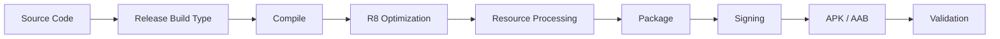

# 002 - Release Build

**Học phần:** 05 - Quality, Release and Portfolio
**Module:** Module 12 - Distribution and Final Project
**Nhóm nội dung:** Build and Signing
**Nguồn roadmap:** Distribution and Final Project / Build and Signing
**Loại bài:** lesson
**Thứ tự trong module:** 002
**Thời lượng gợi ý:** 45 phút

---

## 1. Tóm tắt

Trong quá trình phát triển Android, ứng dụng thường được build dưới nhiều cấu hình khác nhau. Bản dùng để lập trình, chạy thử và debug không nên được phân phối trực tiếp cho người dùng cuối. Trước khi phát hành, ứng dụng cần được tạo dưới dạng **release build**.

Release build là phiên bản ứng dụng được cấu hình cho môi trường phát hành. So với debug build, nó thường loại bỏ các cơ chế phục vụ debug, sử dụng cấu hình production, có thể được tối ưu bằng `R8`, giảm tài nguyên không sử dụng và được ký bằng khóa phát hành phù hợp.

Một quy trình release tốt không chỉ dừng ở việc nhấn **Generate Signed Bundle / APK**. Developer cần hiểu toàn bộ pipeline:

```text
Source code
    ↓
Release configuration
    ↓
Compile
    ↓
R8 / resource optimization
    ↓
Package
    ↓
Signing
    ↓
APK hoặc AAB
    ↓
Validation
    ↓
Distribution
```

Release build là điểm giao giữa phát triển ứng dụng, bảo mật, kiểm thử và quy trình phân phối.

## 2. Mục tiêu học tập

Sau bài này, người học có thể:

* Giải thích được release build khác debug build ở những điểm quan trọng nào.
* Xác định được vai trò của `buildTypes.release` trong Android project.
* Tạo được release APK hoặc Android App Bundle từ Android Studio hoặc Gradle.
* Giải thích được mối quan hệ giữa release build, signing và artifact phân phối.
* Cấu hình được các tùy chọn tối ưu cơ bản như `isMinifyEnabled` và `isShrinkResources`.
* Xác định được các lỗi chỉ xuất hiện ở release build và phương pháp kiểm tra chúng.
* Xây dựng được checklist kiểm tra trước khi đưa artifact vào quy trình phát hành.

## 3. Release build giải quyết vấn đề gì?

Trong quá trình phát triển, developer cần một ứng dụng dễ quan sát và dễ sửa lỗi. Vì vậy debug build thường ưu tiên tốc độ phát triển hơn khả năng tối ưu hoặc bảo vệ mã.

Ví dụ, một debug build có thể:

* cho phép debugger kết nối;
* sử dụng server development;
* bật logging chi tiết;
* bỏ qua một số bước tối ưu;
* sử dụng debug signing key;
* chứa công cụ phục vụ kiểm thử nội bộ.

Những đặc điểm này không phù hợp với ứng dụng production.

Release build giải quyết vấn đề bằng cách tạo ra một cấu hình riêng dành cho phân phối:

```text
Development
    ↓
Debug Build
    ↓
Phát triển và kiểm thử nhanh

Production
    ↓
Release Build
    ↓
Tối ưu + ký + kiểm chứng
    ↓
Phân phối
```

Điểm quan trọng là release build không chỉ là "debug build được đổi tên". Nó có thể đi qua các bước xử lý khác, sử dụng configuration khác và tạo ra hành vi khác với bản debug.

## 4. Debug build và release build

| Đặc điểm                 | Debug build             | Release build                                    |
| ------------------------ | ----------------------- | ------------------------------------------------ |
| Mục đích                 | Phát triển và debug     | Phân phối                                        |
| Debugger                 | Thường được hỗ trợ      | Không dùng cho quy trình production thông thường |
| Signing                  | Debug key               | Release signing key                              |
| Logging                  | Thường chi tiết         | Nên hạn chế                                      |
| Tối ưu mã                | Thường ít hơn           | Có thể sử dụng `R8`                              |
| Resource shrinking       | Thường không cần        | Có thể bật                                       |
| API/configuration        | Có thể dùng development | Thường dùng production                           |
| Artifact                 | APK phục vụ phát triển  | APK hoặc AAB phục vụ phân phối                   |
| Kiểm thử trước phát hành | Chưa đủ                 | Bắt buộc                                         |

Release build phải được kiểm thử riêng. Việc debug build hoạt động không đảm bảo release build cũng hoạt động.

## 5. Vị trí của release build trong Android project

Android Gradle Plugin cho phép định nghĩa nhiều **build type**. Hai build type phổ biến nhất là:

* `debug`;
* `release`.

Trong project sử dụng Kotlin DSL, cấu hình có thể nằm trong `app/build.gradle.kts`.

Ví dụ:

```kotlin
android {
    buildTypes {
        getByName("release") {
            isMinifyEnabled = true
            isShrinkResources = true

            proguardFiles(
                getDefaultProguardFile("proguard-android-optimize.txt"),
                "proguard-rules.pro"
            )
        }
    }
}
```

Trong cấu hình này:

* `isMinifyEnabled` cho phép quá trình shrink, optimize và obfuscate code thông qua `R8`;
* `isShrinkResources` loại bỏ resource không còn được sử dụng;
* `proguardFiles()` xác định các rule được sử dụng trong quá trình tối ưu.

Không phải project nào cũng cần bật toàn bộ tùy chọn ngay từ đầu. Khi bật tối ưu, release build phải được kiểm thử cẩn thận vì một số thư viện hoặc cơ chế reflection có thể cần keep rule riêng.

## 6. Pipeline tạo release build

Quá trình tạo release artifact có thể được mô hình hóa như sau:



Các thành phần trong pipeline có trách nhiệm khác nhau:

* **Source Code:** mã Kotlin/Java và resource của ứng dụng.
* **Release Build Type:** xác định cấu hình dành cho production.
* **Compile:** biên dịch source và dependency.
* **R8 Optimization:** có thể shrink, optimize và obfuscate bytecode.
* **Resource Processing:** đóng gói và có thể loại bỏ resource không sử dụng.
* **Package:** tạo artifact Android.
* **Signing:** áp dụng thông tin chữ ký cần thiết.
* **Validation:** kiểm tra artifact trước khi phân phối.

Chỉ khi pipeline hoàn thành thành công mới có thể xem artifact là ứng viên cho quá trình phát hành.

## 7. Cấu hình release build

Một cấu hình release điển hình cần quan tâm đến nhiều yếu tố hơn việc bật `minify`.

Ví dụ:

```kotlin
android {
    buildTypes {
        getByName("release") {
            isMinifyEnabled = true
            isShrinkResources = true

            proguardFiles(
                getDefaultProguardFile("proguard-android-optimize.txt"),
                "proguard-rules.pro"
            )
        }
    }
}
```

Ngoài các thuộc tính trực tiếp của build type, ứng dụng production thường còn phụ thuộc vào:

* endpoint backend;
* API key;
* feature flags;
* logging policy;
* analytics configuration;
* crash reporting;
* network security configuration;
* signing configuration.

Không nên hard-code bí mật production trực tiếp vào source code chỉ vì chúng được sử dụng trong release build.

## 8. Tối ưu bằng R8

`R8` là công cụ tối ưu code trong Android build toolchain. Khi minification được bật, nó có thể thực hiện nhiều nhiệm vụ.

### 8.1. Code shrinking

Code không được sử dụng có thể bị loại bỏ.

Ví dụ:

```text
Application code
    +
Libraries
    ↓
Reachability analysis
    ↓
Loại code không cần thiết
```

Điều này có thể giảm kích thước ứng dụng.

### 8.2. Optimization

Một số đoạn code có thể được biến đổi để thực thi hiệu quả hơn hoặc tạo output nhỏ hơn.

### 8.3. Obfuscation

Tên class, method hoặc field có thể được đổi thành tên ngắn hơn khi phù hợp.

Ví dụ về mặt khái niệm:

```text
UserRepository
        ↓
        a
```

Obfuscation không nên được xem là cơ chế bảo mật tuyệt đối. Nó chủ yếu làm code khó đọc hơn và hỗ trợ giảm kích thước.

### 8.4. Vì sao R8 có thể gây lỗi?

Một số framework tìm class hoặc method thông qua reflection thay vì reference trực tiếp.

Ví dụ:

```text
Code không thấy reference trực tiếp
        ↓
R8 cho rằng không được sử dụng
        ↓
Class bị loại bỏ
        ↓
Runtime cần class đó
        ↓
Crash
```

Khi đó developer có thể cần bổ sung keep rule trong `proguard-rules.pro`.

Ví dụ về cú pháp:

```proguard
-keep class com.example.models.** { *; }
```

Không nên thêm keep rule quá rộng một cách tùy tiện, vì điều đó làm mất lợi ích của code shrinking.

## 9. Resource shrinking

Khi `isShrinkResources` được bật cùng quá trình shrink code, Android build system có thể loại bỏ resource không cần thiết.

Ví dụ project có:

```text
drawable/
    icon_home.xml
    icon_profile.xml
    legacy_banner.png
```

Nếu `legacy_banner.png` không còn được sử dụng, resource shrinking có thể loại nó khỏi release artifact.

Cấu hình:

```kotlin
getByName("release") {
    isMinifyEnabled = true
    isShrinkResources = true
}
```

Resource shrinking giúp giảm kích thước artifact, nhưng release build vẫn phải được kiểm thử nếu ứng dụng truy cập resource theo cách động.

## 10. Tạo release build bằng Android Studio

Android Studio cung cấp giao diện tạo artifact release.

Một quy trình phổ biến:

1. Mở Android project.
2. Đảm bảo project build thành công.
3. Chọn chức năng tạo signed bundle hoặc APK.
4. Chọn loại artifact cần tạo.
5. Cấu hình thông tin signing phù hợp.
6. Chọn build variant `release`.
7. Thực hiện build.
8. Kiểm tra artifact được sinh ra.

Tùy mục đích phân phối, artifact có thể là:

* `APK`;
* `AAB`.

APK thuận tiện cho cài đặt trực tiếp, kiểm thử hoặc một số kênh phân phối.

Android App Bundle thường được dùng trong quy trình phân phối qua Google Play.

## 11. Tạo release build bằng Gradle

Release build cũng có thể được tạo từ command line, đặc biệt hữu ích trong CI/CD.

Để tạo release APK:

```bash
./gradlew assembleRelease
```

Đối với Windows:

```powershell
gradlew.bat assembleRelease
```

Để tạo release Android App Bundle:

```bash
./gradlew bundleRelease
```

Các command này phù hợp với automation vì không phụ thuộc vào giao diện Android Studio.

Một pipeline CI có thể thực hiện:

```text
Checkout source
    ↓
Setup JDK
    ↓
Resolve dependencies
    ↓
Run tests
    ↓
Build release
    ↓
Sign
    ↓
Validate artifact
    ↓
Upload artifact
```

Đây là lý do developer cần hiểu Gradle task thay vì chỉ biết thao tác bằng IDE.

## 12. Không để thông tin production trong source code

Một lỗi phổ biến là hard-code configuration trực tiếp:

```kotlin
const val API_URL = "https://production.example.com"
```

Cách này nhanh nhưng trở nên khó quản lý khi có nhiều môi trường.

Một project có thể cần:

```text
Development
Staging
Production
```

Build type và product flavor có thể được kết hợp để tạo configuration phù hợp.

Ví dụ về mặt khái niệm:

```text
stagingDebug
stagingRelease
productionDebug
productionRelease
```

Điều quan trọng không phải là tạo thật nhiều variant, mà là đảm bảo release artifact sử dụng đúng backend và đúng configuration.

## 13. Logging trong release build

Logging giúp debug nhưng có thể tạo rủi ro nếu release build ghi quá nhiều thông tin.

Không nên để log chứa:

* access token;
* password;
* API secret;
* thông tin nhận dạng nhạy cảm;
* nội dung request chứa dữ liệu riêng tư;
* dữ liệu nội bộ không cần thiết.

Ví dụ không nên dùng:

```kotlin
Log.d("Auth", "token=$accessToken")
```

Một hướng tiếp cận tốt hơn là chỉ bật log chi tiết trong debug build:

```kotlin
if (BuildConfig.DEBUG) {
    Log.d("Network", "Request completed")
}
```

Tuy nhiên `BuildConfig.DEBUG` không thay thế một logging architecture tốt. Production application vẫn nên có quy tắc rõ ràng về những dữ liệu nào được phép ghi log.

## 14. Vì sao release build có thể lỗi dù debug build chạy tốt?

Đây là một trong những vấn đề quan trọng nhất khi làm release.

Một số nguyên nhân thường gặp:

| Hiện tượng                | Nguyên nhân có thể                                 |
| ------------------------- | -------------------------------------------------- |
| App crash khi mở          | R8 loại class cần thiết                            |
| JSON parse lỗi            | Model bị ảnh hưởng bởi obfuscation hoặc reflection |
| API không hoạt động       | Release đang dùng sai endpoint hoặc config         |
| Một số màn hình trống     | Resource hoặc code bị shrink không đúng            |
| Login thất bại            | Production credential/config sai                   |
| Deep link không hoạt động | Manifest hoặc domain configuration chưa đúng       |
| Crash khó đọc             | Stack trace đã bị obfuscate                        |

Vì vậy:

> Debug build thành công không phải là bằng chứng release build đã sẵn sàng.

## 15. Kiểm thử release build

Release artifact nên được cài và kiểm tra như một ứng dụng thật.

Ít nhất cần kiểm tra các luồng quan trọng:

1. Khởi động ứng dụng.
2. Đăng nhập hoặc onboarding.
3. Điều hướng giữa các màn hình chính.
4. Thao tác với network API.
5. Đọc và ghi local storage.
6. Background hoặc foreground transition.
7. Permission flow.
8. Deep link nếu ứng dụng hỗ trợ.
9. Error state.
10. Các tính năng quan trọng nhất của sản phẩm.

Đặc biệt cần quan sát:

* crash;
* ANR;
* lỗi serialization;
* lỗi reflection;
* configuration production;
* network security;
* performance;
* hành vi sau khi process bị khởi động lại.

Không nên coi việc build thành công là bước kiểm thử cuối cùng.

## 16. Kiểm tra artifact

Sau khi build, developer cần biết artifact nào đã được tạo và artifact đó dùng để làm gì.

Ví dụ:

```text
Release pipeline
    ↓
APK
    → cài trực tiếp lên thiết bị
    → QA nội bộ
    → một số kênh phân phối

AAB
    → upload lên store hỗ trợ App Bundle
    → store tạo APK phù hợp cho thiết bị
```

Trước khi gửi artifact, cần kiểm tra tối thiểu:

* package/application ID;
* version information;
* build type;
* signing;
* kích thước;
* khả năng cài đặt;
* chức năng chính;
* production configuration.

## 17. Lỗi thường gặp

**Hiện tượng:** `assembleRelease` build thất bại nhưng debug build thành công.
**Nguyên nhân:** Release build kích hoạt minification, signing hoặc configuration không được sử dụng trong debug.
**Cách xử lý:** Đọc lỗi Gradle theo nguyên nhân gốc, sau đó kiểm tra release-specific configuration.

**Hiện tượng:** Ứng dụng release crash tại runtime.
**Nguyên nhân:** `R8` có thể đã loại hoặc đổi tên thành phần được truy cập bằng reflection.
**Cách xử lý:** Kiểm tra stack trace, mapping và tài liệu của thư viện để bổ sung rule cần thiết.

**Hiện tượng:** Release build gọi nhầm development API.
**Nguyên nhân:** Endpoint bị hard-code hoặc build configuration chưa tách môi trường.
**Cách xử lý:** Xác định rõ configuration theo variant và kiểm tra artifact trước release.

**Hiện tượng:** Build release thành công nhưng không thể cài hoặc upload.
**Nguyên nhân:** Artifact, signing, version hoặc cấu hình phân phối không phù hợp.
**Cách xử lý:** Kiểm tra lại artifact type và metadata của bản build.

**Hiện tượng:** Stack trace production khó đọc.
**Nguyên nhân:** Code đã được obfuscate.
**Cách xử lý:** Lưu và quản lý mapping artifact của từng release để phục vụ việc phân tích crash.

## 18. Best practices

* Luôn build và chạy thử đúng variant `release` trước khi phân phối.
* Không giả định rằng debug và release có hành vi giống nhau.
* Tách configuration development và production rõ ràng.
* Không hard-code secret vào source code.
* Không ghi dữ liệu nhạy cảm vào production log.
* Bật minification có kiểm soát và kiểm thử các flow sử dụng reflection.
* Lưu artifact, mapping và thông tin version tương ứng với từng release.
* Chạy automated test trước khi tạo release artifact.
* Xây dựng release bằng Gradle trong CI/CD khi quy trình dự án đủ trưởng thành.
* Không thay đổi signing identity tùy tiện giữa các phiên bản của cùng một ứng dụng.

## 19. Bài thực hành

Tạo release artifact cho một Android application hiện có.

Yêu cầu:

1. Kiểm tra `buildTypes.release` trong `app/build.gradle.kts`.
2. Tạo release APK bằng Gradle.
3. Tạo release AAB bằng Gradle.
4. Xác định vị trí các artifact được sinh ra.
5. Cài release APK lên thiết bị hoặc emulator phù hợp.
6. Chạy ít nhất ba user flow quan trọng.
7. Ghi nhận sự khác biệt giữa debug và release nếu có.

Các command chính:

```bash
./gradlew assembleRelease
```

```bash
./gradlew bundleRelease
```

Nếu project sử dụng signing configuration riêng, cần đảm bảo môi trường build có đủ thông tin cần thiết trước khi chạy task.

**Kết quả mong đợi:**

* Release build hoàn thành thành công.
* Có ít nhất một APK hoặc AAB release hợp lệ.
* Release APK có thể được chạy để kiểm tra chức năng.
* Không phát hiện lỗi nghiêm trọng chỉ xuất hiện ở release variant.

## 20. Artifact cho portfolio

Tạo một mục ngắn trong `README.md` của project để mô tả quy trình release.

Ví dụ nội dung cần có:

```text
Release Build
- Build tool: Gradle
- Release artifact: APK / AAB
- Minification: enabled/disabled
- Resource shrinking: enabled/disabled
- Release validation: completed
```

Có thể bổ sung:

* screenshot ứng dụng chạy từ release build;
* command dùng để build;
* danh sách smoke test;
* mô tả CI/CD nếu project có pipeline tự động.

Không đưa keystore, password, secret hoặc credential production vào repository hay screenshot portfolio.

## 21. Checklist hoàn thành

* [ ] Giải thích được mục đích của release build.
* [ ] Phân biệt được debug build và release build.
* [ ] Xác định được cấu hình `buildTypes.release`.
* [ ] Giải thích được vai trò của `R8`.
* [ ] Giải thích được resource shrinking.
* [ ] Tạo được release APK bằng `assembleRelease`.
* [ ] Tạo được release AAB bằng `bundleRelease`.
* [ ] Hiểu rằng release artifact cần signing phù hợp.
* [ ] Cài và smoke test release build.
* [ ] Kiểm tra production configuration.
* [ ] Không để secret hoặc dữ liệu nhạy cảm trong log.
* [ ] Kiểm tra các lỗi có thể chỉ xuất hiện sau minification.
* [ ] Có quy trình lưu artifact và thông tin tương ứng với từng release.

## 22. Câu hỏi tự kiểm tra

1. Vì sao ứng dụng chạy ổn ở debug build nhưng vẫn có thể crash ở release build?
2. `isMinifyEnabled` và `isShrinkResources` giải quyết hai vấn đề khác nhau như thế nào?
3. Vì sao không nên kiểm tra release chỉ bằng việc xác nhận Gradle báo `BUILD SUCCESSFUL`?
4. Trong trường hợp nào developer có thể cần thêm keep rule cho `R8`?
5. Vì sao configuration và logging cần được xem xét riêng trước khi phát hành production?

## 23. Tổng kết

Release build là phiên bản Android application được chuẩn bị cho quá trình phân phối thay vì phục vụ trực tiếp cho hoạt động development.

Một release build đáng tin cậy cần kết hợp nhiều yếu tố:

```text
Đúng configuration
      +
Build thành công
      +
Optimization đúng
      +
Signing đúng
      +
Artifact đúng
      +
Kiểm thử release
      ↓
Release candidate đáng tin cậy
```

Developer không nên coi release là thao tác cuối cùng trong Android Studio. Đây là một quy trình kỹ thuật cần được kiểm soát, kiểm thử và có khả năng tái tạo. Khi release pipeline được xây dựng tốt, việc đưa ứng dụng từ source code đến artifact phân phối trở nên an toàn, nhất quán và phù hợp hơn với môi trường production.
