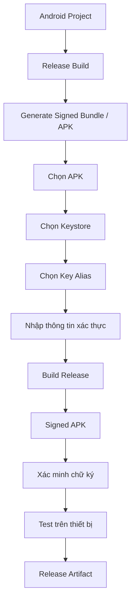

# 003 - Signed APK

**Học phần:** 05 - Quality, Release and Portfolio
**Module:** Module 12 - Distribution and Final Project
**Nhóm nội dung:** Build and Signing
**Nguồn roadmap:** Distribution and Final Project / Build and Signing
**Loại bài:** lab
**Thứ tự trong module:** 003
**Thời lượng gợi ý:** 45 phút

---

## 1. Tổng quan

Một ứng dụng Android không thể được phân phối như một bản release hoàn chỉnh nếu chưa được **ký số** bằng khóa của nhà phát triển.

Trong quá trình phát triển, Android Studio có thể tự động ký ứng dụng bằng debug key. Tuy nhiên, khi chuẩn bị APK để kiểm thử release, gửi cho tester, cài đặt ngoài Google Play hoặc phân phối qua một kênh khác, developer cần tạo **Signed APK** bằng release key.

Quy trình tổng quát:

```text
Android Project
      ↓
Release Build
      ↓
Keystore
      ↓
Private Key + Key Alias
      ↓
Ký APK
      ↓
Signed APK
      ↓
Kiểm tra chữ ký
      ↓
Phân phối / kiểm thử release
```

Mục tiêu của bài thực hành này là tạo một Signed APK hoàn chỉnh, xác minh chữ ký và xây dựng một artifact release có thể đưa vào portfolio.

---

## 2. Mục tiêu

Sau khi hoàn thành bài thực hành, bạn có thể:

* Giải thích được vì sao ứng dụng Android cần được ký số.
* Phân biệt được debug signing và release signing.
* Giải thích được vai trò của `keystore`, private key và `key alias`.
* Tạo được release keystore cho ứng dụng Android.
* Build được một Signed APK bằng Android Studio.
* Xác minh được APK đã được ký hợp lệ.
* Cài đặt và kiểm thử bản release trên thiết bị.
* Nhận biết được các rủi ro liên quan đến việc mất hoặc làm lộ signing key.
* Tạo được release artifact có README và checklist phục vụ portfolio.

---

## 3. Vì sao Android yêu cầu ứng dụng phải được ký?

Android sử dụng chữ ký số để xác định **danh tính của ứng dụng**.

Chữ ký không có nghĩa là Google hoặc Android xác nhận ứng dụng an toàn. Thay vào đó, nó tạo ra một danh tính mật mã giúp hệ điều hành xác định các APK có thuộc cùng một ứng dụng và cùng nhà phát hành hay không.

Một bản cập nhật thường phải được ký bằng signing identity tương thích với phiên bản đã cài trước đó.

Ví dụ:

```text
App 1.0
Signed bằng Key A
      ↓
Người dùng cài đặt
      ↓
App 1.1
Signed bằng Key A
      ↓
Có thể cập nhật
```

Nếu bản mới sử dụng signing identity không phù hợp:

```text
App 1.0
Signed bằng Key A

App 1.1
Signed bằng Key B
      ↓
Signature mismatch
      ↓
Không thể cập nhật trực tiếp như cùng một ứng dụng
```

Signing key vì vậy là một phần của **danh tính dài hạn của ứng dụng**, không phải một file tạm thời chỉ dùng trong quá trình build.

---

## 4. Các thành phần của Android App Signing

### 4.1. Keystore

`keystore` là file lưu trữ một hoặc nhiều key dùng cho quá trình ký.

Một file thường có dạng:

```text
release.jks
```

hoặc:

```text
release.keystore
```

Keystore được bảo vệ bằng mật khẩu.

Trong production, không nên xem keystore như một file source code bình thường.

### 4.2. Key alias

Một keystore có thể chứa nhiều key.

`alias` là tên dùng để xác định key cần sử dụng.

Ví dụ:

```text
Keystore
│
├── android-release
├── internal-app
└── legacy-key
```

Ứng dụng có thể sử dụng alias:

```text
android-release
```

để ký release.

### 4.3. Private key

Private key là phần bí mật quan trọng nhất của signing identity.

Không được:

* commit private key lên public repository;
* gửi private key trong chat;
* ghi password trực tiếp vào README;
* đưa key vào source code;
* lưu key production trong thư mục được chia sẻ công khai.

Nếu private key bị lộ, người khác có thể lợi dụng signing identity trong những mô hình phân phối mà key đó trực tiếp kiểm soát.

---

## 5. Debug signing và release signing

| Đặc điểm                   | Debug signing                        | Release signing                         |
| -------------------------- | ------------------------------------ | --------------------------------------- |
| Mục đích                   | Phát triển và debug                  | Phân phối                               |
| Key                        | Debug key                            | Release key                             |
| Quản lý                    | Thường được Android tooling xử lý    | Developer hoặc hệ thống release quản lý |
| Bảo mật                    | Không dành cho production            | Cần bảo vệ nghiêm ngặt                  |
| Build                      | `debug`                              | `release`                               |
| Portfolio/release artifact | Không phù hợp làm bản phát hành cuối | Phù hợp                                 |

Khi chạy:

```text
Run ▶
```

trực tiếp từ Android Studio, ứng dụng thường sử dụng debug build.

Khi chuẩn bị phiên bản để phát hành, cần kiểm tra release build riêng vì hành vi của release build có thể khác debug build.

---

## 6. Luồng tạo Signed APK



Project được build bằng cấu hình release, sau đó APK được ký bằng key nằm trong keystore. APK tạo ra chưa nên được coi là hoàn thành chỉ vì quá trình build không báo lỗi.

Một release artifact nên trải qua ít nhất ba lớp kiểm tra:

1. Build thành công.
2. Signature hợp lệ.
3. Ứng dụng thực sự cài đặt và hoạt động ở chế độ release.

---

## 7. Chuẩn bị môi trường

Trước khi bắt đầu, cần có:

* Một Android project có thể build thành công.
* Android Studio.
* Android SDK.
* Một thiết bị Android hoặc emulator để kiểm thử.
* Một nơi an toàn để lưu keystore.

Kiểm tra project bằng cách build trước:

```text
Build
→ Make Project
```

Nếu project hiện tại chưa build được, cần sửa các lỗi compile hoặc dependency trước khi thực hiện signing.

> Signed APK không sửa các lỗi của project. Signing chỉ được thực hiện trên artifact đã có khả năng build.

---

## 8. Tạo release keystore

Trong Android Studio, mở chức năng tạo signed artifact:

```text
Build
→ Generate Signed Bundle / APK
```

Chọn:

```text
APK
```

Sau đó chọn tạo mới keystore nếu project chưa có release key.

Các thông tin cơ bản thường gồm:

```text
Key store path
Password
Key alias
Key password
Validity
Certificate information
```

Ví dụ cấu trúc tổ chức:

```text
release/
└── android-release.jks
```

Không nên đặt keystore production trực tiếp trong repository nếu repository có khả năng được chia sẻ.

### Checkpoint 1

Kết quả cần đạt:

* Có file keystore.
* Có một key alias.
* Biết vị trí lưu keystore.
* Password được lưu ở nơi an toàn.
* Keystore không bị commit nhầm vào repository công khai.

---

## 9. Tạo Signed APK

Sau khi có keystore:

1. Mở `Generate Signed Bundle / APK`.
2. Chọn `APK`.
3. Chọn keystore.
4. Chọn đúng `key alias`.
5. Cung cấp thông tin xác thực.
6. Chọn build variant `release`.
7. Thực hiện build.

Artifact thường được đặt trong thư mục build của module ứng dụng, ví dụ theo cấu trúc tương tự:

```text
app/
└── build/
    └── outputs/
        └── apk/
            └── release/
```

Tên file cụ thể phụ thuộc vào cấu hình project.

### Checkpoint 2

Xác nhận:

* Release build hoàn thành không lỗi.
* Có file `.apk`.
* APK được tạo từ `release` variant.
* File có thể được xác định rõ là artifact cần kiểm thử.

---

## 10. Xác minh chữ ký APK

Không nên chỉ dựa vào việc Android Studio thông báo build thành công.

Android SDK cung cấp `apksigner` để làm việc với APK signing.

Có thể kiểm tra bằng:

```bash
apksigner verify --verbose app-release.apk
```

Nếu muốn xem thêm thông tin liên quan đến signer:

```bash
apksigner verify --print-certs app-release.apk
```

Mục tiêu của bước này là xác nhận APK thực sự mang chữ ký hợp lệ thay vì chỉ kiểm tra sự tồn tại của file.

### Checkpoint 3

Signed APK đạt checkpoint khi:

```text
APK tồn tại
    +
Signature verification thành công
    +
Signer information có thể đọc được
```

---

## 11. Cài đặt và kiểm thử bản release

Bản release cần được chạy thực tế.

Có thể cài APK bằng `adb`:

```bash
adb install app-release.apk
```

Nếu cần cập nhật một bản tương thích đang tồn tại trên thiết bị:

```bash
adb install -r app-release.apk
```

Sau khi cài đặt, kiểm thử các user flow quan trọng thay vì chỉ mở ứng dụng rồi đóng.

Ví dụ:

* App khởi động thành công.
* Navigation hoạt động.
* Đăng nhập hoạt động nếu ứng dụng có authentication.
* API request hoạt động.
* Local storage hoạt động.
* Deep link hoạt động nếu có.
* Permission flow hoạt động.
* Không xảy ra crash ở release mode.

### Checkpoint 4

Bản release chỉ được coi là đạt khi:

```text
Signed APK
    ↓
Cài đặt thành công
    ↓
Khởi động thành công
    ↓
Critical user flows hoạt động
```

---

## 12. Vì sao release build có thể lỗi dù debug build hoạt động?

Debug và release không phải lúc nào cũng giống nhau.

Một số khác biệt có thể xuất hiện ở:

* build configuration;
* API endpoint;
* logging;
* code shrinking;
* resource shrinking;
* obfuscation;
* environment variables;
* signing configuration;
* feature chỉ bật trong một variant.

Ví dụ, nếu release bật tối ưu hóa hoặc shrinking, một thư viện dựa vào reflection có thể gặp lỗi nếu cấu hình giữ class không phù hợp.

Do đó:

```text
Debug chạy thành công
```

không đồng nghĩa với:

```text
Release chắc chắn chạy thành công
```

Release artifact phải được kiểm thử như một sản phẩm riêng.

---

## 13. Signed APK và Android App Bundle

`APK` và `AAB` phục vụ những mục đích khác nhau.

| Artifact | Vai trò điển hình                                                         |
| -------- | ------------------------------------------------------------------------- |
| APK      | File có thể cài trực tiếp lên thiết bị Android                            |
| AAB      | Format publishing dùng để hệ thống phân phối tạo APK phù hợp cho thiết bị |

Signed APK đặc biệt hữu ích khi:

* cài trực tiếp trên thiết bị;
* gửi cho tester;
* kiểm thử release build;
* phân phối nội bộ;
* dùng với hệ thống phân phối hỗ trợ APK;
* chuẩn bị một artifact có thể chạy trong portfolio.

Khi phát hành qua Google Play, developer cũng cần hiểu cơ chế **Play App Signing**, thay vì giả định file keystore local luôn tương ứng trực tiếp với toàn bộ signing lifecycle của ứng dụng trên Play.

---

## 14. Quản lý signing configuration trong project

Có thể cấu hình signing cho Gradle để tự động hóa release build.

Ví dụ cấu trúc Kotlin DSL:

```kotlin
android {
    signingConfigs {
        create("release") {
            storeFile = file("release.jks")
            storePassword = System.getenv("KEYSTORE_PASSWORD")
            keyAlias = System.getenv("KEY_ALIAS")
            keyPassword = System.getenv("KEY_PASSWORD")
        }
    }

    buildTypes {
        getByName("release") {
            signingConfig = signingConfigs.getByName("release")
        }
    }
}
```

Điểm quan trọng không nằm ở việc copy nguyên đoạn cấu hình này, mà ở nguyên tắc:

```text
Build configuration
      ↓
Tham chiếu keystore
      ↓
Credentials lấy từ nguồn bảo mật
      ↓
Không hard-code secret vào source
```

Không nên viết:

```kotlin
storePassword = "my-real-production-password"
```

trong source code được commit.

---

## 15. Build Signed APK bằng Gradle

Khi signing configuration đã được thiết lập phù hợp, release build có thể được đưa vào workflow tự động.

Ví dụ:

```bash
./gradlew assembleRelease
```

Quy trình CI/CD có thể phát triển theo hướng:

```text
Source Code
    ↓
CI Pipeline
    ↓
Inject Secret
    ↓
Build Release
    ↓
Sign
    ↓
Verify
    ↓
Test
    ↓
Publish Artifact
```

Keystore và credentials trong CI phải được quản lý thông qua cơ chế secret của hệ thống CI/CD, không phải commit vào repository.

---

## 16. Các lỗi thường gặp

| Hiện tượng                       | Nguyên nhân có thể                          | Cách xử lý                                 |
| -------------------------------- | ------------------------------------------- | ------------------------------------------ |
| Không mở được keystore           | Sai password hoặc sai file                  | Kiểm tra đúng keystore và credentials      |
| Không tìm thấy alias             | Alias nhập sai                              | Liệt kê hoặc kiểm tra key trong keystore   |
| Build release thất bại           | Lỗi cấu hình release                        | Kiểm tra Gradle và build variant           |
| APK build được nhưng crash       | Release configuration khác debug            | Test release và kiểm tra log               |
| Không cập nhật được app cũ       | Signing identity không tương thích          | Kiểm tra chữ ký bản đang cài và bản mới    |
| `apksigner` không được nhận diện | Chưa dùng đúng Android SDK Build Tools path | Kiểm tra SDK và Build Tools                |
| Secret xuất hiện trong Git       | Credentials bị hard-code                    | Xóa secret khỏi source và thay key nếu cần |

---

## 17. Rủi ro release cần tránh

### 17.1. Commit keystore và password

Sai:

```text
project/
├── app/
├── release.jks
└── passwords.txt
```

được đưa toàn bộ lên public Git repository.

Đúng hơn là tách secret khỏi source-controlled configuration và quản lý theo chính sách bảo mật phù hợp.

### 17.2. Chỉ backup keystore nhưng không backup thông tin liên quan

Một keystore không hữu ích nếu team không xác định được:

* file nào là key production;
* alias nào được sử dụng;
* credentials được quản lý ở đâu;
* ứng dụng nào sử dụng key đó.

Cần có quy trình quản lý thay vì chỉ copy file sang một thư mục khác.

### 17.3. Phát hành mà chưa test release build

Không sử dụng debug build làm bằng chứng duy nhất cho chất lượng release.

Quy trình tối thiểu:

```text
Release build
      ↓
Sign
      ↓
Verify
      ↓
Install
      ↓
Smoke test
      ↓
Distribute
```

---

## 18. Artifact portfolio

Mục tiêu cuối của bài thực hành không chỉ là tạo một file APK mà còn tạo bằng chứng cho thấy bạn hiểu release workflow.

Cấu trúc artifact có thể gồm:

```text
signed-apk-release/
├── README.md
├── screenshots/
│   ├── app-release.png
│   └── release-test.png
└── release-checklist.md
```

Không đưa production keystore hoặc password vào portfolio.

README nên mô tả:

* Mục tiêu ứng dụng.
* Cách build project.
* Cách tạo release artifact.
* Cách kiểm tra APK.
* Thiết bị hoặc emulator đã dùng để kiểm thử.
* Các user flow đã kiểm tra.
* Known limitations nếu có.

Ví dụ nội dung kỹ thuật ngắn:

```markdown
## Release verification

Release APK được kiểm tra theo ba bước:

1. Build `release` variant.
2. Xác minh signature bằng `apksigner`.
3. Cài đặt APK và chạy smoke test trên thiết bị Android.
```

---

## 19. Deliverable

Sau bài thực hành, cần hoàn thành:

* Signed APK của ứng dụng.
* Release keystore được lưu an toàn, không đưa vào portfolio công khai.
* Kết quả xác minh chữ ký.
* Ít nhất một screenshot chứng minh release build chạy trên thiết bị hoặc emulator.
* `README.md` mô tả build và verification workflow.
* Release checklist.
* Liên kết artifact từ course progress tracker nếu khóa học sử dụng progress tracker.

Không cần công khai:

* keystore;
* private key;
* keystore password;
* key password;
* CI secret;
* thông tin xác thực production.

---

## 20. Tiêu chí hoàn thành

* [ ] Project build được ở `release` variant.
* [ ] Đã tạo hoặc sử dụng đúng release keystore.
* [ ] Hiểu vai trò của `key alias`.
* [ ] Signed APK được tạo thành công.
* [ ] APK vượt qua bước xác minh chữ ký.
* [ ] APK cài đặt được trên thiết bị hoặc emulator.
* [ ] Ứng dụng khởi động thành công ở release mode.
* [ ] Các critical user flows đã được smoke test.
* [ ] Không hard-code signing password trong source code.
* [ ] Keystore và credentials không xuất hiện trong public repository.
* [ ] Có README mô tả release workflow.
* [ ] Có screenshot hoặc bằng chứng kiểm thử phù hợp.
* [ ] Artifact portfolio không chứa secret.

---

## 21. Tổng kết

Signed APK là một phần quan trọng của Android release engineering. Điểm cốt lõi không chỉ là nhấn nút `Generate Signed Bundle / APK`, mà là hiểu toàn bộ chuỗi:

```text
Release Build
      ↓
Signing Identity
      ↓
Signed APK
      ↓
Signature Verification
      ↓
Release Testing
      ↓
Distribution
```

Signing key đại diện cho danh tính mật mã của ứng dụng và phải được quản lý như một tài sản quan trọng. Đồng thời, bản release cần được kiểm thử độc lập vì việc debug build hoạt động không đảm bảo release build sẽ có cùng hành vi.

Một Android developer hoàn thành tốt bước này phải có khả năng **build, ký, xác minh, kiểm thử và quản lý Signed APK một cách an toàn**, đồng thời lưu lại quy trình dưới dạng release artifact có thể tái sử dụng trong production và portfolio.
