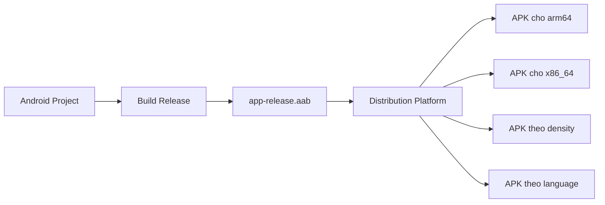
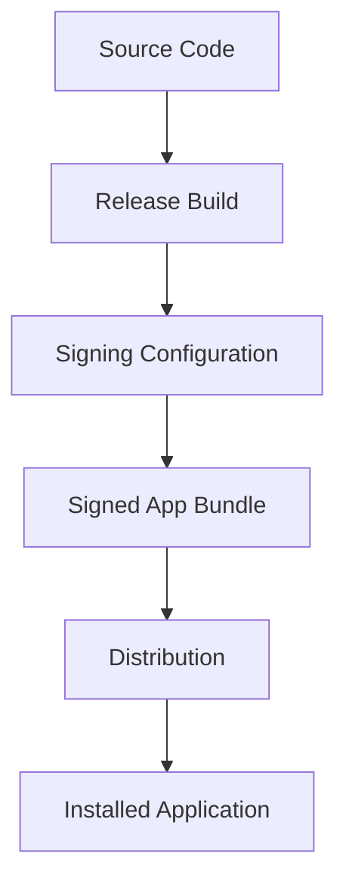
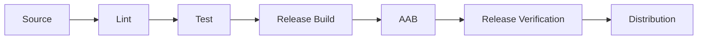

# 004 - Android App Bundle

**Học phần:** 05 - Quality, Release and Portfolio  
**Module:** Module 12 - Distribution and Final Project  
**Nhóm nội dung:** Build and Signing  
**Nguồn roadmap:** Distribution and Final Project / Build and Signing  
**Loại bài:** lesson  
**Thứ tự trong module:** 004  
**Thời lượng gợi ý:** 45 phút

---

## 1. Tóm tắt

`Android App Bundle` (AAB) là định dạng đóng gói ứng dụng Android được thiết kế cho quá trình phân phối ứng dụng, đặc biệt qua Google Play. Thay vì phát hành một file APK chứa toàn bộ tài nguyên và mã dành cho mọi cấu hình thiết bị, developer tạo một file `.aab` chứa toàn bộ thành phần của ứng dụng. Hệ thống phân phối có thể sử dụng bundle này để tạo các APK phù hợp với từng thiết bị.

AAB không phải là file mà người dùng cài trực tiếp như APK thông thường. Nó đóng vai trò là **artifact phát hành**, từ đó các APK cài đặt thực tế được sinh ra.

Trong quy trình phát triển Android, AAB nằm ở giai đoạn cuối:

```text
Source Code
    ↓
Build
    ↓
Signing
    ↓
Android App Bundle (.aab)
    ↓
Distribution Platform
    ↓
APK phù hợp với thiết bị
    ↓
Người dùng cài đặt ứng dụng
```

Hiểu AAB giúp developer kiểm soát tốt hơn kích thước ứng dụng, quá trình ký, kiểm thử bản release và rủi ro trước khi phát hành production.

## 2. Mục tiêu học tập

Sau khi hoàn thành bài này, người học có thể:

- Giải thích được `Android App Bundle` là gì và vai trò của nó trong quá trình phát hành ứng dụng Android.
- Phân biệt được `.aab` với `.apk`.
- Mô tả được cách một App Bundle được chuyển thành các APK dành cho thiết bị.
- Giải thích được mối quan hệ giữa AAB, build variant, signing và quá trình distribution.
- Tạo được một Android App Bundle từ Android Studio hoặc Gradle.
- Kiểm tra được artifact release trước khi đưa lên nền tảng phân phối.
- Nhận biết được các lỗi phổ biến liên quan đến bundle, signing và cấu hình release.

## 3. Vì sao Android cần App Bundle?

Một ứng dụng Android có thể chứa nhiều loại tài nguyên dành cho những thiết bị khác nhau, chẳng hạn:

- hình ảnh với nhiều mật độ màn hình;
- native library cho nhiều CPU architecture;
- tài nguyên cho nhiều ngôn ngữ;
- feature chỉ được sử dụng trong một số trường hợp;
- cấu hình dành cho những loại thiết bị khác nhau.

Nếu tất cả thành phần này được đóng vào một APK duy nhất, người dùng có thể phải tải nhiều dữ liệu mà thiết bị của họ không bao giờ sử dụng.

Ví dụ một ứng dụng chứa native library cho:

```text
arm64-v8a
armeabi-v7a
x86
x86_64
```

Một điện thoại sử dụng `arm64-v8a` không nhất thiết cần các binary dành cho `x86` hoặc `x86_64`.

Android App Bundle giải quyết vấn đề bằng cách đóng toàn bộ phiên bản ứng dụng vào một bundle ở phía developer, sau đó cho phép hệ thống phân phối tạo package phù hợp với thiết bị của từng người dùng.



Developer quản lý một artifact `.aab`, trong khi package thực tế được phân phối có thể được tối ưu theo cấu hình thiết bị.

## 4. Android App Bundle là gì?

Android App Bundle là một **publishing format** của ứng dụng Android.

File thường có phần mở rộng:

```text
.aab
```

Ví dụ:

```text
app-release.aab
```

Bundle có thể chứa:

- compiled code;
- Android resources;
- manifest;
- assets;
- native libraries;
- configuration metadata;
- các module của ứng dụng.

Điểm quan trọng là:

> AAB được dùng để phát hành ứng dụng, không phải định dạng cài đặt trực tiếp thông thường trên thiết bị Android.

Khi cần cài ứng dụng lên thiết bị, bundle phải được chuyển thành một hoặc nhiều APK thích hợp.

## 5. Phân biệt AAB và APK

| Tiêu chí | AAB | APK |
| --- | --- | --- |
| Phần mở rộng | `.aab` | `.apk` |
| Vai trò chính | Publishing artifact | Installable package |
| Cài trực tiếp thông thường | Không | Có |
| Có thể chứa tài nguyên cho nhiều cấu hình | Có | Có thể |
| Có thể dùng để sinh APK tối ưu | Có | Không |
| Phù hợp cho phát hành qua store | Có | Có, tùy hình thức phân phối |
| Phù hợp cho cài đặt thử trực tiếp | Không thuận tiện | Có |

Có thể hình dung:

```text
AAB = nguyên liệu phát hành

APK = package được cài trên thiết bị
```

Do đó, không nên coi AAB đơn giản là một phiên bản mới của APK. Hai định dạng phục vụ những bước khác nhau trong pipeline release.

## 6. Cấu trúc phân phối từ App Bundle

Khi một bundle được đưa vào hệ thống phân phối, package cuối cùng có thể được tối ưu theo nhiều thuộc tính của thiết bị.

### 6.1. Theo kiến trúc CPU

Ứng dụng có native code có thể chứa library cho nhiều ABI:

```text
arm64-v8a
armeabi-v7a
x86
x86_64
```

Thiết bị chỉ cần binary tương thích với CPU của nó.

### 6.2. Theo cấu hình tài nguyên

Hệ thống có thể lựa chọn những tài nguyên phù hợp với:

- screen density;
- language;
- ABI;
- feature configuration.

Ví dụ:

```text
App Bundle
├── drawable-mdpi
├── drawable-hdpi
├── drawable-xhdpi
├── drawable-xxhdpi
├── arm64-v8a
├── x86_64
├── values-en
└── values-vi
```

Một thiết bị cụ thể không nhất thiết phải nhận toàn bộ nội dung này.

Điều này giúp giảm lượng dữ liệu phải tải xuống trong nhiều trường hợp.

## 7. Base module và feature module

Một Android App Bundle có thể gồm nhiều module.

Module cơ sở thường là:

```text
base
```

Nó chứa những thành phần thiết yếu để ứng dụng hoạt động.

Ứng dụng phức tạp có thể được tổ chức thêm các feature module.

Ví dụ:

```text
App Bundle
│
├── base
│   ├── MainActivity
│   ├── Core UI
│   └── Shared resources
│
├── feature_profile
│
└── feature_editor
```

Cách tổ chức module có thể hỗ trợ chiến lược phân phối ứng dụng phức tạp hơn, nhưng không nên chia module chỉ để làm kiến trúc trở nên phức tạp.

Với phần lớn ứng dụng nhỏ, một `app` module thông thường đã đủ để tạo AAB.

## 8. Mối quan hệ giữa Build Variant và App Bundle

AAB được tạo từ một build variant cụ thể.

Một project phổ biến có:

```text
debug
release
```

Trong đó:

- `debug` phục vụ development và debugging;
- `release` phục vụ quá trình phát hành.

Nếu ứng dụng có product flavor:

```text
free
paid
```

các variant có thể trở thành:

```text
freeDebug
freeRelease
paidDebug
paidRelease
```

Artifact cần phát hành phải được tạo từ đúng variant.

Ví dụ:

```text
paidRelease
    ↓
Android App Bundle
    ↓
paid-release.aab
```

Build nhầm variant có thể khiến ứng dụng sử dụng:

- sai API endpoint;
- sai application ID;
- sai resource;
- sai feature flag;
- sai cấu hình analytics;
- sai signing configuration.

Do đó, trước khi tạo bundle production cần xác nhận rõ build variant đang sử dụng.

## 9. Signing trong quá trình tạo AAB

Artifact release phải gắn với quy trình ký ứng dụng.

Signing giúp Android xác định tính liên tục về danh tính của ứng dụng giữa các phiên bản.

Một quy trình tổng quát:



Các thông tin ký thường liên quan đến:

- keystore;
- key alias;
- key password;
- store password;
- signing configuration.

Các thông tin bí mật không nên được commit trực tiếp vào source repository.

Không nên viết:

```kotlin
storePassword = "my-password"
keyPassword = "my-password"
```

vào repository public.

Thay vào đó, secret nên được quản lý bằng cơ chế phù hợp với môi trường build, chẳng hạn:

- local configuration;
- environment variables;
- secret manager của CI/CD.

## 10. Tạo Android App Bundle bằng Android Studio

Android Studio cung cấp giao diện để tạo bundle cho release.

Quy trình tổng quát:

1. Mở project Android.
2. Chọn build variant cần phát hành.
3. Mở chức năng tạo signed bundle hoặc APK.
4. Chọn `Android App Bundle`.
5. Chọn signing key phù hợp.
6. Chọn build type `release`.
7. Thực hiện build.
8. Kiểm tra artifact được sinh ra.

Artifact thường nằm trong thư mục build của module ứng dụng.

Tên và đường dẫn thực tế phụ thuộc cấu hình project, nhưng cấu trúc thường có dạng:

```text
app/
└── build/
    └── outputs/
        └── bundle/
            └── release/
                └── app-release.aab
```

Không nên chỉ kiểm tra rằng file tồn tại. Trước khi distribution, cần xác nhận đúng:

- variant;
- application ID;
- version;
- signing;
- environment configuration.

## 11. Tạo App Bundle bằng Gradle

Trong quy trình automation hoặc CI/CD, bundle thường được tạo bằng Gradle.

Với build type `release`, task phổ biến là:

```bash
./gradlew bundleRelease
```

Nếu project sử dụng Gradle Wrapper trên Windows:

```powershell
gradlew.bat bundleRelease
```

Sau khi build thành công, cần kiểm tra artifact trong thư mục output của module.

Pipeline cơ bản có thể được tổ chức như sau:

```text
Checkout source
      ↓
Restore dependencies
      ↓
Run static checks
      ↓
Run tests
      ↓
Build release bundle
      ↓
Collect .aab artifact
      ↓
Release / Distribution
```

Việc tạo bundle nên diễn ra sau các bước quality gate quan trọng, thay vì build rồi phát hành ngay lập tức.

## 12. Versioning trước khi tạo bundle

Ứng dụng release cần quản lý version rõ ràng.

Hai giá trị quan trọng thường gặp là:

```text
versionCode
versionName
```

Ví dụ trong Kotlin DSL:

```kotlin
android {
    defaultConfig {
        versionCode = 42
        versionName = "2.3.0"
    }
}
```

`versionCode` là giá trị số dùng để biểu diễn thứ tự phiên bản.

`versionName` là tên phiên bản hiển thị cho người dùng.

Ví dụ:

```text
Release 1
versionCode = 41
versionName = 2.2.0

Release 2
versionCode = 42
versionName = 2.3.0
```

Một lỗi release thường gặp là tạo bundle mới nhưng quên cập nhật version phù hợp.

Versioning vì vậy phải là một bước trong release checklist.

## 13. Kiểm thử artifact release

Một ứng dụng chạy tốt ở `debug` chưa đủ để kết luận bản `release` sẽ hoạt động chính xác.

Release build có thể khác debug build về:

- code shrinking;
- obfuscation;
- resource shrinking;
- signing;
- API endpoint;
- logging;
- debug flag;
- dependency configuration.

Do đó cần kiểm thử chính artifact release.

Các user flow quan trọng nên bao gồm:

```text
Launch app
    ↓
Login / onboarding
    ↓
Load dữ liệu
    ↓
Thao tác chức năng chính
    ↓
Background / foreground
    ↓
Kill và mở lại app
    ↓
Kiểm tra persistence
```

Nếu ứng dụng có networking, cần kiểm tra thêm:

- mất mạng;
- timeout;
- server error;
- token hết hạn;
- retry;
- loading state.

Nếu ứng dụng sử dụng local storage, cần kiểm tra:

- migration;
- dữ liệu cũ;
- app update;
- corrupted state nếu có khả năng xảy ra.

## 14. Bundle và lifecycle của ứng dụng

AAB bản thân không thay đổi Android lifecycle.

Tuy nhiên, release artifact chứa toàn bộ implementation lifecycle của ứng dụng. Vì vậy mọi lỗi lifecycle vẫn phải được kiểm tra trước khi phát hành.

Ví dụ:

```text
Activity foreground
      ↓
User chuyển app sang background
      ↓
Process có thể bị hệ thống terminate
      ↓
User quay lại
      ↓
State cần được phục hồi hợp lý
```

Không nên giả định rằng vì build đã tạo thành công nên state management đã an toàn.

Các trường hợp cần kiểm tra gồm:

- rotate màn hình;
- background/foreground;
- process recreation;
- navigation restoration;
- pending background work;
- network request đang thực hiện.

## 15. Ảnh hưởng của AAB tới người dùng

AAB chủ yếu thuộc layer release và distribution, nhưng quyết định ở layer này vẫn ảnh hưởng trực tiếp tới UX.

Một release không được kiểm tra kỹ có thể dẫn đến:

- ứng dụng crash khi mở;
- feature thiếu resource;
- native library không tương thích;
- cấu hình production sai;
- API không hoạt động;
- update làm mất dữ liệu;
- login thất bại;
- kích thước tải xuống không hợp lý.

Vì vậy release engineering không phải công việc hành chính sau khi hoàn thành code.

Nó là một phần của chất lượng sản phẩm.

## 16. Lỗi thường gặp

### 16.1. Nhầm AAB với APK

**Hiện tượng:** Developer cố cài trực tiếp `.aab` giống APK.

**Nguyên nhân:** Chưa phân biệt publishing format và installable package.

**Cách xử lý:** Dùng APK cho quá trình cài trực tiếp hoặc sử dụng công cụ phù hợp để sinh APK từ bundle.

### 16.2. Build sai variant

**Hiện tượng:** Bản release kết nối nhầm staging server hoặc có cấu hình không đúng production.

**Nguyên nhân:** Bundle được tạo từ sai flavor hoặc build variant.

**Cách xử lý:** Xác nhận variant trước khi build và đưa việc kiểm tra environment vào release checklist.

### 16.3. Signing configuration không hợp lệ

**Hiện tượng:** Build release thất bại hoặc artifact không thể sử dụng đúng trong pipeline release.

**Nguyên nhân:** Sai keystore, alias hoặc secret.

**Cách xử lý:** Kiểm tra signing configuration và cách cung cấp secret cho môi trường build.

### 16.4. Release build crash trong khi debug build hoạt động

**Hiện tượng:** Debug hoạt động bình thường nhưng bản release lỗi.

**Nguyên nhân có thể gồm:**

- shrinking;
- obfuscation;
- reflection;
- serialization;
- resource removal;
- khác biệt environment.

**Cách xử lý:** Kiểm thử trực tiếp release build và kiểm tra cấu hình shrinker nếu lỗi chỉ xuất hiện ở release.

### 16.5. Commit signing secret vào repository

**Hiện tượng:** Password hoặc thông tin signing xuất hiện trong Git history.

**Nguyên nhân:** Secret được hard-code trong file cấu hình.

**Cách xử lý:** Tách secret khỏi repository và quản lý bằng cơ chế bảo mật của local environment hoặc CI/CD.

## 17. Best practices khi làm việc với App Bundle

Một quy trình release ổn định nên tuân theo các nguyên tắc sau:

- Tạo AAB từ đúng `release` variant.
- Chạy test quan trọng trước khi build artifact.
- Kiểm tra version trước mỗi release.
- Không lưu signing secret trong source code.
- Kiểm thử bản release thay vì chỉ kiểm thử debug.
- Xác nhận production endpoint và environment configuration.
- Lưu artifact của từng release để phục vụ traceability khi cần.
- Tự động hóa build bằng Gradle khi dự án đã có CI/CD.
- Ghi lại known limitations trước khi phát hành.
- Xây dựng release checklist có thể lặp lại thay vì dựa vào trí nhớ.

Một pipeline trưởng thành có thể biểu diễn như sau:



AAB chỉ nên đi tiếp tới bước distribution khi các quality gate trước đó đã đạt yêu cầu.

## 18. Bài thực hành

Tạo một Android App Bundle cho một project Android nhỏ và chuẩn bị artifact release để đưa vào portfolio.

Thực hiện các nhiệm vụ sau:

1. Kiểm tra build variant đang sử dụng.
2. Kiểm tra `versionCode` và `versionName`.
3. Build project ở chế độ release.
4. Tạo file `.aab`.
5. Xác định vị trí artifact được sinh ra.
6. Kiểm tra artifact thuộc đúng variant.
7. Chạy các user flow quan trọng trên release build.
8. Ghi lại quy trình build vào README.

README nên mô tả tối thiểu:

```text
Project
Release configuration
Build command
Bundle output
Testing performed
Known limitations
```

Ví dụ phần hướng dẫn build:

```bash
./gradlew bundleRelease
```

**Kết quả mong đợi:**

- Project build release thành công.
- Có một file `.aab` hợp lệ trong output build.
- Release configuration không chứa secret bị hard-code.
- Có tài liệu mô tả cách tạo artifact.
- Các chức năng quan trọng đã được kiểm tra trên cấu hình release.

## 19. Artifact cho portfolio

Artifact của bài này có thể gồm:

```text
project/
├── app/
├── README.md
└── docs/
    └── release-checklist.md
```

Không cần đưa private signing key vào portfolio.

README nên thể hiện được rằng người học hiểu toàn bộ pipeline:

```text
Code
→ Test
→ Build
→ Sign
→ Bundle
→ Verify
→ Distribute
```

Một README tốt không chỉ ghi lệnh build mà còn giải thích:

- bundle dùng để làm gì;
- release variant nào được sử dụng;
- artifact nằm ở đâu;
- release đã được kiểm thử như thế nào;
- secret được quản lý ra sao;
- còn hạn chế nào chưa xử lý.

## 20. Checklist hoàn thành

- [ ] Giải thích được `Android App Bundle` là gì.
- [ ] Phân biệt được `.aab` và `.apk`.
- [ ] Giải thích được vì sao bundle có thể hỗ trợ phân phối package phù hợp với thiết bị.
- [ ] Xác định được mối quan hệ giữa AAB, build variant và signing.
- [ ] Tạo được bundle bằng Android Studio hoặc Gradle.
- [ ] Kiểm tra được `versionCode` và `versionName` trước khi release.
- [ ] Không hard-code signing secret trong repository.
- [ ] Kiểm thử được các user flow quan trọng trên release build.
- [ ] Có README mô tả cách build và kiểm tra artifact.
- [ ] Có release checklist có thể sử dụng lại.

## 21. Câu hỏi tự kiểm tra

1. Vì sao `.aab` không nên được hiểu đơn giản là một APK có phần mở rộng khác?
2. Việc sinh package phù hợp với từng cấu hình thiết bị có lợi gì cho quá trình phân phối?
3. Vì sao cần kiểm thử release build ngay cả khi debug build đã hoạt động ổn định?
4. Điều gì có thể xảy ra nếu developer tạo bundle từ nhầm build variant?
5. Vì sao signing secret không nên được lưu trực tiếp trong repository?

## 22. Tổng kết

`Android App Bundle` là artifact quan trọng trong quy trình build và distribution của ứng dụng Android. Developer tạo một bundle chứa code và tài nguyên cần thiết của ứng dụng, sau đó hệ thống phân phối có thể sử dụng bundle để tạo package phù hợp với thiết bị người dùng.

Để sử dụng AAB đúng trong một dự án thực tế, developer không chỉ cần biết cách tạo file `.aab` mà còn phải kiểm soát toàn bộ release pipeline:

```text
Đúng variant
    ↓
Đúng version
    ↓
Đúng signing
    ↓
Tests đạt yêu cầu
    ↓
Build AAB
    ↓
Kiểm chứng release
    ↓
Distribution
```

Một Android developer có năng lực production cần xem build và release là một phần của chất lượng phần mềm, không phải bước cuối cùng chỉ để tạo ra một file upload.