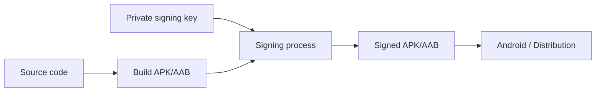
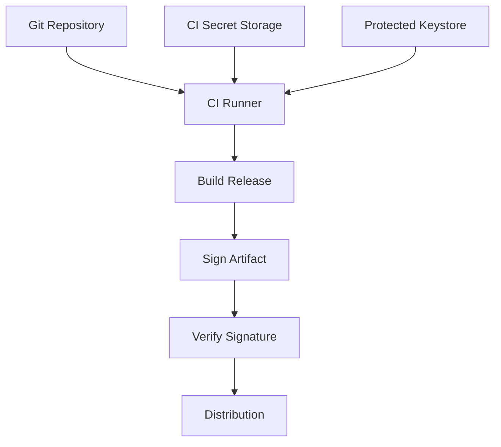

# 005 - Keystore

**Học phần:** 05 - Quality, Release and Portfolio
**Module:** Module 12 - Distribution and Final Project
**Nhóm nội dung:** Build and Signing
**Nguồn roadmap:** Distribution and Final Project / Build and Signing
**Loại bài:** lesson
**Thứ tự trong module:** 005
**Thời lượng gợi ý:** 45 phút

---

## 1. Tóm tắt

Khi phát triển Android ở môi trường local, việc nhấn **Run** trong Android Studio thường đủ để cài ứng dụng lên emulator hoặc thiết bị thật. Tuy nhiên, khi chuẩn bị phát hành ứng dụng, file APK hoặc Android App Bundle không thể được phân phối một cách tùy ý. Android yêu cầu ứng dụng phải được **ký số bằng một signing key**.

`Keystore` là nơi lưu trữ khóa và chứng chỉ được sử dụng trong quá trình ký ứng dụng. Nếu quản lý signing key không đúng, đội phát triển có thể gặp các vấn đề nghiêm trọng như:

* không thể phát hành bản cập nhật cho ứng dụng;
* làm lộ khóa ký;
* vô tình commit mật khẩu vào Git;
* ký nhầm build production bằng debug key;
* làm gián đoạn quy trình CI/CD;
* khiến một bản build không thể được Play Store hoặc thiết bị Android chấp nhận như bản cập nhật hợp lệ.

Bài học này tập trung vào vai trò của `Keystore` trong quy trình **Android Build and Signing**, cách tạo và sử dụng keystore, cách bảo vệ thông tin bí mật, cách tích hợp signing vào Gradle và cách xây dựng quy trình phát hành an toàn.

> Trong bài này, `Keystore` chủ yếu được hiểu là kho chứa **app signing key** dùng để ký Android application package. Khái niệm này cần được phân biệt với **Android Keystore System**, API bảo mật dùng bên trong ứng dụng để lưu cryptographic keys khi ứng dụng đang chạy.

---

## 2. Mục tiêu học tập

Sau khi hoàn thành bài này, người học có thể:

* Giải thích được vai trò của `Keystore`, private key, certificate và digital signature trong Android.
* Phân biệt được debug signing và release signing.
* Phân biệt được app signing keystore với Android Keystore System.
* Giải thích được vì sao signing key ảnh hưởng trực tiếp đến khả năng cập nhật ứng dụng.
* Tạo được một keystore phục vụ release build.
* Cấu hình được `signingConfig` trong Gradle cho Android application.
* Tách password và thông tin signing khỏi source code.
* Kiểm tra được APK hoặc AAB đã được ký đúng trước khi phát hành.
* Xác định được những rủi ro quan trọng khi quản lý signing key trong môi trường production và CI/CD.

---

## 3. Vì sao Android cần ký ứng dụng?

Android sử dụng chữ ký số để xác định **danh tính của ứng dụng** qua các phiên bản khác nhau.

Giả sử một ứng dụng đã được cài trên thiết bị:

```text
com.example.myapp
version 1
```

Sau đó developer phát hành:

```text
com.example.myapp
version 2
```

Hai package có cùng application ID chưa đủ để Android xem version 2 là bản cập nhật hợp lệ. Bản mới còn phải đáp ứng yêu cầu về **signing identity**.

Luồng cơ bản:



Private key được dùng để tạo chữ ký cho artifact. Android và hệ thống phân phối có thể sử dụng thông tin chữ ký để xác minh danh tính của ứng dụng.

Điểm quan trọng là signing không chỉ là một bước kỹ thuật cuối cùng của build. Nó tạo ra một **identity lâu dài** cho application.

Nếu signing identity của một bản cập nhật không phù hợp với ứng dụng đang tồn tại, bản build mới có thể không được chấp nhận như một bản update bình thường.

---

## 4. Keystore, key và certificate

Để quản lý Android signing đúng cách, cần phân biệt ba khái niệm thường bị gọi chung là "key".

### 4.1. Keystore

`Keystore` là một kho có thể chứa một hoặc nhiều key entry.

Một file keystore thường có dạng:

```text
release.jks
```

hoặc:

```text
release.keystore
```

Bên trong keystore có thể có nhiều entry khác nhau.

Mỗi entry thường được định danh bằng một `alias`.

Ví dụ:

```text
Keystore
├── alias: release
│   ├── private key
│   └── certificate
└── alias: internal
    ├── private key
    └── certificate
```

### 4.2. Private key

Private key là thành phần bí mật quan trọng nhất của quá trình signing.

Nó được sử dụng để tạo digital signature cho ứng dụng.

Private key:

* không nên được chia sẻ công khai;
* không nên commit vào repository public;
* không nên gửi qua email hoặc chat tùy tiện;
* cần có backup an toàn;
* cần được giới hạn quyền truy cập.

Nếu private key bị lộ, người khác có thể có khả năng sử dụng signing identity đó cho artifact của họ tùy thuộc vào mô hình phát hành đang sử dụng.

### 4.3. Certificate

Certificate chứa thông tin public liên quan đến signing key.

Certificate có thể được dùng để nhận diện signer và kiểm tra thông tin chữ ký mà không cần tiết lộ private key.

Certificate không cần được bảo mật giống private key.

Quan hệ khái quát:

```text
Keystore
   ↓
Alias
   ↓
Private Key + Certificate
   ↓
Signing
   ↓
Signed APK/AAB
```

---

## 5. Phân biệt app signing keystore và Android Keystore System

Đây là hai khái niệm có tên gần giống nhau nhưng giải quyết hai bài toán khác nhau.

| Khái niệm               | Mục đích                                                       |
| ----------------------- | -------------------------------------------------------------- |
| App signing keystore    | Chứa khóa dùng để ký APK/AAB khi build hoặc release            |
| Android Keystore System | Quản lý cryptographic keys được ứng dụng sử dụng khi đang chạy |

Ví dụ, file:

```text
my-release-key.jks
```

có thể được Gradle sử dụng khi tạo release build.

Trong khi đó, code dạng:

```kotlin
val keyStore = KeyStore.getInstance("AndroidKeyStore")
keyStore.load(null)
```

đang tương tác với **Android Keystore System** trên thiết bị.

Hai hệ thống không nên được xem là cùng một thứ.

Trong ngữ cảnh **Build and Signing**, trọng tâm là app signing keystore.

---

## 6. Debug signing và release signing

Android development thường có ít nhất hai bối cảnh signing khác nhau.

| Tiêu chí                      | Debug signing                      | Release signing                              |
| ----------------------------- | ---------------------------------- | -------------------------------------------- |
| Mục đích                      | Development và testing             | Phân phối ứng dụng                           |
| Quản lý                       | Thường được tooling hỗ trợ tự động | Developer hoặc hệ thống release phải quản lý |
| Mức độ bảo mật                | Không dùng làm identity production | Cần bảo vệ nghiêm ngặt                       |
| CI/CD                         | Dùng cho test build nếu phù hợp    | Cần secret management                        |
| Khả năng phát hành production | Không nên dùng                     | Có                                           |

Trong quá trình development, Android Studio và Android Gradle Plugin có thể xử lý debug signing gần như tự động.

Vì vậy developer mới thường chưa nhận thấy signing là một phần bắt buộc của Android.

Vấn đề chỉ trở nên rõ ràng khi chuyển sang:

```text
Development
    ↓
Release build
    ↓
Signing
    ↓
Distribution
```

Release signing cần được thiết kế chủ động thay vì dựa vào cấu hình mặc định.

---

## 7. Tạo release keystore

Một cách phổ biến để tạo keystore là sử dụng công cụ `keytool` đi cùng Java Development Kit.

Ví dụ:

```bash
keytool -genkeypair \
  -v \
  -keystore release.jks \
  -keyalg RSA \
  -keysize 2048 \
  -alias release
```

`keytool` sẽ yêu cầu nhập các thông tin cần thiết như password và thông tin certificate.

Sau khi tạo xong, cần xác nhận file thực sự tồn tại:

```text
release.jks
```

và ghi lại chính xác:

```text
keystore path
keystore password
key alias
key password
```

Bốn thành phần này thường cần thiết để Gradle có thể sử dụng signing key.

> Không nên tạo lại một signing key mới chỉ vì quên password hoặc mất file keystore. Signing identity cần được xem là tài sản release quan trọng và phải được backup theo chính sách của dự án.

---

## 8. Cấu hình signing trong Gradle

Một Android project có thể khai báo release signing thông qua `signingConfigs`.

Ví dụ trong `build.gradle.kts`:

```kotlin
android {
    signingConfigs {
        create("release") {
            storeFile = file("release.jks")
            storePassword = "store-password"
            keyAlias = "release"
            keyPassword = "key-password"
        }
    }

    buildTypes {
        getByName("release") {
            signingConfig = signingConfigs.getByName("release")
        }
    }
}
```

Cấu hình trên minh họa quan hệ giữa:

```text
release build
      ↓
signingConfig
      ↓
release.jks
      ↓
alias
      ↓
private key
```

Tuy nhiên, ví dụ này **không phù hợp cho production** vì password đang được hard-code trực tiếp trong Gradle file.

Cấu hình production cần tách secret khỏi source code.

---

## 9. Không lưu password trong source code

Một sai lầm nghiêm trọng là viết trực tiếp thông tin nhạy cảm:

```kotlin
storePassword = "MyRealProductionPassword"
keyPassword = "MyRealProductionPassword"
```

rồi commit file lên Git.

Khi secret đã xuất hiện trong Git history, việc xóa nó khỏi commit hiện tại không có nghĩa secret chưa từng bị lộ.

Một cách tổ chức đơn giản hơn là sử dụng một file local không được commit.

Ví dụ:

```properties
RELEASE_STORE_FILE=/secure/path/release.jks
RELEASE_STORE_PASSWORD=example
RELEASE_KEY_ALIAS=release
RELEASE_KEY_PASSWORD=example
```

Sau đó đọc giá trị khi cấu hình Gradle.

Một hướng khác phù hợp hơn với CI/CD là sử dụng environment variables hoặc secret management của nền tảng CI.

Ví dụ:

```kotlin
val releaseStoreFile = System.getenv("RELEASE_STORE_FILE")
val releaseStorePassword = System.getenv("RELEASE_STORE_PASSWORD")
val releaseKeyAlias = System.getenv("RELEASE_KEY_ALIAS")
val releaseKeyPassword = System.getenv("RELEASE_KEY_PASSWORD")
```

Sau đó:

```kotlin
android {
    signingConfigs {
        create("release") {
            storeFile = file(requireNotNull(releaseStoreFile))
            storePassword = requireNotNull(releaseStorePassword)
            keyAlias = requireNotNull(releaseKeyAlias)
            keyPassword = requireNotNull(releaseKeyPassword)
        }
    }
}
```

Mục tiêu không phải chỉ là "làm build chạy được", mà là tách:

```text
Source code
        │
        ├── Signing configuration logic
        │
        └── Không chứa secret
                 ↑
                 │
         Secret management
```

---

## 10. Không commit keystore một cách tùy tiện

Keystore chứa private key nên cần được quản lý như một tài sản bảo mật.

Ví dụ `.gitignore` có thể bao gồm:

```gitignore
*.jks
*.keystore
keystore.properties
```

Tuy nhiên, `.gitignore` không phải là một hệ thống bảo mật hoàn chỉnh.

Nó chỉ giúp tránh commit nhầm file chưa được Git theo dõi.

Một signing strategy tốt phải trả lời được:

* Keystore được lưu ở đâu?
* Ai được quyền truy cập?
* Có backup không?
* Backup có được mã hóa không?
* Password được lưu ở đâu?
* CI lấy secret bằng cách nào?
* Nếu developer rời team thì quyền truy cập được thu hồi ra sao?
* Nếu khóa bị nghi ngờ lộ thì quy trình xử lý là gì?

Đối với dự án production, quản lý keystore là một phần của release engineering và security, không chỉ là cấu hình Gradle.

---

## 11. Signing trong CI/CD

Khi build release trên CI, repository thường không nên chứa trực tiếp private signing key và password.

Một quy trình có thể được thiết kế theo hướng:



Repository chứa source code và signing logic nhưng không chứa password dạng plaintext.

CI runner nhận signing secret tại thời điểm build, tạo signed artifact rồi chuyển sang bước kiểm tra và phát hành.

Một pipeline release nên thất bại sớm nếu thiếu:

* keystore;
* store password;
* key alias;
* key password.

Không nên âm thầm fallback sang debug signing cho production artifact.

---

## 12. App signing và upload key khi phân phối qua Google Play

Trong quy trình phân phối qua Google Play, cần hiểu rằng signing architecture có thể bao gồm nhiều khóa với trách nhiệm khác nhau.

Một mô hình quan trọng là:

```text
Developer / CI
      ↓
Upload key
      ↓
Upload AAB
      ↓
Google Play
      ↓
App signing key
      ↓
APK phân phối đến user
```

`Upload key` được dùng để xác thực artifact được upload lên Play.

`App signing key` đại diện cho signing identity dùng trong quá trình phân phối ứng dụng tới người dùng.

Việc phân tách trách nhiệm này giúp giảm rủi ro vận hành so với mô hình trong đó một private key duy nhất phải được sử dụng trực tiếp ở mọi máy build.

Developer vẫn cần bảo vệ upload key và quản lý quy trình signing cẩn thận.

Điều quan trọng là không được giả định rằng mọi dự án Android đều sử dụng chính xác một mô hình signing duy nhất. Signing strategy phải phù hợp với kênh phân phối thực tế của ứng dụng.

---

## 13. Kiểm tra artifact đã được ký

Sau khi tạo release artifact, cần kiểm tra signing trước khi phát hành.

Ví dụ đối với APK, có thể sử dụng `apksigner`:

```bash
apksigner verify --verbose app-release.apk
```

Có thể yêu cầu hiển thị thêm thông tin certificate:

```bash
apksigner verify \
  --print-certs \
  app-release.apk
```

Mục đích của bước kiểm tra là xác nhận:

* artifact thực sự được ký;
* certificate đúng với release identity mong đợi;
* pipeline không vô tình sử dụng debug key;
* artifact cuối cùng là artifact đã được kiểm chứng.

Luồng release tốt nên là:

```text
Build
  ↓
Sign
  ↓
Verify
  ↓
Test
  ↓
Distribute
```

không phải:

```text
Build
  ↓
Upload ngay
```

---

## 14. Fingerprint của signing certificate

Certificate có thể được biểu diễn thông qua fingerprint như SHA-256.

Fingerprint thường được dùng khi một dịch vụ bên ngoài cần nhận diện ứng dụng theo signing certificate.

Một số integration có thể phụ thuộc vào tổ hợp:

```text
Application ID
+
Signing certificate fingerprint
```

Do đó một integration hoạt động với debug build nhưng thất bại ở release build có thể xuất phát từ việc hai build được ký bằng certificate khác nhau.

Đây là lý do signing không chỉ ảnh hưởng đến Play Store mà còn có thể tác động đến việc tích hợp với những dịch vụ cần xác minh application identity.

Khi debug và release sử dụng certificate khác nhau, cần kiểm tra cấu hình riêng cho từng môi trường nếu dịch vụ yêu cầu fingerprint.

---

## 15. Những lỗi thường gặp

**Hiện tượng:** Release build không được ký.

**Nguyên nhân:** `release` build type chưa được gắn với signing configuration hoặc CI không có signing secrets.

**Cách xử lý:** Kiểm tra `signingConfigs`, `buildTypes` và environment variables trước khi build.

---

**Hiện tượng:** Gradle báo không tìm thấy keystore.

**Nguyên nhân:** `storeFile` sai đường dẫn hoặc file chưa được đưa vào CI runner.

**Cách xử lý:** Kiểm tra đường dẫn thực tế và cơ chế provision keystore trong môi trường build.

---

**Hiện tượng:** Gradle báo password không hợp lệ.

**Nguyên nhân:** Nhầm giữa keystore password và key password, hoặc CI secret chứa giá trị sai.

**Cách xử lý:** Xác minh riêng `storePassword`, `keyAlias` và `keyPassword`.

---

**Hiện tượng:** Có keystore nhưng Gradle không tìm thấy key.

**Nguyên nhân:** `keyAlias` không tồn tại trong keystore.

**Cách xử lý:** Liệt kê nội dung keystore bằng `keytool` và kiểm tra alias thực tế.

---

**Hiện tượng:** Một service hoạt động ở debug nhưng không hoạt động ở release.

**Nguyên nhân:** Release build sử dụng signing certificate khác nên fingerprint không khớp cấu hình của service.

**Cách xử lý:** Kiểm tra certificate fingerprint của release build và cập nhật integration tương ứng.

---

**Hiện tượng:** Team không thể phát hành bản release sau khi một developer rời dự án.

**Nguyên nhân:** Keystore hoặc password chỉ tồn tại trên máy cá nhân của developer đó.

**Cách xử lý:** Thiết kế ownership, backup và access control ở cấp tổ chức thay vì phụ thuộc vào một máy cá nhân.

---

## 16. Best practices cho production

Một quy trình signing production nên tuân theo các nguyên tắc sau:

* Không sử dụng debug key cho production release.
* Không hard-code signing password trong source code.
* Không commit private keystore vào repository public.
* Không gửi signing key qua các kênh trao đổi không được kiểm soát.
* Backup key theo chính sách bảo mật phù hợp.
* Giới hạn quyền truy cập signing secret theo nguyên tắc least privilege.
* Tách development, staging và production nếu kiến trúc release yêu cầu.
* Kiểm tra certificate của artifact trước khi publish.
* Ghi lại quy trình signing trong tài liệu nội bộ.
* Thiết kế CI để release build thất bại nếu signing configuration không hợp lệ.
* Xác định rõ ai sở hữu signing credentials.
* Có kế hoạch xử lý khi credential bị mất hoặc nghi ngờ bị lộ.

Một cách tư duy hữu ích là xem signing key tương tự một credential production đặc biệt:

```text
Signing key
    ↓
Application identity
    ↓
Release continuity
    ↓
User trust
```

---

## 17. Bài thực hành

Xây dựng signing configuration cho một Android application mẫu.

Yêu cầu:

1. Tạo một release keystore.
2. Tạo một alias dành cho release signing.
3. Cấu hình `release` build type sử dụng signing configuration.
4. Không hard-code password trong source code.
5. Build một release APK hoặc AAB.
6. Kiểm tra artifact đã được ký.
7. Ghi lại quy trình trong `README.md`.

Một cấu trúc artifact tham khảo:

```text
android-keystore-demo/
├── app/
├── build.gradle.kts
├── gradle.properties
├── .gitignore
└── README.md
```

Keystore thật không cần xuất hiện trong repository.

`README.md` nên mô tả:

* mục đích của signing;
* cách cung cấp signing credentials;
* cách build release;
* cách verify artifact;
* những file hoặc secret không được commit.

**Kết quả mong đợi:**

```text
Release configuration
       ↓
Signing secret được cung cấp an toàn
       ↓
Gradle build thành công
       ↓
Signed APK/AAB
       ↓
Signature verification thành công
```

---

## 18. Artifact cho portfolio

Một artifact tốt không nên chứa production secret thật.

Có thể xây dựng một repository demo gồm:

```text
Android project
+
Gradle signing configuration
+
.gitignore
+
README
+
ảnh kết quả build
+
kết quả verify signature
```

README nên giải thích ngắn gọn:

* app signing giải quyết vấn đề gì;
* cách keystore liên quan đến release identity;
* cách project tránh commit secret;
* cách CI/CD có thể nhận signing credentials;
* cách xác minh artifact trước khi distribution.

Artifact này thể hiện nhiều năng lực hơn việc chỉ biết chạy một lệnh `keytool`, vì nó chứng minh người học hiểu cả:

```text
Build
+
Security
+
Release Engineering
+
Secret Management
+
Verification
```

---

## 19. Checklist hoàn thành

* [ ] Giải thích được `Keystore` trong ngữ cảnh Android app signing.
* [ ] Phân biệt được keystore, private key, certificate và alias.
* [ ] Phân biệt được debug signing và release signing.
* [ ] Phân biệt được app signing keystore với Android Keystore System.
* [ ] Giải thích được vì sao signing identity quan trọng đối với việc cập nhật ứng dụng.
* [ ] Tạo được release keystore.
* [ ] Cấu hình được `signingConfig` cho release build.
* [ ] Không hard-code signing password vào repository.
* [ ] Biết cách đưa signing secret vào CI/CD.
* [ ] Kiểm tra được chữ ký của release artifact.
* [ ] Hiểu được rủi ro khi làm mất hoặc làm lộ signing credentials.
* [ ] Có README mô tả quy trình build, signing và verification.

---

## 20. Câu hỏi tự kiểm tra

1. Vì sao hai APK có cùng application ID nhưng khác signing identity không thể luôn được xem là cùng một ứng dụng để cập nhật?

2. `Keystore`, private key, certificate và alias khác nhau như thế nào?

3. Vì sao không nên lưu `storePassword` trực tiếp trong `build.gradle.kts`?

4. Vì sao một API hoặc service có thể hoạt động ở debug build nhưng thất bại ở release build dù source code giống nhau?

5. Trong một CI/CD pipeline, signing secret nên được quản lý khác source code như thế nào?

---

## 21. Tổng kết

`Keystore` là một thành phần cốt lõi của quy trình Android Build and Signing. Nó không chỉ phục vụ việc tạo một file APK hoặc AAB "có thể cài được", mà còn liên quan trực tiếp đến danh tính lâu dài của ứng dụng, quy trình cập nhật, tích hợp với dịch vụ bên ngoài và mức độ an toàn của release pipeline.

Một quy trình signing đáng tin cậy cần bảo đảm bốn yếu tố:

```text
Đúng key
   +
Bảo vệ secret
   +
Build có kiểm soát
   +
Verify trước khi phát hành
```

Với ứng dụng production, signing key phải được xem là tài sản release quan trọng. Developer không chỉ cần biết cách tạo keystore mà còn phải biết cách quản lý, tích hợp, kiểm chứng và bảo vệ nó trong toàn bộ vòng đời phát hành ứng dụng.
