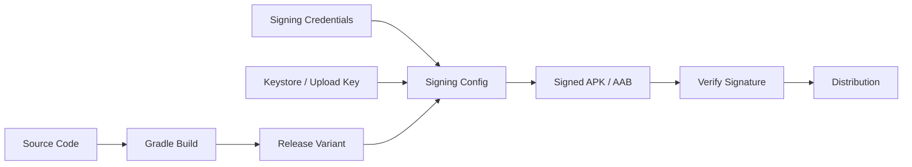
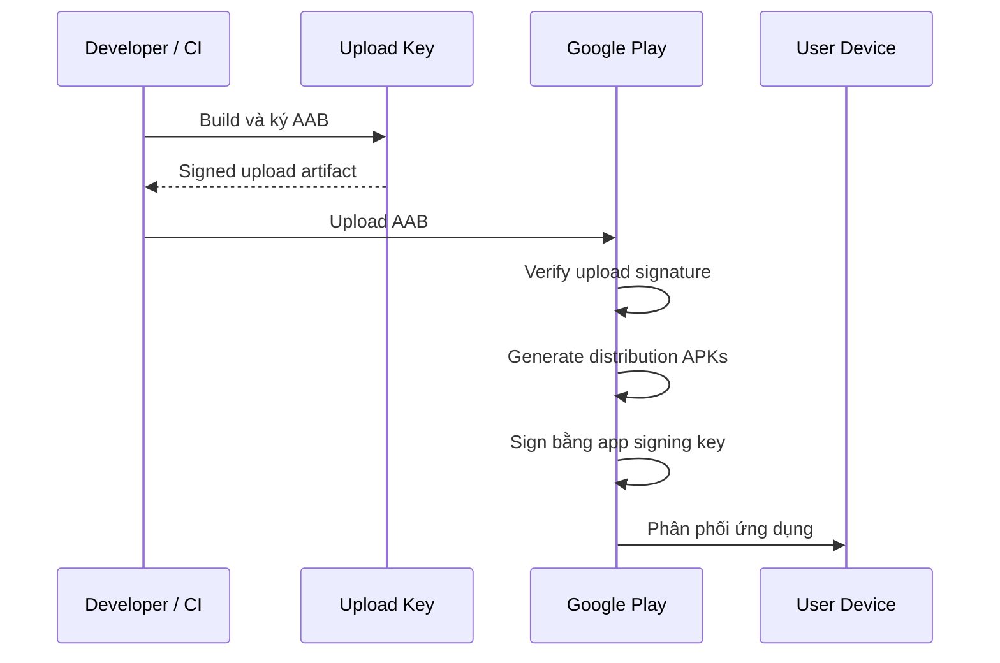

# 006 - Signing Config

**Học phần:** 05 - Quality, Release and Portfolio  
**Module:** Module 12 - Distribution and Final Project  
**Nhóm nội dung:** Build and Signing  
**Nguồn roadmap:** Distribution and Final Project / Build and Signing  
**Loại bài:** project  
**Thứ tự trong module:** 006  
**Thời lượng gợi ý:** 45 phút

---

## 1. Bài toán

Một ứng dụng Android có thể chạy bình thường trong quá trình phát triển nhưng vẫn chưa sẵn sàng để phân phối cho người dùng. Trước khi một bản APK hoặc Android App Bundle được cài đặt hay phát hành, Android yêu cầu gói ứng dụng phải được **ký số**.

Trong môi trường phát triển, Android Studio thường tự động sử dụng debug key. Đối với bản release, developer phải kiểm soát rõ:

- ứng dụng được ký bằng khóa nào;
- khóa được lưu ở đâu;
- thông tin bí mật được bảo vệ như thế nào;
- Gradle sử dụng cấu hình nào khi tạo release build;
- bản build cuối có thực sự được ký đúng hay không;
- quy trình phát hành có thể tái tạo trên máy khác hoặc CI hay không.

Nếu cấu hình signing sai, hậu quả có thể nghiêm trọng:

- không thể cài bản cập nhật lên ứng dụng đã phát hành;
- release build không được tạo;
- mật khẩu keystore bị lộ trong Git;
- mất upload key hoặc signing key;
- CI không thể build bản release;
- upload artifact sai chữ ký lên hệ thống phân phối.

Project này xây dựng một **release signing workflow có thể kiểm chứng** cho một ứng dụng Android nhỏ, từ tạo keystore đến tạo và kiểm tra release artifact.

## 2. Mục tiêu sản phẩm

Sau khi hoàn thành project, người học phải tạo được một cấu hình signing đáp ứng các mục tiêu sau:

- Giải thích được vai trò của digital signature trong Android.
- Phân biệt được debug signing và release signing.
- Phân biệt được app signing key và upload key khi sử dụng Google Play App Signing.
- Tạo được keystore phục vụ quá trình release.
- Khai báo được `signingConfig` trong Gradle.
- Không hard-code password trực tiếp trong source code.
- Gắn signing configuration với release build.
- Tạo được release APK hoặc Android App Bundle.
- Xác minh được artifact đã được ký.
- Chuẩn bị được cấu hình có thể áp dụng cho local development và CI.
- Viết được tài liệu release signing trong README mà không làm lộ secret.

## 3. Signing Config trong quy trình Android

Android sử dụng chữ ký số để xác định danh tính của ứng dụng và duy trì tính liên tục giữa các phiên bản.

Một quy trình release điển hình có thể hình dung như sau:



`Signing Config` nằm trong build pipeline, không nằm trong UI, `ViewModel`, repository hay business logic của ứng dụng. Nó là một phần của **release infrastructure**.

Developer cung cấp cho Gradle:

- vị trí keystore;
- alias của key;
- mật khẩu keystore;
- mật khẩu key.

Gradle sử dụng những thông tin này khi build release variant để ký artifact trước khi đưa sang bước kiểm tra và phân phối.

## 4. Các khái niệm cần nắm

### 4.1. Keystore

Keystore là file chứa một hoặc nhiều khóa mật mã và certificate liên quan.

Một file thường có dạng:

```text
my-release-key.jks
```

Không nên xem keystore như một file cấu hình thông thường. Đối với release workflow, đây là tài sản bảo mật cần được:

- backup an toàn;
- giới hạn quyền truy cập;
- tách khỏi source repository;
- quản lý bằng quy trình secret management phù hợp.

### 4.2. Key alias

Một keystore có thể chứa nhiều entry. `keyAlias` xác định key cụ thể mà Gradle phải sử dụng.

Ví dụ:

```text
release
```

Keystore filename và alias là hai khái niệm khác nhau.

### 4.3. Keystore password và key password

Hai thông tin thường xuất hiện trong cấu hình signing:

- `storePassword`: mật khẩu bảo vệ keystore;
- `keyPassword`: mật khẩu của private key.

Không nên đặt trực tiếp các giá trị này trong file Gradle được commit lên Git.

### 4.4. Debug và release signing

| Đặc điểm | Debug signing | Release signing |
| --- | --- | --- |
| Mục đích | Phát triển, chạy thử | Phân phối chính thức |
| Quản lý | Thường được Android tooling xử lý tự động | Developer hoặc hệ thống phát hành quản lý |
| Bảo mật | Không dùng làm danh tính production | Phải được bảo vệ nghiêm túc |
| Phù hợp Play release | Không | Có |
| Sử dụng trong CI release | Không nên | Có |

Debug signing giúp development thuận tiện. Release signing bảo vệ danh tính dài hạn của ứng dụng.

## 5. App signing key và upload key

Khi phân phối ứng dụng qua Google Play, cần phân biệt hai vai trò quan trọng.

**App signing key** được dùng để ký APK mà người dùng cuối nhận được. Đây là khóa gắn với danh tính phát hành của ứng dụng.

**Upload key** được developer hoặc CI sử dụng để ký artifact trước khi upload lên Google Play. Khi sử dụng Play App Signing, Google Play có thể quản lý app signing key và xác minh artifact upload thông qua upload key.

Luồng tổng quát:



Sự phân tách này giảm rủi ro khi upload key bị mất hoặc cần thay thế. Tuy nhiên, developer vẫn phải quản lý upload credential cẩn thận.

## 6. Yêu cầu kỹ thuật của project

Project sử dụng một Android application có release build variant.

Cấu hình cuối phải đáp ứng:

- có một keystore dùng cho release hoặc upload workflow;
- keystore không nằm trong Git repository;
- password không xuất hiện trực tiếp trong source code;
- `build.gradle.kts` có `signingConfigs`;
- release build sử dụng signing config đã định nghĩa;
- có thể tạo release artifact thành công;
- có bước xác minh signature;
- README không chứa password thực;
- `.gitignore` bảo vệ các file chứa credential local.

Cấu trúc project có thể tổ chức như sau:

```text
project/
├── app/
│   └── build.gradle.kts
├── build.gradle.kts
├── gradle.properties
├── keystore.properties
├── .gitignore
└── README.md
```

`keystore.properties` chỉ là một cách tổ chức credential local. File này không được commit nếu chứa secret.

## 7. Milestone 1 - Tạo release keystore

Có thể tạo keystore bằng `keytool`, công cụ đi kèm Java Development Kit.

Ví dụ:

```bash
keytool -genkeypair \
  -v \
  -keystore my-release-key.jks \
  -alias release \
  -keyalg RSA \
  -keysize 2048 \
  -validity 10000
```

Lệnh sẽ yêu cầu nhập một số thông tin như password và thông tin certificate.

Sau khi hoàn thành, kiểm tra file:

```bash
ls -lh my-release-key.jks
```

Có thể xem thông tin entry bằng:

```bash
keytool -list -v -keystore my-release-key.jks
```

Không đưa password vào command nếu việc đó khiến secret bị lưu trong terminal history.

**Checkpoint:**

- file `.jks` tồn tại;
- alias có thể được liệt kê bằng `keytool`;
- password được lưu tại vị trí bảo mật;
- keystore không nằm trong thư mục sẽ commit lên Git.

## 8. Milestone 2 - Tách credential khỏi Gradle script

Không nên viết:

```kotlin
signingConfigs {
    create("release") {
        storePassword = "my-secret-password"
        keyPassword = "my-secret-password"
    }
}
```

Đây là một lỗi bảo mật vì secret có thể bị commit vào repository.

Một cách đơn giản cho local development là sử dụng file `keystore.properties`.

Ví dụ:

```properties
storeFile=/secure/path/my-release-key.jks
storePassword=CHANGE_ME
keyAlias=release
keyPassword=CHANGE_ME
```

Các giá trị `CHANGE_ME` chỉ minh họa cấu trúc. Trong project thực tế phải sử dụng credential thật được lưu ngoài Git.

Thêm file vào `.gitignore`:

```gitignore
keystore.properties
*.jks
*.keystore
```

Không nên dựa hoàn toàn vào `.gitignore` sau khi một secret đã từng được commit. Nếu credential đã xuất hiện trong repository, cần xem nó như secret có khả năng đã bị lộ và xử lý theo quy trình bảo mật phù hợp.

## 9. Milestone 3 - Đọc Signing Config trong Gradle

Trong `app/build.gradle.kts`, có thể đọc properties trước khi khai báo phần `android`.

```kotlin
import java.util.Properties

val keystoreProperties = Properties()
val keystorePropertiesFile = rootProject.file("keystore.properties")

if (keystorePropertiesFile.exists()) {
    keystorePropertiesFile.inputStream().use {
        keystoreProperties.load(it)
    }
}
```

Sau đó tạo release signing configuration:

```kotlin
android {
    signingConfigs {
        create("release") {
            storeFile = file(
                requireNotNull(keystoreProperties["storeFile"]) {
                    "Missing storeFile"
                }
            )

            storePassword = requireNotNull(
                keystoreProperties["storePassword"]
            ).toString()

            keyAlias = requireNotNull(
                keystoreProperties["keyAlias"]
            ).toString()

            keyPassword = requireNotNull(
                keystoreProperties["keyPassword"]
            ).toString()
        }
    }
}
```

Việc sử dụng `requireNotNull()` giúp build fail sớm nếu cấu hình bắt buộc bị thiếu, thay vì tạo ra lỗi khó hiểu ở cuối build pipeline.

## 10. Milestone 4 - Gắn signing vào release build

Signing config chỉ có tác dụng khi build type phù hợp sử dụng nó.

Ví dụ:

```kotlin
android {
    signingConfigs {
        create("release") {
            // Signing configuration
        }
    }

    buildTypes {
        getByName("release") {
            signingConfig = signingConfigs.getByName("release")

            isMinifyEnabled = true

            proguardFiles(
                getDefaultProguardFile("proguard-android-optimize.txt"),
                "proguard-rules.pro"
            )
        }
    }
}
```

Điểm quan trọng là:

```kotlin
signingConfig = signingConfigs.getByName("release")
```

Không nên nhầm lẫn signing với R8/ProGuard. Chúng đều thường xuất hiện trong release configuration nhưng giải quyết các vấn đề khác nhau:

- signing xác nhận danh tính artifact;
- shrinking/obfuscation tối ưu và biến đổi bytecode;
- build type xác định tập hợp cấu hình được sử dụng khi build.

## 11. Milestone 5 - Hỗ trợ CI bằng environment variables

File local phù hợp khi developer build trên máy cá nhân. CI thường sử dụng secret store của hệ thống CI và inject credential qua environment variables.

Ví dụ logic Gradle:

```kotlin
val releaseStoreFile = System.getenv("RELEASE_STORE_FILE")
val releaseStorePassword = System.getenv("RELEASE_STORE_PASSWORD")
val releaseKeyAlias = System.getenv("RELEASE_KEY_ALIAS")
val releaseKeyPassword = System.getenv("RELEASE_KEY_PASSWORD")
```

Sau đó:

```kotlin
android {
    signingConfigs {
        create("release") {
            storeFile = releaseStoreFile?.let(::file)
            storePassword = releaseStorePassword
            keyAlias = releaseKeyAlias
            keyPassword = releaseKeyPassword
        }
    }
}
```

Pipeline có thể được thiết kế theo hướng:

```text
CI Secret Store
      ↓
Environment Variables
      ↓
Gradle
      ↓
Signing Config
      ↓
Release AAB
```

Không nên:

```text
Git Repository
      ↓
Plain-text Password
      ↓
Gradle
```

Nếu CI cần file keystore, file đó cũng phải được cung cấp qua một cơ chế secret/file credential an toàn thay vì commit vào repository.

## 12. Milestone 6 - Tạo release artifact

Để tạo APK release:

```bash
./gradlew assembleRelease
```

Để tạo Android App Bundle:

```bash
./gradlew bundleRelease
```

Artifact thường được tạo bên dưới thư mục build của module ứng dụng.

Có thể kiểm tra:

```bash
find app/build/outputs -type f
```

Đối với workflow phát hành qua Google Play, Android App Bundle thường là artifact quan trọng cần chuẩn bị.

**Checkpoint:**

- Gradle task hoàn thành thành công;
- có release artifact;
- build không sử dụng debug key ngoài ý muốn;
- không có secret xuất hiện trong log.

## 13. Milestone 7 - Xác minh chữ ký

Không nên coi việc Gradle build thành công là bằng chứng duy nhất rằng artifact đã được ký đúng.

Đối với APK, có thể sử dụng `apksigner`.

Ví dụ:

```bash
apksigner verify --verbose app-release.apk
```

Có thể yêu cầu in certificate:

```bash
apksigner verify \
  --verbose \
  --print-certs \
  app-release.apk
```

Kết quả phải xác nhận quá trình signature verification thành công.

Nếu cần xem fingerprint của key trong keystore:

```bash
keytool -list \
  -v \
  -keystore my-release-key.jks \
  -alias release
```

Fingerprint là thông tin hữu ích khi cần xác nhận developer đang sử dụng đúng key.

## 14. Kiểm thử release workflow

Signing configuration không cần unit test theo cách business logic được unit test. Thay vào đó, cần kiểm tra chính build pipeline.

Các kiểm tra tối thiểu gồm:

| Kiểm tra | Kết quả mong đợi |
| --- | --- |
| Debug build | Build thành công |
| Release build | Build thành công với release config |
| Thiếu properties | Build fail rõ ràng |
| Sai password | Signing/build fail |
| Sai alias | Signing/build fail |
| APK verification | Signature hợp lệ |
| Secret scan | Không có password/keystore bị commit |
| CI release | Có thể tạo artifact từ secret của CI |

Một release pipeline tốt phải **fail closed**: nếu credential cần thiết không tồn tại, hệ thống nên từ chối tạo release thay vì âm thầm dùng một cấu hình không mong muốn.

## 15. Lỗi thường gặp

**Hiện tượng:** Release build báo không tìm thấy keystore.  
**Nguyên nhân:** `storeFile` sai hoặc đường dẫn chỉ tồn tại trên máy developer khác.  
**Cách xử lý:** Kiểm tra đường dẫn và thiết kế cơ chế cấu hình riêng cho local/CI.

**Hiện tượng:** Gradle báo password không đúng.  
**Nguyên nhân:** `storePassword` hoặc `keyPassword` không khớp với keystore.  
**Cách xử lý:** Kiểm tra secret source; không thử sửa bằng cách hard-code password vào repository.

**Hiện tượng:** Gradle báo không tìm thấy alias.  
**Nguyên nhân:** `keyAlias` không tồn tại trong keystore.  
**Cách xử lý:** Kiểm tra bằng:

```bash
keytool -list -keystore my-release-key.jks
```

**Hiện tượng:** Có thể cài bản mới như một ứng dụng riêng nhưng không update được bản production.  
**Nguyên nhân:** Có thể đang sử dụng package/application identity hoặc signing identity không tương thích với bản đã phát hành.  
**Cách xử lý:** Kiểm tra application ID, distribution workflow và signing key trước khi phát hành.

**Hiện tượng:** Local build thành công nhưng CI thất bại.  
**Nguyên nhân:** CI không có keystore, environment variable hoặc quyền truy cập secret.  
**Cách xử lý:** Chuẩn hóa danh sách secret cần thiết và kiểm tra CI release task trước khi tạo tag phát hành.

## 16. Quy tắc bảo mật

Không commit các thành phần sau nếu chúng chứa thông tin bí mật:

```text
release-key.jks
keystore.properties
password.txt
private signing credentials
```

Không nên:

```kotlin
storePassword = "123456"
keyPassword = "123456"
```

Không in secret để debug:

```kotlin
println(System.getenv("RELEASE_STORE_PASSWORD"))
```

Không gửi keystore hoặc password qua kênh không được kiểm soát chỉ để một thành viên khác có thể build release.

Thay vào đó:

- lưu secret trong password manager hoặc secret manager phù hợp;
- giới hạn người có quyền truy cập;
- backup khóa theo quy trình có kiểm soát;
- sử dụng CI secret storage;
- ghi lại quy trình khôi phục;
- không lưu secret thật trong README;
- xác định rõ key nào là development, upload hoặc app signing identity.

## 17. Release Signing và lifecycle ứng dụng

`Signing Config` không quản lý Android lifecycle.

Rotate màn hình không làm thay đổi signing key. Chuyển app xuống background cũng không ảnh hưởng trực tiếp đến cấu hình signing.

Mối liên hệ chính là:

```text
Application Source
      ↓
Build
      ↓
Sign
      ↓
Install / Upgrade
      ↓
Application Lifecycle bắt đầu
```

Signing xảy ra **trước khi ứng dụng chạy**.

Vì vậy, khi đánh giá topic này cần tập trung vào:

- build correctness;
- release security;
- update compatibility;
- artifact integrity;
- reproducibility;
- CI/CD;
- distribution risk.

Không cần cố gắn signing configuration với UI state hay `ViewModel` nếu chúng không liên quan.

## 18. Thiết kế portfolio artifact

Artifact của project nên chứng minh được cả kiến thức kỹ thuật và tư duy release engineering.

Cấu trúc README đề xuất:

```text
# Android Release Signing Demo

## Goal

## Signing Architecture

## Local Setup

## Required Secrets

## Build Release

## Verify APK

## CI Strategy

## Security Decisions

## Known Limitations
```

README không được chứa password thật.

Có thể ghi:

```text
Required local file: keystore.properties
```

Nhưng không ghi:

```text
storePassword=my-real-password
```

Phần screenshot có thể bao gồm:

- release Gradle task chạy thành công;
- Android Studio Build Variants;
- output artifact;
- kết quả `apksigner verify`;
- CI release job thành công.

Phải che hoặc loại bỏ thông tin bí mật khỏi screenshot.

## 19. Deliverable

Khi kết thúc project, repository phải có tối thiểu:

```text
app/build.gradle.kts
.gitignore
README.md
```

Ngoài repository cần có:

```text
release/upload keystore
secure signing credentials
```

Các file secret không được commit.

Portfolio artifact cần chứng minh:

1. Release signing configuration hoạt động.
2. Secret được tách khỏi source code.
3. Release artifact build thành công.
4. Signature được kiểm tra.
5. README mô tả được quy trình tái tạo.
6. Có phương án sử dụng secret trong CI.
7. Không có credential thật trong repository.

## 20. Definition of Done

- [ ] Giải thích được vì sao Android application cần được ký.
- [ ] Phân biệt được debug signing và release signing.
- [ ] Phân biệt được app signing key và upload key.
- [ ] Tạo được keystore phục vụ release workflow.
- [ ] Kiểm tra được alias bằng `keytool`.
- [ ] Khai báo được `signingConfigs` trong `build.gradle.kts`.
- [ ] Release build sử dụng đúng signing config.
- [ ] Không hard-code password trong source.
- [ ] Keystore và local secret file không được commit.
- [ ] Tạo được release APK hoặc AAB.
- [ ] Xác minh được APK signature khi sử dụng APK.
- [ ] Mô tả được cách inject signing secrets vào CI.
- [ ] README không chứa credential thật.
- [ ] Có ít nhất một bằng chứng build hoặc verification phù hợp cho portfolio.

## 21. Rubric đánh giá

| Hạng mục | Tỷ trọng | Tiêu chí |
| --- | ---: | --- |
| Signing configuration | 25% | Release build sử dụng đúng signing config |
| Secret management | 25% | Không hard-code hoặc commit credential |
| Release artifact | 15% | Tạo được APK hoặc AAB phù hợp |
| Verification | 15% | Có bằng chứng xác minh chữ ký hoặc release artifact |
| CI readiness | 10% | Có thiết kế rõ cách cung cấp secret cho CI |
| Documentation | 10% | README đủ để người khác hiểu và kiểm tra workflow |

Project chưa đạt nếu release build chỉ hoạt động bằng cách commit private keystore hoặc password vào repository, dù artifact vẫn được tạo thành công.

## 22. Tổng kết

`Signing Config` là một phần cốt lõi của Android release pipeline. Mục tiêu của signing không đơn thuần là làm cho Gradle tạo được một file release mà là duy trì danh tính đáng tin cậy của ứng dụng trong suốt vòng đời phân phối và cập nhật.

Một workflow tốt cần kết hợp bốn yếu tố:

```text
Correct Key
    +
Secure Secret Management
    +
Reproducible Release Build
    +
Signature Verification
    ↓
Reliable Android Release
```

Developer hoàn thành project này không chỉ cần biết cách khai báo `signingConfigs`, mà còn phải chứng minh rằng release artifact được tạo đúng, credential được bảo vệ, quy trình có thể tái tạo và cấu hình đủ an toàn để chuyển từ môi trường phát triển sang CI/CD và phân phối thực tế.