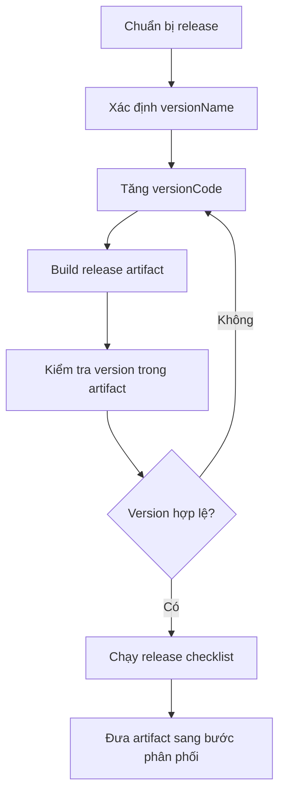

# 007 - versionCode

**Học phần:** 05 - Quality, Release and Portfolio  
**Module:** Module 12 - Distribution and Final Project  
**Nhóm nội dung:** Build and Signing  
**Nguồn roadmap:** Distribution and Final Project / Build and Signing  
**Loại bài:** project  
**Thứ tự trong module:** 007  
**Thời lượng gợi ý:** 45 phút

---

## 1. Bài toán dự án

Một ứng dụng Android không chỉ cần build thành công mà còn phải có cơ chế nhận diện chính xác từng bản phát hành. Khi phát hành phiên bản mới, Android và Google Play cần biết bản nào mới hơn để quyết định liệu ứng dụng có đủ điều kiện cập nhật hay không.

`versionCode` là số phiên bản nội bộ của ứng dụng. Giá trị này không được thiết kế để hiển thị cho người dùng mà được Android và hệ thống phân phối sử dụng để so sánh các bản build. Bản phát hành mới phải sử dụng `versionCode` lớn hơn bản trước. Google Play không cho phép tái sử dụng một `versionCode` đã dùng cho một bản phát hành trước đó.

Trong project này, người học sẽ xây dựng một **release versioning artifact** cho một ứng dụng Android nhỏ, bao gồm:

- cấu hình `versionCode`;
- cấu hình `versionName`;
- quy tắc tăng phiên bản;
- kiểm tra artifact sau khi build;
- release checklist;
- tài liệu README có thể đưa vào portfolio.

Mục tiêu không phải chỉ thay một con số trong Gradle. Project phải chứng minh rằng người học hiểu vai trò của versioning trong toàn bộ quy trình release.

---

## 2. Mục tiêu sản phẩm

Sau khi hoàn thành project, người học có thể:

- Giải thích chính xác vai trò của `versionCode` trong Android.
- Phân biệt `versionCode` với `versionName`.
- Cấu hình version cho application module.
- Thiết kế quy tắc tăng `versionCode` có thể sử dụng qua nhiều lần release.
- Phát hiện lỗi release do trùng hoặc giảm `versionCode`.
- Build một artifact Android với thông tin version chính xác.
- Tạo release checklist giúp giảm rủi ro khi đưa ứng dụng lên môi trường phân phối.
- Trình bày quy trình versioning dưới dạng README và bằng chứng kỹ thuật trong portfolio.

---

## 3. Kiến thức kỹ thuật cốt lõi

`versionCode` là một số nguyên dương dùng để xác định thứ tự tương đối giữa các phiên bản của cùng một ứng dụng.

Ví dụ:

```text
Release 1
versionCode = 1
        ↓
Release 2
versionCode = 2
        ↓
Release 3
versionCode = 3
```

Điều quan trọng là quan hệ:

```text
versionCode mới > versionCode cũ
```

Không bắt buộc `versionCode` phải bằng số lần commit, số sprint hoặc semantic version. Developer có thể lựa chọn chiến lược đánh số riêng, miễn là các release tiếp theo tăng đúng thứ tự. Android Developers khuyến nghị bắt đầu từ một số nguyên dương, thường là `1`, rồi tăng dần qua các release.

Google Play hiện giới hạn giá trị `versionCode` tối đa ở:

```text
2,100,000,000
```

Do đó chiến lược tự động tạo `versionCode` cũng phải bảo đảm không vượt giới hạn này.

---

## 4. `versionCode` và `versionName`

Hai thuộc tính thường xuất hiện cùng nhau nhưng phục vụ hai mục đích khác nhau.

| Thuộc tính | Mục đích | Ví dụ |
| --- | --- | --- |
| `versionCode` | Định danh thứ tự phiên bản cho Android và hệ thống phân phối | `17` |
| `versionName` | Tên phiên bản có ý nghĩa với người dùng | `"2.3.0"` |

Ví dụ:

```text
versionCode = 27
versionName = "2.4.1"
```

Người dùng có thể nhìn thấy:

```text
2.4.1
```

Trong khi hệ thống sử dụng:

```text
27
```

để xác định quan hệ giữa các phiên bản. Android định nghĩa `versionName` là chuỗi dành cho việc biểu diễn phiên bản tới người dùng, còn `versionCode` là giá trị có ý nghĩa khi hệ thống cần xác định phiên bản nào mới hơn.

Vì vậy không nên suy luận rằng:

```text
versionName = "2.0.0"
```

thì:

```text
versionCode = 200
```

Hai giá trị có thể được quản lý bằng các chiến lược khác nhau.

---

## 5. Yêu cầu của project

Project sử dụng một Android application module có thể build thành APK hoặc Android App Bundle.

Artifact cuối phải thể hiện được chuỗi release tối thiểu:

| Release | `versionCode` | `versionName` |
| --- | ---: | --- |
| Release A | `1` | `1.0.0` |
| Release B | `2` | `1.0.1` |
| Release C | `3` | `1.1.0` |

Người học phải chứng minh rằng:

- mỗi release mới có `versionCode` lớn hơn release trước;
- `versionName` có thể thay đổi độc lập theo quy ước của sản phẩm;
- artifact build cuối chứa đúng version dự kiến;
- release checklist ngăn việc vô tình tái sử dụng `versionCode`.

Đối với Android App Bundle, version của base module được dùng cho bundle và các APK mà Google Play tạo ra từ bundle đó. Khi phát hành code hoặc resource mới, version trong base module phải được cập nhật trước khi tạo bundle mới.

---

## 6. Thiết kế quy trình versioning

Luồng release của project nên tuân theo:



Trong luồng này, `versionCode` phải được quyết định **trước khi tạo artifact release**.

Nếu build xong mới phát hiện version bị trùng, artifact đó không nên tiếp tục đi qua pipeline phân phối. Cần cập nhật cấu hình, build lại và kiểm tra lại artifact.

---

## 7. Triển khai project

### 7.1. Cấu hình version trong Gradle

Với project sử dụng Kotlin DSL, mở file của application module:

```text
app/build.gradle.kts
```

Cấu hình:

```kotlin
android {
    defaultConfig {
        versionCode = 1
        versionName = "1.0.0"
    }
}
```

Ở release đầu:

```text
versionCode = 1
versionName = 1.0.0
```

Khi chuẩn bị bản vá:

```kotlin
android {
    defaultConfig {
        versionCode = 2
        versionName = "1.0.1"
    }
}
```

Sau đó, nếu ứng dụng có thêm tính năng nhỏ:

```kotlin
android {
    defaultConfig {
        versionCode = 3
        versionName = "1.1.0"
    }
}
```

Điểm cần chú ý là:

```text
1 → 2 → 3
```

chứ không phải:

```text
1 → 1 → 2
```

hoặc:

```text
3 → 2
```

`versionName` có thể thay đổi theo chiến lược semantic versioning của sản phẩm, nhưng `versionCode` vẫn phải bảo đảm thứ tự release.

### 7.2. Build artifact

Có thể build APK debug để kiểm tra quy trình:

```bash
./gradlew assembleDebug
```

Hoặc build release artifact khi project đã được cấu hình signing phù hợp:

```bash
./gradlew assembleRelease
```

Đối với Android App Bundle:

```bash
./gradlew bundleRelease
```

Artifact cần được tạo mới sau mỗi lần cập nhật version.

Không nên đổi `versionCode` nhưng tiếp tục sử dụng artifact đã build trước đó, vì thông tin version được ghi vào package trong quá trình build.

### 7.3. Tạo bảng lịch sử release

Thêm file:

```text
docs/release-history.md
```

Ví dụ:

```markdown
# Release History

| versionCode | versionName | Loại release | Ghi chú |
| ---: | --- | --- | --- |
| 1 | 1.0.0 | Initial release | Phiên bản đầu tiên |
| 2 | 1.0.1 | Patch | Sửa lỗi hiển thị |
| 3 | 1.1.0 | Minor | Thêm tính năng mới |
```

Bảng này không thay thế Git history hoặc Play Console nhưng giúp minh họa rõ chiến lược versioning trong portfolio.

---

## 8. Các tình huống phải kiểm thử

### 8.1. Release mới có `versionCode` lớn hơn

Giả sử production hiện tại là:

```text
versionCode = 12
versionName = 2.1.0
```

Release tiếp theo:

```text
versionCode = 13
versionName = 2.1.1
```

Kết quả mong đợi:

```text
13 > 12
```

Release hợp lệ về mặt thứ tự version.

### 8.2. Tái sử dụng `versionCode`

Production:

```text
versionCode = 12
```

Release mới:

```text
versionCode = 12
```

Kết quả:

```text
FAIL
```

Google Play không cho phép tải lên một APK với `versionCode` đã được sử dụng cho phiên bản trước.

Cách xử lý:

```text
versionCode = 13
```

sau đó build lại artifact.

### 8.3. Giảm `versionCode`

Production:

```text
versionCode = 20
```

Release mới:

```text
versionCode = 19
```

Đây là dấu hiệu quy trình release đang có lỗi.

Không nên xử lý bằng cách thay đổi `versionName` thành một giá trị lớn hơn:

```text
versionName = "99.0.0"
```

vì hệ thống xác định thứ tự phiên bản bằng `versionCode`, không phải bằng cách phân tích ý nghĩa semantic của `versionName`.

---

## 9. Release risk cần xử lý

`versionCode` hầu như không liên quan trực tiếp đến UI state, lifecycle của `Activity`, network request hoặc database state trong lúc ứng dụng đang chạy.

Rủi ro chính nằm ở **release pipeline**.

| Rủi ro | Hậu quả | Biện pháp |
| --- | --- | --- |
| Quên tăng `versionCode` | Không thể phát hành bản cập nhật theo quy trình dự kiến | Kiểm tra version trước build |
| Dùng lại code cũ | Artifact bị từ chối khi upload | Lưu release history |
| Giảm code | Quan hệ phiên bản bị sai | Chỉ cho phép monotonic increase |
| Build trước khi đổi version | Artifact chứa version cũ | Clean/build lại release |
| Nhầm `versionName` với `versionCode` | Quy trình release sai | Quản lý hai thuộc tính riêng |
| Tăng code không kiểm soát | Tiêu tốn namespace version không cần thiết | Xây dựng chiến lược ổn định |

Release automation nên coi version là một phần của dữ liệu đầu vào bắt buộc trước bước build.

---

## 10. Best practices cho project

Không nên sử dụng `versionCode` như một con số tùy ý được thay đổi thủ công mà không có quy ước.

Một quy trình tốt nên bảo đảm:

```text
Release N
versionCode = X

Release N + 1
versionCode > X
```

Nên lưu cả:

```text
versionCode
versionName
commit/tag
release notes
```

để có thể truy vết artifact.

Ví dụ:

```text
versionCode: 42
versionName: 2.7.0
Git tag: v2.7.0
Commit: abc123
```

Không lưu signing password, keystore password hoặc secret vào README hay repository công khai.

Nếu version được tạo tự động trong CI/CD, pipeline vẫn phải có cơ chế phát hiện duplicate, rollback sai version hoặc giá trị vượt giới hạn của Play Console.

---

## 11. Deliverable

Repository hoàn thành nên có cấu trúc tương tự:

```text
android-versioning-project/
├── app/
│   └── build.gradle.kts
├── docs/
│   ├── release-history.md
│   └── screenshots/
└── README.md
```

`README.md` phải mô tả tối thiểu:

```text
Project goal
Versioning strategy
Current versionCode
Current versionName
Build command
Release workflow
Release checklist
Known limitations
```

Trong `docs/screenshots/`, lưu bằng chứng phù hợp như:

- cấu hình version trong Gradle;
- artifact build thành công;
- thông tin version của bản build;
- release history.

Không đưa secret hoặc thông tin signing nhạy cảm vào screenshot.

---

## 12. README cho portfolio

README cần giải thích project theo hướng kỹ thuật thay vì chỉ ghi:

> Project này học về versionCode.

Nội dung nên cho thấy quyết định kỹ thuật, chẳng hạn:

```markdown
## Versioning Strategy

Ứng dụng sử dụng một `versionCode` tăng đơn điệu cho mỗi release.

Ví dụ:

| Release | versionCode | versionName |
| --- | ---: | --- |
| Initial | 1 | 1.0.0 |
| Patch | 2 | 1.0.1 |
| Feature | 3 | 1.1.0 |

`versionName` mô tả phiên bản sản phẩm cho người dùng, trong khi
`versionCode` được sử dụng để xác định thứ tự các bản phát hành.
```

Portfolio artifact tốt phải cho người xem thấy rằng developer hiểu cả:

```text
Gradle configuration
        +
Version strategy
        +
Build artifact
        +
Release validation
        +
Documentation
```

chứ không chỉ biết vị trí của thuộc tính `versionCode`.

---

## 13. Tiêu chí kiểm thử project

Trước khi coi project hoàn thành, thực hiện ít nhất ba lần mô phỏng release.

**Release 1**

```text
versionCode = 1
versionName = 1.0.0
```

Build artifact.

**Release 2**

```text
versionCode = 2
versionName = 1.0.1
```

Build artifact mới.

**Release 3**

```text
versionCode = 3
versionName = 1.1.0
```

Build artifact mới.

Sau đó xác nhận:

```text
1 < 2 < 3
```

và mỗi artifact tương ứng đúng với release mong đợi.

Ngoài happy path, cần mô phỏng ít nhất một lỗi:

```text
versionCode hiện tại = 3
versionCode release mới = 3
```

Project phải mô tả được:

```text
Hiện tượng
    ↓
Duplicate versionCode

Nguyên nhân
    ↓
Quy trình release không tăng version

Cách xử lý
    ↓
Tăng versionCode
    ↓
Build lại artifact
    ↓
Kiểm tra lại
```

---

## 14. Definition of Done

- [ ] `versionCode` được cấu hình trong application module.
- [ ] `versionName` được cấu hình riêng với `versionCode`.
- [ ] Có ít nhất ba release giả lập với `versionCode` tăng liên tục.
- [ ] Không có release mới sử dụng lại `versionCode` cũ.
- [ ] Có build artifact thành công.
- [ ] Có bước kiểm tra version trước khi phân phối.
- [ ] Có `release-history.md`.
- [ ] Có release checklist.
- [ ] README giải thích được chiến lược versioning.
- [ ] Có ít nhất một bằng chứng trực quan phù hợp cho portfolio.
- [ ] Không commit password, signing secret hoặc dữ liệu nhạy cảm.
- [ ] Người xem repository có thể giải thích được quan hệ giữa `versionCode`, `versionName`, build và release.

---

## 15. Rubric đánh giá

| Tiêu chí | Trọng số |
| --- | ---: |
| Cấu hình `versionCode` và `versionName` đúng | 20% |
| Quy tắc tăng version rõ ràng | 20% |
| Build và kiểm chứng artifact | 20% |
| Xử lý tình huống duplicate hoặc giảm version | 15% |
| Release checklist | 10% |
| README và release history | 10% |
| Chất lượng artifact portfolio | 5% |

Project được xem là đạt yêu cầu khi không chỉ build thành công mà còn chứng minh được một quy trình release có kiểm soát:

```text
Thay đổi ứng dụng
        ↓
Chọn versionName
        ↓
Tăng versionCode
        ↓
Build artifact
        ↓
Xác minh version
        ↓
Kiểm tra release
        ↓
Phân phối
```

`versionCode` là một thuộc tính nhỏ trong cấu hình Android nhưng có vai trò quan trọng trong quản lý vòng đời phát hành. Một quy trình versioning rõ ràng giúp tránh duplicate build, sai thứ tự phiên bản và các lỗi có thể làm gián đoạn quá trình đưa bản cập nhật tới người dùng.