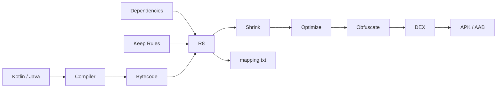

# 009 - ProGuard and R8

**Học phần:** 05 - Quality, Release and Portfolio  
**Module:** Module 12 - Distribution and Final Project  
**Nhóm nội dung:** Build and Signing  
**Nguồn roadmap:** Distribution and Final Project / Build and Signing  
**Loại bài:** lesson  
**Thứ tự trong module:** 009  
**Thời lượng gợi ý:** 45 phút

---

## 1. Tóm tắt

Một ứng dụng Android có thể hoạt động hoàn toàn bình thường trong `debug` nhưng gặp lỗi khi tạo bản `release`. Nguyên nhân thường không nằm ở UI hay business logic mà xuất hiện trong giai đoạn tối ưu hóa mã nguồn: class bị loại bỏ, tên class hoặc field bị thay đổi, reflection không còn tìm thấy đối tượng, JNI không gọi được method hoặc stack trace sau crash trở nên khó đọc.

`R8` là công cụ tối ưu ứng dụng Android được tích hợp vào Android build toolchain. Nó có thể loại bỏ code không sử dụng, tối ưu bytecode, rút gọn tên class và member, đồng thời phối hợp với resource shrinking để giảm kích thước ứng dụng. Trong các dự án Android hiện đại, khi developer nói đến "ProGuard rules", phần lớn họ đang nói đến các rule có cú pháp tương thích ProGuard nhưng được `R8` xử lý.

Bài học này tập trung vào cách `R8` hoạt động, sự khác nhau giữa ProGuard và R8, cách bật tối ưu hóa cho `release`, cách viết `keep rules`, cách xử lý reflection và cách kiểm thử một bản build đã được minify trước khi phát hành.

---

## 2. Mục tiêu học tập

Sau bài học, người học có thể:

- Giải thích được vai trò của `R8` trong Android build pipeline.
- Phân biệt được `R8` với ProGuard và khái niệm "ProGuard rules".
- Phân tích được bốn hoạt động chính: code shrinking, optimization, obfuscation và resource shrinking.
- Cấu hình được optimization cho `release` build.
- Viết được `keep rule` cho trường hợp sử dụng reflection hoặc dynamic class loading.
- Phân tích được nguyên nhân ứng dụng chỉ crash sau khi bật minification.
- Sử dụng `mapping.txt` để phục hồi stack trace đã bị obfuscate.
- Kiểm thử được bản `release` trước khi tạo APK hoặc Android App Bundle phát hành.
- Đánh giá được `keep rules` quá rộng và ảnh hưởng của chúng đến khả năng tối ưu của R8.

---

## 3. Vì sao ứng dụng Android cần R8?

Giả sử một ứng dụng có:

```text
Mã ứng dụng        8 MB
Thư viện          15 MB
Resource          12 MB
```

Không phải toàn bộ class và resource trong các thư viện đều thực sự được sử dụng.

Ví dụ ứng dụng import một thư viện có 200 class nhưng chỉ gọi 15 class. Nếu tất cả code của thư viện được đóng gói nguyên vẹn vào ứng dụng, người dùng phải tải và cài đặt nhiều dữ liệu không cần thiết.

Quá trình release vì vậy không chỉ đơn giản là:

```text
Source code
    ↓
Compile
    ↓
APK / AAB
```

Một build được tối ưu có thêm bước phân tích:

```text
Source code
    ↓
Compile
    ↓
Phân tích code có thể truy cập
    ↓
Loại code không cần thiết
    ↓
Tối ưu code
    ↓
Rút gọn tên
    ↓
Tạo DEX
    ↓
APK / AAB
```

`R8` thực hiện phần lớn công việc tối ưu này cho Android.

Google khuyến nghị bật app optimization cho bản release vì việc loại bỏ code không sử dụng và tối ưu chương trình có thể giảm kích thước ứng dụng, giảm memory pressure và cải thiện runtime behavior. Tuy nhiên, optimization cũng làm build chậm hơn và khiến debugging phức tạp hơn, nên thông thường không cần bật cho development build.

---

## 4. ProGuard và R8

### 4.1. ProGuard

ProGuard là một công cụ Java lâu đời có khả năng:

- shrink code;
- optimize code;
- obfuscate code;
- sử dụng các configuration rule để quy định những class hoặc member nào phải được giữ lại.

Một file rule truyền thống thường có dạng:

```proguard
-keep class com.example.MyClass {
    *;
}
```

Do lịch sử Android từng sử dụng ProGuard, các tên như:

```text
proguard-rules.pro
ProGuard rules
consumerProguardFiles
```

vẫn xuất hiện phổ biến trong Android project.

### 4.2. R8

Trong Android hiện đại, công cụ chính thực hiện shrinking và optimization là `R8`.

R8 hiểu phần lớn cú pháp cấu hình tương thích ProGuard, vì vậy developer vẫn thường gọi chúng là **ProGuard rules**, mặc dù chính `R8` mới là công cụ xử lý chúng trong build pipeline.

Có thể ghi nhớ:

```text
ProGuard
    ↓
Tên công cụ / hệ rule lịch sử

R8
    ↓
Android app optimizer hiện đại

ProGuard rule
    ↓
Cú pháp cấu hình thường được R8 sử dụng
```

R8 không chỉ obfuscate code. Nó còn thực hiện code shrinking và nhiều optimization như method inlining hoặc class merging.

---

## 5. R8 tối ưu ứng dụng như thế nào?

### 5.1. Code shrinking

Code shrinking loại bỏ code mà R8 xác định là không thể được truy cập trong chương trình.

Ví dụ:

```kotlin
class PriceFormatter {

    fun formatPrice(value: Double): String {
        return "$value USD"
    }

    fun legacyFormat(value: Double): String {
        return "USD $value"
    }
}
```

Nếu `legacyFormat()` không được gọi ở bất kỳ đâu và không được truy cập động, R8 có thể loại bỏ method này khỏi release build.

Với một dependency lớn, R8 cũng có thể loại các phần của dependency mà ứng dụng không sử dụng.

R8 xây dựng một đồ thị tham chiếu bắt đầu từ các entry point có thể truy cập và loại bỏ phần không còn reachable.

### 5.2. Code optimization

R8 không chỉ xóa code. Nó còn có thể viết lại chương trình theo cách hiệu quả hơn.

Một số optimization gồm:

- method inlining;
- class merging;
- loại bỏ branch không cần thiết;
- propagation giá trị;
- đơn giản hóa code;
- tối ưu cấu trúc chương trình.

Ví dụ một method nhỏ:

```kotlin
private fun double(value: Int): Int {
    return value * 2
}
```

được gọi:

```kotlin
val result = double(10)
```

R8 có thể inline logic tương đương:

```text
10 * 2
```

vào call site khi việc đó an toàn và có lợi.

Method inlining và class merging là hai kỹ thuật được Android documentation mô tả trực tiếp trong R8 optimization pipeline.

### 5.3. Obfuscation

Obfuscation thay tên class, method và field bằng các tên ngắn hơn.

Ví dụ source code:

```text
com.example.payment.PaymentRepository
```

có thể xuất hiện trong release DEX dưới dạng tương tự:

```text
a.b
```

Method:

```text
calculateTotalPrice()
```

có thể trở thành:

```text
a()
```

Mục tiêu trực tiếp của bước này là giảm metadata footprint và kích thước output. Nó đồng thời khiến việc đọc ngược code khó hơn, nhưng không nên xem obfuscation như một cơ chế bảo mật tuyệt đối.

### 5.4. Resource shrinking

Code shrinking và resource shrinking là hai khái niệm liên quan nhưng khác nhau.

Code shrinking xử lý:

```text
class
method
field
bytecode
```

Resource shrinking xử lý:

```text
drawable
layout
string
raw resource
các resource Android không còn cần thiết
```

Trong các phiên bản AGP hiện đại, R8 có khả năng phối hợp phân tích code và resource để xác định resource chỉ được tham chiếu từ code đã bị loại bỏ. AGP 9.0 trở lên sử dụng optimized resource shrinking khi resource shrinking được bật; AGP 9.3 đưa việc cấu hình code và resource optimization vào DSL mới.

---

## 6. R8 trong Android build pipeline



Source code Kotlin hoặc Java được compile trước khi R8 phân tích chương trình cùng với dependencies và các rule cấu hình.

`Keep rules` cung cấp cho R8 những thông tin mà static analysis không thể tự suy ra đầy đủ, đặc biệt khi chương trình sử dụng reflection, JNI hoặc dynamic loading.

Kết quả cuối cùng gồm code DEX đã được tối ưu. Khi obfuscation xảy ra, build còn sinh mapping information để ánh xạ tên đã rút gọn trở lại tên trong source code.

---

## 7. Bật optimization cho release build

Cách cấu hình phụ thuộc vào phiên bản Android Gradle Plugin của project.

### 7.1. AGP 9.3 trở lên

AGP 9.3 giới thiệu DSL đơn giản hơn cho app optimization:

```kotlin
android {
    buildTypes {
        release {
            optimization {
                enable = true
            }
        }
    }
}
```

Với DSL này, code và resource optimization được bật cùng nhau. AGP cũng cung cấp default Android keep rules tương đương cấu hình optimized mặc định.

Custom keep rules có thể được đặt trong source set:

```text
src/
└── main/
    └── keepRules/
        └── custom-rules.keep
```

Hoặc rule dành riêng cho variant có thể được tổ chức theo source set tương ứng.

AGP 9.3 sử dụng file có suffix:

```text
.keep
```

cho cơ chế `keepRules` source set mới. Legacy DSL vẫn tiếp tục được hỗ trợ.

### 7.2. Legacy DSL trước AGP 9.3

Với project sử dụng DSL truyền thống:

```kotlin
android {
    buildTypes {
        release {
            isMinifyEnabled = true
            isShrinkResources = true

            proguardFiles(
                getDefaultProguardFile("proguard-android-optimize.txt"),
                "proguard-rules.pro"
            )
        }
    }
}
```

Trong đó:

- `isMinifyEnabled = true` bật code shrinking, optimization và obfuscation;
- `isShrinkResources = true` bật resource shrinking;
- `proguard-android-optimize.txt` chứa Android default optimized rules;
- `proguard-rules.pro` chứa rule riêng của ứng dụng.

Android documentation hiện khuyến nghị sử dụng `proguard-android-optimize.txt` với legacy DSL. Hỗ trợ cho default file cũ `proguard-android.txt`, vốn bao gồm `-dontoptimize`, đã bị loại khỏi AGP 9.0.

---

## 8. Vấn đề quan trọng nhất: static analysis và dynamic access

R8 hoạt động rất tốt khi quan hệ giữa các class được thể hiện trực tiếp trong code.

Ví dụ:

```kotlin
val repository = UserRepository()
repository.loadUser()
```

R8 nhìn thấy rõ:

```text
Code
 ↓
UserRepository
 ↓
loadUser()
```

Nhưng xem trường hợp:

```kotlin
val className = "com.example.plugin.PaymentPlugin"

val pluginClass = Class.forName(className)
val plugin = pluginClass.getDeclaredConstructor().newInstance()
```

Trong source code không có lời gọi trực tiếp:

```kotlin
PaymentPlugin()
```

Tên class chỉ tồn tại dưới dạng `String`.

Static analyzer có thể không xác định đầy đủ rằng class này cần được giữ nguyên.

Kết quả có thể là:

```text
Debug
  ↓
PaymentPlugin tồn tại
  ↓
Chạy bình thường

Release + R8
  ↓
PaymentPlugin bị đổi tên hoặc loại bỏ
  ↓
Class.forName(...) thất bại
  ↓
Crash
```

Đây là một trong những nguyên nhân phổ biến khiến ứng dụng hoạt động ở `debug` nhưng lỗi ở `release`.

---

## 9. Keep rules

### 9.1. Khi nào cần keep rule?

Keep rule thường cần được xem xét khi code sử dụng:

- reflection;
- `Class.forName()`;
- JNI;
- serialization dựa trên reflection;
- dependency injection dựa trên runtime reflection;
- framework tạo object từ tên class;
- API đọc field hoặc method bằng tên;
- plugin system;
- dynamic loading.

Không nên kết luận rằng "cứ dùng thư viện là phải viết ProGuard rule". Các Android library được thiết kế tốt thường cung cấp **consumer keep rules** cần thiết cùng artifact của chúng.

Library consumer rules được merge vào cấu hình optimization của ứng dụng khi dependency được sử dụng.

### 9.2. Ví dụ keep class được load bằng tên

Giả sử ứng dụng có:

```kotlin
package com.example.plugin

class PaymentPlugin {

    fun execute() {
        println("Payment plugin started")
    }
}
```

Nhưng class được tạo bằng reflection:

```kotlin
val clazz = Class.forName(
    "com.example.plugin.PaymentPlugin"
)

val instance = clazz
    .getDeclaredConstructor()
    .newInstance()
```

Có thể cần một rule:

```proguard
-keep class com.example.plugin.PaymentPlugin {
    public <init>();
}
```

Rule này cho R8 biết rằng class và constructor cần được giữ vì chúng được truy cập động.

Điểm quan trọng không phải là thêm càng nhiều `-keep` càng tốt.

Mục tiêu là:

```text
Giữ đúng thứ runtime cần
        +
Cho phép R8 tối ưu tối đa phần còn lại
```

### 9.3. Không keep toàn bộ ứng dụng

Một rule như:

```proguard
-keep class com.example.** {
    *;
}
```

có thể khiến phần lớn ứng dụng không còn được shrink, optimize hoặc obfuscate hiệu quả.

Nó thường che giấu vấn đề thay vì giải quyết vấn đề.

Android documentation khuyến nghị tránh package-wide keep rule không cần thiết và chỉ giữ những class, field hoặc method thật sự được truy cập theo cách R8 không thể suy ra.

---

## 10. `@Keep` và consumer rules

Trong một số tình huống Android code có thể sử dụng annotation `@Keep` để đánh dấu thành phần không nên bị loại bỏ hoặc thay đổi bởi code shrinking.

Ví dụ:

```kotlin
import androidx.annotation.Keep

@Keep
class ExternalPlugin {

    fun execute() {
        // Called dynamically
    }
}
```

`@Keep` thuận tiện cho các trường hợp nhỏ, nhưng không nên được rải khắp codebase chỉ để làm cho release build hết crash.

Nếu đang xây dựng Android library, vấn đề thường nên được giải quyết thông qua **consumer keep rules** để ứng dụng sử dụng library không phải tự biết toàn bộ chi tiết implementation của thư viện.

Tư duy đúng là:

```text
Ai sử dụng reflection?
        ↓
Thành phần đó cần mô tả dependency động
        ↓
Rule phải càng hẹp càng tốt
```

---

## 11. Reflection và serialization

Serialization là khu vực đặc biệt dễ gặp lỗi khi bật R8.

Giả sử một thư viện tìm field bằng tên:

```kotlin
data class User(
    val userName: String,
    val age: Int
)
```

Nếu R8 đổi:

```text
userName
```

thành:

```text
a
```

trong khi serialization framework vẫn tìm `"userName"` bằng reflection, mapping dữ liệu có thể bị lỗi.

Các thư viện hiện đại thường giải quyết vấn đề theo một trong hai hướng:

```text
Code generation
hoặc
Consumer keep rules + annotation
```

Code generation thường thân thiện với optimizer hơn reflection vì quan hệ giữa các thành phần đã được thể hiện trong generated code và có thể được R8 phân tích tĩnh. Android documentation khuyến nghị ưu tiên code generation thay cho open-ended reflection khi có thể.

Ví dụ các công nghệ như Room, Hilt hoặc Moshi codegen sử dụng generated code thay vì phụ thuộc hoàn toàn vào runtime reflection.

---

## 12. Mapping và stack trace sau obfuscation

Giả sử source code ban đầu có:

```kotlin
class PaymentRepository {

    fun confirmPayment() {
        error("Payment failed")
    }
}
```

Sau obfuscation, production crash có thể hiển thị dạng:

```text
java.lang.IllegalStateException: Payment failed
    at a.b.a(SourceFile:12)
```

Developer không thể trực tiếp biết:

```text
a.b.a
```

tương ứng với class hoặc method nào.

R8 sinh mapping information để ánh xạ:

```text
Tên sau obfuscation
        ↓
Tên source ban đầu
```

File quan trọng thường là:

```text
mapping.txt
```

được tạo cho từng optimized release build.

Mapping file phải được giữ tương ứng với đúng release version. Nếu mapping của version khác được sử dụng, stack trace có thể không được phục hồi chính xác.

Các Android tool hiện đại hỗ trợ **retrace** để chuyển obfuscated stack trace trở lại dạng gần với source code. Android Studio cũng đã tăng cường khả năng automatic retracing cho output được R8 xử lý.

Có thể hình dung:

```text
Production stack trace
        +
mapping.txt
        ↓
Retrace
        ↓
Readable stack trace
        ↓
Class / method / line gần với source
```

Đây là lý do mapping artifact là một phần quan trọng của release pipeline.

---

## 13. Kiểm thử R8 đúng cách

Không nên xem:

```text
assembleRelease thành công
```

là bằng chứng rằng ứng dụng đã hoạt động đúng sau optimization.

Build thành công chỉ chứng minh output có thể được tạo.

Release vẫn có thể crash khi runtime chạy tới:

- reflection;
- serialization;
- deep link;
- push notification;
- background worker;
- database migration;
- JNI;
- dynamic navigation;
- third-party SDK;
- code chỉ chạy ở một flow hiếm gặp.

Quy trình nên là:

```text
Enable optimization
        ↓
Build release
        ↓
Install release build
        ↓
Smoke test
        ↓
Test critical user flows
        ↓
Test reflection / serialization
        ↓
Kiểm tra crash
        ↓
Điều chỉnh keep rule nếu cần
        ↓
Build lại
```

Có thể build APK release:

```bash
./gradlew :app:assembleRelease
```

Hoặc Android App Bundle:

```bash
./gradlew :app:bundleRelease
```

Sau đó kiểm thử chính artifact gần với bản sẽ được phát hành thay vì chỉ chạy `debug`.

---

## 14. Debug lỗi do R8

### 14.1. Ứng dụng chỉ crash ở release

**Hiện tượng:** `debug` hoạt động nhưng `release` crash.

**Nguyên nhân có thể:**

- R8 loại class chỉ được dùng bằng reflection.
- Constructor bị loại.
- Field bị đổi tên.
- Annotation cần thiết không còn được giữ.
- Thư viện thiếu consumer rule.
- Code đang phụ thuộc vào tên class hoặc member.

**Cách xử lý:**

1. Xác định stack trace.
2. Retrace nếu stack trace đã bị obfuscate.
3. Xác định flow chỉ lỗi khi optimization bật.
4. Kiểm tra reflection, JNI hoặc serialization.
5. Thêm rule hẹp nhất có thể.
6. Build lại release.
7. Chạy lại test.

Không nên xử lý bằng cách đầu tiên là:

```proguard
-keep class ** {
    *;
}
```

vì rule này gần như vô hiệu hóa phần lớn lợi ích của optimization.

### 14.2. R8 báo missing class

**Hiện tượng:**

```text
R8: Missing class ...
```

Điều này có nghĩa R8 phát hiện reference tới một class không tồn tại trong program hoặc dependency graph mà nó đang phân tích.

Không nên ngay lập tức thêm:

```proguard
-dontwarn **
```

Rule quá rộng có thể che giấu dependency thật sự bị thiếu.

Cần xác định:

```text
Class có thực sự cần ở runtime?
        ↓
Có → sửa dependency

Không → xác định vì sao reference tồn tại
        ↓
Chỉ suppress warning cụ thể khi có lý do rõ ràng
```

Android Gradle Plugin hiện xử lý missing-class problem nghiêm ngặt hơn các phiên bản cũ; việc bỏ qua warning toàn cục không được khuyến nghị.

---

## 15. R8 Configuration Analyzer

Các `keep rules` tích lũy lâu ngày có thể làm giảm đáng kể hiệu quả R8.

Ví dụ một project có thể chứa:

```text
Rule cũ
Rule copy từ Stack Overflow
Rule do SDK cũ yêu cầu
Rule package-wide
Rule không còn cần sau migration
```

Ứng dụng vẫn build được nhưng R8 bị ngăn tối ưu một phần lớn codebase.

R8 Configuration Analyzer cung cấp các chỉ số liên quan tới:

- shrinking;
- optimization;
- obfuscation;

và giúp xác định rule nào đang ngăn nhiều class, field hoặc method được tối ưu.

Với AGP 9.3, có thể chạy task:

```bash
./gradlew :app:analyzeReleaseR8Config
```

R8 Configuration Analyzer cũng được tích hợp vào release tooling của AGP 9.3, giúp developer đánh giá chất lượng configuration thay vì chỉ đo xem build có thành công hay không.

Tư duy quan trọng là:

```text
Không phải:
Có càng nhiều keep rule càng an toàn

Mà là:
Giữ tối thiểu những gì runtime thực sự cần
```

---

## 16. Best practices cho production

- Bật R8 optimization cho bản phát hành.
- Kiểm thử optimized release build, không chỉ `debug`.
- Bật resource shrinking cùng code optimization khi cấu hình legacy DSL.
- Không thêm `-keep` nếu chưa hiểu tại sao cần.
- Ưu tiên rule theo class, annotation hoặc member cụ thể thay vì package-wide rule.
- Kiểm tra consumer rules của dependency trước khi tự thêm rule.
- Ưu tiên thư viện sử dụng code generation thay vì open-ended reflection khi có lựa chọn phù hợp.
- Không xem obfuscation là giải pháp bảo mật tuyệt đối.
- Lưu mapping artifact cho mỗi production release.
- Retrace production crash bằng mapping đúng version.
- Kiểm thử các flow sử dụng serialization, reflection, JNI và dynamic loading.
- Review lại rule sau khi nâng cấp hoặc xóa dependency.
- Không dùng `-dontwarn **` để che toàn bộ warning.
- Không vô hiệu hóa optimization toàn ứng dụng chỉ để sửa một lỗi riêng lẻ.
- Sử dụng R8 Configuration Analyzer khi cần xác định keep rule quá rộng.

Hiệu quả của R8 phụ thuộc trực tiếp vào mức codebase mà optimizer được phép xử lý; keep rule càng rộng thì không gian optimization càng bị thu hẹp.

---

## 17. Bài thực hành

Hãy tạo một Android app nhỏ có hai class:

```kotlin
class NormalService {

    fun execute(): String {
        return "Normal service"
    }
}
```

và:

```kotlin
class DynamicService {

    fun execute(): String {
        return "Dynamic service"
    }
}
```

Sử dụng trực tiếp `NormalService`:

```kotlin
val service = NormalService()
println(service.execute())
```

Nhưng load `DynamicService` bằng reflection:

```kotlin
val clazz = Class.forName(
    "com.example.r8demo.DynamicService"
)

val instance = clazz
    .getDeclaredConstructor()
    .newInstance()
```

Thực hiện lần lượt:

1. Chạy ứng dụng bằng `debug`.
2. Bật R8 cho `release`.
3. Build release artifact.
4. Chạy flow sử dụng `DynamicService`.
5. Kiểm tra xem reflection có hoạt động hay không.
6. Nếu class bị ảnh hưởng, thêm targeted keep rule.
7. Build lại release.
8. So sánh kích thước output trước và sau optimization.
9. Kiểm tra `mapping.txt`.
10. Ghi lại kết quả trong README.

Keep rule thử nghiệm:

```proguard
-keep class com.example.r8demo.DynamicService {
    public <init>();
}
```

**Kết quả mong đợi:**

- `release` build thành công.
- `NormalService` hoạt động sau optimization.
- Người học quan sát được ảnh hưởng của R8 đối với dynamic access.
- Reflection hoạt động sau khi cấu hình rule phù hợp.
- Có thể giải thích vì sao rule cần thiết.
- Xác định được mapping artifact của release build.

---

## 18. Artifact cho portfolio

Tạo một thư mục hoặc repository nhỏ:

```text
r8-release-demo/
├── app/
├── README.md
└── screenshots/
```

README nên thể hiện:

```text
Problem
   ↓
R8 configuration
   ↓
Reflection failure
   ↓
Keep rule
   ↓
Release validation
   ↓
Result
```

Nên có:

- cấu hình optimization;
- ví dụ reflection;
- keep rule đã sử dụng;
- screenshot app chạy bằng release build;
- kích thước artifact trước và sau optimization nếu đã đo;
- mô tả nguyên nhân lỗi;
- cách kiểm chứng fix;
- lưu ý về `mapping.txt`.

Artifact này thể hiện một kỹ năng production quan trọng hơn nhiều so với việc chỉ ghi trong CV rằng đã "biết ProGuard".

---

## 19. Checklist hoàn thành

- [ ] Giải thích được ProGuard và R8 khác nhau ở đâu.
- [ ] Giải thích được code shrinking.
- [ ] Giải thích được code optimization.
- [ ] Giải thích được obfuscation.
- [ ] Giải thích được resource shrinking.
- [ ] Biết cách bật optimization cho `release`.
- [ ] Nhận biết được cấu hình AGP 9.3 và legacy DSL.
- [ ] Giải thích được vì sao reflection có thể gây lỗi với R8.
- [ ] Viết được targeted keep rule.
- [ ] Không sử dụng package-wide keep rule khi không cần thiết.
- [ ] Biết vai trò của consumer keep rules.
- [ ] Biết mục đích của `mapping.txt`.
- [ ] Biết vì sao cần retrace production stack trace.
- [ ] Kiểm thử được optimized release build.
- [ ] Biết cách tiếp cận lỗi missing class.
- [ ] Biết mục đích của R8 Configuration Analyzer.
- [ ] Hoàn thành được artifact `r8-release-demo`.

---

## 20. Câu hỏi tự kiểm tra

1. Vì sao một ứng dụng có thể chạy bình thường ở `debug` nhưng crash khi bật R8 cho `release`?

2. Code shrinking và obfuscation giải quyết hai vấn đề khác nhau như thế nào?

3. Tại sao reflection làm cho static analysis của R8 khó xác định chính xác code cần giữ?

4. Vì sao rule sau đây thường là một dấu hiệu cấu hình chưa tốt?

```proguard
-keep class com.example.** {
    *;
}
```

5. Nếu nhận một production stack trace chứa các class như `a.b.c`, artifact nào cần được tìm để phục hồi tên class và method ban đầu?

6. Tại sao build `assembleRelease` thành công vẫn chưa đủ để kết luận ứng dụng an toàn để phát hành?

7. Khi một thư viện đã cung cấp consumer keep rules chính xác, tại sao ứng dụng thường không nên tự keep toàn bộ package của thư viện đó?

---

## 21. Tổng kết

`R8` nằm ở giai đoạn release của Android build pipeline và có trách nhiệm tối ưu ứng dụng trước khi đóng gói. Nó không chỉ thực hiện obfuscation mà còn có thể loại code không sử dụng, tối ưu chương trình và phối hợp với resource shrinking.

Khái niệm quan trọng nhất cần nhớ là R8 dựa nhiều vào static analysis. Code được gọi trực tiếp thường dễ phân tích, còn reflection, JNI và dynamic loading có thể tạo ra dependency mà optimizer không nhìn thấy rõ. `Keep rules` tồn tại để mô tả những dependency đặc biệt đó.

Một cấu hình production tốt không phải là cấu hình giữ lại càng nhiều code càng tốt. Mục tiêu là:

```text
Release correctness
        +
Targeted keep rules
        +
Maximum safe optimization
        +
Release testing
        +
Mapping preservation
```

Khi triển khai R8 đúng cách, developer không chỉ tạo được APK hoặc AAB nhỏ hơn mà còn xây dựng được một release pipeline có khả năng kiểm thử, debug và truy vết lỗi production một cách đáng tin cậy.