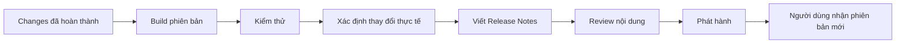

# 010 - Release Notes

**Học phần:** 05 - Quality, Release and Portfolio  
**Module:** Module 12 - Distribution and Final Project  
**Nhóm nội dung:** Build and Signing  
**Nguồn roadmap:** Distribution and Final Project / Build and Signing  
**Loại bài:** project  
**Thứ tự trong module:** 010  
**Thời lượng gợi ý:** 45 phút

---

## 1. Bài toán dự án

Một ứng dụng Android không kết thúc vòng đời phát triển khi file APK hoặc App Bundle được build thành công. Khi một phiên bản mới được phát hành, người dùng, tester và các thành viên trong nhóm cần biết chính xác phiên bản đó thay đổi điều gì.

Nếu không có Release Notes rõ ràng, một bản phát hành có thể tạo ra nhiều vấn đề:

- người dùng không biết ứng dụng vừa được cải thiện ở đâu;
- QA khó xác định phạm vi cần regression test;
- đội hỗ trợ không biết lỗi nào đã được sửa;
- developer khó truy vết thay đổi giữa các phiên bản;
- stakeholder không biết tính năng nào thực sự đã được đưa vào production;
- thông tin phát hành trên store có thể mơ hồ hoặc không phản ánh đúng sản phẩm.

Trong project này, nhiệm vụ là xây dựng một **Release Notes Package** hoàn chỉnh cho một ứng dụng Android. Artifact phải đủ rõ để có thể sử dụng trong portfolio và mô phỏng quy trình phát hành thực tế.

Luồng tổng quát của một bản release có thể hình dung như sau:



Release Notes nằm gần cuối quy trình nhưng phụ thuộc trực tiếp vào những gì đã được triển khai và kiểm chứng. Vì vậy, nội dung phát hành không nên được viết dựa trên kế hoạch ban đầu mà phải phản ánh **trạng thái thực tế của build sắp được phát hành**.

## 2. Mục tiêu sản phẩm

Sau khi hoàn thành project, bạn cần tạo được một bộ Release Notes có thể sử dụng cho một phiên bản Android cụ thể.

Sản phẩm phải giúp người đọc trả lời được các câu hỏi:

- Phiên bản nào đang được phát hành?
- Phiên bản này có tính năng mới nào?
- Những phần nào được cải thiện?
- Những lỗi quan trọng nào đã được sửa?
- Có thay đổi nào ảnh hưởng trực tiếp đến người dùng?
- Có giới hạn hoặc vấn đề đã biết nào cần lưu ý?
- Release này đã được kiểm tra ở mức nào?
- Người khác có thể xem và đánh giá artifact ở đâu?

Về năng lực, project hướng tới việc giúp bạn:

- phân biệt Release Notes với changelog kỹ thuật;
- chuyển thay đổi trong source code thành thông tin có ý nghĩa với người đọc;
- tổ chức thay đổi theo mức độ quan trọng;
- tránh công bố tính năng chưa thực sự tồn tại trong build;
- liên kết Release Notes với build, testing và release checklist;
- tạo artifact chuyên nghiệp có thể đưa vào portfolio.

## 3. Release Notes trong quy trình Android

Release Notes là tài liệu mô tả những thay đổi đáng chú ý của một phiên bản phần mềm được phát hành.

Trong Android, một release thường gắn với một định danh phiên bản, chẳng hạn:

```kotlin
android {
    defaultConfig {
        versionCode = 42
        versionName = "2.3.0"
    }
}
```

`versionCode` là giá trị tăng dần dùng để phân biệt các build theo thứ tự phát hành.

`versionName` là tên phiên bản hiển thị cho người dùng hoặc được sử dụng trong tài liệu phát hành.

Release Notes phải gắn với **một build xác định**, thay vì viết chung chung cho toàn bộ ứng dụng.

Ví dụ:

```text
Version: 2.3.0
versionCode: 42
Release type: Production
```

Một Release Notes tốt phải phản ánh đúng những gì build `42` thực sự chứa.

## 4. Release Notes và changelog

Hai khái niệm này liên quan nhưng không hoàn toàn giống nhau.

| Thành phần | Release Notes | Changelog |
| --- | --- | --- |
| Đối tượng chính | Người dùng, stakeholder, tester | Developer, maintainer |
| Mức kỹ thuật | Thấp đến trung bình | Trung bình đến cao |
| Nội dung | Thay đổi đáng chú ý | Lịch sử thay đổi chi tiết |
| Commit nhỏ | Thường bỏ qua | Có thể ghi nhận |
| Refactor nội bộ | Chỉ nêu khi có ảnh hưởng đáng kể | Thường có thể ghi |
| Bug fix | Mô tả theo tác động người dùng | Có thể mô tả chi tiết kỹ thuật |
| Mục tiêu | Truyền đạt giá trị của release | Theo dõi lịch sử phát triển |

Ví dụ changelog kỹ thuật:

```text
- Refactor AuthRepository.
- Replace legacy date parser.
- Fix race condition in HomeViewModel.
```

Release Notes tương ứng nên chuyển sang ngôn ngữ hướng tới tác động thực tế:

```text
- Cải thiện độ ổn định của quá trình đăng nhập.
- Sửa lỗi hiển thị ngày không chính xác trên một số thiết bị.
- Khắc phục trường hợp màn hình Home cập nhật dữ liệu không nhất quán.
```

Không nên đưa mọi commit vào Release Notes. Chỉ giữ những thay đổi có giá trị đối với đối tượng đọc tài liệu.

## 5. Yêu cầu của Release Notes Package

Artifact của project phải chứa ít nhất bốn nhóm thông tin sau.

**Thông tin phiên bản**

- `versionName`;
- `versionCode`;
- ngày phát hành dự kiến hoặc thực tế nếu có;
- môi trường hoặc release channel nếu cần.

**Thay đổi của phiên bản**

Có thể phân loại thành:

- Added;
- Improved;
- Fixed;
- Changed;
- Known Issues.

Không bắt buộc sử dụng toàn bộ các nhóm nếu release không có thay đổi tương ứng.

**Thông tin kiểm chứng**

Release Notes phải cho biết những thay đổi được công bố đã được kiểm tra ở mức hợp lý.

Ví dụ:

```text
Validation:
- Authentication smoke test: Passed
- Profile update regression test: Passed
- Offline launch test: Passed
- Release build installation: Passed
```

Không được tự ghi `Passed` nếu chưa thực hiện kiểm tra tương ứng.

**Thông tin phục vụ portfolio**

Artifact phải có đủ ngữ cảnh để người xem hiểu:

- ứng dụng giải quyết vấn đề gì;
- phiên bản này thay đổi gì;
- quy trình release được thực hiện như thế nào;
- artifact nào chứng minh kết quả.

## 6. Thiết kế cấu trúc Release Notes

Một cấu trúc phù hợp cho Android project có thể là:

```markdown
# Release 2.3.0

## Overview

Mô tả ngắn mục tiêu của phiên bản.

## Added

- ...

## Improved

- ...

## Fixed

- ...

## Known Issues

- ...

## Validation

- ...

## Build Information

- Version name:
- Version code:
```

Không cần tạo một heading nếu phiên bản không có nội dung thuộc nhóm đó.

Ví dụ, nếu release không có Known Issues cần công bố thì không tạo một mục rỗng:

```markdown
## Known Issues
```

Release Notes phải ưu tiên thông tin quan trọng nhất trước. Người đọc không nên phải đọc hàng chục dòng mới biết phiên bản có gì đáng chú ý.

## 7. Milestone thực hiện

Project được chia thành bốn milestone.

| Milestone | Kết quả cần đạt |
| --- | --- |
| 1 | Xác định chính xác build cần phát hành |
| 2 | Tổng hợp và phân loại thay đổi |
| 3 | Viết và kiểm chứng Release Notes |
| 4 | Hoàn thiện artifact portfolio |

Mỗi milestone chỉ được coi là hoàn thành khi có bằng chứng tương ứng.

## 8. Triển khai project

### 8.1. Milestone 1 - Xác định release

Chọn một ứng dụng Android nhỏ hoặc project portfolio hiện có.

Xác định phiên bản chuẩn bị phát hành.

Ví dụ:

```text
Application: TaskFlow
Version name: 1.2.0
Version code: 12
Release channel: Production
```

Kiểm tra cấu hình version trong project thay vì chỉ ghi phiên bản theo trí nhớ.

Với Gradle Kotlin DSL, thông tin có thể nằm trong cấu hình tương tự:

```kotlin
android {
    defaultConfig {
        versionCode = 12
        versionName = "1.2.0"
    }
}
```

**Checkpoint:** tên phiên bản trong Release Notes phải khớp với build được sử dụng để kiểm thử và phát hành.

### 8.2. Milestone 2 - Thu thập thay đổi

Liệt kê những thay đổi đã thực sự được đưa vào phiên bản.

Nguồn kiểm tra có thể bao gồm:

- issue hoặc task đã hoàn thành;
- pull request đã merge;
- commit của release;
- kết quả QA;
- diff so với phiên bản trước;
- danh sách bug đã được xác nhận sửa.

Sau đó phân loại từng thay đổi.

Ví dụ:

| Thay đổi | Phân loại |
| --- | --- |
| Thêm đăng nhập bằng Google | Added |
| Tăng tốc độ mở màn hình Home | Improved |
| Sửa lỗi mất avatar sau khi mở lại app | Fixed |
| Thay đổi cách hiển thị thông báo lỗi | Changed |

Không đưa task chưa hoàn thành vào Release Notes.

Ví dụ không được ghi:

```text
- Added biometric login.
```

nếu biometric login vẫn đang ở branch phát triển và không tồn tại trong build phát hành.

### 8.3. Milestone 3 - Viết Release Notes

Giả sử phiên bản `1.2.0` có ba thay đổi đã được xác minh, một Release Notes phù hợp có thể được viết như sau:

```markdown
# Release 1.2.0

Phiên bản này tập trung vào trải nghiệm đăng nhập và độ ổn định của hồ sơ người dùng.

## Added

- Bổ sung đăng nhập bằng tài khoản Google.

## Improved

- Giảm thời gian chờ khi tải dữ liệu màn hình Home.

## Fixed

- Sửa lỗi avatar có thể biến mất sau khi khởi động lại ứng dụng.

## Validation

- Login smoke test: Passed
- Profile regression test: Passed
- Release build installation: Passed

## Build Information

- Version name: 1.2.0
- Version code: 12
```

Mỗi bullet cần ngắn, cụ thể và mô tả kết quả.

Không nên viết:

```text
- Update login.
- Fix profile.
- Improve app.
```

Các câu trên không cho biết chính xác điều gì đã thay đổi.

### 8.4. Milestone 4 - Hoàn thiện artifact portfolio

Tạo một thư mục hoặc khu vực riêng cho artifact release, ví dụ:

```text
release/
├── RELEASE_NOTES.md
├── README.md
└── screenshots/
```

Không bắt buộc phải sử dụng chính xác cấu trúc thư mục này nếu project đã có quy ước khác.

Trong `README.md`, thêm một phần mô tả release:

```markdown
## Release

Version 1.2.0 tập trung vào authentication và độ ổn định của profile.

Release Notes:

`release/RELEASE_NOTES.md`
```

Nếu portfolio có course progress tracker, liên kết artifact này từ tracker để người đánh giá có thể truy cập trực tiếp.

## 9. Viết Release Notes theo tác động người dùng

Release Notes không phải danh sách tên class hoặc function được sửa.

Ví dụ thay đổi kỹ thuật:

```text
ProfileViewModel now saves state using SavedStateHandle.
```

Nếu thay đổi này giải quyết lỗi mất state, nội dung hướng tới release nên viết:

```text
- Sửa lỗi dữ liệu đang nhập trên màn hình hồ sơ có thể bị mất khi màn hình được tạo lại.
```

Một nguyên tắc hữu ích là:

```text
Thay đổi kỹ thuật
        ↓
Hành vi ứng dụng thay đổi thế nào?
        ↓
Người dùng nhận được lợi ích gì?
        ↓
Release Notes
```

Tuy nhiên, không phải mọi thay đổi nội bộ đều cần công bố.

Ví dụ:

```text
Rename variable userDto -> userResponse
```

Nếu việc đổi tên này hoàn toàn không ảnh hưởng hành vi ứng dụng, nó không cần xuất hiện trong Release Notes dành cho người dùng.

## 10. Kiểm chứng trước khi công bố

Release Notes tạo ra một cam kết rằng những thay đổi được mô tả tồn tại trong phiên bản phát hành.

Trước khi hoàn thiện tài liệu, kiểm tra từng mục theo quan hệ:

```text
Release Note
     ↓
Feature hoặc bug tương ứng
     ↓
Build chứa thay đổi
     ↓
Test xác nhận hành vi
     ↓
Đủ điều kiện công bố
```

Ví dụ, nếu Release Notes ghi:

```text
- Sửa lỗi ứng dụng bị crash khi mở lịch sử giao dịch khi không có mạng.
```

thì nên có một test hoặc bước kiểm chứng tương ứng:

```text
1. Cài release build.
2. Đăng nhập.
3. Tắt kết nối mạng.
4. Mở lịch sử giao dịch.
5. Xác nhận ứng dụng không crash.
6. Xác nhận trạng thái lỗi được hiển thị phù hợp.
```

Điểm quan trọng không phải là Release Notes phải chứa toàn bộ test case, mà là mỗi tuyên bố quan trọng phải có cơ sở kiểm chứng.

## 11. Release Notes và lifecycle, state, network

Khi một release thay đổi hành vi Android, nên kiểm tra các nhóm rủi ro liên quan trước khi công bố.

**Lifecycle và state**

Nếu release sửa hoặc thêm màn hình có state:

- rotate thiết bị có làm mất dữ liệu không;
- process recreation có gây trạng thái sai không;
- quay lại app từ background có giữ đúng UI state không.

**Network**

Nếu release liên quan API:

- mất mạng được xử lý thế nào;
- timeout có gây crash không;
- retry có tạo request lặp nguy hiểm không;
- loading và error state có đúng không.

**Storage**

Nếu release thay đổi dữ liệu local:

- migration có an toàn không;
- dữ liệu cũ có đọc được không;
- logout có xóa đúng dữ liệu cần thiết không.

**Authentication**

Nếu release thay đổi login:

- session cũ còn hoạt động không;
- token hết hạn được xử lý thế nào;
- logout rồi login lại có hoạt động đúng không.

Chỉ kiểm tra những nhóm có liên quan đến phạm vi release, thay vì áp dụng một checklist giống nhau cho mọi phiên bản.

## 12. Known Issues

Không phải release nào cũng hoàn toàn không có lỗi.

Nếu một vấn đề đã được biết nhưng vẫn được chấp nhận để phát hành, có thể ghi rõ trong Release Notes nội bộ hoặc tài liệu phù hợp.

Ví dụ:

```text
Known Issues:
- Biểu đồ thống kê có thể mất vài giây để cập nhật sau khi người dùng thay đổi bộ lọc.
```

Known Issue nên đủ cụ thể để tester hoặc stakeholder hiểu phạm vi ảnh hưởng.

Không nên dùng cách viết mơ hồ:

```text
- Có một số lỗi nhỏ.
```

Nếu một lỗi ảnh hưởng nghiêm trọng tới dữ liệu, bảo mật hoặc luồng chính của sản phẩm, việc chỉ ghi nó vào Known Issues không thay thế cho quyết định đánh giá lại khả năng phát hành.

## 13. Lỗi thường gặp

**Hiện tượng:** Release Notes liệt kê tính năng không tồn tại trong production build.  
**Nguyên nhân:** Nội dung được viết từ kế hoạch sprint thay vì từ release candidate thực tế.  
**Cách xử lý:** Đối chiếu từng mục với build, pull request hoặc kết quả kiểm thử trước khi công bố.

**Hiện tượng:** Release Notes chỉ chứa tên task kỹ thuật.  
**Nguyên nhân:** Nội dung được sao chép trực tiếp từ issue tracker.  
**Cách xử lý:** Chuyển task kỹ thuật thành thay đổi hành vi hoặc giá trị đối với người dùng.

**Hiện tượng:** Ghi chung chung như “fix bugs and improve performance”.  
**Nguyên nhân:** Không phân loại những thay đổi đáng chú ý.  
**Cách xử lý:** Nêu các cải thiện hoặc lỗi quan trọng một cách cụ thể khi phù hợp.

**Hiện tượng:** Phiên bản trong tài liệu khác phiên bản của artifact phát hành.  
**Nguyên nhân:** Release Notes được cập nhật độc lập với build configuration.  
**Cách xử lý:** Kiểm tra lại `versionName`, `versionCode` và release candidate trước khi release.

**Hiện tượng:** Tài liệu ghi một lỗi đã được sửa nhưng regression vẫn tồn tại.  
**Nguyên nhân:** Thay đổi được merge nhưng chưa được kiểm chứng trên release build.  
**Cách xử lý:** Chỉ đưa bug fix vào bản phát hành sau khi test hành vi thực tế.

## 14. Best practices

- Viết Release Notes cho một phiên bản cụ thể.
- Ưu tiên tác động đối với người dùng thay vì chi tiết implementation.
- Đưa thay đổi quan trọng nhất lên trước.
- Không công bố tính năng chưa tồn tại trong release build.
- Không biến Release Notes thành lịch sử commit.
- Giữ mỗi bullet ngắn nhưng đủ cụ thể.
- Đồng bộ phiên bản trong Release Notes với cấu hình build.
- Kiểm chứng bug fix trên release candidate khi có thể.
- Ghi Known Issues nếu chúng cần được tester hoặc stakeholder biết.
- Review lại Release Notes như một phần của release checklist.

## 15. Deliverable

Khi hoàn thành project, cần có tối thiểu:

- `RELEASE_NOTES.md` cho một phiên bản Android cụ thể;
- thông tin `versionName` và `versionCode`;
- mô tả ngắn mục tiêu của release;
- danh sách tính năng mới nếu có;
- danh sách cải tiến nếu có;
- danh sách bug fix nếu có;
- Known Issues nếu thực sự tồn tại và cần công bố;
- bằng chứng hoặc ghi chú về việc kiểm chứng release;
- README hoặc vị trí portfolio liên kết đến Release Notes.

Có thể bổ sung:

- screenshot ứng dụng;
- screenshot release build;
- test report;
- release checklist;
- liên kết pull request;
- tag hoặc commit của phiên bản.

Không cần tạo artifact bổ sung nếu nó không làm tăng khả năng kiểm chứng hoặc giá trị của portfolio.

## 16. Rubric đánh giá

| Tiêu chí | Trọng tâm đánh giá |
| --- | --- |
| Độ chính xác | Release Notes phản ánh đúng build |
| Tính rõ ràng | Người đọc hiểu được thay đổi |
| Tính chọn lọc | Không biến tài liệu thành commit log |
| Tác động người dùng | Thay đổi được mô tả theo hành vi hoặc giá trị |
| Khả năng kiểm chứng | Các tuyên bố quan trọng có cơ sở kiểm tra |
| Quản lý phiên bản | `versionName` và `versionCode` rõ ràng |
| Chất lượng artifact | File dễ đọc, dễ review và phù hợp portfolio |

Một artifact tốt không cần quá dài. Giá trị nằm ở khả năng trả lời chính xác câu hỏi:

> Phiên bản này thay đổi điều gì và bằng chứng nào cho thấy những thay đổi đó thực sự sẵn sàng để phát hành?

## 17. Tiêu chí hoàn thành

- [ ] Đã chọn một Android app hoặc project cụ thể.
- [ ] Đã xác định release build.
- [ ] Đã ghi đúng `versionName`.
- [ ] Đã ghi đúng `versionCode`.
- [ ] Release Notes phản ánh đúng thay đổi tồn tại trong build.
- [ ] Các thay đổi được phân loại hợp lý.
- [ ] Nội dung hướng tới tác động thực tế thay vì chỉ ghi tên class hoặc commit.
- [ ] Không có tính năng chưa hoàn thành trong Release Notes.
- [ ] Các bug fix quan trọng đã có bước kiểm chứng phù hợp.
- [ ] Known Issues được ghi rõ nếu cần.
- [ ] Release Notes có thể đọc độc lập.
- [ ] Artifact đã được liên kết từ README hoặc portfolio.
- [ ] Không có heading rỗng hoặc thông tin placeholder chưa xử lý.

Hoàn thành toàn bộ checklist trên nghĩa là bạn đã xây dựng được một Release Notes Package đủ rõ để mô phỏng một bước quan trọng trong quy trình phát hành Android thực tế và đủ hoàn chỉnh để sử dụng như một artifact trong portfolio.