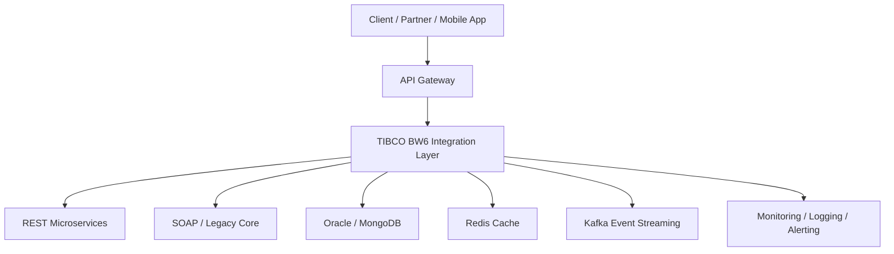

# Course Overview

**Course:** Enterprise Integration Engineer
**Stack:** TIBCO BW6, API Gateway, REST/SOAP, Kafka, Redis, Database, Java

---

## Why this course exists

If the goal is to become **fully equipped to do the job**, the course should not be framed around "interview review." This course is designed as an **Integration/API Engineer course for a banking environment**, focused on building stable integration systems using **TIBCO BW6 + API Gateway + REST/SOAP + Java + DB + Redis + Kafka**.

## End-of-course goal

By the end of this course you will be able to **design, develop, deploy, and operate a real system-integration flow**: client/partner calls an API → API Gateway authenticates/rate-limits → TIBCO BW6 handles orchestration → calls a SOAP/REST backend → writes to DB/cache → publishes a Kafka event → logging/monitoring/retry/error handling wraps the whole path.

## 16-Week Course Structure

| Phase   |      Duration | Goal                                              |
| ------- | -------------: | -------------------------------------------------- |
| Phase 1 |     Weeks 1-3 | Backend fundamentals, HTTP, REST, Java, SQL         |
| Phase 2 |     Weeks 4-6 | SOAP, XML, WSDL, legacy integration                 |
| Phase 3 |     Weeks 7-9 | TIBCO BW6 in depth                                  |
| Phase 4 |   Weeks 10-11 | API Gateway (Kong/WSO2)                             |
| Phase 5 |   Weeks 12-13 | Kafka, Redis, async integration                     |
| Phase 6 |   Weeks 14-15 | Reliability, security, monitoring, production       |
| Phase 7 |      Week 16 | Complete capstone project                           |

## Phase-to-module map

| Phase                                        | Modules                                                                              |
| --------------------------------------------- | ------------------------------------------------------------------------------------- |
| Phase 1 — Backend Foundations & Integration    | 01 Integration System Architecture · 02 HTTP/RESTful API/OpenAPI · 03 Java Core · 04 Database Fundamentals & Transactions |
| Phase 2 — SOAP, XML, WSDL & Legacy Integration | 05 XML, XSD, SOAP · 06 REST/SOAP Mapping Patterns                                    |
| Phase 3 — TIBCO BW6 In Depth                   | 07 TIBCO BW6 Foundation · 08 TIBCO Process Design · 09 TIBCO Error Handling & Reliability · 10 TIBCO Deployment & Environment |
| Phase 4 — API Gateway (Kong/WSO2)              | 11 API Gateway Foundation · 12 API Security                                          |
| Phase 5 — Kafka, Redis & Async Architecture    | 13 Kafka Event Streaming · 14 Redis Cache                                            |
| Phase 6 — Production Engineering               | 15 Security for Integration Systems · 16 Observability · 17 Reliability Patterns     |
| Phase 7 — Capstone Project                      | 18 Banking Transfer Integration Platform                                             |

Continue to `01 - Phase 1 - Backend Foundations and Integration/Module 01 - Integration System Architecture/README.md` to begin.

---

# Bài luyện tập

## Mục tiêu

## Đề bài

## Yêu cầu hoàn thành

- [ ] 
- [ ] 
- [ ] 

## Kết quả / lời giải

## Ghi chú
