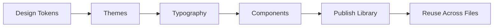
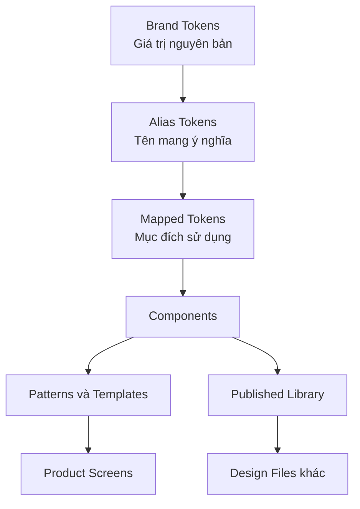
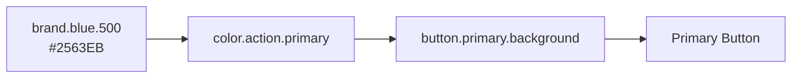
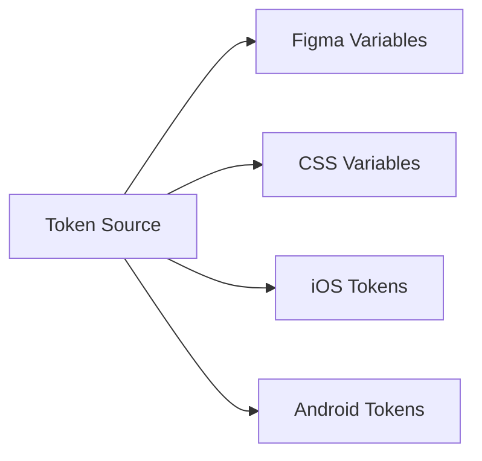

# 001 — Giới thiệu khóa học xây dựng Design System

## 1. Thông tin bài học

| Thuộc tính            | Nội dung                                                                           |
| --------------------- | ---------------------------------------------------------------------------------- |
| **Module**            | Introduction — Giới thiệu                                                          |
| **Tên bài học**       | An Introduction                                                                    |
| **Thời điểm bắt đầu** | `00:00` trong video đầy đủ                                                         |
| **Chủ đề chính**      | Xây dựng Design System có khả năng mở rộng theo hướng **tokens-first** trong Figma |

---

## 2. Tổng quan

Bài học giới thiệu kiến trúc tổng thể của một **Design System có khả năng mở rộng**, được xây dựng dựa trên design token.

Kiến trúc token gồm ba tầng chính:

1. **Brand Tokens** — các giá trị thiết kế nguyên bản.
2. **Alias Tokens** — các tên token mang ý nghĩa ngữ nghĩa.
3. **Mapped Tokens** — các token gắn với mục đích sử dụng cụ thể và có thể thay đổi theo theme.

Sau khi hệ thống token được hoàn thiện, các token sẽ được sử dụng để xây dựng component trong Figma. Cuối cùng, toàn bộ thư viện có thể được xuất bản để tái sử dụng trong nhiều file và nhiều sản phẩm khác nhau.

---

## 3. Ý tưởng chính

Mục tiêu của khóa học là hướng dẫn toàn bộ quá trình xây dựng một Design System, từ những giá trị thiết kế cơ bản nhất cho đến một thư viện component có thể xuất bản và sử dụng trong thực tế.

Quy trình tổng quát của khóa học:



Có thể hiểu quy trình này như sau:

```text
Design Tokens
    ↓
Themes
    ↓
Typography
    ↓
Components
    ↓
Publish Library
    ↓
Reuse in Products
```

---

## 4. Bối cảnh của khóa học

Người hướng dẫn là một chuyên gia xây dựng Design System chuyên nghiệp.

Khoảng một năm trước, tác giả đã thực hiện một chuỗi video gồm khoảng sáu hoặc bảy tập, trong đó xây dựng một Design System đơn giản từ đầu. Mặc dù hệ thống đó không chi tiết như những nội dung chuyên sâu trong UI Collective Academy, chuỗi video vẫn nhận được phản hồi rất tích cực.

Vì vậy, tác giả đã quay lại và biên soạn toàn bộ quá trình thành một video hoàn chỉnh.

Sau khi hoàn thành video, người học dự kiến sẽ:

* Có một bộ design token đầy đủ.
* Hiểu cách tổ chức biến trong Figma.
* Xây dựng được một Design System cơ bản.
* Tạo được các component có thể tái sử dụng.
* Biết cách xuất bản Design System dưới dạng thư viện.
* Biết cách sử dụng thư viện trong nhiều file thiết kế khác nhau.
* Có nền tảng để mở rộng Design System trong tương lai.

---

## 5. Lộ trình khóa học

Khóa học được xây dựng theo trình tự sau:

### Bước 1: Xây dựng Design Tokens

Xác định và tổ chức các giá trị thiết kế cơ bản, chẳng hạn như:

* Màu sắc.
* Khoảng cách.
* Kích thước.
* Border radius.
* Độ trong suốt.
* Typography.
* Shadow.
* Border.

### Bước 2: Xây dựng Themes

Sử dụng Figma Modes để tạo nhiều chế độ hiển thị, chẳng hạn như:

* Light theme.
* Dark theme.
* Brand theme.
* High-contrast theme.
* Theme dành cho từng sản phẩm.

### Bước 3: Thiết lập Typography

Xây dựng hệ thống kiểu chữ nhất quán:

* Font family.
* Font size.
* Font weight.
* Line height.
* Letter spacing.
* Text styles theo từng mục đích.

### Bước 4: Xây dựng Components

Sử dụng token để tạo các component như:

* Button.
* Input.
* Checkbox.
* Select.
* Card.
* Modal.
* Navigation.
* Form controls.

### Bước 5: Xuất bản thư viện

Đưa các variable, style và component vào một thư viện dùng chung để các nhà thiết kế có thể sử dụng trong nhiều file khác nhau.

---

## 6. Kiến trúc token ba tầng

### 6.1. Brand Tokens

Brand Tokens chứa các giá trị thiết kế nguyên bản của thương hiệu.

Ví dụ:

```text
brand.blue.500 = #2563EB
brand.gray.100 = #F3F4F6
brand.gray.900 = #111827
brand.spacing.4 = 16px
brand.radius.medium = 8px
```

Đây là tầng dữ liệu thấp nhất của hệ thống.

Brand Tokens thường không mô tả token được sử dụng ở đâu. Chúng chỉ cung cấp các giá trị thiết kế có sẵn.

Ví dụ:

```text
blue-500
gray-100
spacing-400
radius-medium
```

Tên gọi này thể hiện giá trị hoặc thang đo, nhưng chưa thể hiện mục đích sử dụng.

---

### 6.2. Alias Tokens

Alias Tokens tạo một lớp ngữ nghĩa phía trên Brand Tokens.

Thay vì sử dụng trực tiếp một màu cụ thể, hệ thống sử dụng tên thể hiện ý nghĩa của màu đó.

Ví dụ:

```text
color.primary = brand.blue.500
color.neutral.subtle = brand.gray.100
color.neutral.strong = brand.gray.900
```

Alias Tokens giúp tách biệt:

* Ý nghĩa thiết kế.
* Giá trị thương hiệu thực tế.

Ví dụ, component chỉ cần biết nó đang sử dụng `color.primary`, thay vì phải biết màu thực tế là `#2563EB`.

Nếu thương hiệu thay đổi màu chính, chỉ cần cập nhật Brand Token hoặc Alias Token tương ứng mà không phải sửa từng component.

---

### 6.3. Mapped Tokens

Mapped Tokens mô tả cách token được sử dụng trong giao diện.

Ví dụ:

```text
button.primary.background.default = color.primary
button.primary.text.default = color.text.on-primary
input.border.default = color.border.neutral
surface.page.background = color.background.default
```

Mapped Tokens có thể thay đổi theo:

* Theme.
* Mode.
* Component state.
* Context sử dụng.
* Loại sản phẩm.

Ví dụ:

```text
Light mode:
surface.page.background = brand.white

Dark mode:
surface.page.background = brand.gray.900
```

Component không cần biết theme hiện tại đang sử dụng màu gì. Component chỉ tham chiếu đến Mapped Token:

```text
surface.page.background
```

Figma Mode sẽ tự động xác định giá trị phù hợp.

---

## 7. Sơ đồ kiến trúc Design System



Ví dụ luồng ánh xạ một token màu:



Ý nghĩa của từng tầng:

```text
Brand
Giá trị này là gì?
        ↓
Alias
Giá trị này mang ý nghĩa gì?
        ↓
Mapped
Giá trị này được sử dụng ở đâu?
        ↓
Component
Giá trị này xuất hiện như thế nào trong giao diện?
```

---

## 8. Ví dụ thực tế

Giả sử hệ thống có một nút chính.

### Brand Token

```text
brand.blue.500 = #2563EB
```

### Alias Token

```text
color.action.primary = brand.blue.500
```

### Mapped Token

```text
button.primary.background.default = color.action.primary
```

### Component

```text
Primary Button
└── Background:
    button.primary.background.default
```

Khi màu thương hiệu thay đổi:

```text
brand.blue.500 = #7C3AED
```

Tất cả component đang sử dụng token liên quan sẽ được cập nhật đồng bộ mà không cần chỉnh sửa thủ công từng component.

---

## 9. Các công cụ cần sử dụng trong Figma

### 9.1. Figma Variables

Variables được sử dụng để lưu trữ và quản lý:

* Color tokens.
* Number tokens.
* String tokens.
* Boolean tokens.
* Spacing values.
* Radius values.
* Theme values.

---

### 9.2. Variable Collections

Các variable nên được chia thành collection theo kiến trúc:

```text
Brand Collection
Alias Collection
Mapped Collection
```

Mỗi collection có một trách nhiệm riêng.

| Collection | Trách nhiệm                               |
| ---------- | ----------------------------------------- |
| **Brand**  | Lưu các giá trị thiết kế nguyên bản       |
| **Alias**  | Định nghĩa ý nghĩa ngữ nghĩa              |
| **Mapped** | Ánh xạ token đến mục đích sử dụng thực tế |

---

### 9.3. Modes

Modes cho phép một variable có nhiều giá trị trong các ngữ cảnh khác nhau.

Ví dụ:

| Token                     | Light mode | Dark mode |
| ------------------------- | ---------- | --------- |
| `surface.page.background` | White      | Gray 900  |
| `text.primary`            | Gray 900   | White     |
| `border.default`          | Gray 300   | Gray 700  |

Modes đặc biệt hữu ích khi xây dựng:

* Light mode.
* Dark mode.
* Multi-brand system.
* High-contrast mode.
* Theme theo sản phẩm.

---

### 9.4. Component Properties

Component Properties giúp tạo component linh hoạt mà không cần tạo quá nhiều component riêng biệt.

Các loại property phổ biến:

* **Variant property:** thay đổi kiểu component.
* **Boolean property:** bật hoặc tắt một thành phần.
* **Text property:** thay đổi nội dung văn bản.
* **Instance swap property:** thay thế icon hoặc component con.

Ví dụ một Button có thể có:

```text
Variant:
- Primary
- Secondary
- Tertiary

Size:
- Small
- Medium
- Large

State:
- Default
- Hover
- Pressed
- Disabled

Properties:
- Show left icon
- Show right icon
- Button label
```

---

## 10. Tại sao nên sử dụng kiến trúc tokens-first?

### Khả năng mở rộng

Hệ thống có thể phát triển từ một sản phẩm nhỏ thành nhiều sản phẩm mà không cần tổ chức lại toàn bộ Design System.

### Tính nhất quán

Các component sử dụng cùng một nguồn giá trị nên giao diện sẽ nhất quán hơn.

### Hỗ trợ theme

Có thể chuyển đổi Light mode, Dark mode hoặc Brand theme thông qua Figma Modes.

### Dễ bảo trì

Khi giá trị thiết kế thay đổi, chỉ cần cập nhật token thay vì sửa từng component.

### Cải thiện sự cộng tác

Nhà thiết kế và lập trình viên có thể sử dụng cùng một hệ thống tên token.

Ví dụ:

```css
var(--button-primary-background)
```

có thể tương ứng với:

```text
button.primary.background
```

trong Figma.

### Giảm giá trị hard-code

Thay vì sử dụng trực tiếp:

```text
#2563EB
```

component sử dụng:

```text
button.primary.background
```

Điều này giúp hệ thống dễ hiểu và ít phụ thuộc vào giá trị cụ thể.

---

## 11. Cách áp dụng vào một Design System thực tế

### Giai đoạn 1: Kiểm kê thiết kế

Thu thập các giá trị đang được sử dụng trong sản phẩm:

* Tất cả màu sắc.
* Kích thước chữ.
* Khoảng cách.
* Border radius.
* Shadow.
* Component.
* Trạng thái component.

### Giai đoạn 2: Chuẩn hóa Brand Tokens

Loại bỏ các giá trị trùng lặp hoặc gần giống nhau.

Ví dụ:

```text
#2563EB
#2463EA
#2564EB
```

Có thể được chuẩn hóa thành một giá trị chính:

```text
brand.blue.500 = #2563EB
```

### Giai đoạn 3: Xây dựng Alias Tokens

Đặt tên token theo ý nghĩa:

```text
color.text.primary
color.text.secondary
color.background.default
color.border.default
color.action.primary
```

### Giai đoạn 4: Xây dựng Mapped Tokens

Tạo token dành riêng cho mục đích sử dụng:

```text
button.primary.background
button.primary.text
input.background
input.border
card.background
navigation.background
```

### Giai đoạn 5: Xây dựng component

Component chỉ sử dụng semantic token hoặc mapped token, hạn chế tham chiếu trực tiếp đến Brand Token.

### Giai đoạn 6: Kiểm thử theme

Kiểm tra component trong:

* Light mode.
* Dark mode.
* Trạng thái disabled.
* Trạng thái hover.
* Các ngữ cảnh nền khác nhau.

### Giai đoạn 7: Xuất bản thư viện

Xuất bản:

* Variables.
* Text styles.
* Effect styles.
* Components.
* Component sets.

### Giai đoạn 8: Quản trị thay đổi

Thiết lập quy trình:

```text
Đề xuất thay đổi
        ↓
Đánh giá tác động
        ↓
Cập nhật token hoặc component
        ↓
Kiểm thử
        ↓
Xuất bản phiên bản mới
        ↓
Thông báo cho nhóm sử dụng
```

---

## 12. Rủi ro và hạn chế

### 12.1. Tạo quá nhiều token

Một hệ thống có quá nhiều tầng hoặc quá nhiều token sẽ trở nên khó hiểu.

Ví dụ không cần thiết:

```text
button.primary.background.default.light.brand-a
```

Tên token nên đủ rõ ràng nhưng không quá dài hoặc quá chi tiết.

---

### 12.2. Đặt tên không nhất quán

Ví dụ:

```text
button-bg-primary
primaryButtonBackground
button.primary.fill
```

Ba kiểu đặt tên khác nhau trong cùng một hệ thống sẽ gây khó khăn cho việc tìm kiếm và bảo trì.

Nên chọn một quy ước thống nhất, chẳng hạn:

```text
component.variant.property.state
```

Ví dụ:

```text
button.primary.background.default
```

---

### 12.3. Component tham chiếu trực tiếp Brand Token

Nếu component sử dụng trực tiếp:

```text
brand.blue.500
```

thì việc đổi theme sẽ khó khăn hơn.

Nên sử dụng:

```text
button.primary.background
```

hoặc:

```text
color.action.primary
```

---

### 12.4. Xây dựng hệ thống quá phức tạp từ đầu

Một Design System nhỏ không nhất thiết phải có hàng nghìn token.

Nên bắt đầu với:

* Các token được sử dụng thường xuyên.
* Component quan trọng nhất.
* Một hoặc hai theme.
* Quy tắc đặt tên đơn giản.

Sau đó mở rộng dựa trên nhu cầu thực tế.

---

### 12.5. Thiếu tài liệu

Token và component có thể được xây dựng đúng về kỹ thuật nhưng vẫn khó sử dụng nếu không có tài liệu giải thích:

* Khi nào nên sử dụng.
* Khi nào không nên sử dụng.
* Cách kết hợp các component.
* Các trường hợp ngoại lệ.
* Quy tắc accessibility.

---

### 12.6. Không đồng bộ giữa thiết kế và code

Nếu token trong Figma và token trong code được quản lý riêng biệt, chúng có thể dần khác nhau.

Cần có một nguồn dữ liệu thống nhất hoặc quy trình đồng bộ rõ ràng:



---

## 13. Câu hỏi ôn tập

### Câu 1: Mục đích chính của bài “An Introduction” là gì?

Mục đích chính của bài học là giới thiệu cấu trúc và lộ trình của khóa học xây dựng Design System.

Bài học giúp người học hiểu rằng hệ thống sẽ được xây dựng theo hướng tokens-first:

```text
Brand Tokens
    ↓
Alias Tokens
    ↓
Mapped Tokens
    ↓
Components
    ↓
Published Library
```

---

### Câu 2: Có thể áp dụng kiến thức này vào một Design System thực tế như thế nào?

Có thể áp dụng bằng cách:

1. Kiểm kê các giá trị thiết kế hiện tại.
2. Chuẩn hóa chúng thành Brand Tokens.
3. Tạo Alias Tokens mang ý nghĩa ngữ nghĩa.
4. Tạo Mapped Tokens cho từng mục đích sử dụng.
5. Xây dựng component dựa trên token.
6. Sử dụng Modes để hỗ trợ theme.
7. Xuất bản thư viện để sử dụng trong nhiều file.
8. Thiết lập quy trình quản trị và cập nhật Design System.

---

### Câu 3: Những bước hoặc ý tưởng quan trọng được giới thiệu trong bài là gì?

Các ý tưởng quan trọng gồm:

* Xây dựng Design System theo hướng tokens-first.
* Sử dụng kiến trúc ba collection: Brand, Alias và Mapped.
* Sử dụng Figma Variables để lưu token.
* Sử dụng Modes để triển khai theme.
* Sử dụng Component Properties để tạo component linh hoạt.
* Xây dựng component trên nền tảng token.
* Xuất bản thư viện để tái sử dụng trên nhiều file.

---

### Câu 4: Rủi ro hoặc hạn chế nào cần lưu ý?

Những rủi ro chính gồm:

* Tạo quá nhiều token.
* Đặt tên token không nhất quán.
* Component phụ thuộc trực tiếp vào giá trị thương hiệu.
* Thiết kế kiến trúc quá phức tạp so với nhu cầu.
* Thiếu tài liệu sử dụng.
* Không kiểm thử đầy đủ các theme và trạng thái.
* Token trong Figma không đồng bộ với token trong code.
* Thay đổi token nền tảng có thể ảnh hưởng đến nhiều component cùng lúc.

---

## 14. Checklist thực hành

Sau bài học, hãy kiểm tra xem bạn đã hiểu các nội dung sau chưa:

* [ ] Giải thích được Design System theo hướng tokens-first.
* [ ] Phân biệt được Brand, Alias và Mapped Tokens.
* [ ] Hiểu vai trò của Figma Variables.
* [ ] Hiểu cách Modes hỗ trợ theme.
* [ ] Biết component nên tham chiếu đến loại token nào.
* [ ] Mô tả được lộ trình từ token đến thư viện được xuất bản.
* [ ] Nhận biết được các rủi ro khi thiết kế hệ thống token.
* [ ] Có thể phác thảo kiến trúc token cho một sản phẩm thực tế.

---

## 15. Tóm tắt bài học

Bài học giới thiệu một kiến trúc Design System có khả năng mở rộng, trong đó token là nền tảng của toàn bộ hệ thống.

Ba tầng token chính bao gồm:

```text
Brand Tokens
Giá trị thiết kế nguyên bản
        ↓
Alias Tokens
Ý nghĩa ngữ nghĩa
        ↓
Mapped Tokens
Mục đích sử dụng và theme
```

Các component được xây dựng phía trên hệ thống token này, sau đó được xuất bản thành thư viện để tái sử dụng trong nhiều file thiết kế.

Toàn bộ khóa học sẽ đi theo lộ trình:

```text
Tokens
→ Themes
→ Typography
→ Components
→ Publishing
```

Đây là bài học mở đầu, giúp người học hình dung toàn bộ quy trình xây dựng một Design System từ các giá trị thiết kế cơ bản đến một thư viện hoàn chỉnh, nhất quán, dễ bảo trì và có khả năng mở rộng.

---

# Bài luyện tập

## Mục tiêu


## Đề bài


## Yêu cầu hoàn thành

- [ ] 
- [ ] 
- [ ] 

## Kết quả / lời giải


## Ghi chú
