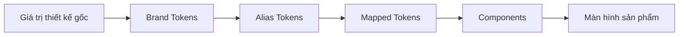
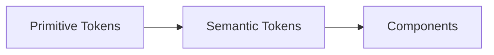
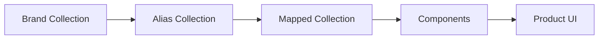
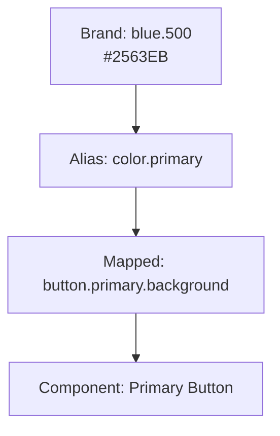
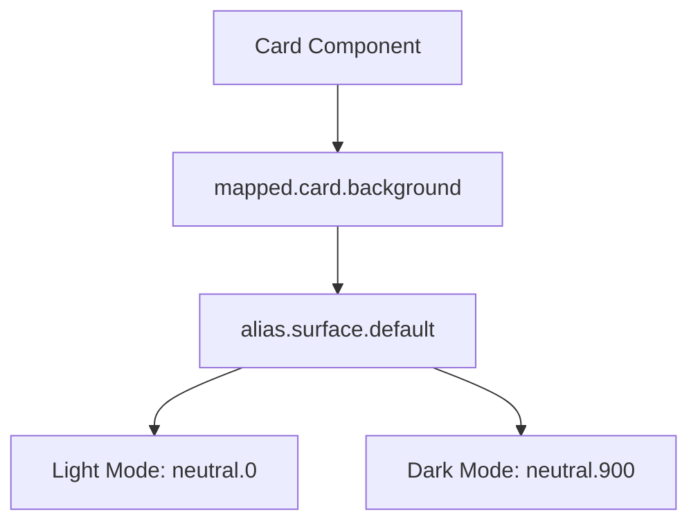
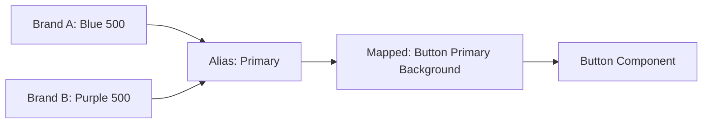

# 002 — Giới thiệu thiết lập Design Token

## Thông tin bài học

| Thuộc tính            | Nội dung                                                    |
| --------------------- | ----------------------------------------------------------- |
| **Module**            | Design Tokens & Variables Setup                             |
| **Tên tiếng Việt**    | Thiết lập Design Token và Figma Variables                   |
| **Thời điểm bắt đầu** | `00:49` trong video đầy đủ                                  |
| **Chủ đề chính**      | Xây dựng kiến trúc token làm nền tảng cho hệ thống thiết kế |
| **Cấp độ**            | Nhập môn                                                    |
| **Công cụ**           | Figma Variables, Variable Collections, Styles               |

---

## 1. Tổng quan bài học

Bài học giới thiệu **design token** như một nguồn dữ liệu trung tâm dùng để quản lý các giá trị thiết kế, chẳng hạn như:

* Màu sắc
* Kiểu chữ
* Khoảng cách
* Kích thước
* Bo góc
* Độ dày đường viền
* Hiệu ứng
* Các trạng thái giao diện

Thay vì nhập trực tiếp những giá trị như `#2563EB`, `16px` hoặc `8px` vào từng thành phần, chúng ta định nghĩa các giá trị này dưới dạng token và sử dụng chúng xuyên suốt hệ thống.

Design token giúp hệ thống thiết kế:

* Nhất quán hơn
* Dễ bảo trì hơn
* Dễ thay đổi chủ đề
* Dễ hỗ trợ nhiều thương hiệu
* Dễ đồng bộ giữa thiết kế và mã nguồn
* Giảm việc sử dụng các giá trị hard-code

Bài học cũng giới thiệu kiến trúc token ba tầng được sử dụng trong khóa học:

```text
Brand → Alias → Mapped → Components
```

Đây là nền tảng để xây dựng các component và xuất bản thư viện thiết kế cho nhiều tệp Figma khác nhau.

---

## 2. Mục tiêu học tập

Sau khi hoàn thành bài học, bạn có thể:

1. Giải thích design token là gì.
2. Hiểu vì sao token tốt hơn việc sử dụng giá trị hard-code.
3. Phân biệt Figma Variables với Figma Styles.
4. Hiểu kiến trúc token hai tầng và ba tầng.
5. Phân biệt vai trò của các lớp Brand, Alias và Mapped.
6. Xác định trường hợp nên sử dụng kiến trúc token ba tầng.
7. Chuẩn bị cấu trúc nền tảng cho một hệ thống thiết kế thực tế.

---

# 3. Design token là gì?

## 3.1. Định nghĩa

**Design token** là một tên đại diện cho một giá trị thiết kế có thể tái sử dụng.

Ví dụ, thay vì sử dụng trực tiếp mã màu:

```text
#2563EB
```

chúng ta có thể tạo token:

```text
color.brand.blue.500
```

Sau đó, thay vì sử dụng trực tiếp `color.brand.blue.500` trong component, chúng ta có thể ánh xạ nó thành một token có ý nghĩa sử dụng cụ thể hơn:

```text
color.action.primary.background
```

Nhờ đó, component không cần biết màu thực tế là màu xanh nào. Component chỉ cần biết rằng nó đang sử dụng màu nền của hành động chính.

---

## 3.2. Ví dụ

### Sử dụng giá trị hard-code

```css
.button-primary {
  background-color: #2563eb;
  color: #ffffff;
  padding: 12px 16px;
  border-radius: 8px;
}
```

Các giá trị như `#2563EB`, `#FFFFFF`, `12px`, `16px` và `8px` đều được nhập trực tiếp.

Nếu thương hiệu thay đổi màu chủ đạo hoặc hệ thống thay đổi quy tắc khoảng cách, chúng ta phải tìm và sửa nhiều vị trí.

### Sử dụng design token

```css
.button-primary {
  background-color: var(--color-action-primary-background);
  color: var(--color-action-primary-label);
  padding: var(--space-component-button-y)
    var(--space-component-button-x);
  border-radius: var(--radius-component-button);
}
```

Component chỉ tham chiếu tới các token theo mục đích sử dụng.

Khi token thay đổi, tất cả component đang sử dụng token đó sẽ được cập nhật đồng bộ.

---

# 4. Vì sao design token tốt hơn giá trị hard-code?

## 4.1. Vấn đề của giá trị hard-code

Giả sử một sản phẩm có 100 màn hình và 40 component. Màu xanh `#2563EB` được sử dụng tại hàng trăm vị trí.

Nếu thương hiệu đổi sang `#4F46E5`, nhóm thiết kế và phát triển phải:

1. Tìm tất cả vị trí sử dụng màu cũ.
2. Kiểm tra màu đó đang được sử dụng cho mục đích gì.
3. Thay đổi từng vị trí.
4. Kiểm thử lại toàn bộ giao diện.
5. Đảm bảo không bỏ sót trường hợp nào.

Việc này gây ra:

* Sai lệch giữa các màn hình
* Khó bảo trì
* Tốn thời gian
* Khó mở rộng
* Khó hỗ trợ dark mode
* Khó hỗ trợ nhiều thương hiệu

---

## 4.2. Lợi ích của design token

Khi sử dụng token, quá trình thay đổi trở thành:

```text
Cập nhật token gốc
        ↓
Các token liên quan được cập nhật
        ↓
Component được cập nhật
        ↓
Toàn bộ giao diện thay đổi đồng bộ
```

Design token tạo ra một **single source of truth**, nghĩa là một nguồn dữ liệu duy nhất được sử dụng thống nhất trong toàn bộ hệ thống.

---

# 5. Single Source of Truth

## 5.1. Khái niệm

**Single source of truth** là nơi chính thức lưu giữ giá trị thiết kế mà tất cả thành phần khác phải tham chiếu.

Ví dụ:

```text
color.brand.blue.500 = #2563EB
```

Thay vì định nghĩa `#2563EB` ở nhiều button, input, link và badge, hệ thống chỉ lưu giá trị đó một lần.

Các token khác sẽ tham chiếu đến token gốc:

```text
color.alias.primary
    → color.brand.blue.500

color.action.primary.background
    → color.alias.primary
```

Khi giá trị thương hiệu thay đổi:

```text
color.brand.blue.500 = #4F46E5
```

toàn bộ thành phần liên quan có thể thay đổi theo mà không phải chỉnh sửa từng component.

---

# 6. Luồng hoạt động của hệ thống token



Trong đó:

* **Brand Tokens** lưu các giá trị nền tảng.
* **Alias Tokens** tạo tên ngữ nghĩa cho các giá trị nền tảng.
* **Mapped Tokens** xác định giá trị theo mục đích sử dụng.
* **Components** sử dụng Mapped Tokens.
* Các màn hình được xây dựng từ component.

---

# 7. Figma Variables và Figma Styles

Figma cung cấp hai cơ chế phổ biến để quản lý giá trị thiết kế:

1. **Variables**
2. **Styles**

Hai khái niệm này có liên quan nhưng không hoàn toàn giống nhau.

---

## 7.1. Figma Variables

Variables dùng để lưu các giá trị có thể tái sử dụng và có thể thay đổi theo mode.

Các kiểu biến phổ biến gồm:

* Color
* Number
* String
* Boolean

Ví dụ:

```text
color/brand/blue/500 = #2563EB
spacing/4 = 16
radius/md = 8
```

Variables có thể:

* Tham chiếu đến variable khác
* Thay đổi giá trị theo mode
* Hỗ trợ light mode và dark mode
* Hỗ trợ nhiều thương hiệu
* Điều khiển thuộc tính component
* Được sử dụng trong prototype

---

## 7.2. Figma Styles

Styles thường được sử dụng cho các cấu hình thiết kế phức hợp, chẳng hạn như:

* Text Styles
* Effect Styles
* Grid Styles
* Paint Styles

Ví dụ, một Text Style có thể chứa đồng thời:

* Font family
* Font weight
* Font size
* Line height
* Letter spacing

```text
Text/Heading/H1
├── Font family: Inter
├── Font weight: Bold
├── Font size: 48
├── Line height: 56
└── Letter spacing: -1%
```

---

## 7.3. So sánh Variables và Styles

| Tiêu chí                      | Variables                     | Styles                    |
| ----------------------------- | ----------------------------- | ------------------------- |
| Lưu giá trị đơn lẻ            | Rất phù hợp                   | Không phải mục đích chính |
| Tham chiếu lẫn nhau           | Có                            | Hạn chế                   |
| Hỗ trợ mode                   | Có                            | Không linh hoạt bằng      |
| Light/Dark theme              | Rất phù hợp                   | Khó quản lý hơn           |
| Multi-brand                   | Phù hợp                       | Hạn chế                   |
| Typography hoàn chỉnh         | Chưa thay thế hoàn toàn style | Phù hợp                   |
| Shadow phức hợp               | Hạn chế                       | Phù hợp                   |
| Điều khiển component property | Có                            | Không                     |
| Dùng trong prototype          | Có                            | Hạn chế                   |

Trong một hệ thống thiết kế thực tế, Variables và Styles thường được sử dụng kết hợp thay vì loại trừ nhau.

---

# 8. Hai cách tổ chức kiến trúc token

Có hai mô hình phổ biến:

1. Kiến trúc hai tầng
2. Kiến trúc ba tầng

---

# 9. Kiến trúc token hai tầng

Kiến trúc hai tầng thường bao gồm:

```text
Primitive Tokens → Semantic Tokens
```

Một số hệ thống gọi hai tầng này là:

```text
Primitive → Semantic
```

Ví dụ:

```text
Primitive:
color.blue.500 = #2563EB

Semantic:
color.background.primary = color.blue.500
```

Component sử dụng semantic token:

```text
Button Background
    → color.background.primary
```

---

## 9.1. Sơ đồ kiến trúc hai tầng



---

## 9.2. Ưu điểm

* Đơn giản
* Dễ hiểu
* Thiết lập nhanh
* Phù hợp với dự án nhỏ
* Ít collection hơn
* Ít lớp tham chiếu hơn

---

## 9.3. Hạn chế

Kiến trúc hai tầng có thể gặp khó khăn khi:

* Hệ thống hỗ trợ nhiều thương hiệu.
* Một giá trị thương hiệu cần nhiều tên ngữ nghĩa.
* Cần thay đổi palette mà không ảnh hưởng trực tiếp tới component.
* Cần tái sử dụng một lớp semantic chung giữa nhiều sản phẩm.
* Cần quản lý theme phức tạp.
* Primitive token đang chứa cả giá trị thương hiệu lẫn ý nghĩa ngữ nghĩa.

Kiến trúc hai tầng không sai. Tuy nhiên, khi hệ thống phát triển lớn hơn, việc thiếu một lớp trung gian có thể làm giảm tính linh hoạt.

---

# 10. Kiến trúc token ba tầng

Kiến trúc được sử dụng trong khóa học gồm ba tầng:

```text
Brand → Alias → Mapped
```

Sau đó, các component sẽ sử dụng Mapped Tokens:

```text
Brand → Alias → Mapped → Components
```

---

## 10.1. Sơ đồ tổng thể



---

## 10.2. Ví dụ hoàn chỉnh

```text
Brand Token:
brand.blue.500 = #2563EB

Alias Token:
alias.color.primary = brand.blue.500

Mapped Token:
mapped.button.primary.background = alias.color.primary

Component:
Button / Primary
    → mapped.button.primary.background
```

---

# 11. Tầng Brand

## 11.1. Vai trò

Brand Collection chứa các giá trị thiết kế nguyên bản của thương hiệu.

Đây là các giá trị chưa mô tả mục đích sử dụng cụ thể trong giao diện.

Ví dụ:

```text
brand.color.blue.50
brand.color.blue.100
brand.color.blue.200
brand.color.blue.300
brand.color.blue.400
brand.color.blue.500
brand.color.blue.600
brand.color.blue.700
brand.color.blue.800
brand.color.blue.900
```

Các token khác có thể gồm:

```text
brand.color.red.500
brand.color.green.500
brand.color.neutral.900

brand.font.family.primary
brand.font.family.secondary

brand.spacing.100
brand.spacing.200
brand.spacing.300

brand.radius.small
brand.radius.medium
brand.radius.large
```

---

## 11.2. Đặc điểm

Brand Token trả lời câu hỏi:

> Hệ thống đang có những giá trị thiết kế nền tảng nào?

Nó không trả lời:

> Giá trị này được sử dụng cho button, input hay background?

---

## 11.3. Ví dụ Brand Collection

```text
Brand
├── Color
│   ├── Blue
│   │   ├── 50
│   │   ├── 100
│   │   ├── 500
│   │   └── 900
│   ├── Red
│   ├── Green
│   └── Neutral
├── Spacing
│   ├── 0
│   ├── 1
│   ├── 2
│   ├── 3
│   └── 4
├── Radius
│   ├── sm
│   ├── md
│   └── lg
└── Typography
    ├── Font family
    ├── Font size
    └── Font weight
```

---

# 12. Tầng Alias

## 12.1. Vai trò

Alias Collection tạo các tên ngữ nghĩa cho Brand Token.

Thay vì sử dụng:

```text
brand.color.blue.500
```

hệ thống có thể tạo alias:

```text
alias.color.primary
```

Token Alias không nhất thiết gắn với một component cụ thể. Nó mô tả vai trò tổng quát của giá trị trong hệ thống.

---

## 12.2. Ví dụ

```text
alias.color.primary
    → brand.color.blue.500

alias.color.secondary
    → brand.color.purple.500

alias.color.success
    → brand.color.green.500

alias.color.warning
    → brand.color.yellow.500

alias.color.danger
    → brand.color.red.500
```

---

## 12.3. Ý nghĩa

Alias Token trả lời câu hỏi:

> Giá trị thương hiệu này có ý nghĩa chung gì trong hệ thống?

Ví dụ:

```text
brand.color.red.500
```

chỉ cho biết đây là một giá trị màu đỏ.

Trong khi:

```text
alias.color.danger
```

cho biết màu này biểu thị lỗi, nguy hiểm hoặc hành động phá hủy.

---

# 13. Tầng Mapped

## 13.1. Vai trò

Mapped Collection ánh xạ Alias Token vào một mục đích sử dụng cụ thể.

Ví dụ:

```text
mapped.button.primary.background
    → alias.color.primary

mapped.button.primary.label
    → alias.color.on-primary

mapped.input.error.border
    → alias.color.danger

mapped.alert.success.background
    → alias.color.success-subtle
```

---

## 13.2. Ý nghĩa

Mapped Token trả lời câu hỏi:

> Token này được sử dụng ở đâu và cho thuộc tính nào?

Đây thường là lớp token mà component trực tiếp sử dụng.

---

## 13.3. Ví dụ cấu trúc

```text
Mapped
├── Background
│   ├── page
│   ├── surface
│   ├── elevated
│   └── inverse
├── Text
│   ├── primary
│   ├── secondary
│   ├── disabled
│   └── inverse
├── Border
│   ├── default
│   ├── strong
│   ├── focus
│   └── error
└── Component
    ├── Button
    ├── Input
    ├── Checkbox
    ├── Badge
    └── Alert
```

---

# 14. Quan hệ giữa ba tầng



Một thay đổi tại tầng Brand có thể lan truyền qua toàn bộ hệ thống:

```text
brand.blue.500
#2563EB → #4F46E5
        ↓
alias.color.primary
        ↓
mapped.button.primary.background
        ↓
Primary Button được cập nhật
```

---

# 15. Ví dụ với Light Mode và Dark Mode

Trong hệ thống hỗ trợ theme, một semantic token có thể nhận giá trị khác nhau theo từng mode.

```text
alias.surface.default
├── Light: brand.neutral.0
└── Dark: brand.neutral.900
```

Mapped Token tiếp tục tham chiếu đến alias:

```text
mapped.card.background
    → alias.surface.default
```

Component không cần biết đang ở light mode hay dark mode:

```text
Card
    → mapped.card.background
```

Figma sẽ tự lấy giá trị phù hợp với mode đang được kích hoạt.

---

## Sơ đồ theme



---

# 16. Ví dụ với nhiều thương hiệu

Giả sử cùng một hệ thống component được sử dụng cho hai thương hiệu:

* Brand A
* Brand B

Cả hai đều sử dụng token:

```text
alias.color.primary
```

Nhưng giá trị gốc khác nhau:

```text
Brand A:
alias.color.primary → brandA.blue.500

Brand B:
alias.color.primary → brandB.purple.500
```

Mapped Token không thay đổi:

```text
mapped.button.primary.background
    → alias.color.primary
```

Component cũng không thay đổi:

```text
Button Primary
    → mapped.button.primary.background
```

---

## Sơ đồ multi-brand



Lợi ích quan trọng là có thể giữ nguyên component và chỉ thay đổi mode hoặc bộ token thương hiệu.

---

# 17. So sánh kiến trúc hai tầng và ba tầng

| Tiêu chí                          | Hai tầng             | Ba tầng                |
| --------------------------------- | -------------------- | ---------------------- |
| Cấu trúc                          | Primitive → Semantic | Brand → Alias → Mapped |
| Mức độ đơn giản                   | Cao                  | Trung bình             |
| Thời gian thiết lập               | Nhanh                | Lâu hơn                |
| Dự án nhỏ                         | Rất phù hợp          | Có thể dư thừa         |
| Hệ thống lớn                      | Có thể gặp giới hạn  | Phù hợp                |
| Multi-brand                       | Khó hơn              | Linh hoạt              |
| Multi-theme                       | Có thể thực hiện     | Dễ tổ chức hơn         |
| Tái sử dụng semantic token        | Hạn chế hơn          | Tốt                    |
| Phân tách thương hiệu và mục đích | Chưa rõ ràng         | Rõ ràng                |
| Khả năng mở rộng                  | Trung bình           | Cao                    |
| Số lớp tham chiếu                 | Ít                   | Nhiều                  |
| Độ phức tạp quản trị              | Thấp                 | Cao hơn                |

---

# 18. Khi nào nên sử dụng kiến trúc hai tầng?

Kiến trúc hai tầng phù hợp khi:

* Dự án nhỏ.
* Chỉ có một thương hiệu.
* Không có dark mode phức tạp.
* Số lượng component còn ít.
* Nhóm thiết kế nhỏ.
* Sản phẩm cần phát triển nhanh.
* Hệ thống không cần chia sẻ cho nhiều sản phẩm.
* Khả năng thay đổi thương hiệu thấp.

Ví dụ:

```text
Primitive → Semantic → Component
```

có thể đủ cho một ứng dụng nhỏ hoặc một MVP.

---

# 19. Khi nào nên sử dụng kiến trúc ba tầng?

Kiến trúc ba tầng phù hợp khi:

* Có nhiều thương hiệu.
* Có nhiều theme.
* Hệ thống được sử dụng trên nhiều sản phẩm.
* Component cần tái sử dụng ở quy mô lớn.
* Có nhiều nhóm thiết kế và phát triển.
* Design token cần đồng bộ với mã nguồn.
* Cần thay đổi nhận diện thương hiệu mà không sửa component.
* Cần phân tách rõ giá trị gốc, ý nghĩa và mục đích sử dụng.
* Hệ thống dự kiến tiếp tục mở rộng trong thời gian dài.

---

# 20. Quy trình áp dụng vào một hệ thống thiết kế thực tế

## Bước 1: Kiểm kê các giá trị hiện có

Thu thập tất cả giá trị đang được sử dụng:

* Màu sắc
* Font chữ
* Font size
* Line height
* Spacing
* Radius
* Border
* Shadow
* Kích thước icon
* Breakpoint

Không nên tạo token chỉ dựa trên phỏng đoán. Cần kiểm tra giao diện hiện tại để xác định các giá trị thực sự đang được sử dụng.

---

## Bước 2: Chuẩn hóa thang giá trị

Ví dụ với spacing:

```text
0  = 0px
1  = 4px
2  = 8px
3  = 12px
4  = 16px
5  = 20px
6  = 24px
8  = 32px
10 = 40px
12 = 48px
```

Ví dụ với radius:

```text
none = 0px
sm   = 4px
md   = 8px
lg   = 12px
xl   = 16px
full = 9999px
```

---

## Bước 3: Tạo Brand Collection

Ví dụ:

```text
Brand
├── color/blue/50
├── color/blue/100
├── color/blue/500
├── color/blue/900
├── color/neutral/0
├── color/neutral/900
├── spacing/1
├── spacing/2
├── spacing/3
└── radius/md
```

---

## Bước 4: Tạo Alias Collection

Ví dụ:

```text
Alias
├── color/primary
├── color/secondary
├── color/success
├── color/warning
├── color/danger
├── color/surface
├── color/on-surface
└── color/on-primary
```

Các Alias Token tham chiếu tới Brand Token.

---

## Bước 5: Tạo Mapped Collection

Ví dụ:

```text
Mapped
├── background/page
├── background/surface
├── text/primary
├── text/secondary
├── border/default
├── border/focus
├── button/primary/background
├── button/primary/label
└── input/error/border
```

Mapped Token tham chiếu tới Alias Token.

---

## Bước 6: Áp dụng token vào component

Ví dụ với Primary Button:

```text
Button / Primary
├── Background
│   └── mapped.button.primary.background
├── Label
│   └── mapped.button.primary.label
├── Border radius
│   └── mapped.button.radius
├── Padding X
│   └── mapped.button.padding.horizontal
└── Padding Y
    └── mapped.button.padding.vertical
```

---

## Bước 7: Kiểm thử theme và trạng thái

Cần kiểm tra component trong các trường hợp:

* Light mode
* Dark mode
* Các thương hiệu khác nhau
* Default
* Hover
* Pressed
* Focus
* Disabled
* Error
* Loading

---

## Bước 8: Xuất bản thư viện

Sau khi token và component ổn định:

1. Kiểm tra cách đặt tên.
2. Kiểm tra các alias reference.
3. Xóa variable không còn sử dụng.
4. Viết tài liệu hướng dẫn.
5. Publish library.
6. Kiểm tra việc sử dụng từ một tệp Figma khác.

---

# 21. Quy tắc đặt tên token

Tên token nên thể hiện đúng cấp độ và mục đích của token.

## Brand Token

```text
brand.color.blue.500
brand.spacing.400
brand.radius.medium
```

## Alias Token

```text
alias.color.primary
alias.color.danger
alias.spacing.compact
alias.radius.control
```

## Mapped Token

```text
mapped.button.primary.background.default
mapped.button.primary.background.hover
mapped.input.border.focus
mapped.card.background.default
```

---

## Cấu trúc tên đề xuất

```text
[layer].[category].[component].[property].[variant].[state]
```

Ví dụ:

```text
mapped.button.background.primary.hover
mapped.input.border.default.focus
mapped.alert.icon.success.default
```

Không phải token nào cũng cần đủ tất cả phân đoạn. Tên token nên đủ rõ nhưng không nên dài một cách không cần thiết.

---

# 22. Những lỗi thường gặp

## 22.1. Component sử dụng trực tiếp Brand Token

Không nên:

```text
Button Background
    → brand.blue.500
```

Nên:

```text
Button Background
    → mapped.button.primary.background
```

Nếu component sử dụng trực tiếp Brand Token, mục đích sử dụng của giá trị sẽ không rõ ràng và việc thay đổi theme trở nên khó khăn hơn.

---

## 22.2. Đặt tên token theo giá trị

Không nên:

```text
blue-button
gray-text
white-background
```

Những tên này gắn token với màu hiện tại.

Nếu màu button chuyển từ xanh sang tím, tên `blue-button` sẽ không còn chính xác.

Nên đặt tên theo mục đích:

```text
button-primary-background
text-secondary
surface-default
```

---

## 22.3. Tạo quá nhiều token quá sớm

Không cần tạo token cho mọi giá trị có thể tưởng tượng.

Ví dụ, không nên tạo ngay hàng trăm token như:

```text
card.dashboard.header.icon.background.hover
```

khi chưa có trường hợp sử dụng rõ ràng.

Nên bắt đầu từ:

* Giá trị được lặp lại
* Giá trị có ý nghĩa hệ thống
* Giá trị cần hỗ trợ theme
* Giá trị có khả năng thay đổi
* Giá trị được chia sẻ giữa nhiều component

---

## 22.4. Trộn nhiều cấp token trong cùng collection

Ví dụ không nên:

```text
Colors
├── blue.500
├── primary
├── button.primary.background
└── input.error.border
```

Cấu trúc này trộn Brand, Alias và Mapped trong cùng một collection, khiến hệ thống khó hiểu và khó quản trị.

---

## 22.5. Tạo alias vòng lặp

Ví dụ:

```text
alias.primary → alias.brand
alias.brand → alias.primary
```

Đây là tham chiếu vòng lặp và không tạo ra giá trị cuối cùng rõ ràng.

Luồng tham chiếu phải đi theo một hướng:

```text
Brand → Alias → Mapped → Component
```

---

## 22.6. Đổi token nhưng không kiểm tra component

Một token có thể được sử dụng ở nhiều vị trí hơn dự kiến.

Trước khi thay đổi, cần kiểm tra:

* Token đang được sử dụng ở đâu?
* Có ảnh hưởng tới theme khác không?
* Độ tương phản có còn đạt yêu cầu không?
* Trạng thái hover và disabled có còn hợp lý không?

---

# 23. Rủi ro và giới hạn

## 23.1. Kiến trúc quá phức tạp

Kiến trúc ba tầng mang lại khả năng mở rộng nhưng cũng làm tăng:

* Số lượng variable
* Số lượng collection
* Số lớp tham chiếu
* Chi phí quản trị
* Thời gian đào tạo thành viên mới

Với một dự án nhỏ, kiến trúc ba tầng có thể là over-engineering.

---

## 23.2. Tên token không nhất quán

Nếu mỗi người đặt tên theo một cách khác nhau, hệ thống token sẽ nhanh chóng trở nên khó tìm kiếm.

Ví dụ:

```text
button-bg-primary
primary-button-background
button-primary-bg
background-button-primary
```

Cần có quy tắc đặt tên chính thức trước khi mở rộng hệ thống.

---

## 23.3. Alias quá sâu

Không nên tạo quá nhiều cấp tham chiếu:

```text
Token A → Token B → Token C → Token D → Token E
```

Khi chuỗi tham chiếu quá sâu, việc tìm nguyên nhân của một thay đổi trở nên khó khăn.

Kiến trúc nên đủ linh hoạt nhưng vẫn dễ truy vết.

---

## 23.4. Token không tự động tạo ra hệ thống tốt

Design token chỉ là công cụ.

Một hệ thống vẫn có thể kém chất lượng nếu:

* Palette không đạt độ tương phản.
* Spacing scale thiếu nhất quán.
* Component API khó sử dụng.
* Tên token không rõ ràng.
* Không có quy trình quản trị.
* Thiết kế và mã nguồn không đồng bộ.

---

## 23.5. Figma và mã nguồn có thể bị lệch nhau

Nếu token chỉ được cập nhật trong Figma nhưng không cập nhật trong code, sản phẩm thực tế sẽ khác thiết kế.

Cần có quy trình đồng bộ:

```text
Figma Variables
        ↓
Token Export
        ↓
JSON hoặc Token Package
        ↓
Web / iOS / Android / Flutter
```

---

# 24. Cấu trúc đề xuất cho module

```text
Design Tokens & Variables Setup
│
├── 001. Introduction
├── 002. Design Token Setup — Intro
├── 003. Brand Color Collection
├── 004. Color Scales
├── 005. Spacing Tokens
├── 006. Sizing Tokens
├── 007. Radius Tokens
├── 008. Typography Foundations
├── 009. Alias Collection
├── 010. Mapped Collection
├── 011. Light and Dark Modes
├── 012. Multi-brand Modes
└── 013. Applying Tokens to Components
```

Bài học hiện tại đóng vai trò giới thiệu kiến trúc trước khi đi vào việc tạo từng collection cụ thể.

---

# 25. Ví dụ hệ thống token hoàn chỉnh

```text
Brand Collection
├── color
│   ├── blue
│   │   ├── 50
│   │   ├── 100
│   │   ├── 500
│   │   └── 900
│   ├── red
│   ├── green
│   └── neutral
├── spacing
│   ├── 1
│   ├── 2
│   ├── 3
│   └── 4
└── radius
    ├── sm
    ├── md
    └── lg

Alias Collection
├── color
│   ├── primary
│   ├── secondary
│   ├── success
│   ├── warning
│   ├── danger
│   ├── surface
│   └── on-surface
├── spacing
│   ├── compact
│   ├── regular
│   └── spacious
└── radius
    ├── control
    ├── container
    └── pill

Mapped Collection
├── button
│   ├── primary
│   │   ├── background
│   │   │   ├── default
│   │   │   ├── hover
│   │   │   ├── pressed
│   │   │   └── disabled
│   │   └── label
│   └── secondary
├── input
│   ├── background
│   ├── border
│   ├── label
│   └── placeholder
└── card
    ├── background
    ├── border
    └── shadow
```

---

# 26. Câu hỏi ôn tập và câu trả lời

## Câu 1: Mục đích chính của bài “Design Token Setup — Intro” là gì?

Mục đích chính là giới thiệu design token như nguồn dữ liệu trung tâm của hệ thống thiết kế và trình bày kiến trúc collection sẽ được xây dựng trong Figma.

Bài học giúp người học hiểu vai trò của ba tầng:

```text
Brand → Alias → Mapped
```

trước khi bắt đầu tạo các token và component cụ thể.

---

## Câu 2: Làm thế nào để áp dụng nội dung này vào một hệ thống thiết kế thực tế?

Quy trình cơ bản gồm:

1. Kiểm kê các giá trị thiết kế hiện có.
2. Chuẩn hóa color scale, spacing scale và sizing scale.
3. Tạo Brand Collection chứa giá trị gốc.
4. Tạo Alias Collection chứa tên ngữ nghĩa.
5. Tạo Mapped Collection theo mục đích sử dụng.
6. Áp dụng Mapped Token vào component.
7. Kiểm thử theme, trạng thái và thương hiệu.
8. Xuất bản thư viện để tái sử dụng.

---

## Câu 3: Những bước và ý tưởng quan trọng được trình bày là gì?

Các ý tưởng quan trọng gồm:

* Design token thay thế giá trị hard-code.
* Token đóng vai trò single source of truth.
* Figma Variables phù hợp để quản lý giá trị và mode.
* Figma Styles vẫn cần thiết cho typography và effect phức hợp.
* Có hai kiến trúc phổ biến: hai tầng và ba tầng.
* Khóa học sử dụng kiến trúc Brand, Alias và Mapped.
* Component nên sử dụng token theo mục đích thay vì sử dụng trực tiếp giá trị gốc.
* Kiến trúc ba tầng đặc biệt hữu ích với multi-brand và multi-theme.

---

## Câu 4: Rủi ro hoặc giới hạn nào cần lưu ý?

Các rủi ro chính gồm:

* Thiết kế kiến trúc quá phức tạp cho một dự án nhỏ.
* Tạo quá nhiều token không cần thiết.
* Đặt tên không nhất quán.
* Sử dụng Brand Token trực tiếp trong component.
* Tạo chuỗi alias quá sâu.
* Không kiểm tra ảnh hưởng khi thay đổi token.
* Figma và mã nguồn không được đồng bộ.
* Cho rằng token có thể thay thế hoàn toàn quy trình quản trị hệ thống thiết kế.

---

# 27. Bài tập thực hành

## Bài tập 1: Tìm giá trị hard-code

Chọn một màn hình trong sản phẩm hiện tại và liệt kê:

* Tất cả màu sắc
* Các giá trị spacing
* Các giá trị radius
* Các kích thước chữ

Sau đó xác định những giá trị đang được lặp lại.

---

## Bài tập 2: Tạo Brand Collection

Tạo collection `Brand` trong Figma với các token:

```text
color/blue/500
color/blue/600
color/neutral/0
color/neutral/900
color/red/500

spacing/1
spacing/2
spacing/3
spacing/4

radius/sm
radius/md
radius/lg
```

---

## Bài tập 3: Tạo Alias Collection

Tạo collection `Alias` và ánh xạ:

```text
color/primary
    → color/blue/500

color/danger
    → color/red/500

color/surface
    → color/neutral/0

color/on-surface
    → color/neutral/900
```

---

## Bài tập 4: Tạo Mapped Collection

Tạo các token:

```text
button/primary/background
button/primary/label
input/border/default
input/border/error
card/background
```

Mỗi Mapped Token phải tham chiếu tới Alias Token phù hợp.

---

## Bài tập 5: Áp dụng vào component

Tạo một Primary Button và đảm bảo:

```text
Background
    → mapped.button.primary.background

Text
    → mapped.button.primary.label

Radius
    → mapped.button.radius

Horizontal padding
    → mapped.button.padding.horizontal

Vertical padding
    → mapped.button.padding.vertical
```

Sau đó thay đổi Brand Token để quan sát cách thay đổi được truyền tới component.

---

# 28. Checklist hoàn thành bài học

* [ ] Hiểu định nghĩa design token.
* [ ] Phân biệt token với giá trị hard-code.
* [ ] Hiểu khái niệm single source of truth.
* [ ] Phân biệt Figma Variables và Styles.
* [ ] Hiểu kiến trúc token hai tầng.
* [ ] Hiểu kiến trúc token ba tầng.
* [ ] Phân biệt Brand, Alias và Mapped Token.
* [ ] Biết component nên sử dụng cấp token nào.
* [ ] Hiểu lợi ích của kiến trúc ba tầng đối với multi-brand.
* [ ] Nhận biết được các rủi ro của việc thiết kế token quá phức tạp.

---

# 29. Tóm tắt

Design token là nền tảng giúp hệ thống thiết kế duy trì tính nhất quán và khả năng mở rộng. Thay vì sử dụng trực tiếp các giá trị màu sắc, khoảng cách và kích thước trong từng component, hệ thống định nghĩa chúng dưới dạng token có thể tái sử dụng.

Khóa học sử dụng kiến trúc ba tầng:

```text
Brand → Alias → Mapped → Components
```

Trong đó:

* **Brand** lưu các giá trị thiết kế nguyên bản.
* **Alias** gán ý nghĩa ngữ nghĩa cho các giá trị đó.
* **Mapped** ánh xạ token vào các mục đích sử dụng cụ thể.
* **Components** sử dụng Mapped Token để tránh phụ thuộc vào giá trị gốc.

Kiến trúc hai tầng vẫn là một lựa chọn hợp lệ và phù hợp với nhiều dự án nhỏ. Tuy nhiên, kiến trúc ba tầng cung cấp khả năng phân tách và mở rộng tốt hơn khi hệ thống cần hỗ trợ nhiều thương hiệu, nhiều theme hoặc nhiều sản phẩm.

Bài học này là bước khởi đầu cho mục tiêu lớn hơn của module: xây dựng lớp nền tảng của hệ thống token, bao gồm các giá trị Brand như color scale, font scale và spacing scale, sau đó tạo lớp Alias đầu tiên để gán ý nghĩa ngữ nghĩa cho những giá trị đó.

---

## Ghi nhớ nhanh

```text
Brand
“What values do we have?”
Hệ thống có những giá trị nào?

        ↓

Alias
“What do those values mean?”
Các giá trị đó có ý nghĩa gì?

        ↓

Mapped
“Where and how are they used?”
Chúng được sử dụng ở đâu và như thế nào?

        ↓

Component
“Apply the correct token.”
Áp dụng token phù hợp vào thành phần.
```

---

# Bài luyện tập

## Mục tiêu


## Đề bài


## Yêu cầu hoàn thành

- [ ] 
- [ ] 
- [ ] 

## Kết quả / lời giải


## Ghi chú
