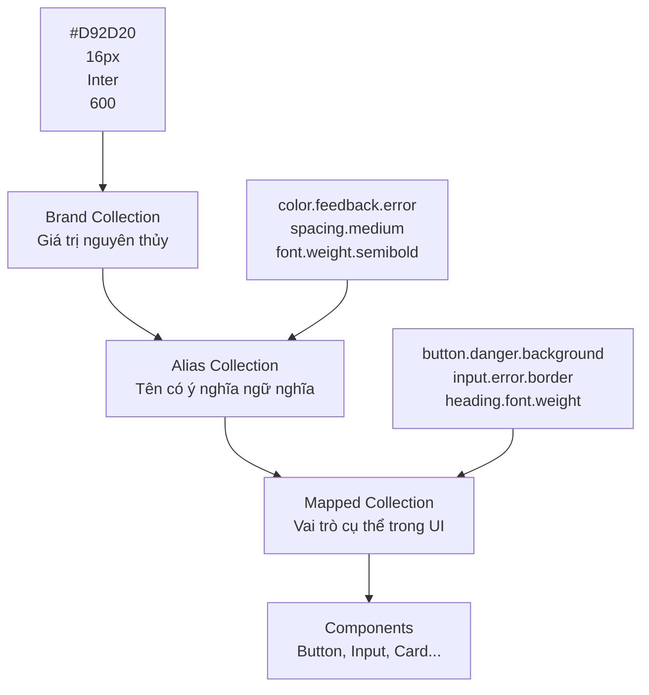
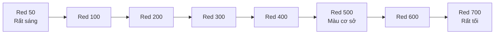
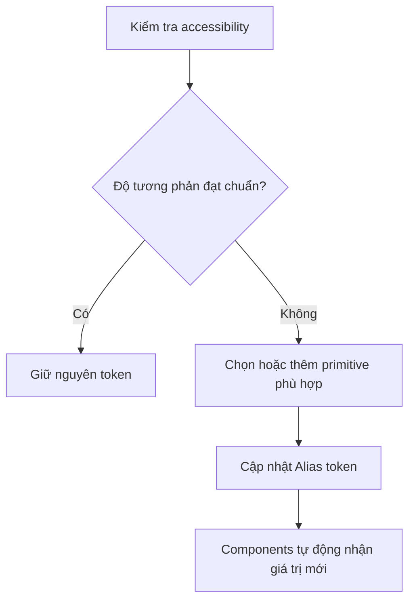
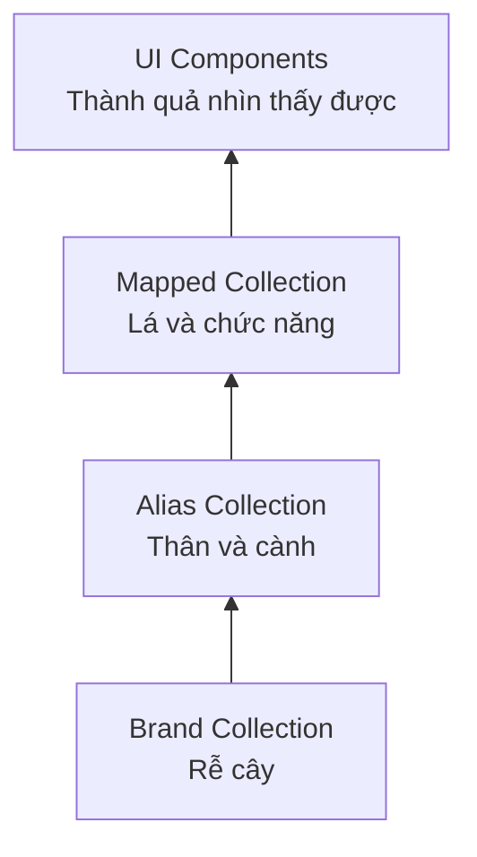
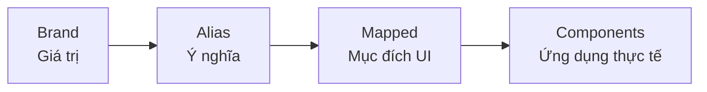

# 003 - Brand Collection

## 1. Thông tin bài học

| Thuộc tính            | Nội dung                                                   |
| --------------------- | ---------------------------------------------------------- |
| **Module**            | Design Tokens & Variables Setup                            |
| **Thời điểm bắt đầu** | 4:17                                                       |
| **Chủ đề**            | Xây dựng Brand Collection trong Figma                      |
| **Loại kiến thức**    | Design Tokens, Figma Variables, Design System Architecture |

---

## 2. Ý tưởng chính

**Brand Collection** là tầng nền tảng trong kiến trúc design token ba tầng.

Collection này lưu trữ các giá trị thiết kế ở dạng nguyên thủy nhất, chẳng hạn như:

* Mã màu HEX.
* Thang màu.
* Kích thước cơ sở.
* Khoảng cách.
* Font family.
* Font weight.
* Font style.
* Các giá trị số dùng chung.

Ở tầng Brand, token chỉ thể hiện **giá trị thực tế**, chưa thể hiện mục đích sử dụng trong giao diện.

Ví dụ:

```text
color/red/100 = #FEECEC
color/red/500 = #D92D20
color/red/700 = #912018
```

Các token trên chỉ mô tả những sắc độ khác nhau của màu đỏ. Chúng chưa được gán các vai trò như:

```text
error
danger
button-background
text-critical
```

Những vai trò mang ý nghĩa như trên sẽ được định nghĩa ở các tầng tiếp theo, đặc biệt là **Alias Collection** và **Mapped Collection**.

---

## 3. Kiến trúc design token ba tầng

Hệ thống trong khóa học sử dụng kiến trúc ba tầng:



### Ví dụ về luồng tham chiếu

```text
Brand
color/red/500 = #D92D20

        ↓

Alias
color/feedback/error = color/red/500

        ↓

Mapped
button/danger/background = color/feedback/error

        ↓

Component
Danger Button sử dụng button/danger/background
```

Nhờ cách tổ chức này, component không cần tham chiếu trực tiếp đến mã màu HEX.

---

## 4. Brand Collection là gì?

Brand Collection là nơi lưu trữ các **primitive token**, còn gọi là token nguyên thủy hoặc token cơ sở.

Các token ở tầng này trả lời những câu hỏi như:

* Màu này có giá trị HEX là gì?
* Kích thước này bằng bao nhiêu pixel?
* Font weight này bằng bao nhiêu?
* Font family của thương hiệu là gì?
* Thang spacing hiện có những giá trị nào?

Brand Collection không trả lời:

* Màu này dùng cho lỗi hay thành công?
* Màu này dùng cho chữ hay nền?
* Khoảng cách này dùng cho card hay button?
* Giá trị này dùng cho trạng thái hover hay disabled?

### Nguyên tắc cốt lõi

> Brand Collection lưu trữ giá trị, không lưu trữ vai trò.

---

## 5. Primitive token và semantic token

### 5.1. Primitive token

Primitive token lưu giá trị trực tiếp.

```text
color/blue/500 = #2970FF
spacing/16 = 16
font/weight/600 = 600
radius/8 = 8
```

Tên token thường mô tả:

* Loại dữ liệu.
* Nhóm giá trị.
* Thang hoặc cấp độ.
* Giá trị tương đối trong hệ thống.

### 5.2. Semantic token

Semantic token mô tả mục đích sử dụng.

```text
color/text/primary
color/background/brand
color/border/error
spacing/component/card-padding
```

Semantic token thường tham chiếu đến primitive token thay vì chứa giá trị trực tiếp.

### So sánh

| Tiêu chí               | Primitive token | Semantic token         |
| ---------------------- | --------------- | ---------------------- |
| Mục đích               | Lưu giá trị gốc | Mô tả vai trò          |
| Ví dụ                  | `color/red/500` | `color/feedback/error` |
| Chứa giá trị trực tiếp | Có              | Thường không           |
| Thay đổi theo theme    | Ít hơn          | Thường xuyên hơn       |
| Gắn với UI cụ thể      | Không           | Có thể có              |
| Collection phù hợp     | Brand           | Alias hoặc Mapped      |

---

## 6. Những dữ liệu nên đặt trong Brand Collection

## 6.1. Color primitives

Màu sắc nên được tổ chức thành các thang màu.

Ví dụ:

```text
color/red/50
color/red/100
color/red/200
color/red/300
color/red/400
color/red/500
color/red/600
color/red/700
```

Mỗi token chứa một giá trị HEX cụ thể:

```text
color/red/50  = #FFF5F5
color/red/100 = #FEECEC
color/red/500 = #D92D20
color/red/700 = #912018
```

Tại Brand Collection, không nên đặt tên như:

```text
color/error
color/danger
color/button-primary
```

Bởi vì các tên này đã gán cho màu một vai trò cụ thể.

---

## 6.2. Typography primitives

Brand Collection có thể lưu trữ các giá trị typography ít thay đổi như:

```text
font/family/primary
font/family/secondary
font/weight/light
font/weight/regular
font/weight/medium
font/weight/semibold
font/weight/bold
```

Ví dụ:

```text
font/family/primary = "Inter"
font/weight/regular = "Regular"
font/weight/medium = "Medium"
font/weight/semibold = "Semi Bold"
font/weight/bold = "Bold"
```

Trong Figma Variables, các giá trị như font family hoặc font style có thể được lưu bằng biến kiểu **String**.

### Trường hợp đa thương hiệu

Nếu hệ thống chỉ phục vụ một thương hiệu, font family có thể nằm trong Brand Collection.

Nếu hệ thống hỗ trợ nhiều thương hiệu, font family có thể cần được chuyển lên tầng Alias hoặc một collection có nhiều mode để mỗi thương hiệu sử dụng một font khác nhau.

Ví dụ:

```text
brand-mode-a → Inter
brand-mode-b → Roboto
brand-mode-c → Helvetica Neue
```

---

## 6.3. Number scale

Brand Collection cũng nên chứa một thang số dùng chung.

Ví dụ:

```text
number/0  = 0
number/2  = 2
number/4  = 4
number/8  = 8
number/12 = 12
number/16 = 16
number/24 = 24
number/32 = 32
number/40 = 40
number/48 = 48
```

Thang số này có thể trở thành nền tảng cho:

* Font size.
* Line height.
* Spacing.
* Padding.
* Gap.
* Border radius.
* Border width.
* Icon size.
* Component height.

Ví dụ:

```text
Brand:
number/16 = 16

Alias:
spacing/medium = number/16
font/size/body = number/16

Mapped:
card/padding = spacing/medium
body/text-size = font/size/body
```

Một giá trị cơ sở có thể được tái sử dụng trong nhiều ngữ cảnh khác nhau mà không cần lặp lại giá trị thủ công.

---

## 7. Quy ước đặt tên theo thang 100

Khóa học sử dụng cách đặt tên theo **thang 100** cho màu sắc.

Ví dụ:

```text
red/100
red/200
red/300
red/400
red/500
red/600
red/700
```

Thông thường:

* Số càng thấp, màu càng sáng.
* Số càng cao, màu càng tối.



### Vì sao không nên đặt liên tục 1, 2, 3, 4?

Cách đặt tên theo bước 100 tạo khoảng trống để chèn thêm giá trị sau này.

Ví dụ, hệ thống hiện có:

```text
red/100
red/200
red/300
```

Nếu cần một màu nằm giữa `red/200` và `red/300`, ta có thể thêm:

```text
red/250
```

Nếu cần một màu sáng hơn `red/100`, ta có thể thêm:

```text
red/50
```

Nhờ đó, hệ thống có thể mở rộng mà không cần đổi tên toàn bộ token hiện tại.

---

## 8. Khả năng mở rộng của thang màu

Giả sử một component sử dụng `red/100`, nhưng khi kiểm tra accessibility, màu này không tạo đủ độ tương phản.

Thay vì sửa trực tiếp hàng loạt component, nhóm thiết kế có thể:

1. Tạo thêm một sắc độ mới.
2. Đặt tên phù hợp trong thang màu.
3. Cập nhật Alias token tham chiếu đến sắc độ mới.
4. Tất cả component sử dụng Alias token sẽ được cập nhật theo.

Ví dụ:

```text
Trước:
color/feedback/error-subtle → color/red/100

Sau kiểm tra accessibility:
color/feedback/error-subtle → color/red/50
```

Component không cần thay đổi token đang sử dụng:

```text
alert/error/background → color/feedback/error-subtle
```

Đây là một lợi ích quan trọng của kiến trúc token nhiều tầng.

---

## 9. Mối quan hệ với accessibility

Brand Collection không tự đảm bảo khả năng truy cập. Nó chỉ cung cấp các giá trị để những tầng phía trên lựa chọn.

Khi kiểm tra độ tương phản theo tiêu chuẩn WCAG, nhóm thiết kế có thể phát hiện:

* Màu chữ quá nhạt.
* Màu nền và chữ không đủ tương phản.
* Border không đủ rõ.
* Trạng thái disabled khó nhận biết.
* Màu trạng thái chỉ khác nhau quá ít.

Kiến trúc token cho phép điều chỉnh tập trung:



Tuy nhiên, không nên tạo màu chỉ dựa trên cảm tính. Mỗi tổ hợp foreground và background vẫn cần được kiểm tra thực tế.

---

## 10. Cách tạo Brand Collection trong Figma

## Bước 1: Mở Variables

Trong Figma:

1. Mở panel **Local Variables**.
2. Chọn **Create collection**.
3. Đặt tên collection là:

```text
Brand
```

---

## Bước 2: Tạo nhóm màu

Có thể tổ chức token bằng dấu `/`:

```text
color/red/100
color/red/200
color/red/300
color/red/400
color/red/500
color/red/600
color/red/700
```

Figma sẽ tự động hiển thị chúng thành các nhóm phân cấp.

Ví dụ cấu trúc:

```text
Brand
└── color
    ├── red
    │   ├── 100
    │   ├── 200
    │   ├── 300
    │   └── 500
    ├── blue
    ├── green
    ├── gray
    ├── black
    └── white
```

---

## Bước 3: Nhập giá trị màu trực tiếp

Mỗi biến màu trong Brand Collection nên chứa giá trị trực tiếp:

```text
color/black = #000000
color/white = #FFFFFF
color/red/500 = #D92D20
```

Không nên alias sang một token khác ở chính tầng primitive nếu việc đó không có mục đích rõ ràng.

---

## Bước 4: Tạo thang số

Tạo các biến kiểu **Number**:

```text
number/0
number/2
number/4
number/8
number/12
number/16
number/24
number/32
number/40
number/48
```

Những giá trị này sẽ được Alias Collection tham chiếu để tạo ra:

```text
spacing/xs
spacing/sm
spacing/md
spacing/lg
radius/sm
radius/md
font/size/body
font/size/heading
```

---

## Bước 5: Tạo giá trị typography cơ sở

Tạo các biến kiểu **String** cho những thông tin phù hợp:

```text
font/family/primary = "Inter"
font/style/regular = "Regular"
font/style/medium = "Medium"
font/style/semibold = "Semi Bold"
font/style/bold = "Bold"
```

Cần lưu ý rằng khả năng áp dụng variable trực tiếp vào từng thuộc tính typography có thể phụ thuộc vào tính năng Figma đang hỗ trợ. Trong một số trường hợp, typography vẫn cần kết hợp với Text Styles.

---

## Bước 6: Kiểm tra quy tắc đặt tên

Đảm bảo token:

* Không chứa tên component.
* Không chứa tên trạng thái UI.
* Không chứa vai trò ngữ nghĩa.
* Có cấu trúc phân cấp rõ ràng.
* Có thể mở rộng trong tương lai.
* Không trùng giá trị hoặc trùng ý nghĩa một cách không cần thiết.

---

## 11. Ví dụ Brand Collection hoàn chỉnh

```text
Brand
├── color
│   ├── neutral
│   │   ├── 0
│   │   ├── 50
│   │   ├── 100
│   │   ├── 200
│   │   ├── 300
│   │   ├── 400
│   │   ├── 500
│   │   ├── 600
│   │   ├── 700
│   │   ├── 800
│   │   ├── 900
│   │   └── 1000
│   ├── red
│   │   ├── 50
│   │   ├── 100
│   │   ├── 200
│   │   ├── 300
│   │   ├── 400
│   │   ├── 500
│   │   ├── 600
│   │   └── 700
│   ├── blue
│   ├── green
│   └── yellow
│
├── number
│   ├── 0
│   ├── 2
│   ├── 4
│   ├── 8
│   ├── 12
│   ├── 16
│   ├── 20
│   ├── 24
│   ├── 32
│   ├── 40
│   └── 48
│
└── font
    ├── family
    │   ├── primary
    │   └── secondary
    └── style
        ├── regular
        ├── medium
        ├── semibold
        └── bold
```

---

## 12. Ví dụ áp dụng trong hệ thống thực tế

Giả sử một ứng dụng có màu thương hiệu chính là xanh dương.

### Brand Collection

```text
color/blue/50  = #EFF8FF
color/blue/100 = #D1E9FF
color/blue/500 = #2E90FA
color/blue/600 = #1570EF
color/blue/700 = #175CD3
```

### Alias Collection

```text
color/brand/subtle = color/blue/50
color/brand/default = color/blue/600
color/brand/strong = color/blue/700
```

### Mapped Collection

```text
button/primary/background/default = color/brand/default
button/primary/background/hover = color/brand/strong
badge/brand/background = color/brand/subtle
```

### Component

```text
Primary Button
├── Default → button/primary/background/default
└── Hover   → button/primary/background/hover
```

Nếu thương hiệu thay đổi màu xanh cơ sở, nhóm thiết kế chỉ cần cập nhật các giá trị hoặc liên kết token phù hợp, thay vì chỉnh sửa từng button riêng lẻ.

---

## 13. Phép ẩn dụ “rễ cây”

Brand Collection có thể được hình dung như rễ của một cái cây.



* **Brand Collection** cung cấp nguồn giá trị cơ bản.
* **Alias Collection** tổ chức các giá trị theo ý nghĩa.
* **Mapped Collection** gắn các ý nghĩa vào từng mục đích giao diện.
* **Components** là phần người dùng trực tiếp nhìn thấy và tương tác.

Nếu lớp Brand thiếu nhất quán hoặc tổ chức kém, các lớp phía trên sẽ khó mở rộng và bảo trì.

---

## 14. Những điều không nên làm

### Không gán vai trò vào primitive token

Không nên:

```text
color/error = #D92D20
color/button-primary = #1570EF
```

Nên:

```text
color/red/500 = #D92D20
color/blue/600 = #1570EF
```

Sau đó đặt vai trò trong Alias Collection:

```text
color/feedback/error = color/red/500
color/brand/default = color/blue/600
```

---

### Không sử dụng mã màu trực tiếp trong component

Không nên:

```text
Button background = #1570EF
```

Nên:

```text
Button background
→ button/primary/background
→ color/brand/default
→ color/blue/600
→ #1570EF
```

---

### Không tạo thang giá trị thiếu quy luật

Không nên:

```text
blue/light
blue/lighter
blue/a-bit-dark
blue/normal
blue/really-dark
```

Nên:

```text
blue/50
blue/100
blue/200
blue/300
blue/500
blue/700
```

Thang số dễ sắp xếp, mở rộng và chuyển đổi sang code hơn.

---

### Không tạo quá nhiều primitive không được sử dụng

Một bảng màu có hàng trăm token nhưng chỉ một phần nhỏ được sử dụng sẽ:

* Làm collection khó tìm kiếm.
* Tăng chi phí quản lý.
* Khiến designer lựa chọn thiếu nhất quán.
* Làm token export sang code trở nên cồng kềnh.

Chỉ nên tạo các thang giá trị có chủ đích và có khả năng được sử dụng thực tế.

---

## 15. Rủi ro và giới hạn

### 15.1. Brand token bị gắn với ngữ nghĩa

Nếu đặt tên primitive theo mục đích như `error`, `success` hoặc `button`, hệ thống sẽ khó tái sử dụng và khó đổi theme.

### 15.2. Thang màu không đủ linh hoạt

Nếu chỉ có:

```text
red/1
red/2
red/3
```

việc chèn thêm sắc độ nằm giữa các giá trị cũ sẽ khó khăn.

### 15.3. Dùng primitive trực tiếp trong component

Điều này làm mất lợi ích của kiến trúc nhiều tầng. Khi đổi thương hiệu hoặc theme, nhóm thiết kế sẽ phải cập nhật nhiều component thủ công.

### 15.4. Giá trị số không có quy luật

Nếu spacing được tạo tùy ý như `13`, `19`, `27`, giao diện sẽ thiếu nhịp điệu và khó duy trì tính nhất quán.

### 15.5. Một Brand Collection không đủ cho hệ thống đa thương hiệu

Trong hệ thống multi-brand, các giá trị như font, màu thương hiệu hoặc radius có thể thay đổi theo từng thương hiệu. Khi đó cần:

* Sử dụng modes.
* Tách collection.
* Hoặc đưa một số giá trị lên tầng Alias.

### 15.6. Token không thay thế việc kiểm thử

Có hệ thống token tốt không đồng nghĩa giao diện tự động đạt chuẩn accessibility. Vẫn cần kiểm tra:

* Contrast.
* Trạng thái focus.
* Cỡ chữ.
* Khoảng cách tương tác.
* Dark mode.
* High-contrast mode.
* Các trạng thái hover, pressed và disabled.

---

## 16. Checklist xây dựng Brand Collection

### Cấu trúc

* [ ] Đã tạo collection tên `Brand`.
* [ ] Token được tổ chức theo nhóm rõ ràng.
* [ ] Tên token sử dụng cùng một quy tắc.
* [ ] Không chứa tên component.
* [ ] Không chứa vai trò ngữ nghĩa.

### Màu sắc

* [ ] Mỗi màu có thang sáng đến tối.
* [ ] Số lớn hơn tương ứng với màu tối hơn.
* [ ] Có khoảng trống để chèn `50`, `250` hoặc `750`.
* [ ] Có neutral scale.
* [ ] Có giá trị trắng và đen khi cần.

### Typography

* [ ] Có font family cơ sở.
* [ ] Có font style hoặc font weight cần thiết.
* [ ] Đã cân nhắc trường hợp multi-brand.
* [ ] Không tạo biến typography không thể áp dụng thực tế.

### Number scale

* [ ] Có một thang số thống nhất.
* [ ] Các giá trị spacing tuân theo quy luật.
* [ ] Có thể tái sử dụng cho font size, radius và component size.
* [ ] Không có quá nhiều giá trị tùy ý.

### Khả năng mở rộng

* [ ] Component không sử dụng primitive trực tiếp.
* [ ] Alias Collection sẽ tham chiếu đến Brand.
* [ ] Có thể thay đổi theme hoặc thương hiệu trong tương lai.
* [ ] Token có thể ánh xạ sang code dễ dàng.

---

## 17. Trả lời câu hỏi ôn tập

### Câu 1: Mục đích chính của Brand Collection là gì?

Brand Collection tạo ra lớp nền tảng cho hệ thống design token. Nó lưu trữ các giá trị nguyên thủy như mã màu HEX, font family, font weight và thang số để các tầng Alias, Mapped và component tham chiếu.

Brand Collection giúp loại bỏ việc sử dụng các giá trị hard-code rải rác trong file thiết kế.

---

### Câu 2: Áp dụng Brand Collection vào một design system thực tế như thế nào?

Trong một design system thực tế, trước tiên cần xác định các thang giá trị cơ sở:

* Color scale.
* Neutral scale.
* Number scale.
* Font family.
* Font style.
* Border width.
* Radius scale nếu cần.

Sau đó tạo chúng thành Figma Variables trong Brand Collection.

Tiếp theo, Alias Collection sẽ tham chiếu đến Brand Collection để tạo các token mang ý nghĩa như:

```text
color/text/primary
color/background/brand
spacing/medium
font/weight/heading
```

Cuối cùng, Mapped Collection sẽ gắn các token đó vào từng component và trạng thái cụ thể.

---

### Câu 3: Các bước và ý tưởng chính trong bài học là gì?

Các bước chính gồm:

1. Hiểu Brand Collection là tầng primitive.
2. Tạo một variable collection mới trong Figma.
3. Xây dựng các thang màu.
4. Sử dụng quy tắc đặt tên theo thang 100.
5. Tạo thang số dùng chung.
6. Lưu các giá trị typography cơ sở phù hợp.
7. Không gán vai trò UI cho Brand token.
8. Chuẩn bị Brand Collection làm nguồn tham chiếu cho Alias Collection.

---

### Câu 4: Rủi ro hoặc giới hạn cần lưu ý là gì?

Rủi ro lớn nhất là sử dụng Brand token như semantic token hoặc sử dụng trực tiếp trong component.

Điều này tạo ra sự phụ thuộc giữa giá trị nguyên thủy và mục đích giao diện, khiến hệ thống:

* Khó đổi theme.
* Khó hỗ trợ nhiều thương hiệu.
* Khó thay đổi màu theo accessibility.
* Khó bảo trì.
* Khó đồng bộ với code.

Ngoài ra, việc tạo quá nhiều primitive token mà không có quy tắc cũng làm collection trở nên phức tạp và khó sử dụng.

---

## 18. Tóm tắt bài học

**Brand Collection** là lớp gốc của kiến trúc design token ba tầng.

Collection này lưu trữ mọi giá trị ở dạng thuần túy nhất:

```text
#797929
#000000
16
24
Inter
Semi Bold
```

Ở tầng Brand:

* Màu chưa có vai trò.
* Khoảng cách chưa gắn với component.
* Font chưa gắn với heading hoặc body.
* Giá trị số chưa gắn với một mục đích cụ thể.

Brand Collection chỉ cung cấp nền tảng để các tầng phía trên xây dựng ý nghĩa và hành vi.



Một Brand Collection được tổ chức tốt giúp design system:

* Nhất quán hơn.
* Dễ mở rộng hơn.
* Dễ hỗ trợ theme hơn.
* Dễ hỗ trợ nhiều thương hiệu hơn.
* Dễ kiểm tra accessibility hơn.
* Dễ đồng bộ giữa thiết kế và code hơn.

> Brand Collection không mô tả giá trị được sử dụng ở đâu. Nó chỉ định nghĩa những giá trị mà toàn bộ hệ thống có thể sử dụng.

---

# Bài luyện tập

## Mục tiêu


## Đề bài


## Yêu cầu hoàn thành

- [ ] 
- [ ] 
- [ ] 

## Kết quả / lời giải


## Ghi chú
