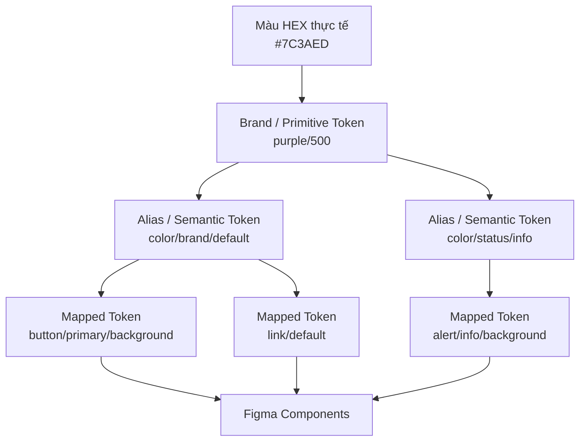
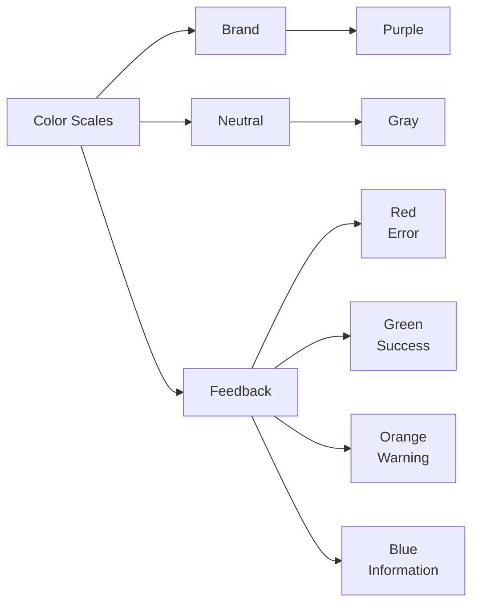
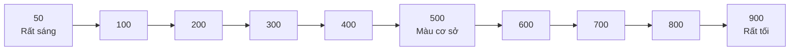
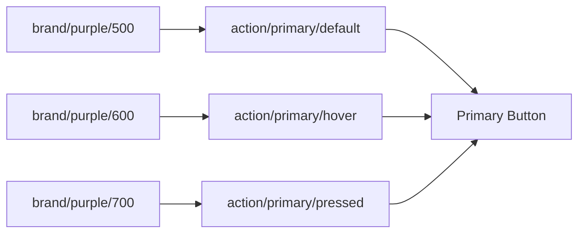
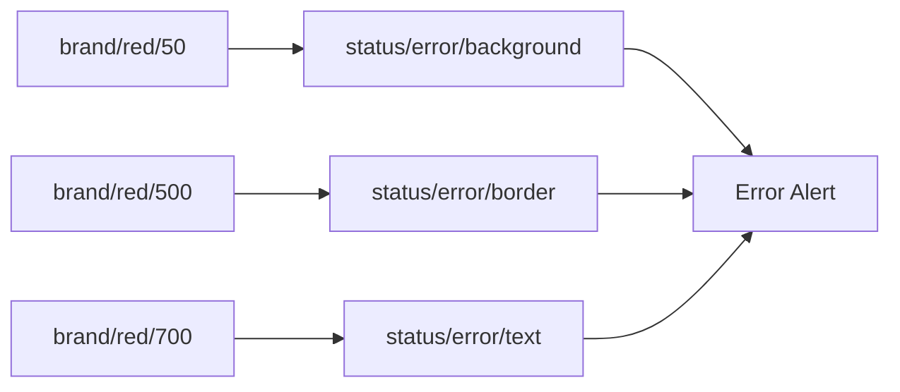
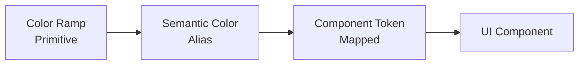

# 004 - Xây dựng thang màu cho Design System

## 1. Thông tin bài học

| Thuộc tính            | Nội dung                                         |
| --------------------- | ------------------------------------------------ |
| **Module**            | Design Tokens & Variables Setup                  |
| **Tên bài học**       | Color Scales for our Design System               |
| **Thời điểm bắt đầu** | 7:41 trong video đầy đủ                          |
| **Chủ đề chính**      | Xây dựng thang màu có hệ thống cho Design System |
| **Lớp token**         | Brand / Primitive Tokens                         |

---

## 2. Tổng quan

Bài học giải thích cách xây dựng các **thang màu có hệ thống** như `50–900` hoặc `100–900`, thay vì lựa chọn từng mã màu HEX riêng lẻ cho từng màn hình.

Một thang màu tốt thường bắt đầu từ một màu cốt lõi, sau đó được mở rộng thành nhiều mức độ sáng và tối khác nhau. Các mức màu này trở thành **primitive color tokens** trong Brand Collection và được sử dụng làm nền tảng cho các semantic token ở những lớp sau.

Ví dụ:

```text
Purple 50   → rất sáng
Purple 100
Purple 200
Purple 300
Purple 400
Purple 500  → màu thương hiệu cơ sở
Purple 600
Purple 700
Purple 800
Purple 900  → rất tối
```

Việc sử dụng một color ramp nhất quán giúp giao diện:

* Dễ mở rộng.
* Dễ quản lý.
* Có độ tương phản tốt hơn.
* Giảm tình trạng sử dụng màu tùy ý.
* Dễ hỗ trợ Light Mode và Dark Mode.
* Dễ kiểm tra accessibility.

---

## 3. Mục tiêu học tập

Sau bài học, bạn có thể:

1. Giải thích được color scale là gì.
2. Hiểu ý nghĩa của các mức màu như `50`, `100`, `500`, `900`.
3. Xác định những nhóm màu thực sự cần thiết cho Design System.
4. Tránh tạo quá nhiều màu không có trường hợp sử dụng.
5. Xây dựng color ramp để sử dụng trong Figma Variables.
6. Hiểu mối liên hệ giữa color scale, contrast và accessibility.

---

## 4. Color Scale là gì?

**Color Scale** là một tập hợp nhiều sắc độ của cùng một họ màu, được sắp xếp từ sáng đến tối.

Ví dụ, với màu tím thương hiệu:

| Token        | Vai trò trực quan        |
| ------------ | ------------------------ |
| `purple-50`  | Nền rất nhạt             |
| `purple-100` | Nền nhạt                 |
| `purple-200` | Viền hoặc trạng thái nhẹ |
| `purple-300` | Thành phần trang trí     |
| `purple-400` | Trạng thái hover nhẹ     |
| `purple-500` | Màu thương hiệu cơ sở    |
| `purple-600` | Hover hoặc pressed       |
| `purple-700` | Thành phần nhấn mạnh     |
| `purple-800` | Nền tối                  |
| `purple-900` | Màu tối nhất trong thang |

Các con số không phải là giá trị độ sáng tuyệt đối. Chúng chủ yếu là **quy ước đặt tên**, giúp đội ngũ hiểu được vị trí tương đối của từng màu trong thang.

---

## 5. Kiến trúc màu trong Design System

Color scale thường nằm ở lớp thấp nhất của hệ thống token.



Ví dụ:

```text
#7C3AED
   ↓
brand/purple/500
   ↓
color/action/primary
   ↓
button/primary/background
```

Thành phần Button không nên sử dụng trực tiếp `#7C3AED`. Nó nên sử dụng token theo mục đích như `button/primary/background`.

---

## 6. Các nhóm màu cốt lõi

Một Design System mới không cần hàng trăm họ màu. Hãy bắt đầu từ những nhóm màu có trường hợp sử dụng rõ ràng.

### 6.1. Brand Color

Đây là màu đại diện cho thương hiệu.

Ví dụ với UI Collective:

```text
Brand → Purple
```

Brand color có thể được sử dụng cho:

* Nút chính.
* Liên kết.
* Trạng thái được chọn.
* Tab đang hoạt động.
* Focus ring.
* Thành phần nhận diện thương hiệu.

Một thương hiệu có thể có nhiều màu nhận diện, nhưng không nên tạo thêm nếu chưa có trường hợp sử dụng cụ thể.

---

### 6.2. Neutral Color

Neutral color thường là các màu xám hoặc gần xám.

Chúng được sử dụng cho:

* Văn bản.
* Viền.
* Background.
* Surface.
* Divider.
* Disabled state.
* Icon không nhấn mạnh.

Ví dụ:

```text
Gray 50  → nền trang rất sáng
Gray 100 → nền section
Gray 300 → border
Gray 500 → văn bản phụ
Gray 700 → văn bản chính
Gray 900 → heading hoặc nền tối
```

Neutral scale thường là một trong những thang màu được sử dụng nhiều nhất trong toàn bộ hệ thống.

---

### 6.3. Error Color

Thông thường sử dụng màu đỏ.

Dùng cho:

* Trường nhập liệu không hợp lệ.
* Thông báo lỗi.
* Hành động nguy hiểm.
* Xóa dữ liệu.
* Trạng thái thất bại.

```text
Red → Error / Danger
```

---

### 6.4. Success Color

Thông thường sử dụng màu xanh lá.

Dùng cho:

* Thao tác thành công.
* Dữ liệu hợp lệ.
* Hoàn thành quy trình.
* Trạng thái hoạt động tốt.
* Kết quả tích cực.

```text
Green → Success
```

---

### 6.5. Warning Color

Thường sử dụng màu cam hoặc vàng.

Dùng cho:

* Cảnh báo.
* Rủi ro.
* Thông tin cần chú ý.
* Trạng thái chưa hoàn tất.
* Hành động có thể gây ảnh hưởng.

```text
Orange hoặc Yellow → Warning
```

Tuy nhiên, nếu sản phẩm chưa có trường hợp sử dụng màu vàng, bạn không cần bắt buộc phải thêm cả thang màu vàng.

---

### 6.6. Information Color

Thông thường sử dụng màu xanh dương.

Dùng cho:

* Thông báo thông tin.
* Hướng dẫn.
* Trạng thái trung lập.
* Banner giải thích.
* Tooltip hoặc callout.

```text
Blue → Information
```

---

## 7. Bộ màu khởi đầu được đề xuất

Đối với một Design System mới, có thể bắt đầu với:

```text
Brand
├── Purple

Neutral
├── Gray

Feedback
├── Red      → Error
├── Green    → Success
├── Orange   → Warning
└── Blue     → Information
```

Sơ đồ tổng quát:



Đây chỉ là bộ khởi đầu. Các màu mới chỉ nên được thêm khi có nhu cầu thực tế từ sản phẩm.

---

## 8. Lightness-based Color Ramp

Một color ramp thường thay đổi chủ yếu theo độ sáng.



Tuy nhiên, tạo color ramp không đơn giản là:

* Thêm màu trắng để tạo màu sáng.
* Thêm màu đen để tạo màu tối.

Cách này có thể tạo ra những màu:

* Bị xỉn.
* Thiếu tự nhiên.
* Không đồng đều.
* Thay đổi hue ngoài ý muốn.
* Không đạt contrast cần thiết.

Một color ramp tốt có thể cần điều chỉnh đồng thời:

* Lightness.
* Saturation.
* Hue.
* Chroma.
* Contrast với nền.
* Cảm nhận thị giác.

---

## 9. Quy ước đặt tên

Hai hệ thống phổ biến là:

### Cách 1: `50–900`

```text
purple-50
purple-100
purple-200
purple-300
purple-400
purple-500
purple-600
purple-700
purple-800
purple-900
```

Đây là cách đặt tên phổ biến trong các hệ thống như Tailwind CSS và nhiều thư viện Design System hiện đại.

### Cách 2: `100–900`

```text
purple-100
purple-200
purple-300
purple-400
purple-500
purple-600
purple-700
purple-800
purple-900
```

Không có quy ước nào bắt buộc. Điều quan trọng là:

* Nhất quán trong toàn bộ hệ thống.
* Có tài liệu giải thích.
* Không thay đổi quy tắc giữa các họ màu.
* Các mức tương ứng nên có cảm nhận độ sáng tương đối gần nhau.

---

## 10. Nên tạo bao nhiêu bước màu?

Không phải dự án nào cũng cần đủ 10 bước.

### Hệ thống đơn giản

```text
100 → rất sáng
300 → sáng
500 → cơ sở
700 → tối
900 → rất tối
```

Phù hợp với:

* MVP.
* Website nhỏ.
* Prototype.
* Sản phẩm có ít trạng thái.
* Đội ngũ mới bắt đầu xây dựng Design System.

### Hệ thống đầy đủ

```text
50, 100, 200, 300, 400,
500, 600, 700, 800, 900
```

Phù hợp với:

* Sản phẩm lớn.
* Nhiều component.
* Nhiều trạng thái tương tác.
* Light Mode và Dark Mode.
* Hệ thống cần nhiều mức background, border và text.

Nguyên tắc quan trọng:

> Chỉ tạo số lượng màu đủ để đáp ứng nhu cầu hiện tại, sau đó mở rộng khi xuất hiện trường hợp sử dụng mới.

---

## 11. Không nên tạo quá nhiều màu

Một lỗi phổ biến của người mới xây dựng Design System là tạo:

* Quá nhiều họ màu.
* Quá nhiều mức màu trong mỗi họ.
* Nhiều màu gần giống nhau.
* Các màu không có trường hợp sử dụng.
* Token chỉ được dùng một lần.

Ví dụ không nên:

```text
20 họ màu
×
10 mức mỗi họ
=
200 primitive color tokens
```

Một hệ thống như vậy có thể tạo cảm giác đầy đủ, nhưng thực tế lại gây ra:

* Khó lựa chọn.
* Khó bảo trì.
* Tăng khả năng sử dụng sai.
* Không thống nhất giữa các designer.
* Khó kiểm tra accessibility.
* Khó đổi thương hiệu.
* Tăng chi phí quản trị Design System.

### Nguyên tắc YAGNI

**YAGNI — You Aren't Gonna Need It**

Không tạo token chỉ vì “có thể sau này sẽ cần”. Hãy tạo khi đã có ít nhất một trường hợp sử dụng rõ ràng.

---

## 12. Áp dụng trong Figma

### Bước 1: Xác định các họ màu cần thiết

Ví dụ:

```text
Purple
Gray
Red
Green
Orange
Blue
```

### Bước 2: Xác định màu cơ sở

Ví dụ:

```text
Purple 500 = #7C3AED
```

Đây có thể là màu nhận diện thương hiệu đang được sử dụng trong sản phẩm.

### Bước 3: Tạo các sắc độ sáng và tối

Ví dụ minh họa:

```text
Purple 50
Purple 100
Purple 200
Purple 300
Purple 400
Purple 500
Purple 600
Purple 700
Purple 800
Purple 900
```

### Bước 4: Tạo Brand Collection trong Figma Variables

Cấu trúc đề xuất:

```text
Brand
├── color
│   ├── purple
│   │   ├── 50
│   │   ├── 100
│   │   ├── 200
│   │   ├── 300
│   │   ├── 400
│   │   ├── 500
│   │   ├── 600
│   │   ├── 700
│   │   ├── 800
│   │   └── 900
│   ├── gray
│   ├── red
│   ├── green
│   ├── orange
│   └── blue
```

### Bước 5: Nhập literal color values

Ví dụ:

```text
color/purple/500 = #7C3AED
color/red/500    = #EF4444
color/green/500  = #22C55E
```

### Bước 6: Không dùng Brand Token trực tiếp trong component

Thay vì:

```text
Button background
→ color/purple/500
```

Nên xây dựng:

```text
color/purple/500
→ color/action/primary/default
→ button/primary/background
```

---

## 13. Ví dụ luồng sử dụng màu

### Trường hợp Button chính



### Trường hợp thông báo lỗi



Nhờ kiến trúc này, component sử dụng màu theo **vai trò**, không phụ thuộc trực tiếp vào một mã màu cụ thể.

---

## 14. Contrast và Accessibility

Color scale không chỉ phục vụ thẩm mỹ. Nó ảnh hưởng trực tiếp đến khả năng đọc và sử dụng giao diện.

Các cặp màu cần được kiểm tra bao gồm:

* Text trên background.
* Icon trên background.
* Button label trên button background.
* Border với surface xung quanh.
* Focus indicator với nền.
* Link với nội dung thông thường.
* Trạng thái disabled.
* Error message và input background.

Ví dụ:

```text
Text trắng + Purple 300
→ Có thể không đủ tương phản

Text trắng + Purple 700
→ Thường có khả năng đạt tương phản tốt hơn
```

Tuy nhiên, không nên kết luận chỉ bằng mắt. Cần sử dụng công cụ đo contrast.

### Những điểm cần lưu ý

1. Màu đẹp chưa chắc dễ đọc.
2. Màu cùng số `500` ở hai họ màu chưa chắc có cùng độ sáng cảm nhận.
3. Màu trạng thái không nên chỉ truyền đạt ý nghĩa bằng màu.
4. Error nên có thêm icon hoặc nội dung văn bản.
5. Focus state phải đủ rõ với nhiều loại background.
6. Dark Mode có thể cần cách ánh xạ token khác Light Mode.

---

## 15. Màu trạng thái không nên phụ thuộc hoàn toàn vào màu sắc

Không nên chỉ dùng:

```text
Đỏ = lỗi
Xanh = thành công
```

Người dùng có hạn chế về nhận biết màu có thể không phân biệt được trạng thái.

Nên kết hợp:

```text
Màu sắc
+
Icon
+
Tiêu đề
+
Nội dung mô tả
```

Ví dụ:

```text
❌ Email không hợp lệ
Vui lòng nhập địa chỉ email theo định dạng name@example.com.
```

Thay vì chỉ đổi border của input thành màu đỏ.

---

## 16. Checklist xây dựng Color Scale

### Xác định nhu cầu

* [ ] Đã xác định màu thương hiệu chính.
* [ ] Đã xác định neutral color.
* [ ] Đã xác định các màu feedback cần thiết.
* [ ] Mỗi họ màu đều có trường hợp sử dụng.
* [ ] Không thêm màu chỉ để làm hệ thống trông đầy đủ.

### Xây dựng thang màu

* [ ] Các mức màu đi từ sáng đến tối rõ ràng.
* [ ] Màu cơ sở được xác định.
* [ ] Hue không thay đổi bất thường.
* [ ] Saturation được điều chỉnh hợp lý.
* [ ] Khoảng cách giữa các bước đủ rõ.
* [ ] Không có hai mức màu gần như giống nhau.

### Accessibility

* [ ] Đã kiểm tra text trên background.
* [ ] Đã kiểm tra button label.
* [ ] Đã kiểm tra trạng thái hover và pressed.
* [ ] Đã kiểm tra focus indicator.
* [ ] Không truyền đạt trạng thái chỉ bằng màu.
* [ ] Đã kiểm tra trên Light Mode và Dark Mode nếu có.

### Quản trị token

* [ ] Tên token nhất quán.
* [ ] Literal HEX chỉ nằm trong Brand Collection.
* [ ] Component không sử dụng mã HEX trực tiếp.
* [ ] Semantic token tham chiếu primitive token.
* [ ] Có tài liệu mô tả mục đích của từng thang màu.

---

## 17. Những sai lầm phổ biến

### 17.1. Chọn từng mã HEX riêng lẻ

```text
Card A → #F4F0FF
Card B → #EEE8FF
Banner → #F1ECFF
```

Các màu gần giống nhau nhưng không thuộc cùng một hệ thống.

**Cách khắc phục:** sử dụng một màu đã có trong color scale.

---

### 17.2. Tạo quá nhiều họ màu

Một Design System mới không cần mọi màu trong bánh xe màu.

**Cách khắc phục:** chỉ giữ các màu thương hiệu, neutral và feedback thực sự cần thiết.

---

### 17.3. Dùng trực tiếp màu primitive trong component

```text
button/background = purple/500
```

Điều này khiến component phụ thuộc trực tiếp vào thương hiệu.

**Cách khắc phục:**

```text
purple/500
→ action/primary/default
→ button/primary/background
```

---

### 17.4. Chỉ kiểm tra màu bằng mắt

Màu nhìn rõ trên màn hình của designer có thể không đạt contrast trên thiết bị khác.

**Cách khắc phục:** sử dụng công cụ đo contrast và kiểm thử trong hiệu, neutral và feedback thực sự cần thiết.

---

### 17.3. Dùng trực tiếp màu primitive trong component

```text
button/background = purple/500
```

Điều này khiến component phụ thuộc trực tiếp vào thương hiệu.

**Cách khắc phục:**

```text
purple/500
→ action/primary/default
→ button/primary/background
```

---

### 17.4. Chỉ kiểm tra màu bằng mắt

Màu nhìn rõ trên màn hình của designer có thể không đạt contrast trên thiết bị khác.

**Cách khắc bối cảnh giao diện thật.

---

### 17.5. Cho rằng cùng một mức số có cùng độ sáng

`yellow-500` thường sáng hơn nhiều so với `blue-500`.

Do đó:

```text
White text + Blue 500
```

có thể đọc được, nhưng:

```text
White text + Yellow 500
```

có thể không đủ tương phản.

Số token chỉ thể hiện vị trí trong thang màu, không đảm bảo độ tương phản giống nhau giữa các hue.

---

## 18. Trả lời câu hỏi ôn tập

### Câu 1: Mục đích chính của bài “Color Scales for our Design System” là gì?

Mục đích chính là hướng dẫn cách xây dựng các thang màu có hệ thống cho lớp Brand hoặc Primitive Tokens.

Thay vì chọn các mã HEX riêng lẻ, Design System sử dụng các họ màu được chia thành nhiều mức sáng–tối như `50–900`. Điều này tạo ra một nền tảng màu sắc nhất quán, có thể tái sử dụng và dễ mở rộng.

---

### Câu 2: Áp dụng nội dung này vào một Design System thực tế trong Figma như thế nào?

Quy trình áp dụng gồm:

1. Xác định màu thương hiệu.
2. Xác định neutral color.
3. Xác định màu feedback như error, success, warning và information.
4. Tạo color ramp cho từng họ màu.
5. Đưa các giá trị literal vào Brand Collection.
6. Tạo semantic token tham chiếu Brand Token.
7. Sử dụng semantic token trong component.
8. Kiểm tra contrast và accessibility.
9. Chỉ mở rộng thang màu khi xuất hiện nhu cầu thực tế.

Ví dụ:

```text
Brand/color/purple/500
→ Alias/color/action/primary
→ Mapped/button/primary/background
```

---

### Câu 3: Những bước hoặc ý tưởng quan trọng trong bài học là gì?

Các ý tưởng quan trọng gồm:

* Color scale là một dải màu từ sáng đến tối.
* Các mức `50–900` là quy ước đặt tên.
* Màu thương hiệu, neutral và feedback là những nhóm màu cốt lõi.
* Không cần tạo mọi màu có thể tưởng tượng.
* Một Design System mới nên bắt đầu nhỏ.
* Color ramp giúp giảm hard-coded values.
* Color scale là nền tảng cho semantic token.
* Mỗi màu nên có trường hợp sử dụng rõ ràng.
* Contrast phải được kiểm tra thay vì chỉ đánh giá bằng mắt.
* Hệ thống có thể được mở rộng dần theo nhu cầu sản phẩm.

---

### Câu 4: Rủi ro hoặc hạn chế cần lưu ý là gì?

Các rủi ro chính gồm:

#### Quá nhiều màu

Tạo quá nhiều họ màu và quá nhiều bước khiến hệ thống khó sử dụng và khó duy trì.

#### Color ramp không đồng đều

Các bước màu có thể quá gần nhau hoặc thay đổi hue không tự nhiên.

#### Không đạt accessibility

Một màu phù hợp về thương hiệu có thể không đủ tương phản khi sử dụng cho text hoặc button.

#### Sử dụng màu không theo ngữ nghĩa

Nếu component tham chiếu trực tiếp primitive color, việc đổi theme hoặc rebrand sẽ khó khăn hơn.

#### Phụ thuộc vào màu sắc

Trạng thái error, success hoặc warning không nên được truyền đạt chỉ bằng màu.

#### Thiết kế quá sớm cho nhu cầu tương lai

Tạo token chưa có use case sẽ làm tăng độ phức tạp mà chưa tạo ra giá trị thực tế.

---

## 19. Tóm tắt bài học

Color scale là nền tảng quan trọng của một Design System có khả năng mở rộng.

Thay vì chọn từng mã màu riêng lẻ, hệ thống nên xây dựng các thang màu nhất quán như:

```text
50 → 100 → 200 → 300 → 400
→ 500
→ 600 → 700 → 800 → 900
```

Khi mới bắt đầu, chỉ cần tập trung vào:

```text
Brand
Neutral
Error
Success
Warning
Information
```

Không cần tạo hàng trăm màu nếu sản phẩm chưa có nhu cầu. Mỗi họ màu và mỗi mức màu nên phục vụ một mục đích rõ ràng.

Luồng kiến trúc màu được khuyến nghị:



Nguyên tắc cốt lõi:

> Bắt đầu với một hệ thống màu nhỏ, có mục đích và nhất quán; kiểm tra accessibility; sau đó mở rộng dựa trên nhu cầu thực tế của sản phẩm.

---

# Bài luyện tập

## Mục tiêu


## Đề bài


## Yêu cầu hoàn thành

- [ ] 
- [ ] 
- [ ] 

## Kết quả / lời giải


## Ghi chú
