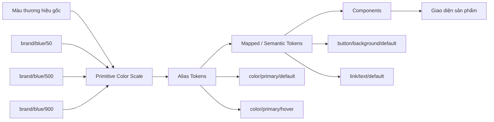
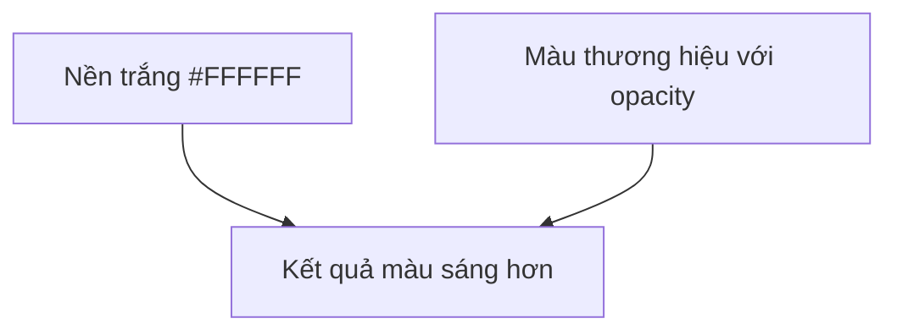
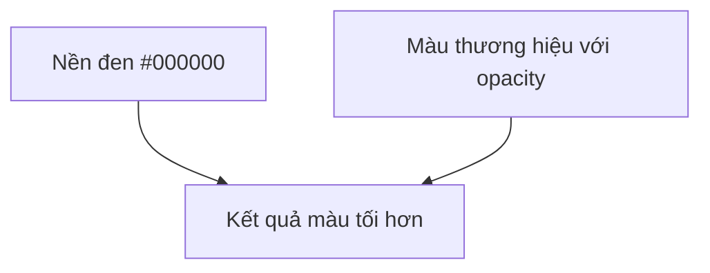
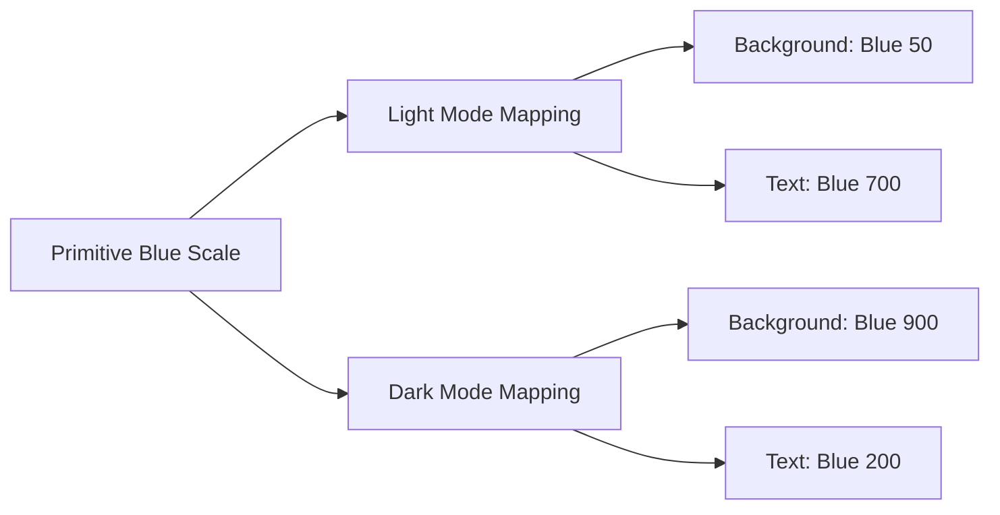
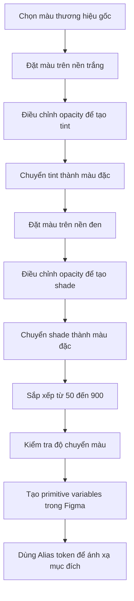

# 005 — Xây dựng thang màu trong Figma

## 1. Thông tin bài học

| Thuộc tính            | Nội dung                                  |
| --------------------- | ----------------------------------------- |
| **Module**            | Design Tokens & Variables Setup           |
| **Tên bài học**       | Building a Color Scale                    |
| **Thời điểm bắt đầu** | 09:52 trong video đầy đủ                  |
| **Loại nội dung**     | Thực hành xây dựng primitive color tokens |
| **Công cụ chính**     | Figma Variables, màu nền, opacity         |

---

## 2. Ý tưởng chính

Bài học hướng dẫn cách xây dựng thủ công một **thang màu hoàn chỉnh** từ một màu thương hiệu gốc trong Figma.

Từ một màu cơ sở, chúng ta tạo ra:

* Các sắc độ sáng hơn — **tints**
* Các sắc độ tối hơn — **shades**
* Các bước màu riêng biệt như `50`, `100`, `200`, `300` cho đến `900`
* Các biến màu primitive để những token semantic ở lớp sau có thể tham chiếu

Điểm quan trọng là các giá trị cuối cùng phải là **màu đặc**, không chứa opacity.

---

## 3. Thang màu là gì?

Thang màu là một tập hợp các màu có cùng nguồn gốc nhưng khác nhau về độ sáng và độ tối.

Ví dụ:

```text
Brand Blue 50   → rất sáng
Brand Blue 100
Brand Blue 200
Brand Blue 300
Brand Blue 400
Brand Blue 500  → màu thương hiệu gốc
Brand Blue 600
Brand Blue 700
Brand Blue 800
Brand Blue 900  → rất tối
```

Một thang màu thường được chia thành ba khu vực:

```text
Tint                         Base                         Shade
Sáng hơn                                                  Tối hơn

50 → 100 → 200 → 300 → 400 → 500 → 600 → 700 → 800 → 900
                           Màu gốc
```

---

## 4. Vai trò trong kiến trúc Design Token

Thang màu được tạo trong lớp **Brand hoặc Primitive Collection**.



Ví dụ:

```text
Brand primitive
brand/blue/500
        ↓
Alias token
color/primary/default
        ↓
Mapped token
button/primary/background
        ↓
Button component
```

Component không nên sử dụng trực tiếp mã màu như `#356AE6`. Thay vào đó, component tham chiếu semantic token, còn semantic token tiếp tục tham chiếu đến primitive scale.

---

# 5. Mục đích chính của bài học

Mục đích của **Building a Color Scale** là biến một màu thương hiệu đơn lẻ thành một hệ thống màu có cấu trúc và có thể tái sử dụng.

Thay vì chọn màu ngẫu nhiên cho từng thành phần giao diện, nhóm thiết kế có thể sử dụng cùng một thang màu cho:

* Background
* Text
* Border
* Icon
* Hover state
* Pressed state
* Selected state
* Focus state
* Disabled state
* Dark theme

Điều này giúp hệ thống thiết kế:

1. Nhất quán hơn
2. Dễ bảo trì hơn
3. Dễ mở rộng hơn
4. Dễ tạo theme hơn
5. Dễ kiểm soát độ tương phản hơn

---

# 6. Quy trình xây dựng thang màu

## Bước 1: Chọn màu thương hiệu gốc

Trước tiên, xác định màu đại diện chính cho thương hiệu.

Ví dụ:

```text
Base color: Brand Blue
Hex: #4F6BED
Scale position: 500
```

Thông thường, màu cơ sở được đặt ở vị trí `500` hoặc `600`.

```text
brand/blue/500 = #4F6BED
```

Đây là điểm bắt đầu để tạo các bước sáng hơn và tối hơn.

---

## Bước 2: Tạo các mẫu màu trong Figma

Tạo một dãy hình chữ nhật hoặc hình vuông để hiển thị từng bước màu.

Ví dụ:

```text
[ 50 ][ 100 ][ 200 ][ 300 ][ 400 ][ 500 ][ 600 ][ 700 ][ 800 ][ 900 ]
```

Mỗi ô đại diện cho một giá trị primitive riêng biệt.

Nên đặt các ô:

* Cùng kích thước
* Cùng khoảng cách
* Theo thứ tự từ sáng đến tối
* Có nhãn tên và mã màu rõ ràng

---

## Bước 3: Tạo các màu sáng hơn bằng nền trắng

Để tạo tint, đặt màu thương hiệu lên trên một nền trắng.



Ví dụ điều chỉnh opacity của màu gốc:

| Mẫu             | Opacity của màu gốc | Kết quả                 |
| --------------- | ------------------: | ----------------------- |
| Tint nhẹ        |                 80% | Gần với màu gốc         |
| Tint trung bình |                 60% | Sáng hơn                |
| Tint sáng       |                 40% | Nhạt hơn                |
| Tint rất sáng   |                 20% | Dùng cho background     |
| Tint cực sáng   |                 10% | Dùng cho subtle surface |

Minh họa:

```text
Màu gốc trên nền trắng

Opacity 80% → màu sáng nhẹ
Opacity 60% → màu sáng vừa
Opacity 40% → màu nhạt
Opacity 20% → màu rất nhạt
Opacity 10% → màu gần trắng
```

Các kết quả này có thể được dùng để tham khảo khi xây dựng các bước:

```text
brand/blue/400
brand/blue/300
brand/blue/200
brand/blue/100
brand/blue/50
```

---

## Bước 4: Chuyển màu opacity thành màu đặc

Các mẫu pha bằng opacity chỉ nên được dùng trong giai đoạn thử nghiệm.

Không nên lưu primitive color token dưới dạng:

```text
Blue 20% opacity
```

Bởi vì màu hiển thị của nó sẽ thay đổi tùy theo background.

Ví dụ:

```text
Blue 20% trên nền trắng ≠ Blue 20% trên nền xám
Blue 20% trên nền xám ≠ Blue 20% trên nền đen
```

Thay vào đó, cần lấy màu đã pha và chuyển nó thành mã màu đặc tương đương.

```text
Không nên:
brand/blue/100 = #4F6BED với opacity 20%

Nên:
brand/blue/100 = #DCE2FB với opacity 100%
```

Tất cả primitive color tokens nên có opacity `100%`.

---

## Bước 5: Tạo các màu tối hơn bằng nền đen

Để tạo shade, sử dụng cùng nguyên tắc nhưng thay nền trắng bằng nền đen.



Quy trình:

1. Tạo một hình nền màu đen
2. Đặt mẫu màu thương hiệu lên trên
3. Đưa lớp màu thương hiệu lên phía trước
4. Điều chỉnh opacity của lớp màu
5. Quan sát màu kết quả
6. Chuyển kết quả thành màu đặc

Ví dụ:

```text
Màu gốc trên nền đen

Opacity 80% → tối nhẹ
Opacity 60% → tối hơn
Opacity 40% → tối rõ
Opacity 20% → rất tối
```

Các kết quả có thể được dùng cho:

```text
brand/blue/600
brand/blue/700
brand/blue/800
brand/blue/900
```

---

## Bước 6: Sắp xếp lại toàn bộ thang màu

Sau khi tạo đủ các bước sáng và tối, sắp xếp chúng thành một dải liên tục.

```text
White
  ↓
Blue 50
  ↓
Blue 100
  ↓
Blue 200
  ↓
Blue 300
  ↓
Blue 400
  ↓
Blue 500 — màu gốc
  ↓
Blue 600
  ↓
Blue 700
  ↓
Blue 800
  ↓
Blue 900
  ↓
Black
```

Kiểm tra xem thang màu có thay đổi đều hay không:

* Không có bước nào đột ngột quá sáng
* Không có bước nào gần như giống nhau
* Màu gốc không bị mất bản sắc
* Các shade tối không chuyển thành màu xám bẩn
* Các tint sáng vẫn giữ được sắc độ của thương hiệu

---

## Bước 7: Tạo Figma Variables

Trong Brand Collection, tạo từng màu thành một biến primitive riêng.

Ví dụ:

```text
color/blue/50
color/blue/100
color/blue/200
color/blue/300
color/blue/400
color/blue/500
color/blue/600
color/blue/700
color/blue/800
color/blue/900
```

Hoặc đặt tên đầy đủ hơn:

```text
brand/color/blue/50
brand/color/blue/100
brand/color/blue/200
...
brand/color/blue/900
```

Ví dụ bảng variable:

| Variable         | Giá trị minh họa | Vai trò             |
| ---------------- | ---------------- | ------------------- |
| `brand/blue/50`  | `#F2F5FE`        | Background rất nhẹ  |
| `brand/blue/100` | `#E3E9FC`        | Subtle surface      |
| `brand/blue/200` | `#C7D1F9`        | Border nhẹ          |
| `brand/blue/300` | `#A4B4F5`        | Decorative          |
| `brand/blue/400` | `#7892F1`        | Hover nhẹ           |
| `brand/blue/500` | `#4F6BED`        | Màu thương hiệu gốc |
| `brand/blue/600` | `#4058CB`        | Hover hoặc active   |
| `brand/blue/700` | `#3448A7`        | Text hoặc icon đậm  |
| `brand/blue/800` | `#283983`        | Surface tối         |
| `brand/blue/900` | `#1C285F`        | Màu rất tối         |

> Các mã màu trong bảng chỉ mang tính minh họa, không phải kết quả bắt buộc của bài học.

---

# 7. Cách áp dụng vào Design System thực tế

## 7.1. Không dùng primitive trực tiếp trong component

Primitive tokens chỉ mô tả **giá trị màu**, không mô tả mục đích sử dụng.

```text
Primitive:
brand/blue/500
brand/blue/600
brand/blue/100
```

Ở lớp Alias, các giá trị này được gắn ý nghĩa:

```text
color/action/primary/default → brand/blue/500
color/action/primary/hover   → brand/blue/600
color/action/primary/subtle  → brand/blue/100
```

Sau đó component sử dụng mapped tokens:

```text
button/primary/background/default
    → color/action/primary/default
    → brand/blue/500
```

---

## 7.2. Ví dụ với Button

```text
Button mặc định:
Background → brand/blue/500

Button hover:
Background → brand/blue/600

Button pressed:
Background → brand/blue/700

Button focus:
Focus ring → brand/blue/300

Button disabled:
Background → neutral/200
```

Kiến trúc phù hợp hơn:

```text
brand/blue/500
        ↓
color/action/primary/default
        ↓
button/primary/background/default
```

---

## 7.3. Ví dụ với Alert

```text
Success:
50–100  → background
300–400 → border
600–700 → icon
800–900 → text

Warning:
50–100  → background
300–400 → border
600–700 → icon
800–900 → text

Error:
50–100  → background
300–400 → border
600–700 → icon
800–900 → text
```

Nhờ có scale, tất cả trạng thái đều có nhiều mức màu để lựa chọn mà không phải tạo màu mới tùy tiện.

---

## 7.4. Ví dụ với Light Mode và Dark Mode

Cùng một primitive scale có thể được ánh xạ khác nhau theo theme.

| Semantic token                  | Light Mode | Dark Mode  |
| ------------------------------- | ---------- | ---------- |
| `color/background/brand/subtle` | `blue/50`  | `blue/900` |
| `color/text/brand`              | `blue/700` | `blue/200` |
| `color/border/brand`            | `blue/300` | `blue/700` |
| `color/action/primary`          | `blue/500` | `blue/400` |



---

# 8. Vì sao tác giả xây dựng thang màu thủ công?

Tác giả cho biết có nhiều công cụ tạo bảng màu tự động, nhưng vẫn thích tự xây dựng vì muốn:

* Kiểm soát hoàn toàn từng bước màu
* Giữ màu đúng với bản sắc thương hiệu
* Điều chỉnh bằng mắt thay vì phụ thuộc hoàn toàn vào thuật toán
* Tránh các scale có bước nhảy không đều
* Tạo ra kết quả phù hợp với từng khách hàng

Các color palette generator có thể hữu ích để tạo điểm khởi đầu, nhưng không nên được coi là kết quả cuối cùng mà không kiểm tra lại.

---

# 9. Làm thế nào để giữ thang màu đồng đều?

## Kiểm tra bằng mắt

Đặt các màu cạnh nhau và quan sát sự thay đổi.

```text
Sai:
50 ── 100 ─────── 200 ─ 300 ───────── 400

Đúng hơn:
50 ─── 100 ─── 200 ─── 300 ─── 400
```

Mỗi bước nên tạo cảm giác thay đổi tương đối đều.

---

## Kiểm tra lightness

Hai màu có mã hex khác nhau nhưng có thể có độ sáng gần như giống nhau.

Do đó, nên kiểm tra thêm:

* Lightness
* Luminance
* Contrast ratio
* Khả năng phân biệt giữa các bước

---

## Kiểm tra trên nhiều kích thước

Một màu có thể trông rõ khi hiển thị trong ô lớn nhưng rất khó phân biệt khi dùng cho:

* Border 1 px
* Icon nhỏ
* Text nhỏ
* Focus ring mảnh
* Disabled state

Vì vậy cần thử màu trong component thực tế, không chỉ quan sát swatch.

---

## Kiểm tra trong ngữ cảnh

Thang màu nên được thử trên:

```text
Nền trắng
Nền xám sáng
Nền tối
Text
Border
Button
Icon
Alert
Data visualization
```

Một thang màu đẹp khi đứng riêng chưa chắc đã hoạt động tốt trong giao diện thật.

---

# 10. Rủi ro và hạn chế

## 10.1. Dùng opacity trực tiếp trong token

Đây là rủi ro quan trọng nhất được đề cập trong bài học.

Nếu token chứa opacity, kết quả sẽ phụ thuộc vào màu phía sau.

```text
Màu token + nền trắng → kết quả A
Màu token + nền xám   → kết quả B
Màu token + nền đen   → kết quả C
```

Vì vậy, primitive scale nên sử dụng mã màu đặc với opacity `100%`.

---

## 10.2. Chỉ trộn với trắng và đen

Việc pha màu gốc với trắng hoặc đen là phương pháp đơn giản, nhưng không phải lúc nào cũng tạo ra scale lý tưởng.

Các shade tối có thể:

* Bị đục
* Mất độ bão hòa
* Chuyển sang màu xám
* Không còn cảm giác thuộc cùng một thương hiệu

Trong một số trường hợp, cần điều chỉnh thêm:

* Hue
* Saturation
* Chroma
* Lightness

---

## 10.3. Chia opacity đều nhưng cảm nhận không đều

Các bước opacity như:

```text
20% → 40% → 60% → 80%
```

là đều về mặt số học nhưng chưa chắc đều về mặt thị giác.

Mắt người không cảm nhận độ sáng hoàn toàn tuyến tính. Vì vậy cần điều chỉnh từng bước bằng mắt hoặc sử dụng không gian màu có tính cảm nhận như OKLCH.

---

## 10.4. Không kiểm tra accessibility

Một thang màu đẹp không đồng nghĩa với một thang màu dễ tiếp cận.

Cần kiểm tra độ tương phản cho các cặp sử dụng thực tế:

```text
Text trên background
Icon trên surface
Button label trên button background
Border trên page background
Focus ring trên nhiều surface
```

Không nên mặc định rằng `500` luôn phù hợp với chữ trắng hoặc `100` luôn phù hợp với chữ tối.

---

## 10.5. Tạo quá nhiều bước không cần thiết

Một scale có quá nhiều bước sẽ làm tăng:

* Số lượng variables
* Khó khăn khi lựa chọn
* Nguy cơ sử dụng không nhất quán
* Chi phí bảo trì

Chỉ nên tạo số lượng bước phù hợp với nhu cầu của sản phẩm.

---

## 10.6. Tạo scale nhưng không định nghĩa cách sử dụng

Nếu đội thiết kế chỉ có:

```text
blue/50
blue/100
...
blue/900
```

nhưng không có semantic tokens, mỗi designer có thể sử dụng một bước khác nhau cho cùng một mục đích.

Ví dụ:

```text
Designer A dùng blue/500 cho button
Designer B dùng blue/600
Designer C tạo thêm một màu mới
```

Do đó, sau primitive scale cần tiếp tục xây dựng Alias và Mapped layers.

---

# 11. Các bước chính được minh họa trong bài



Tóm tắt:

1. Chọn màu base.
2. Dùng nền trắng để tạo các tint.
3. Dùng nền đen để tạo các shade.
4. Dùng opacity như công cụ thử nghiệm.
5. Chuyển màu kết quả thành mã màu đặc.
6. Sắp xếp thành các bước từ sáng đến tối.
7. Điều chỉnh để scale trông đồng đều.
8. Lưu từng bước thành Figma Variable.
9. Ánh xạ primitive sang semantic tokens.

---

# 12. Trả lời câu hỏi ôn tập

## Câu 1: Mục đích chính của Building a Color Scale là gì?

Mục đích chính là hướng dẫn cách biến một màu thương hiệu gốc thành một thang màu primitive đầy đủ gồm nhiều mức sáng và tối.

Thang màu này trở thành nền tảng cho các Alias và Mapped tokens, giúp hệ thống thiết kế có thể sử dụng màu nhất quán trong nhiều component, trạng thái và theme khác nhau.

---

## Câu 2: Áp dụng bài học này vào Design System Figma thực tế như thế nào?

Có thể áp dụng theo quy trình:

1. Chọn các màu thương hiệu cốt lõi.
2. Xây dựng scale `50–900` cho từng màu.
3. Lưu từng bước vào Brand Variable Collection.
4. Không dùng opacity trong giá trị primitive cuối cùng.
5. Tạo Alias tokens như `primary`, `success`, `warning`, `danger`.
6. Tạo Mapped tokens cho component và trạng thái.
7. Kiểm tra contrast trong Light Mode và Dark Mode.
8. Publish variables để tái sử dụng giữa các file.

Ví dụ:

```text
brand/blue/500
        ↓
color/action/primary/default
        ↓
button/primary/background/default
```

---

## Câu 3: Những bước hoặc ý tưởng chính được trình bày là gì?

Các ý tưởng chính gồm:

* Tạo tint bằng cách đặt màu gốc trên nền trắng
* Tạo shade bằng cách đặt màu gốc trên nền đen
* Điều chỉnh opacity để khám phá các mức màu
* Chuyển kết quả sang mã màu đặc
* Xây dựng các bước scale có cấu trúc
* Kiểm tra tính đồng đều bằng mắt
* Lưu từng giá trị thành primitive Figma Variable
* Dùng primitive scale làm nguồn cho semantic tokens

---

## Câu 4: Rủi ro hoặc hạn chế cần lưu ý là gì?

Rủi ro lớn nhất là lưu màu trong thang dưới dạng có opacity. Khi đó, màu hiển thị sẽ thay đổi tùy theo background và không còn là một giá trị ổn định.

Ngoài ra còn có các hạn chế khác:

* Trộn với trắng hoặc đen có thể làm màu mất độ bão hòa
* Các bước opacity bằng nhau chưa chắc trông đồng đều
* Scale đẹp chưa chắc đạt chuẩn tương phản
* Tạo quá nhiều bước sẽ làm hệ thống phức tạp
* Chỉ có primitive scale mà không có semantic layer sẽ dẫn đến sử dụng màu thiếu nhất quán

---

# 13. Checklist thực hành trong Figma

## Chuẩn bị

* [ ] Xác định màu thương hiệu gốc
* [ ] Chọn vị trí của màu gốc trong scale
* [ ] Tạo dãy color swatches
* [ ] Chuẩn bị nền trắng và nền đen

## Tạo tint

* [ ] Đặt màu gốc trên nền trắng
* [ ] Thử các mức opacity
* [ ] Chọn các bước sáng phù hợp
* [ ] Chuyển kết quả thành màu đặc

## Tạo shade

* [ ] Đặt màu gốc trên nền đen
* [ ] Thử các mức opacity
* [ ] Chọn các bước tối phù hợp
* [ ] Chuyển kết quả thành màu đặc

## Kiểm tra

* [ ] Các bước có thể phân biệt được
* [ ] Không có bước nhảy quá lớn
* [ ] Không có hai bước quá giống nhau
* [ ] Màu vẫn giữ bản sắc thương hiệu
* [ ] Contrast đáp ứng trường hợp sử dụng
* [ ] Mọi màu primitive đều có opacity 100%

## Tạo variables

* [ ] Tạo `brand/{color}/50–900`
* [ ] Dùng naming convention nhất quán
* [ ] Tạo Alias tokens
* [ ] Ánh xạ token vào component
* [ ] Kiểm tra Light Mode và Dark Mode

---

# 14. Ghi nhớ nhanh

> Opacity chỉ là công cụ hỗ trợ tạo tint và shade, không phải giá trị nên được lưu trực tiếp trong primitive color scale.

```text
Màu gốc
   ├── pha trên nền trắng → Tint
   └── pha trên nền đen   → Shade

Tint và Shade
   ↓
Chuyển thành màu đặc
   ↓
Primitive Variables
   ↓
Alias Tokens
   ↓
Mapped Tokens
   ↓
Components
```

Một thang màu tốt cần đạt được ba yếu tố:

```text
Nhất quán về thị giác
          +
Ổn định về giá trị
          +
Phù hợp với accessibility
```

---

# 15. Kết luận

Bài học **Building a Color Scale** chuyển phần lý thuyết về color scales thành một quy trình thực hành cụ thể trong Figma.

Phương pháp được trình bày sử dụng nền trắng, nền đen và opacity để tạo ra các biến thể sáng và tối từ một màu thương hiệu gốc. Tuy nhiên, kết quả cuối cùng phải được chuyển thành các màu đặc để đảm bảo tính ổn định.

Thang màu này là một phần của lớp Brand primitive:

```text
Brand primitives
        ↓
Alias semantics
        ↓
Mapped purposes
        ↓
Components
```

Khi được xây dựng cẩn thận, color scale giúp toàn bộ hệ thống thiết kế nhất quán, dễ mở rộng, hỗ trợ nhiều trạng thái giao diện và tạo nền tảng cho Light Mode, Dark Mode cũng như các theme thương hiệu khác nhau.

---

# Bài luyện tập

## Mục tiêu


## Đề bài


## Yêu cầu hoàn thành

- [ ] 
- [ ] 
- [ ] 

## Kết quả / lời giải


## Ghi chú
