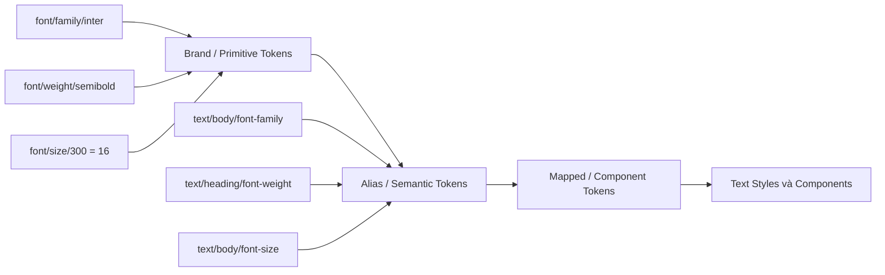
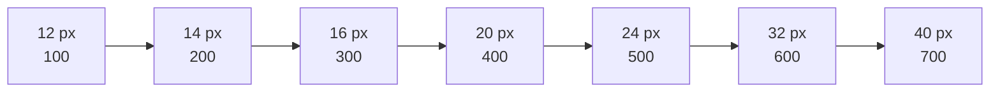
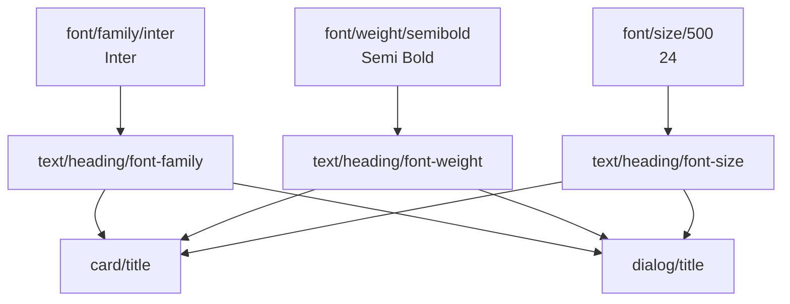
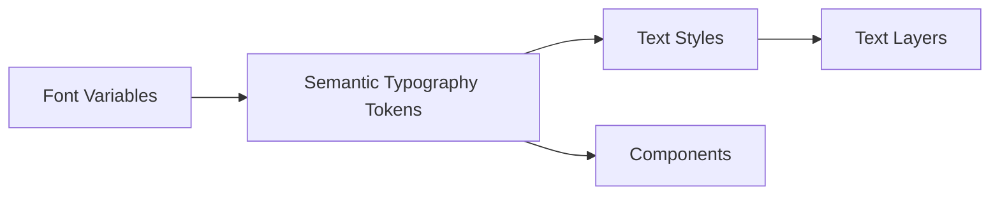

# 007 — Font Variables

## 1. Thông tin bài học

| Thuộc tính            | Nội dung                                                    |
| --------------------- | ----------------------------------------------------------- |
| **Module**            | Design Tokens & Variables Setup                             |
| **Thời điểm bắt đầu** | 19:39                                                       |
| **Chủ đề**            | Thiết lập biến cho hệ thống typography                      |
| **Mục tiêu chính**    | Token hóa font family, font weight và font size trong Figma |

---

## 2. Ý tưởng chính

Bài học hướng dẫn cách đưa các quyết định về typography vào hệ thống **Figma Variables**, tương tự như cách màu sắc được quản lý bằng design token.

Thay vì nhập trực tiếp các giá trị như:

* `Inter`
* `Poppins`
* `Regular`
* `Semi Bold`
* `16 px`

trên từng lớp văn bản, chúng ta lưu chúng thành các biến dùng chung.

Ví dụ:

```text
font/family/heading = Inter
font/family/body = Poppins

font/weight/regular = Regular
font/weight/medium = Medium
font/weight/semibold = Semi Bold
font/weight/bold = Bold

font/size/100 = 12
font/size/200 = 14
font/size/300 = 16
font/size/400 = 20
```

Điều này giúp typography trở thành một phần của hệ thống token, thay vì chỉ là các giá trị được thiết lập thủ công trên từng component.

---

## 3. Font Variables là gì?

**Font Variables** là các biến lưu giữ những giá trị cơ bản liên quan đến typography, chẳng hạn như:

* Họ phông chữ — font family
* Độ đậm — font weight
* Kích thước chữ — font size
* Line height
* Letter spacing

Trong bài học này, trọng tâm chính là:

1. Font family
2. Font weight
3. Thang kích thước chữ cơ bản

---

## 4. Vị trí của Font Variables trong hệ thống token

Font Variables thuộc lớp **primitive token** trong Brand Collection.



Ví dụ:

```text
Primitive:
font/family/inter = Inter

Alias:
font/family/heading = font/family/inter

Mapped:
button/label/font-family = font/family/heading
```

Nhờ cấu trúc này, khi thay đổi font thương hiệu, chúng ta chỉ cần cập nhật primitive hoặc alias thay vì sửa từng component.

---

# 5. Các loại biến cần sử dụng

## 5.1. String Variable

Các giá trị như tên font và tên font weight thường được lưu dưới dạng **String Variable**.

Ví dụ:

```text
font/family/heading = Inter
font/family/body = Poppins
```

```text
font/weight/regular = Regular
font/weight/medium = Medium
font/weight/semibold = Semi Bold
font/weight/bold = Bold
```

String Variable phù hợp vì các giá trị trên là chuỗi ký tự, không phải số.

---

## 5.2. Number Variable

Kích thước chữ nên được lưu dưới dạng **Number Variable**.

Ví dụ:

```text
font/size/100 = 12
font/size/200 = 14
font/size/300 = 16
font/size/400 = 20
font/size/500 = 24
font/size/600 = 32
```

Number Variable cũng có thể được sử dụng cho:

```text
font/line-height/100 = 16
font/line-height/200 = 20
font/line-height/300 = 24

font/letter-spacing/normal = 0
font/letter-spacing/tight = -0.2
font/letter-spacing/wide = 0.4
```

---

# 6. Thiết lập Font Family

## 6.1. Tạo nhóm biến

Trong Brand Collection, có thể tổ chức font family theo cấu trúc:

```text
font/
└── family/
    ├── heading
    └── body
```

Ví dụ:

| Tên biến              | Loại   | Giá trị   |
| --------------------- | ------ | --------- |
| `font/family/heading` | String | `Inter`   |
| `font/family/body`    | String | `Poppins` |

Trong đó:

* `heading` được dùng cho tiêu đề.
* `body` được dùng cho đoạn văn và nội dung chính.

Đây chỉ là cấu trúc khởi đầu. Khi hệ thống phát triển, có thể bổ sung:

```text
font/family/display
font/family/heading
font/family/body
font/family/code
font/family/quote
```

---

## 6.2. Giá trị phải khớp với font trong Figma

Tên font trong biến phải khớp với tên font mà Figma nhận diện.

Ví dụ đúng:

```text
font/family/heading = Inter
```

Nếu `Inter` đã được cài đặt hoặc có trong Figma, Figma có thể nhận ra mối liên hệ này.

Ví dụ sai:

```text
font/family/heading = Inter 1R
```

Nếu không tồn tại font có tên `Inter 1R`, Figma sẽ không thể liên kết giá trị biến với một font thực tế.

### Nguyên tắc

```text
Giá trị trong variable
        ↓
Phải khớp chính xác
        ↓
Tên font được Figma nhận diện
```

Không nên tự viết tắt hoặc đổi tên giá trị font.

---

# 7. Thiết lập Font Weight

## 7.1. Cấu trúc biến

Có thể tạo nhóm:

```text
font/
└── weight/
    ├── regular
    ├── medium
    ├── semibold
    └── bold
```

Ví dụ:

| Tên biến               | Loại   | Giá trị     |
| ---------------------- | ------ | ----------- |
| `font/weight/regular`  | String | `Regular`   |
| `font/weight/medium`   | String | `Medium`    |
| `font/weight/semibold` | String | `Semi Bold` |
| `font/weight/bold`     | String | `Bold`      |

---

## 7.2. Không sử dụng tên viết tắt tùy ý

Không nên đặt giá trị như:

```text
font/weight/semibold = SB
```

Mặc dù `SB` có thể dễ hiểu với designer, nhưng Figma có thể không nhận diện đây là một font weight hợp lệ.

Nên dùng đúng tên được font cung cấp:

```text
font/weight/semibold = Semi Bold
```

Tương tự:

```text
Regular
Medium
Semi Bold
Bold
```

Tên weight có thể khác nhau giữa các font.

Ví dụ, một font có thể sử dụng:

```text
SemiBold
```

trong khi font khác lại sử dụng:

```text
Semi Bold
```

Vì vậy, cần kiểm tra chính xác tên weight trong bảng typography của Figma.

---

## 7.3. Không phải font nào cũng có đầy đủ weight

Một font có thể chỉ cung cấp:

```text
Regular
Bold
```

Trong khi font khác có thể cung cấp:

```text
Thin
Extra Light
Light
Regular
Medium
Semi Bold
Bold
Extra Bold
Black
```

Không nên tạo token cho một weight mà font thực tế không hỗ trợ.

Ví dụ, nếu font không có `Semi Bold`, token sau có thể gây lỗi hoặc làm Figma tự thay thế:

```text
font/weight/semibold = Semi Bold
```

---

# 8. Xây dựng thang Font Size

Font size nên được xây dựng thành một thang có quy luật thay vì chọn ngẫu nhiên.

Ví dụ:

| Token           | Giá trị | Mục đích tham khảo |
| --------------- | ------: | ------------------ |
| `font/size/100` |   12 px | Caption            |
| `font/size/200` |   14 px | Small body         |
| `font/size/300` |   16 px | Body               |
| `font/size/400` |   20 px | Subtitle           |
| `font/size/500` |   24 px | Heading nhỏ        |
| `font/size/600` |   32 px | Heading lớn        |
| `font/size/700` |   40 px | Display            |



Ở lớp primitive, nên ưu tiên tên trung lập như:

```text
font/size/100
font/size/200
font/size/300
```

Không nên đặt ngay:

```text
font/size/body
font/size/heading
```

vì `body` và `heading` là ý nghĩa sử dụng, phù hợp hơn với Alias Collection.

---

# 9. Primitive và Semantic Typography Tokens

## 9.1. Primitive tokens

Primitive token lưu giá trị gốc.

```text
font/family/inter = Inter
font/family/poppins = Poppins

font/weight/regular = Regular
font/weight/semibold = Semi Bold

font/size/300 = 16
font/size/500 = 24
```

## 9.2. Semantic tokens

Semantic token mô tả vai trò của giá trị.

```text
text/body/font-family = font/family/poppins
text/body/font-weight = font/weight/regular
text/body/font-size = font/size/300

text/heading/font-family = font/family/inter
text/heading/font-weight = font/weight/semibold
text/heading/font-size = font/size/500
```

## 9.3. Component tokens

Component token mô tả cách typography được sử dụng trong component.

```text
button/label/font-family = text/body/font-family
button/label/font-weight = font/weight/semibold
button/label/font-size = font/size/200
```

Toàn bộ luồng tham chiếu:



---

# 10. Các bước thực hiện trong Figma

## Bước 1: Mở Brand Collection

Truy cập khu vực quản lý Variables và chọn collection chứa primitive token.

Ví dụ:

```text
Brand
```

---

## Bước 2: Tạo biến Font Family

Tạo String Variables:

```text
font/family/heading
font/family/body
```

Gán giá trị:

```text
font/family/heading = Inter
font/family/body = Poppins
```

---

## Bước 3: Kiểm tra Figma có nhận diện font không

Quan sát trạng thái liên kết của biến.

Nếu tên font hợp lệ, Figma sẽ nhận diện được font tương ứng.

Nếu tên font bị gạch bỏ, mất liên kết hoặc không thể áp dụng, cần kiểm tra:

* Font đã được cài đặt chưa?
* Font có trong thư viện Figma không?
* Tên font đã viết đúng chưa?
* Có ký tự thừa hoặc khoảng trắng không?

---

## Bước 4: Tạo nhóm Font Weight

Tạo các String Variables:

```text
font/weight/regular
font/weight/medium
font/weight/semibold
font/weight/bold
```

Sau đó nhập đúng giá trị weight:

```text
Regular
Medium
Semi Bold
Bold
```

---

## Bước 5: Tạo Font Size Scale

Tạo Number Variables:

```text
font/size/100 = 12
font/size/200 = 14
font/size/300 = 16
font/size/400 = 20
font/size/500 = 24
font/size/600 = 32
```

---

## Bước 6: Áp dụng thử lên lớp văn bản

Tạo một lớp text mẫu và áp dụng:

```text
Font family: font/family/body
Font weight: font/weight/regular
Font size: font/size/300
```

Kiểm tra xem typography có hiển thị đúng như mong muốn hay không.

---

## Bước 7: Chuẩn bị cho Alias Collection

Sau khi hoàn thành primitive typography token, tạo các semantic alias như:

```text
text/body/sm
text/body/md
text/heading/sm
text/heading/md
```

Mỗi semantic style có thể tham chiếu đến nhiều primitive token.

Ví dụ:

```text
text/body/md:
  family: font/family/body
  weight: font/weight/regular
  size: font/size/300
```

---

# 11. Ví dụ áp dụng thực tế

Giả sử sản phẩm sử dụng:

* `Inter` cho heading
* `Poppins` cho nội dung
* Kích thước body mặc định là `16 px`
* Heading cấp hai là `24 px`

## Primitive layer

```text
font/family/inter = Inter
font/family/poppins = Poppins

font/weight/regular = Regular
font/weight/semibold = Semi Bold

font/size/300 = 16
font/size/500 = 24
```

## Alias layer

```text
text/body/font-family = font/family/poppins
text/body/font-weight = font/weight/regular
text/body/font-size = font/size/300

text/heading/font-family = font/family/inter
text/heading/font-weight = font/weight/semibold
text/heading/font-size = font/size/500
```

## Component layer

```text
article/body = text/body/*
card/title = text/heading/*
modal/title = text/heading/*
```

Nếu thương hiệu đổi heading từ `Inter` sang `Roboto`, chỉ cần cập nhật:

```text
font/family/inter = Roboto
```

Hoặc ánh xạ lại semantic token:

```text
text/heading/font-family = font/family/roboto
```

Các component sử dụng token heading sẽ được cập nhật đồng bộ.

---

# 12. Trả lời câu hỏi ôn tập

## Câu 1: Mục đích chính của Font Variables là gì?

Mục đích chính là đưa các quyết định về typography vào hệ thống design token.

Font Variables giúp quản lý tập trung:

* Font family
* Font weight
* Font size
* Các giá trị typography khác

Nhờ đó, designer không cần nhập thủ công font và kích thước cho từng lớp văn bản. Typography trở nên nhất quán, dễ bảo trì và có thể tái sử dụng trên toàn bộ sản phẩm.

---

## Câu 2: Áp dụng Font Variables vào hệ thống thiết kế Figma thực tế như thế nào?

Có thể áp dụng theo ba lớp:

### Lớp Brand

Lưu giá trị gốc:

```text
font/family/inter
font/weight/regular
font/size/300
```

### Lớp Alias

Mô tả vai trò:

```text
text/body/font-family
text/heading/font-weight
text/caption/font-size
```

### Lớp Component

Mô tả cách component sử dụng typography:

```text
button/label/font-size
card/title/font-weight
input/helper/font-family
```

Cấu trúc này cho phép đổi font thương hiệu hoặc điều chỉnh typography mà không cần sửa từng component.

---

## Câu 3: Các bước và ý tưởng quan trọng được trình bày trong bài là gì?

Các bước chính gồm:

1. Tạo String Variable cho font family.
2. Gán đúng tên font mà Figma nhận diện.
3. Tạo String Variable cho font weight.
4. Sử dụng đúng tên weight của font.
5. Tạo Number Variable cho thang font size.
6. Tổ chức biến theo nhóm rõ ràng.
7. Kiểm tra kết nối giữa giá trị variable và font thực tế.
8. Chuẩn bị primitive token để sử dụng trong Alias Collection.

Ý tưởng quan trọng nhất là typography cần được quản lý có hệ thống giống như màu sắc, spacing và sizing.

---

## Câu 4: Rủi ro hoặc giới hạn cần lưu ý là gì?

### Tên font không khớp

Nếu giá trị variable không khớp chính xác với tên font trong Figma, biến có thể không hoạt động.

```text
Sai: Inter Font
Đúng: Inter
```

### Tên weight không chính xác

Không nên sử dụng tên viết tắt như:

```text
SB
Med
Reg
```

Nên sử dụng đúng tên weight:

```text
Semi Bold
Medium
Regular
```

### Font chưa được cài đặt

Nếu thành viên trong nhóm không có font hoặc không thể truy cập font đó, giao diện có thể hiển thị font thay thế.

### Font không có weight tương ứng

Không phải font nào cũng có `Medium`, `Semi Bold` hoặc `Black`. Cần kiểm tra danh sách weight thực tế trước khi tạo token.

### Variable không thay thế hoàn toàn Text Style

Typography thường là tổ hợp của nhiều thuộc tính:

* Font family
* Font weight
* Font size
* Line height
* Letter spacing
* Text case
* Paragraph spacing

Do đó, Font Variables thường nên được kết hợp với **Text Styles**, thay vì thay thế hoàn toàn Text Styles.

### Đổi font có thể làm thay đổi layout

Mỗi font có:

* Chiều rộng ký tự khác nhau
* X-height khác nhau
* Khoảng cách dòng khác nhau
* Cách hiển thị weight khác nhau

Vì vậy, đổi font token có thể làm text xuống dòng, thay đổi chiều cao component hoặc phá vỡ layout.

---

# 13. Variable và Text Style khác nhau như thế nào?

| Font Variables                          | Text Styles                                |
| --------------------------------------- | ------------------------------------------ |
| Lưu các giá trị nguyên tử               | Lưu một cấu hình typography hoàn chỉnh     |
| Có thể tái sử dụng trong nhiều ngữ cảnh | Thường đại diện cho Body, Heading, Caption |
| Phù hợp cho token architecture          | Phù hợp để áp dụng nhanh lên text layer    |
| Có thể hỗ trợ mode và theme             | Dễ sử dụng trực tiếp trong thiết kế        |
| Quản lý từng thuộc tính riêng           | Gom nhiều thuộc tính thành một style       |

Cách sử dụng phù hợp:



Ví dụ:

```text
Variables:
font/family/body = Poppins
font/weight/regular = Regular
font/size/300 = 16

Text Style:
Body/Medium
├── Family: font/family/body
├── Weight: font/weight/regular
└── Size: font/size/300
```

---

# 14. Quy tắc đặt tên đề xuất

## Primitive tokens

```text
font/family/inter
font/family/poppins

font/weight/regular
font/weight/medium
font/weight/semibold
font/weight/bold

font/size/100
font/size/200
font/size/300
font/size/400
```

## Semantic tokens

```text
text/body/font-family
text/body/font-weight
text/body/font-size

text/heading/font-family
text/heading/font-weight
text/heading/font-size
```

## Component tokens

```text
button/label/font-size
button/label/font-weight

card/title/font-size
card/body/font-size

input/label/font-weight
input/helper/font-size
```

---

# 15. Checklist thực hành

* [ ] Tạo nhóm `font/family`.
* [ ] Sử dụng String Variable cho tên font.
* [ ] Kiểm tra tên font có khớp với Figma.
* [ ] Tạo nhóm `font/weight`.
* [ ] Dùng đúng tên weight của font.
* [ ] Không sử dụng tên viết tắt tùy ý.
* [ ] Tạo thang `font/size` bằng Number Variable.
* [ ] Giữ tên primitive trung lập.
* [ ] Không trộn primitive và semantic token.
* [ ] Áp dụng thử token lên text layer.
* [ ] Kiểm tra font trên máy của các thành viên.
* [ ] Kiểm tra lại layout sau khi đổi font.
* [ ] Kết hợp variables với Text Styles.

---

# 16. Tóm tắt bài học

**Font Variables** giúp biến các quyết định typography thành design token có thể tái sử dụng.

Trong bài học này, chúng ta thiết lập:

```text
Font family → String Variable
Font weight → String Variable
Font size   → Number Variable
```

Các giá trị font family và font weight cần khớp chính xác với tên mà Figma nhận diện. Font size nên được xây dựng thành một thang có quy luật và đặt tên trung lập ở lớp primitive.

Kiến trúc tổng thể:

```text
Font primitives
      ↓
Semantic typography tokens
      ↓
Text styles
      ↓
Components và giao diện
```

Khi typography được token hóa đúng cách, hệ thống thiết kế sẽ:

* Nhất quán hơn
* Dễ thay đổi hơn
* Dễ mở rộng hơn
* Giảm giá trị hard-code
* Đồng bộ tốt hơn giữa designer và developer

---

# Bài luyện tập

## Mục tiêu


## Đề bài


## Yêu cầu hoàn thành

- [ ] 
- [ ] 
- [ ] 

## Kết quả / lời giải


## Ghi chú
