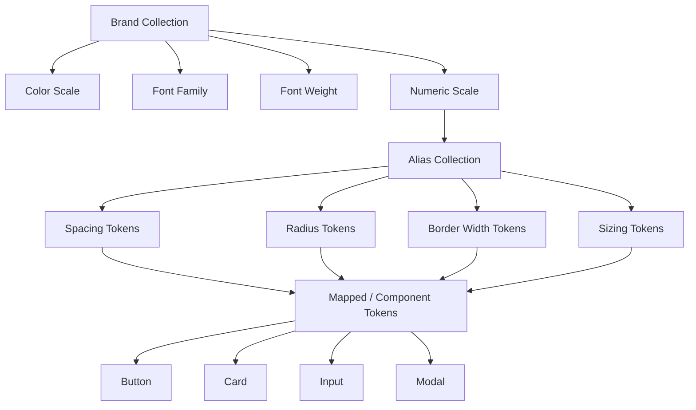
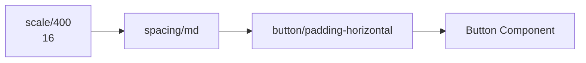
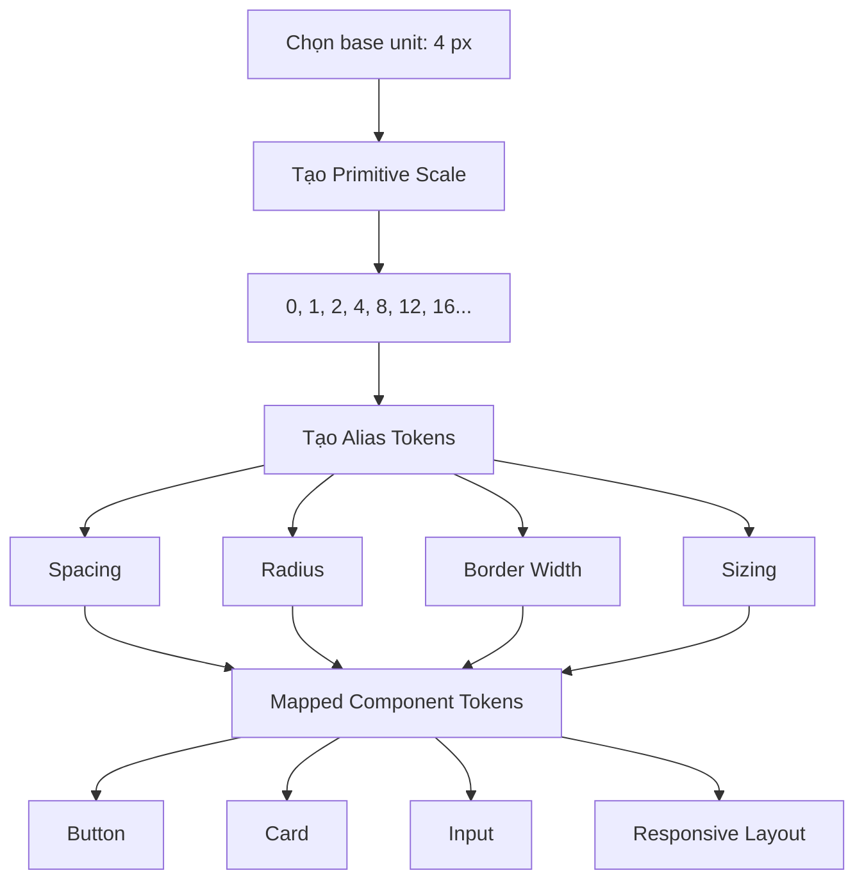

# 008 — Xây dựng thang đo số trong Design System

## Thông tin bài học

* **Module:** Design Tokens & Variables Setup
* **Thời điểm bắt đầu:** `22:45`
* **Chủ đề:** Building a Scale
* **Loại token:** Primitive Number Tokens
* **Công cụ:** Figma Variables

---

## 1. Ý tưởng chính

Bài học hướng dẫn cách xây dựng một **thang đo số thống nhất** cho Design System bằng một đơn vị cơ sở và các bội số của đơn vị đó.

Thang đo này có thể được sử dụng cho:

* Khoảng cách giữa các phần tử.
* Padding và margin.
* Chiều rộng và chiều cao.
* Border radius.
* Border width.
* Kích thước icon.
* Kích thước thành phần giao diện.
* Một số giá trị liên quan đến typography và responsive layout.

Thay vì nhập trực tiếp các giá trị như `8 px`, `16 px` hoặc `24 px` trong từng component, các giá trị sẽ được lấy từ một thang đo chung trong **Brand Collection**.

```text
Giá trị số gốc
      ↓
Primitive Scale
      ↓
Semantic Tokens
      ↓
Component Tokens
      ↓
Button, Card, Input, Modal...
```

Mục tiêu là giúp toàn bộ giao diện duy trì cùng một nhịp điệu, hạn chế các giá trị tùy ý và giữ mọi thành phần nằm trên cùng một hệ lưới.

---

## 2. Scale trong Design System là gì?

**Scale** là một tập hợp các giá trị số được xây dựng theo một quy luật nhất quán.

Ví dụ, nếu hệ thống sử dụng đơn vị cơ sở là `4 px`, ta có thể tạo ra các giá trị:

```text
4 → 8 → 12 → 16 → 20 → 24 → 28 → 32
```

Các giá trị này đều là bội số của `4`.

Trong kiến trúc Design Token, Scale thường thuộc tầng **Primitive** vì nó chỉ mô tả giá trị số thô, chưa mô tả mục đích sử dụng.

Ví dụ:

```text
scale/100 = 4
scale/200 = 8
scale/300 = 12
scale/400 = 16
```

Ở tầng Alias hoặc Semantic, các giá trị này mới được gán ý nghĩa:

```text
spacing/small   → scale/200
spacing/medium  → scale/400
spacing/large   → scale/600
```

---

## 3. Vì sao cần xây dựng thang đo?

Nếu không có một thang đo thống nhất, các designer có thể sử dụng rất nhiều giá trị gần giống nhau:

```text
15 px
16 px
17 px
19 px
20 px
21 px
```

Điều này dẫn đến:

* Giao diện thiếu nhất quán.
* Khoảng cách giữa các thành phần không đều.
* Khó kiểm soát nhịp điệu thị giác.
* Khó chuyển thiết kế sang code.
* Component khó tái sử dụng.
* Khó thay đổi toàn bộ hệ thống sau này.
* Số lượng token tăng lên không cần thiết.

Khi sử dụng Scale, các giá trị được giới hạn trong một tập hợp có chủ đích:

```text
12 px
16 px
20 px
24 px
32 px
```

Nhờ đó, designer và developer sử dụng cùng một ngôn ngữ số học.

---

## 4. Vị trí của Scale trong kiến trúc token

Thang đo số nên được lưu trong **Brand Collection**, cùng với các giá trị primitive khác như màu sắc và font family.



Một giá trị primitive có thể được nhiều loại semantic token sử dụng lại.

Ví dụ:

```text
scale/400 = 16
```

Giá trị `16` có thể được tham chiếu bởi:

```text
spacing/container-padding
radius/card
size/icon-medium
height/input-padding
```

Tuy nhiên, các component không nên tham chiếu trực tiếp vào primitive nếu hệ thống đã có tầng semantic hoặc mapped token.

---

## 5. Lựa chọn đơn vị cơ sở

Trong bài học, đơn vị cơ sở được chọn là:

```text
Base unit = 4 px
```

Đây thường được gọi là **4-point grid system**.

Các giá trị chính sẽ được xây dựng bằng cách nhân đơn vị cơ sở với một hệ số:

[
Giá\ trị = 4 \times hệ\ số
]

Ví dụ:

| Hệ số | Phép tính | Giá trị |
| ----: | --------: | ------: |
|     1 |   `4 × 1` |  `4 px` |
|     2 |   `4 × 2` |  `8 px` |
|     3 |   `4 × 3` | `12 px` |
|     4 |   `4 × 4` | `16 px` |
|     5 |   `4 × 5` | `20 px` |
|     6 |   `4 × 6` | `24 px` |
|     8 |   `4 × 8` | `32 px` |

Đơn vị `4 px` đủ nhỏ để tạo ra nhiều mức khoảng cách, nhưng vẫn giúp giao diện duy trì tính đều đặn.

---

## 6. Cách đặt tên thang đo

Bài học sử dụng hệ thống đặt tên tương tự thang màu:

```text
scale/100
scale/200
scale/300
scale/400
```

Tên token không thể hiện trực tiếp đơn vị pixel. Giá trị thực tế được lưu bên trong biến.

Ví dụ:

| Tên biến     | Giá trị |
| ------------ | ------: |
| `scale/0`    |     `0` |
| `scale/25`   |     `1` |
| `scale/50`   |     `2` |
| `scale/100`  |     `4` |
| `scale/200`  |     `8` |
| `scale/300`  |    `12` |
| `scale/400`  |    `16` |
| `scale/500`  |    `20` |
| `scale/600`  |    `24` |
| `scale/700`  |    `28` |
| `scale/800`  |    `32` |
| `scale/900`  |    `40` |
| `scale/1000` |    `48` |
| `scale/1100` |    `64` |

Việc sử dụng các bước `100`, `200`, `300` thay vì đặt tên trực tiếp là `4`, `8`, `12` giúp hệ thống có khoảng trống để chèn thêm giá trị sau này.

Ví dụ:

```text
scale/100 = 4
scale/150 = 6
scale/200 = 8
```

Tuy nhiên, chỉ nên thêm giá trị mới khi có nhu cầu thực tế, tránh làm thang đo trở nên quá phức tạp.

---

## 7. Các giá trị đặc biệt nhỏ hơn base unit

Mặc dù Scale chính dựa trên bội số của `4`, hệ thống vẫn cần một số giá trị nhỏ hơn cho border hoặc chi tiết giao diện.

### Scale 25

```text
scale/25 = 1
```

Có thể sử dụng cho:

* Border mặc định.
* Divider.
* Outline mảnh.
* Đường phân cách.
* Border radius rất nhỏ trong một số trường hợp.

### Scale 50

```text
scale/50 = 2
```

Có thể sử dụng cho:

* Focus ring.
* Border được nhấn mạnh.
* Stroke của icon.
* Outline của trạng thái tương tác.

Như vậy, hệ thống vẫn giữ được cấu trúc chung nhưng có đủ giá trị để xử lý những trường hợp phổ biến.

---

## 8. Không cần tạo mọi bội số của 4

Nếu giá trị lớn nhất trong giao diện là `256 px`, về lý thuyết có thể tạo toàn bộ các bước:

```text
4, 8, 12, 16, ..., 252, 256
```

Số lượng giá trị cần tạo sẽ là:

[
256 \div 4 = 64
]

Tuy nhiên, phần lớn hệ thống không cần sử dụng cả 64 giá trị.

Việc tạo quá nhiều token sẽ:

* Làm danh sách biến trở nên dài.
* Khiến designer khó lựa chọn.
* Tăng chi phí quản lý.
* Tạo ra nhiều giá trị gần nhau nhưng không có mục đích rõ ràng.

Do đó, sau một mức nhất định, ta có thể tăng khoảng cách giữa các bước.

Ví dụ:

```text
4 → 8 → 12 → 16 → 20 → 24 → 28 → 32
                               ↓
                         40 → 48 → 64
```

Thang đo vẫn tuân theo hệ lưới `4 px`, nhưng không chứa mọi giá trị có thể tồn tại.

---

## 9. Thang đo tuyến tính và thang đo chọn lọc

### 9.1. Giai đoạn đầu: tuyến tính

Ở các kích thước nhỏ, mỗi bước tăng `4 px`:

```text
4, 8, 12, 16, 20, 24, 28, 32
```

Các giá trị nhỏ cần độ chi tiết cao vì chúng thường được dùng cho:

* Khoảng cách giữa icon và text.
* Padding của button.
* Khoảng cách giữa label và input.
* Khoảng cách giữa các item trong danh sách.

### 9.2. Giai đoạn sau: chọn lọc

Ở các kích thước lớn, có thể bỏ qua một số bước:

```text
32, 40, 48, 64, 80, 96, 128
```

Các giá trị lớn thường dùng cho:

* Khoảng cách giữa các section.
* Kích thước container.
* Chiều cao hero.
* Khoảng trắng lớn trên landing page.
* Layout responsive.

Nguyên tắc là:

> Kích thước càng nhỏ thì cần nhiều bước chi tiết; kích thước càng lớn thì có thể tăng khoảng cách giữa các bước.

---

## 10. Quy trình xây dựng Scale trong Figma

### Bước 1: Mở Brand Collection

Đi đến khu vực quản lý Variables và mở collection chứa các primitive token.

Ví dụ:

```text
Collection: Brand
Group: Scale
```

### Bước 2: Tạo biến số 0

Tạo biến đầu tiên:

```text
scale/0 = 0
```

Giá trị `0` cần thiết cho:

* Không có khoảng cách.
* Không có radius.
* Không có border.
* Trạng thái reset.
* Các layout đặc biệt.

### Bước 3: Tạo các giá trị nhỏ

```text
scale/25 = 1
scale/50 = 2
```

Đây là các giá trị ngoại lệ phục vụ border và stroke.

### Bước 4: Tạo scale theo đơn vị 4

```text
scale/100 = 4
scale/200 = 8
scale/300 = 12
scale/400 = 16
scale/500 = 20
scale/600 = 24
scale/700 = 28
scale/800 = 32
```

### Bước 5: Thêm các giá trị lớn cần thiết

```text
scale/900 = 40
scale/1000 = 48
scale/1100 = 64
```

Không cần tạo mọi bội số của `4`. Chỉ nên thêm các giá trị được sử dụng thường xuyên trong sản phẩm.

### Bước 6: Tạo Alias Token

Sau khi Scale hoàn thành, tạo các biến semantic tham chiếu đến Scale.

Ví dụ:

```text
spacing/xs     → scale/100
spacing/sm     → scale/200
spacing/md     → scale/400
spacing/lg     → scale/600
spacing/xl     → scale/800
```

### Bước 7: Áp dụng vào component

```text
button/padding-x → spacing/md
button/gap       → spacing/sm
button/radius    → radius/md
```

Component không cần biết giá trị thực tế là `8 px` hay `16 px`. Component chỉ cần biết vai trò của token.

---

## 11. Ví dụ áp dụng trong Design System thực tế

### 11.1. Spacing tokens

```text
spacing/none = scale/0
spacing/2xs  = scale/25
spacing/xs   = scale/100
spacing/sm   = scale/200
spacing/md   = scale/400
spacing/lg   = scale/600
spacing/xl   = scale/800
spacing/2xl  = scale/1000
```

### 11.2. Border radius tokens

```text
radius/none = scale/0
radius/xs   = scale/50
radius/sm   = scale/100
radius/md   = scale/200
radius/lg   = scale/300
radius/xl   = scale/400
```

### 11.3. Border width tokens

```text
border-width/default = scale/25
border-width/focus   = scale/50
```

### 11.4. Component sizing

```text
icon/small   = scale/400
icon/medium  = scale/500
icon/large   = scale/600

input/height-small  = scale/900
input/height-medium = scale/1000
input/height-large  = scale/1100
```

---

## 12. Ví dụ luồng tham chiếu token

Giả sử padding ngang của button có giá trị `16 px`.

Không nên cấu hình trực tiếp:

```text
Button padding horizontal = 16
```

Nên xây dựng chuỗi tham chiếu:

```text
scale/400 = 16
       ↓
spacing/md = scale/400
       ↓
button/padding-horizontal = spacing/md
       ↓
Button Component
```



Khi muốn thay đổi hệ thống, ta có thể điều chỉnh Alias hoặc Mapped token mà không cần sửa primitive hoặc từng component riêng lẻ.

---

## 13. Có nên tránh số lẻ hoàn toàn không?

Trong bài học, tác giả khuyến nghị tránh thêm các giá trị tùy ý như `3 px`, vì chúng có thể phá vỡ tính nhất quán của hệ lưới.

Ví dụ không nên thêm tùy tiện:

```text
scale/custom-3 = 3
scale/custom-7 = 7
scale/custom-15 = 15
```

Tuy nhiên, trong một Design System thực tế, số lẻ vẫn có thể xuất hiện khi có lý do rõ ràng, chẳng hạn:

* Optical alignment.
* Stroke đặc biệt.
* Căn chỉnh icon.
* Kích thước phụ thuộc thiết bị.
* Yêu cầu từ hệ thống cũ.
* Giá trị cần thiết để đáp ứng tiêu chuẩn accessibility.

Nguyên tắc đúng không phải là “cấm số lẻ”, mà là:

> Không thêm giá trị ngoại lệ nếu chưa có trường hợp sử dụng rõ ràng.

Nếu một giá trị đặc biệt chỉ xuất hiện một lần, cần xem xét liệu thiết kế có thể điều chỉnh về Scale hiện tại hay không trước khi thêm token mới.

---

## 14. Những rủi ro và giới hạn cần lưu ý

### 14.1. Tạo quá nhiều giá trị

Một Scale có quá nhiều bước sẽ khiến designer khó biết nên dùng giá trị nào.

Ví dụ:

```text
12, 14, 16, 18, 20, 22, 24
```

Các giá trị quá gần nhau làm giảm ý nghĩa của Scale.

### 14.2. Đặt tên không phản ánh thứ tự

Tên token phải thể hiện được quan hệ tăng dần:

```text
scale/100 < scale/200 < scale/300
```

Không nên để:

```text
scale/300 = 8
scale/200 = 16
```

### 14.3. Component tham chiếu trực tiếp primitive

Nếu mọi component đều tham chiếu trực tiếp `scale/400`, hệ thống sẽ khó thay đổi theo từng mục đích.

Ví dụ, `16 px` có thể đang được dùng cho cả:

* Padding của button.
* Radius của card.
* Kích thước icon.
* Khoảng cách section.

Nếu sau này chỉ muốn đổi padding của button, việc sửa primitive sẽ làm thay đổi tất cả các trường hợp khác.

### 14.4. Ép mọi thứ vào cùng một Scale

Không phải mọi loại số đều nhất thiết phải dùng chung một Scale.

Ví dụ:

* Spacing.
* Font size.
* Line height.
* Opacity.
* Z-index.
* Breakpoint.
* Animation duration.

Các loại giá trị này có quy luật và đơn vị khác nhau. Chúng có thể cần các scale riêng.

```text
scale/spacing/*
scale/font-size/*
scale/line-height/*
scale/duration/*
scale/opacity/*
```

### 14.5. Không kiểm tra trên sản phẩm thực tế

Một Scale đẹp về mặt toán học chưa chắc phù hợp với sản phẩm.

Cần kiểm tra trên:

* Mobile.
* Tablet.
* Desktop.
* Component nhỏ.
* Layout nhiều nội dung.
* Màn hình có mật độ điểm ảnh khác nhau.
* Trường hợp accessibility.

---

## 15. Nguyên tắc thực hành tốt

### Bắt đầu nhỏ

Chỉ tạo các giá trị thực sự cần thiết:

```text
0, 1, 2, 4, 8, 12, 16, 20, 24, 32, 40, 48, 64
```

### Duy trì một đơn vị cơ sở

Chọn `4 px` hoặc `8 px` và sử dụng nhất quán.

### Cho phép ngoại lệ có kiểm soát

Các giá trị `1 px` và `2 px` có thể được sử dụng cho border, nhưng phải có mục đích rõ ràng.

### Phân biệt primitive và semantic

```text
scale/400 = 16
spacing/md = scale/400
```

### Không thêm token chỉ vì “có thể sẽ cần”

Chỉ thêm khi có ít nhất một trường hợp sử dụng thực tế hoặc một quy tắc hệ thống rõ ràng.

### Ghi lại tài liệu sử dụng

Mỗi semantic token nên có mô tả:

```text
spacing/md:
Khoảng cách mặc định giữa các phần tử liên quan trong component.
```

### Đồng bộ với code

Tên token trong Figma nên có khả năng chuyển đổi sang tên biến trong code.

```text
Figma: spacing/md
CSS:   --spacing-md
JSON:  spacing.md
```

---

## 16. Trả lời câu hỏi ôn tập

### Câu 1: Mục đích chính của Building a Scale là gì?

Mục đích chính là xây dựng một hệ thống giá trị số nhất quán cho toàn bộ Design System.

Thay vì sử dụng các con số tùy ý trong từng component, designer sẽ lấy giá trị từ một Scale chung. Điều này giúp khoảng cách, kích thước, border và radius duy trì cùng một nhịp điệu và nằm trên cùng một hệ lưới.

---

### Câu 2: Áp dụng bài học này vào một Figma Design System thực tế như thế nào?

Có thể thực hiện theo quy trình:

1. Tạo nhóm `Scale` trong Brand Collection.
2. Chọn đơn vị cơ sở, ví dụ `4 px`.
3. Tạo các primitive number token như `scale/100`, `scale/200`.
4. Tạo Alias Token cho spacing, radius, border width và sizing.
5. Tạo Mapped Token cho từng component.
6. Áp dụng các token vào Button, Card, Input và các layout.
7. Kiểm tra Scale trên nhiều kích thước màn hình.
8. Chỉ bổ sung giá trị khi xuất hiện nhu cầu thực tế.

---

### Câu 3: Những bước hoặc ý tưởng quan trọng được trình bày trong bài là gì?

Các ý tưởng chính gồm:

* Sử dụng một đơn vị cơ sở, ví dụ `4 px`.
* Tạo Scale theo các bội số của đơn vị cơ sở.
* Đặt tên Scale theo các bước `100`, `200`, `300`.
* Thêm các giá trị nhỏ như `1 px` và `2 px` cho border.
* Không cần tạo tất cả các bội số có thể có.
* Tăng khoảng cách giữa các bước khi giá trị trở nên lớn.
* Lưu Scale trong Brand Collection.
* Dùng Scale làm nguồn cho spacing, radius, border và sizing token.
* Hạn chế sử dụng các giá trị tùy ý ngoài hệ thống.

---

### Câu 4: Rủi ro hoặc giới hạn nào cần lưu ý?

Rủi ro lớn nhất là xây dựng một Scale quá dài hoặc quá cứng nhắc.

Nếu tạo quá nhiều giá trị, hệ thống sẽ khó sử dụng và khó quản lý. Nếu ép mọi con số vào cùng một Scale, hệ thống có thể không phù hợp với typography, responsive breakpoint hoặc animation.

Ngoài ra, component không nên tham chiếu trực tiếp primitive token trong mọi trường hợp. Nên có tầng Alias và Mapped để giữ được ý nghĩa semantic và cho phép thay đổi từng nhóm component độc lập.

---

## 17. Sơ đồ tổng kết



---

## 18. Tóm tắt bài học

**Building a Scale** là quá trình xây dựng một tập hợp giá trị số primitive có quy luật để làm nền tảng cho toàn bộ Design System.

Trong bài học:

* Đơn vị cơ sở được chọn là `4 px`.
* Các bước từ `100` đến `800` tương ứng với `4–32 px`.
* Các giá trị `1 px` và `2 px` được bổ sung cho border và focus ring.
* Sau `32 px`, Scale có thể nhảy lên `40`, `48` và `64` thay vì tạo mọi bội số.
* Scale được lưu trong Brand Collection.
* Các Alias Token như spacing, radius và sizing sẽ tham chiếu đến Scale.
* Component nên sử dụng semantic hoặc mapped token thay vì hard-code giá trị.

Cấu trúc tổng quát:

```text
Base Unit
   ↓
Primitive Numeric Scale
   ↓
Spacing / Radius / Sizing Aliases
   ↓
Component Tokens
   ↓
Giao diện nhất quán và dễ bảo trì
```

Thang đo không chỉ là một danh sách con số. Nó là nền tảng giúp sản phẩm duy trì **nhịp điệu thị giác, tính nhất quán và khả năng mở rộng**.
