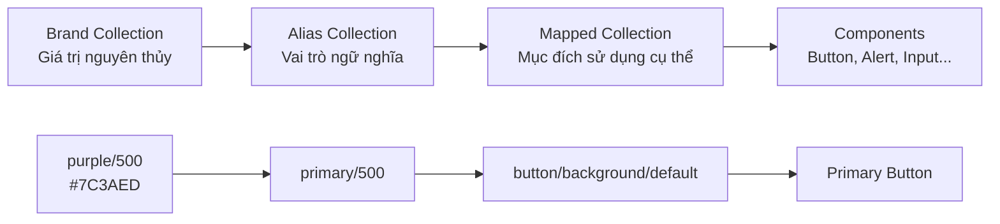
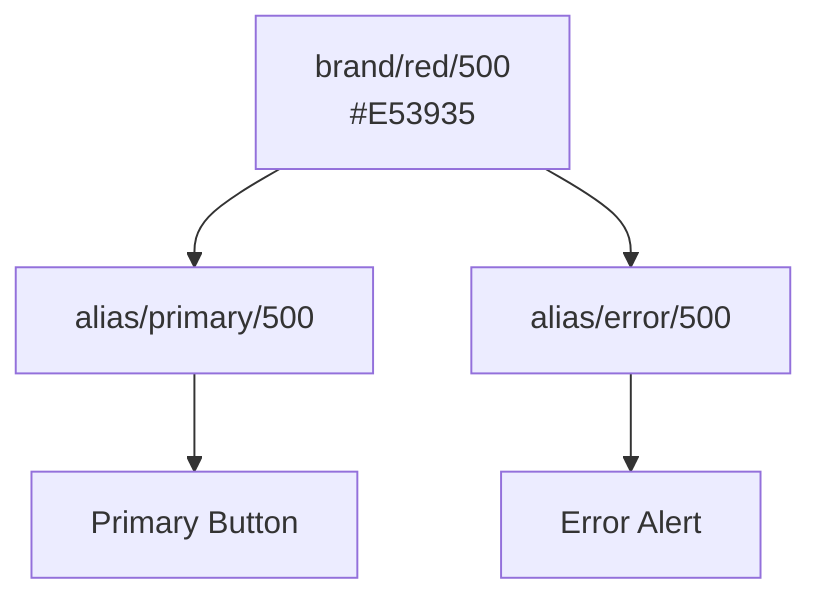
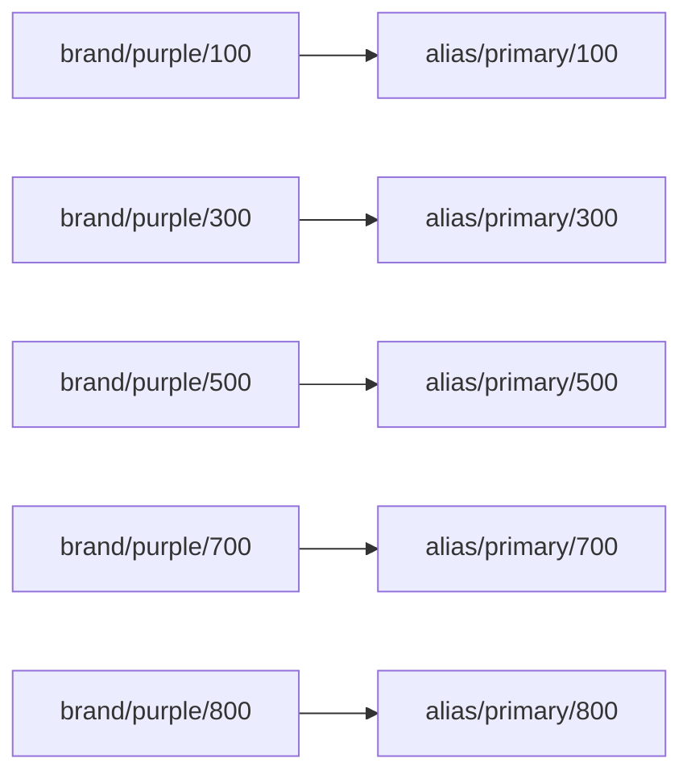
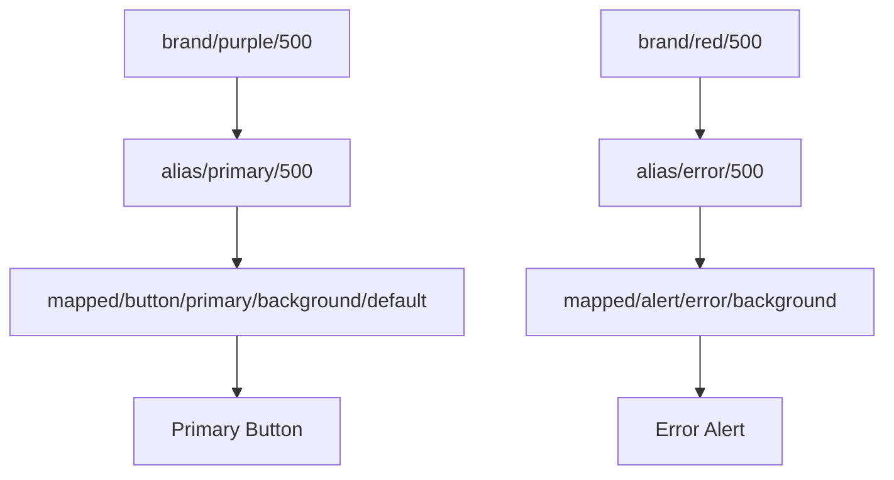

# 009 — Giới thiệu Alias Collection

## 1. Thông tin bài học

| Thuộc tính            | Nội dung                                                        |
| --------------------- | --------------------------------------------------------------- |
| **Module**            | Design Tokens & Variables Setup                                 |
| **Tên bài học**       | Alias Collection Intro                                          |
| **Thời điểm bắt đầu** | 26:45                                                           |
| **Chủ đề chính**      | Xây dựng lớp token ngữ nghĩa giữa Brand primitives và component |

---

## 2. Ý tưởng chính

**Alias Collection** là bộ sưu tập biến dùng để chuyển các giá trị nguyên thủy trong **Brand Collection** thành những token có ý nghĩa về mặt sử dụng.

Thay vì gọi màu theo giá trị hoặc tên màu như:

```text
purple/500
red/600
green/400
```

Alias Collection đặt tên cho chúng theo vai trò:

```text
primary/500
error/600
success/400
```

Alias không tạo ra một màu mới. Nó chỉ **tham chiếu** đến một biến đã tồn tại trong Brand Collection.

Ví dụ:

```text
alias/color/error/500
        ↓
brand/color/red/500
        ↓
#DC2626
```

Nhờ đó, thiết kế không còn phụ thuộc trực tiếp vào một mã màu hoặc một thang màu cụ thể.

---

## 3. Vị trí của Alias Collection trong hệ thống token

Một hệ thống design token có thể được tổ chức thành ba lớp chính:



### Vai trò của từng lớp

| Lớp           | Chức năng                          | Ví dụ                       |
| ------------- | ---------------------------------- | --------------------------- |
| **Brand**     | Lưu giá trị gốc                    | `purple/500`, `spacing/16`  |
| **Alias**     | Gán vai trò ngữ nghĩa              | `primary/500`, `error/500`  |
| **Mapped**    | Xác định cách dùng trong giao diện | `button/background/default` |
| **Component** | Sử dụng token để tạo UI            | Button, Alert, Card         |

Alias Collection hoạt động giống như **thân cây**, kết nối phần gốc là Brand Collection với các nhánh và lá là Mapped Collection cùng các component.

```text
                    Components
                 /      |       \
             Button   Alert     Input
                \       |       /
                 Mapped Tokens
                       │
                Alias Collection
                       │
                Brand Collection
                       │
                  Raw Values
```

---

## 4. Tại sao cần lớp semantic token?

### 4.1. Giá trị màu không thể hiện mục đích sử dụng

Tên như `red/500` chỉ cho biết đây là một màu đỏ. Nó không cho biết màu đỏ đó được dùng cho:

* Lỗi hệ thống
* Màu thương hiệu
* Cảnh báo
* Trạng thái nguy hiểm
* Nội dung trang trí

Trong khi đó, tên `error/500` thể hiện rõ mục đích của token.

```text
red/500        → Chỉ mô tả màu
error/500      → Mô tả ý nghĩa và vai trò
```

---

### 4.2. Một màu có thể đảm nhiệm nhiều vai trò khác nhau

Giả sử màu chính của thương hiệu và màu lỗi đều là màu đỏ.

```text
brand/red/500 → #E53935
```

Không nên để tất cả thành phần màu đỏ đều tham chiếu đến `error/500`.

Ví dụ không phù hợp:

```text
Logo đỏ        → error/500
Primary button → error/500
Error alert    → error/500
```

Điều này khiến developer hiểu rằng tất cả các thành phần trên đều biểu thị trạng thái lỗi.

Cách tổ chức đúng:

```text
primary/500 → brand/red/500
error/500   → brand/red/500
```

Mặc dù hai Alias token đang tham chiếu đến cùng một giá trị, chúng vẫn có ý nghĩa hoàn toàn khác nhau.



Sau này, nếu màu thương hiệu thay đổi sang màu xanh, chỉ cần cập nhật Alias:

```text
primary/500 → brand/blue/500
error/500   → brand/red/500
```

Error Alert vẫn giữ màu đỏ mà không bị ảnh hưởng.

---

## 5. Aliasing và sao chép giá trị

### Sao chép giá trị

```text
brand/purple/500 = #7C3AED
alias/primary/500 = #7C3AED
```

Trong trường hợp này, hai biến chứa hai giá trị độc lập.

Nếu màu Brand thay đổi, Alias không tự động cập nhật.

### Tạo Alias

```text
brand/purple/500 = #7C3AED
alias/primary/500 → brand/purple/500
```

Alias chỉ giữ liên kết đến biến Brand.

Khi `brand/purple/500` thay đổi, `alias/primary/500` sẽ tự động nhận giá trị mới.

### So sánh

| Tiêu chí                       | Sao chép giá trị |    Alias |
| ------------------------------ | ---------------: | -------: |
| Có liên kết với biến gốc       |            Không |       Có |
| Tự cập nhật khi Brand thay đổi |            Không |       Có |
| Dễ bảo trì                     |             Thấp |      Cao |
| Nguy cơ lệch dữ liệu           |              Cao |     Thấp |
| Phù hợp với design system      |        Không nên | Nên dùng |

---

## 6. Ví dụ xây dựng thang màu Primary

Giả sử Brand Collection có thang màu tím:

```text
brand/purple/100
brand/purple/200
brand/purple/300
brand/purple/400
brand/purple/500
brand/purple/600
brand/purple/700
brand/purple/800
```

Trong Alias Collection, màu tím được gán vai trò **Primary**:

```text
alias/primary/100 → brand/purple/100
alias/primary/200 → brand/purple/200
alias/primary/300 → brand/purple/300
alias/primary/400 → brand/purple/400
alias/primary/500 → brand/purple/500
alias/primary/600 → brand/purple/600
alias/primary/700 → brand/purple/700
alias/primary/800 → brand/purple/800
```

Sơ đồ ánh xạ:



Điểm quan trọng là Alias Collection có thể giữ nguyên các bước `100–800`, nhưng thay tên màu sắc bằng vai trò sử dụng.

---

## 7. Các nhóm màu thường có trong Alias Collection

Một Alias Collection thực tế có thể chứa các nhóm sau:

```text
color/
├── primary/
│   ├── 100
│   ├── 200
│   ├── 300
│   ├── 400
│   ├── 500
│   ├── 600
│   ├── 700
│   └── 800
├── secondary/
├── neutral/
├── error/
├── warning/
├── success/
└── information/
```

### Ý nghĩa các nhóm phổ biến

| Nhóm          | Vai trò                                         |
| ------------- | ----------------------------------------------- |
| `primary`     | Màu nhận diện và hành động chính                |
| `secondary`   | Màu hỗ trợ cho màu chính                        |
| `neutral`     | Background, text, border và surface trung tính  |
| `error`       | Lỗi, hành động nguy hiểm và validation thất bại |
| `warning`     | Cảnh báo hoặc nội dung cần chú ý                |
| `success`     | Hoàn thành, thành công hoặc trạng thái tích cực |
| `information` | Thông báo và nội dung cung cấp thông tin        |

---

## 8. Alias Collection không chỉ chứa màu sắc

Ngoài màu, Alias Collection có thể định nghĩa vai trò cho nhiều loại token khác.

### Border radius

```text
brand/radius/0
brand/radius/4
brand/radius/8
brand/radius/16
brand/radius/full
```

Alias tương ứng:

```text
alias/radius/none   → brand/radius/0
alias/radius/small  → brand/radius/4
alias/radius/medium → brand/radius/8
alias/radius/large  → brand/radius/16
alias/radius/full   → brand/radius/full
```

### Border width

```text
alias/border-width/none   → brand/size/0
alias/border-width/thin   → brand/size/1
alias/border-width/medium → brand/size/2
alias/border-width/thick  → brand/size/4
```

### Spacing

```text
alias/spacing/xs → brand/spacing/4
alias/spacing/sm → brand/spacing/8
alias/spacing/md → brand/spacing/16
alias/spacing/lg → brand/spacing/24
alias/spacing/xl → brand/spacing/32
```

Tuy nhiên, cần cân nhắc mức độ ngữ nghĩa. Các tên như `xs`, `sm`, `md` vẫn còn khá tổng quát và có thể được coi là token nền tảng hơn là token dành riêng cho component.

---

## 9. Quy ước đặt tên Alias

Tên Alias nên mô tả **vai trò**, không mô tả giá trị hiện tại.

### Nên sử dụng

```text
color/primary/500
color/error/500
color/success/600
radius/small
border-width/thin
```

### Không nên sử dụng

```text
color/purple-main
color/red-error
radius/8px
border/1px
```

Lý do là giá trị có thể thay đổi trong tương lai.

Ví dụ:

```text
color/primary/500
```

Hôm nay có thể tham chiếu đến:

```text
brand/purple/500
```

Nhưng sau khi đổi thương hiệu, nó có thể tham chiếu đến:

```text
brand/blue/500
```

Tên `primary/500` vẫn đúng trong cả hai trường hợp.

---

## 10. Quy trình xây dựng Alias Collection trong Figma

### Bước 1: Tạo collection mới

Trong bảng Variables của Figma:

```text
Create collection → Đặt tên “Alias”
```

### Bước 2: Tạo các nhóm semantic

Ví dụ:

```text
color/primary
color/neutral
color/error
color/warning
color/success
```

### Bước 3: Tạo các bước của thang màu

Ví dụ nhóm Primary:

```text
color/primary/100
color/primary/200
color/primary/300
color/primary/400
color/primary/500
color/primary/600
color/primary/700
color/primary/800
```

### Bước 4: Tạo Alias đến Brand Collection

Với mỗi biến Alias:

```text
color/primary/300
        ↓
Create alias
        ↓
brand/purple/300
```

Thực hiện tương tự cho toàn bộ thang màu.

### Bước 5: Kiểm tra liên kết

Thay đổi thử một biến trong Brand Collection và xác nhận rằng biến Alias cập nhật tự động.

### Bước 6: Chưa áp dụng trực tiếp vào component

Ở kiến trúc ba lớp, Alias Collection chủ yếu làm nhiệm vụ phân loại vai trò.

Component nên sử dụng lớp Mapped Collection:

```text
Brand → Alias → Mapped → Component
```

Thay vì:

```text
Brand → Component
```

hoặc:

```text
Alias → Component
```

Việc thêm Mapped Collection giúp token mô tả chính xác trạng thái và vị trí sử dụng.

---

## 11. Ví dụ áp dụng vào hệ thống thực tế

Giả sử cần thiết kế một hệ thống có Button và Alert.

### Brand Collection

```text
brand/purple/500 = #7C3AED
brand/purple/600 = #6D28D9
brand/red/500    = #EF4444
brand/red/600    = #DC2626
brand/white      = #FFFFFF
```

### Alias Collection

```text
alias/primary/500 → brand/purple/500
alias/primary/600 → brand/purple/600
alias/error/500   → brand/red/500
alias/error/600   → brand/red/600
alias/neutral/0   → brand/white
```

### Mapped Collection

```text
mapped/button/primary/background/default → alias/primary/500
mapped/button/primary/background/hover   → alias/primary/600
mapped/button/primary/text               → alias/neutral/0

mapped/alert/error/background → alias/error/500
mapped/alert/error/border     → alias/error/600
mapped/alert/error/text       → alias/neutral/0
```

### Component

```text
Primary Button
├── Background → mapped/button/primary/background/default
└── Text       → mapped/button/primary/text

Error Alert
├── Background → mapped/alert/error/background
├── Border     → mapped/alert/error/border
└── Text       → mapped/alert/error/text
```

Luồng đầy đủ:



---

## 12. Lợi ích của Alias Collection

### Duy trì tính nhất quán

Tất cả màu lỗi đều đi qua nhóm `error`, thay vì chọn tùy ý từ thang màu Brand.

### Dễ thay đổi thương hiệu

Có thể đổi màu Primary mà không cần sửa từng component.

### Giao tiếp tốt hơn với developer

Developer hiểu được mục đích của token từ tên gọi:

```text
error/500
```

rõ ràng hơn:

```text
red/500
```

### Hỗ trợ theme và nhiều thương hiệu

Alias có thể được liên kết đến các Brand Collection khác nhau tùy theo thương hiệu hoặc chế độ.

Ví dụ:

```text
Brand A:
primary/500 → brand-a/purple/500

Brand B:
primary/500 → brand-b/blue/500
```

### Giảm hard-coded value

Component không cần chứa trực tiếp mã màu, kích thước hoặc radius.

---

## 13. Rủi ro và hạn chế

### 13.1. Đặt tên theo màu thay vì vai trò

Không nên đặt:

```text
alias/red/500
alias/purple/500
```

Vì đây vẫn là tên giá trị, chưa phải tên ngữ nghĩa.

Nên đặt:

```text
alias/error/500
alias/primary/500
```

---

### 13.2. Nhầm lẫn giữa Alias và Mapped token

Alias mô tả vai trò chung:

```text
primary/500
error/500
neutral/100
```

Mapped token mô tả mục đích sử dụng cụ thể:

```text
button/background/default
input/border/error
alert/icon/warning
```

Không nên đưa tên component quá sớm vào Alias Collection.

---

### 13.3. Tạo quá nhiều Alias không cần thiết

Nếu mỗi giá trị Brand đều có nhiều Alias nhưng không có mục đích rõ ràng, hệ thống sẽ trở nên khó quản lý.

Chỉ nên tạo Alias khi token thể hiện một vai trò thực sự trong hệ thống.

---

### 13.4. Một Alias đảm nhiệm quá nhiều ý nghĩa

Ví dụ:

```text
primary/500
```

không nên đồng thời được hiểu là:

* Màu nút chính
* Màu lỗi
* Màu văn bản
* Màu viền
* Màu trạng thái thành công

Các vai trò khác nhau nên có Alias riêng, kể cả khi chúng đang tham chiếu đến cùng một màu Brand.

---

### 13.5. Thay đổi Alias có phạm vi ảnh hưởng lớn

Khi một Alias được sử dụng ở nhiều token phía trên, thay đổi liên kết của nó có thể ảnh hưởng đến nhiều component.

Trước khi cập nhật cần kiểm tra:

```text
Alias nào đang được sử dụng?
Mapped token nào phụ thuộc vào Alias?
Component nào sẽ bị thay đổi?
Độ tương phản có còn đạt yêu cầu không?
```

---

## 14. Trả lời câu hỏi ôn tập

### Câu 1: Mục đích chính của Alias Collection là gì?

Alias Collection tạo ra một lớp token ngữ nghĩa giữa Brand primitives và các token được dùng trong giao diện.

Nó chuyển những tên dựa trên giá trị như:

```text
purple/500
red/500
```

thành những tên dựa trên vai trò:

```text
primary/500
error/500
```

Mục đích chính là tăng tính nhất quán, khả năng bảo trì và khả năng thay đổi thương hiệu.

---

### Câu 2: Áp dụng vào một Figma design system thực tế như thế nào?

Quy trình áp dụng:

1. Xây dựng đầy đủ các thang màu và giá trị nguyên thủy trong Brand Collection.
2. Tạo Alias Collection.
3. Xác định các vai trò như `primary`, `neutral`, `error`, `warning` và `success`.
4. Tạo các Alias variable cho từng bước của thang màu.
5. Liên kết Alias với Brand primitives bằng chức năng tạo variable alias.
6. Sử dụng Alias làm nền tảng cho Mapped Collection.
7. Cho component sử dụng Mapped token thay vì sử dụng trực tiếp Brand value.

Ví dụ:

```text
brand/red/500
    ↓
alias/error/500
    ↓
mapped/input/border/error
    ↓
Input Error State
```

---

### Câu 3: Các bước hoặc ý tưởng quan trọng trong bài học là gì?

Các ý tưởng chính gồm:

* Alias Collection là lớp ngữ nghĩa của hệ thống token.
* Alias tham chiếu đến Brand variable, không sao chép giá trị.
* Các thang màu Brand được gán vai trò như Primary, Error, Success và Warning.
* Hai vai trò có thể tham chiếu đến cùng một màu nhưng vẫn cần token riêng.
* Alias Collection cũng có thể chứa radius, border width và các token nền tảng khác.
* Alias là cầu nối giữa Brand Collection và Mapped Collection.
* Việc đặt tên cần dựa trên ý nghĩa, không dựa trên màu sắc hoặc giá trị hiện tại.

---

### Câu 4: Rủi ro hoặc hạn chế cần lưu ý là gì?

Rủi ro lớn nhất là xây dựng lớp Alias không rõ ràng hoặc không thực sự có tính ngữ nghĩa.

Các vấn đề thường gặp:

* Đặt tên Alias theo màu sắc.
* Sao chép giá trị thay vì tạo liên kết.
* Dùng cùng một Alias cho nhiều ý nghĩa khác nhau.
* Trộn lẫn Alias token với component-specific token.
* Tạo quá nhiều lớp token làm hệ thống khó hiểu.
* Thay đổi Alias nhưng không kiểm tra ảnh hưởng đến các component phía trên.
* Không kiểm tra độ tương phản sau khi đổi liên kết màu.

---

## 15. Checklist thực hành

* [ ] Đã tạo Alias Collection riêng.
* [ ] Các biến Alias tham chiếu đến Brand variables.
* [ ] Không sao chép trực tiếp mã HEX.
* [ ] Tên Alias mô tả vai trò thay vì màu sắc.
* [ ] Primary và Error là hai nhóm độc lập.
* [ ] Các thang màu có cấu trúc bước nhất quán.
* [ ] Radius và border width có tên ngữ nghĩa rõ ràng.
* [ ] Alias không chứa tên component quá cụ thể.
* [ ] Mapped Collection sẽ được dùng trước khi gắn vào component.
* [ ] Đã kiểm tra phạm vi ảnh hưởng khi thay đổi Alias.
* [ ] Đã kiểm tra lại contrast và accessibility.

---

## 16. Tóm tắt bài học

**Alias Collection** là lớp trung gian giúp biến các giá trị nguyên thủy thành những token có ý nghĩa.

```text
Brand primitive:
purple/500

        ↓ Gán vai trò

Alias token:
primary/500

        ↓ Gán mục đích sử dụng

Mapped token:
button/background/default

        ↓ Áp dụng

Component:
Primary Button
```

Alias Collection không nhằm thay thế Brand Collection hoặc Mapped Collection. Nó đóng vai trò kết nối hai lớp này.

Cấu trúc tổng thể:

```text
Brand Collection
Giá trị gốc
        ↓
Alias Collection
Vai trò ngữ nghĩa
        ↓
Mapped Collection
Mục đích sử dụng cụ thể
        ↓
Components
Giao diện hoàn chỉnh
```

Nguyên tắc quan trọng nhất:

> **Brand token mô tả giá trị, Alias token mô tả vai trò, còn Mapped token mô tả nơi và cách giá trị được sử dụng.**
