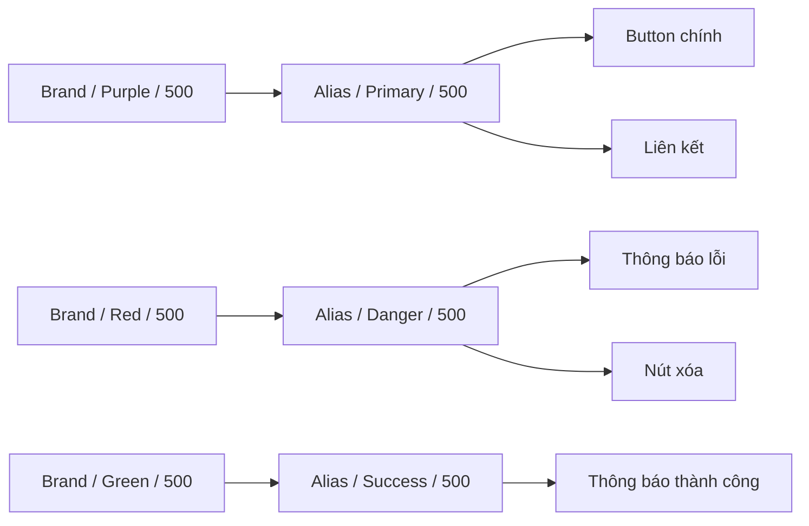

# 010 — Xây dựng Alias Collection

## 1. Thông tin bài học

| Thuộc tính            | Nội dung                                                                                             |
| --------------------- | ---------------------------------------------------------------------------------------------------- |
| **Module**            | Design Tokens & Variables Setup                                                                      |
| **Thời điểm bắt đầu** | 29:42 trong video đầy đủ                                                                             |
| **Chủ đề chính**      | Xây dựng bộ biến Alias và liên kết các biến ngữ nghĩa với giá trị nguyên thủy trong Brand Collection |

---

## 2. Tổng quan

Trong bài học này, chúng ta xây dựng hoàn chỉnh **Alias Collection** bằng cách tạo các biến mang ý nghĩa sử dụng như:

* `primary`
* `secondary`
* `neutral`
* `danger`
* `success`
* `warning`

Mỗi biến Alias không chứa một mã màu độc lập. Thay vào đó, nó **tham chiếu đến một biến màu trong Brand Collection**.

Ví dụ:

```text
Alias/primary/500
        ↓
Brand/purple/500
```

Hoặc:

```text
Alias/danger/500
        ↓
Brand/red/500
```

Cách tổ chức này giúp hệ thống thiết kế sử dụng màu sắc theo **vai trò**, thay vì phụ thuộc trực tiếp vào tên hoặc mã màu cụ thể.

---

## 3. Mục tiêu của bài học

Sau bài học, bạn có thể:

1. Tạo các nhóm màu ngữ nghĩa trong Alias Collection.
2. Liên kết Alias Variables với Brand Variables.
3. Xây dựng đầy đủ các thang màu cho từng vai trò.
4. Kiểm tra xem các liên kết Alias → Brand có chính xác hay không.
5. Hiểu lý do không nên sao chép trực tiếp mã màu từ Brand sang Alias.

---

## 4. Kiến trúc Brand và Alias

### 4.1. Brand Collection

Brand Collection lưu trữ các giá trị màu nguyên thủy.

Ví dụ:

```text
Brand
├── purple
│   ├── 100
│   ├── 200
│   ├── 300
│   ├── 400
│   ├── 500
│   ├── 600
│   ├── 700
│   └── 800
├── red
│   ├── 100
│   ├── 200
│   └── ...
└── green
    ├── 100
    ├── 200
    └── ...
```

Các tên như `purple`, `red` hoặc `green` chỉ mô tả **giá trị màu sắc**, chưa thể hiện màu đó được dùng cho mục đích gì trong giao diện.

---

### 4.2. Alias Collection

Alias Collection gán một vai trò ngữ nghĩa cho các giá trị trong Brand Collection.

```text
Alias
├── primary
├── secondary
├── danger
├── success
├── warning
└── neutral
```

Ví dụ:

```text
Alias/primary/500 → Brand/purple/500
Alias/danger/500  → Brand/red/500
Alias/success/500 → Brand/green/500
```

---

## 5. Sơ đồ luồng tham chiếu



Kiến trúc tổng thể:

```text
Brand primitives
       ↓
Semantic aliases
       ↓
Component hoặc Mapped tokens
       ↓
Giao diện sản phẩm
```

---

## 6. Quy trình xây dựng Alias Collection

### Bước 1: Tạo nhóm màu Primary

Tạo các biến:

```text
primary/100
primary/200
primary/300
primary/400
primary/500
primary/600
primary/700
primary/800
```

Sau đó liên kết từng biến với thang màu tím trong Brand Collection:

| Alias Variable | Brand Variable |
| -------------- | -------------- |
| `primary/100`  | `purple/100`   |
| `primary/200`  | `purple/200`   |
| `primary/300`  | `purple/300`   |
| `primary/400`  | `purple/400`   |
| `primary/500`  | `purple/500`   |
| `primary/600`  | `purple/600`   |
| `primary/700`  | `purple/700`   |
| `primary/800`  | `purple/800`   |

Sơ đồ:

```text
Primary scale          Purple scale

primary/100    ──────▶ purple/100
primary/200    ──────▶ purple/200
primary/300    ──────▶ purple/300
primary/400    ──────▶ purple/400
primary/500    ──────▶ purple/500
primary/600    ──────▶ purple/600
primary/700    ──────▶ purple/700
primary/800    ──────▶ purple/800
```

---

### Bước 2: Tạo nhóm màu Danger hoặc Error

Nhân bản nhóm biến vừa tạo và đổi tên thành:

```text
danger/100
danger/200
danger/300
danger/400
danger/500
danger/600
danger/700
danger/800
```

Sau đó thay các liên kết từ màu tím sang màu đỏ:

```text
danger/100 → red/100
danger/200 → red/200
danger/300 → red/300
danger/400 → red/400
danger/500 → red/500
danger/600 → red/600
danger/700 → red/700
danger/800 → red/800
```

Các biến này có thể được sử dụng cho:

* Thông báo lỗi
* Trạng thái không hợp lệ
* Nút xóa dữ liệu
* Cảnh báo nguy hiểm
* Văn bản báo lỗi trong biểu mẫu

---

### Bước 3: Tạo nhóm màu Success

Tiếp tục nhân bản nhóm biến và đổi tên thành:

```text
success/100
success/200
success/300
success/400
success/500
success/600
success/700
success/800
```

Liên kết chúng với thang màu xanh lá:

```text
success/100 → green/100
success/200 → green/200
success/300 → green/300
success/400 → green/400
success/500 → green/500
success/600 → green/600
success/700 → green/700
success/800 → green/800
```

Các biến Success thường được dùng cho:

* Thông báo thao tác thành công
* Trạng thái đã hoàn thành
* Dữ liệu hợp lệ
* Huy hiệu tích cực
* Chỉ số tăng trưởng

---

### Bước 4: Lặp lại cho các vai trò còn lại

Áp dụng cùng một quy trình cho:

```text
secondary/*
neutral/*
warning/*
info/*
accent/*
```

Ví dụ:

```text
secondary/500 → blue/500
warning/500   → yellow/500
neutral/500   → gray/500
info/500      → cyan/500
```

---

## 7. Bản chất của Alias Collection

Alias Collection không tạo ra màu mới.

Nó chỉ thực hiện hai nhiệm vụ:

1. Lấy một giá trị từ Brand Collection.
2. Gán cho giá trị đó một vai trò ngữ nghĩa.

```text
Giá trị nguyên thủy + Vai trò sử dụng = Alias token
```

Ví dụ:

```text
purple/500 + vai trò màu chính = primary/500
red/500    + vai trò lỗi       = danger/500
green/500  + vai trò thành công = success/500
```

Điểm quan trọng là biến Alias phải **tham chiếu** đến Brand Variable, không nên nhập lại mã màu HEX.

### Không nên

```text
primary/500 = #7C3AED
```

### Nên

```text
primary/500 → Brand/purple/500
```

---

## 8. Vì sao phải sử dụng Alias?

### 8.1. Component không phụ thuộc vào màu cụ thể

Một Button không cần biết màu thương hiệu là tím, xanh hay đỏ.

Button chỉ cần sử dụng:

```text
primary/500
```

Nếu thương hiệu đổi màu chính từ tím sang xanh, ta chỉ cần cập nhật:

```text
primary/500 → blue/500
```

Toàn bộ component đang sử dụng `primary/500` sẽ được cập nhật tự động.

---

### 8.2. Dễ đổi thương hiệu

Ban đầu:

```text
primary/500 → purple/500
```

Sau khi đổi nhận diện:

```text
primary/500 → blue/500
```

Component không cần thay đổi token:

```text
Button background → primary/500
```

---

### 8.3. Dễ duy trì tính nhất quán

Nếu mỗi component sử dụng mã HEX riêng:

```text
Button A → #7C3AED
Button B → #7B3BDD
Link     → #7D3AEF
```

Hệ thống sẽ xuất hiện nhiều màu gần giống nhau nhưng không đồng nhất.

Khi sử dụng Alias:

```text
Button A → primary/500
Button B → primary/500
Link     → primary/500
```

Tất cả đều tham chiếu về cùng một nguồn.

---

### 8.4. Dễ hỗ trợ nhiều theme

Alias cũng tạo nền tảng để xây dựng Light Mode và Dark Mode.

Ví dụ:

```text
Light Mode:
primary/500 → purple/600

Dark Mode:
primary/500 → purple/400
```

Tên token vẫn giữ nguyên, nhưng giá trị có thể thay đổi theo Mode.

---

## 9. Ví dụ áp dụng trong Figma Design System

Giả sử hệ thống có các màu Brand sau:

```text
Brand/purple/*
Brand/red/*
Brand/green/*
Brand/yellow/*
Brand/gray/*
```

Alias Collection có thể được xây dựng như sau:

| Vai trò Alias | Brand được tham chiếu |
| ------------- | --------------------- |
| `primary/*`   | `purple/*`            |
| `danger/*`    | `red/*`               |
| `success/*`   | `green/*`             |
| `warning/*`   | `yellow/*`            |
| `neutral/*`   | `gray/*`              |

Sau đó, các component sử dụng Alias thay vì Brand:

```text
Button Primary
└── background: primary/500

Error Message
└── text: danger/600

Success Badge
└── background: success/100
└── text: success/700

Input Border
└── default: neutral/300
└── error: danger/500
```

---

## 10. Kiểm tra liên kết Alias → Brand

Sau khi tạo xong Alias Collection, cần kiểm tra:

### Kiểm tra tên biến

```text
primary/100
primary/200
primary/300
```

Không nên trộn lẫn nhiều cấu trúc:

```text
primary-100
Primary/200
primary_color_300
```

---

### Kiểm tra đúng cấp độ màu

Ví dụ:

```text
primary/300 → purple/300
primary/400 → purple/400
primary/500 → purple/500
```

Cần tránh liên kết nhầm:

```text
primary/300 → purple/500
primary/400 → purple/200
```

---

### Kiểm tra không có giá trị màu trực tiếp

Các biến Alias nên hiển thị dưới dạng tham chiếu Variable, không phải một mã HEX được nhập lại thủ công.

---

### Kiểm tra đầy đủ thang màu

Nếu Brand có các mức `100–800`, Alias cũng nên bao phủ đầy đủ các mức cần sử dụng.

```text
primary/
├── 100
├── 200
├── 300
├── 400
├── 500
├── 600
├── 700
└── 800
```

---

## 11. Những lỗi thường gặp

### 11.1. Sao chép mã màu thay vì tạo Alias

Sai:

```text
danger/500 = #EF4444
```

Đúng:

```text
danger/500 → Brand/red/500
```

Nếu sao chép mã màu, mối liên hệ giữa Brand và Alias sẽ bị phá vỡ.

---

### 11.2. Đặt tên Alias theo màu

Không nên:

```text
alias/purple/500
alias/red/500
```

Tên như vậy chỉ lặp lại cấu trúc của Brand Collection và không bổ sung ý nghĩa ngữ nghĩa.

Nên:

```text
alias/primary/500
alias/danger/500
alias/success/500
```

---

### 11.3. Liên kết sai cấp độ

Ví dụ:

```text
danger/100 → red/700
```

Điều này có thể khiến màu nền nhẹ trở thành màu quá đậm, làm mất tính nhất quán của thang màu.

---

### 11.4. Alias quá gắn với một component

Không nên tạo Alias như:

```text
login-button-purple
checkout-error-red
profile-card-green
```

Đây là tên quá cụ thể theo màn hình hoặc component.

Alias nên mô tả vai trò chung:

```text
primary
danger
success
neutral
```

Các token cụ thể cho component nên được xây dựng ở lớp Mapped hoặc Component Token.

---

### 11.5. Dùng cùng một màu cho mọi ngữ cảnh

Không phải mọi màu đỏ đều có cùng chức năng.

Ví dụ, hệ thống có thể cần phân biệt:

```text
danger
error
critical
negative
destructive
```

Tuy nhiên, chỉ nên tách các vai trò này khi sản phẩm thực sự có nhu cầu. Tạo quá nhiều Alias gần giống nhau sẽ làm hệ thống khó quản lý.

---

## 12. Rủi ro và giới hạn

### 12.1. Alias không đúng ngữ nghĩa

Nếu đặt tên Alias không phản ánh đúng mục đích sử dụng, designer và developer có thể dùng sai token.

Ví dụ:

```text
danger/500
```

không nên được dùng cho một nút hành động thông thường chỉ vì màu đỏ trông đẹp.

---

### 12.2. Thay đổi Alias có phạm vi ảnh hưởng lớn

Khi thay đổi:

```text
primary/500 → Brand/blue/500
```

mọi thành phần đang dùng `primary/500` đều thay đổi.

Vì vậy, cần kiểm tra phạm vi sử dụng trước khi sửa một Alias đã được xuất bản.

---

### 12.3. Không bảo đảm khả năng truy cập

Việc tạo thang Alias không tự động bảo đảm độ tương phản.

Cần kiểm tra:

* Tương phản giữa văn bản và nền
* Trạng thái hover
* Trạng thái disabled
* Light Mode và Dark Mode
* Các cặp màu theo tiêu chuẩn WCAG

Ví dụ:

```text
success/500 trên nền trắng
```

có thể phù hợp cho icon nhưng chưa chắc đủ tương phản cho văn bản nhỏ.

---

### 12.4. Số cấp độ quá nhiều hoặc quá ít

Quá ít cấp độ khiến hệ thống thiếu linh hoạt:

```text
primary/light
primary/default
primary/dark
```

Quá nhiều cấp độ khiến người dùng khó quyết định:

```text
primary/50
primary/75
primary/100
primary/150
primary/200
...
```

Một thang từ `100–800` hoặc `50–900` thường dễ quản lý hơn, nhưng cần điều chỉnh theo nhu cầu thực tế.

---

## 13. Trả lời câu hỏi ôn tập

### Câu 1: Mục đích chính của Building the Alias Collection là gì?

Mục đích chính là xây dựng lớp biến ngữ nghĩa nằm giữa Brand primitives và các component.

Thay vì để component sử dụng trực tiếp:

```text
Brand/purple/500
```

component sẽ sử dụng:

```text
Alias/primary/500
```

Điều này giúp hệ thống linh hoạt hơn khi đổi màu thương hiệu, hỗ trợ theme và duy trì tính nhất quán.

---

### Câu 2: Áp dụng vào một Figma Design System thực tế như thế nào?

Quy trình thực tế:

1. Xây dựng đầy đủ các thang màu trong Brand Collection.
2. Tạo Alias Collection.
3. Xác định các vai trò màu của sản phẩm.
4. Tạo thang Alias cho từng vai trò.
5. Liên kết mỗi Alias với Brand Variable tương ứng.
6. Dùng Alias hoặc Mapped Token trong component.
7. Kiểm tra khả năng truy cập và độ tương phản.
8. Xuất bản Library để các file sản phẩm sử dụng lại.

Ví dụ:

```text
Brand/red/500
        ↓
Alias/danger/500
        ↓
Mapped/button/destructive/background
        ↓
Delete Button
```

---

### Câu 3: Các bước và ý tưởng chính trong bài học là gì?

Các bước chính:

1. Tạo nhóm `primary`.
2. Liên kết các mức `primary/100–800` với `purple/100–800`.
3. Nhân bản nhóm để tạo `danger`.
4. Đổi liên kết sang thang màu đỏ.
5. Nhân bản tiếp để tạo `success`.
6. Đổi liên kết sang thang màu xanh lá.
7. Lặp lại cho các vai trò ngữ nghĩa khác.
8. Kiểm tra lại từng liên kết Alias → Brand.

Ý tưởng cốt lõi:

> Alias không tạo ra giá trị mới; Alias gán vai trò cho giá trị đã có trong Brand Collection.

---

### Câu 4: Rủi ro hoặc giới hạn cần lưu ý là gì?

Các rủi ro chính gồm:

* Sao chép mã HEX thay vì tham chiếu Brand Variable.
* Đặt tên Alias theo màu thay vì theo chức năng.
* Liên kết sai cấp độ màu.
* Tạo quá nhiều vai trò ngữ nghĩa không cần thiết.
* Thay đổi Alias mà không kiểm tra các component bị ảnh hưởng.
* Giả định rằng màu trong Alias tự động đạt tiêu chuẩn tương phản.
* Cho component sử dụng trực tiếp Brand token, bỏ qua lớp semantic.

---

## 14. Checklist thực hành

### Cấu trúc

* [ ] Alias Collection đã được tạo.
* [ ] Các nhóm `primary`, `danger`, `success`, `warning` và `neutral` đã có.
* [ ] Cấu trúc tên nhất quán.
* [ ] Các cấp độ màu được sắp xếp đúng.

### Liên kết

* [ ] Mỗi Alias tham chiếu đến một Brand Variable.
* [ ] Không nhập lại mã HEX trong Alias.
* [ ] `primary/*` liên kết đúng với màu thương hiệu chính.
* [ ] `danger/*` liên kết đúng với thang màu đỏ.
* [ ] `success/*` liên kết đúng với thang màu xanh lá.
* [ ] Không có Alias liên kết nhầm cấp độ.

### Chất lượng

* [ ] Kiểm tra độ tương phản.
* [ ] Kiểm tra Light Mode và Dark Mode nếu có.
* [ ] Kiểm tra các component bị ảnh hưởng.
* [ ] Không dùng tên màu vật lý cho Semantic Alias.
* [ ] Có tài liệu mô tả mục đích sử dụng của từng vai trò.

---

## 15. Tóm tắt bài học

**Building the Alias Collection** là bước xây dựng lớp ngữ nghĩa đầu tiên cho hệ thống design token.

Thay vì sử dụng trực tiếp các giá trị nguyên thủy:

```text
purple/500
red/500
green/500
```

chúng ta gán cho chúng các vai trò:

```text
primary/500
danger/500
success/500
```

Kiến trúc cuối cùng:

```text
Brand Collection
Giá trị nguyên thủy
        ↓
Alias Collection
Vai trò ngữ nghĩa
        ↓
Mapped Collection
Mục đích sử dụng cụ thể
        ↓
Components
        ↓
Giao diện sản phẩm
```

Nguyên tắc quan trọng nhất:

> Brand cho biết giá trị đó là gì; Alias cho biết giá trị đó đóng vai trò gì trong hệ thống.

---

# Bài luyện tập

## Mục tiêu


## Đề bài


## Yêu cầu hoàn thành

- [ ] 
- [ ] 
- [ ] 

## Kết quả / lời giải


## Ghi chú
