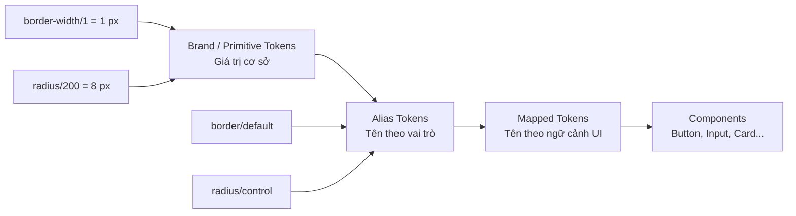
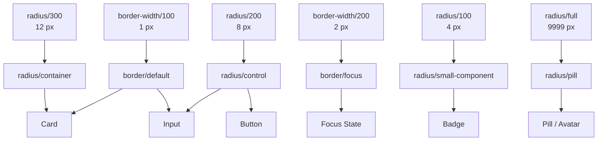

# 011 — Border Width & Radius Variables

## 1. Thông tin bài học

| Thuộc tính              | Nội dung                                                              |
| ----------------------- | --------------------------------------------------------------------- |
| **Module**              | Design Tokens & Variables Setup                                       |
| **Thời điểm bắt đầu**   | 33:12 trong video đầy đủ                                              |
| **Chủ đề chính**        | Thiết lập biến chiều rộng đường viền và bán kính bo góc               |
| **Lớp token liên quan** | Brand Primitives và Alias Tokens                                      |
| **Mục tiêu**            | Hoàn thiện hệ thống token mô tả hình dạng và đường viền của giao diện |

---

## 2. Tổng quan

Bài học này bổ sung hai nhóm token quan trọng vào nền tảng của Design System:

1. **Border Width** — độ dày của đường viền.
2. **Border Radius** — mức độ bo tròn của góc.

Hai nhóm token này tạo thành **shape vocabulary** — bộ từ vựng hình dạng dùng chung cho toàn bộ hệ thống giao diện.

Thay vì nhập trực tiếp các giá trị như:

```text
1 px
2 px
4 px
8 px
16 px
```

trên từng component, chúng ta lưu chúng thành các biến có tổ chức trong Figma.

Ví dụ:

```text
border-width/0
border-width/1
border-width/2

radius/none
radius/sm
radius/md
radius/lg
radius/full
```

Sau đó, các Alias Token sẽ tham chiếu đến những giá trị nguyên thủy này theo mục đích sử dụng.

---

## 3. Bối cảnh trong kiến trúc token

Hệ thống token đang được xây dựng theo nhiều lớp:



### Vai trò của từng lớp

| Lớp           | Ví dụ                                  | Ý nghĩa                          |
| ------------- | -------------------------------------- | -------------------------------- |
| **Primitive** | `border-width/100 = 1 px`              | Lưu giá trị số thực tế           |
| **Alias**     | `border/default → border-width/100`    | Diễn tả vai trò chung            |
| **Mapped**    | `button/border-width → border/default` | Diễn tả mục đích trong component |
| **Component** | Button sử dụng `button/border-width`   | Áp dụng token vào giao diện      |

Nhờ cấu trúc này, component không cần biết giá trị thực tế là `1 px` hay `2 px`.

---

# 4. Border Width Variables

## 4.1. Border Width là gì?

Border Width là độ dày của đường bao quanh một đối tượng giao diện.

Nó thường được sử dụng cho:

* Input field
* Button dạng outline
* Card
* Divider
* Checkbox
* Radio button
* Focus ring
* Trạng thái lỗi hoặc cảnh báo
* Đường phân cách giữa các khu vực

---

## 4.2. Tại sao cần Border Width Token?

Nếu mỗi designer tự nhập độ dày đường viền, hệ thống có thể xuất hiện nhiều giá trị gần giống nhau:

```text
1 px
1.2 px
1.5 px
2 px
2.5 px
3 px
```

Điều này gây ra:

* Giao diện thiếu nhất quán.
* Khó quản lý component.
* Khó thay đổi toàn hệ thống.
* Khó chuyển token sang code.
* Designer và developer sử dụng các giá trị khác nhau.

Border Width Token giới hạn số lượng giá trị được phép sử dụng.

---

## 4.3. Ví dụ thang Border Width

Đây là một thang đo tham khảo:

| Primitive token       | Giá trị | Mục đích thông thường                      |
| --------------------- | ------: | ------------------------------------------ |
| `border-width/none`   |  `0 px` | Không có đường viền                        |
| `border-width/thin`   |  `1 px` | Border mặc định                            |
| `border-width/medium` |  `2 px` | Border nhấn mạnh hoặc trạng thái focus     |
| `border-width/thick`  |  `4 px` | Indicator, accent hoặc trạng thái đặc biệt |

Có thể sử dụng tên dạng số:

```text
border-width/0
border-width/100
border-width/200
border-width/400
```

Hoặc tên theo kích thước:

```text
border-width/none
border-width/thin
border-width/medium
border-width/thick
```

Điều quan trọng nhất là chọn một quy ước và sử dụng nhất quán.

> Các giá trị trên là ví dụ triển khai phổ biến. Đoạn transcript được cung cấp mới bắt đầu phần Border Width và chưa thể hiện đầy đủ các giá trị cụ thể trong khóa học.

---

## 4.4. Giá trị `none`

Trong transcript, giảng viên bắt đầu bằng giá trị tương ứng với trạng thái **không có đường viền**.

Ví dụ:

```text
border-width/none = 0
```

Token này hữu ích vì component vẫn có thể tham chiếu đến một biến thay vì phải xóa thuộc tính border hoàn toàn.

Ví dụ:

```text
Button Filled:
border-width = border-width/none

Button Outlined:
border-width = border-width/thin
```

Điều này giúp component thay đổi variant dễ dàng hơn.

---

# 5. Border Radius Variables

## 5.1. Border Radius là gì?

Border Radius xác định mức độ bo tròn tại các góc của một đối tượng.

Ví dụ:

```text
0 px    → góc vuông
4 px    → bo nhẹ
8 px    → bo trung bình
16 px   → bo lớn
9999 px → dạng pill hoặc hình tròn
```

Border Radius thường được sử dụng cho:

* Button
* Input
* Card
* Modal
* Badge
* Tag
* Avatar
* Tooltip
* Image container
* Bottom sheet

---

## 5.2. Tại sao Border Radius là một phần của Design System?

Độ bo góc ảnh hưởng trực tiếp đến tính cách thị giác của sản phẩm.

| Phong cách           | Đặc điểm radius           |
| -------------------- | ------------------------- |
| Nghiêm túc, kỹ thuật | Góc vuông hoặc bo rất nhẹ |
| Hiện đại, thân thiện | Bo trung bình             |
| Trẻ trung, mềm mại   | Bo lớn                    |
| Pill-based UI        | Radius rất lớn hoặc full  |

Nếu mỗi component dùng một giá trị radius riêng, sản phẩm sẽ thiếu một ngôn ngữ hình dạng thống nhất.

---

## 5.3. Ví dụ thang Border Radius

| Primitive token |   Giá trị | Cách sử dụng tham khảo |
| --------------- | --------: | ---------------------- |
| `radius/none`   |    `0 px` | Góc vuông              |
| `radius/xs`     |    `2 px` | Thành phần rất nhỏ     |
| `radius/sm`     |    `4 px` | Badge hoặc control nhỏ |
| `radius/md`     |    `8 px` | Button, input          |
| `radius/lg`     |   `12 px` | Card                   |
| `radius/xl`     |   `16 px` | Modal hoặc panel lớn   |
| `radius/full`   | `9999 px` | Pill, avatar tròn      |

Một hệ thống khác có thể dùng thang số:

```text
radius/0
radius/100
radius/200
radius/300
radius/400
radius/full
```

---

## 5.4. Radius tương đối và radius cố định

Có hai cách tổ chức phổ biến.

### Cách 1: Theo kích thước

```text
radius/sm
radius/md
radius/lg
```

Ưu điểm:

* Dễ hiểu.
* Dễ áp dụng nhanh.
* Phù hợp với hệ thống nhỏ và vừa.

Hạn chế:

* Ý nghĩa `md` hoặc `lg` có thể không rõ khi Design System phát triển lớn.

### Cách 2: Theo vai trò

```text
radius/control
radius/card
radius/modal
radius/pill
```

Ưu điểm:

* Dễ hiểu trong ngữ cảnh component.
* Có thể thay đổi giá trị của từng nhóm độc lập.

Hạn chế:

* Có thể tạo nhiều token trùng giá trị.
* Cần quy tắc đặt tên rõ ràng.

Giải pháp phù hợp là kết hợp hai lớp:

```text
Primitive:
radius/200 = 8 px

Alias:
radius/control → radius/200
radius/card → radius/300
```

---

# 6. Tạo Alias cho Shape Token

Primitive Token mô tả **giá trị**, còn Alias Token mô tả **vai trò**.

## Ví dụ Border Width

```text
Primitive:
border-width/0      = 0 px
border-width/100    = 1 px
border-width/200    = 2 px

Alias:
border/none         → border-width/0
border/default      → border-width/100
border/emphasis     → border-width/200
border/focus        → border-width/200
```

## Ví dụ Border Radius

```text
Primitive:
radius/0            = 0 px
radius/100          = 4 px
radius/200          = 8 px
radius/300          = 12 px
radius/full         = 9999 px

Alias:
radius/control      → radius/200
radius/container    → radius/300
radius/badge        → radius/100
radius/pill         → radius/full
```

---

## 6.1. Sơ đồ tham chiếu token



---

# 7. Quy trình thực hiện trong Figma

## Bước 1: Mở Brand Collection

Mở collection đang chứa các primitive token như:

* Color
* Spacing
* Sizing
* Typography
* Border Width
* Border Radius

---

## Bước 2: Tạo nhóm Border Width

Tạo các biến kiểu **Number**:

```text
border-width/none
border-width/thin
border-width/medium
border-width/thick
```

Gán giá trị tương ứng, chẳng hạn:

```text
0
1
2
4
```

---

## Bước 3: Tạo nhóm Border Radius

Tiếp tục tạo các biến kiểu **Number**:

```text
radius/none
radius/sm
radius/md
radius/lg
radius/full
```

Gán các giá trị phù hợp với ngôn ngữ hình ảnh của sản phẩm.

---

## Bước 4: Mở Alias Collection

Trong Alias Collection, tạo các biến mô tả vai trò:

```text
border/default
border/emphasis
border/focus

radius/control
radius/container
radius/pill
```

---

## Bước 5: Tham chiếu về Brand Primitive

Không nhập lại giá trị số trong Alias Collection.

Ví dụ:

```text
border/default → border-width/thin
radius/control → radius/md
```

Điều này giữ cho Brand Collection là nguồn dữ liệu gốc duy nhất.

---

## Bước 6: Áp dụng vào component

Ví dụ với Button:

```text
Button border width:
border/default

Button border radius:
radius/control
```

Ví dụ với Card:

```text
Card border width:
border/default

Card border radius:
radius/container
```

---

## Bước 7: Kiểm tra liên kết

Cần xác minh:

* Alias có thực sự tham chiếu đến primitive hay không.
* Không có giá trị được nhập thủ công trong Alias.
* Component không sử dụng số hard-coded.
* Tên token có phản ánh đúng vai trò.
* Các token có hoạt động đúng giữa các mode hay không.

---

# 8. Ví dụ áp dụng vào hệ thống component

| Component       | Border Width Alias | Border Radius Alias      |
| --------------- | ------------------ | ------------------------ |
| Filled Button   | `border/none`      | `radius/control`         |
| Outlined Button | `border/default`   | `radius/control`         |
| Input mặc định  | `border/default`   | `radius/control`         |
| Input focus     | `border/focus`     | `radius/control`         |
| Card            | `border/default`   | `radius/container`       |
| Modal           | `border/none`      | `radius/container-large` |
| Badge           | `border/none`      | `radius/pill`            |
| Avatar          | `border/default`   | `radius/full`            |

---

# 9. Lợi ích của hệ thống token này

## 9.1. Tính nhất quán

Tất cả button, input và card sử dụng cùng một tập hợp giá trị được kiểm soát.

## 9.2. Dễ thay đổi toàn hệ thống

Giả sử toàn bộ sản phẩm cần chuyển từ giao diện bo tròn sang phong cách vuông vức hơn.

Thay vì chỉnh từng component:

```text
radius/control: 8 px → 4 px
radius/container: 12 px → 8 px
```

Mọi component tham chiếu đến các token này sẽ được cập nhật.

## 9.3. Dễ đồng bộ với code

Các token Figma có thể được chuyển thành CSS variables:

```css
:root {
  --border-width-none: 0;
  --border-width-thin: 1px;
  --border-width-medium: 2px;

  --radius-none: 0;
  --radius-sm: 4px;
  --radius-md: 8px;
  --radius-lg: 12px;
  --radius-full: 9999px;
}
```

Component có thể sử dụng:

```css
.button {
  border-width: var(--border-width-thin);
  border-radius: var(--radius-md);
}
```

## 9.4. Giảm hard-coded value

Designer và developer không cần tự chọn giá trị tùy ý cho từng trường hợp.

---

# 10. Rủi ro và hạn chế

## 10.1. Tạo quá nhiều mức radius

Một hệ thống có quá nhiều giá trị như:

```text
2, 3, 4, 5, 6, 7, 8, 10, 12, 14, 16 px
```

sẽ làm mất ý nghĩa của token.

Nên giới hạn số mức thực sự cần thiết.

---

## 10.2. Đặt tên quá phụ thuộc vào component

Tên như:

```text
radius/login-button
radius/home-card
radius/profile-modal
```

sẽ khiến hệ thống khó tái sử dụng.

Nên ưu tiên vai trò tổng quát:

```text
radius/control
radius/container
radius/overlay
radius/pill
```

---

## 10.3. Alias không thực sự tham chiếu Primitive

Một lỗi phổ biến là nhập trực tiếp:

```text
radius/control = 8 px
```

thay vì:

```text
radius/control → radius/200
```

Khi đó Alias trở thành một bản sao giá trị và không còn kết nối với primitive.

---

## 10.4. Dùng cùng một radius cho mọi component

Button, card, modal và badge có kích thước khác nhau. Một radius duy nhất có thể không tạo ra cảm giác thị giác đồng nhất.

Radius nên được lựa chọn dựa trên:

* Kích thước component.
* Chiều cao component.
* Phong cách thương hiệu.
* Mức độ nổi bật.
* Mối quan hệ giữa component cha và component con.

---

## 10.5. `radius/full` không phải lúc nào cũng tạo hình tròn

Giá trị radius rất lớn chỉ tạo hình tròn khi chiều rộng và chiều cao của đối tượng bằng nhau.

```text
40 × 40 + radius/full → hình tròn
80 × 40 + radius/full → hình pill
```

---

# 11. Trả lời câu hỏi ôn tập

## Câu 1: Mục đích chính của Border Width & Radius Variables là gì?

Mục đích chính là hoàn thiện bộ token nền tảng dùng để mô tả hình dạng của giao diện.

Border Width Variables kiểm soát độ dày đường viền, còn Border Radius Variables kiểm soát độ bo góc. Khi được tổ chức thành primitive và alias, chúng giúp toàn bộ component sử dụng cùng một ngôn ngữ hình dạng và tránh các giá trị hard-coded.

---

## Câu 2: Áp dụng nội dung này vào Design System Figma thực tế như thế nào?

Có thể áp dụng theo quy trình:

1. Xác định một thang Border Width nhỏ và có kiểm soát.
2. Xác định thang Border Radius phù hợp với phong cách thương hiệu.
3. Tạo chúng dưới dạng Number Variables trong Brand Collection.
4. Tạo Alias Token theo vai trò sử dụng.
5. Cho các Alias tham chiếu đến Brand Primitive.
6. Áp dụng Alias vào Button, Input, Card, Modal, Badge và các component khác.
7. Kiểm tra để bảo đảm component không sử dụng giá trị thủ công.

Ví dụ:

```text
Brand:
radius/200 = 8 px

Alias:
radius/control → radius/200

Component:
button/radius → radius/control
input/radius  → radius/control
```

---

## Câu 3: Các bước hoặc ý tưởng chính trong bài học là gì?

Các ý tưởng chính gồm:

* Tạo thang Border Width.
* Bao gồm giá trị `none` để biểu diễn trạng thái không có border.
* Tạo thang Border Radius.
* Giới hạn số lượng giá trị để duy trì tính nhất quán.
* Tạo Alias Token theo vai trò.
* Liên kết Alias với Primitive thay vì sao chép giá trị.
* Áp dụng các token vào component.
* Kiểm tra toàn bộ liên kết alias-to-primitive.

---

## Câu 4: Rủi ro hoặc hạn chế cần lưu ý là gì?

Rủi ro lớn nhất là xây dựng quá nhiều giá trị hoặc đặt tên token không rõ mục đích.

Ngoài ra cần tránh:

* Nhập trực tiếp số vào component.
* Sao chép giá trị vào Alias thay vì tạo tham chiếu.
* Đặt tên token theo từng màn hình cụ thể.
* Dùng một radius cho tất cả component.
* Thay đổi primitive mà không kiểm tra ảnh hưởng trên toàn hệ thống.
* Tạo token nhưng không có tài liệu hướng dẫn sử dụng.

---

# 12. Checklist thực hành

* [ ] Có token `border-width/none`.
* [ ] Border Width chỉ có các mức thực sự cần thiết.
* [ ] Border Radius phản ánh đúng phong cách thương hiệu.
* [ ] Primitive Token sử dụng kiểu Number.
* [ ] Alias Token tham chiếu đến Primitive Token.
* [ ] Button không dùng border width hard-coded.
* [ ] Input có token riêng cho border mặc định và focus.
* [ ] Card và modal sử dụng radius theo vai trò.
* [ ] Có token dành cho pill hoặc hình tròn.
* [ ] Tên token có thể hiểu được mà không cần nhìn giá trị.
* [ ] Token có thể ánh xạ sang CSS hoặc code.
* [ ] Thay đổi primitive được kiểm thử trên tất cả component liên quan.

---

# 13. Tóm tắt bài học

**Border Width & Radius Variables** hoàn thiện lớp token cơ sở liên quan đến hình dạng của Design System.

Luồng triển khai chính là:

```text
Giá trị số
    ↓
Brand Primitive
    ↓
Alias theo vai trò
    ↓
Mapped Token theo component
    ↓
Button, Input, Card, Modal, Badge...
```

Nguyên tắc quan trọng nhất:

> Component nên sử dụng token theo mục đích, không nên phụ thuộc trực tiếp vào một giá trị số cụ thể.

Khi Border Width và Border Radius được token hóa đúng cách, Design System sẽ nhất quán hơn, dễ bảo trì hơn và có thể đồng bộ rõ ràng giữa Figma và code.
