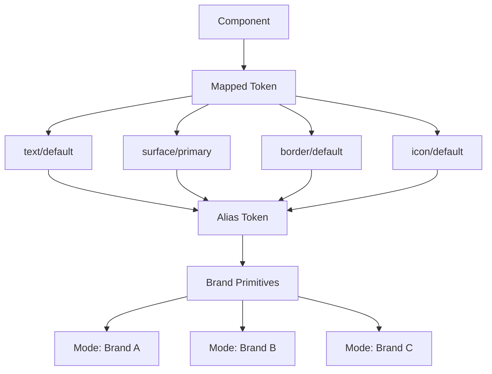
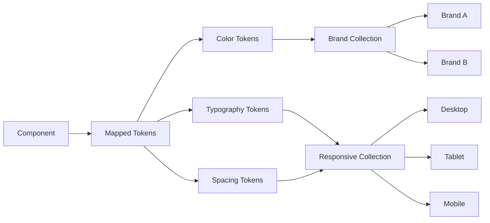
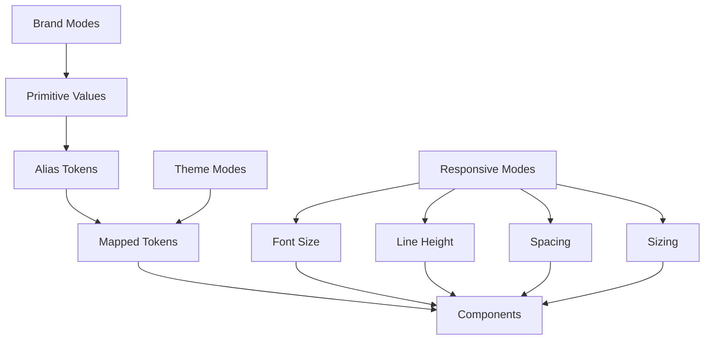

# 012 – Thiết lập hệ thống thiết kế đa thương hiệu

## Thông tin bài học

| Thuộc tính                | Nội dung                                                                                                                          |
| ------------------------- | --------------------------------------------------------------------------------------------------------------------------------- |
| **Module**                | Multi-Brand, Themes & Mapped Variables                                                                                            |
| **Thời điểm trong video** | 34:32                                                                                                                             |
| **Chủ đề chính**          | Thiết lập Figma Variables để một hệ thống thiết kế có thể phục vụ nhiều thương hiệu, nhiều giao diện và nhiều kích thước thiết bị |
| **Công cụ chính**         | Figma Variables, Variable Collections, Modes                                                                                      |
| **Mức độ**                | Trung cấp                                                                                                                         |

---

## 1. Tổng quan

Bài học giới thiệu cách tổ chức **Figma Variables** để một hệ thống thiết kế có thể:

* Hỗ trợ nhiều thương hiệu.
* Thay đổi giá trị thiết kế mà không phải xây lại component.
* Giữ các token ngữ nghĩa độc lập với từng thương hiệu.
* Mở rộng sang light mode, dark mode hoặc các theme khác.
* Điều chỉnh typography, spacing và sizing theo desktop, tablet và mobile.

Ý tưởng quan trọng nhất là:

> Component không nên phụ thuộc trực tiếp vào giá trị màu sắc hoặc kích thước cụ thể của một thương hiệu.

Thay vào đó, component sử dụng các token mang ý nghĩa như:

* `text/default`
* `surface/primary`
* `border/subtle`
* `icon/default`
* `action/primary`

Các token này sau đó được ánh xạ tới giá trị phù hợp với từng thương hiệu hoặc từng theme.

---

## 2. Vấn đề của hệ thống thiết kế chỉ có một thương hiệu

Trong một hệ thống thiết kế đơn giản, chúng ta có thể khai báo trực tiếp:

```text
Primary = #6C5CE7
Secondary = #00B894
Body Font = Inter
Border Radius = 8
```

Cách này có thể hoạt động khi sản phẩm chỉ có một thương hiệu.

Tuy nhiên, khi hệ thống cần hỗ trợ thêm một thương hiệu thứ hai, chúng ta có thể gặp các vấn đề:

* Phải tạo lại toàn bộ token.
* Phải sao chép component.
* Phải đổi màu thủ công.
* Các file thiết kế dễ bị lệch nhau.
* Việc bảo trì trở nên phức tạp.
* Component bị gắn chặt với một thương hiệu cụ thể.

Ví dụ:

| Thành phần    | Brand A |    Brand B |
| ------------- | ------: | ---------: |
| Màu chính     |     Tím | Xanh dương |
| Font tiêu đề  |   Inter |    Poppins |
| Border radius |    8 px |      16 px |
| Màu nền chính |   Trắng |   Xám nhạt |

Nếu component sử dụng trực tiếp màu tím của Brand A, component đó không thể chuyển sang Brand B một cách linh hoạt.

---

## 3. Giải pháp: sử dụng Variable Modes

Trong Figma, một collection có thể có nhiều **mode**.

Mỗi mode đại diện cho một tập giá trị khác nhau nhưng vẫn dùng chung tên biến.

Ví dụ, collection `Brand` có hai mode:

* `Brand A`
* `Brand B`

Biến:

```text
color/primary/500
```

có thể mang các giá trị khác nhau:

| Variable            |   Brand A |   Brand B |
| ------------------- | --------: | --------: |
| `color/primary/500` | `#6C5CE7` | `#1473E6` |
| `color/primary/600` | `#5A4BCF` | `#0D5FC2` |
| `color/neutral/900` | `#1F1F1F` | `#102A43` |

Khi chuyển mode, Figma tự động đổi giá trị mà không cần thay đổi tên token hoặc component.

---

## 4. Sơ đồ hệ thống đa thương hiệu



Component chỉ tham chiếu đến các token ngữ nghĩa.

Khi đổi mode từ Brand A sang Brand B:

```text
Component
   ↓
Mapped token không đổi
   ↓
Alias token không đổi
   ↓
Giá trị primitive thay đổi theo Brand Mode
```

---

## 5. Kiến trúc token ba tầng

Một cách tổ chức phổ biến là sử dụng ba tầng:

```text
Brand → Alias → Mapped
```

### 5.1. Brand Collection

Brand Collection chứa các giá trị nguyên thủy, còn gọi là **primitive token**.

Ví dụ:

```text
brand/color/blue/500
brand/color/gray/900
brand/font/family/sans
brand/spacing/16
brand/radius/medium
```

Đây là các giá trị cụ thể:

```text
brand/color/blue/500 = #1473E6
brand/spacing/16 = 16
brand/radius/medium = 8
```

Brand Collection trả lời câu hỏi:

> Hệ thống đang có những giá trị cơ sở nào?

---

### 5.2. Alias Collection

Alias Collection đặt tên cho token dựa trên vai trò ngữ nghĩa.

Ví dụ:

```text
alias/color/primary
alias/color/neutral
alias/color/danger
alias/color/success
```

Các token Alias tham chiếu đến Brand Primitive:

```text
alias/color/primary
→ brand/color/blue/500
```

Alias Collection trả lời câu hỏi:

> Giá trị này đóng vai trò gì trong hệ thống?

---

### 5.3. Mapped Collection

Mapped Collection mô tả mục đích sử dụng cụ thể trong giao diện.

Ví dụ:

```text
text/default
text/heading
text/disabled

surface/page
surface/card
surface/primary

border/default
border/focus

icon/default
icon/primary
```

Mapped Collection trả lời câu hỏi:

> Token này được sử dụng ở vị trí nào trong giao diện?

---

## 6. Ví dụ ánh xạ đầy đủ

```text
Button background
       ↓
surface/action-primary
       ↓
alias/color/primary
       ↓
brand/color/blue/500
       ↓
#1473E6
```

Với Brand A:

```text
surface/action-primary
→ alias/color/primary
→ brand/color/purple/500
→ #6C5CE7
```

Với Brand B:

```text
surface/action-primary
→ alias/color/primary
→ brand/color/blue/500
→ #1473E6
```

Component Button vẫn sử dụng:

```text
surface/action-primary
```

Component không cần biết màu cuối cùng là tím hay xanh.

---

## 7. Giữ Alias và Mapped độc lập với thương hiệu

Một nguyên tắc quan trọng của hệ thống đa thương hiệu là:

> Alias và Mapped token nên được đặt tên theo ý nghĩa, không đặt theo tên thương hiệu hoặc màu sắc cụ thể.

### Không nên

```text
text/brand-a-purple
button/brand-b-blue
surface/company-x
```

Các tên này làm cho token phụ thuộc vào từng thương hiệu.

### Nên sử dụng

```text
text/default
text/brand
surface/primary
action/primary
border/focus
```

Tên token không đổi khi chuyển thương hiệu.

Chỉ giá trị mà token tham chiếu mới thay đổi.

---

## 8. Các cách tổ chức typography token

Trong phần transcript, người hướng dẫn thảo luận nhiều cách khác nhau để tổ chức typography, spacing và sizing.

Không có một cấu trúc duy nhất phù hợp với tất cả hệ thống.

Có ba cách tiếp cận chính.

---

### Cách 1: Kiến trúc ba tầng đầy đủ

```text
Brand → Alias → Mapped
```

Ví dụ:

```text
Brand:
size/16 = 16
size/24 = 24
size/32 = 32

Alias:
font-size/body = size/16
font-size/heading-sm = size/24
font-size/heading-md = size/32

Mapped:
text/body = font-size/body
text/card-title = font-size/heading-sm
text/page-title = font-size/heading-md
```

#### Ưu điểm

* Cấu trúc rõ ràng.
* Phân tách primitive, semantic và usage.
* Dễ mở rộng trong hệ thống lớn.
* Dễ thay đổi giá trị gốc.

#### Hạn chế

* Có nhiều tầng tham chiếu.
* Người mới khó hiểu.
* Quản lý typography có thể trở nên quá phức tạp.
* Việc tìm token phù hợp mất nhiều thời gian.

---

### Cách 2: Bỏ qua Alias Collection

Một số nhóm sử dụng:

```text
Brand → Mapped
```

Ví dụ:

```text
Brand:
font-size/16
font-size/24
line-height/24
line-height/32

Mapped:
text/body/font-size → font-size/16
text/heading/font-size → font-size/24
```

#### Ưu điểm

* Ít tầng hơn.
* Dễ thiết lập.
* Dễ sử dụng với nhóm nhỏ.

#### Hạn chế

* Mapped Collection phụ thuộc gần hơn vào primitive.
* Khó tái sử dụng semantic token.
* Có thể làm kiến trúc kém nhất quán khi hệ thống mở rộng.

Cách này không hoàn toàn sai, nhưng nó không tuân thủ đầy đủ kiến trúc ba tầng.

---

### Cách 3: Responsive Collection riêng

Cách tiếp cận được người hướng dẫn đề xuất là tạo một collection riêng có tên:

```text
Responsive
```

Collection này chứa:

* Font size.
* Line height.
* Spacing.
* Paragraph spacing.
* Component sizing.
* Layout sizing.

Các mode có thể là:

```text
Desktop
Tablet
Mobile
```

Ví dụ:

| Variable               | Desktop | Tablet | Mobile |
| ---------------------- | ------: | -----: | -----: |
| `font-size/body`       |      16 |     16 |     16 |
| `font-size/heading-xl` |      64 |     48 |     36 |
| `spacing/page-x`       |      80 |     40 |     20 |
| `spacing/section-y`    |      96 |     72 |     48 |
| `size/button-height`   |      48 |     48 |     44 |

---

## 9. Tại sao cần Responsive Collection?

Một thang typography hoạt động tốt trên desktop có thể không phù hợp trên mobile.

Ví dụ:

```text
Desktop heading: 64 px
Mobile heading: 64 px
```

Trên mobile, heading 64 px có thể:

* Chiếm quá nhiều diện tích.
* Xuống dòng không hợp lý.
* Làm mất cân bằng bố cục.
* Đẩy nội dung chính xuống dưới.
* Giảm khả năng đọc.

Responsive Collection cho phép giữ cùng tên biến:

```text
font-size/heading-xl
```

nhưng đổi giá trị theo thiết bị:

```text
Desktop = 64
Tablet = 48
Mobile = 36
```

Component chỉ cần tham chiếu đến một token.

---

## 10. Sơ đồ kết hợp Brand Mode và Responsive Mode



Trong kiến trúc này:

* Brand mode kiểm soát nhận diện thương hiệu.
* Theme mode kiểm soát light/dark.
* Responsive mode kiểm soát kích thước theo thiết bị.
* Component vẫn sử dụng token ngữ nghĩa.

---

## 11. Cách tạo Brand Mode trong Figma

### Bước 1: Mở Variable Collection

Mở collection chứa các primitive token của thương hiệu, ví dụ:

```text
Brand
```

---

### Bước 2: Đổi tên mode mặc định

Đổi tên mode hiện tại thành:

```text
Brand A
```

Có thể sử dụng tên thương hiệu thực tế, ví dụ:

```text
Lumina
Nova
Enterprise
Consumer
```

---

### Bước 3: Thêm mode mới

Chọn chức năng thêm mode và đặt tên:

```text
Brand B
```

Lúc này, mỗi variable có hai cột giá trị:

```text
Brand A | Brand B
```

---

### Bước 4: Điền primitive value cho Brand B

Ví dụ:

| Variable              |   Brand A |   Brand B |
| --------------------- | --------: | --------: |
| `color/primary/500`   | `#7C3AED` | `#1473E6` |
| `color/secondary/500` | `#EC4899` | `#10B981` |
| `font/family/body`    |     Inter |    Roboto |
| `radius/card`         |        12 |         4 |

---

### Bước 5: Kiểm tra Alias Collection

Đảm bảo Alias Collection chỉ tham chiếu đến các primitive variable.

Ví dụ:

```text
alias/color/primary
→ brand/color/primary/500
```

Không nhập trực tiếp mã màu vào Alias Collection nếu mục tiêu là hỗ trợ nhiều thương hiệu.

---

### Bước 6: Kiểm tra Mapped Collection

Mapped token nên tham chiếu đến Alias token:

```text
surface/primary
→ alias/color/primary
```

```text
text/brand
→ alias/color/primary
```

---

### Bước 7: Áp dụng mode lên frame

Chọn frame hoặc page cần kiểm tra.

Sau đó chọn mode:

```text
Brand A
```

hoặc:

```text
Brand B
```

Nếu hệ thống được thiết lập đúng, toàn bộ giao diện sẽ đổi thương hiệu mà không cần chỉnh từng component.

---

## 12. Ví dụ cấu trúc collection đề xuất

```text
Variables
│
├── Brand
│   ├── Modes
│   │   ├── Brand A
│   │   └── Brand B
│   │
│   ├── color
│   │   ├── primary
│   │   │   ├── 50
│   │   │   ├── 100
│   │   │   └── 900
│   │   ├── neutral
│   │   ├── success
│   │   ├── warning
│   │   └── danger
│   │
│   ├── font
│   │   ├── family
│   │   └── weight
│   │
│   └── radius
│
├── Alias
│   ├── color
│   │   ├── primary
│   │   ├── secondary
│   │   ├── neutral
│   │   ├── success
│   │   ├── warning
│   │   └── danger
│   └── typography
│
├── Mapped
│   ├── text
│   ├── icon
│   ├── surface
│   ├── border
│   └── action
│
└── Responsive
    ├── Modes
    │   ├── Desktop
    │   ├── Tablet
    │   └── Mobile
    │
    ├── font-size
    ├── line-height
    ├── spacing
    ├── paragraph-spacing
    └── sizing
```

---

## 13. Thiết lập Responsive Collection

### Bước 1: Tạo collection mới

Đặt tên:

```text
Responsive
```

---

### Bước 2: Tạo ba mode

```text
Desktop
Tablet
Mobile
```

Trong một số dự án, có thể sử dụng:

```text
Large
Medium
Small
```

Tên mode phải phù hợp với cách nhóm thiết kế và lập trình giao tiếp với nhau.

---

### Bước 3: Tạo nhóm Font Size

Ví dụ:

```text
font-size/body-sm
font-size/body-md
font-size/body-lg

font-size/heading-sm
font-size/heading-md
font-size/heading-lg
font-size/heading-xl
```

---

### Bước 4: Bắt đầu từ body font size

Người hướng dẫn đề xuất bắt đầu với body text:

```text
font-size/body-md = 16
```

16 px thường là điểm khởi đầu an toàn cho nội dung chính.

Văn bản nhỏ hơn 16 px vẫn có thể được sử dụng, nhưng cần kiểm tra kỹ:

* Khả năng đọc.
* Mức tương phản.
* Độ dày font.
* Khoảng cách dòng.
* Thiết bị hiển thị.
* Tiêu chuẩn accessibility.

---

### Bước 5: Xây dựng scale xung quanh body size

Ví dụ:

| Token                  | Desktop | Tablet | Mobile |
| ---------------------- | ------: | -----: | -----: |
| `font-size/caption`    |      12 |     12 |     12 |
| `font-size/body-sm`    |      14 |     14 |     14 |
| `font-size/body-md`    |      16 |     16 |     16 |
| `font-size/body-lg`    |      18 |     18 |     18 |
| `font-size/heading-sm` |      24 |     22 |     20 |
| `font-size/heading-md` |      32 |     28 |     24 |
| `font-size/heading-lg` |      48 |     40 |     32 |
| `font-size/heading-xl` |      64 |     48 |     36 |

---

### Bước 6: Thêm Line Height

Ví dụ:

| Token                    | Desktop | Tablet | Mobile |
| ------------------------ | ------: | -----: | -----: |
| `line-height/body-md`    |      24 |     24 |     24 |
| `line-height/heading-sm` |      32 |     30 |     28 |
| `line-height/heading-md` |      40 |     36 |     32 |
| `line-height/heading-xl` |      72 |     56 |     44 |

Không nên chỉ thay font size mà quên điều chỉnh line height.

---

### Bước 7: Thêm Spacing

Ví dụ:

```text
spacing/page-x
spacing/section-y
spacing/content-gap
spacing/card-padding
spacing/component-gap
```

| Token                  | Desktop | Tablet | Mobile |
| ---------------------- | ------: | -----: | -----: |
| `spacing/page-x`       |      80 |     40 |     20 |
| `spacing/section-y`    |      96 |     72 |     48 |
| `spacing/card-padding` |      32 |     24 |     20 |
| `spacing/content-gap`  |      24 |     20 |     16 |

---

## 14. Ứng dụng vào một hệ thống thiết kế thực tế

Giả sử một công ty có hai sản phẩm:

* Ứng dụng khách hàng cá nhân.
* Dashboard dành cho doanh nghiệp.

Hai sản phẩm sử dụng cùng component library nhưng có nhận diện khác nhau.

### Collection Brand

```text
Mode 1: Consumer
Mode 2: Enterprise
```

### Collection Theme

```text
Mode 1: Light
Mode 2: Dark
```

### Collection Responsive

```text
Mode 1: Desktop
Mode 2: Tablet
Mode 3: Mobile
```

### Component

```text
Button/Primary
```

Button sử dụng:

```text
Background: surface/action-primary
Text: text/on-primary
Radius: radius/action
Height: size/button-height
Horizontal padding: spacing/button-x
```

Kết quả:

```text
Consumer + Light + Mobile
Enterprise + Light + Desktop
Consumer + Dark + Desktop
Enterprise + Dark + Tablet
```

Tất cả có thể dùng chung một Button component.

---

## 15. Những lỗi thường gặp

### 15.1. Dùng tên màu trong Mapped Token

Không nên:

```text
button/background/blue
text/purple
border/gray
```

Nên:

```text
button/background/primary
text/brand
border/subtle
```

Mapped token cần mô tả mục đích sử dụng, không mô tả giá trị.

---

### 15.2. Gán mã màu trực tiếp vào component

Không nên:

```text
Button background = #1473E6
```

Nên:

```text
Button background = surface/action-primary
```

---

### 15.3. Sao chép component cho từng thương hiệu

Không nên tạo:

```text
Button/Brand-A
Button/Brand-B
Button/Brand-C
```

Trừ khi các thương hiệu có cấu trúc hoặc hành vi hoàn toàn khác nhau.

Trong phần lớn trường hợp, chỉ nên có:

```text
Button
```

và sử dụng mode để thay đổi giao diện.

---

### 15.4. Đưa tất cả loại mode vào cùng một collection

Brand, theme và responsive là các chiều thay đổi khác nhau.

Nếu đưa tất cả vào một collection, có thể phải tạo rất nhiều mode kết hợp:

```text
Brand A Light Desktop
Brand A Light Mobile
Brand A Dark Desktop
Brand A Dark Mobile
Brand B Light Desktop
Brand B Light Mobile
...
```

Số lượng mode sẽ tăng rất nhanh.

Nên tách thành:

```text
Brand Collection
Theme Collection
Responsive Collection
```

---

### 15.5. Xây dựng quá nhiều tầng không cần thiết

Kiến trúc ba tầng rất mạnh nhưng không phải lúc nào cũng cần áp dụng cứng nhắc cho mọi loại token.

Ví dụ, typography có thể trở nên khó quản lý nếu phải đi qua quá nhiều tầng:

```text
Primitive
→ Alias
→ Mapped
→ Text Style
→ Component
```

Hệ thống nên đủ rõ ràng để mở rộng nhưng cũng phải dễ sử dụng.

---

## 16. Rủi ro và hạn chế

### 16.1. Độ phức tạp của kiến trúc

Khi có nhiều collection và mode, người mới có thể khó hiểu mối quan hệ giữa các token.

Cần có tài liệu giải thích:

* Token nào thuộc collection nào.
* Token nào được phép tham chiếu tới token nào.
* Khi nào tạo primitive mới.
* Khi nào tạo semantic token mới.
* Khi nào sử dụng mode.

---

### 16.2. Khó đồng bộ với code

Tên token trong Figma và code cần nhất quán.

Ví dụ Figma:

```text
surface/action-primary
```

Trong code có thể được chuyển thành:

```css
--surface-action-primary
```

hoặc:

```ts
tokens.surface.actionPrimary
```

Nếu tên token thay đổi liên tục, quá trình đồng bộ design-to-code sẽ gặp khó khăn.

---

### 16.3. Mode không thay thế hoàn toàn component variant

Mode phù hợp để thay đổi giá trị toàn hệ thống như:

* Màu.
* Font.
* Spacing.
* Sizing.
* Theme.
* Brand.

Component variant phù hợp với trạng thái hoặc cấu trúc:

* Default.
* Hover.
* Pressed.
* Disabled.
* Small.
* Medium.
* Large.
* Icon left.
* Icon right.

Không nên dùng mode để thay thế mọi variant của component.

---

### 16.4. Khác biệt thương hiệu quá lớn

Nếu hai thương hiệu chỉ khác:

* Màu.
* Font.
* Border radius.
* Spacing nhỏ.

Chúng có thể dùng chung component.

Tuy nhiên, nếu hai thương hiệu có:

* Cấu trúc component khác nhau.
* Hành vi khác nhau.
* Bố cục khác nhau.
* Quy tắc tương tác khác nhau.

Việc ép chúng vào cùng một component có thể làm component quá phức tạp.

---

## 17. Nguyên tắc lựa chọn kiến trúc

Không có một cách tổ chức phù hợp với mọi hệ thống thiết kế.

Có thể lựa chọn dựa trên độ trưởng thành của dự án.

### Hệ thống nhỏ

Có thể sử dụng:

```text
Brand → Mapped
```

Phù hợp khi:

* Nhóm nhỏ.
* Ít component.
* Chỉ có một hoặc hai sản phẩm.
* Không cần nhiều theme.

---

### Hệ thống đang phát triển

Có thể sử dụng:

```text
Brand → Alias → Mapped
```

Phù hợp khi:

* Có nhiều nhóm sản phẩm.
* Có nhiều thương hiệu.
* Cần kiểm soát semantic token.
* Cần chia sẻ component library.

---

### Hệ thống lớn

Có thể tách theo các chiều:

```text
Brand Collection
Alias Collection
Mapped Collection
Theme Collection
Responsive Collection
Motion Collection
Data Visualization Collection
```

Tuy nhiên, chỉ nên tạo collection mới khi nó giải quyết một nhu cầu rõ ràng.

---

## 18. Checklist triển khai

### Brand Collection

* [ ] Đã tạo mode cho từng thương hiệu.
* [ ] Các mode sử dụng cùng một danh sách variable.
* [ ] Mỗi thương hiệu có đủ color scale.
* [ ] Font family và font weight đã được xác định.
* [ ] Border radius và shape token đã được xác định.

### Alias Collection

* [ ] Alias token có tên ngữ nghĩa.
* [ ] Alias token không chứa tên thương hiệu.
* [ ] Alias token tham chiếu đến Brand Primitive.
* [ ] Không lặp lại mã màu trực tiếp.

### Mapped Collection

* [ ] Có token cho text.
* [ ] Có token cho surface.
* [ ] Có token cho icon.
* [ ] Có token cho border.
* [ ] Có token cho action.
* [ ] Component sử dụng Mapped Token.

### Responsive Collection

* [ ] Có mode Desktop.
* [ ] Có mode Tablet.
* [ ] Có mode Mobile.
* [ ] Font size thay đổi hợp lý theo thiết bị.
* [ ] Line height được điều chỉnh cùng font size.
* [ ] Spacing và sizing được kiểm tra trên từng breakpoint.

### Kiểm thử

* [ ] Chuyển Brand Mode không làm hỏng component.
* [ ] Chuyển Light/Dark Mode vẫn bảo đảm độ tương phản.
* [ ] Chuyển Mobile Mode không gây tràn nội dung.
* [ ] Tên token nhất quán với code.
* [ ] Không có giá trị hard-code trong component chính.

---

## 19. Trả lời câu hỏi ôn tập

### Câu 1: Mục đích chính của Multi-Brand Design System Setup là gì?

Mục đích chính là xây dựng một hệ thống thiết kế có thể phục vụ nhiều thương hiệu bằng cùng một bộ component và cùng một cấu trúc token.

Mỗi thương hiệu có thể có:

* Màu riêng.
* Font riêng.
* Radius riêng.
* Một số primitive value riêng.

Tuy nhiên, Alias và Mapped Token vẫn giữ nguyên để component không phụ thuộc vào từng thương hiệu.

---

### Câu 2: Áp dụng vào một hệ thống Figma thực tế như thế nào?

Các bước cơ bản:

1. Tạo Brand Collection.
2. Tạo một mode cho mỗi thương hiệu.
3. Khai báo primitive value cho từng mode.
4. Tạo Alias Token theo vai trò ngữ nghĩa.
5. Tạo Mapped Token theo mục đích sử dụng.
6. Gắn Mapped Token vào component.
7. Chuyển mode trên frame để kiểm thử.
8. Tạo Responsive Collection nếu typography và spacing cần thay đổi theo thiết bị.

---

### Câu 3: Các bước hoặc ý tưởng chính trong bài là gì?

Các ý tưởng chính gồm:

* Sử dụng Variable Modes để hỗ trợ nhiều thương hiệu.
* Giữ tên variable giống nhau giữa các thương hiệu.
* Để giá trị primitive thay đổi theo mode.
* Giữ Alias và Mapped Layer độc lập với thương hiệu.
* Không bắt buộc phải áp dụng kiến trúc ba tầng cho mọi loại token.
* Có thể tạo Responsive Collection riêng cho typography, spacing và sizing.
* Sử dụng desktop, tablet và mobile làm các responsive mode.
* Bắt đầu typography scale từ body font size khoảng 16 px.

---

### Câu 4: Rủi ro hoặc hạn chế cần lưu ý là gì?

Rủi ro lớn nhất là làm hệ thống trở nên quá phức tạp.

Nếu có quá nhiều collection, mode và tầng tham chiếu:

* Designer khó tìm token.
* Người mới khó hiểu hệ thống.
* Việc sửa lỗi mất thời gian.
* Đồng bộ với code khó hơn.
* Component có thể bị phụ thuộc sai tầng token.

Cần cân bằng giữa:

```text
Khả năng mở rộng
        và
Sự đơn giản khi sử dụng
```

---

## 20. Tóm tắt bài học

Multi-brand design system cho phép nhiều thương hiệu dùng chung một nền tảng component.

Kiến trúc tổng quát:

```text
Brand Primitive
      ↓
Semantic Alias
      ↓
Purpose-based Mapped Token
      ↓
Component
```

Mỗi thương hiệu được biểu diễn bằng một Variable Mode:

```text
Brand A
Brand B
Brand C
```

Component không sử dụng mã màu trực tiếp mà sử dụng token như:

```text
surface/primary
text/default
border/subtle
icon/brand
```

Bên cạnh đó, typography, spacing và sizing có thể được đưa vào một `Responsive Collection` riêng:

```text
Desktop
Tablet
Mobile
```

Cách tổ chức này giúp hệ thống:

* Dễ thay đổi thương hiệu.
* Dễ hỗ trợ light/dark theme.
* Dễ thích ứng với nhiều kích thước màn hình.
* Giảm việc sao chép component.
* Tăng khả năng tái sử dụng.
* Dễ mở rộng trong dài hạn.

---

## 21. Sơ đồ ghi nhớ cuối bài



### Công thức ghi nhớ

```text
Brand Mode
= Thương hiệu nào?

Theme Mode
= Giao diện sáng hay tối?

Responsive Mode
= Thiết bị hoặc kích thước màn hình nào?

Mapped Token
= Giá trị được dùng ở đâu?

Component
= Thành phần giao diện sử dụng các token trên.
```

---

# Bài luyện tập

## Mục tiêu


## Đề bài


## Yêu cầu hoàn thành

- [ ] 
- [ ] 
- [ ] 

## Kết quả / lời giải


## Ghi chú
