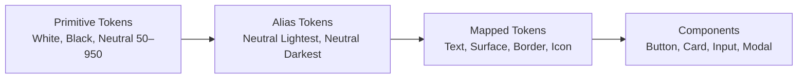
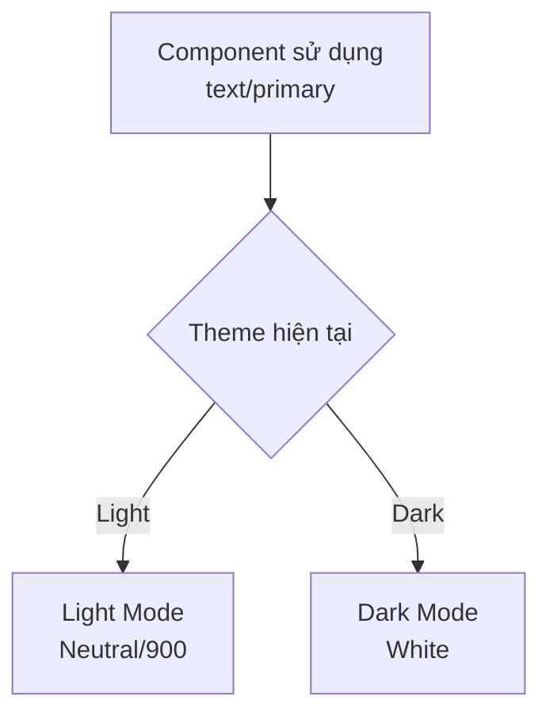
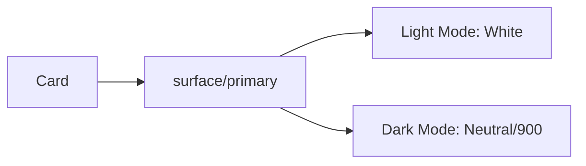
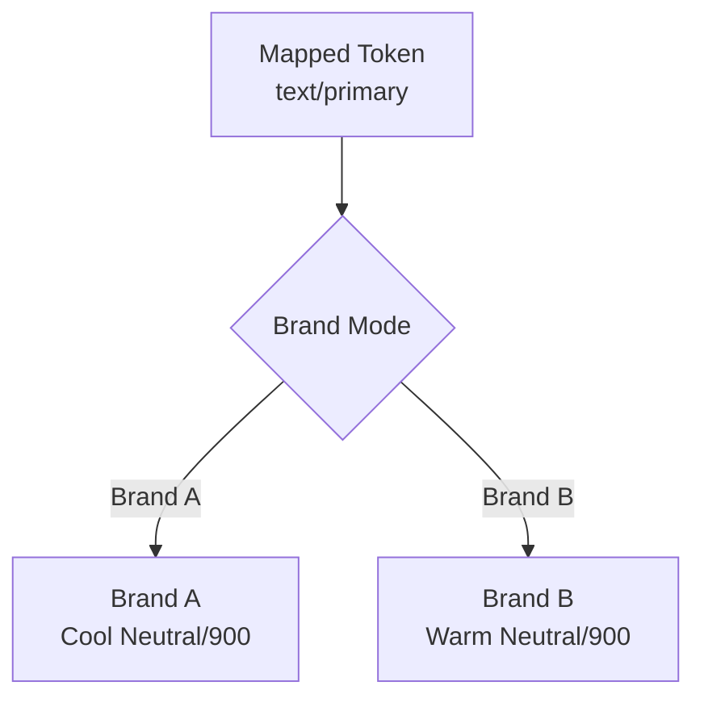

# 013 — Bổ sung màu Trắng và Đen

## Thông tin bài học

| Thuộc tính            | Nội dung                                                             |
| --------------------- | -------------------------------------------------------------------- |
| **Module**            | Multi-Brand, Themes & Mapped Variables                               |
| **Tên bài học**       | Adding White & Black                                                 |
| **Thời điểm bắt đầu** | `38:45` trong video đầy đủ                                           |
| **Chủ đề chính**      | Bổ sung màu trắng, màu đen tuyệt đối và mở rộng thang màu trung tính |

---

## 1. Tổng quan

Bài học này bổ sung hai giá trị màu cơ bản vào hệ thống Design Token:

* **Màu trắng tuyệt đối:** `#FFFFFF`
* **Màu đen tuyệt đối:** `#000000`

Đồng thời, bài học mở rộng **thang màu trung tính — Neutral Scale** để hệ thống có đủ mức độ tương phản dành cho:

* Nền giao diện
* Nội dung chữ
* Biểu tượng
* Đường viền
* Thành phần nổi
* Chế độ sáng
* Chế độ tối
* Nhiều thương hiệu khác nhau

Màu trắng và đen không nên được sử dụng trực tiếp trong component. Chúng nên được lưu ở tầng **Primitive**, sau đó được tham chiếu qua các tầng **Alias** và **Mapped Token**.

---

## 2. Mục tiêu bài học

Sau bài học này, bạn có thể:

1. Thêm màu trắng và đen tuyệt đối vào `Brand Collection`.
2. Mở rộng thang màu trung tính để hỗ trợ nhiều mức tương phản.
3. Phân biệt màu trung tính với màu thương hiệu.
4. Sử dụng màu trắng và đen thông qua Alias thay vì gán trực tiếp.
5. Chuẩn bị hệ thống màu cho Light Theme và Dark Theme.
6. Áp dụng các màu trung tính nhất quán cho text, surface, border và icon.

---

## 3. Vì sao cần màu trắng và đen tuyệt đối?

Một thang màu trung tính thông thường có thể trải dài từ `Neutral/50` đến `Neutral/900`. Tuy nhiên, hai đầu của thang màu này không nhất thiết là trắng hoặc đen tuyệt đối.

Ví dụ:

```text
Neutral/50  ≠  #FFFFFF
Neutral/900 ≠  #000000
```

`Neutral/50` có thể hơi ngả xám, xanh hoặc màu ấm. Tương tự, `Neutral/900` thường là màu xám rất đậm chứ không phải màu đen hoàn toàn.

Do đó, hệ thống vẫn cần hai Primitive riêng:

```text
White → #FFFFFF
Black → #000000
```

Hai giá trị này cung cấp mức tương phản tối đa khi thật sự cần thiết.

---

## 4. Vị trí của White và Black trong hệ thống token



### Nguyên tắc quan trọng

Component không nên sử dụng trực tiếp:

```text
White
Black
Neutral/900
```

Component nên sử dụng các token mô tả mục đích:

```text
text/default
surface/default
border/default
icon/default
```

Điều này giúp component tự thay đổi khi:

* Chuyển thương hiệu
* Chuyển Light Mode sang Dark Mode
* Thay đổi hệ thống màu trung tính
* Điều chỉnh độ tương phản
* Cập nhật tiêu chuẩn accessibility

---

## 5. Cấu trúc ba tầng token

### 5.1. Tầng Brand hoặc Primitive

Tầng Primitive lưu giá trị màu thực tế.

```text
Brand/
├── white
├── black
└── neutral/
    ├── 50
    ├── 100
    ├── 200
    ├── 300
    ├── 400
    ├── 500
    ├── 600
    ├── 700
    ├── 800
    ├── 900
    └── 950
```

Ví dụ:

| Primitive Token     | Giá trị minh họa |
| ------------------- | ---------------- |
| `brand/white`       | `#FFFFFF`        |
| `brand/black`       | `#000000`        |
| `brand/neutral/50`  | `#F8FAFC`        |
| `brand/neutral/100` | `#F1F5F9`        |
| `brand/neutral/500` | `#64748B`        |
| `brand/neutral/900` | `#0F172A`        |
| `brand/neutral/950` | `#020617`        |

> Các mã màu trên chỉ là ví dụ. Giá trị thực tế phụ thuộc vào từng thương hiệu.

---

### 5.2. Tầng Alias

Alias diễn đạt vai trò tương đối của màu thay vì giá trị cụ thể.

```text
Alias/
└── neutral/
    ├── lightest
    ├── lighter
    ├── light
    ├── default
    ├── dark
    ├── darker
    └── darkest
```

Ví dụ ánh xạ:

```text
alias/neutral/lightest → brand/white
alias/neutral/lighter  → brand/neutral/50
alias/neutral/default  → brand/neutral/500
alias/neutral/darker   → brand/neutral/900
alias/neutral/darkest  → brand/black
```

---

### 5.3. Tầng Mapped

Mapped Token mô tả mục đích sử dụng trong giao diện.

```text
Mapped/
├── text/
│   ├── primary
│   ├── secondary
│   ├── disabled
│   └── inverse
├── surface/
│   ├── page
│   ├── primary
│   ├── secondary
│   └── inverse
├── border/
│   ├── subtle
│   ├── default
│   └── strong
└── icon/
    ├── primary
    ├── secondary
    └── inverse
```

Ví dụ:

```text
mapped/text/primary
→ alias/neutral/darker
→ brand/neutral/900
```

---

## 6. Ánh xạ cho Light Mode và Dark Mode

White và Black đặc biệt quan trọng khi xây dựng các mode giao diện.

| Mapped Token      | Light Mode          | Dark Mode           |
| ----------------- | ------------------- | ------------------- |
| `surface/page`    | `brand/white`       | `brand/neutral/950` |
| `surface/primary` | `brand/neutral/50`  | `brand/neutral/900` |
| `text/primary`    | `brand/neutral/900` | `brand/white`       |
| `text/secondary`  | `brand/neutral/600` | `brand/neutral/300` |
| `text/inverse`    | `brand/white`       | `brand/black`       |
| `border/default`  | `brand/neutral/200` | `brand/neutral/700` |
| `icon/primary`    | `brand/neutral/900` | `brand/white`       |

### Sơ đồ chuyển đổi theme



Component không cần thay đổi. Chỉ giá trị của `text/primary` thay đổi theo mode.

---

## 7. Vì sao màu trung tính cần được xử lý riêng?

Màu trung tính có vai trò khác với màu thương hiệu.

### Màu thương hiệu

Thường được sử dụng để thể hiện:

* Nhận diện thương hiệu
* Nút hành động chính
* Link
* Trạng thái được chọn
* Điểm nhấn thị giác

### Màu trung tính

Thường được sử dụng cho phần lớn cấu trúc giao diện:

* Nền
* Chữ
* Đường viền
* Icon
* Divider
* Trạng thái disabled
* Container
* Shadow
* Layer phủ

Vì màu trung tính xuất hiện với tần suất rất lớn, một thay đổi nhỏ về sắc độ cũng có thể ảnh hưởng đến toàn bộ giao diện.

---

## 8. Màu trung tính không nhất thiết hoàn toàn không có sắc độ

Một thang màu trung tính có thể chứa một lượng nhỏ sắc độ thương hiệu.

Ví dụ:

* Neutral lạnh có thể hơi ngả xanh.
* Neutral ấm có thể hơi ngả vàng hoặc nâu.
* Neutral của thương hiệu công nghệ có thể mang sắc xanh lam.
* Neutral của thương hiệu thời trang có thể mang sắc ấm.

```text
Pure Gray:     R = G = B
Cool Neutral:  Blue cao hơn một chút
Warm Neutral:  Red hoặc Yellow cao hơn một chút
```

Tuy nhiên, `White` và `Black` tuyệt đối nên được giữ riêng để sử dụng trong những trường hợp cần độ tương phản tối đa hoặc màu không pha sắc.

---

## 9. Các bước thực hiện trong Figma

### Bước 1: Mở Brand Collection

Mở bảng Variables và chọn collection đang chứa các Primitive Token:

```text
Brand
```

---

### Bước 2: Tạo biến White

Tạo một Color Variable:

```text
Tên: color/white
Giá trị: #FFFFFF
```

Có thể sử dụng cách đặt tên ngắn hơn nếu cấu trúc collection đã thể hiện loại dữ liệu:

```text
white
```

---

### Bước 3: Tạo biến Black

Tạo một Color Variable:

```text
Tên: color/black
Giá trị: #000000
```

Hoặc:

```text
black
```

---

### Bước 4: Mở rộng Neutral Scale

Kiểm tra thang màu trung tính hiện tại.

Ví dụ ban đầu:

```text
neutral/100
neutral/200
neutral/300
neutral/400
neutral/500
neutral/600
neutral/700
neutral/800
neutral/900
```

Có thể bổ sung thêm:

```text
neutral/50
neutral/950
```

Thang màu sau khi mở rộng:

```text
50 → 100 → 200 → 300 → 400 → 500
   → 600 → 700 → 800 → 900 → 950
```

---

### Bước 5: Tạo Alias

Tạo các Alias tham chiếu đến Primitive:

```text
alias/neutral/white   → brand/white
alias/neutral/black   → brand/black
alias/neutral/50      → brand/neutral/50
alias/neutral/950     → brand/neutral/950
```

Hoặc dùng tên theo vai trò:

```text
alias/neutral/lightest → brand/white
alias/neutral/darkest  → brand/black
```

---

### Bước 6: Ánh xạ sang Mapped Token

Ví dụ dành cho Light Mode:

```text
surface/page      → brand/white
text/primary      → brand/neutral/900
text/inverse      → brand/white
border/subtle     → brand/neutral/100
border/default    → brand/neutral/200
```

Ví dụ dành cho Dark Mode:

```text
surface/page      → brand/neutral/950
text/primary      → brand/white
text/inverse      → brand/black
border/subtle     → brand/neutral/800
border/default    → brand/neutral/700
```

---

### Bước 7: Kiểm tra trên component thực tế

Áp dụng token vào:

* Card
* Button
* Input
* Modal
* Navigation
* Tooltip
* Toast

Sau đó chuyển đổi giữa:

```text
Light Mode ↔ Dark Mode
Brand A ↔ Brand B
```

Kiểm tra xem:

* Nội dung có dễ đọc không.
* Đường viền có đủ rõ không.
* Surface có phân cấp rõ ràng không.
* Màu trắng hoặc đen có quá gắt không.
* Trạng thái disabled có còn nhận biết được không.

---

## 10. Ví dụ áp dụng cho Card

### Không nên

```text
Card background: #FFFFFF
Card title:      #000000
Card border:     #E5E7EB
```

Các giá trị đang bị gán trực tiếp vào component.

### Nên sử dụng

```text
Card background: surface/primary
Card title:      text/primary
Card border:     border/default
```

Luồng tham chiếu:



Khi chuyển theme, Card tự động nhận màu mới mà không cần sửa component.

---

## 11. Có nên luôn dùng màu đen cho chữ không?

Không phải lúc nào `#000000` cũng là lựa chọn tốt nhất cho nội dung chữ.

Màu đen tuyệt đối trên nền trắng tạo độ tương phản rất cao. Trong một số giao diện, sự tương phản này có thể khiến nội dung trông quá mạnh hoặc gây mỏi mắt khi đọc lâu.

Thay vì:

```text
Text: #000000
Background: #FFFFFF
```

Có thể sử dụng:

```text
Text: Neutral/900
Background: White
```

Màu đen tuyệt đối phù hợp hơn trong các trường hợp như:

* Nội dung cần độ tương phản tối đa
* Logo đơn sắc
* Hình minh họa
* Mã QR
* Nội dung in ấn
* Một số token inverse
* Giao diện có yêu cầu thị giác đặc biệt

---

## 12. Có nên luôn dùng màu trắng trong Dark Mode không?

Không nhất thiết.

Text màu trắng tuyệt đối trên nền rất tối có thể tạo độ tương phản mạnh. Đối với nội dung phụ, nên sử dụng một mức Neutral sáng hơn thay vì White.

Ví dụ:

```text
text/primary   → White
text/secondary → Neutral/300
text/tertiary  → Neutral/400
text/disabled  → Neutral/600
```

Điều này tạo ra hệ thống phân cấp nội dung rõ ràng hơn.

---

## 13. Áp dụng trong hệ thống Multi-Brand

Các thương hiệu có thể sử dụng những thang màu trung tính khác nhau.

### Brand A

```text
Neutral thiên xanh
```

### Brand B

```text
Neutral thiên ấm
```

Tuy nhiên, các Mapped Token vẫn giữ nguyên tên:

```text
text/primary
surface/page
border/default
```



Nhờ vậy, cùng một component có thể hoạt động trên nhiều thương hiệu mà không cần tạo bản sao.

---

## 14. Rủi ro và hạn chế

### 14.1. Sử dụng White và Black trực tiếp quá nhiều

Nếu component tham chiếu trực tiếp đến `white` hoặc `black`, chúng sẽ khó thích ứng với theme và thương hiệu.

Không nên:

```text
Button label → brand/white
```

Nên:

```text
Button label → text/on-action
```

---

### 14.2. Mất phân cấp thị giác

Nếu mọi text trong Dark Mode đều dùng White, các cấp độ nội dung sẽ trông giống nhau.

Cần phân biệt:

```text
Primary
Secondary
Tertiary
Disabled
```

---

### 14.3. Tương phản quá mạnh

Màu đen tuyệt đối trên nền trắng hoặc màu trắng tuyệt đối trên nền đen có thể gây cảm giác quá gắt.

Hãy kiểm tra giao diện trong điều kiện sử dụng thực tế thay vì chỉ đánh giá từng màu riêng lẻ.

---

### 14.4. Neutral Scale không đồng đều

Nếu các bước trong thang màu thay đổi độ sáng không đều, một số mức có thể trông gần như giống nhau, trong khi một số mức khác chênh lệch quá lớn.

Ví dụ không tốt:

```text
Neutral/300 và Neutral/400: gần như không khác biệt
Neutral/400 và Neutral/500: chênh lệch quá mạnh
```

Thang màu cần tạo ra chuyển tiếp thị giác hợp lý.

---

### 14.5. Chỉ kiểm tra một theme

Một token có thể hoạt động tốt trong Light Mode nhưng không phù hợp với Dark Mode.

Cần kiểm tra đồng thời:

```text
Light Mode
Dark Mode
Brand A
Brand B
Trạng thái disabled
Trạng thái hover
Trạng thái focus
```

---

### 14.6. Không kiểm tra accessibility

Màu sắc đẹp về mặt thị giác chưa chắc đã có độ tương phản đạt yêu cầu.

Cần kiểm tra các cặp màu chính như:

* Text trên surface
* Icon trên surface
* Border trên background
* Button label trên button background
* Link trên page background
* Text disabled trên surface

---

## 15. Checklist triển khai

### Primitive

* [ ] Đã tạo `White`.
* [ ] Đã tạo `Black`.
* [ ] Đã bổ sung các đầu mút cần thiết cho Neutral Scale.
* [ ] Các bước màu trung tính có sự chuyển tiếp hợp lý.
* [ ] Màu trung tính phù hợp với từng thương hiệu.

### Alias

* [ ] White và Black được tham chiếu qua Alias khi cần.
* [ ] Không sao chép lại mã HEX ở nhiều collection.
* [ ] Tên Alias mô tả vai trò thay vì giá trị màu.

### Mapped Token

* [ ] Có token dành cho text.
* [ ] Có token dành cho icon.
* [ ] Có token dành cho surface.
* [ ] Có token dành cho border.
* [ ] Có giá trị riêng cho Light Mode.
* [ ] Có giá trị riêng cho Dark Mode.
* [ ] Có giá trị phù hợp với từng brand mode.

### Component

* [ ] Không sử dụng màu HEX trực tiếp.
* [ ] Không tham chiếu Primitive nếu không cần thiết.
* [ ] Component chuyển theme chính xác.
* [ ] Component chuyển brand chính xác.
* [ ] Độ tương phản đã được kiểm tra.

---

## 16. Câu hỏi ôn tập và câu trả lời

### Câu 1: Mục đích chính của việc bổ sung White và Black là gì?

Mục đích chính là cung cấp hai đầu mút tương phản tuyệt đối cho hệ thống màu, đồng thời hoàn thiện thang màu trung tính để hỗ trợ đầy đủ các vai trò như text, surface, border và icon trong nhiều thương hiệu cũng như Light/Dark Theme.

White và Black được lưu ở tầng Primitive để các tầng Alias và Mapped Token có thể tham chiếu khi cần.

---

### Câu 2: Áp dụng kiến thức này vào một Figma Design System thực tế như thế nào?

Quy trình áp dụng gồm:

1. Tạo biến `white` và `black` trong Brand Collection.
2. Mở rộng Neutral Scale với các mức sáng và tối cần thiết.
3. Tạo Alias tham chiếu đến các Primitive.
4. Tạo Mapped Token theo mục đích sử dụng.
5. Thiết lập giá trị riêng cho Light Mode và Dark Mode.
6. Áp dụng Mapped Token vào component.
7. Kiểm tra độ tương phản và khả năng chuyển đổi theme.

---

### Câu 3: Các bước hoặc ý tưởng chính trong bài học là gì?

Các ý tưởng chính bao gồm:

* White và Black là Primitive Token riêng biệt.
* Neutral Scale không nhất thiết bắt đầu bằng trắng tuyệt đối hoặc kết thúc bằng đen tuyệt đối.
* Màu trung tính cần được thiết kế cẩn thận vì được dùng trên phần lớn giao diện.
* Component nên sử dụng token theo mục đích.
* Light Mode và Dark Mode có thể ánh xạ cùng một token sang các Primitive khác nhau.
* Hệ thống cần hỗ trợ đồng thời nhiều brand mode và theme mode.

---

### Câu 4: Rủi ro hoặc hạn chế cần lưu ý là gì?

Rủi ro lớn nhất là sử dụng White và Black trực tiếp trong component. Việc này làm giảm khả năng thay đổi theme, thay đổi thương hiệu và điều chỉnh độ tương phản.

Ngoài ra, cần tránh:

* Dùng Black cho mọi text trong Light Mode.
* Dùng White cho mọi text trong Dark Mode.
* Xây dựng Neutral Scale không đồng đều.
* Không kiểm tra accessibility.
* Không kiểm tra component trên tất cả theme và brand mode.

---

## 17. Tóm tắt bài học

Bài học bổ sung màu trắng và đen tuyệt đối vào tầng Primitive, đồng thời mở rộng Neutral Scale để hệ thống có đủ dải tương phản dành cho text, icon, surface và border.

Cấu trúc tổng thể:

```text
White / Black / Neutral Scale
                ↓
          Alias Tokens
                ↓
     Mapped Purpose Tokens
                ↓
    Text / Surface / Border / Icon
                ↓
          UI Components
```

Đây là một bước quan trọng để hoàn thiện kiến trúc token hỗ trợ:

```text
Nhiều thương hiệu
        +
Light/Dark Theme
        +
Component tái sử dụng
        +
Khả năng bảo trì lâu dài
```

Nguyên tắc cốt lõi:

> White và Black là giá trị nền tảng, nhưng component nên sử dụng token theo mục đích thay vì tham chiếu trực tiếp đến hai màu này.

---

# Bài luyện tập

## Mục tiêu


## Đề bài


## Yêu cầu hoàn thành

- [ ] 
- [ ] 
- [ ] 

## Kết quả / lời giải


## Ghi chú
