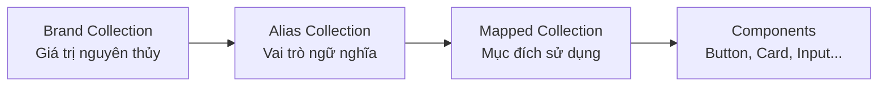
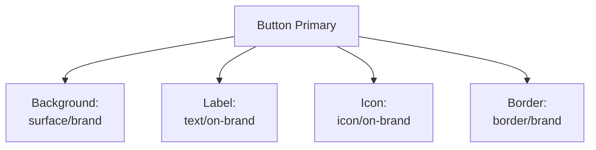
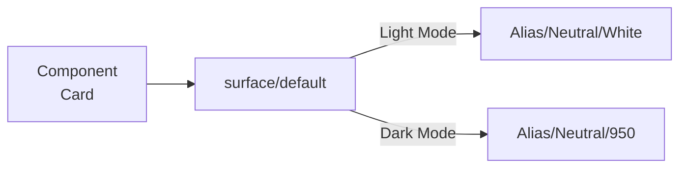
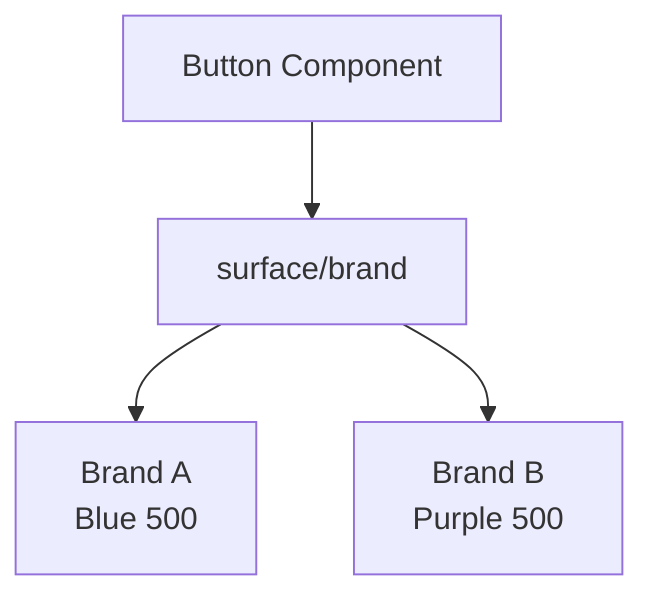
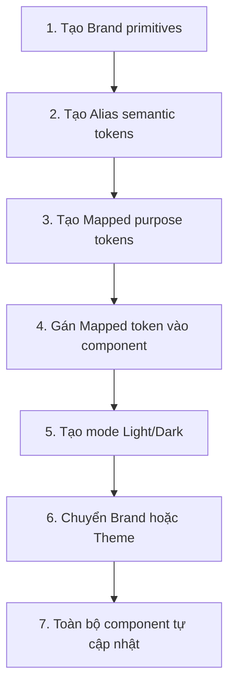

# 014 – Giới thiệu Mapped Collection

## Thông tin bài học

| Thuộc tính            | Nội dung                                                                               |
| --------------------- | -------------------------------------------------------------------------------------- |
| **Module**            | Multi-Brand, Themes & Mapped Variables                                                 |
| **Thời điểm bắt đầu** | 39:50 trong video đầy đủ                                                               |
| **Chủ đề chính**      | Giới thiệu lớp token thứ ba: **Mapped Collection**                                     |
| **Mục tiêu**          | Xây dựng các token theo mục đích sử dụng, hỗ trợ nhiều thương hiệu và Light/Dark Theme |

---

## 1. Tổng quan

**Mapped Collection** là lớp thứ ba và cũng là lớp cuối cùng trong kiến trúc design token của hệ thống.

Thay vì mô tả:

* Giá trị màu cụ thể
* Tên màu thương hiệu
* Nhóm màu ngữ nghĩa chung

Mapped token mô tả trực tiếp **mục đích sử dụng của giá trị trong giao diện**.

Ví dụ:

```text
text/primary
text/secondary
surface/default
surface/raised
icon/default
border/subtle
```

Các component trong Figma nên liên kết với Mapped token thay vì sử dụng trực tiếp Brand hoặc Alias token.

---

## 2. Kiến trúc ba lớp token

Hệ thống design token được chia thành ba lớp chính:



### Ví dụ luồng tham chiếu

```text
Brand/Neutral/900
        ↓
Alias/Neutral/Strong
        ↓
Mapped/Text/Primary
        ↓
Heading, Paragraph, Input Label
```

Khi giá trị trong Brand hoặc Alias thay đổi, các component sử dụng Mapped token sẽ tự động cập nhật.

---

## 3. Vai trò của từng lớp token

| Lớp           | Câu hỏi mà lớp token trả lời         | Ví dụ                       |
| ------------- | ------------------------------------ | --------------------------- |
| **Brand**     | Giá trị thực tế là gì?               | `brand/blue/500`            |
| **Alias**     | Giá trị này có vai trò ngữ nghĩa gì? | `alias/primary/default`     |
| **Mapped**    | Giá trị này được sử dụng ở đâu?      | `mapped/text/link`          |
| **Component** | Thành phần cụ thể sử dụng token nào? | `button/primary/background` |

### Điểm khác biệt quan trọng

* **Brand token** tập trung vào giá trị nguyên thủy.
* **Alias token** tập trung vào vai trò chung.
* **Mapped token** tập trung vào mục đích hiển thị trong giao diện.

---

## 4. Purpose-based naming và Semantic naming

### Semantic naming

Semantic naming mô tả ý nghĩa tổng quát của màu hoặc giá trị.

Ví dụ:

```text
primary
secondary
neutral
success
warning
danger
```

Các tên này chưa nói rõ token sẽ được sử dụng ở vị trí nào trong giao diện.

### Purpose-based naming

Purpose-based naming mô tả trực tiếp mục đích sử dụng.

Ví dụ:

```text
text/primary
text/secondary
text/disabled

surface/default
surface/subtle
surface/brand

border/default
border/strong
border/focus
```

### So sánh

| Semantic token      | Mapped token            |
| ------------------- | ----------------------- |
| `alias/neutral/900` | `mapped/text/primary`   |
| `alias/neutral/600` | `mapped/text/secondary` |
| `alias/neutral/100` | `mapped/surface/subtle` |
| `alias/primary/500` | `mapped/surface/brand`  |
| `alias/danger/500`  | `mapped/text/danger`    |

Mapped token giúp designer hiểu ngay một giá trị được dùng để làm gì mà không cần biết màu cụ thể phía sau.

---

## 5. Tại sao component nên sử dụng Mapped token?

Component không nên liên kết trực tiếp với các giá trị như:

```text
brand/blue/500
brand/neutral/900
alias/primary/default
```

Thay vào đó, component nên sử dụng:

```text
surface/brand
text/on-brand
border/default
icon/secondary
```

### Ví dụ với Button



Component chỉ cần biết vai trò giao diện của token.

Component không cần biết:

* Màu thực tế là xanh hay tím
* Đang sử dụng thương hiệu nào
* Giao diện đang ở Light Mode hay Dark Mode
* Mã màu HEX cụ thể là gì

---

## 6. Mapped Collection là “bảng điều khiển” của theme

Mapped Collection đóng vai trò như một **theming switchboard** – bảng điều khiển chuyển đổi giao diện.

Mỗi mode có thể ánh xạ cùng một token đến Alias token khác nhau.

### Ví dụ

| Mapped token      | Light Mode    | Dark Mode     |
| ----------------- | ------------- | ------------- |
| `text/primary`    | `neutral/900` | `neutral/50`  |
| `text/secondary`  | `neutral/600` | `neutral/300` |
| `surface/default` | `white`       | `neutral/950` |
| `surface/subtle`  | `neutral/50`  | `neutral/900` |
| `border/default`  | `neutral/300` | `neutral/700` |



Card vẫn sử dụng một token duy nhất:

```text
surface/default
```

Nhưng giá trị hiển thị tự động thay đổi theo mode.

---

## 7. Mapped token trong hệ thống nhiều thương hiệu

Mapped Collection cũng giúp hệ thống hỗ trợ nhiều thương hiệu mà không phải xây lại component.

Ví dụ, một nút Primary luôn sử dụng:

```text
surface/brand
```

Nhưng token này có thể trỏ tới màu khác nhau tùy thương hiệu.

| Mapped token    | Brand A                         | Brand B                           |
| --------------- | ------------------------------- | --------------------------------- |
| `surface/brand` | `alias/primary/500` → Blue      | `alias/primary/500` → Purple      |
| `text/link`     | `alias/primary/700` → Dark Blue | `alias/primary/700` → Dark Purple |
| `border/focus`  | `alias/primary/500` → Blue      | `alias/primary/500` → Purple      |



Component không thay đổi. Chỉ các giá trị phía dưới token được thay đổi.

---

## 8. Các nhóm token thường có trong Mapped Collection

### Text

```text
text/primary
text/secondary
text/tertiary
text/disabled
text/inverse
text/brand
text/success
text/warning
text/danger
```

### Icon

```text
icon/primary
icon/secondary
icon/disabled
icon/inverse
icon/brand
icon/success
icon/warning
icon/danger
```

### Surface

```text
surface/default
surface/subtle
surface/raised
surface/overlay
surface/inverse
surface/brand
surface/success
surface/warning
surface/danger
```

### Border

```text
border/subtle
border/default
border/strong
border/focus
border/brand
border/success
border/warning
border/danger
```

---

## 9. Cách áp dụng trong một Figma Design System thực tế

### Bước 1: Tạo Mapped Collection

Trong bảng Variables của Figma:

1. Tạo một Variable Collection mới.
2. Đặt tên là `Mapped`.
3. Thêm các mode cần thiết.

Ví dụ:

```text
Light
Dark
```

Nếu hệ thống cần kết hợp cả thương hiệu và theme, có thể sử dụng:

```text
Brand A – Light
Brand A – Dark
Brand B – Light
Brand B – Dark
```

Tuy nhiên, cần cân nhắc kiến trúc để tránh số lượng mode tăng quá lớn.

---

### Bước 2: Tạo nhóm token theo mục đích

Cấu trúc gợi ý:

```text
Mapped
├── Text
│   ├── Primary
│   ├── Secondary
│   ├── Disabled
│   └── Inverse
├── Icon
│   ├── Primary
│   ├── Secondary
│   └── Disabled
├── Surface
│   ├── Default
│   ├── Subtle
│   ├── Raised
│   └── Brand
└── Border
    ├── Subtle
    ├── Default
    ├── Strong
    └── Focus
```

---

### Bước 3: Liên kết Mapped token với Alias token

Không nhập mã màu trực tiếp vào Mapped Collection.

Ví dụ:

```text
Mapped/Text/Primary
→ Alias/Neutral/Strong
```

Trong mode khác:

```text
Mapped/Text/Primary
→ Alias/Neutral/Inverse
```

Mapped Collection nên tham chiếu tới Alias Collection, không nên tham chiếu trực tiếp đến giá trị HEX nếu không thực sự cần thiết.

---

### Bước 4: Gán token vào component

Ví dụ với Card:

```text
Card background → surface/default
Card title      → text/primary
Card body       → text/secondary
Card border     → border/subtle
Card icon       → icon/secondary
```

Ví dụ với Input:

```text
Input background    → surface/default
Input text          → text/primary
Input placeholder   → text/tertiary
Input border        → border/default
Input focused border → border/focus
Input error text    → text/danger
```

---

### Bước 5: Kiểm tra các mode

Chuyển đổi giữa:

```text
Light ↔ Dark
Brand A ↔ Brand B
```

Kiểm tra xem:

* Text có đủ độ tương phản không
* Border có còn nhìn thấy rõ không
* Surface có phân biệt được cấp độ không
* Icon có sử dụng đúng token không
* Component có còn giá trị màu hard-code không

---

## 10. Quy trình hoạt động tổng thể



---

## 11. Ví dụ hoàn chỉnh

Giả sử một đoạn văn sử dụng:

```text
text/primary
```

### Light Mode

```text
text/primary
→ alias/neutral/strong
→ brand/neutral/900
→ #171717
```

### Dark Mode

```text
text/primary
→ alias/neutral/inverse-strong
→ brand/neutral/50
→ #FAFAFA
```

Component không cần đổi token. Mapped Collection xử lý việc chuyển đổi giá trị theo theme.

---

## 12. Rủi ro và hạn chế

### 12.1. Đặt tên token quá gắn với component

Không nên đặt:

```text
card-background
header-title-color
login-button-text
```

Các tên này quá cụ thể và khó tái sử dụng.

Nên ưu tiên:

```text
surface/default
surface/raised
text/primary
text/on-brand
```

---

### 12.2. Tạo quá nhiều token gần giống nhau

Ví dụ:

```text
text/primary
text/main
text/default
text/base
```

Các token trên có thể cùng mang một ý nghĩa, gây khó hiểu cho designer và developer.

Cần định nghĩa rõ vai trò của từng token trước khi tạo.

---

### 12.3. Component bỏ qua lớp Mapped

Nếu component sử dụng trực tiếp:

```text
brand/neutral/900
```

component có thể hiển thị sai khi chuyển sang Dark Mode.

Luồng đúng nên là:

```text
Component
→ Mapped
→ Alias
→ Brand
```

---

### 12.4. Số lượng mode tăng quá lớn

Khi kết hợp nhiều brand và nhiều theme, số mode có thể tăng nhanh.

Ví dụ:

```text
3 thương hiệu × 2 theme = 6 mode
5 thương hiệu × 3 theme = 15 mode
```

Do đó, cần thiết kế cấu trúc collection hợp lý và tránh nhân bản mode không cần thiết.

---

### 12.5. Không kiểm tra contrast

Việc token tự động chuyển mode không đảm bảo giao diện luôn đáp ứng accessibility.

Cần kiểm tra:

* Text trên surface
* Icon trên surface
* Border trên background
* Trạng thái disabled
* Trạng thái hover, focus và pressed
* Nội dung hiển thị trên màu thương hiệu

---

## 13. Trả lời câu hỏi ôn tập

### Câu 1: Mục đích chính của Mapped Collection Intro là gì?

Mục đích chính là giới thiệu lớp token cuối cùng trong kiến trúc design system.

Mapped Collection:

* Mô tả mục đích sử dụng của token trong giao diện
* Liên kết với Alias Collection
* Là lớp token được component sử dụng trực tiếp
* Cho phép chuyển đổi Light/Dark Theme
* Giúp component hoạt động với nhiều thương hiệu

---

### Câu 2: Áp dụng vào một Figma Design System thực tế như thế nào?

Quy trình áp dụng:

1. Tạo collection `Mapped`.
2. Tạo các mode như Light và Dark.
3. Tổ chức token thành các nhóm Text, Icon, Surface và Border.
4. Liên kết từng Mapped token với Alias token phù hợp.
5. Gán Mapped token vào component.
6. Chuyển đổi giữa các mode để kiểm tra.
7. Loại bỏ các giá trị màu hard-code khỏi component.

---

### Câu 3: Các bước hoặc ý tưởng quan trọng trong bài là gì?

Các ý tưởng chính:

* Phân biệt semantic naming và purpose-based naming.
* Mapped token mô tả vị trí hoặc mục đích sử dụng trong giao diện.
* Component nên liên kết với Mapped token.
* Mapped Collection hoạt động như bảng điều khiển theme.
* Một component có thể sử dụng chung cho nhiều brand và nhiều theme.
* Token nên tuân theo luồng Brand → Alias → Mapped → Component.

---

### Câu 4: Rủi ro hoặc hạn chế cần lưu ý là gì?

Các rủi ro chính:

* Đặt tên token quá cụ thể theo component.
* Tạo quá nhiều token có ý nghĩa trùng nhau.
* Component liên kết trực tiếp với Brand hoặc Alias token.
* Số lượng mode tăng nhanh khi có nhiều brand và theme.
* Không kiểm tra độ tương phản và accessibility.
* Mapped Collection trở nên khó quản lý nếu không có quy tắc đặt tên rõ ràng.

---

## 14. Tóm tắt bài học

Mapped Collection là lớp kết nối giữa hệ thống token và các component thực tế.

```text
Brand → Alias → Mapped → Component
```

Trong đó:

* **Brand** lưu giá trị nguyên thủy.
* **Alias** định nghĩa vai trò ngữ nghĩa.
* **Mapped** định nghĩa mục đích sử dụng trong giao diện.
* **Component** sử dụng Mapped token để hỗ trợ theme và nhiều thương hiệu.

Mapped Collection giúp hệ thống:

* Chuyển đổi Light/Dark Mode
* Thay đổi thương hiệu
* Giảm giá trị hard-code
* Tăng khả năng tái sử dụng component
* Duy trì giao diện nhất quán
* Quản lý theme tại một vị trí trung tâm

> **Nguyên tắc quan trọng:** Component không cần biết màu thực tế là gì. Component chỉ cần biết màu đó được sử dụng để làm gì.

---

## 15. Lưu ý về phần transcript được cung cấp

Đoạn transcript cuối đang trình bày về việc xây dựng **Typography Scale**, bao gồm:

* Bắt đầu với font size cơ sở là `16px`
* Sử dụng tỷ lệ **Major Third**
* Làm tròn kích thước chữ theo lưới `4px`
* Chuyển các giá trị như `25px` thành `24px`
* Chuyển `31.25px` thành `32px`
* Tạo thang chữ dễ sử dụng trong Figma

Ví dụ thang chữ được nhắc đến:

| Cấp độ    | Giá trị từ công cụ | Giá trị làm tròn theo lưới 4px |
| --------- | -----------------: | -----------------------------: |
| Paragraph |               16px |                           16px |
| H6        |               20px |                           20px |
| H5        |               25px |                           24px |
| H4        |            31.25px |                           32px |

Nội dung này phù hợp hơn với một bài học về:

```text
Typography Scale
Font-size Variables
Building a Type Scale
```

và không trực tiếp thuộc chủ đề Mapped Collection.

---

# Bài luyện tập

## Mục tiêu


## Đề bài


## Yêu cầu hoàn thành

- [ ] 
- [ ] 
- [ ] 

## Kết quả / lời giải


## Ghi chú
